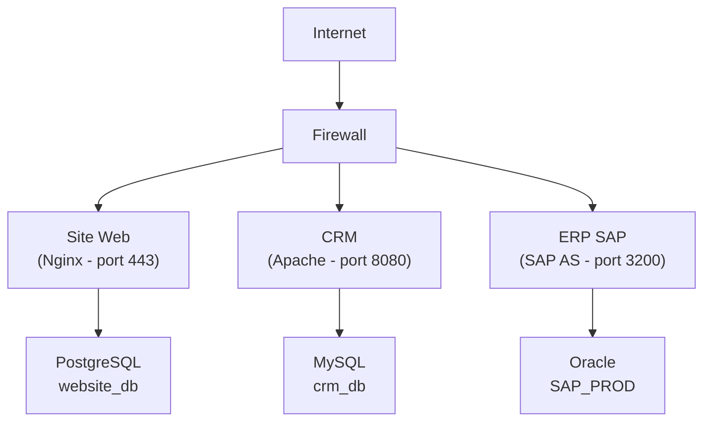

---
tags:
  - Certification
  - Débutant
  - Pratique
description: "BC01 - 03 - L'Analyse de Faisabilité et Cartographie SI"
estimated_time: "30 min"
fiche_number: 3
total_fiches: 3
cursus: "BC01 - Besoins utilisateurs"
---

# BC01 - 03 - L'Analyse de Faisabilité et Cartographie SI

> **En bref** : À la fin de cette fiche, tu sauras évaluer la faisabilité d'un projet informatique sous ses aspects technique, organisationnel et économique, et réaliser une cartographie du système d'information existant. Lecture estimée : 30 min.


## Prérequis

- Fiche **[BC01 - 01 - Le Cahier des Charges Technique](01-cahier-des-charges.md)**
- Fiche **[BC01 - 02 - L'Étude de Marché](02-etude-de-marche.md)**

## Objectif de cette fiche

À la fin de cette fiche, tu sauras évaluer la faisabilité d'un projet informatique sous ses aspects technique, organisationnel et économique, et réaliser une cartographie du système d'information existant.

---

## Concepts

### Qu'est-ce qu'une analyse de faisabilité ?

**Définition** : Une analyse de faisabilité est une étude qui détermine si un projet peut être réalisé avec succès, en évaluant les contraintes techniques, les ressources disponibles, les délais, et les coûts.

**Le problème que l'analyse de faisabilité résout** :

Sans analyse de faisabilité, voici les problèmes rencontrés :

1. **Projet impossible** : Tu découvres en cours de route que le projet est techniquement irréalisable.
2. **Budget explosé** : Les coûts réels dépassent largement les estimations.
3. **Délais non tenus** : Le planning était irréaliste dès le départ.
4. **Ressources manquantes** : Tu n'as pas les compétences ou les outils nécessaires.

**Comment l'analyse de faisabilité résout ces problèmes** :

| Problème | Solution apportée |
| -------- | ----------------- |
| Projet impossible | Identifier les obstacles techniques avant de commencer |
| Budget explosé | Estimer les coûts de manière réaliste |
| Délais non tenus | Évaluer le temps nécessaire avec des marges |
| Ressources manquantes | Inventorier les compétences et outils disponibles |

**Analogie concrète** : Avant de partir en randonnée en montagne, tu vérifies : est-ce que j'ai le niveau physique (faisabilité technique) ? Est-ce que j'ai le matériel (ressources) ? Est-ce que j'ai assez de temps avant la nuit (délais) ? Est-ce que j'ai assez d'argent pour le refuge (budget) ? L'analyse de faisabilité, c'est cette vérification avant de s'engager.

**Ce qu'une analyse de faisabilité n'est PAS** :

- Ce n'est pas une garantie de succès. Un projet "faisable" peut quand même échouer si mal exécuté.
- Ce n'est pas un document figé. Elle doit être mise à jour si les conditions changent.

---

### Quels sont les types de faisabilité ?

**Définition** : La faisabilité s'évalue selon plusieurs dimensions complémentaires.

| Type | Question posée | Exemple |
| ---- | -------------- | ------- |
| Technique | Peut-on le construire ? | Les technologies existent-elles ? |
| Organisationnelle | A-t-on les compétences ? | L'équipe maîtrise-t-elle les outils ? |
| Économique | A-t-on le budget ? | Le coût est-il acceptable ? |
| Temporelle | A-t-on le temps ? | Le délai est-il réaliste ? |
| Légale | Est-ce autorisé ? | Y a-t-il des contraintes RGPD ? |

**Chaque type peut avoir 3 conclusions** :

| Conclusion | Signification | Action |
| ---------- | ------------- | ------ |
| Faisable | Aucun obstacle majeur | Go |
| Faisable sous conditions | Obstacles surmontables | Go avec plan de mitigation |
| Non faisable | Obstacles insurmontables | No-Go ou redéfinir le périmètre |

---

### Qu'est-ce qu'une cartographie du SI ?

**Définition** : Une cartographie du système d'information est une représentation visuelle et documentée de tous les composants du SI (applications, bases de données, serveurs, flux de données) et de leurs interactions.

**Le problème que la cartographie résout** :

Sans cartographie, voici les problèmes rencontrés :

1. **Vision floue** : Personne ne sait exactement ce qui existe dans le SI.
2. **Impact inconnu** : Modifier un composant peut casser d'autres systèmes.
3. **Redondances** : Plusieurs applications font la même chose sans le savoir.
4. **Risques cachés** : Des systèmes critiques non identifiés ne sont pas sauvegardés.

**Comment la cartographie résout ces problèmes** :

| Problème | Solution |
| -------- | -------- |
| Vision floue | Inventaire complet et visuel |
| Impact inconnu | Visualisation des dépendances |
| Redondances | Identification des doublons |
| Risques cachés | Mise en évidence des points critiques |

**Analogie concrète** : La cartographie SI est comme le plan d'une maison avec tous les réseaux : électricité, plomberie, gaz. Avant de percer un mur, tu regardes le plan pour ne pas toucher un tuyau. Avant de modifier une application, tu regardes la cartographie pour voir ce qui est connecté.

---

## Étapes Pratiques

### Étape 1 : Évaluer la faisabilité technique

Analyse si le projet est techniquement réalisable :

```markdown
## Faisabilité technique

### Technologies requises

| Besoin | Technologie envisagée | Existe ? | Maîtrisée ? | Alternative |
| ------ | --------------------- | -------- | ----------- | ----------- |
| [Besoin 1] | [Techno] | Oui/Non | Oui/Non | [Alternative] |
| [Besoin 2] | [Techno] | Oui/Non | Oui/Non | [Alternative] |

### Contraintes techniques identifiées

| Contrainte | Impact | Contournable ? | Solution proposée |
| ---------- | ------ | -------------- | ----------------- |
| [Contrainte 1] | Fort/Moyen/Faible | Oui/Non | [Solution] |
| [Contrainte 2] | Fort/Moyen/Faible | Oui/Non | [Solution] |

### Preuves de concept nécessaires (POC)

| POC | Objectif | Durée estimée | Critère de succès |
| --- | -------- | ------------- | ----------------- |
| [POC 1] | Valider que [X] est possible | [Durée] | [Critère mesurable] |

### Conclusion faisabilité technique

- [ ] Faisable
- [ ] Faisable sous conditions : [conditions]
- [ ] Non faisable : [raison]
```

**Exemple concret** :

```markdown
## Faisabilité technique

### Technologies requises

| Besoin | Technologie envisagée | Existe ? | Maîtrisée ? | Alternative |
| ------ | --------------------- | -------- | ----------- | ----------- |
| API REST | Symfony API Platform | Oui | Oui | - |
| Temps réel | WebSockets (Mercure) | Oui | Non | Polling AJAX |
| Export PDF | DomPDF | Oui | Oui | - |
| Reconnaissance image | TensorFlow | Oui | Non | API externe (Google Vision) |

### Contraintes techniques identifiées

| Contrainte | Impact | Contournable ? | Solution proposée |
| ---------- | ------ | -------------- | ----------------- |
| WebSockets non maîtrisé | Moyen | Oui | Formation équipe (2 jours) ou utiliser polling |
| Serveur existant limité à 2Go RAM | Fort | Oui | Upgrade serveur ou optimisation mémoire |

### Preuves de concept nécessaires

| POC | Objectif | Durée estimée | Critère de succès |
| --- | -------- | ------------- | ----------------- |
| POC Mercure | Valider la communication temps réel | 2 jours | Notification reçue en < 1 seconde |

### Conclusion faisabilité technique

☑ Faisable sous conditions :
- Formation Mercure/WebSockets pour l'équipe
- Upgrade serveur à 4Go RAM minimum
```

---

### Étape 2 : Évaluer la faisabilité organisationnelle

Analyse les ressources humaines et les compétences :

```markdown
## Faisabilité organisationnelle

### Compétences requises vs disponibles

| Compétence | Niveau requis | Disponible en interne ? | Action si manquante |
| ---------- | ------------- | ----------------------- | ------------------- |
| PHP/Symfony | Confirmé | Oui (2 personnes) | - |
| DevOps/Docker | Intermédiaire | Non | Formation ou recrutement |
| UX Design | Intermédiaire | Non | Sous-traitance |

### Disponibilité de l'équipe

| Ressource | Disponibilité | Période d'indisponibilité |
| --------- | ------------- | ------------------------- |
| Développeur 1 | 80% | Congés août |
| Développeur 2 | 100% | - |
| Chef de projet | 50% | - |

### Risques organisationnels

| Risque | Probabilité | Impact | Mitigation |
| ------ | ----------- | ------ | ---------- |
| Départ d'un développeur clé | Moyenne | Fort | Documentation, pair programming |
| Surcharge de travail | Haute | Moyen | Planning avec marges |

### Conclusion faisabilité organisationnelle

- [ ] Faisable
- [ ] Faisable sous conditions : [conditions]
- [ ] Non faisable : [raison]
```

---

### Étape 3 : Évaluer la faisabilité économique

Estime les coûts et compare au budget disponible :

```markdown
## Faisabilité économique

### Estimation des coûts

| Poste | Détail | Coût estimé | Hypothèses |
| ----- | ------ | ----------- | ---------- |
| Développement | 3 développeurs x 4 mois | 60 000 € | TJM 500€, 20j/mois |
| Infrastructure | Serveurs cloud | 200 €/mois | 2 serveurs AWS t3.medium |
| Licences | Outils payants | 500 € | IDE, monitoring |
| Formation | DevOps | 2 000 € | 2 personnes, 2 jours |
| Marge imprévus | 15% du total | 9 405 € | Standard projet IT |
| **TOTAL** | | **72 105 €** | |

### Budget disponible

| Source | Montant |
| ------ | ------- |
| Budget projet | 80 000 € |
| **Écart** | **+7 895 €** (marge positive) |

### Retour sur investissement (ROI)

| Élément | Valeur |
| ------- | ------ |
| Coût du projet | 72 105 € |
| Économie annuelle estimée | 25 000 € |
| Délai de rentabilité | 2.9 ans |

### Conclusion faisabilité économique

☑ Faisable : Le budget est suffisant avec une marge de 10%.
```

---

### Étape 4 : Réaliser une cartographie du SI existant

Documente le système d'information actuel :

```markdown
## Cartographie du SI existant

### Inventaire des applications

| Application | Type | Description | Criticité | Responsable |
| ----------- | ---- | ----------- | --------- | ----------- |
| ERP SAP | Progiciel | Gestion commerciale | Critique | DSI |
| Site web | Web app | Vitrine + e-commerce | Haute | Marketing |
| CRM interne | Web app | Gestion clients | Moyenne | Commercial |
| Excel RH | Fichier | Suivi des congés | Basse | RH |

### Inventaire des bases de données

| Base | Type | Application(s) | Volume | Sauvegarde |
| ---- | ---- | -------------- | ------ | ---------- |
| SAP_PROD | Oracle | ERP SAP | 50 Go | Quotidienne |
| website_db | PostgreSQL | Site web | 2 Go | Quotidienne |
| crm_db | MySQL | CRM interne | 500 Mo | Hebdomadaire |

### Flux de données

| Source | Destination | Type de données | Fréquence | Protocole |
| ------ | ----------- | --------------- | --------- | --------- |
| Site web | ERP | Commandes | Temps réel | API REST |
| ERP | CRM | Clients | Quotidien | Export CSV |
| CRM | Email | Newsletters | Hebdo | SMTP |
```

#### Schéma d'architecture actuel



**Légende** :

- `→` = Flux de données
- `│` = Connexion réseau

---

### Étape 5 : Identifier les impacts et dépendances

Analyse comment le nouveau projet s'intègre dans le SI existant :

```markdown
## Analyse d'impact

### Systèmes impactés par le projet

| Système | Type d'impact | Description | Action requise |
| ------- | ------------- | ----------- | -------------- |
| ERP SAP | Intégration | Nouvelle API de commandes | Développer connecteur |
| CRM | Migration | Les données clients migrent vers le nouveau système | Plan de migration |
| Site web | Aucun | Pas d'interaction prévue | - |

### Dépendances du projet

| Le projet dépend de... | Pour... | Risque si indisponible |
| ---------------------- | ------- | ---------------------- |
| API ERP SAP | Récupérer les stocks | Fonctionnement dégradé |
| Base clients CRM | Migration initiale | Retard au démarrage |
| Serveur mail | Notifications | Notifications non envoyées |

### Matrice RACI

| Tâche | Responsable | Approbateur | Consulté | Informé |
| ----- | ----------- | ----------- | -------- | ------- |
| Développement | Équipe dev | Tech Lead | Architecte | Client |
| Tests | QA | Chef de projet | Équipe dev | Client |
| Mise en production | DevOps | DSI | Tous | Tous |
| Formation utilisateurs | Chef de projet | Client | - | Équipe dev |
```

---

## Commandes Utiles

Cette fiche ne contient pas de commandes car elle porte sur l'analyse et la documentation.

---

## Pièges Fréquents

### Piège 1 : Sous-estimer systématiquement les coûts et délais

⚠️ **Problème** : Les développeurs ont tendance à être optimistes. Un projet estimé à 2 mois en prend souvent 4.

✅ **Solution** : Appliquer une marge de sécurité de 30-50% sur les estimations initiales.

```markdown
<!-- ❌ Estimation optimiste -->
Développement : 20 jours
Total : 20 jours

<!-- ✅ Estimation réaliste -->
Développement : 20 jours
Marge imprévus (50%) : 10 jours
Total : 30 jours
```

---

### Piège 2 : Ignorer les dépendances

⚠️ **Problème** : Un composant externe peut bloquer tout le projet s'il n'est pas disponible.

✅ **Solution** : Identifier toutes les dépendances et prévoir des alternatives.

```markdown
| Dépendance | Alternative si indisponible |
| ---------- | --------------------------- |
| API externe | Cache local + mode dégradé |
| Compétence manquante | Formation ou sous-traitance |
```

---

### Piège 3 : Faire une cartographie trop détaillée

⚠️ **Problème** : Documenter chaque serveur et chaque paramètre prend un temps infini et devient obsolète.

✅ **Solution** : Se concentrer sur les composants critiques et les flux principaux.

---

### Piège 4 : Valider la faisabilité sans consulter les parties prenantes

⚠️ **Problème** : Tu conclus que le projet est faisable, mais le client n'a pas validé le budget.

✅ **Solution** : Faire valider chaque type de faisabilité par la personne concernée.

| Type de faisabilité | Validateur |
| ------------------- | ---------- |
| Technique | Architecte / Tech Lead |
| Organisationnelle | Manager / RH |
| Économique | Direction / Client |
| Légale | Juridique / DPO |

---

## Checklist de Validation

- [ ] Je comprends les 5 types de faisabilité (technique, orga, éco, temps, légale)
- [ ] Je sais créer un tableau d'estimation des coûts
- [ ] Je sais évaluer les compétences requises vs disponibles
- [ ] Je sais réaliser une cartographie du SI (applications, bases, flux)
- [ ] Je sais identifier les dépendances et leurs alternatives
- [ ] Je sais conclure sur un Go/No-Go argumenté

---

## Exercice Pratique

**Énoncé** : Une PME de 50 personnes veut remplacer son système de gestion des notes de frais (actuellement Excel) par une application web. Réalise une analyse de faisabilité simplifiée.

**Indications** :

1. Évalue la faisabilité technique (3 contraintes minimum)
2. Évalue la faisabilité organisationnelle (compétences, équipe)
3. Estime le coût du projet (5 postes de coût minimum)
4. Cartographie les 3 systèmes existants concernés
5. Conclus avec une recommandation Go/No-Go

**Résultat attendu** : Un document d'environ 80-100 lignes.

---

## Solution de l'Exercice

> **Note** : Cette section contient une solution possible. Essaie d'abord de résoudre l'exercice par toi-même.

---

````markdown
# Analyse de Faisabilité - Application Notes de Frais

## 1. Faisabilité technique

### Contraintes identifiées

| Contrainte | Impact | Solution |
| ---------- | ------ | -------- |
| Hébergement interne uniquement (politique sécurité) | Moyen | Déployer sur serveur existant ou nouveau serveur |
| Intégration avec logiciel comptable (Sage) | Fort | Vérifier existence API Sage ou export CSV |
| Photos de justificatifs depuis mobile | Moyen | Site responsive avec upload photo |
| Pas de connexion internet dans certains locaux | Moyen | Mode hors-ligne avec synchronisation |

### POC requis

| POC | Durée | Objectif |
| --- | ----- | -------- |
| Export vers Sage | 2 jours | Valider le format d'import Sage |

### Conclusion : ☑ Faisable sous condition de valider l'intégration Sage

## 2. Faisabilité organisationnelle

### Compétences

| Compétence | Requise | Disponible | Action |
| ---------- | ------- | ---------- | ------ |
| PHP/Symfony | Confirmé | Non (équipe IT généraliste) | Sous-traitance développement |
| Administration système | Intermédiaire | Oui | - |
| Formation utilisateurs | Basique | Oui | Chef de projet |

### Équipe projet

| Rôle | Personne | Disponibilité |
| ---- | -------- | ------------- |
| Chef de projet | Marie (DAF) | 20% |
| Référent IT | Jean (DSI) | 10% |
| Prestataire dev | À recruter | 100% |

### Conclusion : ☑ Faisable avec sous-traitance du développement

## 3. Faisabilité économique

### Estimation des coûts

| Poste | Détail | Coût |
| ----- | ------ | ---- |
| Développement | Prestataire 30 jours x 400€ | 12 000 € |
| Serveur | VM dédiée 1 an | 600 € |
| Formation | 2 sessions x 0.5 jour | 500 € |
| Recette/Tests | Temps interne 5 jours | 1 500 € |
| Maintenance an 1 | Support prestataire | 2 000 € |
| Marge imprévus | 20% | 3 320 € |
| **TOTAL** | | **19 920 €** |

### Budget disponible : 25 000 €
### Écart : +5 080 € (marge confortable)

### ROI

| Élément | Valeur |
| ------- | ------ |
| Coût actuel (temps perdu sur Excel) | 8 000 €/an |
| Coût projet | 19 920 € |
| Délai de rentabilité | 2.5 ans |

### Conclusion : ☑ Faisable

## 4. Cartographie SI concerné

| Système | Impact | Intégration |
| ------- | ------ | ----------- |
| Excel notes de frais | Remplacement | Migration données historiques |
| Sage Comptabilité | Intégration | Export mensuel des écritures |
| Active Directory | Intégration | Authentification SSO |

### Flux de données

```text
Utilisateur → [App Notes de Frais] → Export CSV → [Sage Compta]
                      ↑
              [Active Directory] (authentification)
```

## 5. Conclusion et Recommandation

### Synthèse

| Type | Conclusion |
| ---- | ---------- |
| Technique | Faisable sous conditions |
| Organisationnelle | Faisable avec sous-traitance |
| Économique | Faisable |

### Recommandation

**☑ GO** sous réserve de :

1. Valider l'intégration Sage via POC (2 jours)
2. Recruter un prestataire Symfony
3. Obtenir validation DSI pour le nouveau serveur

````

---

## Navigation

← Fiche précédente : **[BC01 - 02 - L'Étude de Marché et Veille Technologique](02-etude-de-marche.md)**
