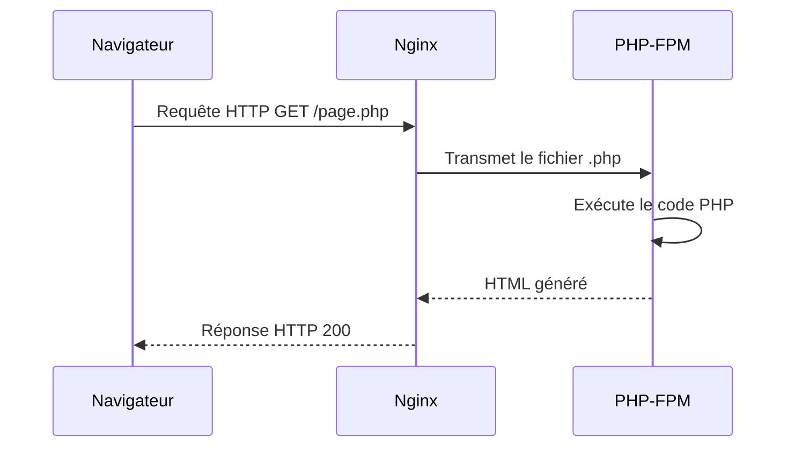

---
tags:
  - PHP
  - Débutant
  - Concept
description: "Introduction à PHP et premiers pas"
estimated_time: "55 min"
fiche_number: 1
total_fiches: 14
cursus: "PHP"
---

# 01 - Introduction à PHP et premiers pas

> **En bref** : À la fin de cette fiche, tu sauras créer un fichier PHP, y écrire du code simple, et voir le résultat dans ton navigateur via Docker. Lecture estimée : 55 min.


## Prérequis

- Fiche [01-docker/01 - Créer un environnement Docker Compose pour Symfony](../01-docker/01-docker-compose-symfony.md)
- Fiche [01-docker/02 - Lancer le projet et initialiser Git](../01-docker/02-lancement-projet-git.md)
- Aucune connaissance préalable de PHP n'est requise (tout est expliqué ci-dessous)

## Version utilisée dans cette fiche

| Technologie | Version |
| ----------- | ------- |
| PHP         | 8.3     |

## Objectif de cette fiche

À la fin de cette fiche, tu sauras créer un fichier PHP, y écrire du code simple, et voir le résultat dans ton navigateur via Docker.

---

## Concepts

Cette section explique tous les concepts nécessaires. Lis-la entièrement avant de passer aux étapes pratiques.

### Qu'est-ce que PHP ?

**Définition** : PHP est un langage de programmation utilisé pour créer des sites web dynamiques. Le code PHP s'exécute sur le serveur (pas dans le navigateur) et génère du HTML qui est envoyé au visiteur.

**Le problème que PHP résout** :

Sans PHP (ou un langage similaire), voici les problèmes rencontrés :

1. **Pages statiques uniquement** : Tu ne peux créer que des pages HTML fixes. Le contenu est le même pour tous les visiteurs, tout le temps.

2. **Pas d'interaction avec une base de données** : Impossible d'afficher une liste de produits depuis une base de données, ou de sauvegarder les informations d'un formulaire.

3. **Pas de personnalisation** : Tu ne peux pas afficher "Bonjour Marie" pour Marie et "Bonjour Pierre" pour Pierre. Tout le monde voit la même chose.

4. **Pas de logique** : Tu ne peux pas faire de calculs, de vérifications, ou prendre des décisions selon les données.

**Comment PHP résout ces problèmes** :

| Problème                          | Solution PHP                                                  |
| --------------------------------- | ------------------------------------------------------------- |
| Pages statiques                   | PHP génère du HTML différent à chaque requête                 |
| Pas d'interaction base de données | PHP se connecte aux bases de données et lit/écrit des données |
| Pas de personnalisation           | PHP peut adapter le contenu selon l'utilisateur connecté      |
| Pas de logique                    | PHP permet d'écrire des conditions, des boucles, des calculs  |

**Analogie concrète** : Imagine un restaurant. Le HTML seul, c'est comme un menu imprimé : il est fixe, identique pour tout le monde. PHP, c'est comme un chef cuisinier : il prend ta commande (la requête), consulte les ingrédients disponibles (la base de données), prépare ton plat (exécute le code), et te sert un repas personnalisé (génère le HTML).

**Ce que PHP n'est PAS** :

- PHP n'est pas un langage qui s'exécute dans le navigateur. C'est JavaScript qui s'exécute dans le navigateur. PHP s'exécute sur le serveur, avant que la page arrive dans ton navigateur.
- PHP n'est pas un framework. PHP est le langage de base. Symfony est un framework construit avec PHP (tu apprendras Symfony plus tard).

**Comparaison : côté serveur vs côté client** :

| Côté serveur (PHP)                     | Côté client (JavaScript)                 |
| -------------------------------------- | ---------------------------------------- |
| S'exécute sur le serveur               | S'exécute dans le navigateur             |
| Le visiteur ne voit jamais le code PHP | Le visiteur peut voir le code JS         |
| Peut accéder à la base de données      | Ne peut pas accéder directement à la BDD |
| Génère le HTML avant envoi             | Modifie le HTML après réception          |

---

### Comment fonctionne PHP avec Docker ?

**Le parcours d'une requête** :

Quand tu tapes une adresse dans ton navigateur, voici ce qui se passe (étape par étape) :

1. **Ton navigateur** envoie une requête HTTP (exemple : `http://localhost:8080/test.php`)
2. **Nginx** (le serveur web dans Docker) reçoit la requête
3. **Nginx** voit que c'est un fichier `.php` et transmet la requête à **PHP-FPM**
4. **PHP-FPM** exécute le code PHP contenu dans le fichier `test.php`
5. **PHP** génère du texte (souvent du HTML)
6. **PHP-FPM** renvoie ce texte à **Nginx**
7. **Nginx** renvoie le texte à **ton navigateur**
8. **Ton navigateur** affiche le résultat

Le diagramme suivant résume ce parcours :



**Où se trouvent tes fichiers PHP ?**

Dans ton projet Docker Symfony, les fichiers PHP accessibles par le navigateur se trouvent dans le dossier `public/`. Ce dossier est la "racine web" : c'est le seul dossier visible depuis l'extérieur.

| Chemin du fichier            | URL pour y accéder               |
| ---------------------------- | -------------------------------- |
| `public/index.php`           | `http://localhost:8080/`         |
| `public/test.php`            | `http://localhost:8080/test.php` |
| `src/Controller/MonCode.php` | Non accessible par URL (privé)   |

---

### Les balises PHP

**Définition** : Les balises PHP délimitent le code PHP dans un fichier. Tout ce qui est entre `<?php` et `?>` est du code PHP. Tout ce qui est en dehors est du texte brut (HTML, par exemple).

**La balise d'ouverture** : `<?php`

Cette balise indique : "À partir d'ici, c'est du code PHP".

**La balise de fermeture** : `?>`

Cette balise indique : "Le code PHP s'arrête ici".

**Règle importante** : Dans un fichier qui contient uniquement du PHP (pas de HTML après), tu ne dois **pas** mettre la balise de fermeture `?>`. C'est une convention de PHP pour éviter des problèmes.

| Type de fichier                 | Balise de fermeture `?>` |
| ------------------------------- | ------------------------ |
| Fichier PHP pur (classes, etc.) | Non, ne pas la mettre    |
| Fichier PHP mélangé avec HTML   | Oui, obligatoire         |

**Exemple de fichier PHP pur** (comme les fichiers Symfony) :

```php
<?php
// Tout le fichier est du PHP
// Pas de balise de fermeture à la fin
```

**Exemple de fichier PHP mélangé avec HTML** :

```php
<!DOCTYPE html>
<html>
<head>
    <title>Ma page</title>
</head>
<body>
    <h1><?php echo "Bonjour"; ?></h1>
</body>
</html>
```

---

### La fonction echo

**Définition** : `echo` est une instruction PHP qui affiche du texte. Le texte affiché par `echo` est envoyé au navigateur et apparaît dans la page.

**Syntaxe** :

```php
<?php
echo "Le texte à afficher";
```

**Règles de syntaxe** :

1. Le texte doit être entre guillemets doubles `"texte"` ou simples `'texte'`
2. Chaque instruction PHP se termine par un point-virgule `;`
3. Les guillemets doubles permettent d'inclure des variables (tu verras ça plus tard)

**Exemples** :

```php
<?php
// Affiche : Bonjour
echo "Bonjour";

// Affiche : Bienvenue sur mon site
echo "Bienvenue sur mon site";

// Affiche du HTML (le navigateur l'interprète)
echo "<h1>Titre</h1>";

// Affiche sur plusieurs lignes avec \n (retour à la ligne)
echo "Ligne 1\nLigne 2";
```

**Ce que echo n'est PAS** :

- `echo` n'est pas une fonction (techniquement). C'est une "construction de langage". En pratique, tu l'utilises comme une fonction, mais tu peux omettre les parenthèses.
- `echo` n'ajoute pas automatiquement de retour à la ligne. Si tu veux un retour à la ligne dans le HTML, utilise `<br>`. Si tu veux un retour à la ligne dans le code source, utilise `\n`.

---

### Les commentaires en PHP

**Définition** : Un commentaire est du texte ignoré par PHP. Il sert à expliquer le code pour les humains qui le lisent. Les commentaires n'apparaissent pas dans la page web.

**Pourquoi utiliser des commentaires ?**

1. **Expliquer le code** : Dire pourquoi tu fais quelque chose, pas juste ce que tu fais
2. **Se souvenir** : Quand tu reviens sur ton code 3 mois plus tard, les commentaires t'aident à comprendre
3. **Communiquer** : Les autres développeurs qui lisent ton code comprennent ton intention

**Les trois types de commentaires** :

| Type         | Syntaxe             | Utilisation                                        |
| ------------ | ------------------- | -------------------------------------------------- |
| Ligne simple | `// commentaire`    | Pour une courte explication sur une ligne          |
| Ligne simple | `# commentaire`     | Alternative (moins utilisée en PHP)                |
| Multi-lignes | `/* commentaire */` | Pour des explications longues sur plusieurs lignes |

**Exemples** :

```php
<?php
// Ceci est un commentaire sur une ligne
echo "Bonjour";

# Ceci est aussi un commentaire (style moins courant)
echo "Au revoir";

/*
Ceci est un commentaire
sur plusieurs lignes.
Utile pour des explications longues.
*/
echo "Fin";

echo "Test"; // Commentaire à la fin d'une ligne de code
```

**Bonnes pratiques pour les commentaires** :

| Faire                                                 | Ne pas faire                                  |
| ----------------------------------------------------- | --------------------------------------------- |
| Expliquer le "pourquoi"                               | Expliquer le "quoi" évident                   |
| `// On vérifie l'âge car les mineurs n'ont pas accès` | `// On affiche bonjour` (inutile, on le voit) |

---

### Le point-virgule

**Définition** : En PHP, chaque instruction doit se terminer par un point-virgule `;`. Le point-virgule indique à PHP que l'instruction est terminée.

**Analogie concrète** : Le point-virgule en PHP est comme le point à la fin d'une phrase en français. Il marque la fin d'une instruction. Sans lui, PHP ne sait pas où s'arrête l'instruction.

**Règle** : Oublier un point-virgule provoque une erreur. C'est l'une des erreurs les plus fréquentes chez les débutants.

**Exemples** :

```php
<?php
// Correct : point-virgule à la fin
echo "Bonjour";
echo "Au revoir";

// Incorrect : point-virgule manquant (provoque une erreur)
// echo "Bonjour"
// echo "Au revoir";
```

**Exception** : La dernière instruction avant `?>` peut omettre le point-virgule (mais c'est déconseillé pour la cohérence).

---

## Étapes Pratiques

### Étape 1 : Vérifier que Docker est lancé

Avant de créer un fichier PHP, assure-toi que ton environnement Docker fonctionne.

Ouvre un terminal et tape :

```bash
# Affiche les conteneurs en cours d'exécution
docker compose ps
```

**Résultat attendu** :

```text
NAME                STATUS              PORTS
symfony_database    Up                  0.0.0.0:5432->5432/tcp
symfony_nginx       Up                  0.0.0.0:8080->80/tcp
symfony_php         Up                  9000/tcp
```

Si les conteneurs ne sont pas lancés (STATUS différent de "Up"), lance-les :

```bash
# Lance tous les conteneurs définis dans docker-compose.yml
docker compose up -d
```

---

### Étape 2 : Créer ton premier fichier PHP

Crée un fichier `test.php` dans le dossier `public/` de ton projet.

1. Ouvre VS Code
2. Ouvre ton projet (le dossier qui contient `docker-compose.yml`)
3. Dans l'arborescence de gauche, fais un clic droit sur le dossier `public/`
4. Clique sur "Nouveau fichier"
5. Nomme le fichier `test.php`

**Contenu à écrire dans le fichier** :

```php
<?php
// Mon premier fichier PHP
// Ce fichier affiche un message simple

echo "Bonjour, ceci est ma première page PHP !";
```

**Explication ligne par ligne** :

| Ligne                                              | Explication                              |
| -------------------------------------------------- | ---------------------------------------- |
| `<?php`                                            | Ouvre le bloc de code PHP                |
| `// Mon premier fichier PHP`                       | Commentaire expliquant le but du fichier |
| `// Ce fichier affiche un message simple`          | Commentaire supplémentaire               |
| `echo "Bonjour, ceci est ma première page PHP !";` | Affiche le texte entre guillemets        |

---

### Étape 3 : Voir le résultat dans le navigateur

1. Ouvre ton navigateur web (Chrome, Firefox, Safari...)
2. Tape dans la barre d'adresse : `http://localhost:8080/test.php`
3. Appuie sur Entrée

**Résultat attendu** :

```text
Bonjour, ceci est ma première page PHP !
```

**Ce qui s'est passé** :

1. Ton navigateur a demandé le fichier `test.php` à `localhost:8080`
2. Nginx a reçu la requête et l'a transmise à PHP-FPM
3. PHP a exécuté le code et a généré le texte "Bonjour, ceci est ma première page PHP !"
4. Ce texte a été renvoyé à ton navigateur
5. Ton navigateur l'a affiché

---

### Étape 4 : Afficher du HTML avec PHP

Modifie le fichier `public/test.php` pour générer du HTML :

```php
<?php
// Ce fichier génère une page HTML complète

echo "<!DOCTYPE html>";
echo "<html>";
echo "<head>";
echo "<title>Ma page PHP</title>";
echo "</head>";
echo "<body>";
echo "<h1>Bienvenue</h1>";
echo "<p>Cette page est générée par PHP.</p>";
echo "</body>";
echo "</html>";
```

**Résultat attendu dans le navigateur** :

Tu verras une page avec :

- Un titre dans l'onglet : "Ma page PHP"
- Un grand titre : "Bienvenue"
- Un paragraphe : "Cette page est générée par PHP."

**Astuce** : Fais un clic droit sur la page et choisis "Afficher le code source". Tu verras le HTML généré par PHP, pas le code PHP lui-même. Le code PHP reste invisible pour le visiteur.

---

### Étape 5 : Mélanger PHP et HTML

Il existe une façon plus lisible d'écrire du HTML avec PHP. Au lieu de mettre tout le HTML dans des `echo`, tu peux sortir du mode PHP :

Crée un nouveau fichier `public/melange.php` :

```php
<!DOCTYPE html>
<html>
<head>
    <title>PHP et HTML mélangés</title>
</head>
<body>
    <h1>Informations</h1>

    <p>Date actuelle : <?php echo date("d/m/Y"); ?></p>

    <p>Heure actuelle : <?php echo date("H:i:s"); ?></p>

    <p>Ce texte est du HTML normal.</p>
</body>
</html>
```

**Explication** :

- Le HTML est écrit directement, sans `echo`
- Quand tu veux insérer du PHP, tu ouvres `<?php`, tu écris le code, et tu fermes `?>`
- `date("d/m/Y")` est une fonction PHP qui retourne la date au format jour/mois/année
- `date("H:i:s")` retourne l'heure au format heures:minutes:secondes

**Résultat attendu** :

Ouvre `http://localhost:8080/melange.php` dans ton navigateur. Tu verras la date et l'heure actuelles. Si tu rafraîchis la page, l'heure change. C'est ça, une page dynamique.

---

### Étape 6 : Provoquer et comprendre une erreur

Pour apprendre à lire les erreurs, provoquons-en une volontairement.

Crée un fichier `public/erreur.php` avec ce code (le point-virgule manque volontairement) :

```php
<?php
// Ce code contient une erreur volontaire
echo "Ligne 1"
echo "Ligne 2";
```

**Résultat attendu dans le navigateur** :

```text
Parse error: syntax error, unexpected token "echo", expecting "," or ";" in /var/www/html/public/erreur.php on line 4
```

**Comment lire ce message d'erreur** :

| Partie du message                 | Signification                                      |
| --------------------------------- | -------------------------------------------------- |
| `Parse error`                     | Type d'erreur : PHP n'a pas compris la syntaxe     |
| `syntax error`                    | Erreur de syntaxe (faute de "grammaire" PHP)       |
| `unexpected token "echo"`         | PHP ne s'attendait pas à voir `echo` à cet endroit |
| `expecting "," or ";"`            | PHP attendait une virgule ou un point-virgule      |
| `/var/www/html/public/erreur.php` | Chemin du fichier contenant l'erreur               |
| `on line 4`                       | L'erreur est à la ligne 4 (ou juste avant)         |

**Comment corriger** :

1. Va à la ligne indiquée (ligne 4)
2. Regarde la ligne précédente (ligne 3) : `echo "Ligne 1"`
3. Il manque le point-virgule à la fin
4. Ajoute `;` après `"Ligne 1"`

**Code corrigé** :

```php
<?php
// Code corrigé
echo "Ligne 1";
echo "Ligne 2";
```

---

## Commandes Utiles

| Commande                  | Action                                                  |
| ------------------------- | ------------------------------------------------------- |
| `docker compose ps`       | Vérifie que les conteneurs sont lancés                  |
| `docker compose up -d`    | Lance les conteneurs en arrière-plan                    |
| `docker compose down`     | Arrête les conteneurs                                   |
| `docker compose logs php` | Affiche les logs du conteneur PHP (utile pour débuguer) |

---

## Pièges Fréquents

### Piège 1 : Oublier le point-virgule

**Problème** : Tu obtiens une erreur "syntax error, unexpected token".

**Solution** : Vérifie que chaque instruction se termine par `;`. L'erreur indique souvent la ligne suivante, donc regarde aussi la ligne précédente.

```php
<?php
// Incorrect (erreur)
echo "Bonjour"
echo "Au revoir";

// Correct
echo "Bonjour";
echo "Au revoir";
```

---

### Piège 2 : Oublier la balise d'ouverture <?php

**Problème** : Le code PHP s'affiche tel quel dans le navigateur au lieu d'être exécuté.

**Solution** : Assure-toi que le fichier commence par `<?php`.

```php
// Incorrect : le code s'affiche dans le navigateur
echo "Bonjour";

// Correct
<?php
echo "Bonjour";
```

---

### Piège 3 : Guillemets non fermés

**Problème** : Erreur "unexpected end of file" ou texte étrange affiché.

**Solution** : Vérifie que chaque guillemet ouvrant a son guillemet fermant.

```php
<?php
// Incorrect (guillemet non fermé)
echo "Bonjour;

// Correct
echo "Bonjour";
```

---

### Piège 4 : Fichier PHP au mauvais endroit

**Problème** : Le navigateur affiche "404 Not Found" ou "Page introuvable".

**Solution** : Le fichier doit être dans le dossier `public/` pour être accessible par URL.

| Emplacement du fichier   | Accessible par navigateur ?            |
| ------------------------ | -------------------------------------- |
| `public/test.php`        | Oui : `http://localhost:8080/test.php` |
| `src/test.php`           | Non : erreur 404                       |
| `test.php` (à la racine) | Non : erreur 404                       |

---

### Piège 5 : Docker n'est pas lancé

**Problème** : Le navigateur affiche "Ce site est inaccessible" ou "Connection refused".

**Solution** : Lance Docker avec `docker compose up -d` et attends quelques secondes.

---

## Checklist de Validation

- [ ] J'ai compris que PHP s'exécute sur le serveur, pas dans le navigateur
- [ ] J'ai compris le rôle des balises `<?php` et `?>`
- [ ] J'ai créé un fichier `test.php` dans le dossier `public/`
- [ ] J'ai vu le résultat dans mon navigateur à `http://localhost:8080/test.php`
- [ ] J'ai compris comment utiliser `echo` pour afficher du texte
- [ ] J'ai compris les trois types de commentaires (`//`, `#`, `/* */`)
- [ ] J'ai compris l'importance du point-virgule
- [ ] J'ai provoqué une erreur et j'ai compris comment la lire

---

## Exercice Pratique

**Énoncé** : Crée une page PHP qui affiche ta carte de visite.

**Indications** :

- Crée un fichier `public/carte.php`
- La page doit être en HTML valide (DOCTYPE, html, head, body)
- Affiche ton prénom dans un titre `<h1>`
- Affiche une liste à puces `<ul>` avec trois informations te concernant (tu peux inventer)
- Utilise au moins un commentaire pour expliquer ton code
- Affiche la date du jour en bas de page avec `date("d/m/Y")`

**Résultat attendu** : Une page HTML avec un titre, une liste, et la date du jour.

---

## Solution de l'Exercice

> **Note** : Cette section contient la solution complète. Essaie d'abord de résoudre l'exercice par toi-même avant de consulter cette solution.

---

```php
<?php
// Fichier : public/carte.php
// Ce fichier affiche une carte de visite personnelle
?>
<!DOCTYPE html>
<html>
<head>
    <title>Ma carte de visite</title>
</head>
<body>
    <h1><?php echo "Alice"; ?></h1>

    <h2>Informations</h2>

    <ul>
        <li><?php echo "Étudiante en informatique"; ?></li>
        <li><?php echo "Epitech Lyon"; ?></li>
        <li><?php echo "Passionnée de programmation"; ?></li>
    </ul>

    <hr>

    <p>
        Page générée le : <?php echo date("d/m/Y"); ?>
    </p>
</body>
</html>
```

**Explication de la solution** :

| Ligne                      | Explication                                      |
| -------------------------- | ------------------------------------------------ |
| `<?php ... ?>` en haut     | Bloc PHP pour le commentaire d'en-tête           |
| HTML entre les balises PHP | Le HTML est écrit directement, sans `echo`        |
| `<?php echo "Alice"; ?>`     | Insère du texte via PHP dans le HTML             |
| `date("d/m/Y")`            | Fonction PHP qui retourne la date du jour        |
| `<hr>`                     | Ligne horizontale HTML pour séparer visuellement |

**Vérification** : Ouvre `http://localhost:8080/carte.php` dans ton navigateur. Tu dois voir ta carte de visite avec la date du jour.

---

## Navigation

→ Fiche suivante : **[Les variables et types de données](02-variables-types.md)**
