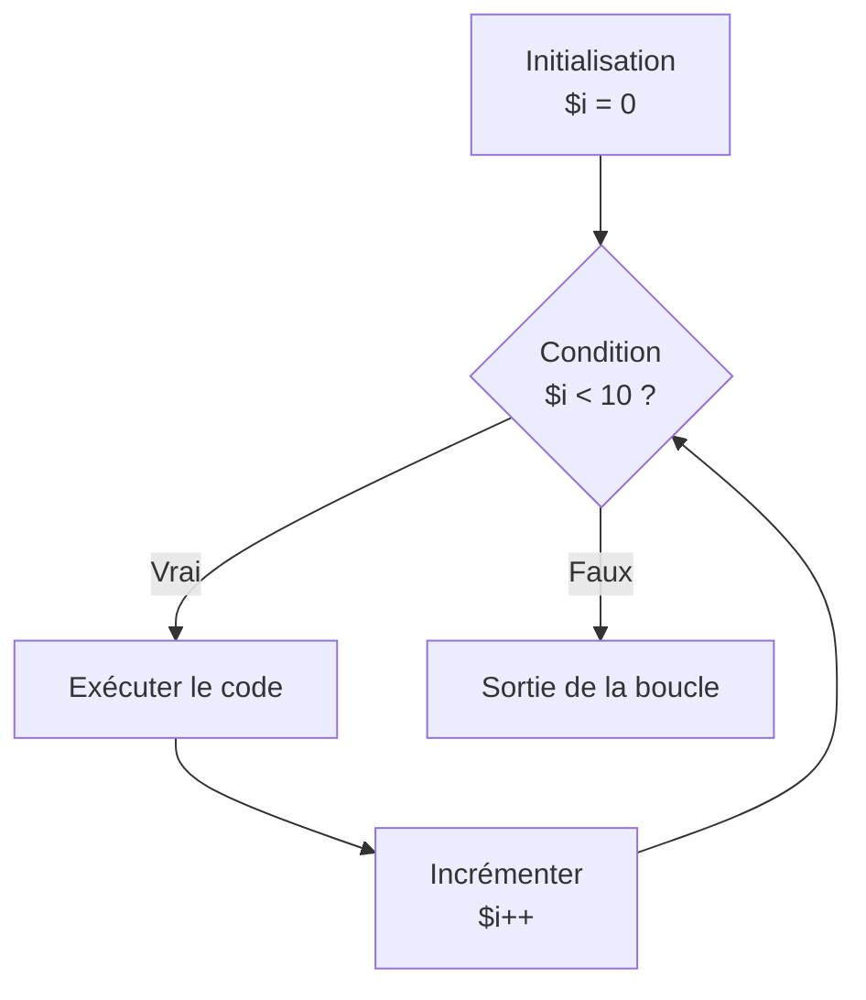

---
tags:
  - PHP
  - Intermédiaire
  - Pratique
description: "Les boucles (for, foreach, while)"
estimated_time: "75 min"
fiche_number: 5
total_fiches: 14
cursus: "PHP"
---

# 05 - Les boucles (for, foreach, while)

> **En bref** : À la fin de cette fiche, tu sauras utiliser les boucles for, foreach, while et do...while pour répéter des actions, notamment pour parcourir des tableaux ou exécuter du code un nombre précis de fois. Lecture estimée : 75 min.


## Prérequis

- Fiche [02-php/03 - Les tableaux](03-tableaux-arrays.md) (arrays)
- Fiche [02-php/04 - Les conditions](04-conditions.md) (if, else, switch)
- Savoir créer des tableaux et utiliser des conditions

## Objectif de cette fiche

À la fin de cette fiche, tu sauras utiliser les boucles `for`, `foreach`, `while` et `do...while` pour répéter des actions, notamment pour parcourir des tableaux ou exécuter du code un nombre précis de fois.

---

## Concepts

Cette section explique tous les concepts nécessaires. Lis-la entièrement avant de passer aux étapes pratiques.

### Qu'est-ce qu'une boucle ?

**Définition** : Une boucle est une structure qui permet de répéter un bloc de code plusieurs fois, jusqu'à ce qu'une condition d'arrêt soit atteinte.

**Le problème que les boucles résolvent** :

Sans boucles, voici les problèmes rencontrés :

1. **Répétition de code** : Pour afficher 100 lignes, tu dois écrire 100 instructions `echo`.

2. **Code non adaptable** : Si tu veux afficher 200 lignes au lieu de 100, tu dois réécrire tout le code.

3. **Traitement impossible** : Tu ne peux pas traiter un tableau dont tu ne connais pas la taille à l'avance.

4. **Maintenance difficile** : Le code dupliqué est difficile à maintenir et à faire évoluer.

**Comment les boucles résolvent ces problèmes** :

| Problème            | Solution avec les boucles                         |
| ------------------- | ------------------------------------------------- |
| Répétition de code  | Une seule instruction répétée automatiquement     |
| Code non adaptable  | Change un nombre et la boucle s'adapte            |
| Traitement impossible | La boucle s'adapte à la taille du tableau       |
| Maintenance difficile | Un seul endroit à modifier                       |

**Analogie concrète** : Une boucle fonctionne comme une chaîne de montage. L'ouvrier (le code) répète la même action sur chaque produit (élément) qui passe devant lui, jusqu'à ce que la chaîne soit vide (condition d'arrêt).

---

### Les quatre types de boucles en PHP

| Boucle | Utilisation principale | Quand l'utiliser |
| ------ | ---------------------- | ---------------- |
| `for` | Répéter N fois | Tu connais le nombre d'itérations à l'avance |
| `foreach` | Parcourir un tableau | Tu veux traiter chaque élément d'un tableau |
| `while` | Répéter tant que... | La condition d'arrêt est dynamique |
| `do...while` | Répéter au moins une fois | Tu veux garantir au moins une exécution |

---

### La boucle for

**Définition** : La boucle `for` répète un bloc de code un nombre défini de fois. Elle utilise un compteur qui s'incrémente à chaque tour.

**Syntaxe** :

```php
<?php
for (initialisation; condition; incrémentation) {
    // Code à répéter
}
```

**Les trois parties entre parenthèses** :

| Partie | Description | Exemple |
| ------ | ----------- | ------- |
| Initialisation | Exécutée une seule fois au début | `$i = 0` |
| Condition | Vérifiée avant chaque tour. Si fausse, la boucle s'arrête | `$i < 10` |
| Incrémentation | Exécutée à la fin de chaque tour | `$i++` |

**Ordre d'exécution** :

Le diagramme suivant illustre le cycle d'une boucle for :



En détail :

1. L'initialisation est exécutée (une seule fois)
2. La condition est vérifiée
3. Si vraie : le bloc de code est exécuté
4. L'incrémentation est exécutée
5. Retour à l'étape 2

**Exemple : compter de 1 à 5** :

```php
<?php
for ($i = 1; $i <= 5; $i++) {
    echo $i . "<br>";
}

// Affiche :
// 1
// 2
// 3
// 4
// 5
```

**Déroulement détaillé** :

| Tour | Valeur de `$i` | Condition (`$i <= 5`) | Action |
| ---- | ------------ | ------------------- | ------ |
| 1 | 1 | vrai | Affiche 1, puis `$i++` |
| 2 | 2 | vrai | Affiche 2, puis `$i++` |
| 3 | 3 | vrai | Affiche 3, puis `$i++` |
| 4 | 4 | vrai | Affiche 4, puis `$i++` |
| 5 | 5 | vrai | Affiche 5, puis `$i++` |
| 6 | 6 | faux | La boucle s'arrête |

**Convention de nommage** : Les variables de compteur s'appellent par convention `$i`, `$j`, `$k` (dans cet ordre pour les boucles imbriquées).

---

### La boucle foreach (rappel et approfondissement)

**Définition** : La boucle `foreach` parcourt tous les éléments d'un tableau, un par un. Elle est plus simple que `for` pour les tableaux.

**Syntaxe pour les valeurs uniquement** :

```php
<?php
foreach ($tableau as $valeur) {
    // Code exécuté pour chaque valeur
}
```

**Syntaxe avec clé et valeur** :

```php
<?php
foreach ($tableau as $cle => $valeur) {
    // Code avec accès à la clé et à la valeur
}
```

**Différence entre for et foreach pour les tableaux** :

```php
<?php
$fruits = ["pomme", "banane", "orange"];

// Avec for (plus verbeux)
for ($i = 0; $i < count($fruits); $i++) {
    echo $fruits[$i] . "<br>";
}

// Avec foreach (plus simple)
foreach ($fruits as $fruit) {
    echo $fruit . "<br>";
}
```

**Quand utiliser for vs foreach** :

| Utilise `for` | Utilise `foreach` |
| ------------- | ----------------- |
| Tu as besoin de l'index numérique | Tu veux uniquement les valeurs |
| Tu veux parcourir partiellement | Tu veux parcourir tout le tableau |
| Tu modifies le compteur dans la boucle | Tu parcours sans modifier le compteur |
| Tu ne parcours pas un tableau | Tu parcours un tableau ou un objet |

---

### La boucle while

**Définition** : La boucle `while` répète un bloc de code tant qu'une condition est vraie. La condition est vérifiée avant chaque tour.

**Syntaxe** :

```php
<?php
while (condition) {
    // Code à répéter
}
```

**Exemple** :

```php
<?php
$compteur = 1;

while ($compteur <= 5) {
    echo $compteur . "<br>";
    $compteur++;
}

// Affiche : 1, 2, 3, 4, 5
```

**Attention aux boucles infinies** :

Une boucle infinie se produit quand la condition reste toujours vraie. Le script ne s'arrête jamais (ou PHP l'arrête après un timeout).

```php
<?php
// DANGER : Boucle infinie (ne pas exécuter)
$compteur = 1;
while ($compteur <= 5) {
    echo $compteur . "<br>";
    // Oubli de $compteur++ : la condition reste toujours vraie
}
```

**Pour éviter les boucles infinies** :

1. Assure-toi que la condition peut devenir fausse
2. Assure-toi que la variable testée est modifiée dans la boucle

---

### La boucle do...while

**Définition** : La boucle `do...while` est similaire à `while`, mais la condition est vérifiée après le premier tour. Le bloc de code est donc exécuté au moins une fois.

**Syntaxe** :

```php
<?php
do {
    // Code à répéter
} while (condition);
```

**Note** : Le point-virgule après `while (condition)` est obligatoire.

**Différence entre while et do...while** :

```php
<?php
$x = 10;

// Avec while : la condition est fausse, rien ne s'affiche
while ($x < 5) {
    echo "while: " . $x . "<br>";
    $x++;
}

// Avec do...while : s'exécute une fois malgré la condition fausse
do {
    echo "do...while: " . $x . "<br>";
    $x++;
} while ($x < 5);

// Affiche seulement : do...while: 10
```

**Quand utiliser do...while** :

| Utilise `do...while` | Utilise `while` |
| -------------------- | --------------- |
| Tu veux au moins une exécution | Tu ne veux rien exécuter si la condition est fausse |
| Validation avec retry | Conditions préalables strictes |
| Menus interactifs | Cas général |

---

### Les instructions break et continue

**break** : Sort immédiatement de la boucle. Le code après la boucle s'exécute.

**continue** : Passe immédiatement au tour suivant. Le reste du code du tour actuel est ignoré.

**Exemple avec break** :

```php
<?php
// Chercher un nombre dans un tableau
$nombres = [2, 5, 8, 12, 15, 20];
$cherche = 12;

foreach ($nombres as $nombre) {
    if ($nombre === $cherche) {
        echo "Trouvé : " . $nombre;
        break;  // Sort de la boucle, pas besoin de continuer
    }
}
```

**Exemple avec continue** :

```php
<?php
// Afficher seulement les nombres pairs
for ($i = 1; $i <= 10; $i++) {
    if ($i % 2 !== 0) {
        continue;  // Passe au tour suivant si impair
    }
    echo $i . "<br>";
}

// Affiche : 2, 4, 6, 8, 10
```

**Visualisation de break et continue** :

```text
for ($i = 1; $i <= 5; $i++) {
    [début du tour]

    if (condition) {
        continue;  // Saute directement à [fin du tour]
    }

    if (autre_condition) {
        break;     // Sort complètement de la boucle
    }

    [reste du code]

    [fin du tour → incrémentation → retour au début]
}
[code après la boucle]
```

---

### Boucles imbriquées

**Définition** : Une boucle imbriquée est une boucle à l'intérieur d'une autre boucle. La boucle intérieure s'exécute complètement pour chaque tour de la boucle extérieure.

**Exemple : table de multiplication** :

```php
<?php
// Table de multiplication de 1 à 5
for ($i = 1; $i <= 5; $i++) {          // Boucle extérieure
    for ($j = 1; $j <= 5; $j++) {      // Boucle intérieure
        echo $i . " x " . $j . " = " . ($i * $j) . "<br>";
    }
    echo "<hr>";  // Ligne de séparation
}
```

**Nombre total d'itérations** : Si la boucle extérieure fait N tours et l'intérieure M tours, le code intérieur s'exécute N × M fois.

---

## Étapes Pratiques

### Étape 1 : Boucle for simple

Crée un fichier `public/boucles.php` :

```php
<?php
echo "<h1>Boucle for</h1>";

echo "<h2>Compter de 1 à 10</h2>";
for ($i = 1; $i <= 10; $i++) {
    echo $i . " ";
}

echo "<h2>Compter de 10 à 1 (décrémentation)</h2>";
for ($i = 10; $i >= 1; $i--) {
    echo $i . " ";
}

echo "<h2>Compter de 2 en 2</h2>";
for ($i = 0; $i <= 20; $i += 2) {
    echo $i . " ";
}
```

**Résultat attendu** :

```text
Boucle for

Compter de 1 à 10
1 2 3 4 5 6 7 8 9 10

Compter de 10 à 1 (décrémentation)
10 9 8 7 6 5 4 3 2 1

Compter de 2 en 2
0 2 4 6 8 10 12 14 16 18 20
```

---

### Étape 2 : Boucle for avec tableau

Modifie `public/boucles.php` pour ajouter :

```php
<?php
// ... (garde le code précédent)

echo "<h1>Boucle for avec tableau</h1>";

$couleurs = ["rouge", "vert", "bleu", "jaune", "orange"];

echo "<ul>";
for ($i = 0; $i < count($couleurs); $i++) {
    echo "<li>Index " . $i . " : " . $couleurs[$i] . "</li>";
}
echo "</ul>";
```

**Résultat attendu** :

```text
Boucle for avec tableau

• Index 0 : rouge
• Index 1 : vert
• Index 2 : bleu
• Index 3 : jaune
• Index 4 : orange
```

---

### Étape 3 : Boucle while

Crée un fichier `public/while.php` :

```php
<?php
echo "<h1>Boucle while</h1>";

echo "<h2>Compte à rebours</h2>";
$compteur = 10;

while ($compteur > 0) {
    echo $compteur . "... ";
    $compteur--;
}
echo "Décollage !";

echo "<h2>Doubler jusqu'à dépasser 100</h2>";
$nombre = 1;

while ($nombre <= 100) {
    echo $nombre . " ";
    $nombre = $nombre * 2;  // Double à chaque tour
}

echo "<p>Le premier nombre supérieur à 100 est : " . $nombre . "</p>";
```

**Résultat attendu** :

```text
Boucle while

Compte à rebours
10... 9... 8... 7... 6... 5... 4... 3... 2... 1... Décollage !

Doubler jusqu'à dépasser 100
1 2 4 8 16 32 64

Le premier nombre supérieur à 100 est : 128
```

---

### Étape 4 : Boucle do...while

Ajoute à `public/while.php` :

```php
<?php
// ... (garde le code précédent)

echo "<h1>Boucle do...while</h1>";

echo "<h2>S'exécute au moins une fois</h2>";

$valeur = 100;  // La condition $valeur < 10 est fausse

do {
    echo "Valeur : " . $valeur . "<br>";
    $valeur++;
} while ($valeur < 10);

echo "<p>La boucle s'est exécutée une fois malgré la condition fausse.</p>";
```

**Résultat attendu** :

```text
Boucle do...while

S'exécute au moins une fois
Valeur : 100

La boucle s'est exécutée une fois malgré la condition fausse.
```

---

### Étape 5 : break et continue

Crée un fichier `public/break-continue.php` :

```php
<?php
echo "<h1>break et continue</h1>";

echo "<h2>break : arrêter quand on trouve 'orange'</h2>";

$fruits = ["pomme", "banane", "orange", "kiwi", "mangue"];

foreach ($fruits as $fruit) {
    if ($fruit === "orange") {
        echo "Orange trouvée ! On arrête.<br>";
        break;
    }
    echo "Fruit : " . $fruit . "<br>";
}

echo "<h2>continue : sauter les nombres impairs</h2>";

for ($i = 1; $i <= 10; $i++) {
    if ($i % 2 !== 0) {
        continue;  // Passe au tour suivant
    }
    echo $i . " ";
}

echo "<h2>Combinaison : chercher dans un tableau multidimensionnel</h2>";

$utilisateurs = [
    ["nom" => "Alice", "actif" => false],
    ["nom" => "Bob", "actif" => true],
    ["nom" => "Charlie", "actif" => true],
];

foreach ($utilisateurs as $utilisateur) {
    if (!$utilisateur["actif"]) {
        continue;  // Ignore les inactifs
    }
    echo "Utilisateur actif : " . $utilisateur["nom"] . "<br>";
}
```

**Résultat attendu** :

```text
break et continue

break : arrêter quand on trouve 'orange'
Fruit : pomme
Fruit : banane
Orange trouvée ! On arrête.

continue : sauter les nombres impairs
2 4 6 8 10

Combinaison : chercher dans un tableau multidimensionnel
Utilisateur actif : Bob
Utilisateur actif : Charlie
```

---

### Étape 6 : Boucles imbriquées - Table de multiplication

Crée un fichier `public/table-multiplication.php` :

```php
<?php
echo "<h1>Table de multiplication</h1>";

echo "<table border='1' cellpadding='10'>";

// En-tête de ligne
echo "<tr>";
echo "<th>×</th>";
for ($j = 1; $j <= 10; $j++) {
    echo "<th>" . $j . "</th>";
}
echo "</tr>";

// Corps de la table
for ($i = 1; $i <= 10; $i++) {          // Lignes
    echo "<tr>";
    echo "<th>" . $i . "</th>";          // En-tête de colonne

    for ($j = 1; $j <= 10; $j++) {       // Colonnes
        $resultat = $i * $j;
        echo "<td>" . $resultat . "</td>";
    }

    echo "</tr>";
}

echo "</table>";
```

**Résultat attendu** : Une table de multiplication 10×10 dans un tableau HTML.

---

### Étape 7 : Parcourir un tableau d'objets

Crée un fichier `public/liste-produits.php` :

```php
<?php
// Simulation de données (comme venant d'une base de données)
$produits = [
    [
        "nom" => "Laptop",
        "prix" => 999.99,
        "stock" => 5,
        "actif" => true
    ],
    [
        "nom" => "Souris",
        "prix" => 29.99,
        "stock" => 50,
        "actif" => true
    ],
    [
        "nom" => "Clavier",
        "prix" => 79.99,
        "stock" => 0,
        "actif" => false
    ],
    [
        "nom" => "Écran",
        "prix" => 349.99,
        "stock" => 12,
        "actif" => true
    ]
];

echo "<h1>Catalogue de produits</h1>";

// Compter les produits actifs
$nbActifs = 0;
foreach ($produits as $produit) {
    if ($produit["actif"]) {
        $nbActifs++;
    }
}
echo "<p>Produits actifs : " . $nbActifs . " / " . count($produits) . "</p>";

// Afficher les produits dans un tableau
echo "<table border='1' cellpadding='10'>";
echo "<tr>";
echo "<th>Produit</th>";
echo "<th>Prix</th>";
echo "<th>Stock</th>";
echo "<th>Statut</th>";
echo "</tr>";

foreach ($produits as $produit) {
    // Définir la couleur selon le stock
    if ($produit["stock"] === 0) {
        $couleur = "#ffcccc";  // Rouge clair
        $statut = "Rupture";
    } elseif ($produit["stock"] < 10) {
        $couleur = "#ffffcc";  // Jaune clair
        $statut = "Stock faible";
    } else {
        $couleur = "#ccffcc";  // Vert clair
        $statut = "Disponible";
    }

    // Si le produit n'est pas actif, on le grise
    if (!$produit["actif"]) {
        $couleur = "#cccccc";  // Gris
        $statut = "Inactif";
    }

    echo "<tr style='background-color: " . $couleur . ";'>";
    echo "<td>" . $produit["nom"] . "</td>";
    echo "<td>" . $produit["prix"] . " €</td>";
    echo "<td>" . $produit["stock"] . "</td>";
    echo "<td>" . $statut . "</td>";
    echo "</tr>";
}

echo "</table>";

// Calculer le total du stock
$totalStock = 0;
$valeurStock = 0;

foreach ($produits as $produit) {
    if ($produit["actif"]) {
        $totalStock += $produit["stock"];
        $valeurStock += $produit["prix"] * $produit["stock"];
    }
}

echo "<h2>Résumé</h2>";
echo "<p>Total articles en stock (actifs) : " . $totalStock . "</p>";
echo "<p>Valeur totale du stock : " . number_format($valeurStock, 2) . " €</p>";
```

**Résultat attendu** : Un tableau HTML coloré avec les produits et un résumé.

---

## Commandes Utiles

| Structure | Description | Exemple |
| --------- | ----------- | ------- |
| `for ($i = 0; $i < N; $i++)` | Répète N fois | `for ($i = 0; $i < 10; $i++)` |
| `foreach ($arr as $val)` | Parcourt un tableau | `foreach ($fruits as $fruit)` |
| `foreach ($arr as $k => $v)` | Avec clé et valeur | `foreach ($user as $key => $value)` |
| `while (condition)` | Tant que vrai | `while ($x < 100)` |
| `do { } while (cond)` | Au moins une fois | `do { ... } while ($ok)` |
| `break` | Sort de la boucle | Utilisé dans `for`, `foreach`, `while` |
| `continue` | Passe au tour suivant | Utilisé dans `for`, `foreach`, `while` |

---

## Pièges Fréquents

### Piège 1 : Boucle infinie avec while

**Problème** : La condition reste toujours vraie.

**Solution** : Assure-toi de modifier la variable testée dans la boucle.

```php
<?php
// INCORRECT (boucle infinie)
$i = 0;
while ($i < 10) {
    echo $i;
    // Oubli de $i++ !
}

// CORRECT
$i = 0;
while ($i < 10) {
    echo $i;
    $i++;  // Incrémentation indispensable
}
```

---

### Piège 2 : Off-by-one error (erreur de décalage)

**Problème** : La boucle fait un tour de trop ou un tour de moins.

**Solution** : Vérifie soigneusement les conditions `<` vs `<=` et la valeur initiale.

```php
<?php
$fruits = ["pomme", "banane", "orange"];  // 3 éléments, index 0, 1, 2

// INCORRECT (erreur : l'index 3 n'existe pas)
for ($i = 0; $i <= count($fruits); $i++) {
    echo $fruits[$i];  // Erreur à $i = 3
}

// CORRECT
for ($i = 0; $i < count($fruits); $i++) {  // < au lieu de <=
    echo $fruits[$i];
}
```

---

### Piège 3 : Modifier un tableau pendant foreach

**Problème** : Comportement imprévisible si tu modifies le tableau dans la boucle.

**Solution** : Crée un nouveau tableau ou utilise des index.

```php
<?php
$nombres = [1, 2, 3, 4, 5];

// PROBLÉMATIQUE
foreach ($nombres as $nombre) {
    $nombres[] = $nombre * 2;  // Ajoute pendant le parcours
}

// CORRECT (crée un nouveau tableau)
$doubles = [];
foreach ($nombres as $nombre) {
    $doubles[] = $nombre * 2;
}
```

---

### Piège 4 : Oublier le point-virgule après do...while

**Problème** : Erreur de syntaxe.

**Solution** : `do...while` nécessite un point-virgule à la fin.

```php
<?php
// INCORRECT
do {
    echo "Test";
} while (false)  // Manque le ;

// CORRECT
do {
    echo "Test";
} while (false);  // Point-virgule obligatoire
```

---

### Piège 5 : Utiliser la mauvaise variable dans une boucle imbriquée

**Problème** : Tu utilises `$i` dans la boucle intérieure alors qu'elle utilise `$j`.

**Solution** : Utilise des noms de variables différents pour chaque niveau.

```php
<?php
// INCORRECT (conflit de variables)
for ($i = 0; $i < 5; $i++) {
    for ($i = 0; $i < 3; $i++) {  // Réutilise $i !
        echo $i;
    }
}

// CORRECT
for ($i = 0; $i < 5; $i++) {
    for ($j = 0; $j < 3; $j++) {  // Utilise $j
        echo $j;
    }
}
```

---

### Piège 6 : Performance avec count() dans la condition for

**Problème** : `count()` est appelé à chaque tour de boucle.

**Solution** : Stocke le résultat de `count()` dans une variable.

```php
<?php
$grandTableau = range(1, 10000);  // Tableau de 10000 éléments

// MOINS PERFORMANT
for ($i = 0; $i < count($grandTableau); $i++) {
    // count() est appelé 10000 fois
}

// PLUS PERFORMANT
$taille = count($grandTableau);
for ($i = 0; $i < $taille; $i++) {
    // count() est appelé une seule fois
}

// ENCORE MIEUX : utiliser foreach si possible
foreach ($grandTableau as $element) {
    // Pas besoin de count()
}
```

---

## Checklist de Validation

- [ ] J'ai compris quand utiliser `for`, `foreach`, `while`, `do...while`
- [ ] J'ai créé une boucle `for` qui compte de 1 à 10
- [ ] J'ai utilisé `foreach` pour parcourir un tableau
- [ ] J'ai utilisé `while` avec une condition dynamique
- [ ] J'ai compris la différence entre `while` et `do...while`
- [ ] J'ai utilisé `break` pour sortir d'une boucle
- [ ] J'ai utilisé `continue` pour sauter un tour
- [ ] J'ai créé une boucle imbriquée (table de multiplication)
- [ ] J'ai évité les boucles infinies

---

## Exercice Pratique

**Énoncé** : Crée un jeu de devinette simplifié.

**Indications** :

- Crée un fichier `public/devinette.php`
- Définis un nombre secret entre 1 et 100 (`$nombreSecret = 42;`)
- Crée un tableau de tentatives (`$tentatives = [25, 50, 40, 45, 42];`)
- Parcours les tentatives avec une boucle
- Pour chaque tentative, affiche si c'est "Trop petit", "Trop grand" ou "Trouvé !"
- Quand le nombre est trouvé, arrête la boucle avec `break`
- Affiche le nombre de tentatives utilisées

**Résultat attendu** : L'historique des tentatives avec le résultat de chaque essai.

---

## Solution de l'Exercice

> **Note** : Cette section contient la solution complète. Essaie d'abord de résoudre l'exercice par toi-même avant de consulter cette solution.

---

```php
<?php
// Fichier : public/devinette.php
// Jeu de devinette simplifié

$nombreSecret = 42;
$tentatives = [25, 50, 40, 45, 42];

echo "<h1>Jeu de devinette</h1>";
echo "<p>Le nombre secret est entre 1 et 100.</p>";

$numeroTentative = 0;
$trouve = false;

echo "<table border='1' cellpadding='10'>";
echo "<tr><th>Tentative</th><th>Nombre</th><th>Résultat</th></tr>";

foreach ($tentatives as $tentative) {
    $numeroTentative++;

    echo "<tr>";
    echo "<td>" . $numeroTentative . "</td>";
    echo "<td>" . $tentative . "</td>";

    if ($tentative < $nombreSecret) {
        echo "<td style='color: blue;'>Trop petit ↑</td>";
    } elseif ($tentative > $nombreSecret) {
        echo "<td style='color: red;'>Trop grand ↓</td>";
    } else {
        echo "<td style='color: green; font-weight: bold;'>Trouvé !</td>";
        $trouve = true;
    }

    echo "</tr>";

    // Si trouvé, on arrête
    if ($trouve) {
        break;
    }
}

echo "</table>";

// Message final
if ($trouve) {
    echo "<p>Bravo ! Le nombre " . $nombreSecret . " a été trouvé en " . $numeroTentative . " tentative(s).</p>";
} else {
    echo "<p>Le nombre n'a pas été trouvé en " . count($tentatives) . " tentatives.</p>";
    echo "<p>Le nombre secret était : " . $nombreSecret . "</p>";
}
```

**Explication de la solution** :

| Élément | Explication |
| ------- | ----------- |
| `$numeroTentative = 0` | Compteur initialisé avant la boucle |
| `$numeroTentative++` | Incrémenté à chaque tour |
| `$trouve = false` | Variable pour savoir si on a trouvé |
| `if ($tentative < $nombreSecret)` | Comparaison avec le nombre secret |
| `break` | Sort de la boucle quand trouvé |
| `if ($trouve)` après la boucle | Message différent selon le résultat |

---

## Navigation

← Fiche précédente : **[Les conditions (if, else, switch)](04-conditions.md)**

→ Fiche suivante : **[Les fonctions](06-fonctions.md)**
