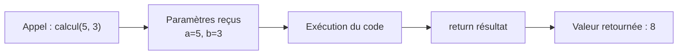

---
tags:
  - PHP
  - Intermédiaire
  - Pratique
description: "Les fonctions"
estimated_time: "80 min"
fiche_number: 6
total_fiches: 14
cursus: "PHP"
---

# 06 - Les fonctions

> **En bref** : À la fin de cette fiche, tu sauras créer tes propres fonctions pour organiser et réutiliser ton code, comprendre les paramètres et les valeurs de retour, et utiliser les fonctions natives de PHP. Lecture estimée : 80 min.


## Prérequis

- Fiche [02-php/02 - Les variables et types de données](02-variables-types.md)
- Fiche [02-php/03 - Les tableaux](03-tableaux-arrays.md) (arrays, foreach, clé/valeur)
- Fiche [02-php/04 - Les conditions](04-conditions.md) (if, else, switch)
- Fiche [02-php/05 - Les boucles](05-boucles.md) (for, foreach, while)
- Savoir utiliser les variables, les tableaux, les conditions et les boucles

## Objectif de cette fiche

À la fin de cette fiche, tu sauras créer tes propres fonctions pour organiser et réutiliser ton code, comprendre les paramètres et les valeurs de retour, et utiliser les fonctions natives de PHP.

---

## Concepts

Cette section explique tous les concepts nécessaires. Lis-la entièrement avant de passer aux étapes pratiques.

### Qu'est-ce qu'une fonction ?

**Définition** : Une fonction est un bloc de code réutilisable qui effectue une tâche spécifique. On lui donne un nom et on peut l'appeler plusieurs fois dans le programme.

**Le problème que les fonctions résolvent** :

Sans fonctions, voici les problèmes rencontrés :

1. **Duplication de code** : Tu dois copier-coller le même code à plusieurs endroits.

2. **Maintenance difficile** : Si tu dois modifier le code, tu dois le faire partout où il est copié.

3. **Code illisible** : Un fichier avec des centaines de lignes sans structure est difficile à comprendre.

4. **Pas de réutilisation** : Tu ne peux pas partager du code entre plusieurs fichiers.

**Comment les fonctions résolvent ces problèmes** :

| Problème            | Solution avec les fonctions                       |
| ------------------- | ------------------------------------------------- |
| Duplication de code | Écris le code une fois, appelle-le plusieurs fois |
| Maintenance difficile | Modifie à un seul endroit                        |
| Code illisible      | Organise le code en petits blocs nommés           |
| Pas de réutilisation | Utilise la fonction dans plusieurs fichiers      |

**Analogie concrète** : Une fonction est comme une recette de cuisine. Au lieu de réécrire toutes les étapes chaque fois que tu veux faire un gâteau, tu écris la recette une fois et tu la suis quand tu en as besoin. Tu peux même adapter la recette avec des ingrédients différents (les paramètres).

Le diagramme suivant montre le flux d'exécution lorsqu'une fonction est appelée :



---

### Anatomie d'une fonction

**Les composants d'une fonction** :

```php
<?php
function nomDeLaFonction($parametre1, $parametre2) {
    // Corps de la fonction
    // Instructions à exécuter

    return $resultat;  // Valeur retournée (optionnel)
}
```

| Composant | Description | Obligatoire |
| --------- | ----------- | ----------- |
| `function` | Mot-clé pour déclarer une fonction | Oui |
| Nom | Identifiant de la fonction | Oui |
| Parenthèses `()` | Contiennent les paramètres | Oui (même vides) |
| Paramètres | Variables d'entrée | Non |
| Accolades `{}` | Délimitent le corps | Oui |
| `return` | Renvoie une valeur | Non |

**Convention de nommage** :

- Utilise le camelCase : `calculerTotal`, `afficherMessage`
- Le nom doit décrire ce que fait la fonction
- Commence par un verbe : `calculer`, `afficher`, `valider`, `obtenir`

---

### Déclarer et appeler une fonction

**Déclarer** : C'est écrire la fonction (définir ce qu'elle fait).

**Appeler** : C'est exécuter la fonction (utiliser ce qu'elle fait).

```php
<?php
// DÉCLARATION de la fonction
function direBonjour() {
    echo "Bonjour !";
}

// APPEL de la fonction
direBonjour();  // Affiche : Bonjour !
direBonjour();  // Affiche : Bonjour ! (peut être appelée plusieurs fois)
```

**Règle** : Une fonction doit être déclarée avant d'être appelée dans le même fichier (ou dans un fichier inclus).

---

### Les paramètres

**Définition** : Les paramètres sont des variables que tu passes à la fonction pour qu'elle travaille avec. Ils permettent de personnaliser le comportement de la fonction.

**Syntaxe** :

```php
<?php
// Fonction avec un paramètre
function direBonjour($prenom) {
    echo "Bonjour " . $prenom . " !";
}

// Appel avec une valeur
direBonjour("Marie");  // Affiche : Bonjour Marie !
direBonjour("Pierre"); // Affiche : Bonjour Pierre !
```

**Plusieurs paramètres** :

```php
<?php
function presenter($prenom, $age, $ville) {
    echo $prenom . " a " . $age . " ans et habite à " . $ville . ".";
}

presenter("David", 23, "Lyon");
// Affiche : David a 23 ans et habite à Lyon.
```

**Arguments vs Paramètres** :

| Terme | Description | Exemple |
| ----- | ----------- | ------- |
| Paramètre | Variable dans la déclaration | `function saluer($prenom)` |
| Argument | Valeur passée lors de l'appel | `saluer("Marie")` |

---

### Les valeurs par défaut

**Définition** : Tu peux donner une valeur par défaut à un paramètre. Si aucune valeur n'est passée lors de l'appel, la valeur par défaut est utilisée.

**Syntaxe** :

```php
<?php
function saluer($prenom = "visiteur") {
    echo "Bonjour " . $prenom . " !";
}

saluer("Marie");  // Affiche : Bonjour Marie !
saluer();         // Affiche : Bonjour visiteur ! (valeur par défaut)
```

**Règle importante** : Les paramètres avec valeur par défaut doivent être à la fin de la liste.

```php
<?php
// CORRECT
function exemple($obligatoire, $optionnel = "défaut") {
    // ...
}

// INCORRECT (erreur)
// function exemple($optionnel = "défaut", $obligatoire) {
//     // ...
// }
```

---

### La valeur de retour (return)

**Définition** : `return` permet à une fonction de renvoyer une valeur. Cette valeur peut être stockée dans une variable ou utilisée directement.

**Syntaxe** :

```php
<?php
function additionner($a, $b) {
    $resultat = $a + $b;
    return $resultat;  // Renvoie la valeur
}

// Stocker le résultat dans une variable
$somme = additionner(5, 3);
echo $somme;  // Affiche : 8

// Utiliser directement le résultat
echo additionner(10, 20);  // Affiche : 30
```

**Comportement de return** :

1. `return` renvoie la valeur à l'endroit où la fonction a été appelée
2. `return` termine immédiatement la fonction (le code après n'est pas exécuté)

```php
<?php
function verifierAge($age) {
    if ($age < 0) {
        return "Âge invalide";  // Sort immédiatement
    }

    if ($age >= 18) {
        return "Majeur";
    }

    return "Mineur";  // Ce code n'est atteint que si les conditions précédentes sont fausses
}

echo verifierAge(25);   // Affiche : Majeur
echo verifierAge(-5);   // Affiche : Âge invalide
echo verifierAge(15);   // Affiche : Mineur
```

**Fonction sans return** :

Une fonction sans `return` renvoie `null` par défaut.

```php
<?php
function afficherMessage($texte) {
    echo $texte;
    // Pas de return : renvoie null
}

$resultat = afficherMessage("Test");
var_dump($resultat);  // NULL
```

---

### Le typage des fonctions (PHP 7+)

**Définition** : Tu peux spécifier le type attendu pour les paramètres et la valeur de retour. PHP vérifiera que les bonnes valeurs sont utilisées.

**Syntaxe** :

```php
<?php
function additionner(int $a, int $b): int {
    return $a + $b;
}
```

**Types disponibles** :

| Type | Description | Exemple |
| ---- | ----------- | ------- |
| `int` | Nombre entier | `function calcul(int $n)` |
| `float` | Nombre décimal | `function prix(float $p)` |
| `string` | Chaîne de caractères | `function nom(string $s)` |
| `bool` | Booléen | `function actif(bool $a)` |
| `array` | Tableau | `function liste(array $l)` |
| `void` | Pas de retour | `function afficher(): void` |
| `?type` | Type ou null | `function get(): ?string` |

**Exemple complet** :

```php
<?php
function calculerTTC(float $prixHT, float $tva = 20.0): float {
    $montantTVA = $prixHT * $tva / 100;
    return $prixHT + $montantTVA;
}

$prix = calculerTTC(100.0);       // 120.0
$prix = calculerTTC(100.0, 5.5);  // 105.5
```

**Type nullable** (`?`) :

```php
<?php
function trouverUtilisateur(int $id): ?array {
    // Retourne un tableau ou null si non trouvé
    if ($id === 1) {
        return ["nom" => "David", "age" => 23];
    }
    return null;
}
```

---

### La portée des variables (scope)

**Définition** : La portée d'une variable définit où elle est accessible. Une variable créée dans une fonction n'est pas accessible en dehors.

**Portée locale** : Les variables créées dans une fonction sont locales à cette fonction.

```php
<?php
function test() {
    $variableLocale = "Je suis locale";
    echo $variableLocale;  // Fonctionne
}

test();
// echo $variableLocale;  // ERREUR : variable non définie
```

**Portée globale** : Les variables créées en dehors des fonctions sont globales, mais pas accessibles directement dans les fonctions.

```php
<?php
$variableGlobale = "Je suis globale";

function test() {
    // echo $variableGlobale;  // ERREUR : non accessible directement
}

// Pour accéder à une variable globale dans une fonction :
function testAvecGlobal() {
    global $variableGlobale;  // Déclare l'accès à la variable globale
    echo $variableGlobale;    // Fonctionne maintenant
}
```

**Recommandation** : Évite d'utiliser `global`. Passe plutôt les valeurs en paramètres. C'est plus clair et évite les effets de bord.

```php
<?php
// DÉCONSEILLÉ
$taux = 20;
function calculerTTC_mauvais($prix) {
    global $taux;
    return $prix * (1 + $taux / 100);
}

// RECOMMANDÉ
function calculerTTC_bon($prix, $taux) {
    return $prix * (1 + $taux / 100);
}
```

---

### Les fonctions natives de PHP

PHP fournit des centaines de fonctions prêtes à l'emploi. Voici les plus courantes :

**Fonctions pour les chaînes (strings)** :

| Fonction | Description | Exemple |
| -------- | ----------- | ------- |
| `strlen($str)` | Longueur du string | `strlen("Bonjour")` → 7 |
| `strtoupper($str)` | Convertit en majuscules | `strtoupper("bonjour")` → "BONJOUR" |
| `strtolower($str)` | Convertit en minuscules | `strtolower("BONJOUR")` → "bonjour" |
| `ucfirst($str)` | Première lettre en majuscule | `ucfirst("bonjour")` → "Bonjour" |
| `trim($str)` | Supprime les espaces aux extrémités | `trim(" hello ")` → "hello" |
| `str_replace($search, $replace, $str)` | Remplace du texte | `str_replace("a", "o", "chat")` → "chot" |
| `substr($str, $start, $length)` | Extrait une partie | `substr("Bonjour", 0, 3)` → "Bon" |
| `strpos($str, $search)` | Position d'une sous-chaîne | `strpos("Bonjour", "j")` → 3 |
| `explode($sep, $str)` | Coupe en tableau | `explode(",", "a,b,c")` → ["a","b","c"] |
| `implode($sep, $arr)` | Joint un tableau | `implode("-", ["a","b"])` → "a-b" |

**Fonctions pour les nombres** :

| Fonction | Description | Exemple |
| -------- | ----------- | ------- |
| `round($n)` | Arrondit | `round(3.7)` → 4 |
| `floor($n)` | Arrondit vers le bas | `floor(3.7)` → 3 |
| `ceil($n)` | Arrondit vers le haut | `ceil(3.2)` → 4 |
| `abs($n)` | Valeur absolue | `abs(-5)` → 5 |
| `max($a, $b)` | Maximum | `max(3, 7)` → 7 |
| `min($a, $b)` | Minimum | `min(3, 7)` → 3 |
| `rand($min, $max)` | Nombre aléatoire | `rand(1, 100)` |
| `number_format($n, $dec)` | Formate un nombre | `number_format(1234.5, 2)` → "1,234.50" |

**Fonctions pour les tableaux** :

| Fonction | Description | Exemple |
| -------- | ----------- | ------- |
| `count($arr)` | Nombre d'éléments | `count([1,2,3])` → 3 |
| `array_push($arr, $val)` | Ajoute à la fin | Modifie `$arr` |
| `array_pop($arr)` | Retire le dernier | Retourne et retire |
| `array_merge($a, $b)` | Fusionne deux tableaux | Retourne un nouveau tableau |
| `in_array($val, $arr)` | Vérifie si présent | `in_array(2, [1,2,3])` → true |
| `array_keys($arr)` | Retourne les clés | `array_keys(["a"=>1])` → ["a"] |
| `array_values($arr)` | Retourne les valeurs | `array_values(["a"=>1])` → [1] |
| `sort($arr)` | Trie (modifie `$arr`) | Tri croissant |
| `rsort($arr)` | Trie décroissant | Modifie `$arr` |
| `array_reverse($arr)` | Inverse l'ordre | Retourne un nouveau tableau |

**Fonctions pour les dates** :

| Fonction | Description | Exemple |
| -------- | ----------- | ------- |
| `date($format)` | Date formatée | `date("d/m/Y")` → "13/01/2026" |
| `time()` | Timestamp actuel | Nombre de secondes depuis 1970 |
| `strtotime($str)` | Convertit texte en timestamp | `strtotime("2026-01-13")` |

---

## Étapes Pratiques

### Étape 1 : Première fonction simple

Crée un fichier `public/fonctions.php` :

```php
<?php
// Déclaration d'une fonction simple
function direBonjour() {
    echo "<p>Bonjour !</p>";
}

// Appel de la fonction
echo "<h1>Ma première fonction</h1>";

direBonjour();  // Premier appel
direBonjour();  // Deuxième appel
direBonjour();  // Troisième appel
```

**Résultat attendu** :

```text
Ma première fonction

Bonjour !
Bonjour !
Bonjour !
```

---

### Étape 2 : Fonction avec paramètres

Modifie `public/fonctions.php` :

```php
<?php
// Fonction avec un paramètre
function saluer($prenom) {
    echo "<p>Bonjour " . $prenom . " !</p>";
}

// Fonction avec plusieurs paramètres
function presenter($prenom, $age, $ville) {
    echo "<p>" . $prenom . " a " . $age . " ans et habite à " . $ville . ".</p>";
}

echo "<h1>Fonctions avec paramètres</h1>";

saluer("David");
saluer("John");
saluer("Marie");

echo "<hr>";

presenter("David", 23, "Lyon");
presenter("John", 35, "Paris");
```

**Résultat attendu** :

```text
Fonctions avec paramètres

Bonjour David !
Bonjour John !
Bonjour Marie !

---

David a 23 ans et habite à Lyon.
John a 35 ans et habite à Paris.
```

---

### Étape 3 : Fonction avec valeur de retour

Crée un fichier `public/calculs.php` :

```php
<?php
// Fonction qui retourne une valeur
function additionner($a, $b) {
    return $a + $b;
}

function multiplier($a, $b) {
    return $a * $b;
}

function calculerMoyenne($notes) {
    $somme = 0;
    foreach ($notes as $note) {
        $somme += $note;
    }
    return $somme / count($notes);
}

echo "<h1>Fonctions avec retour</h1>";

// Utiliser les fonctions
$resultat1 = additionner(5, 3);
echo "<p>5 + 3 = " . $resultat1 . "</p>";

$resultat2 = multiplier(4, 7);
echo "<p>4 × 7 = " . $resultat2 . "</p>";

// Utiliser directement dans echo
echo "<p>10 + 20 = " . additionner(10, 20) . "</p>";

// Chaîner les fonctions
$resultat3 = multiplier(additionner(2, 3), 4);  // (2+3) × 4
echo "<p>(2 + 3) × 4 = " . $resultat3 . "</p>";

// Fonction avec tableau
$mesNotes = [15, 12, 18, 14, 16];
$moyenne = calculerMoyenne($mesNotes);
echo "<p>Moyenne des notes : " . $moyenne . "/20</p>";
```

**Résultat attendu** :

```text
Fonctions avec retour

5 + 3 = 8
4 × 7 = 28
10 + 20 = 30
(2 + 3) × 4 = 20
Moyenne des notes : 15/20
```

---

### Étape 4 : Fonction avec valeurs par défaut

Ajoute à `public/calculs.php` :

```php
<?php
// ... (garde le code précédent)

echo "<h1>Valeurs par défaut</h1>";

// Fonction avec paramètre optionnel
function calculerTTC($prixHT, $tauxTVA = 20) {
    $montantTVA = $prixHT * $tauxTVA / 100;
    return $prixHT + $montantTVA;
}

// Utilisation avec TVA par défaut (20%)
$prix1 = calculerTTC(100);
echo "<p>100€ HT avec TVA 20% = " . $prix1 . "€ TTC</p>";

// Utilisation avec TVA personnalisée
$prix2 = calculerTTC(100, 5.5);
echo "<p>100€ HT avec TVA 5.5% = " . $prix2 . "€ TTC</p>";

// Fonction avec plusieurs valeurs par défaut
function afficherProduit($nom, $prix = 0, $devise = "€") {
    echo "<p>" . $nom . " : " . $prix . " " . $devise . "</p>";
}

afficherProduit("Laptop", 999);           // Prix en euros
afficherProduit("Mouse", 25, "€");        // Prix en euros (explicite)
afficherProduit("Keyboard", 50, "$");     // Prix en dollars
afficherProduit("Cable");                 // Prix par défaut (0€)
```

**Résultat attendu** :

```text
Valeurs par défaut

100€ HT avec TVA 20% = 120€ TTC
100€ HT avec TVA 5.5% = 105.5€ TTC

Laptop : 999 €
Mouse : 25 €
Keyboard : 50 $
Cable : 0 €
```

---

### Étape 5 : Fonction avec typage

Crée un fichier `public/typage.php` :

```php
<?php
// Fonction avec types déclarés
function calculerRemise(float $prix, int $pourcentage): float {
    $remise = $prix * $pourcentage / 100;
    return $prix - $remise;
}

function estMajeur(int $age): bool {
    return $age >= 18;
}

function formaterNom(string $prenom, string $nom): string {
    return strtoupper($nom) . " " . ucfirst($prenom);
}

echo "<h1>Fonctions typées</h1>";

// Calcul de remise
$prixFinal = calculerRemise(150.0, 20);
echo "<p>Prix après 20% de remise : " . $prixFinal . "€</p>";

// Vérification d'âge
$age1 = 25;
$age2 = 15;
echo "<p>" . $age1 . " ans : " . (estMajeur($age1) ? "majeur" : "mineur") . "</p>";
echo "<p>" . $age2 . " ans : " . (estMajeur($age2) ? "majeur" : "mineur") . "</p>";

// Formatage de nom
$nomFormate = formaterNom("marie", "dupont");
echo "<p>Nom formaté : " . $nomFormate . "</p>";
```

**Résultat attendu** :

```text
Fonctions typées

Prix après 20% de remise : 120€
25 ans : majeur
15 ans : mineur
Nom formaté : DUPONT Marie
```

---

### Étape 6 : Utiliser les fonctions natives

Crée un fichier `public/fonctions-natives.php` :

```php
<?php
echo "<h1>Fonctions natives de PHP</h1>";

// Fonctions pour les strings
echo "<h2>Strings</h2>";

$texte = "  Bonjour le monde  ";
echo "<p>Texte original : '" . $texte . "'</p>";
echo "<p>Après trim() : '" . trim($texte) . "'</p>";
echo "<p>En majuscules : '" . strtoupper(trim($texte)) . "'</p>";
echo "<p>Longueur : " . strlen(trim($texte)) . " caractères</p>";

$phrase = "PHP est un langage de programmation";
echo "<p>Position de 'langage' : " . strpos($phrase, "langage") . "</p>";
echo "<p>Remplacer PHP par Python : " . str_replace("PHP", "Python", $phrase) . "</p>";

// Fonctions pour les nombres
echo "<h2>Nombres</h2>";

$nombre = 3.7;
echo "<p>Nombre : " . $nombre . "</p>";
echo "<p>round() : " . round($nombre) . "</p>";
echo "<p>floor() : " . floor($nombre) . "</p>";
echo "<p>ceil() : " . ceil($nombre) . "</p>";

$prix = 1234567.891;
echo "<p>Prix formaté : " . number_format($prix, 2, ",", " ") . " €</p>";

// Fonctions pour les tableaux
echo "<h2>Tableaux</h2>";

$fruits = ["orange", "pomme", "banane", "kiwi"];
echo "<p>Avant tri : " . implode(", ", $fruits) . "</p>";

sort($fruits);
echo "<p>Après sort() : " . implode(", ", $fruits) . "</p>";

$nombres = [5, 2, 8, 1, 9];
echo "<p>Max : " . max($nombres) . "</p>";
echo "<p>Min : " . min($nombres) . "</p>";

// Fonctions pour les dates
echo "<h2>Dates</h2>";

echo "<p>Date complète : " . date("d/m/Y H:i:s") . "</p>";
echo "<p>Jour de la semaine : " . date("l") . "</p>";
echo "<p>Année : " . date("Y") . "</p>";
```

**Résultat attendu** : Affichage des résultats de chaque fonction native.

---

### Étape 7 : Fonction complexe - Validation de formulaire

Crée un fichier `public/validation.php` :

```php
<?php
// Fonctions de validation

function validerEmail(string $email): bool {
    // Vérifie que l'email contient @ et .
    return strpos($email, "@") !== false && strpos($email, ".") !== false;
}

function validerAge(int $age): bool {
    return $age >= 0 && $age <= 150;
}

function validerNom(string $nom): array {
    $erreurs = [];

    if (strlen($nom) < 2) {
        $erreurs[] = "Le nom doit contenir au moins 2 caractères";
    }

    if (strlen($nom) > 50) {
        $erreurs[] = "Le nom ne doit pas dépasser 50 caractères";
    }

    if (preg_match('/[0-9]/', $nom)) {
        $erreurs[] = "Le nom ne doit pas contenir de chiffres";
    }

    return $erreurs;
}

function validerFormulaire(array $donnees): array {
    $erreurs = [];

    // Valider le nom
    $erreursNom = validerNom($donnees["nom"] ?? "");
    if (!empty($erreursNom)) {
        $erreurs["nom"] = $erreursNom;
    }

    // Valider l'email
    if (!validerEmail($donnees["email"] ?? "")) {
        $erreurs["email"] = ["L'email n'est pas valide"];
    }

    // Valider l'âge
    if (!validerAge($donnees["age"] ?? -1)) {
        $erreurs["age"] = ["L'âge doit être entre 0 et 150"];
    }

    return $erreurs;
}

// Données de test
$formulaire = [
    "nom" => "David",
    "email" => "alex@example.com",
    "age" => 23
];

echo "<h1>Validation de formulaire</h1>";

echo "<h2>Données soumises</h2>";
echo "<pre>";
print_r($formulaire);
echo "</pre>";

echo "<h2>Résultat de la validation</h2>";

$erreurs = validerFormulaire($formulaire);

if (empty($erreurs)) {
    echo "<p style='color: green;'>✓ Toutes les données sont valides !</p>";
} else {
    echo "<p style='color: red;'>✗ Des erreurs ont été trouvées :</p>";
    echo "<ul>";
    foreach ($erreurs as $champ => $messages) {
        foreach ($messages as $message) {
            echo "<li><strong>" . $champ . "</strong> : " . $message . "</li>";
        }
    }
    echo "</ul>";
}

// Test avec des données invalides
echo "<h2>Test avec données invalides</h2>";

$formulaireInvalide = [
    "nom" => "L",
    "email" => "pasunemail",
    "age" => 200
];

echo "<pre>";
print_r($formulaireInvalide);
echo "</pre>";

$erreurs2 = validerFormulaire($formulaireInvalide);
echo "<ul style='color: red;'>";
foreach ($erreurs2 as $champ => $messages) {
    foreach ($messages as $message) {
        echo "<li><strong>" . $champ . "</strong> : " . $message . "</li>";
    }
}
echo "</ul>";
```

**Résultat attendu** : Validation des deux formulaires avec affichage des erreurs.

---

## Commandes Utiles

| Concept | Syntaxe | Exemple |
| ------- | ------- | ------- |
| Déclarer | `function nom() { }` | `function saluer() { echo "Hi"; }` |
| Avec paramètre | `function nom($param) { }` | `function saluer($nom) { }` |
| Valeur par défaut | `function nom($p = val) { }` | `function f($x = 0) { }` |
| Retour | `return $valeur;` | `return $a + $b;` |
| Typage paramètre | `function f(int $n)` | `function calc(int $n): int` |
| Typage retour | `function f(): type` | `function get(): string` |
| Type nullable | `?type` | `function f(): ?string` |
| Closure | `function() use ($var) { }` | `$double = function($n) { return $n * 2; };` |
| Fonction fléchée | `fn($x) => expression` | `$double = fn($n) => $n * 2;` |

---

### Closures et fonctions fléchées

**Définition** : Une closure (ou fonction anonyme) est une fonction sans nom, assignable à une variable. Une fonction fléchée (`fn() =>`) est une syntaxe raccourcie (disponible depuis PHP 7.4, standard dans PHP 8.3).

**Pourquoi c'est important** : PHP natif et Symfony utilisent massivement ces formes dans les callbacks (`array_map`, `usort`, `array_filter`) et dans les services. Tu vas justement les utiliser avec `array_map` dans les exemples ci-dessous, et tu en reverras plus tard dans Symfony.

**Closure standard** :

```php
<?php
// Fonction anonyme assignée à une variable
$multiplier = function(int $n, int $facteur): int {
    return $n * $facteur;
};

echo $multiplier(3, 4);  // 12

// Utilisation avec array_map (applique la fonction à chaque élément)
$nombres = [1, 2, 3, 4, 5];
$doubles = array_map(function(int $n): int {
    return $n * 2;
}, $nombres);
// $doubles = [2, 4, 6, 8, 10]

// Capturer une variable extérieure avec "use"
$taxe = 0.20;
$prixTTC = function(float $prixHT) use ($taxe): float {
    return $prixHT * (1 + $taxe);  // $taxe est capturé depuis le contexte extérieur
};
echo $prixTTC(100.0);  // 120.0
```

**Fonction fléchée (arrow function)** :

```php
<?php
// Syntaxe courte : fn($params) => expression
// La valeur de retour est l'expression (pas besoin de "return")
// Les variables extérieures sont capturées automatiquement (pas besoin de "use")

$taxe = 0.20;
$prixTTC = fn(float $prixHT): float => $prixHT * (1 + $taxe);
// Équivalent à la closure ci-dessus, mais plus court

echo $prixTTC(100.0);  // 120.0

// Avec array_filter (garde les éléments qui satisfont la condition)
$nombres = [1, 2, 3, 4, 5, 6];
$pairs = array_filter($nombres, fn(int $n): bool => $n % 2 === 0);
// $pairs = [2, 4, 6]

// Avec usort (tri personnalisé)
$produits = [
    ['nom' => 'Clavier', 'prix' => 49.90],
    ['nom' => 'Souris', 'prix' => 29.90],
    ['nom' => 'Écran', 'prix' => 299.90],
];
usort($produits, fn($a, $b): int => $a['prix'] <=> $b['prix']);
// Trie par prix croissant
```

**Tableau récapitulatif** :

| | Closure | Fonction fléchée |
| - | ------- | ---------------- |
| Syntaxe | `function() { }` | `fn() => expression` |
| Valeur de retour | Nécessite `return` | Expression automatiquement retournée |
| Variables extérieures | `use ($var)` obligatoire | Capture automatique |
| Corps multi-lignes | Oui | Non (une seule expression) |
| Usage typique | Logique complexe | Callbacks courts, transformations |

---

## Pièges Fréquents

### Piège 1 : Oublier d'appeler la fonction

**Problème** : Tu déclares la fonction mais tu oublies de l'appeler.

**Solution** : N'oublie pas les parenthèses pour appeler la fonction.

```php
<?php
function test() {
    echo "Test";
}

// Incorrect (rien ne se passe)
test;

// Correct
test();
```

---

### Piège 2 : Oublier return

**Problème** : La fonction ne retourne rien (retourne null).

**Solution** : Utilise `return` pour renvoyer la valeur.

```php
<?php
// Incorrect
function additionnerSansReturn($a, $b) {
    $resultat = $a + $b;
    // Oubli de return !
}

$somme = additionnerSansReturn(5, 3);  // $somme vaut null

// Correct
function additionner($a, $b) {
    $resultat = $a + $b;
    return $resultat;
}
```

---

### Piège 3 : Confondre echo et return

**Problème** : Tu utilises `echo` alors que tu veux retourner une valeur.

**Solution** : `echo` affiche, `return` renvoie.

```php
<?php
// Incorrect (affiche mais ne retourne rien)
function formaterAvecEcho($texte) {
    echo strtoupper($texte);  // Affiche mais renvoie null
}

$resultat = formaterAvecEcho("test");  // $resultat vaut null

// Correct
function formater($texte) {
    return strtoupper($texte);  // Renvoie la valeur
}

$resultat = formater("test");  // $resultat vaut "TEST"
echo $resultat;  // Affiche "TEST"
```

---

### Piège 4 : Ordre des paramètres avec valeurs par défaut

**Problème** : Tu mets un paramètre optionnel avant un obligatoire.

**Solution** : Les paramètres avec valeur par défaut viennent en dernier.

```php
<?php
// Incorrect (erreur ou comportement imprévisible)
// function exemple($optionnel = "défaut", $obligatoire) { }

// Correct
function exemple($obligatoire, $optionnel = "défaut") {
    // ...
}
```

---

### Piège 5 : Variable locale non accessible

**Problème** : Tu essaies d'utiliser une variable créée dans une fonction en dehors.

**Solution** : Retourne la valeur ou utilise le bon scope.

```php
<?php
function calculer() {
    $resultat = 42;
    // $resultat est local à cette fonction
}

calculer();
// echo $resultat;  // Erreur : $resultat n'existe pas ici

// Correct : retourner la valeur
function calculer2() {
    $resultat = 42;
    return $resultat;
}

$monResultat = calculer2();
echo $monResultat;  // 42
```

---

### Piège 6 : Mauvais nombre d'arguments

**Problème** : Tu appelles une fonction avec trop ou pas assez d'arguments.

**Solution** : Vérifie le nombre de paramètres requis.

```php
<?php
function presenter($prenom, $age) {
    echo $prenom . " a " . $age . " ans.";
}

// Incorrect (pas assez d'arguments)
// presenter("Marie");  // Erreur : ArgumentCountError

// Trop d'arguments : PAS d'erreur, l'argument en trop ("Paris") est ignoré.
// C'est quand même probablement un bug de ta part (tu passes une donnée inutilisée).
presenter("Marie", 25, "Paris");  // Affiche : Marie a 25 ans.

// Correct
presenter("Marie", 25);
```

---

## Checklist de Validation

- [ ] J'ai compris la différence entre déclarer et appeler une fonction
- [ ] J'ai créé une fonction simple sans paramètre
- [ ] J'ai créé une fonction avec des paramètres
- [ ] J'ai utilisé des valeurs par défaut pour les paramètres
- [ ] J'ai utilisé `return` pour renvoyer une valeur
- [ ] J'ai compris la différence entre `echo` et `return`
- [ ] J'ai utilisé le typage des paramètres et du retour
- [ ] J'ai utilisé des fonctions natives de PHP (strlen, strtoupper, etc.)
- [ ] J'ai compris la portée des variables (local vs global)

---

## Exercice Pratique

**Énoncé** : Crée une bibliothèque de fonctions utilitaires.

**Indications** :

- Crée un fichier `public/utilitaires.php`
- Crée les fonctions suivantes :
  1. `estPalindrome($texte)` : retourne true si le texte est un palindrome (ex: "kayak")
  2. `compterMots($texte)` : retourne le nombre de mots dans un texte
  3. `genererMotDePasse($longueur = 8)` : génère un mot de passe aléatoire
  4. `formaterPrix($prix, $devise = "€")` : formate un prix avec 2 décimales et la devise
- Teste chaque fonction avec plusieurs valeurs
- Affiche les résultats dans un tableau HTML

**Résultat attendu** : Un tableau avec les tests de chaque fonction.

---

## Solution de l'Exercice

> **Note** : Cette section contient la solution complète. Essaie d'abord de résoudre l'exercice par toi-même avant de consulter cette solution.

---

```php
<?php
// Fichier : public/utilitaires.php
// Bibliothèque de fonctions utilitaires

/**
 * Vérifie si un texte est un palindrome
 * Un palindrome se lit de la même façon dans les deux sens
 */
function estPalindrome(string $texte): bool {
    // Convertit en minuscules et supprime les espaces
    $texteNettoye = strtolower(str_replace(" ", "", $texte));

    // Inverse le texte
    $texteInverse = strrev($texteNettoye);

    // Compare
    return $texteNettoye === $texteInverse;
}

/**
 * Compte le nombre de mots dans un texte
 */
function compterMots(string $texte): int {
    // Supprime les espaces en trop
    $texteNettoye = trim($texte);

    // Si le texte est vide, retourne 0
    if ($texteNettoye === "") {
        return 0;
    }

    // Coupe par les espaces et compte
    $mots = explode(" ", $texteNettoye);

    // Filtre les éléments vides (espaces multiples)
    $motsFiltres = array_filter($mots, function($mot) {
        return $mot !== "";
    });

    return count($motsFiltres);
}

/**
 * Génère un mot de passe aléatoire
 */
function genererMotDePasse(int $longueur = 8): string {
    $caracteres = "abcdefghijklmnopqrstuvwxyzABCDEFGHIJKLMNOPQRSTUVWXYZ0123456789!@#$%";
    $motDePasse = "";

    $longueurCaracteres = strlen($caracteres);

    for ($i = 0; $i < $longueur; $i++) {
        $indexAleatoire = random_int(0, $longueurCaracteres - 1);
        $motDePasse .= $caracteres[$indexAleatoire];
    }

    return $motDePasse;
}

/**
 * Formate un prix avec 2 décimales et une devise
 */
function formaterPrix(float $prix, string $devise = "€"): string {
    $prixFormate = number_format($prix, 2, ",", " ");
    return $prixFormate . " " . $devise;
}
?>
<!DOCTYPE html>
<html>
<head>
    <title>Fonctions utilitaires</title>
</head>
<body>
    <h1>Bibliothèque de fonctions utilitaires</h1>

    <h2>1. estPalindrome()</h2>
    <table border="1" cellpadding="10">
        <tr>
            <th>Texte</th>
            <th>Résultat</th>
        </tr>
        <?php
        $testsPalindrome = ["kayak", "radar", "Bonjour", "Esope reste ici et se repose", "PHP"];
        foreach ($testsPalindrome as $test):
        ?>
        <tr>
            <td>"<?php echo $test; ?>"</td>
            <td><?php echo estPalindrome($test) ? "✓ Palindrome" : "✗ Non"; ?></td>
        </tr>
        <?php endforeach; ?>
    </table>

    <h2>2. compterMots()</h2>
    <table border="1" cellpadding="10">
        <tr>
            <th>Texte</th>
            <th>Nombre de mots</th>
        </tr>
        <?php
        $testsMots = [
            "Bonjour le monde",
            "Un",
            "",
            "PHP   est   génial"
        ];
        foreach ($testsMots as $test):
        ?>
        <tr>
            <td>"<?php echo $test; ?>"</td>
            <td><?php echo compterMots($test); ?></td>
        </tr>
        <?php endforeach; ?>
    </table>

    <h2>3. genererMotDePasse()</h2>
    <table border="1" cellpadding="10">
        <tr>
            <th>Longueur</th>
            <th>Mot de passe généré</th>
        </tr>
        <?php
        $longueurs = [6, 8, 12, 16];
        foreach ($longueurs as $longueur):
        ?>
        <tr>
            <td><?php echo $longueur; ?> caractères</td>
            <td><code><?php echo genererMotDePasse($longueur); ?></code></td>
        </tr>
        <?php endforeach; ?>
    </table>

    <h2>4. formaterPrix()</h2>
    <table border="1" cellpadding="10">
        <tr>
            <th>Prix</th>
            <th>Devise</th>
            <th>Résultat</th>
        </tr>
        <tr>
            <td>1234.5</td>
            <td>€ (défaut)</td>
            <td><?php echo formaterPrix(1234.5); ?></td>
        </tr>
        <tr>
            <td>99.99</td>
            <td>$</td>
            <td><?php echo formaterPrix(99.99, "$"); ?></td>
        </tr>
        <tr>
            <td>1000000</td>
            <td>€</td>
            <td><?php echo formaterPrix(1000000); ?></td>
        </tr>
    </table>
</body>
</html>
```

> **Note sécurité** : pour générer un index aléatoire imprévisible (utile pour un mot de passe), on utilise `random_int()` et non `rand()`. `rand()` est rapide mais prévisible : à éviter dès qu'il s'agit de sécurité.

**Explication de la solution** :

| Fonction | Points clés |
| -------- | ----------- |
| `estPalindrome` | Utilise `strtolower`, `str_replace`, `strrev` pour nettoyer et comparer |
| `compterMots` | Utilise `explode` pour couper et `array_filter` pour les espaces multiples |
| `genererMotDePasse` | Utilise `random_int` (aléa sûr) et une boucle pour construire le mot de passe |
| `formaterPrix` | Utilise `number_format` pour formater les décimales |

---

## Navigation

← Fiche précédente : **[Les boucles (for, foreach, while)](05-boucles.md)**

→ Fiche suivante : **[Introduction à la programmation orientée objet (POO)](07-introduction-poo.md)**
