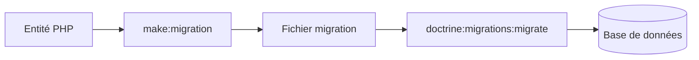
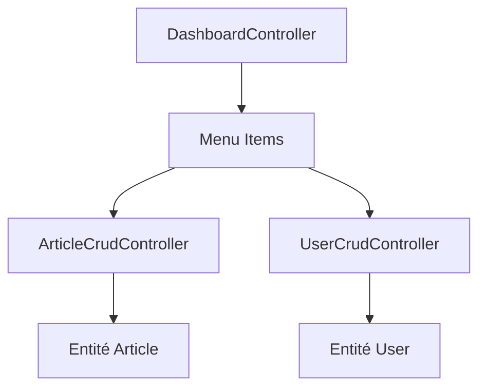

---
tags:
  - EasyAdmin
  - Débutant
  - Pratique
description: "Installer EasyAdmin et créer une interface d'administration"
estimated_time: "120 min"
fiche_number: 1
total_fiches: 7
cursus: "EasyAdmin"
---

# 01 - Installer EasyAdmin et créer une interface d'administration

> **En bref** : À la fin de cette fiche, tu sauras installer EasyAdmin pour créer une interface d'administration, créer des entités Doctrine, et générer automatiquement des pages CRUD (Create, Read, Update, Delete). Lecture estimée : 120 min.


## Prérequis

- Avoir complété la fiche **[01 - Créer un environnement Docker Compose pour Symfony](../01-docker/01-docker-compose-symfony.md)**
- Avoir complété la fiche **[02 - Lancer le projet et initialiser Git](../01-docker/02-lancement-projet-git.md)**
- Les conteneurs Docker doivent être en cours d'exécution (`docker compose up -d`)
- Aucune connaissance préalable d'EasyAdmin n'est requise (tout est expliqué ci-dessous)

## Version utilisée dans cette fiche

| Technologie | Version |
| ----------- | ------- |
| EasyAdmin | 4.x |

## Objectif de cette fiche

À la fin de cette fiche, tu sauras installer EasyAdmin pour créer une interface d'administration, créer des entités Doctrine, et générer automatiquement des pages CRUD (Create, Read, Update, Delete).

---

## Concepts

Cette section explique tous les concepts nécessaires. Lis-la entièrement avant de passer aux étapes pratiques.

### Qu'est-ce qu'EasyAdmin ?

**Définition** : EasyAdmin est un bundle Symfony qui permet de créer une interface d'administration sans écrire de code personnalisé pour gérer les données de ton application.

**Le problème qu'EasyAdmin résout** :

Sans EasyAdmin, pour créer une interface d'administration tu devrais :

1. **Créer des contrôleurs** pour chaque entité (plusieurs heures de code).

2. **Créer des templates Twig** pour lister, créer, modifier, supprimer (formulaires, tableaux...).

3. **Gérer la sécurité** pour protéger l'accès admin.

4. **Styliser l'interface** avec du CSS.

**Comment EasyAdmin résout ces problèmes** :

| Problème                  | Solution EasyAdmin                                   |
| ------------------------- | ---------------------------------------------------- |
| Créer des contrôleurs     | Une commande génère tout automatiquement             |
| Créer des templates       | Interface professionnelle incluse                    |
| Gérer la sécurité         | Intégration native avec Symfony Security             |
| Styliser l'interface      | Design moderne fourni, personnalisable               |

**Analogie concrète** : EasyAdmin est comme un kit de meubles IKEA. Au lieu de fabriquer chaque meuble à la main (créer tout le code), tu assembles des pièces préfabriquées. Le résultat est professionnel et tu gagnes énormément de temps.

**Ce qu'EasyAdmin n'est PAS** :

- EasyAdmin n'est pas un CMS (Content Management System) comme WordPress. Il ne gère pas de contenu par défaut, il gère les données de TES entités.
- EasyAdmin n'est pas une application complète. C'est un outil pour créer une partie de ton application.
- EasyAdmin n'est pas magique. Tu dois quand même créer tes entités et comprendre comment les configurer.

---

### Qu'est-ce qu'une entité Doctrine ?

**Définition** : Une entité Doctrine est une classe PHP qui représente une table dans la base de données. Chaque propriété de la classe correspond à une colonne de la table.

**Le problème que les entités résolvent** :

Sans entités, voici les problèmes rencontrés :

1. **Écrire du SQL** : Tu devrais écrire des requêtes SQL manuellement pour chaque opération.

2. **Mapping manuel** : Tu devrais convertir les résultats SQL en objets PHP toi-même.

3. **Pas de validation** : Aucune vérification automatique des types de données.

**Comment les entités résolvent ces problèmes** :

| Problème         | Solution Entité                                              |
| ---------------- | ------------------------------------------------------------ |
| Écrire du SQL    | Doctrine génère le SQL automatiquement                       |
| Mapping manuel   | Doctrine convertit automatiquement les données en objets     |
| Pas de validation| Les annotations/attributs PHP définissent les types          |

**Exemple d'entité** :

```php
use Doctrine\DBAL\Types\Types;
use Doctrine\ORM\Mapping as ORM;

#[ORM\Entity]
class Product
{
    #[ORM\Id]
    #[ORM\GeneratedValue]
    #[ORM\Column]
    private ?int $id = null;

    #[ORM\Column(length: 255)]
    private ?string $name = null;

    // Prix monétaire : DECIMAL en base, string en PHP (évite les erreurs de float)
    #[ORM\Column(type: Types::DECIMAL, precision: 10, scale: 2)]
    private ?string $price = null;
}
```

Cette classe PHP correspond à une table `product` avec les colonnes `id`, `name`, et `price`. Pour un montant d'argent, préfère `DECIMAL` + `string` (ou une librairie monétaire) plutôt qu'un `float` PHP.

**Analogie concrète** : Une entité est comme un formulaire papier standardisé. Le formulaire (entité) définit quelles informations sont attendues (nom, prix). Chaque formulaire rempli (ligne de la table) contient les données d'un produit spécifique.

**Ce qu'une entité n'est PAS** :

- Une entité n'est pas un tableau PHP. C'est un objet avec des méthodes (getters/setters).
- Une entité ne crée pas la table automatiquement. Il faut utiliser les migrations.

---

### Qu'est-ce qu'une migration ?

**Définition** : Une migration est un fichier PHP qui contient les instructions SQL pour modifier la structure de la base de données. Elle permet de versionner les changements de schéma.

**Le problème que les migrations résolvent** :

Sans migrations, voici les problèmes rencontrés :

1. **Modifications manuelles** : Tu devrais exécuter des commandes SQL à la main pour créer/modifier les tables.

2. **Pas d'historique** : Impossible de savoir quels changements ont été faits et dans quel ordre.

3. **Désynchronisation** : La base de données et les entités peuvent devenir incohérentes.

**Comment les migrations résolvent ces problèmes** :

| Problème             | Solution Migration                                       |
| -------------------- | -------------------------------------------------------- |
| Modifications manuelles| La migration contient le SQL, une commande l'exécute   |
| Pas d'historique     | Chaque migration est un fichier avec une date           |
| Désynchronisation    | Doctrine compare entités et base pour détecter les écarts|

**Workflow des migrations** :

Le schéma suivant illustre le flux de travail des migrations Doctrine, de l'entité PHP jusqu'à la base de données :



En résumé :

```text
1. Tu modifies une entité (ajoutes une propriété)
      ↓
2. Tu crées une migration (make:migration)
      ↓
3. Doctrine génère le SQL nécessaire
      ↓
4. Tu exécutes la migration (doctrine:migrations:migrate)
      ↓
5. La base de données est mise à jour
```

**Analogie concrète** : Les migrations sont comme un journal de modifications d'un contrat. Chaque avenant (migration) est numéroté et daté. Tu peux retracer toutes les modifications depuis le contrat original.

**Ce qu'une migration n'est PAS** :

- Une migration ne modifie pas les données existantes (sauf si tu l'écris explicitement).
- Une migration ne se crée pas automatiquement. Tu dois lancer `make:migration`.

---

### Qu'est-ce qu'un CRUD ?

**Définition** : CRUD est un acronyme pour les quatre opérations de base sur les données : Create (créer), Read (lire), Update (mettre à jour), Delete (supprimer).

**Le problème que le CRUD résout** :

Pour chaque entité, tu as besoin des mêmes fonctionnalités :

1. **Create** : Un formulaire pour créer un nouvel élément.

2. **Read** : Une liste pour voir tous les éléments et une page de détail.

3. **Update** : Un formulaire pour modifier un élément existant.

4. **Delete** : Un bouton pour supprimer un élément.

**Comment EasyAdmin génère le CRUD** :

| Opération | Ce qu'EasyAdmin génère                                   |
| --------- | -------------------------------------------------------- |
| Create    | Formulaire de création avec tous les champs de l'entité  |
| Read      | Tableau avec tri, recherche, pagination                  |
| Update    | Formulaire pré-rempli avec les données existantes        |
| Delete    | Bouton avec confirmation avant suppression               |

**Analogie concrète** : Le CRUD est comme les opérations de base d'un classeur. Tu peux ajouter une fiche (Create), consulter les fiches (Read), modifier une fiche (Update), ou jeter une fiche (Delete).

**Ce que le CRUD n'est PAS** :

- Le CRUD ne gère pas la logique métier complexe. Si tu as des règles spéciales (ex: un produit ne peut pas avoir un prix négatif), tu dois les ajouter toi-même.
- Le CRUD n'est pas visible par défaut. Il faut l'ajouter au menu du Dashboard.

---

### Architecture EasyAdmin

Le schéma suivant montre comment le Dashboard, les CRUD Controllers et les entités s'articulent dans EasyAdmin :



Le DashboardController est le point d'entrée. Il définit un menu dont chaque élément pointe vers un CRUD Controller. Chaque CRUD Controller gère les opérations sur une entité Doctrine.

---

### Qu'est-ce que le Dashboard EasyAdmin ?

**Définition** : Le Dashboard est la page d'accueil de l'interface d'administration. C'est le point d'entrée qui contient le menu et redirige vers les différentes sections.

**Le problème que le Dashboard résout** :

Sans Dashboard, voici les problèmes rencontrés :

1. **Pas de point d'entrée** : Les utilisateurs ne savent pas par où commencer.

2. **Pas de menu** : Impossible de naviguer entre les différentes entités.

3. **Pas de personnalisation** : L'interface n'a pas d'identité visuelle.

**Comment le Dashboard résout ces problèmes** :

| Problème             | Solution Dashboard                                      |
| -------------------- | ------------------------------------------------------- |
| Pas de point d'entrée| L'URL `/admin` affiche le Dashboard                     |
| Pas de menu          | Le Dashboard définit les éléments du menu               |
| Pas de personnalisation| Tu peux changer le titre, les icônes, les couleurs   |

**Analogie concrète** : Le Dashboard est comme l'accueil d'un immeuble de bureaux. Il y a un panneau d'affichage (menu) qui indique où se trouvent les différents services (entités).

---

## Récapitulatif des concepts

| Concept     | À retenir                                                      |
| ----------- | -------------------------------------------------------------- |
| EasyAdmin   | Bundle pour créer des interfaces d'administration rapidement   |
| Entité      | Classe PHP qui représente une table de la base de données      |
| Migration   | Fichier qui contient les modifications de structure de la BDD  |
| CRUD        | Create, Read, Update, Delete - les 4 opérations de base        |
| Dashboard   | Page d'accueil de l'administration avec le menu                |

---

## Étapes Pratiques

### Partie 1 : Installer EasyAdmin

#### Étape 1.1 : Entrer dans le conteneur PHP

```bash
docker compose exec php bash
```

Le prompt change pour indiquer que tu es dans le conteneur :

```text
root@abc123:/var/www/html#
```

---

#### Étape 1.2 : Installer le bundle EasyAdmin

> **Note de version** : Ce cursus couvre EasyAdmin 4.x. EasyAdmin 5 existe depuis 2025 (API partiellement modifiée). La commande ci-dessous épingle la version 4 pour éviter d'installer la v5 automatiquement. Si tu vois `Using version ^5.x` dans la sortie, consulte le `UPGRADE.md` du bundle avant de continuer.

```bash
composer require "easycorp/easyadmin-bundle:^4"
```

**Résultat attendu** :

```text
Using version ^4.x for easycorp/easyadmin-bundle
./composer.json has been updated
Running composer update easycorp/easyadmin-bundle
...
Symfony operations: 1 recipe (...)
  - Configuring easycorp/easyadmin-bundle (>=3.0): From github.com/symfony/recipes:main
...
```

Composer installe le bundle et ses dépendances.

---

#### Étape 1.3 : Créer le Dashboard

EasyAdmin a besoin d'un contrôleur "Dashboard" qui sert de page d'accueil de l'administration.

```bash
php bin/console make:admin:dashboard
```

**Questions posées** :

```text
Which class name do you prefer for your Dashboard controller? [DashboardController]:
>
```

Appuie sur Entrée pour accepter le nom par défaut.

```text
In which directory of your project do you want to generate "DashboardController"? [src/Controller/Admin/]:
>
```

Appuie sur Entrée pour accepter le répertoire par défaut.

**Résultat attendu** :

```text
 [OK] Your dashboard class has been successfully generated.
```

---

#### Étape 1.4 : Vider le cache

```bash
php bin/console cache:clear
```

---

#### Étape 1.5 : Sortir du conteneur

```bash
exit
```

---

#### Étape 1.6 : Accéder à l'interface admin

Ouvre ton navigateur et va à :

```text
http://localhost:8080/admin
```

**Résultat attendu** : Tu vois le tableau de bord EasyAdmin avec un message de bienvenue.

---

#### Étape 1.7 : Commiter les changements

De retour sur ta machine (pas dans le conteneur) :

```bash
# Voir ce qui a changé
git status

# Ajouter les modifications
git add .

# Créer le commit
git commit -m "Add EasyAdmin bundle and dashboard"

# Pousser vers GitHub
git push
```

---

### Partie 2 : Créer une entité

#### Étape 2.1 : Entrer dans le conteneur PHP

```bash
docker compose exec php bash
```

---

#### Étape 2.2 : Installer le Maker Bundle (si pas déjà installé)

Le Maker Bundle permet de générer du code automatiquement.

```bash
composer require symfony/maker-bundle --dev
```

---

#### Étape 2.3 : Créer une entité Product

Tu vas créer une entité `Product` comme exemple.

```bash
php bin/console make:entity
```

**Questions posées** :

```text
Class name of the entity to create or update (e.g. GentlePuppy):
> Product
```

Tape `Product` et appuie sur Entrée.

```text
New property name (press <return> to stop adding fields):
> name
```

Tape `name` et appuie sur Entrée.

```text
Field type (enter ? to see all types) [string]:
>
```

Appuie sur Entrée pour accepter `string`.

```text
Field length [255]:
>
```

Appuie sur Entrée pour accepter `255`.

```text
Can this field be null in the database (nullable) (yes/no) [no]:
>
```

Appuie sur Entrée pour accepter `no`.

```text
New property name (press <return> to stop adding fields):
> price
```

Tape `price` et appuie sur Entrée.

```text
Field type (enter ? to see all types) [string]:
> decimal
```

Pour un prix monétaire, préfère `decimal` (pas `float` : erreurs d'arrondi). Tu pourras aussi ajuster l'entité en `Types::DECIMAL` + `string` comme dans l'exemple plus haut.
Tape `decimal` et appuie sur Entrée.

```text
Can this field be null in the database (nullable) (yes/no) [no]:
>
```

Appuie sur Entrée pour accepter `no`.

```text
New property name (press <return> to stop adding fields):
>
```

Appuie sur Entrée pour terminer.

**Résultat attendu** :

```text
 created: src/Entity/Product.php
 created: src/Repository/ProductRepository.php

 Entity generated! Now let's add some fields!
```

---

### Partie 3 : Créer et exécuter la migration

#### Étape 3.1 : Créer la migration

```bash
php bin/console make:migration
```

**Résultat attendu** :

```text
 Success!

 Next: Review the new migration "migrations/VersionXXXXXXXXXXXXXX.php"
 Then: Run the migration with php bin/console doctrine:migrations:migrate
```

---

#### Étape 3.2 : Exécuter la migration

```bash
php bin/console doctrine:migrations:migrate
```

**Question posée** :

```text
WARNING! You are about to execute a migration in database "symfony_db" that could result in schema changes and data loss. Are you sure you wish to continue? (yes/no) [yes]:
>
```

Appuie sur Entrée pour confirmer.

**Résultat attendu** :

```text
[notice] Migrating up to DoctrineMigrations\VersionXXXXXXXXXXXXXX
[notice] finished in XXXms, used XXM memory, 1 migrations executed, 1 sql queries
```

---

### Partie 4 : Créer le CRUD Controller

#### Étape 4.1 : Générer le CRUD

```bash
php bin/console make:admin:crud
```

**Questions posées** :

```text
Which Doctrine entity are you going to manage with this CRUD controller?:
  [0] App\Entity\Product

> 0
```

Tape `0` et appuie sur Entrée.

```text
Which directory do you want to generate the CRUD controller in? [src/Controller/Admin/]:
>
```

Appuie sur Entrée pour accepter.

**Résultat attendu** :

```text
 [OK] Your CRUD controller class has been successfully generated.
```

---

#### Étape 4.2 : Enregistrer le CRUD dans le Dashboard

Ouvre le fichier `app/src/Controller/Admin/DashboardController.php` et remplace son contenu par :

```php
<?php

namespace App\Controller\Admin;

use App\Entity\Product;
use EasyCorp\Bundle\EasyAdminBundle\Config\Dashboard;
use EasyCorp\Bundle\EasyAdminBundle\Config\MenuItem;
use EasyCorp\Bundle\EasyAdminBundle\Controller\AbstractDashboardController;
use EasyCorp\Bundle\EasyAdminBundle\Router\AdminUrlGenerator;
use Symfony\Component\HttpFoundation\Response;
use Symfony\Component\Routing\Attribute\Route;

class DashboardController extends AbstractDashboardController
{
    #[Route('/admin', name: 'admin')]
    public function index(): Response
    {
        // Redirige vers la liste des produits
        $adminUrlGenerator = $this->container->get(AdminUrlGenerator::class);
        return $this->redirect($adminUrlGenerator->setController(ProductCrudController::class)->generateUrl());
    }

    public function configureDashboard(): Dashboard
    {
        return Dashboard::new()
            ->setTitle('Mon Administration');
    }

    public function configureMenuItems(): iterable
    {
        // Lien vers le dashboard (page d'accueil)
        yield MenuItem::linkToDashboard('Dashboard', 'fa fa-home');

        // Lien vers la liste des produits
        yield MenuItem::linkToCrud('Produits', 'fa fa-box', Product::class);
    }
}
```

**Explication du code** :

- `index()` : Redirige automatiquement vers la liste des produits au lieu d'afficher une page vide.
- `configureDashboard()` : Définit le titre affiché dans l'interface.
- `configureMenuItems()` : Définit les éléments du menu de navigation.

---

#### Étape 4.3 : Vider le cache

```bash
php bin/console cache:clear
```

---

#### Étape 4.4 : Sortir du conteneur

```bash
exit
```

---

#### Étape 4.5 : Tester le CRUD

1. Va sur `http://localhost:8080/admin`

2. Tu dois voir un menu avec "Produits"

3. Clique sur "Produits"

4. Clique sur "Créer Product" pour ajouter un produit

5. Remplis le formulaire :
   - Name : "Ordinateur portable"
   - Price : 999.99

6. Clique sur "Créer"

7. Vérifie que le produit apparaît dans la liste

---

#### Étape 4.6 : Commiter et pusher

```bash
git add .
git commit -m "Add Product entity and EasyAdmin CRUD"
git push
```

---

## Commandes Utiles

### Commandes EasyAdmin

| Commande                              | Action                               |
| ------------------------------------- | ------------------------------------ |
| `php bin/console make:admin:dashboard`| Crée le tableau de bord              |
| `php bin/console make:admin:crud`     | Crée un CRUD pour une entité         |

### Commandes Doctrine

| Commande                                      | Action                              |
| --------------------------------------------- | ----------------------------------- |
| `php bin/console make:entity`                 | Crée ou modifie une entité          |
| `php bin/console make:migration`              | Génère une migration                |
| `php bin/console doctrine:migrations:migrate` | Exécute les migrations en attente   |
| `php bin/console doctrine:migrations:status`  | Affiche l'état des migrations       |
| `php bin/console doctrine:schema:validate`    | Vérifie la cohérence entités/base   |

### Workflow typique

1. `make:entity` → Crée ou modifie une entité
2. `make:migration` → Génère le fichier de migration
3. `doctrine:migrations:migrate` → Applique la migration à la base
4. `make:admin:crud` → Génère le contrôleur CRUD
5. Modifier `DashboardController` → Ajoute l'entité au menu

---

## Pièges Fréquents

### Piège 1 : EasyAdmin affiche une erreur 404

⚠️ **Problème** : L'URL `/admin` affiche une page blanche ou une erreur.

✅ **Solution** : Vide le cache Symfony :

```bash
docker compose exec php php bin/console cache:clear
```

---

### Piège 2 : Le CRUD n'apparaît pas dans le menu

⚠️ **Problème** : Le menu EasyAdmin ne montre pas le lien vers les produits.

✅ **Solution** : Tu as oublié d'ajouter le `MenuItem` dans `DashboardController.php`. Vérifie la méthode `configureMenuItems()` et assure-toi d'avoir :

```php
yield MenuItem::linkToCrud('Produits', 'fa fa-box', Product::class);
```

---

### Piège 3 : Erreur "Table does not exist"

⚠️ **Problème** : EasyAdmin affiche une erreur car la table n'existe pas.

✅ **Solution** : Tu as oublié d'exécuter la migration :

```bash
docker compose exec php php bin/console doctrine:migrations:migrate
```

---

### Piège 4 : Erreur "Class not found" pour l'entité

⚠️ **Problème** : PHP ne trouve pas la classe Product.

✅ **Solution** : Vérifie que le `use` est présent en haut du fichier `DashboardController.php` :

```php
use App\Entity\Product;
```

---

### Piège 5 : Les modifications ne s'affichent pas

⚠️ **Problème** : Tu as modifié le code mais l'interface ne change pas.

✅ **Solution** : Vide le cache après chaque modification :

```bash
docker compose exec php php bin/console cache:clear
```

---

## Pour aller plus loin

Ces concepts ne sont pas nécessaires pour ce projet, mais tu peux les explorer si tu veux approfondir :

- **Filtres EasyAdmin** : Ajouter des filtres de recherche sur les listes d'entités. Permet de filtrer par date, catégorie, prix, etc.

- **Actions personnalisées** : Créer des boutons d'action custom comme "Exporter en CSV", "Envoyer un email", ou "Marquer comme traité".

- **Champs personnalisés** : Créer tes propres types de champs pour le formulaire, comme un sélecteur de couleur ou un éditeur de texte riche.

- **Sécurité et rôles** : Restreindre l'accès à certaines entités selon le rôle de l'utilisateur (admin, éditeur, lecteur).

- **Dashboard widgets** : Ajouter des graphiques et statistiques sur la page d'accueil admin pour visualiser les données importantes.

- **Thème et CSS** : Personnaliser l'apparence de l'interface d'administration avec tes propres couleurs et styles.

---

## Checklist de Validation

- [ ] EasyAdmin est installé (`composer show easycorp/easyadmin-bundle`)
- [ ] L'interface admin est accessible sur `/admin`
- [ ] L'entité Product existe dans `src/Entity/Product.php`
- [ ] La table product existe dans la base de données
- [ ] Le CRUD fonctionne : je peux créer un produit
- [ ] Le CRUD fonctionne : je peux voir la liste des produits
- [ ] Le CRUD fonctionne : je peux modifier un produit
- [ ] Le CRUD fonctionne : je peux supprimer un produit
- [ ] Les modifications sont commitées et poussées sur GitHub

---

## Exercice Pratique

**Énoncé** : Crée une entité `Category` avec les champs suivants :

- `name` (string, 100 caractères, obligatoire)
- `description` (text, nullable)

Puis crée une relation entre `Product` et `Category` (un produit appartient à une catégorie), et crée le CRUD EasyAdmin pour Category.

**Indications** :

- Utilise `php bin/console make:entity Category` pour créer l'entité
- Utilise `php bin/console make:entity Product` pour modifier Product et ajouter la relation
- Quand on te demande le type de relation, choisis `ManyToOne`
- N'oublie pas de créer et exécuter la migration
- Crée le CRUD avec `php bin/console make:admin:crud`
- Ajoute le MenuItem dans le Dashboard

**Résultat attendu** : Tu peux créer des catégories, puis créer des produits en sélectionnant leur catégorie dans un menu déroulant.

---

## Solution de l'Exercice

> **Note** : Cette section contient la solution complète. Essaie d'abord de résoudre l'exercice par toi-même avant de consulter cette solution.

---

**Étape 1 : Entrer dans le conteneur**

```bash
docker compose exec php bash
```

**Étape 2 : Créer l'entité Category**

```bash
php bin/console make:entity Category
```

Champs à ajouter :

- `name` : string, 100, not null
- `description` : text, nullable (réponds `yes` quand on te demande si le champ peut être null)

**Étape 3 : Ajouter la relation dans Product**

```bash
php bin/console make:entity Product
```

Ajouter un nouveau champ :

- Nom : `category`
- Type : `ManyToOne` (ou `relation` puis choisis ManyToOne)
- Classe liée : `Category`
- Nullable : `no`
- Ajouter la propriété inverse : `yes` (le nom sera `products`)

**Étape 4 : Créer et exécuter la migration**

```bash
php bin/console make:migration
php bin/console doctrine:migrations:migrate
```

**Étape 5 : Créer le CRUD pour Category**

```bash
php bin/console make:admin:crud
```

Sélectionne `Category` (c'est l'option `1` dans la liste affichée).

**Étape 6 : Mettre à jour le Dashboard**

Modifie `app/src/Controller/Admin/DashboardController.php` :

Ajoute en haut du fichier :

```php
use App\Entity\Category;
```

Dans la méthode `configureMenuItems()`, ajoute :

```php
yield MenuItem::linkToCrud('Catégories', 'fa fa-folder', Category::class);
```

**Étape 7 : Vider le cache et tester**

```bash
php bin/console cache:clear
exit
```

Va sur `/admin`, crée d'abord une catégorie, puis crée un produit en sélectionnant cette catégorie.

**Étape 8 : Commiter**

```bash
git add .
git commit -m "Add Category entity with Product relation and CRUD"
git push
```

---

## Navigation

→ Fiche suivante : **[Champs avancés et organisation des formulaires EasyAdmin](02-easyadmin-champs-avances.md)**
