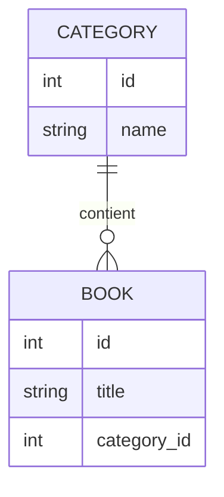
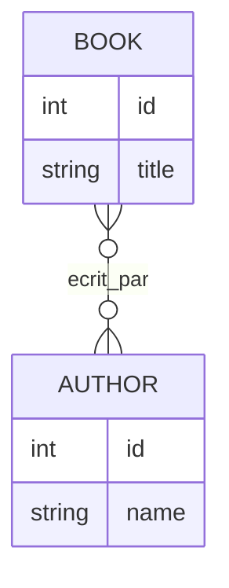

---
tags:
  - Symfony
  - Intermédiaire
  - Pratique
description: "Relations entre entités"
estimated_time: "70 min"
fiche_number: 7
total_fiches: 21
cursus: "Symfony"
---

# 07 - Relations entre entités

> **En bref** : À la fin de cette fiche, tu sauras créer des relations entre entités (ManyToOne, OneToMany, ManyToMany) et naviguer entre les objets liés. Lecture estimée : 70 min.


## Prérequis

- Avoir lu la fiche **[04 - Introduction à Doctrine](04-introduction-doctrine.md)**
- Avoir lu la fiche **[05 - Créer des entités](05-creer-entites.md)**
- Avoir lu la fiche **[06 - Les migrations](06-migrations.md)**
- Comprendre les tableaux PHP (fiche **[02-php/03 - Les tableaux](../02-php/03-tableaux-arrays.md)**)

## Objectif de cette fiche

À la fin de cette fiche, tu sauras créer des relations entre entités (ManyToOne, OneToMany, ManyToMany) et naviguer entre les objets liés.

---

## Concepts

Cette section explique tous les concepts nécessaires. Lis-la entièrement avant de passer aux étapes pratiques.

### Qu'est-ce qu'une relation ?

**Définition** : Une relation est un lien entre deux entités qui permet de représenter des associations du monde réel (un livre a un auteur, une commande contient des produits, etc.).

**Le problème que les relations résolvent** :

Sans relations dans l'ORM, voici les problèmes rencontrés :

1. **Requêtes manuelles** : Tu dois écrire du SQL avec des JOIN pour chaque association.
2. **Données incohérentes** : Rien n'empêche de référencer un auteur qui n'existe pas.
3. **Navigation complexe** : Pour obtenir les livres d'un auteur, il faut plusieurs requêtes.

**Comment les relations résolvent ces problèmes** :

| Problème | Solution apportée par les relations |
| -------- | ----------------------------------- |
| Requêtes manuelles | Doctrine génère les JOIN automatiquement |
| Données incohérentes | Contraintes de clé étrangère en base |
| Navigation complexe | `$author->getBooks()` retourne directement les livres |

**Analogie concrète** : Imagine un système de fiches cartonnées reliées par des fils. Une fiche "Auteur" est reliée par des fils à plusieurs fiches "Livre". En tirant sur un fil depuis la fiche Auteur, tu arrives directement à un Livre. Les relations Doctrine sont ces fils : elles connectent les objets entre eux.

---

### Les trois types de relations

Doctrine propose trois types de relations principales :

| Type | Description | Exemple concret |
| ---- | ----------- | --------------- |
| **ManyToOne** | Plusieurs entités A liées à une entité B | Plusieurs livres appartiennent à une catégorie |
| **OneToMany** | Une entité A liée à plusieurs entités B | Une catégorie contient plusieurs livres |
| **ManyToMany** | Plusieurs entités A liées à plusieurs entités B | Plusieurs livres ont plusieurs auteurs |

**Note** : ManyToOne et OneToMany sont les deux côtés de la même relation. Si un livre a une catégorie (ManyToOne), alors une catégorie a plusieurs livres (OneToMany).

---

### Relation ManyToOne (Plusieurs vers Un)

**Définition** : Plusieurs entités du côté "Many" sont liées à une seule entité du côté "One".

**Schéma** :



**En base de données** :

La table `book` a une colonne `category_id` qui référence la table `category`.

```text
Table: book
+----+------------------+-------------+
| id | title            | category_id |
+----+------------------+-------------+
| 1  | Dune             | 1           |
| 2  | Fondation        | 1           |
| 3  | Le Seigneur...   | 2           |
+----+------------------+-------------+

Table: category
+----+------------------+
| id | name             |
+----+------------------+
| 1  | Science-Fiction  |
| 2  | Fantasy          |
+----+------------------+
```

**Code PHP** :

```php
// src/Entity/Book.php
#[ORM\ManyToOne(targetEntity: Category::class)]
#[ORM\JoinColumn(nullable: false)]  // Un livre DOIT avoir une catégorie
private ?Category $category = null;

// Utilisation
$book = new Book();
$book->setCategory($scienceFictionCategory);

// Navigation
$category = $book->getCategory();  // Retourne l'objet Category
echo $category->getName();         // "Science-Fiction"
```

---

### Relation OneToMany (Un vers Plusieurs)

**Définition** : C'est l'inverse du ManyToOne. Une entité est liée à plusieurs autres.

**Important** : Une relation OneToMany existe toujours avec un ManyToOne de l'autre côté. On dit qu'elles sont "bidirectionnelles".

**Code PHP** :

```php
// src/Entity/Category.php
use Doctrine\Common\Collections\ArrayCollection;
use Doctrine\Common\Collections\Collection;

#[ORM\OneToMany(targetEntity: Book::class, mappedBy: 'category')]
private Collection $books;

public function __construct()
{
    $this->books = new ArrayCollection();  // Initialisation obligatoire
}

// Utilisation
$books = $category->getBooks();  // Retourne une Collection de Book
foreach ($books as $book) {
    echo $book->getTitle();
}
```

**L'attribut `mappedBy`** :

`mappedBy: 'category'` signifie : "Cette relation est définie par la propriété `$category` dans l'entité Book."

---

### Côté "propriétaire" vs côté "inverse"

Dans une relation bidirectionnelle, un côté est "propriétaire" et l'autre est "inverse".

**Règle** : Le côté qui a la clé étrangère en base est le propriétaire.

| Côté | Attribut | A la clé étrangère | Exemple |
| ---- | -------- | ------------------ | ------- |
| Propriétaire (owning) | `inversedBy` | Oui | Book (a category_id) |
| Inverse | `mappedBy` | Non | Category |

**Pourquoi c'est important** :

- Les modifications sont prises en compte uniquement quand le côté propriétaire (la clé étrangère) est positionné
- Pour ajouter un livre à une catégorie, fais `$book->setCategory($category)` ; ou `$category->addBook($book)`, qui appelle `setCategory()` en interne. Modifier seulement la collection (`$category->getBooks()->add($book)`) ne suffit pas.

---

### Relation ManyToMany (Plusieurs vers Plusieurs)

**Définition** : Plusieurs entités d'un côté peuvent être liées à plusieurs entités de l'autre côté.

**Exemple concret** : Un livre peut avoir plusieurs auteurs, et un auteur peut écrire plusieurs livres.

**Schéma** :



**En base de données** :

Une table intermédiaire (table de jointure) stocke les associations.

```text
Table: book_author (table de jointure)
+---------+-----------+
| book_id | author_id |
+---------+-----------+
| 1       | 1         |
| 1       | 2         |  <-- Livre 1 a deux auteurs
| 2       | 1         |
+---------+-----------+
```

**Code PHP (côté propriétaire)** :

```php
// src/Entity/Book.php
#[ORM\ManyToMany(targetEntity: Author::class, inversedBy: 'books')]
#[ORM\JoinTable(name: 'book_author')]  // Nom de la table de jointure
private Collection $authors;

public function __construct()
{
    $this->authors = new ArrayCollection();
}

public function addAuthor(Author $author): static
{
    if (!$this->authors->contains($author)) {
        $this->authors->add($author);
        // Synchronise le côté inverse en mémoire (cohérence de l'objet PHP)
        $author->addBook($this);
    }
    return $this;
}

public function removeAuthor(Author $author): static
{
    if ($this->authors->removeElement($author)) {
        $author->removeBook($this);
    }
    return $this;
}
```

**Code PHP (côté inverse)** :

```php
// src/Entity/Author.php
#[ORM\ManyToMany(targetEntity: Book::class, mappedBy: 'authors')]
private Collection $books;

public function __construct()
{
    $this->books = new ArrayCollection();
}

// Méthodes appelées par Book::addAuthor / removeAuthor pour garder les deux côtés cohérents
public function addBook(Book $book): static
{
    if (!$this->books->contains($book)) {
        $this->books->add($book);
    }
    return $this;
}

public function removeBook(Book $book): static
{
    $this->books->removeElement($book);
    return $this;
}
```

---

### La classe Collection

Les relations "ToMany" (OneToMany, ManyToMany) utilisent une `Collection` et non un tableau PHP simple.

**Pourquoi Collection et non array** :

| Fonctionnalité | array | Collection |
| -------------- | ----- | ---------- |
| Chargement différé (lazy loading) | Non | Oui |
| Méthodes utilitaires | Non | Oui |
| Gestion par Doctrine | Non | Oui |

**Méthodes utiles de Collection** :

| Méthode | Action | Exemple |
| ------- | ------ | ------- |
| `add($element)` | Ajoute un élément | `$books->add($book)` |
| `remove($key)` | Supprime par clé | `$books->remove(0)` |
| `removeElement($element)` | Supprime par élément | `$books->removeElement($book)` |
| `contains($element)` | Vérifie si présent | `$books->contains($book)` |
| `count()` | Compte les éléments | `$books->count()` |
| `isEmpty()` | Vérifie si vide | `$books->isEmpty()` |
| `first()` | Premier élément | `$books->first()` |
| `last()` | Dernier élément | `$books->last()` |
| `toArray()` | Convertit en tableau | `$books->toArray()` |

---

### Le cascade

**Définition** : Le cascade définit ce qui arrive aux entités liées quand on effectue une opération sur l'entité principale.

**Options de cascade** :

| Option | Action |
| ------ | ------ |
| `cascade: ['persist']` | Sauvegarde automatiquement les entités liées |
| `cascade: ['remove']` | Supprime automatiquement les entités liées |
| `cascade: ['all']` | Active tous les cascades |

**Exemple** :

```php
// Quand on persiste une Category, persiste aussi ses nouveaux Books
#[ORM\OneToMany(targetEntity: Book::class, mappedBy: 'category', cascade: ['persist'])]
private Collection $books;
```

**Attention avec `cascade: ['remove']`** : Si tu supprimes une catégorie, tous ses livres seront supprimés ! Utilise avec prudence.

---

### orphanRemoval

**Définition** : Supprime automatiquement une entité enfant si elle est retirée de la collection parente.

```php
#[ORM\OneToMany(targetEntity: Book::class, mappedBy: 'category', orphanRemoval: true)]
private Collection $books;
```

**Différence cascade remove vs orphanRemoval** :

| Situation | cascade: ['remove'] | orphanRemoval: true |
| --------- | ------------------- | ------------------- |
| Supprimer la catégorie | Supprime tous les livres | Supprime tous les livres |
| Retirer un livre de la collection | Le livre reste en base | Le livre est supprimé |

---

## Étapes Pratiques

### Étape 1 : Créer une relation ManyToOne avec make:entity

Crée d'abord les deux entités si elles n'existent pas :

```bash
# Créer Category
php bin/console make:entity Category
> name (string, 100, not null)
> (Entrée pour terminer)

# Créer Book
php bin/console make:entity Book
> title (string, 255, not null)
> (Entrée pour terminer)
```

Ajoute la relation :

```bash
php bin/console make:entity Book
```

```text
New property name:
> category

Field type:
> relation

What class should this entity be related to?:
> Category

Relation type? [ManyToOne, OneToMany, ManyToMany, OneToOne]:
> ManyToOne

Is the Book.category property allowed to be null (nullable)? (yes/no) [yes]:
> no

Do you want to add a new property to Category so that you can access/update
Book objects from it - e.g. $category->getBooks()? (yes/no) [yes]:
> yes

New field name inside Category [books]:
> books

Do you want to automatically delete orphaned App\Entity\Book objects
(orphanRemoval)? (yes/no) [no]:
> no

updated: src/Entity/Book.php
updated: src/Entity/Category.php
```

---

### Étape 2 : Examiner le code généré

**Dans Book.php** :

```php
#[ORM\ManyToOne(inversedBy: 'books')]
#[ORM\JoinColumn(nullable: false)]
private ?Category $category = null;

public function getCategory(): ?Category
{
    return $this->category;
}

public function setCategory(?Category $category): static
{
    $this->category = $category;
    return $this;
}
```

**Dans Category.php** :

```php
use Doctrine\Common\Collections\ArrayCollection;
use Doctrine\Common\Collections\Collection;

#[ORM\OneToMany(targetEntity: Book::class, mappedBy: 'category')]
private Collection $books;

public function __construct()
{
    $this->books = new ArrayCollection();
}

/**
 * @return Collection<int, Book>
 */
public function getBooks(): Collection
{
    return $this->books;
}

public function addBook(Book $book): static
{
    if (!$this->books->contains($book)) {
        $this->books->add($book);
        $book->setCategory($this);  // Met à jour le côté propriétaire
    }
    return $this;
}

public function removeBook(Book $book): static
{
    if ($this->books->removeElement($book)) {
        // set the owning side to null (unless already changed)
        if ($book->getCategory() === $this) {
            $book->setCategory(null);
        }
    }
    return $this;
}
```

---

### Étape 3 : Créer la migration et l'exécuter

```bash
php bin/console make:migration
php bin/console doctrine:migrations:migrate
```

---

### Étape 4 : Utiliser la relation dans un contrôleur

```php
// src/Controller/BookController.php

#[Route('/books/create', name: 'book_create')]
public function create(EntityManagerInterface $em): Response
{
    // Créer ou récupérer une catégorie
    $category = new Category();
    $category->setName('Science-Fiction');

    // Créer un livre et l'associer à la catégorie
    $book = new Book();
    $book->setTitle('Dune');
    $book->setCategory($category);  // Associe le livre à la catégorie

    // Persister les deux (cascade possible)
    $em->persist($category);
    $em->persist($book);
    $em->flush();

    return new Response('Livre créé avec sa catégorie');
}
```

---

### Étape 5 : Naviguer dans les relations

```php
// Depuis un livre, accéder à sa catégorie
$book = $bookRepository->find(1);
$categoryName = $book->getCategory()->getName();

// Depuis une catégorie, accéder à ses livres
$category = $categoryRepository->find(1);
$books = $category->getBooks();

foreach ($books as $book) {
    echo $book->getTitle();
}
```

---

### Étape 6 : Créer une relation ManyToMany

**Note** : `make:entity` exige que la classe cible d'une relation existe déjà. Sinon il refuse avec une erreur "Unknown class". Crée d'abord l'entité `Author` :

```bash
# Créer d'abord l'entité Author (sinon make:entity refuse une cible inexistante)
php bin/console make:entity Author
> name (string, 255, not null)
> (Entrée pour terminer)
```

Ajoute ensuite la relation ManyToMany depuis Book :

```bash
php bin/console make:entity Book
```

```text
New property name:
> authors

Field type:
> relation

What class should this entity be related to?:
> Author

Relation type? [ManyToOne, OneToMany, ManyToMany, OneToOne]:
> ManyToMany

Do you want to add a new property to Author so that you can access/update
Book objects from it? (yes/no) [yes]:
> yes

New field name inside Author [books]:
> books

updated: src/Entity/Book.php
updated: src/Entity/Author.php
```

---

### Étape 7 : Utiliser une relation ManyToMany

```php
// Créer des auteurs
$author1 = new Author();
$author1->setName('Frank Herbert');

$author2 = new Author();
$author2->setName('Brian Herbert');

// Créer un livre avec plusieurs auteurs
$book = new Book();
$book->setTitle('Dune: House Atreides');
$book->addAuthor($author1);
$book->addAuthor($author2);

$em->persist($author1);
$em->persist($author2);
$em->persist($book);
$em->flush();

// Lire les auteurs d'un livre
foreach ($book->getAuthors() as $author) {
    echo $author->getName();
}

// Lire les livres d'un auteur
foreach ($author1->getBooks() as $book) {
    echo $book->getTitle();
}
```

---

## Commandes Utiles

| Commande | Action |
| -------- | ------ |
| `php bin/console make:entity` | Créer ou modifier une entité (avec relations) |
| `php bin/console doctrine:schema:validate` | Vérifier que les relations sont correctes |
| `php bin/console doctrine:mapping:info` | Lister les entités et leurs associations |

---

## Pièges Fréquents

### Piège 1 : Oublier d'initialiser la Collection

**Problème** : Erreur "Call to a member function add() on null".

**Cause** : La propriété Collection n'est pas initialisée.

**Solution** : Toujours initialiser dans le constructeur :

```php
public function __construct()
{
    $this->books = new ArrayCollection();
}
```

---

### Piège 2 : Modifier uniquement le côté inverse

**Problème** : Tu ajoutes un livre à une catégorie mais la relation n'est pas sauvegardée.

**Cause** : Les modifications depuis le côté inverse (`mappedBy`) ne sont pas prises en compte par Doctrine.

```php
// ❌ Ne fonctionne pas : on ne touche que la collection (côté inverse)
$category->getBooks()->add($book);

// ✅ Fonctionne : on positionne le côté propriétaire (la clé étrangère)
$book->setCategory($category);

// ✅ Fonctionne aussi : addBook() générée appelle setCategory() en interne
$category->addBook($book);
```

**Solution** : Toujours modifier le côté propriétaire. La méthode `addBook()` générée le fait automatiquement :

```php
public function addBook(Book $book): static
{
    if (!$this->books->contains($book)) {
        $this->books->add($book);
        $book->setCategory($this);  // ← Met à jour le côté propriétaire
    }
    return $this;
}
```

---

### Piège 3 : Référence circulaire dans JSON

**Problème** : Erreur "circular référence" quand tu sérialises en JSON.

**Cause** : Book référence Category, qui référence Books, qui référence Category...

**Solution** : Utiliser `#[Ignore]` sur un côté ou configurer la sérialisation avec des groupes.

```php
use Symfony\Component\Serializer\Attribute\Ignore;

#[ORM\OneToMany(targetEntity: Book::class, mappedBy: 'category')]
#[Ignore]  // Ne pas inclure dans la sérialisation
private Collection $books;
```

---

### Piège 4 : N+1 queries (problème de performance)

**Problème** : La page est lente quand tu affiches une liste avec des relations.

**Cause** : Doctrine fait une requête pour chaque entité liée (N+1 requêtes au lieu d'une).

**Solution** : Charger les relations avec un JOIN dans le repository :

```php
// Dans CategoryRepository.php
public function findAllWithBooks(): array
{
    return $this->createQueryBuilder('c')
        ->leftJoin('c.books', 'b')
        ->addSelect('b')  // Important : charge les livres en même temps
        ->getQuery()
        ->getResult();
}
```

---

## Checklist de Validation

- [ ] Je comprends la différence entre ManyToOne et OneToMany
- [ ] Je sais créer une relation ManyToOne avec make:entity
- [ ] Je comprends les côtés "propriétaire" et "inverse"
- [ ] Je sais naviguer entre entités liées (`$book->getCategory()`, `$category->getBooks()`)
- [ ] Je sais créer une relation ManyToMany
- [ ] Je comprends l'importance d'initialiser les Collections dans le constructeur

---

## Exercice Pratique

**Énoncé** : Crée un système de blog avec des articles et des tags.

**Spécifications** :

1. Un `Article` appartient à une `Category` (ManyToOne)
2. Un `Article` peut avoir plusieurs `Tag` et un `Tag` peut être sur plusieurs `Article` (ManyToMany)

**Entités à créer** :

- `Category` : name (string)
- `Tag` : name (string)
- `Article` : title (string), category (ManyToOne), tags (ManyToMany)

**Test à réaliser** :

1. Crée une catégorie "Technologie"
2. Crée deux tags "PHP" et "Symfony"
3. Crée un article "Introduction à Symfony" dans la catégorie "Technologie" avec les deux tags
4. Affiche :
   - Le nom de la catégorie de l'article
   - Les noms de tous les tags de l'article

---

## Solution de l'Exercice

> **Note** : Cette section contient la solution complète. Essaie d'abord de résoudre l'exercice par toi-même avant de consulter cette solution.

---

**Création des entités** :

```bash
# Category (si pas déjà créée)
php bin/console make:entity Category
> name (string, 100)

# Tag
php bin/console make:entity Tag
> name (string, 50)

# Article avec relations
php bin/console make:entity Article
> title (string, 255)
> category (relation, ManyToOne vers Category, not null, avec inverse)
> tags (relation, ManyToMany vers Tag, avec inverse)
```

**Migrations** :

```bash
php bin/console make:migration
php bin/console doctrine:migrations:migrate
```

**Contrôleur de test** :

```php
// src/Controller/TestBlogController.php

namespace App\Controller;

use App\Entity\Article;
use App\Entity\Category;
use App\Entity\Tag;
use Doctrine\ORM\EntityManagerInterface;
use Symfony\Bundle\FrameworkBundle\Controller\AbstractController;
use Symfony\Component\HttpFoundation\Response;
use Symfony\Component\Routing\Attribute\Route;

class TestBlogController extends AbstractController
{
    #[Route('/test-blog', name: 'test_blog')]
    public function test(EntityManagerInterface $em): Response
    {
        // 1. Créer la catégorie
        $category = new Category();
        $category->setName('Technologie');

        // 2. Créer les tags
        $tagPhp = new Tag();
        $tagPhp->setName('PHP');

        $tagSymfony = new Tag();
        $tagSymfony->setName('Symfony');

        // 3. Créer l'article avec relations
        $article = new Article();
        $article->setTitle('Introduction à Symfony');
        $article->setCategory($category);
        $article->addTag($tagPhp);
        $article->addTag($tagSymfony);

        // 4. Persister tout
        $em->persist($category);
        $em->persist($tagPhp);
        $em->persist($tagSymfony);
        $em->persist($article);
        $em->flush();

        // 5. Afficher les résultats
        $output = "Article : " . $article->getTitle() . "\n";
        $output .= "Catégorie : " . $article->getCategory()->getName() . "\n";
        $output .= "Tags : ";

        $tagNames = [];
        foreach ($article->getTags() as $tag) {
            $tagNames[] = $tag->getName();
        }
        $output .= implode(', ', $tagNames);

        return new Response('<pre>' . $output . '</pre>');
    }
}
```

**Résultat attendu** :

```text
Article : Introduction à Symfony
Catégorie : Technologie
Tags : PHP, Symfony
```

---

## Navigation

← Fiche précédente : **[Les migrations](06-migrations.md)**

→ Fiche suivante : **[Repository et CRUD](08-repository-crud.md)**
