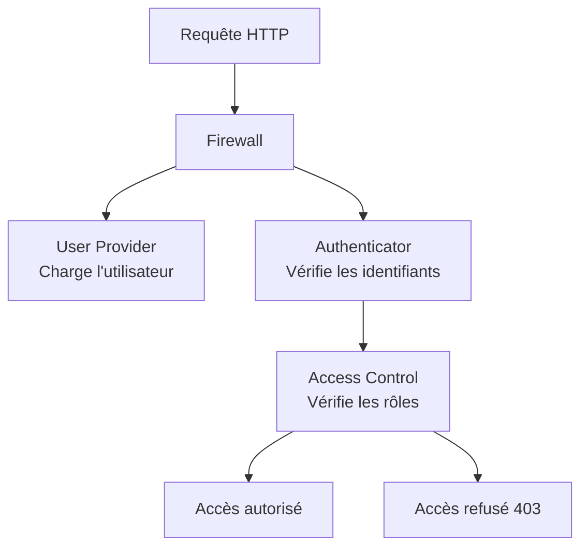

---
tags:
  - Symfony
  - Avancé
  - Pratique
description: "Sécurité et utilisateurs"
estimated_time: "75 min"
fiche_number: 12
total_fiches: 21
cursus: "Symfony"
---

# 12 - Sécurité et utilisateurs

> **En bref** : À la fin de cette fiche, tu sauras configurer l'authentification et l'autorisation dans Symfony 7.4 : créer une entité User, configurer le firewall, gérer les rôles et protéger les routes. Lecture estimée : 75 min.


## Prérequis

- Avoir lu la fiche **[09 - Les formulaires](09-formulaires.md)**
- Savoir créer une entité Doctrine et un formulaire Symfony
- _(Optionnel, si tu suis le cursus EasyAdmin)_ Avoir lu la fiche **[03 - Sécuriser l'administration avec l'authentification](../03-easyadmin/03-easyadmin-authentification.md)** - les concepts de `security.yaml` y sont introduits mais sont aussi expliqués intégralement dans cette fiche

## Objectif de cette fiche

À la fin de cette fiche, tu sauras configurer l'authentification et l'autorisation dans Symfony 7.4 : créer une entité User, configurer le firewall, gérer les rôles et protéger les routes.

---

## Concepts

Cette section explique tous les concepts nécessaires. Lis-la entièrement avant de passer aux étapes pratiques.

### Qu'est-ce que la sécurité web ?

**Définition** : La sécurité web regroupe les mécanismes qui contrôlent qui peut accéder à une application et ce que chaque personne a le droit de faire.

**Le problème que la sécurité résout** :

Sans système de sécurité, voici les problèmes rencontrés :

1. **Accès libre** : N'importe qui peut accéder à l'administration et modifier les données.
2. **Pas d'identité** : Impossible de savoir qui a créé ou modifié un contenu.
3. **Pas de permissions** : Un simple utilisateur peut supprimer les articles des autres.

**Comment la sécurité résout ces problèmes** :

| Problème | Solution apportée par la sécurité |
| -------- | --------------------------------- |
| Accès libre | L'authentification vérifie l'identité de l'utilisateur |
| Pas d'identité | Chaque action est liée à un utilisateur connecté |
| Pas de permissions | L'autorisation vérifie les droits avant chaque action |

**Analogie concrète** : Imagine un immeuble de bureaux avec un système de badges. Pour entrer dans le bâtiment, tu dois passer ton badge au lecteur (authentification : "Qui es-tu ?"). Selon ton badge, tu as accès à certains étages : employé au 1er étage, manager au 2e étage, directeur à tous les étages (autorisation : "Qu'as-tu le droit de faire ?").

**Les deux piliers de la sécurité** :

| Pilier | Question | Exemple |
| ------ | -------- | ------- |
| Authentification | "Qui es-tu ?" | Connexion avec email + mot de passe |
| Autorisation | "Qu'as-tu le droit de faire ?" | Seul un admin peut supprimer un utilisateur |

---

### Le composant Security de Symfony

**Définition** : Le composant Security est le système intégré de Symfony qui gère l'authentification et l'autorisation. Il repose sur trois éléments principaux.

**Les trois éléments** :

```text
1. Provider (fournisseur d'utilisateurs)
   └── Où trouver les utilisateurs ? (base de données, API, fichier...)

2. Firewall (pare-feu)
   └── Comment authentifier les utilisateurs ? (formulaire, token, API key...)

3. Access Control (contrôle d'accès)
   └── Qui a le droit d'accéder à quoi ? (rôles, voters...)
```

Le schéma suivant illustre comment ces trois éléments interagissent pour traiter une requête :



**Fichier de configuration** : `config/packages/security.yaml`

---

### L'entité User

**Définition** : L'entité User est la classe PHP qui représente un utilisateur dans ton application. Elle implémente deux interfaces obligatoires.

**Les deux interfaces** :

| Interface | Rôle | Méthodes requises |
| --------- | ---- | ----------------- |
| `UserInterface` | Identifie l'utilisateur | `getUserIdentifier()`, `getRoles()`, `eraseCredentials()` |
| `PasswordAuthenticatedUserInterface` | Gère le mot de passe | `getPassword()` |

**Explication des méthodes** :

| Méthode | Ce qu'elle fait |
| ------- | --------------- |
| `getUserIdentifier()` | Retourne l'identifiant unique (email) |
| `getRoles()` | Retourne la liste des rôles de l'utilisateur |
| `getPassword()` | Retourne le mot de passe hashé |
| `eraseCredentials()` | Historiquement : efface des données sensibles temporaires. **Depuis Symfony 7.3**, cette méthode est dépréciée et n'est plus appelée automatiquement par le composant Security en 7.4. Ne base plus de logique critique dessus ; préfère ne pas stocker de secret en clair sur l'entité User. |

---

### Les firewalls

**Définition** : Un firewall définit comment les utilisateurs sont authentifiés pour un ensemble de routes.

**Les firewalls par défaut** :

| Firewall | Routes | Rôle |
| -------- | ------ | ---- |
| `dev` | `/_profiler`, `/_wdt` | Pas d'authentification (outils de debug) |
| `main` | Toutes les autres | Authentification active |

**Analogie concrète** : Un firewall est comme un poste de contrôle à l'entrée d'une zone. Le firewall `dev` est la porte de service des employés (pas de badge nécessaire). Le firewall `main` est l'entrée principale (badge obligatoire pour certaines zones).

---

### Le form_login

**Définition** : `form_login` est un mécanisme d'authentification qui utilise un formulaire HTML classique (email + mot de passe) pour connecter les utilisateurs.

**Comment ça fonctionne** :

```text
1. L'utilisateur accède à /login
2. Il remplit le formulaire (email + mot de passe)
3. Il soumet le formulaire → POST vers /login
4. Symfony vérifie l'email dans le provider (base de données)
5. Symfony compare le mot de passe hashé
6. Si correct → l'utilisateur est connecté et redirigé
7. Si incorrect → retour au formulaire avec une erreur
```

---

### Les rôles

**Définition** : Un rôle est une chaîne de caractères qui représente un niveau de permission. Chaque utilisateur possède un ou plusieurs rôles.

**Règles des rôles** :

1. Un rôle doit toujours commencer par `ROLE_`
2. Chaque utilisateur a au minimum le rôle `ROLE_USER` (ajouté automatiquement par `getRoles()`)
3. Les rôles sont stockés en JSON dans la base de données

**Rôles courants** :

| Rôle | Usage |
| ---- | ----- |
| `ROLE_USER` | Utilisateur standard (attribué automatiquement) |
| `ROLE_ADMIN` | Administrateur |
| `ROLE_SUPER_ADMIN` | Super administrateur |
| `ROLE_EDITOR` | Éditeur de contenu |
| `ROLE_MODERATOR` | Modérateur |

**Hiérarchie des rôles** : Tu peux définir qu'un rôle inclut automatiquement d'autres rôles :

```yaml
# config/packages/security.yaml
security:
    role_hierarchy:
        ROLE_ADMIN: ROLE_USER
        ROLE_SUPER_ADMIN: [ROLE_ADMIN, ROLE_EDITOR]
```

Avec cette hiérarchie :

- `ROLE_ADMIN` a automatiquement `ROLE_USER`
- `ROLE_SUPER_ADMIN` a automatiquement `ROLE_ADMIN`, `ROLE_EDITOR` et `ROLE_USER`

---

### Le contrôle d'accès

**Définition** : Le contrôle d'accès vérifie qu'un utilisateur a le droit d'effectuer une action. Il existe trois manières de contrôler l'accès.

**Les trois niveaux de contrôle** :

| Niveau | Où | Comment |
| ------ | -- | ------- |
| Global | `security.yaml` | `access_control` (par pattern d'URL) |
| Contrôleur | Attribut PHP | `#[IsGranted('ROLE_ADMIN')]` |
| Template | Twig | `` |

---

### Les Voters

**Définition** : Un Voter est une classe qui encapsule une logique d'autorisation complexe. Il répond à la question : "Cet utilisateur a-t-il le droit de faire cette action sur cet objet ?"

**Le problème que les Voters résolvent** :

Les rôles simples ne suffisent pas toujours :

1. **Autorisation par propriété** : Seul l'auteur d'un article peut le modifier (pas n'importe quel `ROLE_USER`).
2. **Logique conditionnelle** : Un article ne peut être supprimé que s'il est en brouillon.

**Comment un Voter fonctionne** :

```text
1. Tu demandes : "L'utilisateur peut-il EDIT cet article ?"
2. Symfony consulte tous les Voters enregistrés
3. Chaque Voter répond :
   - ACCESS_GRANTED : oui, autorisé
   - ACCESS_DENIED : non, refusé
   - ACCESS_ABSTAIN : je ne sais pas (ce n'est pas mon domaine)
4. Symfony prend la décision finale selon les votes
```

---

## Étapes Pratiques

### Étape 1 : Créer l'entité User avec make:user

```bash
php bin/console make:user
```

**Dialogue** :

```text
The name of the security user class (e.g. User) [User]:
> User

Do you want to store user data in the database (via Doctrine)? (yes/no) [yes]:
> yes

Enter a property name that will be the unique "display" name for the user (e.g. email, username, uuid) [email]:
> email

Will this app need to hash/check user passwords? Choose No if passwords are not needed or are checked/hashed by some other system (e.g. a single sign-on server).

Does this app need to hash/check user passwords? (yes/no) [yes]:
> yes

created: src/Entity/User.php
created: src/Repository/UserRepository.php
updated: config/packages/security.yaml

Success!
```

**Résultat attendu** : Symfony a créé l'entité User et mis à jour `security.yaml`.

---

### Étape 2 : Examiner et créer la migration

Examine l'entité générée :

```php
<?php
// src/Entity/User.php

namespace App\Entity;

use App\Repository\UserRepository;
use Doctrine\ORM\Mapping as ORM;
use Symfony\Component\Security\Core\User\PasswordAuthenticatedUserInterface;
use Symfony\Component\Security\Core\User\UserInterface;

#[ORM\Entity(repositoryClass: UserRepository::class)]
#[ORM\Table(name: '`user`')]
#[ORM\UniqueConstraint(name: 'UNIQ_IDENTIFIER_EMAIL', fields: ['email'])]
class User implements UserInterface, PasswordAuthenticatedUserInterface
{
    #[ORM\Id]
    #[ORM\GeneratedValue]
    #[ORM\Column]
    private ?int $id = null;

    #[ORM\Column(length: 180)]
    private ?string $email = null;

    /** @var list<string> Les rôles de l'utilisateur */
    #[ORM\Column]
    private array $roles = [];

    /** @var string Le mot de passe hashé */
    #[ORM\Column]
    private ?string $password = null;

    // --- Méthodes de UserInterface ---

    public function getUserIdentifier(): string
    {
        return (string) $this->email;
    }

    public function getRoles(): array
    {
        $roles = $this->roles;
        // Chaque utilisateur a au minimum ROLE_USER
        $roles[] = 'ROLE_USER';

        return array_unique($roles);
    }

    public function eraseCredentials(): void
    {
        // Efface les données temporaires sensibles (ex : $this->plainPassword = null)
    }

    // Getters et setters : getId, getEmail/setEmail, setRoles,
    // getPassword/setPassword
}
```

Crée et exécute la migration :

```bash
php bin/console make:migration
php bin/console doctrine:migrations:migrate
```

---

### Étape 3 : Configurer security.yaml

Examine le fichier `config/packages/security.yaml` généré par `make:user` :

```yaml
# config/packages/security.yaml
security:
    # Algorithme de hashage des mots de passe
    password_hashers:
        Symfony\Component\Security\Core\User\PasswordAuthenticatedUserInterface:
            algorithm: auto

    # Fournisseur d'utilisateurs : où Symfony cherche les utilisateurs
    providers:
        app_user_provider:
            entity:
                class: App\Entity\User
                property: email  # Propriété utilisée pour la connexion

    # Firewalls : comment authentifier les utilisateurs
    firewalls:
        dev:
            pattern: ^/(_(profiler|wdt)|css|images|js)/
            security: false  # Pas d'authentification pour le debug

        main:
            lazy: true
            provider: app_user_provider

            # Formulaire de connexion
            form_login:
                login_path: app_login       # Route du formulaire
                check_path: app_login       # Route de vérification (POST)
                default_target_path: /      # Redirection après connexion
                enable_csrf: true           # Protection CSRF

            # Déconnexion
            logout:
                path: app_logout            # Route de déconnexion
                target: app_login           # Redirection après déconnexion

            # Se souvenir de moi (optionnel)
            remember_me:
                secret: '%kernel.secret%'
                lifetime: 604800  # 7 jours en secondes

    # Hiérarchie des rôles
    role_hierarchy:
        ROLE_ADMIN: ROLE_USER
        ROLE_SUPER_ADMIN: ROLE_ADMIN

    # Contrôle d'accès par URL
    access_control:
        - { path: ^/admin, roles: ROLE_ADMIN }
        - { path: ^/profile, roles: ROLE_USER }
        # - { path: ^/api, roles: IS_AUTHENTICATED_FULLY }
```

**Explication de chaque section** :

| Section | Rôle |
| ------- | ---- |
| `password_hashers` | Définit comment les mots de passe sont hashés |
| `providers` | Définit où trouver les utilisateurs (base de données) |
| `firewalls` | Définit comment authentifier (formulaire, token...) |
| `role_hierarchy` | Définit l'héritage entre les rôles |
| `access_control` | Protège des patterns d'URL par rôle |

---

### Étape 4 : Créer le formulaire de connexion

```bash
php bin/console make:security:form-login
```

**Dialogue** :

```text
Choose a name for the controller class (e.g. SecurityController) [SecurityController]:
> SecurityController

Do you want to generate a '/logout' URL? (yes/no) [yes]:
> yes

created: src/Controller/SecurityController.php
created: templates/security/login.html.twig
updated: config/packages/security.yaml

Success!
```

Examine le contrôleur généré :

```php
<?php
// src/Controller/SecurityController.php

namespace App\Controller;

use Symfony\Bundle\FrameworkBundle\Controller\AbstractController;
use Symfony\Component\HttpFoundation\Response;
use Symfony\Component\Routing\Attribute\Route;
use Symfony\Component\Security\Http\Authentication\AuthenticationUtils;

class SecurityController extends AbstractController
{
    #[Route('/login', name: 'app_login')]
    public function login(AuthenticationUtils $authenticationUtils): Response
    {
        $error = $authenticationUtils->getLastAuthenticationError();
        $lastUsername = $authenticationUtils->getLastUsername();

        return $this->render('security/login.html.twig', [
            'last_username' => $lastUsername,
            'error' => $error,
        ]);
    }

    #[Route('/logout', name: 'app_logout')]
    public function logout(): void
    {
        // Symfony intercepte cette route, cette méthode n'est jamais exécutée
        throw new \LogicException('This should never be reached!');
    }
}
```

---

### Étape 5 : Créer le template de connexion

```twig
{# templates/security/login.html.twig #}



Connexion


    <h1>Connexion</h1>

    
        <div class="alert alert-danger">
            {{ error.messageKey|trans(error.messageData, 'security') }}
        </div>
    

    <form method="post" action="{{ path('app_login') }}">
        <div class="mb-3">
            <label for="username">Email</label>
            <input type="email" id="username" name="_username"
                   value="{{ last_username }}" required>
        </div>

        <div class="mb-3">
            <label for="password">Mot de passe</label>
            <input type="password" id="password" name="_password" required>
        </div>

        {# Token CSRF obligatoire #}
        <input type="hidden" name="_csrf_token"
               value="{{ csrf_token('authenticate') }}">

        <button type="submit">Se connecter</button>
    </form>

```

**Champs obligatoires du formulaire** :

| Champ | Attribut `name` | Rôle |
| ----- | --------------- | ---- |
| Email | `_username` | Identifiant de l'utilisateur |
| Mot de passe | `_password` | Mot de passe en clair |
| Token CSRF | `_csrf_token` | Protection contre les attaques CSRF |
| Se souvenir | `_remember_me` | Session persistante (optionnel) |

---

### Étape 6 : Hasher les mots de passe et créer un utilisateur

Pour créer un utilisateur en base avec un mot de passe hashé, utilise `UserPasswordHasherInterface` :

```php
use Symfony\Component\PasswordHasher\Hasher\UserPasswordHasherInterface;

#[Route('/register', name: 'app_register', methods: ['GET', 'POST'])]
public function register(
    Request $request,
    UserPasswordHasherInterface $passwordHasher,
    EntityManagerInterface $em,
): Response {
    if ($request->isMethod('POST')) {
        $user = new User();
        $user->setEmail($request->request->get('email'));

        // Hasher le mot de passe AVANT de le stocker
        $hashedPassword = $passwordHasher->hashPassword(
            $user,
            $request->request->get('password')
        );
        $user->setPassword($hashedPassword);

        $em->persist($user);
        $em->flush();

        return $this->redirectToRoute('app_login');
    }

    return $this->render('registration/register.html.twig');
}
```

Tu peux aussi créer un utilisateur admin en ligne de commande :

```bash
php bin/console security:hash-password 'MonMotDePasse123'
```

**Résultat attendu** :

```text
Password hash: $2y$13$abc123...xyz
```

Copie ce hash pour l'insérer en base via une fixture ou une commande SQL.

---

### Étape 7 : Protéger des routes avec access_control et #[IsGranted]

**Méthode 1 : access_control dans security.yaml** (par pattern d'URL) :

```yaml
# config/packages/security.yaml
security:
    access_control:
        # Toutes les URLs commençant par /admin nécessitent ROLE_ADMIN
        - { path: ^/admin, roles: ROLE_ADMIN }

        # Toutes les URLs commençant par /profile nécessitent ROLE_USER
        - { path: ^/profile, roles: ROLE_USER }

        # L'API nécessite d'être authentifié
        - { path: ^/api, roles: IS_AUTHENTICATED_FULLY }
```

**Méthode 2 : attribut #[IsGranted] sur un contrôleur** :

```php
use Symfony\Component\Security\Http\Attribute\IsGranted;

// Protéger tout le contrôleur
#[IsGranted('ROLE_ADMIN')]
#[Route('/admin/articles')]
class AdminArticleController extends AbstractController
{
    // Toutes les méthodes nécessitent ROLE_ADMIN
}

// Ou protéger une seule méthode
class ArticleController extends AbstractController
{
    #[Route('/articles/{id}/edit', name: 'article_edit')]
    #[IsGranted('ROLE_USER')]
    public function edit(Article $article): Response
    {
        // Seuls les utilisateurs connectés peuvent accéder
    }
}
```

**Méthode 3 : vérifier dans le contrôleur avec denyAccessUnlessGranted()** :

```php
public function edit(Article $article): Response
{
    // Lève une exception 403 si l'utilisateur n'a pas le rôle
    $this->denyAccessUnlessGranted('ROLE_USER');

    // Ou vérifier avec isGranted()
    if (!$this->isGranted('ROLE_ADMIN')) {
        // L'utilisateur n'est pas admin
    }
}
```

---

### Étape 8 : Vérifier dans Twig

```twig
{# Vérifier si l'utilisateur est connecté #}

    <p>Bonjour {{ app.user.email }}</p>

    <a href="{{ path('app_logout') }}">Déconnexion</a>

    <a href="{{ path('app_login') }}">Connexion</a>


{# Vérifier un rôle #}

    <a href="{{ path('admin') }}">Administration</a>


{# Afficher un contenu selon le rôle #}

    <a href="{{ path('article_new') }}">Écrire un article</a>


{# Vérifier si l'utilisateur est connecté (sans rôle spécifique) #}

    <p>Tu es authentifié.</p>

```

**Variables disponibles dans Twig** :

| Variable | Type | Contenu |
| -------- | ---- | ------- |
| `app.user` | `User\|null` | L'utilisateur connecté (ou `null`) |
| `app.user.email` | `string` | L'email de l'utilisateur |
| `app.user.roles` | `array` | Les rôles de l'utilisateur |

---

### Étape 9 : Créer un Voter

**Objectif** : Seul l'auteur d'un article peut le modifier ou le supprimer.

**Étape 9a** : Ajouter une relation `author` à l'entité Article :

```php
// src/Entity/Article.php

#[ORM\ManyToOne]
#[ORM\JoinColumn(nullable: false)]
private ?User $author = null;

public function getAuthor(): ?User
{
    return $this->author;
}

public function setAuthor(?User $author): static
{
    $this->author = $author;
    return $this;
}
```

**Étape 9b** : Créer le Voter :

```php
<?php
// src/Security/Voter/ArticleVoter.php

namespace App\Security\Voter;

use App\Entity\Article;
use App\Entity\User;
use Symfony\Component\Security\Core\Authentication\Token\TokenInterface;
use Symfony\Component\Security\Core\Authorization\Voter\Voter;

class ArticleVoter extends Voter
{
    // Définir les actions que ce Voter gère
    public const EDIT = 'ARTICLE_EDIT';
    public const DELETE = 'ARTICLE_DELETE';

    /**
     * Ce Voter sait-il gérer cette demande ?
     */
    protected function supports(string $attribute, mixed $subject): bool
    {
        // Ce Voter gère ARTICLE_EDIT et ARTICLE_DELETE sur un objet Article
        return in_array($attribute, [self::EDIT, self::DELETE])
            && $subject instanceof Article;
    }

    /**
     * L'utilisateur a-t-il le droit ?
     */
    protected function voteOnAttribute(
        string $attribute,
        mixed $subject,
        TokenInterface $token,
    ): bool {
        // Récupérer l'utilisateur connecté
        $user = $token->getUser();

        // Si l'utilisateur n'est pas connecté, refuser
        if (!$user instanceof User) {
            return false;
        }

        /** @var Article $article */
        $article = $subject;

        // Un admin peut tout faire
        // Note : pour vérifier les rôles dans un Voter, on utilise
        // l'injection de Security (voir alternative ci-dessous)

        return match ($attribute) {
            self::EDIT => $this->canEdit($article, $user),
            self::DELETE => $this->canDelete($article, $user),
            default => false,
        };
    }

    private function canEdit(Article $article, User $user): bool
    {
        // Seul l'auteur peut modifier son article
        return $article->getAuthor() === $user;
    }

    private function canDelete(Article $article, User $user): bool
    {
        // Seul l'auteur peut supprimer son article
        return $article->getAuthor() === $user;
    }
}
```

**Étape 9c** : Utiliser le Voter dans un contrôleur :

```php
use App\Security\Voter\ArticleVoter;

#[Route('/articles/{id}/edit', name: 'article_edit')]
public function edit(Article $article, Request $request, EntityManagerInterface $em): Response
{
    // Vérifie que l'utilisateur connecté est l'auteur
    // Si non, Symfony lève une exception 403 (accès refusé)
    $this->denyAccessUnlessGranted(ArticleVoter::EDIT, $article);

    // Si on arrive ici, l'utilisateur est bien l'auteur
    $form = $this->createForm(ArticleType::class, $article);
    // ...
}
```

**Étape 9d** : Utiliser le Voter dans Twig :

```twig

    <a href="{{ path('article_edit', {id: article.id}) }}">Modifier</a>



    <form method="post" action="{{ path('article_delete', {id: article.id}) }}">
        <button type="submit" class="btn btn-danger">Supprimer</button>
    </form>

```

---

## Commandes Utiles

| Commande | Action |
| -------- | ------ |
| `php bin/console make:user` | Créer l'entité User |
| `php bin/console make:security:form-login` | Créer le formulaire de connexion |
| `php bin/console security:hash-password` | Hasher un mot de passe |
| `php bin/console debug:firewall` | Afficher la configuration des firewalls |
| `php bin/console debug:router` | Vérifier les routes de sécurité |

---

## Pièges Fréquents

### Piège 1 : Oublier de hasher le mot de passe

**Problème** : L'utilisateur ne peut pas se connecter malgré le bon mot de passe.

**Cause** : Le mot de passe est stocké en clair au lieu d'être hashé.

**Solution** : Toujours utiliser `UserPasswordHasherInterface` :

```php
// ❌ Mot de passe en clair : la connexion échouera toujours
$user->setPassword('MonMotDePasse');

// ✅ Mot de passe hashé : la connexion fonctionnera
$hashedPassword = $passwordHasher->hashPassword($user, 'MonMotDePasse');
$user->setPassword($hashedPassword);
```

---

### Piège 2 : Confondre firewall et access_control

**Problème** : Les routes ne sont pas protégées comme prévu.

**Explication** :

| Élément | Rôle |
| ------- | ---- |
| Firewall | Définit _comment_ s'authentifier (formulaire, token...) |
| Access control | Définit _qui_ peut accéder (quel rôle pour quelle URL) |

Le firewall doit être configuré pour que l'authentification fonctionne. Ensuite, `access_control` protège les routes.

```yaml
# ❌ access_control sans firewall configuré → pas d'authentification
firewalls:
    main:
        lazy: true
        # Aucun mécanisme d'authentification

# ✅ Firewall avec form_login → l'utilisateur peut se connecter
firewalls:
    main:
        lazy: true
        form_login:
            login_path: app_login
            check_path: app_login
```

---

### Piège 3 : Rôle sans le préfixe ROLE_

**Problème** : Le contrôle d'accès ne fonctionne pas.

**Cause** : Tu as défini un rôle sans le préfixe `ROLE_`.

```php
// ❌ Ce n'est pas un rôle valide
$user->setRoles(['ADMIN']);

// ✅ Les rôles doivent commencer par ROLE_
$user->setRoles(['ROLE_ADMIN']);
```

---

### Piège 4 : La session n'est pas persistée

**Problème** : L'utilisateur est déconnecté à chaque changement de page.

**Causes possibles** :

1. Le session handler n'est pas configuré
2. Le cookie de session n'est pas envoyé

**Solution** : Vérifier la configuration dans `config/packages/framework.yaml` :

```yaml
framework:
    session:
        handler_id: null         # Utilise le handler PHP par défaut
        cookie_secure: auto      # HTTPS automatique
        cookie_samesite: lax
```

---

### Piège 5 : Erreur 500 au lieu de 403 sur une route protégée

**Problème** : Au lieu d'une page "Accès refusé", tu obtiens une erreur 500.

**Cause** : L'utilisateur n'est pas connecté et il n'y a pas de redirection vers le login.

**Solution** : Activer `form_login` dans le firewall (il fournit le point d'entrée qui redirige vers le login) :

```yaml
firewalls:
    main:
        lazy: true
        form_login:
            login_path: app_login
            check_path: app_login
        # Si l'utilisateur non connecté accède à une page protégée,
        # il est redirigé vers le formulaire de connexion
```

Avec un seul mécanisme d'authentification, Symfony l'utilise automatiquement comme point d'entrée. Si plusieurs mécanismes coexistent, précise alors `entry_point: form_login` pour lever l'ambiguïté.

---

## Checklist de Validation

- [ ] Je sais créer une entité User avec `make:user`
- [ ] Je comprends la structure de `security.yaml` (providers, firewalls, access_control)
- [ ] Je sais créer un formulaire de connexion
- [ ] Je sais hasher un mot de passe avec `UserPasswordHasherInterface`
- [ ] Je sais protéger des routes avec `access_control` et `#[IsGranted]`
- [ ] Je sais vérifier les rôles dans Twig avec `is_granted()`
- [ ] Je sais créer un Voter pour une logique d'autorisation personnalisée

---

## Exercice Pratique

**Énoncé** : Ajoute l'authentification et l'autorisation à une application de blog.

**Spécifications** :

1. **Entité User** :
   - email (identifiant unique)
   - password (hashé)
   - rôles (ROLE_USER par défaut, ROLE_ADMIN pour les administrateurs)

2. **Pages publiques** (accessibles sans connexion) :
   - `/` : page d'accueil
   - `/articles` : liste des articles
   - `/login` : formulaire de connexion
   - `/register` : inscription

3. **Pages protégées** :
   - `/articles/new` : créer un article (ROLE_USER)
   - `/articles/{id}/edit` : modifier un article (auteur uniquement, via Voter)
   - `/admin` : administration (ROLE_ADMIN)

4. **Navigation** :
   - Si connecté : afficher l'email et un lien de déconnexion
   - Si non connecté : afficher un lien de connexion
   - Si admin : afficher un lien vers l'administration

**Résultat attendu** :

- Un utilisateur standard peut créer des articles et modifier uniquement les siens
- Un admin peut accéder au back-office
- Un visiteur non connecté ne peut que lire les articles

---

## Solution de l'Exercice

> **Note** : Cette section contient la solution complète. Essaie d'abord de résoudre l'exercice par toi-même avant de consulter cette solution.

---

Le fichier `security.yaml` est celui configuré à l'étape 3, avec en plus :

```yaml
access_control:
    - { path: ^/admin, roles: ROLE_ADMIN }
    - { path: ^/articles/new, roles: ROLE_USER }
```

**`src/Security/Voter/ArticleVoter.php`** :

```php
<?php

namespace App\Security\Voter;

use App\Entity\Article;
use App\Entity\User;
use Symfony\Component\Security\Core\Authentication\Token\TokenInterface;
use Symfony\Component\Security\Core\Authorization\Voter\Voter;

class ArticleVoter extends Voter
{
    public const EDIT = 'ARTICLE_EDIT';
    public const DELETE = 'ARTICLE_DELETE';

    protected function supports(string $attribute, mixed $subject): bool
    {
        return in_array($attribute, [self::EDIT, self::DELETE])
            && $subject instanceof Article;
    }

    protected function voteOnAttribute(
        string $attribute,
        mixed $subject,
        TokenInterface $token,
    ): bool {
        $user = $token->getUser();

        if (!$user instanceof User) {
            return false;
        }

        /** @var Article $article */
        $article = $subject;

        return match ($attribute) {
            self::EDIT => $article->getAuthor() === $user,
            self::DELETE => $article->getAuthor() === $user,
            default => false,
        };
    }
}
```

**Contrôleur d'article avec Voter** (extraits clés) :

```php
use App\Security\Voter\ArticleVoter;
use Symfony\Component\Security\Http\Attribute\IsGranted;

#[Route('/articles/new', name: 'article_new')]
#[IsGranted('ROLE_USER')]
public function new(Request $request, EntityManagerInterface $em): Response
{
    $article = new Article();
    $article->setAuthor($this->getUser());  // Lier l'article à l'utilisateur connecté

    $form = $this->createForm(ArticleType::class, $article);
    $form->handleRequest($request);

    if ($form->isSubmitted() && $form->isValid()) {
        $em->persist($article);
        $em->flush();

        return $this->redirectToRoute('article_index');
    }

    return $this->render('article/new.html.twig', ['form' => $form]);
}

#[Route('/articles/{id}/edit', name: 'article_edit')]
public function edit(Article $article, Request $request, EntityManagerInterface $em): Response
{
    // Seul l'auteur peut modifier (via le Voter)
    $this->denyAccessUnlessGranted(ArticleVoter::EDIT, $article);

    // ... formulaire et sauvegarde comme d'habitude
}
```

---

## Navigation

← Fiche précédente : **[Validation des données](11-validation-donnees.md)**

→ Fiche suivante : **[Services et injection de dépendances](13-services-injection-dependances.md)**
