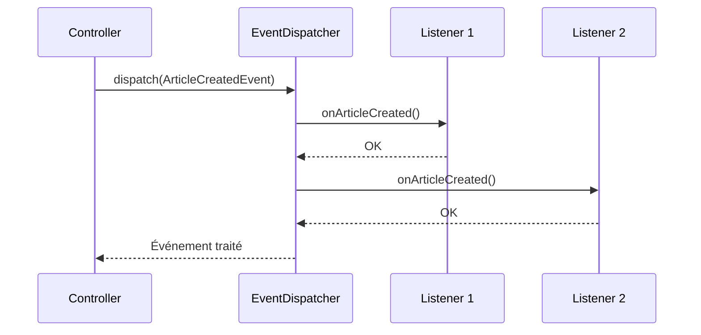

---
tags:
  - Symfony
  - Avancé
  - Pratique
description: "Événements et listeners dans Symfony"
estimated_time: "70 min"
fiche_number: 14
total_fiches: 21
cursus: "Symfony"
---

# 14 - Événements et listeners

> **En bref** : À la fin de cette fiche, tu sauras comment fonctionne le système d'événements de Symfony, comment créer des listeners et des subscribers, et comment dispatcher tes propres événements personnalisés. Lecture estimée : 70 min.


## Prérequis

- Avoir lu la fiche **[13 - Services et injection de dépendances](13-services-injection-dependances.md)**
- Savoir créer un service et l'injecter par constructeur ou par méthode
- Comprendre l'autowiring et le fichier `config/services.yaml`

## Objectif de cette fiche

À la fin de cette fiche, tu sauras comment fonctionne le système d'événements de Symfony, comment créer des listeners et des subscribers, et comment dispatcher tes propres événements personnalisés.

---

## Concepts

Cette section explique tous les concepts nécessaires. Lis-la entièrement avant de passer aux étapes pratiques.

### Qu'est-ce qu'un événement ?

**Définition** : Un événement est un signal émis par une partie du code quand quelque chose se passe. D'autres parties du code peuvent écouter ce signal et réagir, sans que l'émetteur ait besoin de les connaître.

**Le problème que les événements résolvent** :

Sans événements, voici les problèmes rencontrés :

1. **Couplage fort** : Le contrôleur appelle directement chaque service concerné (logger, notifier, mettre à jour un compteur). Si tu ajoutes un nouveau traitement, tu dois modifier le contrôleur.
2. **Code monolithique** : Toute la logique est concentrée dans une seule méthode qui grossit à chaque nouvelle fonctionnalité.
3. **Maintenabilité difficile** : Modifier un traitement risque de casser les autres, car tout est imbriqué dans le même bloc de code.

**Comment les événements résolvent ces problèmes** :

| Problème | Solution apportée par les événements |
| -------- | ------------------------------------ |
| Couplage fort | L'émetteur envoie un signal, les récepteurs s'inscrivent indépendamment |
| Code monolithique | Chaque traitement est isolé dans sa propre classe (listener/subscriber) |
| Maintenabilité difficile | Ajouter ou supprimer un traitement ne touche pas le code de l'émetteur |

**Analogie concrète** : Une alarme incendie dans un bâtiment. Un détecteur de fumée émet un signal (l'événement). Les pompiers, le système de sprinklers et l'alarme sonore réagissent chacun à leur manière. Le détecteur ne connaît pas la liste exacte des récepteurs. Il émet le signal, et chaque récepteur inscrit fait son travail.

**Ce qu'un événement n'est PAS** :

- Un événement n'est pas un appel de méthode direct. Un appel de méthode cible un destinataire précis. Un événement est diffusé à tous les écouteurs inscrits.
- Un événement n'est pas un message asynchrone. Dans Symfony, les événements sont traités de manière synchrone : l'émetteur attend que tous les listeners aient terminé.

---

### Le pattern Observer

**Définition** : Le pattern Observer est un patron de conception où un objet (le sujet) maintient une liste d'observateurs et les notifie automatiquement de tout changement d'état. L'émetteur ne connaît pas les récepteurs.

**Comment ça fonctionne** :

```text
1. Un émetteur (le sujet) envoie un événement
2. Le dispatcher transmet l'événement à tous les écouteurs inscrits
3. Chaque écouteur exécute son traitement
4. L'émetteur n'a aucune connaissance des écouteurs
```

**Comparaison avec un appel direct** :

| Appel direct | Pattern Observer |
| ------------ | ---------------- |
| Le contrôleur appelle `$logger->log()` | Le contrôleur dispatch un événement |
| Le contrôleur connaît le logger | Le contrôleur ne connaît pas les écouteurs |
| Ajouter un traitement = modifier le contrôleur | Ajouter un traitement = créer un nouveau listener |
| Couplage fort | Découplage total |

---

### L'EventDispatcher

**Définition** : L'`EventDispatcher` est le composant central de Symfony qui gère les événements. Il reçoit les événements, les transmet aux écouteurs inscrits et retourne l'événement (éventuellement modifié) à l'émetteur.

**Le cycle de vie d'un événement** :

```text
1. L'émetteur crée un objet événement (ex : ArticlePublishedEvent)
2. L'émetteur appelle $dispatcher->dispatch($event)
3. L'EventDispatcher cherche tous les listeners inscrits pour cet événement
4. L'EventDispatcher appelle chaque listener dans l'ordre de priorité
5. L'EventDispatcher retourne l'objet événement à l'émetteur
```

**Analogie concrète** : L'EventDispatcher est comme le standard téléphonique d'un hôpital. Quand un service appelle (émet un événement), le standard redirige l'appel vers toutes les personnes concernées (les listeners), dans l'ordre de priorité défini.

Le schéma suivant illustre le cycle de vie d'un événement dispatché à travers le système :



---

### Les événements du kernel Symfony

Symfony dispatche automatiquement des événements à chaque étape du traitement d'une requête HTTP. Ce sont les événements du kernel.

**Le cycle requête/réponse** :

```text
Requête HTTP entrante
  │
  ├── kernel.request         → Avant que le contrôleur soit déterminé
  │
  ├── kernel.controller      → Le contrôleur est trouvé, avant son exécution
  │
  ├── kernel.controller_arguments → Les arguments du contrôleur sont résolus
  │
  ├── kernel.view             → Si le contrôleur ne retourne pas une Response
  │
  ├── kernel.response         → Juste avant d'envoyer la réponse au client
  │
  ├── kernel.finish_request   → Après l'envoi de la réponse (sous-requêtes)
  │
  ├── kernel.terminate        → Après l'envoi de la réponse (tâches de fond)
  │
  └── kernel.exception        → Si une exception est lancée à n'importe quelle étape
```

**Les événements les plus utilisés** :

| Événement | Classe | Quand il est dispatché |
| --------- | ------ | ---------------------- |
| `kernel.request` | `RequestEvent` | À chaque requête, avant le routage |
| `kernel.controller` | `ControllerEvent` | Quand le contrôleur est résolu |
| `kernel.response` | `ResponseEvent` | Juste avant d'envoyer la réponse |
| `kernel.exception` | `ExceptionEvent` | Quand une exception non attrapée est lancée |
| `kernel.terminate` | `TerminateEvent` | Après l'envoi de la réponse (logs, emails) |

**Cas d'usage concrets** :

| Événement | Exemple d'utilisation |
| --------- | --------------------- |
| `kernel.request` | Logger chaque requête entrante |
| `kernel.request` | Vérifier une clé API avant chaque requête |
| `kernel.response` | Ajouter des headers de sécurité à la réponse |
| `kernel.exception` | Personnaliser les pages d'erreur |
| `kernel.terminate` | Envoyer un email après avoir répondu au client |

---

### Listener vs Subscriber

Il existe deux façons d'écouter un événement dans Symfony. Les deux sont des services.

**EventListener** : Une classe avec une méthode qui écoute un seul événement. L'association entre l'événement et la méthode est déclarée via l'attribut `#[AsEventListener]`.

**EventSubscriber** : Une classe qui déclare elle-même la liste des événements qu'elle écoute via une méthode `getSubscribedEvents()`. Elle peut écouter plusieurs événements.

**Comparaison Listener vs Subscriber** :

| Listener | Subscriber |
| -------- | ---------- |
| Écoute un événement par méthode | Écoute plusieurs événements dans une classe |
| Configuration via `#[AsEventListener]` | Configuration via `getSubscribedEvents()` |
| Simple et ciblé | Centralise la logique liée à un domaine |
| Depuis Symfony 6.2 : approche recommandée | Approche historique, toujours valide |

**Recommandation Symfony 7.4** : Utilise l'attribut `#[AsEventListener]` sur tes méthodes. C'est l'approche la plus simple et la plus lisible. L'approche Subscriber reste valide si tu veux regrouper plusieurs écouteurs dans une seule classe.

---

### Créer un événement personnalisé

**Définition** : Un événement personnalisé est une classe PHP qui hérite de `Symfony\Contracts\EventDispatcher\Event`. Elle contient les données que tu veux transmettre aux listeners.

**Quand créer un événement personnalisé** :

| Situation | Événement à utiliser |
| --------- | -------------------- |
| Requête HTTP entrante | `kernel.request` (événement existant) |
| Exception non attrapée | `kernel.exception` (événement existant) |
| Un article est publié | `ArticlePublishedEvent` (événement personnalisé) |
| Un utilisateur s'inscrit | `UserRegisteredEvent` (événement personnalisé) |

**Structure d'un événement personnalisé** :

```php
<?php
// src/Event/ArticlePublishedEvent.php

namespace App\Event;

use App\Entity\Article;
use Symfony\Contracts\EventDispatcher\Event;

// L'événement transporte les données nécessaires aux listeners
class ArticlePublishedEvent extends Event
{
    public function __construct(
        private Article $article,  // L'article qui a été publié
    ) {
    }

    public function getArticle(): Article
    {
        return $this->article;
    }
}
```

---

### Les événements Doctrine

Doctrine possède son propre système d'événements, indépendant de celui de Symfony. Ces événements sont déclenchés lors des opérations sur les entités (avant/après insertion, mise à jour, suppression).

**Les événements Doctrine les plus utilisés** :

| Événement | Quand il est déclenché |
| --------- | ---------------------- |
| `prePersist` | Avant l'insertion d'une nouvelle entité en base |
| `postPersist` | Après l'insertion d'une nouvelle entité en base |
| `preUpdate` | Avant la mise à jour d'une entité existante |
| `postUpdate` | Après la mise à jour d'une entité existante |
| `preRemove` | Avant la suppression d'une entité |
| `postRemove` | Après la suppression d'une entité |

**Ce que les événements Doctrine ne sont PAS** :

- Les événements Doctrine ne sont pas des événements Symfony. Ils utilisent un système différent. Tu ne peux pas écouter un événement Doctrine avec `#[AsEventListener]` de Symfony directement.
- L'attribut `#[AsEntityListener]` est l'approche recommandée pour écouter les événements Doctrine dans Symfony.

**Comparaison événements Symfony vs Doctrine** :

| Événements Symfony | Événements Doctrine |
| ------------------ | ------------------- |
| Liés au cycle HTTP (requête/réponse) | Liés au cycle de vie des entités |
| `EventDispatcherInterface` | Système interne Doctrine |
| `#[AsEventListener]` | `#[AsEntityListener]` |
| Ex : `kernel.request` | Ex : `prePersist`, `preUpdate` |

---

## Étapes Pratiques

### Étape 1 : Créer un EventSubscriber pour kernel.request

**Objectif** : Créer un subscriber qui logge chaque requête entrante.

```php
<?php
// src/EventSubscriber/RequestLoggerSubscriber.php

namespace App\EventSubscriber;

use Psr\Log\LoggerInterface;
use Symfony\Component\EventDispatcher\EventSubscriberInterface;
use Symfony\Component\HttpKernel\Event\RequestEvent;
use Symfony\Component\HttpKernel\KernelEvents;

class RequestLoggerSubscriber implements EventSubscriberInterface
{
    public function __construct(
        private LoggerInterface $logger,  // Injecté par autowiring
    ) {
    }

    // Déclare les événements écoutés et les méthodes associées
    public static function getSubscribedEvents(): array
    {
        return [
            // Clé = événement écouté, valeur = méthode à appeler
            KernelEvents::REQUEST => 'onKernelRequest',
        ];
    }

    public function onKernelRequest(RequestEvent $event): void
    {
        // Ne traiter que la requête principale (pas les sous-requêtes)
        if (!$event->isMainRequest()) {
            return;
        }

        // Récupérer la requête HTTP
        $request = $event->getRequest();

        // Logger les informations de la requête
        $this->logger->info('Requête entrante.', [
            'method' => $request->getMethod(),       // GET, POST, etc.
            'uri' => $request->getRequestUri(),      // /articles, /admin, etc.
            'ip' => $request->getClientIp(),         // Adresse IP du client
        ]);
    }
}
```

**Résultat attendu** : Chaque requête HTTP est loggée dans `var/log/dev.log`. Tu peux vérifier avec :

```bash
# Afficher les dernières lignes du fichier de log
tail -f var/log/dev.log
```

```text
[2026-03-19T10:00:00+00:00] app.INFO: Requête entrante. {"method":"GET","uri":"/articles","ip":"127.0.0.1"} []
```

---

### Étape 2 : Utiliser #[AsEventListener] (approche avec attribut PHP 8)

**Objectif** : Créer un listener avec l'attribut `#[AsEventListener]`, l'approche recommandée depuis Symfony 6.2.

```php
<?php
// src/EventListener/RequestTimerListener.php

namespace App\EventListener;

use Psr\Log\LoggerInterface;
use Symfony\Component\EventDispatcher\Attribute\AsEventListener;
use Symfony\Component\HttpKernel\Event\RequestEvent;
use Symfony\Component\HttpKernel\Event\ResponseEvent;
use Symfony\Component\HttpKernel\KernelEvents;

// Chaque attribut #[AsEventListener] inscrit une méthode sur un événement
#[AsEventListener(event: KernelEvents::REQUEST, method: 'onRequest', priority: 100)]
#[AsEventListener(event: KernelEvents::RESPONSE, method: 'onResponse', priority: -100)]
class RequestTimerListener
{
    private float $startTime;

    public function __construct(
        private LoggerInterface $logger,
    ) {
    }

    // Appelée au début de la requête (priorité haute = exécuté en premier)
    public function onRequest(RequestEvent $event): void
    {
        if (!$event->isMainRequest()) {
            return;
        }

        // Enregistrer le moment du début de la requête
        $this->startTime = microtime(true);
    }

    // Appelée juste avant l'envoi de la réponse (priorité basse = exécuté en dernier)
    public function onResponse(ResponseEvent $event): void
    {
        if (!$event->isMainRequest()) {
            return;
        }

        // Calculer le temps de traitement
        $duration = microtime(true) - $this->startTime;
        $durationMs = round($duration * 1000, 2);

        // Ajouter le temps de traitement dans un header de la réponse
        $event->getResponse()->headers->set('X-Request-Duration', $durationMs . 'ms');

        // Logger le temps de traitement
        $this->logger->info('Requête traitée.', [
            'uri' => $event->getRequest()->getRequestUri(),
            'duration_ms' => $durationMs,
        ]);
    }
}
```

**Explication de l'attribut `#[AsEventListener]`** :

| Paramètre | Rôle | Exemple |
| --------- | ---- | ------- |
| `event` | L'événement à écouter | `KernelEvents::REQUEST` |
| `method` | La méthode à appeler | `'onRequest'` |
| `priority` | Ordre d'exécution (plus haut = exécuté en premier) | `100`, `-100` |

---

### Étape 3 : Écouter kernel.exception pour personnaliser les pages d'erreur

**Objectif** : Intercepter les exceptions pour retourner une réponse JSON personnalisée (utile pour une API).

```php
<?php
// src/EventListener/ExceptionListener.php

namespace App\EventListener;

use Psr\Log\LoggerInterface;
use Symfony\Component\EventDispatcher\Attribute\AsEventListener;
use Symfony\Component\HttpFoundation\JsonResponse;
use Symfony\Component\HttpKernel\Event\ExceptionEvent;
use Symfony\Component\HttpKernel\Exception\HttpExceptionInterface;
use Symfony\Component\HttpKernel\KernelEvents;

#[AsEventListener(event: KernelEvents::EXCEPTION)]
class ExceptionListener
{
    public function __construct(
        private LoggerInterface $logger,
    ) {
    }

    public function __invoke(ExceptionEvent $event): void
    {
        // Récupérer l'exception lancée
        $exception = $event->getThrowable();

        // Déterminer le code HTTP
        $statusCode = 500;
        if ($exception instanceof HttpExceptionInterface) {
            // Les exceptions HTTP de Symfony ont un code HTTP (404, 403, etc.)
            $statusCode = $exception->getStatusCode();
        }

        // Logger l'erreur
        $this->logger->error('Exception interceptée.', [
            'message' => $exception->getMessage(),
            'code' => $statusCode,
            'file' => $exception->getFile(),
            'line' => $exception->getLine(),
        ]);

        // Construire une réponse JSON personnalisée
        $response = new JsonResponse([
            'error' => true,
            'message' => $exception->getMessage(),
            'code' => $statusCode,
        ], $statusCode);

        // Remplacer la réponse par défaut de Symfony
        $event->setResponse($response);
    }
}
```

**Explication** :

```text
1. Symfony lance kernel.exception quand une exception n'est pas attrapée
2. Le listener reçoit l'ExceptionEvent avec l'exception originale
3. Le listener crée une réponse JSON personnalisée
4. $event->setResponse() remplace la page d'erreur par défaut
```

**Résultat attendu** : Au lieu de la page d'erreur Symfony, le client reçoit :

```json
{
    "error": true,
    "message": "Article non trouvé.",
    "code": 404
}
```

---

### Étape 4 : Créer un événement personnalisé

**Objectif** : Créer un événement `ArticlePublishedEvent` dispatché quand un article est publié.

```php
<?php
// src/Event/ArticlePublishedEvent.php

namespace App\Event;

use App\Entity\Article;
use Symfony\Contracts\EventDispatcher\Event;

class ArticlePublishedEvent extends Event
{
    // L'événement transporte l'article publié
    public function __construct(
        private Article $article,
    ) {
    }

    public function getArticle(): Article
    {
        return $this->article;
    }
}
```

Crée aussi un deuxième événement :

```php
<?php
// src/Event/ArticleCreatedEvent.php

namespace App\Event;

use App\Entity\Article;
use Symfony\Contracts\EventDispatcher\Event;

class ArticleCreatedEvent extends Event
{
    public function __construct(
        private Article $article,
    ) {
    }

    public function getArticle(): Article
    {
        return $this->article;
    }
}
```

**Structure des fichiers** :

```text
src/
└── Event/
    ├── ArticleCreatedEvent.php
    └── ArticlePublishedEvent.php
```

---

### Étape 5 : Dispatcher l'événement depuis un contrôleur

**Objectif** : Dispatcher `ArticleCreatedEvent` et `ArticlePublishedEvent` depuis le service `ArticleManager`.

```php
<?php
// src/Service/ArticleManager.php

namespace App\Service;

use App\Entity\Article;
use App\Event\ArticleCreatedEvent;
use App\Event\ArticlePublishedEvent;
use Doctrine\ORM\EntityManagerInterface;
use Symfony\Contracts\EventDispatcher\EventDispatcherInterface;

class ArticleManager
{
    public function __construct(
        private EntityManagerInterface $em,
        private EventDispatcherInterface $dispatcher,  // Le dispatcher d'événements
    ) {
    }

    /**
     * Crée un article et dispatche un événement.
     */
    public function create(string $title, string $content): Article
    {
        // Créer l'article
        $article = new Article();
        $article->setTitle($title);
        $article->setContent($content);
        $article->setStatus('draft');

        // Sauvegarder en base
        $this->em->persist($article);
        $this->em->flush();

        // Dispatcher l'événement ArticleCreatedEvent
        // Tous les listeners inscrits sur cet événement seront notifiés
        $this->dispatcher->dispatch(new ArticleCreatedEvent($article));

        return $article;
    }

    /**
     * Publie un article et dispatche un événement.
     */
    public function publish(Article $article): void
    {
        // Changer le statut de l'article
        $article->setStatus('published');
        $article->setPublishedAt(new \DateTimeImmutable());

        // Sauvegarder en base
        $this->em->flush();

        // Dispatcher l'événement ArticlePublishedEvent
        $this->dispatcher->dispatch(new ArticlePublishedEvent($article));
    }
}
```

**Utiliser ce service dans un contrôleur** :

```php
<?php
// src/Controller/ArticleController.php

namespace App\Controller;

use App\Entity\Article;
use App\Service\ArticleManager;
use Doctrine\ORM\EntityManagerInterface;
use Symfony\Bundle\FrameworkBundle\Controller\AbstractController;
use Symfony\Component\HttpFoundation\Request;
use Symfony\Component\HttpFoundation\Response;
use Symfony\Component\Routing\Attribute\Route;

class ArticleController extends AbstractController
{
    #[Route('/articles/new', name: 'article_new', methods: ['POST'])]
    public function new(Request $request, ArticleManager $articleManager): Response
    {
        $title = $request->request->get('title');
        $content = $request->request->get('content');

        // Créer l'article (dispatche ArticleCreatedEvent)
        $article = $articleManager->create($title, $content);

        $this->addFlash('success', 'Article créé.');

        return $this->redirectToRoute('article_show', ['id' => $article->getId()]);
    }

    #[Route('/articles/{id}/publish', name: 'article_publish', methods: ['POST'])]
    public function publish(
        Article $article,
        ArticleManager $articleManager,
    ): Response {
        // Publier l'article (dispatche ArticlePublishedEvent)
        $articleManager->publish($article);

        $this->addFlash('success', 'Article publié.');

        return $this->redirectToRoute('article_show', ['id' => $article->getId()]);
    }
}
```

**Chaîne d'exécution quand un article est publié** :

```text
1. Le contrôleur appelle $articleManager->publish($article)
2. ArticleManager change le statut et sauvegarde en base
3. ArticleManager dispatch ArticlePublishedEvent
4. L'EventDispatcher notifie tous les listeners inscrits
5. Chaque listener exécute son traitement (log, email, compteur...)
6. Le contrôleur continue son exécution
```

---

### Étape 6 : Écouter un événement Doctrine (prePersist pour auto-slug)

**Objectif** : Créer un entity listener qui génère automatiquement un slug avant l'insertion en base.

```php
<?php
// src/EventListener/ArticleSlugListener.php

namespace App\EventListener;

use App\Entity\Article;
use Doctrine\Bundle\DoctrineBundle\Attribute\AsEntityListener;
use Doctrine\ORM\Events;

// L'attribut déclare : écouter l'événement prePersist sur l'entité Article
#[AsEntityListener(event: Events::PRE_PERSIST, entity: Article::class)]
class ArticleSlugListener
{
    /**
     * Génère un slug à partir du titre de l'article.
     * Appelée automatiquement avant chaque insertion (persist).
     */
    public function prePersist(Article $article): void
    {
        // Générer le slug seulement s'il n'est pas déjà défini
        if (empty($article->getSlug())) {
            $article->setSlug($this->generateSlug($article->getTitle()));
        }
    }

    /**
     * Transforme un texte en slug URL-friendly.
     */
    private function generateSlug(string $text): string
    {
        // 1. Convertir en minuscules
        $slug = strtolower($text);

        // 2. Remplacer les caractères accentués par leur équivalent ASCII
        $slug = transliterator_transliterate('Any-Latin; Latin-ASCII; Lower()', $slug);

        // 3. Remplacer tout ce qui n'est pas une lettre ou un chiffre par un tiret
        $slug = preg_replace('/[^a-z0-9]+/', '-', $slug);

        // 4. Supprimer les tirets en début et fin
        $slug = trim($slug, '-');

        return $slug;
    }
}
```

**Comment ça fonctionne** :

```text
1. Tu crées un Article et tu appelles $em->persist($article)
2. Doctrine détecte l'événement prePersist
3. Doctrine appelle ArticleSlugListener::prePersist()
4. Le listener génère le slug et le met dans l'entité
5. Doctrine insère l'article en base avec le slug
```

**Résultat attendu** : Tu n'as plus besoin de générer le slug manuellement à la création. Doctrine le fait automatiquement à l'insertion (prePersist).

```php
// Avant : tu devais générer le slug manuellement
$article->setSlug($slugGenerator->generate($article->getTitle()));
$em->persist($article);

// Après : le listener le fait automatiquement
$article->setTitle('Mon article de blog');
$em->persist($article);
$em->flush();
// Le slug "mon-article-de-blog" est automatiquement généré
```

**Note sur la mise à jour** : Ce listener ne gère que l'insertion (prePersist). Régénérer le slug lors d'une **modification** de l'article est plus délicat.
Avec l'événement preUpdate, un simple `$article->setSlug(...)` ne suffit pas : Doctrine a déjà calculé la liste des champs à modifier (le changeset) avant d'appeler ton listener, donc la nouvelle valeur du slug ne partirait pas dans la requête UPDATE.
Il faut alors passer par `PreUpdateEventArgs::setNewValue()` ou recalculer le changeset avec `recomputeSingleEntityChangeSet()`. C'est un sujet avancé, à étudier dans la documentation Doctrine quand tu en auras besoin.

---

### Étape 7 : Debug avec debug:event-dispatcher

Pour voir tous les événements et leurs listeners :

```bash
# Lister tous les événements et leurs listeners
php bin/console debug:event-dispatcher

# Filtrer par événement du kernel
php bin/console debug:event-dispatcher kernel.request

# Filtrer par événement personnalisé
php bin/console debug:event-dispatcher "App\Event\ArticlePublishedEvent"
```

**Résultat attendu** (extrait pour `kernel.request`) :

```text
 ------- --------------------------------------------------------- ----------
  Order   Callable                                                  Priority
 ------- --------------------------------------------------------- ----------
  #1      App\EventListener\RequestTimerListener::onRequest()       100
  #2      Symfony\Component\HttpKernel\EventListener\RouterListener  32
  #3      App\EventSubscriber\RequestLoggerSubscriber                0
 ------- --------------------------------------------------------- ----------
```

---

## Commandes Utiles

| Commande | Action |
| -------- | ------ |
| `php bin/console debug:event-dispatcher` | Lister tous les événements et listeners |
| `php bin/console debug:event-dispatcher kernel.request` | Lister les listeners d'un événement |
| `php bin/console debug:event-dispatcher "App\Event\MonEvent"` | Lister les listeners d'un événement personnalisé |
| `php bin/console debug:container --tag=kernel.event_subscriber` | Lister tous les subscribers |
| `php bin/console debug:container --tag=kernel.event_listener` | Lister tous les listeners |
| `php bin/console debug:container --tag=doctrine.orm.entity_listener` | Lister les entity listeners Doctrine |

---

## Pièges Fréquents

### Piège 1 : Priorité des listeners

**Problème** : Tes listeners s'exécutent dans un ordre inattendu. Par exemple, le listener qui modifie la requête s'exécute après le listener qui lit la requête.

**Cause** : Par défaut, tous les listeners ont une priorité de `0`. Si tu ne définis pas de priorité, l'ordre d'exécution est indéterminé.

**Solution** : Définis une priorité explicite. Un nombre plus élevé = exécuté en premier.

```php
// Exécuté en premier (priorité haute)
#[AsEventListener(event: KernelEvents::REQUEST, priority: 100)]
public function prepareRequest(RequestEvent $event): void
{
    // Modifier la requête
}

// Exécuté en deuxième (priorité par défaut)
#[AsEventListener(event: KernelEvents::REQUEST, priority: 0)]
public function logRequest(RequestEvent $event): void
{
    // Logger la requête (déjà modifiée)
}

// Exécuté en dernier (priorité basse)
#[AsEventListener(event: KernelEvents::REQUEST, priority: -100)]
public function finalCheck(RequestEvent $event): void
{
    // Vérification finale
}
```

**Règle** : Vérifie toujours l'ordre avec `debug:event-dispatcher`.

---

### Piège 2 : Événement non dispatché (oublier d'injecter EventDispatcherInterface)

**Problème** : Tu dispatches un événement mais aucun listener ne réagit.

**Cause possible 1** : Tu as oublié d'injecter `EventDispatcherInterface` dans ton service.

```php
// ❌ L'événement n'est pas dispatché : le dispatcher n'est pas injecté
class ArticleManager
{
    public function publish(Article $article): void
    {
        // Pas de dispatcher injecté, impossible de dispatcher l'événement
    }
}

// ✅ Le dispatcher est injecté et l'événement est dispatché
class ArticleManager
{
    public function __construct(
        private EventDispatcherInterface $dispatcher,
    ) {
    }

    public function publish(Article $article): void
    {
        $this->dispatcher->dispatch(new ArticlePublishedEvent($article));
    }
}
```

**Cause possible 2** : Le listener n'est pas correctement enregistré. Vérifie avec :

```bash
php bin/console debug:event-dispatcher "App\Event\ArticlePublishedEvent"
```

Si aucun listener n'apparaît, vérifie que ta classe a l'attribut `#[AsEventListener]` ou implémente `EventSubscriberInterface`.

---

### Piège 3 : Confondre listener Symfony et listener Doctrine

**Problème** : Tu utilises `#[AsEventListener]` pour écouter un événement Doctrine comme `prePersist`, mais le listener ne s'exécute jamais.

**Cause** : Les événements Doctrine et les événements Symfony utilisent des systèmes différents. `#[AsEventListener]` est pour les événements Symfony, `#[AsEntityListener]` est pour les événements Doctrine.

```php
// ❌ Ne fonctionne pas : #[AsEventListener] est pour Symfony, pas Doctrine
#[AsEventListener(event: 'prePersist')]
class ArticleSlugListener
{
    public function __invoke(Article $article): void { }
}

// ✅ Correct : #[AsEntityListener] est pour Doctrine
#[AsEntityListener(event: Events::PRE_PERSIST, entity: Article::class)]
class ArticleSlugListener
{
    public function prePersist(Article $article): void { }
}
```

**Règle** : Pour les entités Doctrine, utilise `#[AsEntityListener]`. Pour tout le reste, utilise `#[AsEventListener]`.

---

### Piège 4 : Propagation stoppée par un listener

**Problème** : Certains de tes listeners ne s'exécutent pas, alors qu'ils sont correctement enregistrés.

**Cause** : Un listener avec une priorité plus haute a appelé `$event->stopPropagation()`, ce qui empêche les listeners suivants de s'exécuter.

```php
// Ce listener stoppe la propagation
#[AsEventListener(event: KernelEvents::REQUEST, priority: 100)]
public function checkApiKey(RequestEvent $event): void
{
    if (!$event->getRequest()->headers->has('X-API-Key')) {
        $event->setResponse(new JsonResponse(['error' => 'Clé API manquante'], 401));
        $event->stopPropagation();  // Les listeners suivants NE seront PAS exécutés
    }
}
```

**Solution** : Utilise `$event->stopPropagation()` uniquement quand tu veux intentionnellement empêcher les autres listeners de s'exécuter. Vérifie l'ordre et la priorité avec `debug:event-dispatcher`.

---

## Checklist de Validation

- [ ] Je comprends ce qu'est un événement et le pattern Observer
- [ ] Je sais créer un EventSubscriber avec `getSubscribedEvents()`
- [ ] Je sais créer un listener avec l'attribut `#[AsEventListener]`
- [ ] Je connais les événements du kernel : request, controller, response, exception, terminate
- [ ] Je sais créer un événement personnalisé (classe qui hérite de `Event`)
- [ ] Je sais dispatcher un événement avec `EventDispatcherInterface`
- [ ] Je sais écouter un événement Doctrine avec `#[AsEntityListener]`
- [ ] Je sais utiliser `debug:event-dispatcher` pour déboguer
- [ ] Je comprends la différence entre événements Symfony et événements Doctrine

---

## Exercice Pratique

**Énoncé** : Crée un système de notifications basé sur les événements. Quand un article est créé ou publié, plusieurs traitements doivent se déclencher automatiquement.

**Spécifications** :

1. Crée deux événements personnalisés :
   - `src/Event/ArticleCreatedEvent.php` : transporte l'article créé
   - `src/Event/ArticlePublishedEvent.php` : transporte l'article publié

2. Crée un listener de log :
   - Fichier : `src/EventListener/ArticleLogListener.php`
   - Utilise `#[AsEventListener]` pour écouter les deux événements
   - Écrit un log pour chaque événement (ex : "Article créé : Mon titre", "Article publié : Mon titre")

3. Crée un listener de compteur :
   - Fichier : `src/EventListener/ArticleCounterListener.php`
   - Utilise `#[AsEventListener]` pour écouter `ArticlePublishedEvent`
   - Incrémente un compteur en base de données (ou logge le compteur si la table n'existe pas)

4. Crée un service `ArticleManager` qui :
   - Injecte `EntityManagerInterface` et `EventDispatcherInterface`
   - Méthode `create(string $title, string $content): Article` : crée l'article, le sauvegarde et dispatche `ArticleCreatedEvent`
   - Méthode `publish(Article $article): void` : publie l'article et dispatche `ArticlePublishedEvent`

5. Vérifie avec `debug:event-dispatcher` que tes listeners sont enregistrés.

**Résultat attendu** :

- Quand tu crées un article, le log affiche "Article créé : Mon titre"
- Quand tu publies un article, le log affiche "Article publié : Mon titre" et "Compteur d'articles publiés incrémenté"
- La commande `debug:event-dispatcher` liste tes listeners

---

## Solution de l'Exercice

> **Note** : Cette section contient la solution complète. Essaie d'abord de résoudre l'exercice par toi-même avant de consulter cette solution.

---

Les événements `ArticleCreatedEvent` et `ArticlePublishedEvent` sont identiques à ceux créés à l'étape 4.

**Listener `src/EventListener/ArticleLogListener.php`** :

```php
<?php

namespace App\EventListener;

use App\Event\ArticleCreatedEvent;
use App\Event\ArticlePublishedEvent;
use Psr\Log\LoggerInterface;
use Symfony\Component\EventDispatcher\Attribute\AsEventListener;

// Un attribut par événement écouté
#[AsEventListener(event: ArticleCreatedEvent::class, method: 'onArticleCreated')]
#[AsEventListener(event: ArticlePublishedEvent::class, method: 'onArticlePublished')]
class ArticleLogListener
{
    public function __construct(
        private LoggerInterface $logger,
    ) {
    }

    public function onArticleCreated(ArticleCreatedEvent $event): void
    {
        $article = $event->getArticle();

        $this->logger->info('Article créé : {title}', [
            'title' => $article->getTitle(),
            'id' => $article->getId(),
        ]);
    }

    public function onArticlePublished(ArticlePublishedEvent $event): void
    {
        $article = $event->getArticle();

        $this->logger->info('Article publié : {title}', [
            'title' => $article->getTitle(),
            'id' => $article->getId(),
        ]);
    }
}
```

**Listener `src/EventListener/ArticleCounterListener.php`** :

```php
<?php

namespace App\EventListener;

use App\Event\ArticlePublishedEvent;
use Psr\Log\LoggerInterface;
use Symfony\Component\EventDispatcher\Attribute\AsEventListener;

#[AsEventListener(event: ArticlePublishedEvent::class)]
class ArticleCounterListener
{
    public function __construct(
        private LoggerInterface $logger,
    ) {
    }

    public function __invoke(ArticlePublishedEvent $event): void
    {
        $article = $event->getArticle();

        // Dans un vrai projet, tu incrémenterais un compteur en base de données.
        // Ici, on logge le compteur pour l'exercice.
        $this->logger->info('Compteur d\'articles publiés incrémenté.', [
            'article_id' => $article->getId(),
            'article_title' => $article->getTitle(),
        ]);
    }
}
```

Le service `ArticleManager` est identique à celui créé à l'étape 5.

**Vérifier que tout fonctionne** :

```bash
php bin/console debug:event-dispatcher "App\Event\ArticleCreatedEvent"
php bin/console debug:event-dispatcher "App\Event\ArticlePublishedEvent"
```

**Explication de la solution** :

| Élément | Explication |
| ------- | ----------- |
| Événements personnalisés | Classes simples qui transportent les données (l'article) |
| `#[AsEventListener]` | Attribut PHP 8 qui inscrit la méthode sur un événement |
| `__invoke()` | Si tu ne précises pas `method`, Symfony appelle `__invoke()` |
| `$dispatcher->dispatch()` | Notifie tous les listeners inscrits |
| `debug:event-dispatcher` | Commande pour vérifier que tout est correctement enregistré |

---

## Navigation

← Fiche précédente : **[Services et injection de dépendances](13-services-injection-dependances.md)**

→ Fiche suivante : **[Commandes console](15-commandes-console.md)**
