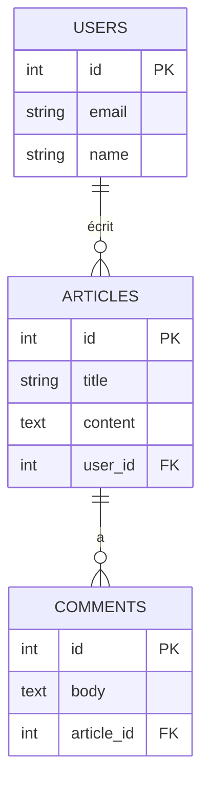

---
tags:
  - PostgreSQL
  - Débutant
  - Pratique
description: "Les jointures"
estimated_time: "95 min"
fiche_number: 3
total_fiches: 8
cursus: "PostgreSQL"
---

# 03 - Les jointures

> **En bref** : À la fin de cette fiche, tu sauras écrire des requêtes SQL avec des jointures pour récupérer des données provenant de plusieurs tables liées. Lecture estimée : 95 min.


## Prérequis

- Avoir lu la fiche **[01 - Introduction à PostgreSQL](01-introduction-postgresql.md)**
- Avoir lu la fiche **[02 - Requêtes SELECT](02-requetes-select.md)**
- Comprendre les relations Doctrine (fiche **[03-symfony/07 - Relations entre entités](../03-symfony/07-relations-entites.md)**)

## Objectif de cette fiche

À la fin de cette fiche, tu sauras écrire des requêtes SQL avec des jointures pour récupérer des données provenant de plusieurs tables liées.

---

## Concepts

Cette section explique tous les concepts nécessaires. Lis-la entièrement avant de passer aux étapes pratiques.

### Qu'est-ce qu'une jointure ?

**Définition** : Une jointure (JOIN) est une opération SQL qui combine des lignes de deux ou plusieurs tables basées sur une condition de liaison (le plus souvent une clé étrangère).

**Le problème que les jointures résolvent** :

Dans une base de données normalisée, les données sont réparties dans plusieurs tables :

```text
Table: product                    Table: category
+----+-----------+-------------+  +----+------------------+
| id | name      | category_id |  | id | name             |
+----+-----------+-------------+  +----+------------------+
|  1 | Clavier   |      1      |  |  1 | Informatique     |
|  2 | Souris    |      1      |  |  2 | Audio            |
|  3 | Casque    |      2      |  +----+------------------+
+----+-----------+-------------+
```

**Problème** : On veut afficher le nom du produit AVEC le nom de sa catégorie.

**Solution** : La jointure combine les deux tables :

```text
Résultat de la jointure :
+----------+------------------+
| name     | category_name    |
+----------+------------------+
| Clavier  | Informatique     |
| Souris   | Informatique     |
| Casque   | Audio            |
+----------+------------------+
```

**Analogie concrète** : Imagine deux fichiers Excel. Le premier contient les commandes avec un numéro de client. Le deuxième contient les clients avec leur nom. Pour avoir le nom du client sur chaque commande, tu dois "fusionner" les deux fichiers en utilisant le numéro de client comme lien. C'est exactement ce que fait une jointure.

Le schéma suivant illustre les relations entre les tables d'un modèle de blog typique :



---

### Les types de jointures

Il existe plusieurs types de jointures selon ce qu'on veut récupérer :

| Type | Ce qu'il retourne |
| ---- | ----------------- |
| `INNER JOIN` | Uniquement les lignes qui ont une correspondance dans les deux tables |
| `LEFT JOIN` | Toutes les lignes de la table de gauche + correspondances de droite |
| `RIGHT JOIN` | Toutes les lignes de la table de droite + correspondances de gauche |
| `FULL JOIN` | Toutes les lignes des deux tables |

**Schéma visuel** :

```text
Table A         Table B
+---+           +---+
| 1 |           | 1 |
| 2 |           | 3 |
| 3 |           | 4 |
+---+           +---+

INNER JOIN : 1, 3         (présents dans A ET B)
LEFT JOIN  : 1, 2, 3      (tous de A + matchs de B)
RIGHT JOIN : 1, 3, 4      (tous de B + matchs de A)
FULL JOIN  : 1, 2, 3, 4   (tous de A et B)
```

---

### INNER JOIN (le plus courant)

**Définition** : Retourne uniquement les lignes qui ont une correspondance dans les deux tables.

**Syntaxe** :

```sql
SELECT colonnes
FROM table_a
INNER JOIN table_b ON table_a.colonne = table_b.colonne;
```

**Exemple** :

```sql
SELECT product.name, category.name
FROM product
INNER JOIN category ON product.category_id = category.id;
```

**Résultat** : Seuls les produits qui ont une catégorie apparaissent.

```text
  name   |     name
---------+--------------
 Clavier | Informatique
 Souris  | Informatique
 Casque  | Audio
```

**Ce qui est exclu** : Les produits sans catégorie (`category_id = NULL`) n'apparaissent pas.

---

### LEFT JOIN

**Définition** : Retourne toutes les lignes de la table de gauche (première table), même si elles n'ont pas de correspondance dans la table de droite.

**Syntaxe** :

```sql
SELECT colonnes
FROM table_gauche
LEFT JOIN table_droite ON table_gauche.colonne = table_droite.colonne;
```

**Exemple** :

```sql
SELECT product.name, category.name
FROM product
LEFT JOIN category ON product.category_id = category.id;
```

**Résultat** : Tous les produits apparaissent, même sans catégorie.

```text
    name    |     name
------------+--------------
 Clavier    | Informatique
 Souris     | Informatique
 Casque     | Audio
 Accessoire | NULL          <-- Produit sans catégorie
```

**Quand utiliser LEFT JOIN** :

- Quand tu veux TOUS les éléments de la table principale
- Même ceux qui n'ont pas de correspondance
- Les colonnes de la table jointe seront NULL si pas de correspondance

---

### RIGHT JOIN

**Définition** : L'inverse du LEFT JOIN. Retourne toutes les lignes de la table de droite (deuxième table).

**Exemple** :

```sql
SELECT product.name, category.name
FROM product
RIGHT JOIN category ON product.category_id = category.id;
```

**Résultat** : Toutes les catégories apparaissent, même sans produits.

```text
  name   |     name
---------+--------------
 Clavier | Informatique
 Souris  | Informatique
 Casque  | Audio
 NULL    | Mobilier      <-- Catégorie sans produit
```

**Note** : RIGHT JOIN est rarement utilisé. On préfère inverser les tables et utiliser LEFT JOIN.

---

### Les alias de tables

Pour simplifier les requêtes, on utilise des alias (noms courts) :

```sql
-- Sans alias (verbose)
SELECT product.name, category.name
FROM product
INNER JOIN category ON product.category_id = category.id;

-- Avec alias (concis)
SELECT p.name, c.name
FROM product p
INNER JOIN category c ON p.category_id = c.id;
```

**Convention** : Utiliser la première lettre ou une abréviation claire.

---

### Jointures multiples

On peut joindre plus de deux tables :

```sql
SELECT
    p.name AS product_name,
    c.name AS category_name,
    b.name AS brand_name
FROM product p
INNER JOIN category c ON p.category_id = c.id
INNER JOIN brand b ON p.brand_id = b.id;
```

**Ordre** : Chaque JOIN s'applique au résultat précédent.

---

### Relation avec Doctrine

Quand tu utilises Doctrine, les jointures sont automatiques :

**Code Doctrine** :

```php
// Doctrine génère automatiquement le JOIN
$product = $repository->find(1);
$categoryName = $product->getCategory()->getName();
```

**SQL équivalent** :

```sql
SELECT * FROM product p
LEFT JOIN category c ON p.category_id = c.id
WHERE p.id = 1;
```

**QueryBuilder avec jointure explicite** :

```php
$products = $repository->createQueryBuilder('p')
    ->leftJoin('p.category', 'c')
    ->addSelect('c')  // Important : charge la catégorie en même temps
    ->getQuery()
    ->getResult();
```

---

## Étapes Pratiques

### Étape 1 : Préparer les données d'exemple

Pour ces exercices, on utilise ces tables :

```text
Table: category
+----+------------------+
| id | name             |
+----+------------------+
|  1 | Informatique     |
|  2 | Audio            |
|  3 | Mobilier         |
+----+------------------+

Table: product
+----+-----------+-------+-------------+
| id | name      | price | category_id |
+----+-----------+-------+-------------+
|  1 | Clavier   | 49.99 |      1      |
|  2 | Souris    | 29.99 |      1      |
|  3 | Casque    | 79.99 |      2      |
|  4 | Webcam    | 59.99 |      1      |
|  5 | Câble USB |  9.99 |     NULL    |
+----+-----------+-------+-------------+
```

---

### Étape 2 : INNER JOIN de base

```sql
SELECT p.name AS produit, c.name AS categorie
FROM product p
INNER JOIN category c ON p.category_id = c.id;
```

**Résultat** :

```text
 produit |   categorie
---------+--------------
 Clavier | Informatique
 Souris  | Informatique
 Webcam  | Informatique
 Casque  | Audio
```

**Note** : "Câble USB" n'apparaît pas (pas de catégorie).

---

### Étape 3 : LEFT JOIN pour garder tous les produits

```sql
SELECT p.name AS produit, c.name AS categorie
FROM product p
LEFT JOIN category c ON p.category_id = c.id;
```

**Résultat** :

```text
  produit  |   categorie
-----------+--------------
 Clavier   | Informatique
 Souris    | Informatique
 Webcam    | Informatique
 Casque    | Audio
 Câble USB | NULL
```

**Note** : "Câble USB" apparaît avec NULL pour la catégorie.

---

### Étape 4 : Filtrer les résultats d'une jointure

```sql
-- Produits de la catégorie "Informatique"
SELECT p.name, p.price
FROM product p
INNER JOIN category c ON p.category_id = c.id
WHERE c.name = 'Informatique';
```

**Résultat** :

```text
  name   | price
---------+-------
 Clavier | 49.99
 Souris  | 29.99
 Webcam  | 59.99
```

---

### Étape 5 : Compter avec une jointure

```sql
-- Nombre de produits par catégorie
SELECT c.name AS categorie, COUNT(p.id) AS nombre_produits
FROM category c
LEFT JOIN product p ON c.id = p.category_id
GROUP BY c.name
ORDER BY nombre_produits DESC;
```

**Résultat** :

```text
   categorie   | nombre_produits
---------------+-----------------
 Informatique  |               3
 Audio         |               1
 Mobilier      |               0
```

**Note** : LEFT JOIN permet de voir les catégories vides.

---

### Étape 6 : Agrégation avec jointure

```sql
-- Prix total et moyen par catégorie
SELECT
    c.name AS categorie,
    COUNT(p.id) AS nombre,
    SUM(p.price) AS prix_total,
    ROUND(AVG(p.price), 2) AS prix_moyen
FROM category c
LEFT JOIN product p ON c.id = p.category_id
GROUP BY c.name
HAVING COUNT(p.id) > 0
ORDER BY prix_total DESC;
```

**Résultat** :

```text
   categorie   | nombre | prix_total | prix_moyen
---------------+--------+------------+------------
 Informatique  |      3 |     139.97 |      46.66
 Audio         |      1 |      79.99 |      79.99
```

---

### Étape 7 : Trouver les éléments sans correspondance

**Produits sans catégorie** :

```sql
SELECT p.name
FROM product p
LEFT JOIN category c ON p.category_id = c.id
WHERE c.id IS NULL;
```

**Résultat** :

```text
   name
-----------
 Câble USB
```

**Catégories sans produit** :

```sql
SELECT c.name
FROM category c
LEFT JOIN product p ON c.id = p.category_id
WHERE p.id IS NULL;
```

**Résultat** :

```text
   name
----------
 Mobilier
```

---

### Étape 8 : Jointures multiples

Supposons un schéma étendu : une table `brand` (marque) et une colonne `brand_id` ajoutée à `product` (cet exemple illustre la syntaxe de jointures chaînées ; il ne tourne pas sur les données de l'Étape 1, tout comme l'Étape 9).

```sql
SELECT
    p.name AS produit,
    c.name AS categorie,
    b.name AS marque
FROM product p
LEFT JOIN category c ON p.category_id = c.id
LEFT JOIN brand b ON p.brand_id = b.id
ORDER BY p.name;
```

---

### Étape 9 : Self-join (jointure sur soi-même)

Pour une table avec une référence vers elle-même (ex: catégorie parente). Cet exemple suppose un schéma étendu : une colonne `parent_id` ajoutée à `category`. Il illustre la syntaxe ; il ne tourne pas sur les données de l'Étape 1.

```sql
-- Structure : category avec parent_id
SELECT
    c.name AS categorie,
    p.name AS categorie_parente
FROM category c
LEFT JOIN category p ON c.parent_id = p.id;
```

---

### Étape 10 : Exemple complet de requête

```sql
-- Rapport : produits avec leur catégorie et prix relatif
SELECT
    p.name AS produit,
    p.price AS prix,
    c.name AS categorie,
    ROUND(p.price / AVG(p.price) OVER (PARTITION BY c.id) * 100, 0) AS pct_moy_cat
FROM product p
INNER JOIN category c ON p.category_id = c.id
ORDER BY c.name, p.price DESC;
```

**Résultat** :

```text
 produit |  prix  |   categorie   | pct_moy_cat
---------+--------+---------------+-------------
 Casque  |  79.99 | Audio         |         100
 Webcam  |  59.99 | Informatique  |         129
 Clavier |  49.99 | Informatique  |         107
 Souris  |  29.99 | Informatique  |          64
```

---

## Commandes Utiles

| Requête | Action |
| ------- | ------ |
| `SELECT * FROM a INNER JOIN b ON a.x = b.x` | Jointure stricte |
| `SELECT * FROM a LEFT JOIN b ON a.x = b.x` | Tous les éléments de a |
| `SELECT * FROM a LEFT JOIN b ON a.x = b.x WHERE b.x IS NULL` | Éléments de a sans correspondance |
| `SELECT COUNT(*) FROM a JOIN b ON ... GROUP BY ...` | Compter avec jointure |

---

## Pièges Fréquents

### Piège 1 : Oublier la condition ON

**Problème** : Erreur de syntaxe. En PostgreSQL, un `INNER JOIN` exige toujours une condition (`ON`). La requête ci-dessous échoue donc avec :

```text
ERROR:  syntax error at or near ";"
```

Pour information : ce n'est pas un produit cartésien. Le produit cartésien (toutes les combinaisons de lignes) ne se produit que si tu le demandes explicitement, avec `CROSS JOIN` ou en séparant les tables par une virgule (`FROM product, category`). Ce n'est presque jamais ce que tu veux.

```sql
-- ❌ Manque la condition ON
SELECT * FROM product p
INNER JOIN category c;

-- ✅ Correct
SELECT * FROM product p
INNER JOIN category c ON p.category_id = c.id;
```

---

### Piège 2 : Colonnes ambiguës

**Problème** : Erreur "column référence is ambiguous".

**Cause** : Une colonne existe dans les deux tables (ex: `id`, `name`).

```sql
-- ❌ Ambigu : quelle colonne "name" ?
SELECT name FROM product p
INNER JOIN category c ON p.category_id = c.id;

-- ✅ Clair : préfixer avec l'alias
SELECT p.name, c.name FROM product p
INNER JOIN category c ON p.category_id = c.id;
```

---

### Piège 3 : LEFT JOIN avec WHERE restrictif

**Problème** : Tu fais un LEFT JOIN mais le WHERE élimine les NULL.

```sql
-- ❌ Annule l'effet du LEFT JOIN
SELECT p.name, c.name
FROM product p
LEFT JOIN category c ON p.category_id = c.id
WHERE c.name = 'Informatique';  -- Élimine les produits sans catégorie

-- ✅ Pour garder les produits sans catégorie OU de catégorie Informatique
SELECT p.name, c.name
FROM product p
LEFT JOIN category c ON p.category_id = c.id
WHERE c.name = 'Informatique' OR c.id IS NULL;
```

---

### Piège 4 : Confondre la direction de la jointure

**Problème** : Tu utilises RIGHT JOIN au lieu de LEFT JOIN.

**Solution** : Préfère toujours LEFT JOIN et mets la table principale à gauche :

```sql
-- ❌ Confus
SELECT * FROM category c
RIGHT JOIN product p ON c.id = p.category_id;

-- ✅ Plus clair (équivalent)
SELECT * FROM product p
LEFT JOIN category c ON p.category_id = c.id;
```

---

## Checklist de Validation

- [ ] Je comprends la différence entre INNER JOIN et LEFT JOIN
- [ ] Je sais écrire une jointure avec la syntaxe ON
- [ ] Je sais utiliser des alias de tables
- [ ] Je sais filtrer les résultats d'une jointure avec WHERE
- [ ] Je sais trouver les éléments sans correspondance (WHERE ... IS NULL)
- [ ] Je sais faire des agrégations (COUNT, SUM) avec des jointures
- [ ] Je comprends le lien avec les relations Doctrine

---

## Exercice Pratique

**Énoncé** : Écris les requêtes SQL avec jointures.

**Contexte** :

- Table `product` (id, name, price, category_id)
- Table `category` (id, name)
- Table `order_item` (id, product_id, quantity, order_id)

**Requêtes à écrire** :

1. Liste des produits avec leur nom de catégorie
2. Tous les produits, même ceux sans catégorie
3. Catégories avec le nombre de produits
4. Catégories qui n'ont aucun produit
5. Les 3 produits les plus commandés (avec le total des quantités)

---

## Solution de l'Exercice

> **Note** : Cette section contient la solution complète. Essaie d'abord de résoudre l'exercice par toi-même avant de consulter cette solution.

---

**1. Produits avec leur catégorie** :

```sql
SELECT p.name AS produit, c.name AS categorie
FROM product p
INNER JOIN category c ON p.category_id = c.id;
```

**2. Tous les produits, même sans catégorie** :

```sql
SELECT p.name AS produit, c.name AS categorie
FROM product p
LEFT JOIN category c ON p.category_id = c.id;
```

**3. Catégories avec nombre de produits** :

```sql
SELECT c.name AS categorie, COUNT(p.id) AS nombre_produits
FROM category c
LEFT JOIN product p ON c.id = p.category_id
GROUP BY c.name
ORDER BY nombre_produits DESC;
```

**4. Catégories sans produit** :

```sql
SELECT c.name
FROM category c
LEFT JOIN product p ON c.id = p.category_id
WHERE p.id IS NULL;
```

**5. Top 3 des produits les plus commandés** :

```sql
SELECT p.name, SUM(oi.quantity) AS total_commande
FROM product p
INNER JOIN order_item oi ON p.id = oi.product_id
GROUP BY p.id, p.name
ORDER BY total_commande DESC
LIMIT 3;
```

---

## Navigation

← Fiche précédente : **[Requêtes SELECT](02-requetes-select.md)**

→ Fiche suivante : **[INSERT, UPDATE et DELETE](04-insert-update-delete.md)**
