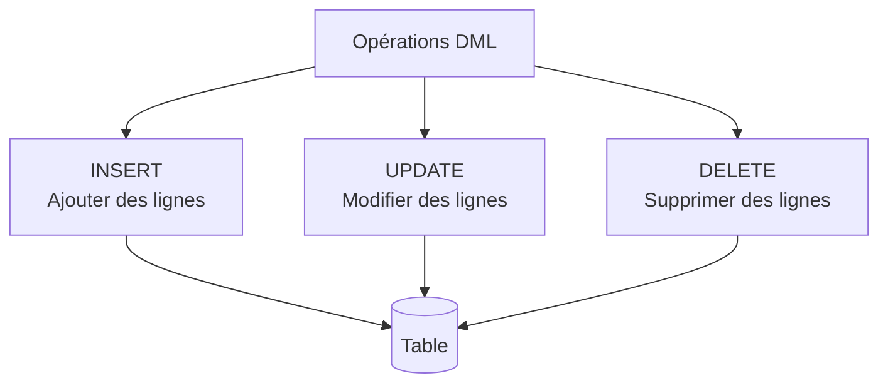

---
tags:
  - PostgreSQL
  - Débutant
  - Pratique
description: "INSERT, UPDATE et DELETE"
estimated_time: "200 min"
fiche_number: 4
total_fiches: 8
cursus: "PostgreSQL"
---

# 04 - INSERT, UPDATE et DELETE

> **En bref** : À la fin de cette fiche, tu sauras insérer, modifier et supprimer des données dans une base PostgreSQL avec les commandes INSERT, UPDATE et DELETE. Lecture estimée : 200 min.


## Prérequis

- Avoir lu la fiche **[01 - Introduction à PostgreSQL](01-introduction-postgresql.md)**
- Avoir lu la fiche **[02 - Requêtes SELECT](02-requetes-select.md)**
- Savoir se connecter à PostgreSQL via Docker
- Comprendre les entités Doctrine (fiche **[03-symfony/04 - Introduction à Doctrine](../03-symfony/04-introduction-doctrine.md)**)

## Objectif de cette fiche

À la fin de cette fiche, tu sauras insérer, modifier et supprimer des données dans une base PostgreSQL avec les commandes INSERT, UPDATE et DELETE.

---

## Concepts

Cette section explique tous les concepts nécessaires. Lis-la entièrement avant de passer aux étapes pratiques.

### Qu'est-ce que les commandes DML d'écriture ?

**Définition** : INSERT, UPDATE et DELETE sont les trois commandes SQL de manipulation de données (DML) qui permettent respectivement d'ajouter, de modifier et de supprimer des lignes dans une table.

**Le problème que ces commandes résolvent** :

Sans commandes d'écriture, voici les problèmes rencontrés :

1. **Impossible d'ajouter des données** : Les tables restent vides après leur création.
2. **Impossible de corriger une erreur** : Un prix ou un nom incorrect reste figé.
3. **Impossible de nettoyer** : Les données obsolètes s'accumulent indéfiniment.

**Comment ces commandes résolvent ces problèmes** :

| Problème | Solution apportée |
| -------- | ----------------- |
| Tables vides | INSERT ajoute de nouvelles lignes |
| Données incorrectes | UPDATE modifie les valeurs existantes |
| Données obsolètes | DELETE supprime les lignes inutiles |

**Analogie concrète** : Imagine un classeur avec des fiches papier. INSERT revient à écrire une nouvelle fiche et la ranger dans le classeur. UPDATE revient à prendre une fiche existante, gommer une information et écrire la correction. DELETE revient à retirer une fiche du classeur et la jeter à la poubelle.

Le diagramme suivant montre les trois opérations DML et leur effet sur une table :



**Ce que ces commandes ne sont PAS** :

- Ces commandes ne modifient pas la structure de la table (colonnes, types). Pour cela, on utilise ALTER TABLE (commande DDL).
- Ces commandes ne sont pas annulables par défaut une fois validées. En dehors d'une transaction explicite, chaque commande est automatiquement validée (auto-commit).

---

### La commande INSERT

**Définition** : INSERT INTO ajoute une ou plusieurs nouvelles lignes dans une table.

**Syntaxe de base** :

```sql
INSERT INTO nom_table (colonne1, colonne2, colonne3)
VALUES (valeur1, valeur2, valeur3);
```

**Règles** :

- L'ordre des valeurs doit correspondre à l'ordre des colonnes listées
- Les chaînes de caractères sont entre guillemets simples `'`
- Les nombres s'écrivent sans guillemets
- Les booléens s'écrivent `true` ou `false`
- Pour insérer une valeur vide, on utilise `NULL`

**Insertion de plusieurs lignes** :

```sql
INSERT INTO nom_table (colonne1, colonne2)
VALUES
    (valeur1a, valeur2a),
    (valeur1b, valeur2b),
    (valeur1c, valeur2c);
```

---

### La commande UPDATE

**Définition** : UPDATE modifie les valeurs d'une ou plusieurs colonnes dans des lignes existantes.

**Syntaxe** :

```sql
UPDATE nom_table
SET colonne1 = nouvelle_valeur1,
    colonne2 = nouvelle_valeur2
WHERE condition;
```

**Règle critique** : Inclure toujours une clause WHERE. Sans WHERE, toutes les lignes de la table sont modifiées.

```sql
-- ❌ DANGER : modifie TOUS les produits
UPDATE product SET price = 0;

-- ✅ Correct : modifie un seul produit
UPDATE product SET price = 0 WHERE id = 5;
```

---

### La commande DELETE

**Définition** : DELETE supprime des lignes d'une table selon une condition.

**Syntaxe** :

```sql
DELETE FROM nom_table
WHERE condition;
```

**Règle critique** : Comme UPDATE, inclure toujours une clause WHERE. Sans WHERE, toutes les lignes sont supprimées.

```sql
-- ❌ DANGER : supprime TOUS les produits
DELETE FROM product;

-- ✅ Correct : supprime un seul produit
DELETE FROM product WHERE id = 5;
```

---

### La clause RETURNING (spécifique PostgreSQL)

**Définition** : RETURNING est une fonctionnalité spécifique à PostgreSQL qui permet de récupérer les données affectées par un INSERT, UPDATE ou DELETE, sans avoir besoin d'exécuter un SELECT supplémentaire.

**Le problème que RETURNING résout** :

Sans RETURNING, pour connaître l'id d'une ligne insérée, il faut deux requêtes :

```sql
-- Sans RETURNING : deux requêtes nécessaires
INSERT INTO product (name, price) VALUES ('Clavier', 49.99);
SELECT id FROM product WHERE name = 'Clavier' ORDER BY id DESC LIMIT 1;
```

**Comment RETURNING résout ce problème** :

```sql
-- Avec RETURNING : une seule requête
INSERT INTO product (name, price) VALUES ('Clavier', 49.99)
RETURNING id;
```

**Analogie concrète** : Quand tu déposes un colis à la poste, le guichetier te donne un reçu avec le numéro de suivi. RETURNING est ce reçu : il te confirme ce qui a été fait et te donne les informations utiles sans que tu aies besoin de revenir demander.

---

### TRUNCATE vs DELETE

**Définition** : TRUNCATE est une commande DDL qui vide entièrement une table, contrairement à DELETE qui est une commande DML qui supprime ligne par ligne.

**Comparaison TRUNCATE vs DELETE** :

| TRUNCATE | DELETE |
| -------- | ------ |
| Supprime toutes les lignes d'un coup | Supprime ligne par ligne |
| Pas de clause WHERE possible | Peut filtrer avec WHERE |
| Très rapide (même sur des millions de lignes) | Lent sur de grandes tables |
| Réinitialise les compteurs auto-incrément | Ne réinitialise pas les compteurs |
| Ne déclenche pas les triggers DELETE | Déclenche les triggers DELETE |
| Non annulable (hors transaction) | Non annulable (hors transaction) |

**Quand utiliser TRUNCATE** : Pour vider complètement une table (par exemple, réinitialiser des données de test).

**Quand utiliser DELETE** : Pour supprimer des lignes spécifiques selon une condition.

---

### Lien avec Doctrine : persist et flush

**Définition** : Dans Symfony avec Doctrine, tu ne manipules pas directement le SQL. Doctrine traduit tes opérations PHP en requêtes INSERT, UPDATE et DELETE.

**Correspondance Doctrine → SQL** :

| Opération Doctrine | Requête SQL générée |
| ------------------- | ------------------- |
| `$em->persist($product)` + `$em->flush()` (nouvel objet) | `INSERT INTO product (...) VALUES (...)` |
| Modifier une propriété + `$em->flush()` | `UPDATE product SET ... WHERE id = ...` |
| `$em->remove($product)` + `$em->flush()` | `DELETE FROM product WHERE id = ...` |

**Exemple concret** :

```php
// PHP avec Doctrine - Insertion
$product = new Product();
$product->setName('Clavier RGB');
$product->setPrice(89.99);

$entityManager->persist($product);  // Prépare l'INSERT
$entityManager->flush();            // Exécute l'INSERT en base
```

**SQL généré par Doctrine** :

```sql
INSERT INTO product (name, price, available)
VALUES ('Clavier RGB', 89.99, true);
```

**Pourquoi connaître le SQL si Doctrine fait tout ?** :

1. **Déboguer** : Quand Doctrine renvoie une erreur SQL, tu dois comprendre la requête
2. **Performances** : Certaines opérations en masse sont plus rapides en SQL direct
3. **Migrations** : Les fichiers de migration contiennent du SQL brut
4. **Console** : Corriger des données directement en base via psql

---

## Étapes Pratiques

### Étape 1 : Se connecter à PostgreSQL

```bash
docker compose exec database psql -U app -d app
```

**Résultat attendu** :

```text
psql (16.x)
Type "help" for help.

app=#
```

---

### Étape 2 : Vérifier l'état initial des données

Avant de modifier des données, vérifie ce qui existe :

```sql
SELECT * FROM category ORDER BY id;
```

**Résultat attendu** :

```text
 id |     name
----+------------------
  1 | Informatique
  2 | Audio
  3 | Mobilier
```

```sql
SELECT id, name, price, available, category_id FROM product ORDER BY id;
```

**Résultat attendu** :

```text
 id |       name       | price  | available | category_id
----+------------------+--------+-----------+-------------
  1 | Clavier RGB      |  89.99 |     t     |           1
  2 | Souris gaming    |  49.99 |     t     |           1
  3 | Écran 27 pouces  | 299.99 |     f     |           2
  4 | Webcam HD        |  59.99 |     t     |           3
  5 | Casque audio     |  79.99 |     t     |           3
```

---

### Étape 3 : INSERT - Insérer une seule ligne

```sql
-- Insérer une nouvelle catégorie
INSERT INTO category (name) VALUES ('Périphériques');
```

**Résultat attendu** :

```text
INSERT 0 1
```

**Explication du résultat** :

- `INSERT` : La commande exécutée
- `0` : OID (toujours 0 en PostgreSQL moderne, tu peux ignorer cette valeur)
- `1` : Nombre de lignes insérées

**Vérifie l'insertion** :

```sql
SELECT * FROM category ORDER BY id;
```

**Résultat attendu** :

```text
 id |      name
----+------------------
  1 | Informatique
  2 | Audio
  3 | Mobilier
  4 | Périphériques
```

L'`id` 4 a été attribué automatiquement par la séquence auto-incrément.

---

### Étape 4 : INSERT - Insérer avec toutes les colonnes

```sql
-- Insérer un nouveau produit avec toutes les colonnes
INSERT INTO product (name, price, description, available, category_id)
VALUES ('Hub USB', 24.99, 'Hub USB 4 ports', true, 4);
```

**Résultat attendu** :

```text
INSERT 0 1
```

**Vérifie** :

```sql
SELECT * FROM product WHERE name = 'Hub USB';
```

**Résultat attendu** :

```text
 id |  name   | price |   description   | available | category_id
----+---------+-------+-----------------+-----------+-------------
  6 | Hub USB | 24.99 | Hub USB 4 ports |     t     |           4
```

---

### Étape 5 : INSERT - Insérer plusieurs lignes en une seule commande

```sql
-- Insérer 3 produits d'un coup
INSERT INTO product (name, price, description, available, category_id)
VALUES
    ('Tapis de souris', 12.99, 'Tapis XL', true, 4),
    ('Câble HDMI', 8.99, 'HDMI 2.1 - 2 mètres', true, 4),
    ('Support écran', 34.99, 'Support réglable', false, 3);
```

**Résultat attendu** :

```text
INSERT 0 3
```

Le `3` confirme que trois lignes ont été insérées.

---

### Étape 6 : INSERT - Utiliser DEFAULT et NULL

```sql
-- Insérer un produit sans description (NULL) et avec available par défaut
INSERT INTO product (name, price, description, available, category_id)
VALUES ('Adaptateur USB-C', 15.99, NULL, true, 4);
```

**Résultat attendu** :

```text
INSERT 0 1
```

**Vérifie la valeur NULL** :

```sql
SELECT name, description FROM product WHERE name = 'Adaptateur USB-C';
```

**Résultat attendu** :

```text
       name       | description
------------------+-------------
 Adaptateur USB-C | (null)
```

La colonne `description` est vide (NULL) car on a explicitement passé NULL.

---

### Étape 7 : INSERT avec RETURNING

```sql
-- Insérer et récupérer l'id généré automatiquement
INSERT INTO product (name, price, description, available, category_id)
VALUES ('Webcam 4K', 129.99, 'Webcam Ultra HD', true, 1)
RETURNING id;
```

**Résultat attendu** :

```text
 id
----
 11
```

Tu obtiens l'id directement sans requête supplémentaire.

**RETURNING avec plusieurs colonnes** :

```sql
INSERT INTO product (name, price, description, available, category_id)
VALUES ('Micro USB', 44.99, 'Microphone de bureau', true, 2)
RETURNING id, name, price;
```

**Résultat attendu** :

```text
 id |   name    | price
----+-----------+-------
 12 | Micro USB | 44.99
```

**RETURNING avec toutes les colonnes** :

```sql
INSERT INTO product (name, price, available, category_id)
VALUES ('Rallonge USB', 6.99, true, 4)
RETURNING *;
```

**Résultat attendu** :

```text
 id |     name     | price | description | available | category_id
----+--------------+-------+-------------+-----------+-------------
 13 | Rallonge USB |  6.99 | (null)      |     t     |           4
```

---

### Étape 8 : UPDATE - Modifier une seule ligne

```sql
-- Modifier le prix du produit id=6
UPDATE product
SET price = 29.99
WHERE id = 6;
```

**Résultat attendu** :

```text
UPDATE 1
```

Le `1` indique qu'une ligne a été modifiée.

**Vérifie** :

```sql
SELECT name, price FROM product WHERE id = 6;
```

**Résultat attendu** :

```text
  name   | price
---------+-------
 Hub USB | 29.99
```

---

### Étape 9 : UPDATE - Modifier plusieurs colonnes

```sql
-- Modifier le nom, le prix et la description en une seule commande
UPDATE product
SET name = 'Hub USB-C',
    price = 34.99,
    description = 'Hub USB-C 7 ports'
WHERE id = 6;
```

**Résultat attendu** :

```text
UPDATE 1
```

**Vérifie** :

```sql
SELECT name, price, description FROM product WHERE id = 6;
```

**Résultat attendu** :

```text
    name    | price |    description
------------+-------+-------------------
 Hub USB-C  | 34.99 | Hub USB-C 7 ports
```

---

### Étape 10 : UPDATE - Modifier plusieurs lignes avec WHERE

```sql
-- Augmenter de 10% le prix de tous les produits de la catégorie 4
UPDATE product
SET price = ROUND(price * 1.10, 2)
WHERE category_id = 4;
```

**Résultat attendu** :

```text
UPDATE 5
```

Le `5` indique que cinq lignes ont été modifiées (tous les produits de la catégorie 4).

**Vérifie** :

```sql
SELECT name, price FROM product WHERE category_id = 4 ORDER BY name;
```

**Résultat attendu** :

```text
       name       | price
------------------+-------
 Adaptateur USB-C | 17.59
 Câble HDMI       |  9.89
 Hub USB-C        | 38.49
 Rallonge USB     |  7.69
 Tapis de souris  | 14.29
```

---

### Étape 11 : UPDATE - Calcul basé sur la valeur actuelle

```sql
-- Appliquer une réduction de 5€ sur les produits à plus de 100€
UPDATE product
SET price = price - 5
WHERE price > 100;
```

**Résultat attendu** :

```text
UPDATE 2
```

**Explication** : `price = price - 5` signifie "prendre le prix actuel et soustraire 5". On peut utiliser la valeur actuelle d'une colonne dans le calcul.

---

### Étape 12 : UPDATE avec RETURNING

```sql
-- Rendre indisponibles les produits à moins de 10€ et voir lesquels
UPDATE product
SET available = false
WHERE price < 10
RETURNING id, name, price;
```

**Résultat attendu** :

```text
 id |     name     | price
----+--------------+-------
 13 | Rallonge USB |  7.69
  8 | Câble HDMI   |  9.89
```

RETURNING montre les lignes qui ont été modifiées.

---

### Étape 13 : UPDATE avec sous-requête

```sql
-- Déplacer tous les produits de la catégorie "Périphériques"
-- vers la catégorie "Informatique"
UPDATE product
SET category_id = (SELECT id FROM category WHERE name = 'Informatique')
WHERE category_id = (SELECT id FROM category WHERE name = 'Périphériques');
```

**Résultat attendu** :

```text
UPDATE 5
```

**Explication** : Au lieu de coder en dur les id (1, 4), on utilise des sous-requêtes pour trouver les id à partir des noms. Ce code est plus lisible et fonctionne même si les id changent.

---

### Étape 14 : DELETE - Supprimer une seule ligne

```sql
-- Supprimer le produit id=13
DELETE FROM product
WHERE id = 13;
```

**Résultat attendu** :

```text
DELETE 1
```

Le `1` indique qu'une ligne a été supprimée.

**Vérifie** :

```sql
SELECT * FROM product WHERE id = 13;
```

**Résultat attendu** :

```text
 id | name | price | description | available | category_id
----+------+-------+-------------+-----------+-------------
(0 rows)
```

La ligne n'existe plus.

---

### Étape 15 : DELETE - Supprimer plusieurs lignes

```sql
-- Supprimer les produits indisponibles dont le prix est >= 10 €
-- (les produits à bas prix restent pour l'étape suivante avec RETURNING)
DELETE FROM product
WHERE available = false
AND price >= 10;
```

**Résultat attendu** :

```text
DELETE 2
```

Les 2 lignes supprimées sont Écran 27 pouces et Support écran (indisponibles et prix >= 10). Le Câble HDMI (9,89 €, `available = false` depuis l'étape 12) reste encore en base pour l'étape 16.

---

### Étape 16 : DELETE avec RETURNING

```sql
-- Supprimer les produits à moins de 10€ et voir ce qui a été supprimé
DELETE FROM product
WHERE price < 10
RETURNING id, name, price;
```

**Résultat attendu** :

```text
 id |    name    | price
----+------------+-------
  8 | Câble HDMI |  9.89
```

RETURNING est utile pour garder une trace de ce qui a été supprimé (par exemple pour un journal de bord).

---

### Étape 17 : DELETE et les clés étrangères

```sql
-- Essayer de supprimer une catégorie qui a des produits
DELETE FROM category WHERE id = 1;
```

**Résultat attendu** :

```text
ERROR:  update or delete on table "category" violates foreign key constraint
"fk_d34a04ad12469de2" on table "product"
DETAIL:  Key (id)=(1) is still referenced from table "product".
```

**Explication** : PostgreSQL empêche la suppression car des produits référencent cette catégorie. C'est une protection : sans elle, les produits auraient un `category_id` qui pointe vers une catégorie inexistante.

**Solution** : Supprimer ou modifier d'abord les produits liés :

```sql
-- Option 1 : Supprimer les produits liés d'abord
DELETE FROM product WHERE category_id = 1;
DELETE FROM category WHERE id = 1;

-- Option 2 : Détacher les produits de la catégorie
UPDATE product SET category_id = NULL WHERE category_id = 1;
DELETE FROM category WHERE id = 1;
```

---

### Étape 18 : TRUNCATE - Vider une table entièrement

```sql
-- Vider la table product entièrement
TRUNCATE TABLE product;
```

**Résultat attendu** :

```text
TRUNCATE TABLE
```

**Vérifie** :

```sql
SELECT COUNT(*) FROM product;
```

**Résultat attendu** :

```text
 count
-------
     0
```

**Réinitialiser aussi la séquence auto-incrément** :

```sql
-- Vider la table ET repartir de id=1
TRUNCATE TABLE product RESTART IDENTITY;
```

Après cette commande, le prochain INSERT aura `id = 1`.

**TRUNCATE avec CASCADE** (tables liées) :

```sql
-- Vider la table category ET toutes les tables qui la référencent
TRUNCATE TABLE category CASCADE;
```

Cette commande vide aussi la table `product` car elle a une clé étrangère vers `category`.

---

## Commandes Utiles

| Commande | Action |
| -------- | ------ |
| `INSERT INTO t (col) VALUES (val);` | Insérer une ligne |
| `INSERT INTO t (col) VALUES (v1), (v2);` | Insérer plusieurs lignes |
| `INSERT INTO t (col) VALUES (val) RETURNING *;` | Insérer et voir le résultat |
| `UPDATE t SET col = val WHERE condition;` | Modifier des lignes |
| `UPDATE t SET col = col + 10 WHERE condition;` | Modifier avec calcul |
| `DELETE FROM t WHERE condition;` | Supprimer des lignes |
| `DELETE FROM t WHERE condition RETURNING *;` | Supprimer et voir le résultat |
| `TRUNCATE TABLE t;` | Vider entièrement une table |
| `TRUNCATE TABLE t RESTART IDENTITY;` | Vider et réinitialiser les id |
| `TRUNCATE TABLE t CASCADE;` | Vider avec les tables liées |

---

## Pièges Fréquents

### Piège 1 : Oublier le WHERE dans UPDATE ou DELETE

**Problème** : Toutes les lignes de la table sont modifiées ou supprimées.

```sql
-- ❌ DANGER : tous les prix deviennent 0
UPDATE product SET price = 0;

-- ❌ DANGER : toute la table est vidée
DELETE FROM product;

-- ✅ Correct : avec WHERE
UPDATE product SET price = 0 WHERE id = 5;
DELETE FROM product WHERE id = 5;
```

**Bonne pratique** : Avant d'exécuter un UPDATE ou DELETE, teste d'abord ton WHERE avec un SELECT :

```sql
-- Étape 1 : Vérifier ce qui sera affecté
SELECT * FROM product WHERE price < 10;

-- Étape 2 : Si le résultat est correct, exécuter le DELETE
DELETE FROM product WHERE price < 10;
```

---

### Piège 2 : Guillemets simples vs guillemets doubles

**Problème** : Mauvais type de guillemets pour les valeurs.

```sql
-- ❌ Incorrect : guillemets doubles pour une valeur texte
INSERT INTO product (name) VALUES ("Clavier");

-- ✅ Correct : guillemets simples pour les valeurs texte
INSERT INTO product (name) VALUES ('Clavier');
```

**Règle** :

- Guillemets simples `'` : pour les valeurs (chaînes de caractères)
- Guillemets doubles `"` : pour les identifiants (noms de tables/colonnes avec caractères spéciaux)

```sql
-- Guillemets doubles pour un nom de table réservé
SELECT * FROM "user";

-- Guillemets simples pour une valeur
SELECT * FROM product WHERE name = 'Clavier';
```

---

### Piège 3 : Apostrophe dans une valeur texte

**Problème** : Erreur de syntaxe quand la valeur contient une apostrophe.

```sql
-- ❌ Erreur : l'apostrophe coupe la chaîne
INSERT INTO product (name) VALUES ('Écran d'ordinateur');

-- ✅ Correct : doubler l'apostrophe
INSERT INTO product (name) VALUES ('Écran d''ordinateur');
```

**Règle** : Pour insérer une apostrophe dans une valeur texte, double-la (`''`).

---

### Piège 4 : Violer une contrainte NOT NULL

**Problème** : Erreur quand on omet une colonne obligatoire.

```sql
-- ❌ Erreur : "name" est NOT NULL mais n'est pas fourni
INSERT INTO product (price) VALUES (29.99);
```

**Résultat** :

```text
ERROR:  null value in column "name" violates not-null constraint
```

**Solution** : Toujours inclure les colonnes NOT NULL dans l'INSERT :

```sql
-- ✅ Correct : inclure toutes les colonnes obligatoires
INSERT INTO product (name, price, available) VALUES ('Clavier', 29.99, true);
```

**Comment savoir quelles colonnes sont obligatoires ?** :

```sql
\d product
```

Les colonnes marquées `not null` dans la colonne "Nullable" sont obligatoires.

---

### Piège 5 : Violer une clé étrangère

**Problème** : Erreur quand on référence un id qui n'existe pas dans la table liée.

```sql
-- ❌ Erreur : la catégorie id=999 n'existe pas
INSERT INTO product (name, price, available, category_id)
VALUES ('Test', 10, true, 999);
```

**Résultat** :

```text
ERROR:  insert or update on table "product" violates foreign key constraint
DETAIL:  Key (category_id)=(999) is not present in table "category".
```

**Solution** : Vérifier que l'id référencé existe :

```sql
-- Vérifier les catégories existantes
SELECT id, name FROM category;

-- Puis insérer avec un id valide
INSERT INTO product (name, price, available, category_id)
VALUES ('Test', 10, true, 1);
```

---

### Piège 6 : Confondre DELETE et TRUNCATE

**Problème** : Utiliser DELETE sans WHERE pour vider une table.

```sql
-- ❌ Fonctionne mais très lent sur une grande table
DELETE FROM product;

-- ✅ Préférer TRUNCATE pour vider une table entière
TRUNCATE TABLE product;
```

**Différence** : Sur une table de 1 million de lignes, DELETE peut prendre plusieurs minutes. TRUNCATE est quasi instantané.

---

## Checklist de Validation

- [ ] Je sais insérer une ligne avec INSERT INTO ... VALUES
- [ ] Je sais insérer plusieurs lignes en une seule commande
- [ ] Je sais utiliser RETURNING pour récupérer les données insérées
- [ ] Je sais modifier des lignes avec UPDATE ... SET ... WHERE
- [ ] Je sais modifier une valeur en me basant sur sa valeur actuelle (ex: `price = price + 10`)
- [ ] Je sais utiliser UPDATE avec une sous-requête
- [ ] Je sais supprimer des lignes avec DELETE ... WHERE
- [ ] Je sais la différence entre DELETE et TRUNCATE
- [ ] Je teste toujours mon WHERE avec un SELECT avant d'exécuter UPDATE ou DELETE
- [ ] Je comprends les erreurs de clé étrangère
- [ ] Je comprends le lien entre persist/flush de Doctrine et INSERT/UPDATE

---

## Exercice Pratique

**Énoncé** : Gère les données d'une boutique en ligne.

**Contexte** :

- Table `category` (id, name)
- Table `product` (id, name, price, description, available, category_id)

**Opérations à effectuer dans l'ordre** :

1. Crée une nouvelle catégorie "Accessoires"
2. Insère 3 produits dans cette catégorie (invente les noms et prix)
3. Modifie le prix du deuxième produit à 19.99
4. Augmente de 15% le prix de tous les produits de la catégorie "Accessoires"
5. Rends indisponible tout produit à plus de 200€
6. Supprime les produits indisponibles de la catégorie "Accessoires" et affiche ce qui a été supprimé
7. Compte combien de produits il reste dans la catégorie "Accessoires"

**Indications** :

- Utilise RETURNING pour les opérations 1, 2 et 6
- Utilise une sous-requête pour l'opération 4 (trouver l'id de la catégorie par son nom)
- Teste tes WHERE avec SELECT avant d'exécuter UPDATE ou DELETE

---

## Solution de l'Exercice

> **Note** : Cette section contient la solution complète. Essaie d'abord de résoudre l'exercice par toi-même avant de consulter cette solution.

---

**1. Créer la catégorie "Accessoires"** :

```sql
INSERT INTO category (name)
VALUES ('Accessoires')
RETURNING id, name;
```

**Résultat attendu** :

```text
 id |    name
----+-------------
  5 | Accessoires
```

Note l'id retourné (ici 5). On l'utilise dans les étapes suivantes.

---

**2. Insérer 3 produits** :

```sql
INSERT INTO product (name, price, description, available, category_id)
VALUES
    ('Housse ordinateur', 29.99, 'Housse 15 pouces', true, 5),
    ('Nettoyant écran', 12.99, 'Spray 250ml', true, 5),
    ('Support laptop', 45.99, 'Support aluminium', true, 5)
RETURNING id, name, price;
```

**Résultat attendu** :

```text
 id |       name        | price
----+-------------------+-------
 13 | Housse ordinateur | 29.99
 14 | Nettoyant écran   | 12.99
 15 | Support laptop    | 45.99
```

---

**3. Modifier le prix du deuxième produit** :

```sql
-- D'abord, vérifier quel est le deuxième produit
SELECT id, name, price FROM product WHERE category_id = 5 ORDER BY id;

-- Puis modifier (ici id=14)
UPDATE product
SET price = 19.99
WHERE id = 14;
```

---

**4. Augmenter de 15% les prix de la catégorie "Accessoires"** :

```sql
-- Vérifier d'abord ce qui sera affecté
SELECT name, price, ROUND(price * 1.15, 2) AS nouveau_prix
FROM product
WHERE category_id = (SELECT id FROM category WHERE name = 'Accessoires');

-- Exécuter la modification
UPDATE product
SET price = ROUND(price * 1.15, 2)
WHERE category_id = (SELECT id FROM category WHERE name = 'Accessoires')
RETURNING name, price;
```

**Résultat attendu** :

```text
       name        | price
-------------------+-------
 Housse ordinateur | 34.49
 Nettoyant écran   | 22.99
 Support laptop    | 52.89
```

---

**5. Rendre indisponibles les produits à plus de 200€** :

```sql
-- Vérifier d'abord
SELECT name, price FROM product WHERE price > 200;

-- Exécuter
UPDATE product
SET available = false
WHERE price > 200
RETURNING name, price;
```

---

**6. Supprimer les produits indisponibles de la catégorie "Accessoires"** :

```sql
-- Vérifier d'abord
SELECT name, price, available
FROM product
WHERE available = false
AND category_id = (SELECT id FROM category WHERE name = 'Accessoires');

-- Supprimer
DELETE FROM product
WHERE available = false
AND category_id = (SELECT id FROM category WHERE name = 'Accessoires')
RETURNING id, name, price;
```

---

**7. Compter les produits restants** :

```sql
SELECT COUNT(*) AS nombre_produits
FROM product
WHERE category_id = (SELECT id FROM category WHERE name = 'Accessoires');
```

**Résultat attendu** :

```text
 nombre_produits
-----------------
               3
```

---

## Navigation

← Fiche précédente : **[Les jointures](03-jointures.md)**

→ Fiche suivante : **[Les fonctions d'agrégation](05-fonctions-agregation.md)**
