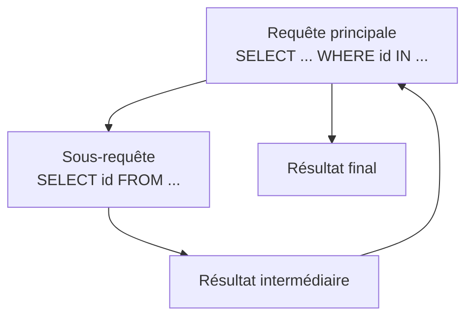

---
tags:
  - PostgreSQL
  - Intermédiaire
  - Pratique
description: "Les sous-requêtes et les vues"
estimated_time: "135 min"
fiche_number: 7
total_fiches: 8
cursus: "PostgreSQL"
---

# 07 - Les sous-requêtes et les vues

> **En bref** : À la fin de cette fiche, tu sauras écrire des sous-requêtes (IN, EXISTS, scalaires, corrélées) pour résoudre des problèmes complexes, et créer des vues pour réutiliser tes requêtes les plus fréquentes. Lecture estimée : 135 min.


## Prérequis

- Avoir lu la fiche **[03 - Les jointures](03-jointures.md)**
- Avoir lu la fiche **[05 - Les fonctions d'agrégation](05-fonctions-agregation.md)**
- Savoir écrire une requête SELECT avec WHERE, JOIN, GROUP BY et HAVING

## Objectif de cette fiche

À la fin de cette fiche, tu sauras écrire des sous-requêtes (IN, EXISTS, scalaires, corrélées) pour résoudre des problèmes complexes, et créer des vues pour réutiliser tes requêtes les plus fréquentes.

---

## Concepts

Cette section explique tous les concepts nécessaires. Lis-la entièrement avant de passer aux étapes pratiques.

### Qu'est-ce qu'une sous-requête ?

**Définition** : Une sous-requête est une requête SQL écrite à l'intérieur d'une autre requête. La sous-requête s'exécute en premier, puis son résultat est utilisé par la requête principale (appelée requête extérieure).

**Le problème que les sous-requêtes résolvent** :

Sans sous-requêtes, voici les problèmes rencontrés :

1. **Questions en deux étapes** : Pour trouver "les articles dont la catégorie a plus de 5 articles", il faudrait d'abord trouver les catégories avec plus de 5 articles, noter les résultats, puis faire une deuxième requête.
2. **Comparaison avec un calcul** : Pour trouver "les articles plus chers que la moyenne", il faudrait d'abord calculer la moyenne, puis faire une deuxième requête avec cette valeur.
3. **Vérification d'existence** : Pour trouver "les catégories qui ont au moins un article", il faudrait compter les articles par catégorie, puis filtrer manuellement.

**Comment les sous-requêtes résolvent ces problèmes** :

| Problème | Solution apportée par les sous-requêtes |
| -------- | --------------------------------------- |
| Questions en deux étapes | Une seule requête imbriquée fait les deux étapes |
| Comparaison avec un calcul | La sous-requête calcule la valeur, la requête extérieure l'utilise |
| Vérification d'existence | EXISTS vérifie directement si des lignes correspondent |

**Analogie concrète** : Imagine que tu poses une question à quelqu'un : "Donne-moi les noms des élèves qui sont dans les classes qui ont plus de 30 élèves." Pour répondre, la personne doit d'abord identifier les classes de plus de 30 élèves (la sous-requête), puis trouver les noms des élèves de ces classes (la requête extérieure). C'est une question à l'intérieur d'une autre question.

Le diagramme suivant montre comment une sous-requête est imbriquée dans la requête principale :



**Ce qu'une sous-requête n'est PAS** :

- Une sous-requête n'est pas une jointure. Une jointure combine les colonnes de deux tables. Une sous-requête utilise le résultat d'une requête comme filtre ou comme valeur dans une autre requête.
- Une sous-requête n'est pas toujours plus performante qu'une jointure. Dans certains cas, une jointure est plus rapide. PostgreSQL optimise souvent les deux de la même manière.

**Comparaison sous-requête vs jointure** :

| Sous-requête | Jointure |
| ------------ | -------- |
| Question imbriquée dans une autre | Combinaison de colonnes de plusieurs tables |
| Résultat utilisé comme filtre ou valeur | Résultat affiché comme colonnes supplémentaires |
| Plus lisible pour des conditions complexes | Plus lisible pour afficher des données de plusieurs tables |

---

### Les sous-requêtes avec IN

**Définition** : Une sous-requête avec IN retourne une liste de valeurs. La requête extérieure filtre les lignes dont la valeur se trouve dans cette liste.

**Syntaxe** :

```sql
SELECT colonnes
FROM table
WHERE colonne IN (SELECT colonne FROM autre_table WHERE condition);
```

**Exemple** :

```sql
-- Trouver les articles dont la catégorie contient plus de 5 articles
SELECT name, price
FROM article
WHERE category_id IN (
    SELECT category_id
    FROM article
    GROUP BY category_id
    HAVING COUNT(*) > 5
);
```

**Comment ça fonctionne** :

1. La sous-requête retourne une liste d'identifiants de catégories (par exemple : `1, 3`).
2. La requête extérieure filtre les articles dont `category_id` est dans cette liste.
3. C'est équivalent à écrire `WHERE category_id IN (1, 3)`.

**NOT IN** : L'inverse de IN. Retourne les lignes dont la valeur n'est PAS dans la liste.

```sql
-- Articles dont la catégorie a 5 articles ou moins
SELECT name, price
FROM article
WHERE category_id NOT IN (
    SELECT category_id
    FROM article
    GROUP BY category_id
    HAVING COUNT(*) > 5
);
```

---

### Les sous-requêtes avec EXISTS

**Définition** : EXISTS vérifie si une sous-requête retourne au moins une ligne. Si oui, la condition est vraie. EXISTS ne retourne pas de valeurs : il retourne uniquement vrai ou faux.

**Syntaxe** :

```sql
SELECT colonnes
FROM table_a a
WHERE EXISTS (SELECT 1 FROM table_b b WHERE b.colonne = a.colonne);
```

**Exemple** :

```sql
-- Catégories qui ont au moins un article
SELECT c.name
FROM category c
WHERE EXISTS (
    SELECT 1 FROM article a WHERE a.category_id = c.id
);
```

**Comment ça fonctionne** :

1. Pour chaque catégorie, PostgreSQL exécute la sous-requête.
2. Si la sous-requête retourne au moins une ligne, la catégorie est conservée dans le résultat.
3. `SELECT 1` est une convention : la valeur retournée n'a pas d'importance, seule l'existence d'au moins une ligne compte.

**NOT EXISTS** : L'inverse de EXISTS. Retourne les lignes pour lesquelles la sous-requête ne retourne aucun résultat.

**Comparaison IN vs EXISTS** :

| IN | EXISTS |
| -- | ------ |
| Compare une valeur à une liste | Vérifie si au moins une ligne existe |
| La sous-requête retourne des valeurs | La sous-requête retourne vrai/faux |
| Meilleur quand la sous-requête retourne peu de résultats | Meilleur quand la table extérieure est petite |
| Problème avec NULL (voir Pièges) | Pas de problème avec NULL |

---

### Les sous-requêtes scalaires

**Définition** : Une sous-requête scalaire retourne exactement une seule valeur (une ligne, une colonne). Elle peut être utilisée partout où une valeur simple est attendue : dans SELECT, dans WHERE, dans une expression.

**Syntaxe dans WHERE** :

```sql
SELECT colonnes
FROM table
WHERE colonne > (SELECT AVG(colonne) FROM table);
```

**Syntaxe dans SELECT** :

```sql
SELECT
    name,
    price,
    (SELECT AVG(price) FROM article) AS prix_moyen_global
FROM article;
```

**Règle importante** : Si la sous-requête scalaire retourne plus d'une ligne, PostgreSQL affiche une erreur. Elle doit retourner exactement une seule valeur.

---

### Les sous-requêtes corrélées

**Définition** : Une sous-requête corrélée est une sous-requête qui fait référence à une colonne de la requête extérieure. Elle est exécutée une fois pour chaque ligne de la requête extérieure.

**Exemple** :

```sql
-- Articles dont le prix est supérieur à la moyenne de leur catégorie
SELECT a.name, a.price, a.category_id
FROM article a
WHERE a.price > (
    SELECT AVG(a2.price)
    FROM article a2
    WHERE a2.category_id = a.category_id
);
```

**Comment ça fonctionne** :

1. PostgreSQL prend le premier article (par exemple : "Clavier", catégorie 1).
2. La sous-requête calcule la moyenne des prix de la catégorie 1.
3. Si le prix du "Clavier" est supérieur à cette moyenne, il est conservé dans le résultat.
4. PostgreSQL passe à l'article suivant et répète l'opération.

**Différence avec une sous-requête simple** :

| Sous-requête simple | Sous-requête corrélée |
| ------------------- | --------------------- |
| Exécutée une seule fois | Exécutée pour chaque ligne de la requête extérieure |
| Ne référence pas la requête extérieure | Référence une colonne de la requête extérieure |
| Plus rapide | Plus lente sur de grandes tables |

---

### Qu'est-ce qu'une vue ?

**Définition** : Une vue (VIEW) est une requête SQL nommée et enregistrée dans la base de données. Elle fonctionne comme une table virtuelle : tu peux l'interroger avec SELECT, mais elle ne stocke pas de données. Chaque fois que tu interroges une vue, PostgreSQL exécute la requête sous-jacente.

**Le problème que les vues résolvent** :

Sans vues, voici les problèmes rencontrés :

1. **Requêtes longues répétées** : Tu dois réécrire la même requête complexe à chaque fois que tu en as besoin.
2. **Duplication de logique** : Si la requête change, tu dois la modifier partout.
3. **Complexité visible** : Les développeurs qui utilisent tes données doivent comprendre des jointures et des agrégations complexes.

**Comment les vues résolvent ces problèmes** :

| Problème | Solution apportée par les vues |
| -------- | ------------------------------ |
| Requêtes longues répétées | La vue stocke la requête, tu n'écris plus qu'un simple SELECT |
| Duplication de logique | La vue est définie une seule fois, modifiable en un seul endroit |
| Complexité visible | La vue cache la complexité derrière un nom simple |

**Analogie concrète** : Imagine un raccourci sur ton bureau qui pointe vers un dossier profondément enterré dans ton disque dur. Le raccourci ne contient pas les fichiers, mais il te donne un accès rapide au dossier. Une vue fonctionne pareil : c'est un raccourci vers une requête complexe.

**Ce qu'une vue n'est PAS** :

- Une vue n'est pas une table. Elle ne stocke pas de données. Si les données des tables source changent, le résultat de la vue change aussi.
- Une vue n'est pas une vue matérialisée (MATERIALIZED VIEW). Une vue matérialisée stocke le résultat et doit être rafraîchie manuellement. La vue simple est toujours à jour.

---

## Étapes Pratiques

### Données d'exemple

Pour toutes les étapes pratiques, on utilise ces 3 tables :

```text
Table: category                     Table: users
+----+------------------+           +----+----------+
| id | name             |           | id | name     |
+----+------------------+           +----+----------+
|  1 | Informatique     |           |  1 | Alice    |
|  2 | Audio            |           |  2 | Bob      |
|  3 | Mobilier         |           |  3 | Charlie  |
+----+------------------+           |  4 | David    |
                                    +----+----------+
Table: article
+----+------------------+--------+-------------+----------+
| id | name             | price  | category_id | user_id  |
+----+------------------+--------+-------------+----------+
|  1 | Clavier          |  49.99 |           1 |        1 |
|  2 | Souris           |  29.99 |           1 |        2 |
|  3 | Casque audio     |  79.99 |           2 |        1 |
|  4 | Webcam           |  59.99 |           1 |        3 |
|  5 | Écran 24 pouces  | 199.99 |           1 |        2 |
|  6 | Microphone       |  89.99 |           2 |        3 |
|  7 | Bureau ajustable | 349.99 |           3 |        1 |
|  8 | Chaise gaming    | 249.99 |           3 |        2 |
|  9 | Câble USB        |   9.99 |           1 |        1 |
| 10 | Tapis de souris  |  14.99 |           1 |        3 |
+----+------------------+--------+-------------+----------+
```

Connecte-toi à PostgreSQL et crée les tables :

```bash
docker compose exec database psql -U app -d app
```

```sql
CREATE TABLE category (
    id SERIAL PRIMARY KEY,
    name VARCHAR(100) NOT NULL UNIQUE
);

CREATE TABLE users (
    id SERIAL PRIMARY KEY,
    name VARCHAR(100) NOT NULL
);

CREATE TABLE article (
    id SERIAL PRIMARY KEY,
    name VARCHAR(255) NOT NULL,
    price NUMERIC(10,2) NOT NULL CHECK (price > 0),
    category_id INTEGER NOT NULL REFERENCES category(id),
    user_id INTEGER NOT NULL REFERENCES users(id)
);

INSERT INTO category (name) VALUES ('Informatique'), ('Audio'), ('Mobilier');
INSERT INTO users (name) VALUES ('Alice'), ('Bob'), ('Charlie'), ('David');

INSERT INTO article (name, price, category_id, user_id) VALUES
('Clavier', 49.99, 1, 1), ('Souris', 29.99, 1, 2),
('Casque audio', 79.99, 2, 1), ('Webcam', 59.99, 1, 3),
('Écran 24 pouces', 199.99, 1, 2), ('Microphone', 89.99, 2, 3),
('Bureau ajustable', 349.99, 3, 1), ('Chaise gaming', 249.99, 3, 2),
('Câble USB', 9.99, 1, 1), ('Tapis de souris', 14.99, 1, 3);
```

**Résultat attendu** : Chaque commande affiche `CREATE TABLE` ou `INSERT 0 X`.

---

### Étape 1 : Sous-requête avec IN

**Objectif** : Trouver les articles dont la catégorie contient plus de 3 articles.

```sql
-- Étape mentale 1 : quelles catégories ont plus de 3 articles ?
SELECT category_id
FROM article
GROUP BY category_id
HAVING COUNT(*) > 3;
```

**Résultat intermédiaire** :

```text
 category_id
-------------
           1
```

Seule la catégorie 1 (Informatique) a plus de 3 articles (elle en a 6).

```sql
-- Étape mentale 2 : combiner en une seule requête avec IN
SELECT name, price
FROM article
WHERE category_id IN (
    SELECT category_id
    FROM article
    GROUP BY category_id
    HAVING COUNT(*) > 3
);
```

**Résultat attendu** :

```text
      name       | price
-----------------+--------
 Clavier         |  49.99
 Souris          |  29.99
 Webcam          |  59.99
 Écran 24 pouces | 199.99
 Câble USB       |   9.99
 Tapis de souris |  14.99
```

**Avec NOT IN** (articles des catégories de 3 articles ou moins) :

```sql
SELECT name, price
FROM article
WHERE category_id NOT IN (
    SELECT category_id
    FROM article
    GROUP BY category_id
    HAVING COUNT(*) > 3
);
```

**Résultat attendu** :

```text
       name       | price
------------------+--------
 Casque audio     |  79.99
 Microphone       |  89.99
 Bureau ajustable | 349.99
 Chaise gaming    | 249.99
```

---

### Étape 2 : Sous-requête avec EXISTS

**Objectif** : Trouver les catégories qui ont au moins un article, et les utilisateurs sans article.

```sql
-- Ajouter une catégorie vide pour tester
INSERT INTO category (name) VALUES ('Jardinage');

-- Catégories AVEC au moins un article
SELECT c.name
FROM category c
WHERE EXISTS (
    SELECT 1 FROM article a WHERE a.category_id = c.id
);
```

**Résultat attendu** :

```text
     name
--------------
 Informatique
 Audio
 Mobilier
```

"Jardinage" n'apparaît pas car elle n'a aucun article.

```sql
-- Catégories SANS aucun article (NOT EXISTS)
SELECT c.name
FROM category c
WHERE NOT EXISTS (
    SELECT 1 FROM article a WHERE a.category_id = c.id
);
```

**Résultat attendu** :

```text
   name
-----------
 Jardinage
```

```sql
-- Utilisateurs qui n'ont publié aucun article
SELECT u.name
FROM users u
WHERE NOT EXISTS (
    SELECT 1 FROM article a WHERE a.user_id = u.id
);
```

**Résultat attendu** :

```text
 name
-------
 David
```

---

### Étape 3 : Sous-requête scalaire

**Objectif** : Afficher chaque article avec le prix moyen global, et filtrer les articles au-dessus de la moyenne.

```sql
-- Sous-requête scalaire dans SELECT
SELECT
    name,
    price,
    (SELECT ROUND(AVG(price), 2) FROM article) AS prix_moyen_global
FROM article
ORDER BY price DESC
LIMIT 5;
```

**Résultat attendu** :

```text
       name       | price  | prix_moyen_global
------------------+--------+-------------------
 Bureau ajustable | 349.99 |            113.49
 Chaise gaming    | 249.99 |            113.49
 Écran 24 pouces  | 199.99 |            113.49
 Microphone       |  89.99 |            113.49
 Casque audio     |  79.99 |            113.49
```

```sql
-- Sous-requête scalaire dans WHERE : articles plus chers que la moyenne
SELECT name, price
FROM article
WHERE price > (SELECT AVG(price) FROM article)
ORDER BY price DESC;
```

**Résultat attendu** :

```text
       name       | price
------------------+--------
 Bureau ajustable | 349.99
 Chaise gaming    | 249.99
 Écran 24 pouces  | 199.99
```

---

### Étape 4 : Sous-requête corrélée

**Objectif** : Trouver les articles dont le prix est supérieur à la moyenne de leur catégorie.

```sql
SELECT a.name, a.price, c.name AS categorie
FROM article a
INNER JOIN category c ON a.category_id = c.id
WHERE a.price > (
    SELECT AVG(a2.price)
    FROM article a2
    WHERE a2.category_id = a.category_id
)
ORDER BY c.name, a.price DESC;
```

**Résultat attendu** :

```text
       name       | price  |   categorie
------------------+--------+--------------
 Microphone       |  89.99 | Audio
 Écran 24 pouces  | 199.99 | Informatique
 Bureau ajustable | 349.99 | Mobilier
```

**Vérification** (moyennes par catégorie) :

```sql
SELECT c.name, ROUND(AVG(a.price), 2) AS prix_moyen
FROM article a
INNER JOIN category c ON a.category_id = c.id
GROUP BY c.name;
```

**Résultat attendu** :

```text
     name     | prix_moyen
--------------+------------
 Audio        |      84.99
 Informatique |      60.82
 Mobilier     |     299.99
```

---

### Étape 5 : Créer une vue (CREATE VIEW)

**Objectif** : Créer une vue qui affiche les articles avec le nom de leur catégorie et le nom de l'auteur.

```sql
CREATE VIEW vue_articles_complets AS
SELECT
    a.id,
    a.name AS article,
    a.price,
    c.name AS categorie,
    u.name AS auteur
FROM article a
INNER JOIN category c ON a.category_id = c.id
INNER JOIN users u ON a.user_id = u.id;
```

**Résultat attendu** :

```text
CREATE VIEW
```

---

### Étape 6 : Interroger une vue comme une table

```sql
-- Lister tous les articles
SELECT * FROM vue_articles_complets ORDER BY price DESC LIMIT 5;
```

**Résultat attendu** :

```text
 id |     article      | price  |   categorie  | auteur
----+------------------+--------+--------------+---------
  7 | Bureau ajustable | 349.99 | Mobilier     | Alice
  8 | Chaise gaming    | 249.99 | Mobilier     | Bob
  5 | Écran 24 pouces  | 199.99 | Informatique | Bob
  6 | Microphone       |  89.99 | Audio        | Charlie
  3 | Casque audio     |  79.99 | Audio        | Alice
```

```sql
-- Filtrer sur une vue
SELECT article, price, auteur
FROM vue_articles_complets
WHERE categorie = 'Audio';
```

**Résultat attendu** :

```text
   article    | price | auteur
--------------+-------+---------
 Microphone   | 89.99 | Charlie
 Casque audio | 79.99 | Alice
```

```sql
-- Agréger sur une vue
SELECT categorie, COUNT(*) AS nombre, ROUND(AVG(price), 2) AS prix_moyen
FROM vue_articles_complets
GROUP BY categorie
ORDER BY nombre DESC;
```

**Résultat attendu** :

```text
   categorie   | nombre | prix_moyen
---------------+--------+------------
 Informatique  |      6 |      60.82
 Audio         |      2 |      84.99
 Mobilier      |      2 |     299.99
```

**Modifier une vue** avec `CREATE OR REPLACE VIEW` :

```sql
CREATE OR REPLACE VIEW vue_articles_complets AS
SELECT
    a.id,
    a.name AS article,
    a.price AS prix_ht,
    ROUND(a.price * 1.20, 2) AS prix_ttc,
    c.name AS categorie,
    u.name AS auteur
FROM article a
INNER JOIN category c ON a.category_id = c.id
INNER JOIN users u ON a.user_id = u.id;
```

**Supprimer une vue** :

```sql
DROP VIEW IF EXISTS vue_articles_complets;
```

**Lister toutes les vues** :

```sql
\dv
```

---

### Étape 7 : Nettoyage

```sql
DROP VIEW IF EXISTS vue_articles_complets;
DROP TABLE IF EXISTS article;
DROP TABLE IF EXISTS users;
DROP TABLE IF EXISTS category;
```

---

## Commandes Utiles

| Commande | Action |
| -------- | ------ |
| `WHERE colonne IN (SELECT ...)` | Filtre avec une liste de valeurs d'une sous-requête |
| `WHERE colonne NOT IN (SELECT ...)` | Exclut les valeurs d'une sous-requête |
| `WHERE EXISTS (SELECT ...)` | Vérifie qu'au moins une ligne existe |
| `WHERE NOT EXISTS (SELECT ...)` | Vérifie qu'aucune ligne n'existe |
| `WHERE col > (SELECT AVG(col) FROM t)` | Compare à une valeur calculée (sous-requête scalaire) |
| `(SELECT val FROM t) AS alias` | Sous-requête scalaire dans SELECT |
| `CREATE VIEW nom AS SELECT ...` | Crée une vue |
| `CREATE OR REPLACE VIEW nom AS ...` | Modifie une vue existante |
| `DROP VIEW IF EXISTS nom` | Supprime une vue sans erreur si elle n'existe pas |
| `\dv` | Liste toutes les vues de la base |
| `\d+ nom_vue` | Affiche la définition d'une vue |

---

## Pièges Fréquents

### Piège 1 : NULL dans NOT IN

**Problème** : NOT IN retourne un résultat vide si la sous-requête contient une valeur NULL.

```sql
-- Imagine une sous-requête qui retourne : (1, 3, NULL)
SELECT name FROM article
WHERE category_id NOT IN (1, 3, NULL);
-- Résultat : AUCUNE LIGNE (même si des articles ont category_id = 2)
```

**Explication** : En SQL, toute comparaison avec NULL retourne UNKNOWN. `category_id NOT IN (1, 3, NULL)` vérifie `category_id != 1 AND category_id != 3 AND category_id != NULL`. La dernière condition est toujours UNKNOWN, donc la ligne est exclue.

**Solution** : Utilise NOT EXISTS au lieu de NOT IN quand la sous-requête peut contenir des NULL.

```sql
-- ❌ Dangereux si la sous-requête peut retourner NULL
SELECT name FROM article
WHERE category_id NOT IN (SELECT category_id FROM autre_table);

-- ✅ Sûr même avec des NULL
SELECT a.name FROM article a
WHERE NOT EXISTS (
    SELECT 1 FROM autre_table t WHERE t.category_id = a.category_id
);
```

---

### Piège 2 : Sous-requête corrélée lente sur grandes tables

**Problème** : Une sous-requête corrélée est exécutée une fois pour chaque ligne de la requête extérieure. Sur une table de 100 000 lignes, la sous-requête s'exécute 100 000 fois.

**Solution** : Remplace par une jointure avec une sous-requête dans FROM :

```sql
-- ❌ Lent sur de grandes tables
SELECT a.name, a.price
FROM article a
WHERE a.price > (
    SELECT AVG(a2.price) FROM article a2
    WHERE a2.category_id = a.category_id
);

-- ✅ Plus rapide : la moyenne est calculée une seule fois par catégorie
SELECT a.name, a.price
FROM article a
INNER JOIN (
    SELECT category_id, AVG(price) AS prix_moyen
    FROM article
    GROUP BY category_id
) AS moyennes ON a.category_id = moyennes.category_id
WHERE a.price > moyennes.prix_moyen;
```

---

### Piège 3 : Vue non matérialisée recalculée à chaque appel

**Problème** : Une vue simple exécute la requête sous-jacente à chaque SELECT. Si la requête est complexe avec des millions de lignes, chaque appel peut être lent.

**Solution** : Pour les requêtes lourdes appelées souvent, utilise une vue matérialisée :

```sql
-- Stocke le résultat sur disque
CREATE MATERIALIZED VIEW vue_rapport_mat AS
SELECT c.name, COUNT(*), AVG(a.price)
FROM category c
JOIN article a ON c.id = a.category_id
GROUP BY c.name;

-- Lecture rapide (pas de recalcul)
SELECT * FROM vue_rapport_mat;

-- Rafraîchir manuellement quand les données changent
REFRESH MATERIALIZED VIEW vue_rapport_mat;
```

**Note** : Les vues matérialisées sortent du cadre de cette fiche. La vue simple suffit pour la majorité des cas.

---

### Piège 4 : Sous-requête scalaire qui retourne plusieurs lignes

**Problème** : Erreur "more than one row returned by a subquery used as an expression".

```sql
-- ❌ La sous-requête retourne plusieurs valeurs
SELECT name, price
FROM article
WHERE price > (SELECT price FROM article WHERE category_id = 1);
-- ERREUR : la sous-requête retourne 6 lignes
```

**Solution** : Utilise une fonction d'agrégation ou IN/ANY.

```sql
-- ✅ Solution 1 : fonction d'agrégation
SELECT name, price
FROM article
WHERE price > (SELECT AVG(price) FROM article WHERE category_id = 1);

-- ✅ Solution 2 : ANY pour comparer à chaque valeur de la liste
SELECT name, price
FROM article
WHERE price > ANY (SELECT price FROM article WHERE category_id = 1);
```

---

## Checklist de Validation

- [ ] Je sais écrire une sous-requête avec IN pour filtrer à partir d'une liste
- [ ] Je sais écrire une sous-requête avec NOT IN et je connais le piège du NULL
- [ ] Je sais utiliser EXISTS pour vérifier l'existence de lignes
- [ ] Je sais écrire une sous-requête scalaire dans SELECT et dans WHERE
- [ ] Je sais écrire une sous-requête corrélée et je comprends son coût en performance
- [ ] Je sais créer une vue avec CREATE VIEW
- [ ] Je sais interroger une vue comme une table
- [ ] Je sais modifier une vue avec CREATE OR REPLACE VIEW
- [ ] Je sais supprimer une vue avec DROP VIEW

---

## Exercice Pratique

**Énoncé** : Écris des requêtes avec sous-requêtes et crée 2 vues utiles sur une base e-commerce.

**Tables à créer** :

```sql
CREATE TABLE category (
    id SERIAL PRIMARY KEY,
    name VARCHAR(100) NOT NULL UNIQUE
);

CREATE TABLE product (
    id SERIAL PRIMARY KEY,
    name VARCHAR(255) NOT NULL,
    price NUMERIC(10,2) NOT NULL CHECK (price > 0),
    category_id INTEGER NOT NULL REFERENCES category(id)
);

CREATE TABLE orders (
    id SERIAL PRIMARY KEY,
    customer_name VARCHAR(255) NOT NULL,
    created_at TIMESTAMP NOT NULL DEFAULT NOW()
);

CREATE TABLE order_item (
    id SERIAL PRIMARY KEY,
    order_id INTEGER NOT NULL REFERENCES orders(id),
    product_id INTEGER NOT NULL REFERENCES product(id),
    quantity INTEGER NOT NULL CHECK (quantity > 0),
    unit_price NUMERIC(10,2) NOT NULL CHECK (unit_price > 0)
);
```

**Données à insérer** :

```sql
INSERT INTO category (name) VALUES
('Électronique'), ('Vêtements'), ('Livres'), ('Sport');

INSERT INTO product (name, price, category_id) VALUES
('Smartphone', 699.99, 1), ('Laptop', 1299.99, 1),
('Tablette', 449.99, 1), ('T-shirt', 19.99, 2),
('Jean', 49.99, 2), ('Roman policier', 12.99, 3),
('Manuel SQL', 39.99, 3), ('Ballon foot', 29.99, 4),
('Raquette tennis', 89.99, 4), ('Casquette', 14.99, 2);

INSERT INTO orders (customer_name) VALUES
('Alice'), ('Bob'), ('Charlie'), ('Alice'), ('David');

INSERT INTO order_item (order_id, product_id, quantity, unit_price) VALUES
(1, 1, 1, 699.99), (1, 6, 2, 12.99),
(2, 2, 1, 1299.99), (2, 4, 3, 19.99),
(3, 3, 1, 449.99), (3, 7, 1, 39.99),
(4, 1, 1, 699.99), (4, 5, 2, 49.99),
(5, 8, 2, 29.99), (5, 9, 1, 89.99);
```

**Requêtes à écrire** :

1. Les produits dont le prix est supérieur à la moyenne de tous les produits (sous-requête scalaire)
2. Les catégories qui ont au moins une commande (EXISTS)
3. Les produits qui n'ont jamais été commandés (NOT EXISTS)
4. Les produits dont le prix est supérieur à la moyenne de leur catégorie (sous-requête corrélée)
5. Les clients qui ont commandé des produits de la catégorie "Électronique" (IN)

**Vues à créer** :

1. `vue_catalogue` : chaque produit avec son nom, son prix, le nom de sa catégorie et le prix TTC (prix * 1.20)
2. `vue_ventes_categorie` : pour chaque catégorie, le nombre de produits vendus, le chiffre d'affaires total et le nombre de commandes distinctes

**Résultat attendu** : Chaque requête retourne des résultats cohérents, et les vues sont interrogeables comme des tables.

---

## Solution de l'Exercice

> **Note** : Cette section contient la solution complète. Essaie d'abord de résoudre l'exercice par toi-même avant de consulter cette solution.

---

**1. Produits plus chers que la moyenne** :

```sql
SELECT name, price
FROM product
WHERE price > (SELECT AVG(price) FROM product)
ORDER BY price DESC;
```

**Résultat** : Laptop (1299.99), Smartphone (699.99), Tablette (449.99). La moyenne est 270.79.

---

**2. Catégories avec au moins une commande** :

```sql
SELECT c.name
FROM category c
WHERE EXISTS (
    SELECT 1
    FROM order_item oi
    INNER JOIN product p ON oi.product_id = p.id
    WHERE p.category_id = c.id
);
```

**Résultat** : Électronique, Vêtements, Livres, Sport (les 4 catégories ont des commandes).

---

**3. Produits jamais commandés** :

```sql
SELECT p.name, p.price
FROM product p
WHERE NOT EXISTS (
    SELECT 1 FROM order_item oi WHERE oi.product_id = p.id
);
```

**Résultat** : Casquette (14.99).

---

**4. Produits plus chers que la moyenne de leur catégorie** :

```sql
SELECT p.name, p.price, c.name AS categorie
FROM product p
INNER JOIN category c ON p.category_id = c.id
WHERE p.price > (
    SELECT AVG(p2.price) FROM product p2
    WHERE p2.category_id = p.category_id
)
ORDER BY c.name, p.price DESC;
```

**Résultat** : Laptop (1299.99, Électronique), Manuel SQL (39.99, Livres), Raquette tennis (89.99, Sport), Jean (49.99, Vêtements).

---

**5. Clients qui ont commandé des produits Électronique** :

```sql
SELECT DISTINCT o.customer_name
FROM orders o
WHERE o.id IN (
    SELECT oi.order_id
    FROM order_item oi
    INNER JOIN product p ON oi.product_id = p.id
    INNER JOIN category c ON p.category_id = c.id
    WHERE c.name = 'Électronique'
);
```

**Résultat** : Alice, Bob, Charlie.

---

**6. Vue catalogue** :

```sql
CREATE VIEW vue_catalogue AS
SELECT
    p.id,
    p.name AS produit,
    p.price AS prix_ht,
    ROUND(p.price * 1.20, 2) AS prix_ttc,
    c.name AS categorie
FROM product p
INNER JOIN category c ON p.category_id = c.id;
```

---

**7. Vue ventes par catégorie** :

```sql
CREATE VIEW vue_ventes_categorie AS
SELECT
    c.name AS categorie,
    COUNT(oi.id) AS produits_vendus,
    ROUND(SUM(oi.quantity * oi.unit_price), 2) AS chiffre_affaires,
    COUNT(DISTINCT oi.order_id) AS nb_commandes
FROM category c
LEFT JOIN product p ON c.id = p.category_id
LEFT JOIN order_item oi ON p.id = oi.product_id
GROUP BY c.name;
```

**Vérification** :

```sql
SELECT * FROM vue_ventes_categorie ORDER BY chiffre_affaires DESC;
```

**Résultat** :

```text
   categorie   | produits_vendus | chiffre_affaires | nb_commandes
---------------+-----------------+------------------+--------------
 Électronique  |               4 |          3149.96 |            4
 Vêtements     |               2 |           159.95 |            2
 Sport         |               2 |           149.97 |            1
 Livres        |               2 |            65.97 |            2
```

---

**Nettoyage** :

```sql
DROP VIEW IF EXISTS vue_catalogue;
DROP VIEW IF EXISTS vue_ventes_categorie;
DROP TABLE IF EXISTS order_item;
DROP TABLE IF EXISTS orders;
DROP TABLE IF EXISTS product;
DROP TABLE IF EXISTS category;
```

---

## Navigation

← Fiche précédente : **[Les contraintes et les index](06-contraintes-index.md)**

→ Fiche suivante : **[Les transactions](08-transactions.md)**
