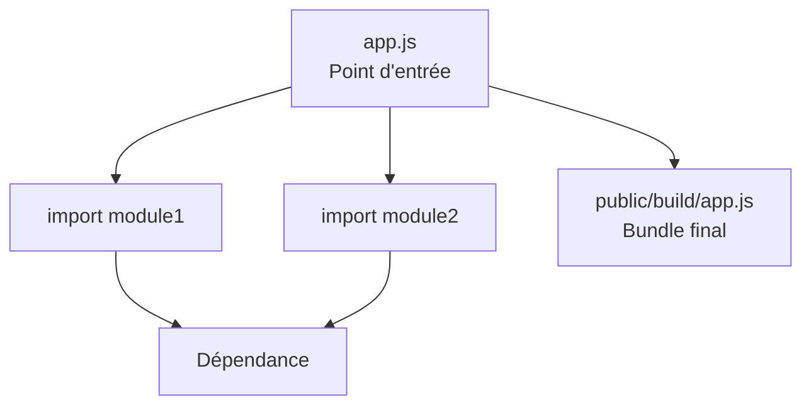

---
tags:
  - JavaScript
  - Symfony
  - Intermédiaire
  - Pratique
description: "Webpack Encore - Utilisation"
estimated_time: "75 min"
fiche_number: 3
total_fiches: 7
cursus: "JavaScript"
---

# 03 - Webpack Encore : Utilisation au quotidien

> **En bref** : À la fin de cette fiche, tu sauras utiliser Webpack Encore au quotidien : importer des fichiers CSS/JS, utiliser des packages npm, gérer les images et compiler pour la production. Lecture estimée : 75 min.


## Prérequis

- Avoir lu la fiche **[02 - Webpack Encore - Installation](02-webpack-encore-installation.md)**
- Avoir un projet Symfony avec Webpack Encore installé et fonctionnel
- Connaître les bases du HTML et du CSS
- Connaître les bases de JavaScript (variables, fonctions, modules)

## Version utilisée dans cette fiche

| Technologie | Version |
| ----------- | ------- |
| Symfony | 7.4 LTS |
| Node.js | 22 LTS |
| Webpack Encore | 4.x |

## Objectif de cette fiche

À la fin de cette fiche, tu sauras utiliser Webpack Encore au quotidien : importer des fichiers CSS/JS, utiliser des packages npm, gérer les images et compiler pour la production.

---

> **Contexte 2025-2026** : Webpack Encore est couvert ici car il est très présent dans les projets Symfony existants. Les nouveaux projets Symfony 6.3+ utilisent **AssetMapper** par défaut (pas de bundler, import maps navigateur). Les concepts de cette fiche (organisation des assets, imports CSS/JS, compilation prod) restent utiles pour comprendre la gestion des ressources frontend, quelle que soit l'approche choisie.

---

## Concepts

Cette section explique tous les concepts nécessaires. Lis-la entièrement avant de passer aux étapes pratiques.

### Qu'est-ce qu'un point d'entrée (entry point) ?

**Définition** : Un point d'entrée est un fichier JavaScript principal que Webpack Encore utilise comme point de départ pour construire un bundle. Depuis ce fichier, Encore suit tous les `import` pour inclure automatiquement le CSS, le JS et les autres ressources nécessaires.

**Le problème que les points d'entrée résolvent** :

Sans points d'entrée, voici les problèmes rencontrés :

1. **Chargement inutile** : Toutes les pages chargent tous les fichiers CSS et JS, même ceux dont elles n'ont pas besoin.
2. **Pas de dépendances automatiques** : Tu dois manuellement lister chaque fichier CSS et JS dans le HTML.
3. **Ordre de chargement fragile** : Un fichier JS qui dépend d'un autre peut échouer si l'ordre des balises `<script>` est incorrect.

**Comment les points d'entrée résolvent ces problèmes** :

| Problème | Solution apportée par les points d'entrée |
| -------- | ----------------------------------------- |
| Chargement inutile | Chaque page charge uniquement son propre bundle |
| Pas de dépendances automatiques | Un `import` dans le JS suffit à inclure un fichier CSS ou JS |
| Ordre de chargement fragile | Webpack résout automatiquement l'ordre des dépendances |

**Analogie concrète** : Imagine un carton de déménagement par pièce. Le carton "Cuisine" contient uniquement les ustensiles. Le carton "Salle de bain" contient uniquement les serviettes. Chaque pièce (page) reçoit uniquement son carton (bundle).

---

### Qu'est-ce qu'un préprocesseur CSS ?

**Définition** : Un préprocesseur CSS est un outil qui étend la syntaxe du CSS avec des fonctionnalités supplémentaires (variables, imbrication, mixins). Le code est ensuite compilé en CSS standard que le navigateur comprend.

**Le problème que les préprocesseurs résolvent** :

| Problème sans Sass | Solution apportée par Sass |
| ------------------ | -------------------------- |
| Répétition de valeurs (`#3498db` copié 50 fois) | Variables : `$primary: #3498db;` |
| Sélecteurs longs répétés | Imbrication : écrire les enfants à l'intérieur du parent |
| Pas de réutilisation | Mixins : blocs de styles réutilisables avec paramètres |

**Analogie concrète** : Imagine que tu rédiges un contrat. Sans préprocesseur, tu écris le nom complet du client à chaque mention. Avec Sass, tu définis une abréviation ("le Client") et tu l'utilises partout. Le document final contient le nom complet, mais tu n'as écrit l'abréviation qu'une fois.

---

### Qu'est-ce que le versioning et les source maps ?

**Versioning** : Ajoute un hash au nom des fichiers compilés (`app.abc123.js` au lieu de `app.js`). Ce hash change à chaque modification, ce qui force le navigateur à télécharger la nouvelle version au lieu de garder l'ancienne en cache.

**Source maps** : Fichier qui fait le lien entre le code compilé (minifié) et le code source original. Permet au navigateur d'afficher ton code original dans les outils de développement.

**Analogie concrète** : Le versioning, c'est comme dater un journal ("journal-17mars.pdf") pour que le kiosque sache que c'est une nouvelle édition. La source map, c'est comme une table de correspondance entre un livre traduit et son original.

---

## Étapes Pratiques

### Étape 1 : Comprendre la structure des assets

```text
projet-symfony/
├── assets/                 # Fichiers source (tu travailles ici)
│   ├── app.js              # Point d'entrée principal
│   ├── styles/
│   │   └── app.css         # Feuille de styles principale
│   └── images/
│       └── logo.png
├── public/
│   └── build/              # Fichiers compilés (généré, ne pas modifier)
├── webpack.config.js       # Configuration Webpack Encore
└── package.json            # Dépendances npm
```

**Règle** : Tu ne modifies jamais `public/build/`. Ce dossier est généré automatiquement. Tu travailles uniquement dans `assets/`.

---

### Étape 2 : Importer un fichier CSS dans le JavaScript

```javascript
// assets/app.js

// Importer le fichier CSS principal
// Webpack détecte l'extension .css et l'inclut dans le bundle CSS
import './styles/app.css';

console.log('Application chargée.');
```

```css
/* assets/styles/app.css */

body {
    font-family: Arial, sans-serif;
    margin: 0;
    padding: 20px;
    background-color: #f5f5f5;
}

h1 {
    color: #2c3e50;
    border-bottom: 2px solid #3498db;
    padding-bottom: 10px;
}
```

**Explication** : `import './styles/app.css'` dans un fichier JS indique à Webpack d'inclure ce CSS dans le bundle final. Il sera disponible dans Twig via `{{ encore_entry_link_tags('app') }}`.

---

### Étape 3 : Importer des modules JavaScript

Le diagramme suivant montre comment Webpack Encore résout les imports depuis le point d'entrée pour construire le bundle final.



Crée un module réutilisable :

```javascript
// assets/scripts/utils.js

// Export nommé : importé avec { accolades }
export function formatPrice(amount) {
    return amount.toFixed(2) + ' €';
}

// Export par défaut : importé sans accolades
export default function capitalize(text) {
    return text.charAt(0).toUpperCase() + text.slice(1);
}
```

Utilise ces fonctions dans le fichier principal :

```javascript
// assets/app.js

import './styles/app.css';
import { formatPrice } from './scripts/utils';  // Import nommé
import capitalize from './scripts/utils';        // Import par défaut

console.log(formatPrice(29.9));    // "29.90 €"
console.log(capitalize('bonjour')); // "Bonjour"
```

**Règle sur les imports** :

| Type d'import | Syntaxe | Quand l'utiliser |
| ------------- | ------- | ---------------- |
| Import nommé | `import { fn } from './module'` | Le module exporte plusieurs choses |
| Import par défaut | `import nom from './module'` | Le module a un export principal |
| Import CSS | `import './fichier.css'` | Inclure un fichier CSS dans le bundle |

---

### Étape 4 : Configurer plusieurs points d'entrée

Ouvre `webpack.config.js` à la racine du projet :

```javascript
// webpack.config.js

const Encore = require('@symfony/webpack-encore');

Encore
    .setOutputPath('public/build/')
    .setPublicPath('/build')

    // Un point d'entrée par type de page
    .addEntry('app', './assets/app.js')
    .addEntry('admin', './assets/admin.js')

    .splitEntryChunks()
    .enableSingleRuntimeChunk()
;

module.exports = Encore.getWebpackConfig();
```

```javascript
// assets/admin.js

import './styles/admin.css';
console.log('Page admin chargée.');
```

**Utilisation dans les templates Twig** :

```twig
{# templates/base.html.twig - Toutes les pages chargent "app" #}

    {{ encore_entry_link_tags('app') }}


    {{ encore_entry_script_tags('app') }}

```

```twig
{# templates/admin/index.html.twig - La page admin ajoute ses assets #}



    {{ parent() }}
    {{ encore_entry_link_tags('admin') }}



    {{ parent() }}
    {{ encore_entry_script_tags('admin') }}

```

**Règle** : Utilise `{{ parent() }}` pour conserver les assets du layout parent. Sans `{{ parent() }}`, le CSS/JS commun disparaît.

---

### Étape 5 : Ajouter Sass comme préprocesseur CSS

**Étape 5a** : Installe le loader Sass :

```bash
npm install sass-loader sass --save-dev
```

**Étape 5b** : Active Sass dans `webpack.config.js` :

```javascript
// webpack.config.js (extrait)

Encore
    // ... configuration existante ...

    // Activer Sass/SCSS
    .enableSassLoader()
;
```

**Étape 5c** : Renomme ton fichier CSS et mets à jour l'import :

```bash
mv assets/styles/app.css assets/styles/app.scss
```

```javascript
// assets/app.js - L'extension change de .css à .scss
import './styles/app.scss';
```

**Étape 5d** : Utilise les fonctionnalités Sass :

```css
/* assets/styles/app.scss */

/* Variables réutilisables */
$primary-color: #3498db;
$font-stack: Arial, sans-serif;

body {
    font-family: $font-stack;
    padding: 20px;
}

/* Imbrication des sélecteurs */
h1 {
    color: $primary-color;

    /* Équivaut à "h1 span" */
    span {
        font-size: 0.8em;
    }
}
```

---

### Étape 6 : Gérer les images et les polices

**Copier des fichiers statiques avec `copyFiles()`** dans `webpack.config.js` :

```javascript
// webpack.config.js (extrait)

Encore
    // ... configuration existante ...

    // Copier les images vers public/build/images/
    .copyFiles({
        from: './assets/images',
        to: 'images/[path][name].[hash:8].[ext]',
    })
;
```

Le pattern `[name].[hash:8].[ext]` transforme `logo.png` en `logo.a1b2c3d4.png` (le hash change quand le fichier change).

**Référencer une image dans Sass** :

```css
/* assets/styles/app.scss */

.hero {
    /* Webpack résout automatiquement le chemin relatif */
    background-image: url('../images/hero-bg.jpg');
    background-size: cover;
}
```

---

### Étape 7 : Utiliser des packages npm

**Étape 7a** : Installer les packages :

```bash
npm install bootstrap
npm install chart.js
```

**Étape 7b** : Importer Bootstrap dans le Sass :

```css
/* assets/styles/app.scss */

/* Importer Bootstrap depuis node_modules/ */
/* Pas de ./ : Webpack cherche automatiquement dans node_modules/ */
@import "bootstrap/scss/bootstrap";

/* Tes styles personnalisés APRÈS Bootstrap (pour les surcharger) */
body {
    padding: 20px;
}
```

**Étape 7c** : Importer un package JS (exemple Chart.js) :

```javascript
// assets/scripts/charts.js

import { Chart, registerables } from 'chart.js';
Chart.register(...registerables);

export function initCharts() {
    const canvas = document.getElementById('myChart');
    if (!canvas) { return; }

    new Chart(canvas, { type: 'bar', data: {
        labels: ['Janvier', 'Février', 'Mars'],
        datasets: [{ label: 'Ventes', data: [12, 19, 3] }],
    }});
}
```

**Règle** : `npm install` = télécharger dans `node_modules/`. `import` = utiliser dans ton code. Les deux sont nécessaires.

---

### Étape 8 : Compiler pour le développement (`watch`)

```bash
# Compiler une fois
npm run dev

# Compiler automatiquement à chaque modification de fichier
npm run watch
```

`npm run watch` surveille les fichiers dans `assets/` et recompile automatiquement à chaque sauvegarde.

**Règle** : Laisse `npm run watch` tourner dans un terminal dédié pendant que tu développes. Utilise un second terminal pour tes commandes Symfony.

---

### Étape 9 : Compiler pour la production (`build`)

```bash
npm run build
```

**Différences entre `dev` et `build`** :

| Aspect | `npm run dev` | `npm run build` |
| ------ | ------------- | --------------- |
| Minification | Non | Oui (fichiers compressés) |
| Source maps | Oui (pour déboguer) | Non (par défaut) |
| Versioning | Non | Oui (hash dans les noms) |
| Taille des fichiers | Plus gros | Optimisé |

---

### Étape 10 : Configurer les helpers Encore

Voici une configuration complète de `webpack.config.js` :

```javascript
// webpack.config.js

const Encore = require('@symfony/webpack-encore');

Encore
    .setOutputPath('public/build/')
    .setPublicPath('/build')

    // Points d'entrée
    .addEntry('app', './assets/app.js')
    .addEntry('admin', './assets/admin.js')

    // Extraire le code partagé dans des fichiers séparés
    .splitEntryChunks()
    .enableSingleRuntimeChunk()

    // Source maps en développement uniquement
    .enableSourceMaps(!Encore.isProduction())

    // Versioning en production uniquement (hash dans les noms)
    .enableVersioning(Encore.isProduction())

    // Sass
    .enableSassLoader()

    // Images
    .copyFiles({
        from: './assets/images',
        to: 'images/[path][name].[hash:8].[ext]',
    })
;

module.exports = Encore.getWebpackConfig();
```

**Récapitulatif des helpers** :

| Helper | Rôle |
| ------ | ---- |
| `.enableSourceMaps(bool)` | Génère les fichiers `.map` pour le débogage |
| `.enableVersioning(bool)` | Ajoute un hash aux noms de fichiers (cache busting) |
| `.splitEntryChunks()` | Extrait le code partagé entre entry points |
| `.enableSingleRuntimeChunk()` | Crée un fichier runtime partagé |
| `.enableSassLoader()` | Active la compilation Sass → CSS |
| `.copyFiles({})` | Copie des fichiers statiques vers `public/build/` |

**Règle** : `Encore.isProduction()` retourne `true` avec `npm run build` et `false` avec `npm run dev`/`watch`.

---

## Commandes Utiles

| Commande | Action |
| -------- | ------ |
| `npm run dev` | Compile une fois en mode développement |
| `npm run watch` | Compile et surveille les modifications en continu |
| `npm run build` | Compile en mode production (minifié, versionné) |
| `npm install <package>` | Installe un package npm |
| `npm install <package> --save-dev` | Installe un package de développement |

---

## Pièges Fréquents

### Piège 1 : Oublier de relancer `watch` après une modification de la config

**Problème** : Tu modifies `webpack.config.js` mais les changements ne prennent pas effet.

**Cause** : `npm run watch` lit `webpack.config.js` une seule fois au démarrage.

**Solution** : Arrête `watch` avec Ctrl+C, puis relance `npm run watch`.

---

### Piège 2 : Import CSS sans le `./` relatif

**Problème** : Erreur "Module not found".

```javascript
// ❌ Incorrect : cherche dans node_modules/
import 'styles/app.css';

// ✅ Correct : cherche dans le dossier courant (assets/)
import './styles/app.css';
```

**Règle** : `./` = relatif au fichier actuel. Sans préfixe = `node_modules/`.

---

### Piège 3 : Oublier `{{ parent() }}` dans un template enfant

**Problème** : Le CSS/JS commun disparaît sur certaines pages.

```twig
{# ❌ Remplace le bloc : le CSS de "app" disparaît #}

    {{ encore_entry_link_tags('admin') }}


{# ✅ Garde le CSS parent et ajoute celui de "admin" #}

    {{ parent() }}
    {{ encore_entry_link_tags('admin') }}

```

---

### Piège 4 : Installer un package sans l'importer

**Problème** : Tu as fait `npm install bootstrap` mais Bootstrap ne s'applique pas.

**Cause** : `npm install` télécharge le package, mais Webpack ne l'inclut que si tu l'importes.

**Solution** : Ajoute l'import dans ton fichier JS ou SCSS :

```css
/* assets/styles/app.scss */
@import "bootstrap/scss/bootstrap";
```

---

### Piège 5 : Fichiers compilés dans Git

**Problème** : Le dossier `public/build/` est versionné et crée des conflits.

**Solution** : Vérifie que `.gitignore` contient :

```text
/public/build/
/node_modules/
```

---

## Checklist de Validation

- [ ] Je sais importer un fichier CSS dans un fichier JS avec `import './styles/app.css'`
- [ ] Je sais importer des fonctions depuis un module JS avec `import { fn } from './module'`
- [ ] Je sais configurer plusieurs points d'entrée dans `webpack.config.js`
- [ ] Je sais activer Sass avec `.enableSassLoader()`
- [ ] Je sais gérer les images avec `.copyFiles()`
- [ ] Je sais installer et importer un package npm
- [ ] Je sais utiliser `npm run watch` et `npm run build`
- [ ] Je comprends le rôle des source maps et du versioning
- [ ] Je sais configurer `.enableSourceMaps()`, `.enableVersioning()` et `.splitEntryChunks()`

---

## Exercice Pratique

**Énoncé** : Configure un projet avec deux points d'entrée (public et admin), Sass, et un module JS partagé.

**Spécifications** :

1. Deux points d'entrée dans `webpack.config.js` : `app` et `admin`
2. `app` importe un fichier `app.scss` avec une variable `$primary` et des styles de base
3. `admin` importe un fichier `admin.scss` avec un fond sombre et un style `.dashboard`
4. Crée un module `assets/scripts/greeting.js` exportant `displayGreeting(name)` qui affiche un message dans un élément `#greeting`
5. Importe et utilise cette fonction dans `assets/admin.js`
6. Active Sass, source maps (dev), versioning (production) et `splitEntryChunks()`

**Résultat attendu** : Après `npm run dev`, `public/build/` contient les fichiers compilés pour les deux points d'entrée.

---

## Solution de l'Exercice

> **Note** : Essaie d'abord de résoudre l'exercice par toi-même avant de consulter cette solution.

---

**Fichier `webpack.config.js`** :

```javascript
const Encore = require('@symfony/webpack-encore');

Encore
    .setOutputPath('public/build/')
    .setPublicPath('/build')
    .addEntry('app', './assets/app.js')
    .addEntry('admin', './assets/admin.js')
    .splitEntryChunks()
    .enableSingleRuntimeChunk()
    .enableSassLoader()
    .enableSourceMaps(!Encore.isProduction())
    .enableVersioning(Encore.isProduction())
;

module.exports = Encore.getWebpackConfig();
```

**Fichier `assets/app.js`** :

```javascript
import './styles/app.scss';
console.log('Site public chargé.');
```

**Fichier `assets/admin.js`** :

```javascript
import './styles/admin.scss';
import { displayGreeting } from './scripts/greeting';

document.addEventListener('DOMContentLoaded', function () {
    displayGreeting('Administrateur');
});
```

**Fichier `assets/styles/app.scss`** :

```css
$primary: #3498db;

body {
    font-family: Arial, sans-serif;
    padding: 20px;
    background-color: #f5f5f5;
}

h1 {
    color: $primary;
}
```

**Fichier `assets/styles/admin.scss`** :

```css
$admin-bg: #2c3e50;
$admin-text: #ecf0f1;

body {
    background-color: $admin-bg;
    color: $admin-text;
}

.dashboard {
    max-width: 1200px;
    margin: 0 auto;
    padding: 30px;
}
```

**Fichier `assets/scripts/greeting.js`** :

```javascript
export function displayGreeting(name) {
    const element = document.getElementById('greeting');
    if (!element) {
        console.warn('Élément #greeting introuvable.');
        return;
    }
    element.textContent = 'Bienvenue, ' + name + ' !';
}
```

**Compilation** :

```bash
npm install sass-loader sass --save-dev && npm run dev
```

---

## Navigation

← Fiche précédente : **[02 - Webpack Encore - Installation](02-webpack-encore-installation.md)**

→ Fiche suivante : **[04 - Introduction à jQuery](04-introduction-jquery.md)**
