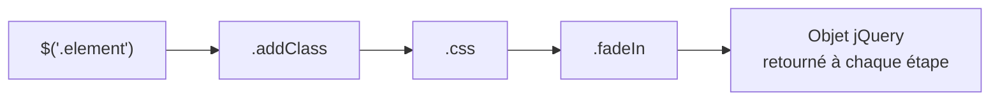

---
tags:
  - JavaScript
  - Débutant
  - Pratique
description: "Introduction à jQuery"
estimated_time: "65 min"
fiche_number: 4
total_fiches: 7
cursus: "JavaScript"
---

# 04 - Introduction à jQuery

> **En bref** : À la fin de cette fiche, tu sauras utiliser jQuery pour sélectionner des éléments HTML, manipuler le DOM, gérer les événements et créer des animations simples. Lecture estimée : 65 min.


## Prérequis

- Avoir lu la fiche **[03 - Webpack Encore - Utilisation](03-webpack-encore-utilisation.md)**
- Avoir lu la fiche **[03 - Manipulation du DOM](../epitech/05-javascript/03-dom-manipulation.md)**
- Avoir lu la fiche **[04 - Les événements](../epitech/05-javascript/04-evenements.md)**
- Savoir utiliser `document.querySelector()` et `addEventListener()` en JavaScript

## Version utilisée dans cette fiche

| Technologie | Version |
| ----------- | ------- |
| jQuery | 3.7.x (LTS de fait) |
| Node.js | 22 LTS |

> **Note jQuery 4** : jQuery 4.0.0 a été publié en janvier 2026. Il introduit des ruptures de compatibilité (suppression de méthodes dépréciées comme `.live()`, `.die()`, `.size()`). jQuery 3.7.x reste la version de référence de cette fiche et est maintenu en sécurité. Pour un nouveau projet, vérifie la compatibilité des plugins avant de passer à jQuery 4.

## Objectif de cette fiche

À la fin de cette fiche, tu sauras utiliser jQuery pour sélectionner des éléments HTML, manipuler le DOM, gérer les événements et créer des animations simples.

---

## Concepts

Cette section explique tous les concepts nécessaires. Lis-la entièrement avant de passer aux étapes pratiques.

### Qu'est-ce que jQuery ?

**Définition** : jQuery est une bibliothèque JavaScript qui simplifie la manipulation du DOM, la gestion des événements et les animations. Elle fournit des fonctions courtes et lisibles pour remplacer le code JavaScript natif souvent plus verbeux.

**Le problème que jQuery résout** :

Sans jQuery, voici les problèmes rencontrés :

1. **Code verbeux** : Sélectionner et manipuler des éléments en JavaScript natif demande beaucoup de code répétitif.
2. **Compatibilité navigateurs** : Historiquement, chaque navigateur avait ses propres particularités. jQuery uniformise le comportement.
3. **Chaînage impossible** : En JavaScript natif, chaque opération nécessite une ligne séparée. Impossible d'enchaîner les actions sur un même élément.

**Comment jQuery résout ces problèmes** :

| Problème | Solution apportée par jQuery |
| -------- | ---------------------------- |
| Code verbeux | Syntaxe courte : `$('#id')` au lieu de `document.getElementById('id')` |
| Compatibilité navigateurs | jQuery gère les différences entre navigateurs en interne |
| Chaînage impossible | Chaque méthode jQuery retourne l'objet jQuery, permettant le chaînage |

**Analogie concrète** : Imagine que tu veux envoyer une lettre. En JavaScript natif, tu dois : acheter une enveloppe, écrire l'adresse, coller le timbre, trouver la boîte aux lettres, poster la lettre. Avec jQuery, tu utilises un service tout-en-un : tu donnes la lettre et l'adresse, le service s'occupe du reste.

**Ce que jQuery n'est PAS** :

- jQuery n'est pas un framework (comme React ou Angular). C'est une simple bibliothèque d'utilitaires.
- jQuery n'est pas obligatoire. JavaScript natif peut tout faire. jQuery rend le code plus court.

> **Note** : jQuery inclut aussi une API AJAX (`$.ajax()`, `$.get()`, `$.post()`) présentée dans la fiche suivante. Ces méthodes retournent des objets Deferred compatibles Promises depuis jQuery 1.5.

---

### La fonction `$()`

**Définition** : `$()` est la fonction principale de jQuery. C'est un raccourci pour `jQuery()`. Elle sert à sélectionner des éléments HTML, créer des éléments ou attendre que le DOM soit prêt.

**Trois utilisations de `$()`** :

| Utilisation | Exemple | Résultat |
| ----------- | ------- | -------- |
| Sélectionner un élément | `$('#menu')` | Sélectionne l'élément avec l'id `menu` |
| Créer un élément | `$('<p>Texte</p>')` | Crée un nouveau paragraphe |
| Attendre le DOM | `$(function() { ... })` | Exécute le code quand le DOM est prêt |

**Ce que `$()` retourne** :

`$()` retourne toujours un **objet jQuery**, jamais un élément DOM natif. Cet objet jQuery est une collection qui peut contenir zéro, un ou plusieurs éléments. Utilise `.length` pour vérifier combien d'éléments ont été trouvés.

---

### Les sélecteurs jQuery

**Définition** : Les sélecteurs jQuery utilisent la même syntaxe que les sélecteurs CSS. Si tu sais écrire un sélecteur CSS, tu sais écrire un sélecteur jQuery.

**Les sélecteurs de base** :

| Sélecteur | Syntaxe jQuery | Ce qu'il sélectionne |
| --------- | -------------- | -------------------- |
| Par id | `$('#monId')` | L'élément unique avec cet id |
| Par classe | `$('.maClasse')` | Tous les éléments avec cette classe |
| Par balise | `$('p')` | Toutes les balises `<p>` |
| Multiple | `$('h1, h2, h3')` | Tous les `<h1>`, `<h2>` et `<h3>` |
| Descendant | `$('.card p')` | Tous les `<p>` à l'intérieur d'un `.card` |
| Enfant direct | `$('.card > p')` | Les `<p>` enfants directs de `.card` |
| Attribut | `$('input[type="text"]')` | Les `<input>` de type `text` |

---

## Étapes Pratiques

### Étape 1 : Installer jQuery avec npm

Dans le terminal, à la racine de ton projet Symfony :

```bash
# Installe jQuery et l'enregistre comme dépendance du projet
npm install jquery
```

**Résultat attendu** :

```text
added 1 package in 1s
```

---

### Étape 2 : Importer jQuery dans ton fichier JavaScript

Ouvre ton fichier JavaScript principal (par exemple `assets/app.js`) et ajoute l'import :

```javascript
// Importe jQuery depuis node_modules
import $ from 'jquery';

// Vérifie que jQuery est bien chargé
console.log('jQuery version :', $.fn.jquery);
```

Compile avec Webpack Encore (`npm run dev`), puis ouvre la console du navigateur. Tu dois voir :

```text
jQuery version : 3.7.1
```

---

### Étape 3 : Attendre que le DOM soit prêt

Le code jQuery doit s'exécuter **après** que le navigateur a fini de construire le DOM. Sinon, les éléments que tu veux sélectionner n'existent pas encore.

```javascript
import $ from 'jquery';

// Méthode recommandée : fonction courte
$(function() {
    // Ce code s'exécute quand le DOM est prêt
    console.log('DOM prêt !');
});
```

**Syntaxe longue équivalente** : `$(document).ready(function() { ... })`. Les deux formes font exactement la même chose. La forme courte est préférée.

**Comparaison avec JavaScript natif** :

```javascript
// En JavaScript natif, l'équivalent est :
document.addEventListener('DOMContentLoaded', function() {
    console.log('DOM prêt !');
});
```

---

### Étape 4 : Sélectionner des éléments

Voici le HTML utilisé dans les exemples suivants :

```html
<h1 id="titre">Bienvenue</h1>
<p class="intro">Premier paragraphe</p>
<p class="intro">Deuxième paragraphe</p>
<ul id="liste">
    <li>Élément 1</li>
    <li>Élément 2</li>
    <li>Élément 3</li>
</ul>
<input type="text" id="champNom" value="Jean">
<button id="btnAction">Cliquer</button>
```

```javascript
import $ from 'jquery';

$(function() {
    // Sélection par id : un seul élément
    let titre = $('#titre');
    console.log('Titre trouvé :', titre.length); // 1

    // Sélection par classe : plusieurs éléments
    let intros = $('.intro');
    console.log('Paragraphes .intro :', intros.length); // 2

    // Sélection par balise : tous les <li>
    let items = $('li');
    console.log('Éléments de liste :', items.length); // 3

    // Sélection combinée : les <li> à l'intérieur de #liste
    let itemsListe = $('#liste li');
    console.log('Items dans #liste :', itemsListe.length); // 3
});
```

---

### Étape 5 : Manipuler le contenu

jQuery fournit des méthodes pour lire et modifier le contenu des éléments.

```javascript
$(function() {
    // .text() - Lire ou modifier le texte (sans HTML)
    let texte = $('#titre').text(); // Lit : "Bienvenue"
    $('#titre').text('Nouveau titre'); // Modifie le texte

    // .html() - Lire ou modifier le contenu HTML
    let html = $('#titre').html(); // Lit le HTML interne
    $('#titre').html('Titre en <em>italique</em>'); // Injecte du HTML

    // .val() - Lire ou modifier la valeur d'un champ de formulaire
    let nom = $('#champNom').val(); // Lit : "Jean"
    $('#champNom').val('Marie'); // Modifie la valeur

    // .attr() - Lire ou modifier un attribut HTML
    let type = $('#champNom').attr('type'); // Lit : "text"
    $('#champNom').attr('placeholder', 'Ton prénom'); // Ajoute un attribut
});
```

**Règle importante** : quand tu appelles une méthode **sans argument**, elle **lit** la valeur. Quand tu passes un argument, elle **modifie** la valeur.

---

### Étape 6 : Modifier le style et les classes CSS

```javascript
$(function() {
    // .css() - Modifier une propriété CSS directement
    $('#titre').css('color', 'blue');

    // .css() avec un objet pour plusieurs propriétés à la fois
    $('#titre').css({ 'color': 'blue', 'font-size': '2rem' });

    // .addClass() - Ajouter une classe CSS
    $('#titre').addClass('text-primary');

    // .removeClass() - Retirer une classe CSS
    $('#titre').removeClass('text-primary');

    // .toggleClass() - Ajouter si absente, retirer si présente
    $('#titre').toggleClass('active');
});
```

**Bonne pratique** : préfère `.addClass()` / `.removeClass()` à `.css()`. Les classes CSS sont définies dans ta feuille de style et sont plus faciles à maintenir.

---

### Étape 7 : Créer et supprimer des éléments

```javascript
$(function() {
    // .append() - Ajouter un élément à la FIN du contenu
    $('#liste').append('<li>Nouvel élément à la fin</li>');

    // .prepend() - Ajouter un élément au DÉBUT du contenu
    $('#liste').prepend('<li>Nouvel élément au début</li>');

    // .remove() - Supprimer un élément du DOM
    $('.intro').remove(); // Supprime tous les paragraphes .intro

    // .empty() - Vider le contenu d'un élément (sans supprimer l'élément)
    $('#liste').empty(); // La liste existe encore mais est vide : <ul id="liste"></ul>
});
```

**Différence entre `.remove()` et `.empty()`** :

| Méthode | Ce qu'elle fait | L'élément existe encore ? |
| ------- | --------------- | ------------------------- |
| `.remove()` | Supprime l'élément et son contenu | Non |
| `.empty()` | Supprime le contenu mais garde l'élément | Oui (vide) |

---

### Étape 8 : Gérer les événements

jQuery utilise `.on()` pour attacher des événements aux éléments.

```javascript
$(function() {
    // Événement clic sur un bouton
    $('#btnAction').on('click', function() {
        console.log('Bouton cliqué !');
    });

    // Événement soumission de formulaire
    $('form').on('submit', function(event) {
        // Empêche le rechargement de la page
        event.preventDefault();

        let nom = $('#champNom').val();
        console.log('Formulaire soumis avec :', nom);
    });

    // Événement changement sur un champ
    $('#champNom').on('change', function() {
        let nouvelleValeur = $(this).val();
        console.log('Nouvelle valeur :', nouvelleValeur);
    });
});
```

**`$(this)`** : dans un handler d'événement, `this` est l'élément DOM qui a déclenché l'événement. `$(this)` le convertit en objet jQuery.

---

### Étape 9 : Naviguer dans le DOM (traversing)

jQuery permet de naviguer dans l'arbre DOM à partir d'un élément sélectionné.

```html
<div class="card">
    <div class="card-body">
        <p class="description">Texte</p>
        <p class="details">Détails</p>
        <ul>
            <li>Item A</li>
            <li class="active">Item B</li>
        </ul>
    </div>
</div>
```

```javascript
$(function() {
    // .find() - Chercher un descendant (à n'importe quel niveau)
    let description = $('.card').find('.description');
    console.log(description.text()); // "Texte"

    // .closest() - Remonter vers l'ancêtre le plus proche correspondant
    let carte = $('.description').closest('.card');
    console.log(carte.length); // 1

    // .parent() - L'élément parent direct
    let body = $('.description').parent();
    console.log(body.attr('class')); // "card-body"

    // .children() - Les enfants directs
    let enfants = $('.card-body').children();
    console.log(enfants.length); // 3

    // .siblings() - Les frères et sœurs (même niveau)
    let freres = $('.description').siblings();
    console.log(freres.length); // 2
});
```

**Récapitulatif des méthodes de navigation** :

| Méthode | Direction | Portée |
| ------- | --------- | ------ |
| `.find(sel)` | Vers le bas | Tous les descendants |
| `.children()` | Vers le bas | Enfants directs uniquement |
| `.parent()` | Vers le haut | Parent direct uniquement |
| `.closest(sel)` | Vers le haut | Premier ancêtre correspondant |
| `.siblings()` | Horizontal | Tous les frères/sœurs |

---

### Étape 10 : Afficher, masquer et animer

```javascript
$(function() {
    // .hide() - Masquer un élément (display: none)
    $('#titre').hide();

    // .show() - Afficher un élément
    $('#titre').show();

    // .toggle() - Alterner entre affiché et masqué
    $('#btnAction').on('click', function() {
        $('#titre').toggle();
    });

    // .fadeIn() / .fadeOut() - Apparition/disparition progressive
    $('#titre').fadeIn(500);   // Apparaît en 500ms
    $('#titre').fadeOut(1000); // Disparaît en 1000ms

    // .slideDown() / .slideUp() - Apparition/disparition par glissement
    $('#liste').slideDown();
    $('#liste').slideUp();
});
```

**Durées prédéfinies** :

| Valeur | Durée |
| ------ | ----- |
| `'fast'` | 200 ms |
| `'slow'` | 600 ms |
| Nombre | Durée exacte en ms |

---

### Étape 11 : Chaîner les méthodes

Le diagramme suivant illustre le principe du chaînage : chaque méthode retourne l'objet jQuery, ce qui permet d'enchaîner les appels.



Chaque méthode jQuery retourne l'objet jQuery, ce qui permet d'enchaîner plusieurs actions sur une seule ligne.

```javascript
// Sans chaînage : répétitif
$('#titre').text('Nouveau titre');
$('#titre').addClass('text-primary');
$('#titre').css('font-size', '2rem');
$('#titre').fadeIn();

// Avec chaînage : une seule instruction
$('#titre')
    .text('Nouveau titre')
    .addClass('text-primary')
    .css('font-size', '2rem')
    .fadeIn();
```

Le chaînage fonctionne parce que chaque méthode retourne le même objet jQuery.

**Limite du chaînage** : les méthodes qui **lisent** une valeur (sans argument) retournent la valeur lue, pas l'objet jQuery. Elles cassent la chaîne.

```javascript
// Ceci NE fonctionne PAS :
$('#titre').text().addClass('active');
// .text() sans argument retourne une chaîne → impossible d'appeler .addClass()
```

---

## Commandes Utiles

| Commande | Action |
| -------- | ------ |
| `npm install jquery` | Installe jQuery dans le projet |
| `npm run dev` | Compile les assets avec Webpack Encore |
| `npm run watch` | Compile et surveille les changements en continu |
| `console.log($.fn.jquery)` | Affiche la version de jQuery chargée |
| `console.log($('#el').length)` | Vérifie si un élément existe (0 = non trouvé) |

---

## Pièges Fréquents

### Piège 1 : Oublier d'importer jQuery

**Problème** : Tu utilises `$()` dans ton code mais jQuery n'est pas importé. Le navigateur affiche une erreur.

```text
Uncaught ReferenceError: $ is not defined
```

**Solution** : Ajoute l'import en haut de ton fichier JavaScript.

```javascript
// Toujours importer jQuery en premier
import $ from 'jquery';
```

---

### Piège 2 : Manipuler le DOM avant qu'il soit prêt

**Problème** : Tu essaies de sélectionner un élément qui n'existe pas encore car le script s'exécute avant que le navigateur ait fini de construire la page.

```javascript
// Ce code peut échouer si le <h1> n'existe pas encore
import $ from 'jquery';
$('#titre').text('Changé'); // Ne fait rien si #titre n'existe pas encore
```

**Solution** : Entoure ton code avec `$(function() { ... })`.

```javascript
import $ from 'jquery';

$(function() {
    // Le DOM est prêt, tous les éléments existent
    $('#titre').text('Changé');
});
```

---

### Piège 3 : Confondre objet jQuery et élément DOM natif

**Problème** : Tu essaies d'utiliser une méthode jQuery sur un élément DOM natif, ou inversement.

```javascript
// Élément DOM natif - PAS un objet jQuery
let element = document.querySelector('#titre');
element.text('Test'); // ERREUR : .text() n'existe pas sur un élément DOM

// Objet jQuery - PAS un élément DOM natif
let $element = $('#titre');
$element.textContent = 'Test'; // Ne fonctionne pas : textContent n'est pas une méthode jQuery
```

**Solution** : Convertis entre les deux formats.

```javascript
// DOM natif → jQuery : entoure avec $()
let element = document.querySelector('#titre');
$(element).text('Test'); // Fonctionne

// jQuery → DOM natif : utilise [0] ou .get(0)
let $element = $('#titre');
$element[0].textContent = 'Test'; // Fonctionne
$element.get(0).textContent = 'Test'; // Fonctionne aussi
```

---

### Piège 4 : Utiliser `.on()` sur des éléments ajoutés dynamiquement

**Problème** : Tu ajoutes un élément au DOM après avoir attaché l'événement. Le nouvel élément ne réagit pas aux clics.

```javascript
$(function() {
    // Attache l'événement aux <li> existants
    $('li').on('click', function() {
        console.log('Cliqué :', $(this).text());
    });

    // Ajoute un nouveau <li> après
    $('#liste').append('<li>Nouvel item</li>');
    // Le nouvel item NE réagit PAS au clic
});
```

**Solution** : Utilise la délégation d'événement en passant un sélecteur en deuxième argument de `.on()`.

```javascript
$(function() {
    // Délégation : l'événement est attaché à #liste
    // mais ne se déclenche que pour les <li> à l'intérieur
    $('#liste').on('click', 'li', function() {
        console.log('Cliqué :', $(this).text());
    });

    // Les <li> ajoutés après fonctionnent aussi
    $('#liste').append('<li>Nouvel item</li>');
});
```

---

### Piège 5 : Nommer les variables jQuery sans le préfixe `$`

**Problème** : Sans convention de nommage, tu ne sais plus si une variable contient un objet jQuery ou un élément DOM natif.

**Solution** : Préfixe les variables jQuery avec `$` par convention.

```javascript
// Convention recommandée
let $titre = $('#titre');        // Objet jQuery → préfixe $
let titreDOM = $titre[0];       // Élément DOM natif → pas de préfixe $
let nom = $('#champNom').val();  // Chaîne de caractères → pas de préfixe $
```

---

## Checklist de Validation

- [ ] J'ai installé jQuery avec `npm install jquery`
- [ ] J'ai importé jQuery avec `import $ from 'jquery'`
- [ ] Je sais sélectionner un élément par id, classe ou balise
- [ ] Je sais lire et modifier le contenu avec `.text()`, `.html()`, `.val()`
- [ ] Je sais ajouter et retirer des classes CSS
- [ ] Je sais créer et supprimer des éléments avec `.append()` et `.remove()`
- [ ] Je sais gérer un événement clic avec `.on('click', ...)`
- [ ] Je sais naviguer dans le DOM avec `.find()`, `.closest()`, `.parent()`
- [ ] Je sais afficher et masquer des éléments avec `.show()`, `.hide()`, `.toggle()`
- [ ] Je sais chaîner les méthodes jQuery
- [ ] Je comprends la différence entre un objet jQuery et un élément DOM natif

---

## Exercice Pratique

**Énoncé** : Crée une liste de tâches interactive avec jQuery.

Le HTML de départ :

```html
<div id="todo-app">
    <h2>Ma liste de tâches</h2>
    <form id="todo-form">
        <input type="text" id="todo-input" placeholder="Nouvelle tâche">
        <button type="submit">Ajouter</button>
    </form>
    <ul id="todo-list">
        <li>Tâche exemple <button class="btn-supprimer">X</button></li>
    </ul>
    <p id="compteur">1 tâche(s)</p>
</div>
```

**Fonctionnalités à implémenter** :

1. Quand le formulaire est soumis, ajouter la tâche saisie à la liste `#todo-list`
2. Chaque tâche ajoutée doit avoir un bouton "X" pour la supprimer
3. Cliquer sur "X" supprime la tâche (utiliser la délégation d'événement)
4. Cliquer sur le texte d'une tâche ajoute/retire la classe `done` (barre le texte)
5. Mettre à jour le compteur après chaque ajout ou suppression
6. Vider le champ de saisie après l'ajout
7. Ne pas ajouter de tâche si le champ est vide

**Indications** :

- `event.preventDefault()` pour empêcher le rechargement de la page
- `.on('click', '.btn-supprimer', ...)` sur `#todo-list` pour la délégation
- `.toggleClass('done')` pour barrer/débarrer une tâche
- `$('#todo-list li').length` pour compter les tâches

**Résultat attendu** : Une liste de tâches où tu peux ajouter, supprimer et marquer des tâches. Le compteur se met à jour automatiquement.

---

## Solution de l'Exercice

> **Note** : Cette section contient la solution complète. Essaie d'abord de résoudre l'exercice par toi-même avant de consulter cette solution.

---

Le CSS pour la classe `done` (à ajouter dans ta feuille de style) :

```css
/* Barre le texte des tâches terminées */
.done {
    text-decoration: line-through;
    color: #999;
}
```

Le code JavaScript complet :

```javascript
import $ from 'jquery';

$(function() {
    function mettreAJourCompteur() {
        let nombre = $('#todo-list li').length;
        $('#compteur').text(nombre + ' tâche(s)');
    }

    // Soumission du formulaire : ajouter une tâche
    $('#todo-form').on('submit', function(event) {
        event.preventDefault();
        let texte = $('#todo-input').val().trim();

        if (texte === '') {
            return; // Ne fait rien si le champ est vide
        }

        let nouvelleTache = $('<li>' + texte + ' <button class="btn-supprimer">X</button></li>');
        $('#todo-list').append(nouvelleTache);
        nouvelleTache.hide().fadeIn(300);
        $('#todo-input').val(''); // Vide le champ
        mettreAJourCompteur();
    });

    // Clic sur "X" : supprimer la tâche (délégation)
    $('#todo-list').on('click', '.btn-supprimer', function() {
        $(this).closest('li').fadeOut(300, function() {
            $(this).remove();
            mettreAJourCompteur();
        });
    });

    // Clic sur une tâche : marquer comme terminée (délégation)
    $('#todo-list').on('click', 'li', function(event) {
        if (!$(event.target).hasClass('btn-supprimer')) {
            $(this).toggleClass('done');
        }
    });
});
```

**Points importants** :

- **`event.preventDefault()`** empêche le rechargement de la page à la soumission du formulaire.
- **Délégation** `.on('click', '.btn-supprimer', ...)` : l'événement est sur `#todo-list`, pas sur chaque bouton. Les boutons ajoutés après fonctionnent aussi.
- **`.fadeOut(300, callback)`** : le callback s'exécute après l'animation, pour supprimer l'élément proprement.
- **`$(event.target).hasClass('btn-supprimer')`** : évite de déclencher toggleClass quand on clique sur le bouton "X".

---

## Navigation

← Fiche précédente : **[03 - Webpack Encore : Utilisation au quotidien](03-webpack-encore-utilisation.md)**

→ Fiche suivante : **[05 - jQuery et AJAX dans Symfony](05-jquery-ajax-symfony.md)**
