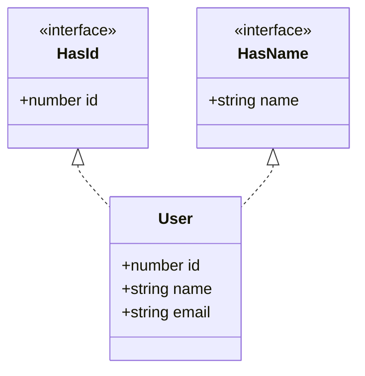

---
tags:
  - TypeScript
  - Intermédiaire
  - Concept
description: "Maîtriser les interfaces TypeScript, propriétés optionnelles, readonly, extensions et index signatures."
estimated_time: "90 min"
fiche_number: 5
total_fiches: 15
cursus: "TypeScript"
---

# 05 - Objets et interfaces

> **En bref** : Apprendre à définir la structure des objets avec les interfaces, les propriétés optionnelles, readonly, l'extension et les index signatures. Lecture estimée : 90 min.

## Prérequis

- [03 - Types primitifs et annotations](03-types-primitifs-annotations.md)
- [04 - Tableaux et tuples](04-tableaux-tuples.md)
- Connaître les objets JavaScript (propriétés, méthodes, déstructuration)

## Objectif de cette fiche

À la fin de cette fiche, tu sauras créer des interfaces pour typer des objets, utiliser les propriétés optionnelles et readonly, étendre des interfaces, et choisir entre `interface` et `type alias`.

---

## Concepts

### Qu'est-ce qu'une interface ?

**Définition** : Une interface est un contrat qui définit la structure d'un objet. Elle liste les propriétés que l'objet doit avoir, avec leur type. Un objet qui respecte une interface doit contenir **toutes** les propriétés requises, avec les bons types.

**Le problème que les interfaces résolvent** :

Sans interfaces, voici les problèmes rencontrés :

1. **Structure implicite** : Quand une fonction attend un objet, on ne sait pas quelles propriétés il doit avoir. Il faut lire le code de la fonction pour comprendre.
2. **Propriétés manquantes** : On peut oublier une propriété obligatoire lors de la création d'un objet, et l'erreur n'apparaît qu'à l'exécution.
3. **Propriétés en trop** : On peut ajouter des propriétés par erreur (faute de frappe) sans que rien ne signale le problème.

**Comment les interfaces résolvent ces problèmes** :

| Problème | Solution apportée par les interfaces |
| -------- | ------------------------------------ |
| Structure implicite | L'interface documente exactement les propriétés attendues |
| Propriétés manquantes | TypeScript refuse l'objet si une propriété obligatoire manque |
| Propriétés en trop | TypeScript signale les propriétés inconnues |

**Analogie concrète** : Une interface est comme un plan d'architecte pour une maison. Le plan dit exactement quelles pièces la maison doit contenir (salon, cuisine, salle de bain), leurs dimensions (types) et leur disposition. Si le constructeur oublie la cuisine ou ajoute une pièce qui n'est pas sur le plan, c'est une erreur.

**Ce qu'une interface n'est PAS** :

- Une interface n'est pas une classe. Elle ne contient pas de code, seulement des déclarations de propriétés et de méthodes.
- Une interface n'existe pas à l'exécution. Comme les types, elle est effacée lors de la compilation.
- Une interface n'oblige pas un objet à être créé d'une certaine façon. Elle vérifie seulement que le résultat final a la bonne structure.

---

### Qu'est-ce qu'un type alias ?

**Définition** : Un type alias (mot-clé `type`) crée un nom pour un type. Il peut nommer un type primitif, un type union, un tuple, ou un type objet. C'est une alternative à `interface` pour définir la structure d'un objet.

**Le problème que les type aliases résolvent** :

Sans type aliases, voici les problèmes rencontrés :

1. **Types complexes répétés** : Un type union comme `string | number | boolean` doit être réécrit partout où il est utilisé.
2. **Nommage des types** : Certains types n'ont pas de nom naturel. Un alias leur donne un nom lisible.

**Comment les type aliases résolvent ces problèmes** :

| Problème | Solution apportée par les type aliases |
| -------- | -------------------------------------- |
| Types complexes répétés | On définit le type une seule fois avec un nom |
| Nommage des types | Le nom rend le code plus lisible |

**Comparaison interface vs type alias** :

| Interface | Type Alias |
| --------- | ---------- |
| `interface Personne { nom: string }` | `type Personne = { nom: string }` |
| Peut être étendue avec `extends` | Peut être combinée avec `&` (intersection) |
| Peut être déclarée plusieurs fois (fusion) | Ne peut pas être redéclarée |
| Uniquement pour les objets et classes | Peut typer n'importe quoi (union, tuple, primitif) |
| Convention : structure d'objet | Convention : unions, tuples, types complexes |

---

### Qu'est-ce qu'une index signature ?

**Définition** : Une index signature permet de définir le type des propriétés dont on ne connaît pas le nom à l'avance. Elle dit : "cet objet peut avoir n'importe quelle propriété de type string, et chaque valeur sera de type X".

**Le problème que les index signatures résolvent** :

Sans index signatures, voici les problèmes rencontrés :

1. **Objets dynamiques** : Certains objets ont des propriétés ajoutées dynamiquement (dictionnaire, cache, traductions). On ne peut pas lister toutes les clés à l'avance.
2. **Données externes** : Les données provenant d'un fichier JSON ou d'une API peuvent avoir des clés variables.

**Comment les index signatures résolvent ces problèmes** :

| Problème | Solution apportée par les index signatures |
| -------- | ------------------------------------------ |
| Objets dynamiques | On définit le type des clés et des valeurs sans lister les clés |
| Données externes | On accepte n'importe quelle clé tant que la valeur est du bon type |

**Analogie concrète** : Une index signature est comme une règle pour une bibliothèque : "chaque étagère porte un nom (string) et contient des livres (Book[])". On ne liste pas chaque étagère, mais on sait ce qu'elles contiennent.

---

## Étapes Pratiques

### Étape 1 : Créer une interface de base

Crée un fichier `src/interfaces-base.ts` :

```typescript
// src/interfaces-base.ts
// Les interfaces définissent la structure des objets

// Déclaration d'une interface
interface Utilisateur {
  nom: string;
  age: number;
  email: string;
  estActif: boolean;
}

// Création d'un objet qui respecte l'interface
const alice: Utilisateur = {
  nom: "Alice",
  age: 25,
  email: "alice@exemple.fr",
  estActif: true,
};

// TypeScript vérifie que toutes les propriétés sont présentes
// et que les types sont corrects

// Erreur : propriété 'email' manquante
// const bob: Utilisateur = { nom: "Bob", age: 30, estActif: true };

// Erreur : type incorrect pour 'age'
// const charlie: Utilisateur = { nom: "Charlie", age: "25", email: "c@test.fr", estActif: true };

// Erreur : propriété inconnue 'telephone'
// const dave: Utilisateur = { nom: "Dave", age: 28, email: "d@test.fr", estActif: true, telephone: "0123456789" };

// Utilisation de l'interface dans une fonction
function afficherUtilisateur(utilisateur: Utilisateur): void {
  console.log(`${utilisateur.nom} (${utilisateur.age} ans)`);
  console.log(`  Email : ${utilisateur.email}`);
  console.log(`  Statut : ${utilisateur.estActif ? "Actif" : "Inactif"}`);
}

afficherUtilisateur(alice);

// Tableau d'objets typés avec l'interface
const utilisateurs: Utilisateur[] = [
  { nom: "Alice", age: 25, email: "alice@exemple.fr", estActif: true },
  { nom: "Bob", age: 30, email: "bob@exemple.fr", estActif: false },
  { nom: "Charlie", age: 22, email: "charlie@exemple.fr", estActif: true },
];

console.log("\nUtilisateurs actifs :");
utilisateurs
  .filter((u: Utilisateur): boolean => u.estActif)
  .forEach((u: Utilisateur): void => {
    console.log(`  - ${u.nom}`);
  });
```

Compile et exécute :

```bash
npx tsc && node dist/interfaces-base.js
```

**Résultat attendu** :

```text
Alice (25 ans)
  Email : alice@exemple.fr
  Statut : Actif

Utilisateurs actifs :
  - Alice
  - Charlie
```

---

### Étape 2 : Propriétés optionnelles et readonly

Crée un fichier `src/interfaces-options.ts` :

```typescript
// src/interfaces-options.ts
// Propriétés optionnelles (?) et en lecture seule (readonly)

interface Produit {
  // readonly : ne peut pas être modifié après la création
  readonly id: number;
  readonly reference: string;

  // Propriétés obligatoires
  nom: string;
  prix: number;

  // Propriétés optionnelles (?) : peuvent être absentes
  description?: string;
  promotion?: number; // pourcentage de réduction
  tags?: string[];
}

// Objet avec toutes les propriétés
const ordinateur: Produit = {
  id: 1,
  reference: "ORDI-001",
  nom: "Ordinateur portable",
  prix: 899.99,
  description: "Écran 15 pouces, 16 Go RAM",
  promotion: 10,
  tags: ["informatique", "bureautique"],
};

// Objet avec seulement les propriétés obligatoires
const souris: Produit = {
  id: 2,
  reference: "SOURIS-001",
  nom: "Souris sans fil",
  prix: 29.99,
  // description, promotion et tags sont optionnels
};

// readonly empêche la modification
// ordinateur.id = 3; // Erreur : Cannot assign to 'id' because it is a read-only property

// Les propriétés non-readonly peuvent être modifiées
ordinateur.prix = 799.99; // OK

// Fonction qui calcule le prix avec promotion
function calculerPrix(produit: Produit): number {
  // On doit vérifier si la promotion existe (propriété optionnelle)
  if (produit.promotion !== undefined) {
    // promotion existe : on applique la réduction
    const reduction: number = produit.prix * (produit.promotion / 100);
    return produit.prix - reduction;
  }
  // Pas de promotion : on retourne le prix normal
  return produit.prix;
}

function afficherProduit(produit: Produit): void {
  console.log(`[${produit.reference}] ${produit.nom}`);
  console.log(`  Prix : ${produit.prix} €`);

  if (produit.description !== undefined) {
    console.log(`  Description : ${produit.description}`);
  }

  if (produit.promotion !== undefined) {
    console.log(`  Promotion : -${produit.promotion}%`);
    console.log(`  Prix final : ${calculerPrix(produit)} €`);
  }

  if (produit.tags !== undefined && produit.tags.length > 0) {
    console.log(`  Tags : ${produit.tags.join(", ")}`);
  }
}

afficherProduit(ordinateur);
console.log("---");
afficherProduit(souris);
```

Compile et exécute :

```bash
npx tsc && node dist/interfaces-options.js
```

**Résultat attendu** :

```text
[ORDI-001] Ordinateur portable
  Prix : 799.99 €
  Description : Écran 15 pouces, 16 Go RAM
  Promotion : -10%
  Prix final : 719.991 €
  Tags : informatique, bureautique
---
[SOURIS-001] Souris sans fil
  Prix : 29.99 €
```

---

### Étape 3 : Extension d'interfaces

Le diagramme suivant illustre comment une classe peut implémenter plusieurs interfaces pour combiner leurs contrats.



Crée un fichier `src/interfaces-extends.ts` :

```typescript
// src/interfaces-extends.ts
// extends permet de créer une interface qui hérite d'une autre

// Interface de base
interface Animal {
  nom: string;
  age: number;
  espece: string;
}

// Interface étendue : hérite de Animal + ajoute des propriétés
interface AnimalDomestique extends Animal {
  proprietaire: string;
  vaccine: boolean;
}

// Interface qui étend AnimalDomestique + ajoute encore des propriétés
interface Chat extends AnimalDomestique {
  couleur: string;
  interieur: boolean; // vit en intérieur ou extérieur
}

// Un Chat doit avoir TOUTES les propriétés :
// celles de Animal + AnimalDomestique + Chat
const minou: Chat = {
  // De Animal
  nom: "Minou",
  age: 3,
  espece: "Felis catus",

  // De AnimalDomestique
  proprietaire: "Alice",
  vaccine: true,

  // De Chat
  couleur: "roux",
  interieur: true,
};

// Extension multiple : une interface peut étendre plusieurs interfaces
interface Identifiable {
  id: number;
}

interface Horodate {
  creeLe: Date;
  modifieLe: Date;
}

// Étend deux interfaces en même temps
interface Article extends Identifiable, Horodate {
  titre: string;
  contenu: string;
  auteur: string;
}

const article: Article = {
  // De Identifiable
  id: 1,
  // De Horodate
  creeLe: new Date("2025-01-15"),
  modifieLe: new Date("2025-01-20"),
  // De Article
  titre: "Introduction à TypeScript",
  contenu: "TypeScript est un sur-ensemble de JavaScript...",
  auteur: "Alice",
};

// Fonction qui accepte le type de base
function afficherAnimal(animal: Animal): void {
  console.log(`${animal.nom} - ${animal.espece} (${animal.age} ans)`);
}

// On peut passer un Chat car Chat étend Animal
// C'est le principe de substitution : un sous-type est compatible
afficherAnimal(minou);

function afficherArticle(article: Article): void {
  console.log(`[${article.id}] ${article.titre}`);
  console.log(`  Auteur : ${article.auteur}`);
  console.log(`  Créé le : ${article.creeLe.toLocaleDateString("fr-FR")}`);
}

afficherArticle(article);
```

Compile et exécute :

```bash
npx tsc && node dist/interfaces-extends.js
```

**Résultat attendu** :

```text
Minou - Felis catus (3 ans)
[1] Introduction à TypeScript
  Auteur : Alice
  Créé le : 15/01/2025
```

---

### Étape 4 : Type aliases pour les objets

Crée un fichier `src/type-aliases.ts` :

```typescript
// src/type-aliases.ts
// Les type aliases peuvent aussi définir des structures d'objets

// Type alias pour un objet (similaire à une interface)
type Point = {
  x: number;
  y: number;
};

// Type alias pour un type union (impossible avec interface)
type Identifiant = string | number;

// Type alias pour un tuple (impossible avec interface)
type Coordonnee = [number, number];

// Type alias pour un type complexe
type ReponseAPI = {
  statut: "succes" | "erreur";
  donnees: unknown;
  message?: string;
};

// Combinaison avec l'intersection (&)
// Équivalent de extends pour les type aliases
type Base = {
  id: number;
  creeLe: Date;
};

type Utilisateur = Base & {
  nom: string;
  email: string;
};

// L'intersection combine les deux types
const utilisateur: Utilisateur = {
  id: 1,
  creeLe: new Date(),
  nom: "Alice",
  email: "alice@exemple.fr",
};

// Utilisation des types
const point: Point = { x: 10, y: 20 };
const id1: Identifiant = 42;
const id2: Identifiant = "abc-123";
const coord: Coordonnee = [48.85, 2.35];

const reponse: ReponseAPI = {
  statut: "succes",
  donnees: { resultat: "OK" },
};

console.log("Point :", point);
console.log("IDs :", id1, id2);
console.log("Coordonnée :", coord);
console.log("Réponse API :", reponse);
console.log("Utilisateur :", utilisateur.nom, "-", utilisateur.email);

// Quand utiliser interface vs type alias :
// interface → structure d'objet qui peut être étendue
// type alias → unions, tuples, types complexes, intersections
```

Compile et exécute :

```bash
npx tsc && node dist/type-aliases.js
```

**Résultat attendu** :

```text
Point : { x: 10, y: 20 }
IDs : 42 abc-123
Coordonnée : [ 48.85, 2.35 ]
Réponse API : { statut: 'succes', donnees: { resultat: 'OK' } }
Utilisateur : Alice - alice@exemple.fr
```

---

### Étape 5 : Index signatures

Crée un fichier `src/index-signatures.ts` :

```typescript
// src/index-signatures.ts
// Index signatures : objets avec des clés dynamiques

// Dictionnaire : clés string, valeurs string
interface Dictionnaire {
  [cle: string]: string;
}

const traductions: Dictionnaire = {
  hello: "bonjour",
  goodbye: "au revoir",
  thanks: "merci",
};

// On peut ajouter des entrées dynamiquement
traductions["please"] = "s'il vous plaît";

console.log("Traductions :", traductions);
console.log("hello →", traductions["hello"]);

// Index signature avec des propriétés fixes
interface Configuration {
  // Propriétés fixes et obligatoires
  version: string;
  debug: boolean;

  // Index signature pour les options supplémentaires
  // Toutes les autres propriétés doivent être des strings
  [option: string]: string | boolean;
}

const config: Configuration = {
  version: "1.0.0",
  debug: true,
  theme: "sombre",
  langue: "fr",
};

console.log("\nConfiguration :", config);

// Record<K, V> : alternative à l'index signature
// Record<string, number> est équivalent à { [key: string]: number }
type ScoresParJoueur = Record<string, number>;

const scores: ScoresParJoueur = {
  Alice: 150,
  Bob: 120,
  Charlie: 180,
};

// Parcourir un Record
console.log("\nScores :");
Object.entries(scores).forEach(([joueur, score]: [string, number]): void => {
  console.log(`  ${joueur} : ${score} points`);
});

// Record avec des clés plus précises
type Jour = "lundi" | "mardi" | "mercredi" | "jeudi" | "vendredi";
type Emploi = Record<Jour, string>;

const planning: Emploi = {
  lundi: "Réunion",
  mardi: "Développement",
  mercredi: "Développement",
  jeudi: "Code review",
  vendredi: "Tests",
};

console.log("\nPlanning :");
Object.entries(planning).forEach(([jour, activite]: [string, string]): void => {
  console.log(`  ${jour} : ${activite}`);
});
```

Compile et exécute :

```bash
npx tsc && node dist/index-signatures.js
```

**Résultat attendu** :

```text
Traductions : { hello: 'bonjour', goodbye: 'au revoir', thanks: 'merci', please: "s'il vous plaît" }
hello → bonjour

Configuration : { version: '1.0.0', debug: true, theme: 'sombre', langue: 'fr' }

Scores :
  Alice : 150 points
  Bob : 120 points
  Charlie : 180 points

Planning :
  lundi : Réunion
  mardi : Développement
  mercredi : Développement
  jeudi : Code review
  vendredi : Tests
```

---

### Étape 6 : Interfaces avec méthodes

Crée un fichier `src/interfaces-methodes.ts` :

```typescript
// src/interfaces-methodes.ts
// Les interfaces peuvent déclarer des méthodes

interface Forme {
  nom: string;
  couleur: string;

  // Méthode : syntaxe 1
  aire(): number;

  // Méthode : syntaxe 2 (propriété de type fonction)
  perimetre: () => number;

  // Méthode avec paramètre
  decrire(): string;
}

// Objet qui implémente l'interface Forme
const carre: Forme = {
  nom: "Carré",
  couleur: "bleu",
  aire(): number {
    return 10 * 10; // côté de 10
  },
  perimetre: (): number => {
    return 4 * 10;
  },
  decrire(): string {
    return `${this.nom} ${this.couleur} (aire: ${this.aire()}, périmètre: ${this.perimetre()})`;
  },
};

const cercle: Forme = {
  nom: "Cercle",
  couleur: "rouge",
  aire(): number {
    return Math.PI * 5 * 5; // rayon de 5
  },
  perimetre: (): number => {
    return 2 * Math.PI * 5;
  },
  decrire(): string {
    return `${this.nom} ${this.couleur} (aire: ${this.aire().toFixed(2)}, périmètre: ${this.perimetre().toFixed(2)})`;
  },
};

const formes: Forme[] = [carre, cercle];

formes.forEach((forme: Forme): void => {
  console.log(forme.decrire());
});

// Interface pour un gestionnaire d'événements
interface GestionnaireEvenement {
  nom: string;
  actif: boolean;
  traiter(evenement: string): void;
  estCompatible(type: string): boolean;
}

const logHandler: GestionnaireEvenement = {
  nom: "Logger",
  actif: true,
  traiter(evenement: string): void {
    console.log(`[LOG] ${evenement}`);
  },
  estCompatible(type: string): boolean {
    return type === "info" || type === "erreur";
  },
};

console.log("\nGestionnaire :", logHandler.nom);
console.log("Compatible 'info' :", logHandler.estCompatible("info"));
console.log("Compatible 'debug' :", logHandler.estCompatible("debug"));
logHandler.traiter("Utilisateur connecté");
```

Compile et exécute :

```bash
npx tsc && node dist/interfaces-methodes.js
```

**Résultat attendu** :

```text
Carré bleu (aire: 100, périmètre: 40)
Cercle rouge (aire: 78.54, périmètre: 31.42)

Gestionnaire : Logger
Compatible 'info' : true
Compatible 'debug' : false
[LOG] Utilisateur connecté
```

---

## Commandes Utiles

| Commande | Action |
| -------- | ------ |
| `npx tsc && node dist/fichier.js` | Compile puis exécute |
| `npx tsc --noEmit` | Vérifie les types sans compiler |
| `npx ts-node src/fichier.ts` | Compile et exécute directement |

---

## Pièges Fréquents

### Piège 1 : Oublier de vérifier les propriétés optionnelles

**Problème** : Accéder à une propriété optionnelle sans vérifier si elle existe.

```typescript
interface Config {
  port?: number;
}

const config: Config = {};
// config.port est de type number | undefined
console.log(config.port.toString()); // Erreur à l'exécution : Cannot read property 'toString' of undefined
```

**Solution** : Vérifier que la propriété existe avant de l'utiliser.

```typescript
if (config.port !== undefined) {
  console.log(config.port.toString());
} else {
  console.log("Port non configuré");
}

// Ou avec l'opérateur de coalescence nullish (??)
const port: number = config.port ?? 3000;
console.log(port.toString());
```

---

### Piège 2 : Confondre `extends` et `&`

**Problème** : Utiliser `extends` avec un type alias ou `&` avec une interface sans comprendre les différences.

**Solution** : `extends` est pour les interfaces, `&` est pour les type aliases. Les deux combinent des types, mais de manière différente.

```typescript
// Avec interface : extends
interface Base {
  id: number;
}
interface Utilisateur extends Base {
  nom: string;
}

// Avec type alias : intersection &
type BaseType = {
  id: number;
};
type UtilisateurType = BaseType & {
  nom: string;
};
```

---

### Piège 3 : Objet littéral vs variable

**Problème** : TypeScript est plus strict avec les objets littéraux qu'avec les variables.

```typescript
interface Point {
  x: number;
  y: number;
}

// Objet littéral : TypeScript signale les propriétés en trop
// const p: Point = { x: 1, y: 2, z: 3 }; // Erreur : 'z' n'existe pas dans Point

// Variable : TypeScript ne signale PAS les propriétés en trop
const data = { x: 1, y: 2, z: 3 };
const p: Point = data; // OK : data a au moins x et y
```

**Solution** : Ce comportement est voulu. La vérification stricte des objets littéraux aide à détecter les fautes de frappe. Les variables sont plus flexibles car elles peuvent avoir des propriétés supplémentaires.

---

## Checklist de Validation

- [ ] Je sais créer une interface avec des propriétés typées
- [ ] Je sais utiliser les propriétés optionnelles (`?`)
- [ ] Je sais utiliser les propriétés `readonly`
- [ ] Je sais étendre une interface avec `extends`
- [ ] Je sais étendre plusieurs interfaces en même temps
- [ ] Je connais la différence entre `interface` et `type alias`
- [ ] Je sais utiliser les index signatures pour les objets dynamiques
- [ ] Je sais utiliser `Record<K, V>` comme alternative à l'index signature
- [ ] Je sais déclarer des méthodes dans une interface

---

## Exercice Pratique

**Énoncé** : Crée un système de gestion de bibliothèque en créant les interfaces et fonctions suivantes :

1. Interface `Livre` avec : `isbn` (readonly string), `titre` (string), `auteur` (string), `annee` (number), `pages` (number), `genre` (string), `disponible` (boolean), `empruntePar` (optionnel, string)
2. Interface `Bibliotheque` qui étend `Identifiable` (avec `id` et `nom`) et ajoute `livres` (Livre[]) et `adresse` (string)
3. Fonction `emprunterLivre(bibliotheque, isbn, emprunteur)` qui marque un livre comme emprunté
4. Fonction `retournerLivre(bibliotheque, isbn)` qui marque un livre comme disponible
5. Fonction `rechercherParGenre(bibliotheque, genre)` qui retourne les livres d'un genre

**Indications** :

- Utilise `find` pour chercher un livre par isbn
- Vérifie la disponibilité avant d'emprunter
- Retourne des messages d'erreur explicites

**Résultat attendu** :

```text
Emprunt réussi : Alice emprunte "Le Petit Prince"
Erreur : le livre ISBN 978-2-01 n'est pas disponible
Retour réussi : "Le Petit Prince" est à nouveau disponible
Livres de fiction : Le Petit Prince, 1984
```

---

## Solution de l'Exercice

> **Note** : Cette section contient la solution complète. Essaie d'abord de résoudre l'exercice par toi-même avant de consulter cette solution.

---

```typescript
// src/bibliotheque.ts

interface Identifiable {
  id: number;
  nom: string;
}

interface Livre {
  readonly isbn: string;
  titre: string;
  auteur: string;
  annee: number;
  pages: number;
  genre: string;
  disponible: boolean;
  empruntePar?: string;
}

interface Bibliotheque extends Identifiable {
  livres: Livre[];
  adresse: string;
}

function emprunterLivre(
  bibliotheque: Bibliotheque,
  isbn: string,
  emprunteur: string
): string {
  const livre: Livre | undefined = bibliotheque.livres.find(
    (l: Livre): boolean => l.isbn === isbn
  );

  if (livre === undefined) {
    return `Erreur : livre ISBN ${isbn} non trouvé`;
  }

  if (!livre.disponible) {
    return `Erreur : le livre ISBN ${isbn} n'est pas disponible`;
  }

  livre.disponible = false;
  livre.empruntePar = emprunteur;
  return `Emprunt réussi : ${emprunteur} emprunte "${livre.titre}"`;
}

function retournerLivre(bibliotheque: Bibliotheque, isbn: string): string {
  const livre: Livre | undefined = bibliotheque.livres.find(
    (l: Livre): boolean => l.isbn === isbn
  );

  if (livre === undefined) {
    return `Erreur : livre ISBN ${isbn} non trouvé`;
  }

  if (livre.disponible) {
    return `Erreur : le livre "${livre.titre}" est déjà disponible`;
  }

  livre.disponible = true;
  livre.empruntePar = undefined;
  return `Retour réussi : "${livre.titre}" est à nouveau disponible`;
}

function rechercherParGenre(
  bibliotheque: Bibliotheque,
  genre: string
): Livre[] {
  return bibliotheque.livres.filter(
    (l: Livre): boolean => l.genre === genre
  );
}

// Tests
const maBibliotheque: Bibliotheque = {
  id: 1,
  nom: "Bibliothèque centrale",
  adresse: "10 rue des Livres",
  livres: [
    {
      isbn: "978-2-01",
      titre: "Le Petit Prince",
      auteur: "Saint-Exupéry",
      annee: 1943,
      pages: 96,
      genre: "fiction",
      disponible: true,
    },
    {
      isbn: "978-2-02",
      titre: "1984",
      auteur: "George Orwell",
      annee: 1949,
      pages: 328,
      genre: "fiction",
      disponible: true,
    },
    {
      isbn: "978-2-03",
      titre: "Clean Code",
      auteur: "Robert C. Martin",
      annee: 2008,
      pages: 464,
      genre: "technique",
      disponible: true,
    },
  ],
};

console.log(emprunterLivre(maBibliotheque, "978-2-01", "Alice"));
console.log(emprunterLivre(maBibliotheque, "978-2-01", "Bob"));
console.log(retournerLivre(maBibliotheque, "978-2-01"));

const fiction: Livre[] = rechercherParGenre(maBibliotheque, "fiction");
const titres: string = fiction.map((l: Livre): string => l.titre).join(", ");
console.log(`Livres de fiction : ${titres}`);
```

Compile et exécute :

```bash
npx tsc && node dist/bibliotheque.js
```

**Résultat attendu** :

```text
Emprunt réussi : Alice emprunte "Le Petit Prince"
Erreur : le livre ISBN 978-2-01 n'est pas disponible
Retour réussi : "Le Petit Prince" est à nouveau disponible
Livres de fiction : Le Petit Prince, 1984
```

---

## Navigation

← Fiche précédente : **[04 - Tableaux et tuples](04-tableaux-tuples.md)**

→ Fiche suivante : **[06 - Types union et intersection](06-types-union-intersection.md)**
