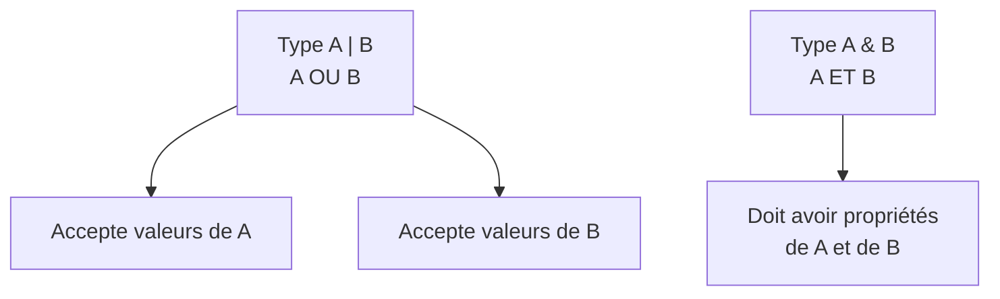

---
tags:
  - TypeScript
  - Intermédiaire
  - Concept
description: "Maîtriser les types union, intersection, le type narrowing et les discriminated unions."
estimated_time: "75 min"
fiche_number: 6
total_fiches: 15
cursus: "TypeScript"
---

# 06 - Types union et intersection

> **En bref** : Comprendre les types union (|) et intersection (&), maîtriser le type narrowing et les discriminated unions pour écrire du code sûr. Lecture estimée : 75 min.

## Prérequis

- [05 - Objets et interfaces](05-objets-interfaces.md)
- Connaître `typeof`, `in` et `instanceof` en JavaScript

## Objectif de cette fiche

À la fin de cette fiche, tu sauras combiner des types avec `|` et `&`, réduire un type union avec des type guards, et structurer des données avec les discriminated unions.

---

## Concepts

### Qu'est-ce qu'un type union ?

**Définition** : Un type union est un type qui accepte **l'un ou l'autre** de plusieurs types. Il se note avec le symbole `|` (pipe). `string | number` signifie "soit un string, soit un number".

**Le problème que les types union résolvent** :

Sans types union, voici les problèmes rencontrés :

1. **Flexibilité impossible** : Certaines fonctions doivent accepter plusieurs types. Par exemple, un identifiant peut être un nombre ou une chaîne. Sans union, il faut écrire deux fonctions séparées.
2. **Valeurs nullables** : Une variable peut contenir une valeur ou `null`. Sans union, on utilise `any`, ce qui désactive toutes les vérifications.
3. **Retours multiples** : Une fonction peut retourner un résultat ou une erreur. Sans union, on ne peut pas exprimer cette dualité.

**Comment les types union résolvent ces problèmes** :

| Problème | Solution apportée par les types union |
| -------- | ------------------------------------- |
| Flexibilité impossible | Un seul type accepte plusieurs variantes |
| Valeurs nullables | `string \| null` exprime clairement qu'une valeur peut être null |
| Retours multiples | `Result \| Error` décrit tous les cas possibles |

**Analogie concrète** : Un type union est comme un panneau de signalisation qui indique plusieurs directions. "Tournez à gauche OU à droite" : la valeur peut prendre l'un ou l'autre chemin. Avant d'agir, tu dois d'abord regarder quel chemin a été pris.

**Ce qu'un type union n'est PAS** :

- Un type union n'est pas un type qui contient les deux types en même temps. `string | number` est soit un string, soit un number, jamais les deux à la fois.
- Un type union n'autorise pas automatiquement les opérations des deux types. On ne peut appeler que les méthodes communes aux deux types, sauf si on vérifie d'abord quel type on a.

---

Le diagramme suivant résume la différence entre un type union (accepte l'un ou l'autre) et un type intersection (exige les deux).



### Qu'est-ce qu'un type intersection ?

**Définition** : Un type intersection combine plusieurs types en un seul qui possède **toutes** les propriétés de chaque type. Il se note avec le symbole `&`. `TypeA & TypeB` signifie "a toutes les propriétés de TypeA ET toutes les propriétés de TypeB".

**Le problème que les types intersection résolvent** :

Sans types intersection, voici les problèmes rencontrés :

1. **Combinaison de types** : On veut un objet qui respecte deux interfaces en même temps, sans créer une troisième interface manuellement.
2. **Mixins** : On veut ajouter des propriétés à un type existant sans le modifier.

**Comment les types intersection résolvent ces problèmes** :

| Problème | Solution apportée par les types intersection |
| -------- | --------------------------------------------- |
| Combinaison de types | `TypeA & TypeB` crée un type avec toutes les propriétés |
| Mixins | On peut combiner un type de base avec des propriétés supplémentaires |

**Analogie concrète** : Un type intersection est comme un couteau suisse. Un couteau **et** un tire-bouchon **et** un tournevis. L'objet résultant possède toutes les fonctionnalités de chaque outil combiné.

**Comparaison union vs intersection** :

| Union (`A \| B`) | Intersection (`A & B`) |
| ---------------- | ---------------------- |
| A **ou** B | A **et** B |
| Possède les propriétés communes | Possède toutes les propriétés des deux |
| Plus flexible | Plus restrictif |
| Nécessite un type guard pour accéder aux propriétés spécifiques | Accès direct à toutes les propriétés |

---

### Qu'est-ce que le type narrowing ?

**Définition** : Le type narrowing (rétrécissement de type) est le mécanisme par lequel TypeScript déduit un type plus précis à l'intérieur d'un bloc conditionnel. Quand tu vérifies le type d'une variable, TypeScript "réduit" le type union au type spécifique dans la branche correspondante.

**Le problème que le type narrowing résout** :

Sans type narrowing, voici les problèmes rencontrés :

1. **Opérations impossibles** : Sur un type `string | number`, on ne peut ni appeler `.toUpperCase()` (string) ni faire `* 2` (number) directement.
2. **Casts dangereux** : Sans narrowing, il faudrait forcer le type avec `as`, ce qui contourne les vérifications.

**Comment le type narrowing résout ces problèmes** :

| Problème | Solution apportée par le narrowing |
| -------- | ---------------------------------- |
| Opérations impossibles | Après vérification, TypeScript autorise les opérations du type vérifié |
| Casts dangereux | Le narrowing est sûr : il se base sur une vérification réelle |

**Analogie concrète** : Le type narrowing est comme le tri du courrier. Tu as un tas de lettres et de colis mélangés. Avant de traiter chaque élément, tu vérifies : "est-ce une lettre ou un colis ?" Si c'est une lettre, tu l'ouvres. Si c'est un colis, tu le débales. Le tri te permet d'appliquer le bon traitement à chaque élément.

---

### Qu'est-ce qu'une discriminated union ?

**Définition** : Une discriminated union (union discriminée) est un pattern où chaque variante d'un type union possède une propriété commune (le discriminant) avec une valeur littérale unique. Cette propriété permet à TypeScript de déterminer automatiquement quelle variante est utilisée.

**Le problème que les discriminated unions résolvent** :

Sans discriminated unions, voici les problèmes rencontrés :

1. **Identification des variantes** : Avec un type union d'objets, on ne sait pas quelle variante on a. Il faut vérifier l'existence de chaque propriété une par une.
2. **Vérification exhaustive** : On peut oublier de gérer un cas du type union.

**Comment les discriminated unions résolvent ces problèmes** :

| Problème | Solution apportée par les discriminated unions |
| -------- | ----------------------------------------------- |
| Identification des variantes | Le discriminant identifie la variante en un seul test |
| Vérification exhaustive | TypeScript vérifie que tous les cas sont gérés dans un switch |

**Analogie concrète** : Les discriminated unions sont comme des colis postaux avec une étiquette de type (lettre, colis standard, colis recommandé). L'étiquette (discriminant) permet au facteur de savoir immédiatement comment traiter chaque envoi, sans avoir à l'ouvrir.

---

## Étapes Pratiques

### Étape 1 : Types union de base

Crée un fichier `src/union-base.ts` :

```typescript
// src/union-base.ts
// Types union : accepter plusieurs types

// Un identifiant peut être un nombre ou une chaîne
type Identifiant = string | number;

const id1: Identifiant = 42;
const id2: Identifiant = "abc-123";

// Fonction qui accepte un type union
function afficherId(id: Identifiant): void {
  // On ne peut utiliser que les opérations communes à string ET number
  console.log(`ID : ${id}`);
  console.log(`  Type : ${typeof id}`);

  // Pour utiliser les opérations spécifiques, il faut vérifier le type
  if (typeof id === "string") {
    // Ici TypeScript sait que id est un string
    console.log(`  Majuscules : ${id.toUpperCase()}`);
    console.log(`  Longueur : ${id.length}`);
  } else {
    // Ici TypeScript sait que id est un number
    console.log(`  Double : ${id * 2}`);
    console.log(`  Pair : ${id % 2 === 0}`);
  }
}

afficherId(42);
afficherId("abc-123");

// Type union avec plus de deux types
type Valeur = string | number | boolean;

function decrireValeur(valeur: Valeur): string {
  if (typeof valeur === "string") {
    return `Chaîne de ${valeur.length} caractères : "${valeur}"`;
  }
  if (typeof valeur === "number") {
    return `Nombre : ${valeur}`;
  }
  // TypeScript sait que c'est forcément un boolean ici
  return `Booléen : ${valeur}`;
}

console.log("\n" + decrireValeur("hello"));
console.log(decrireValeur(42));
console.log(decrireValeur(true));

// Type union avec null
type NomOptional = string | null;

function saluer(nom: NomOptional): string {
  if (nom === null) {
    return "Bonjour, visiteur !";
  }
  // TypeScript sait que nom est un string ici
  return `Bonjour, ${nom} !`;
}

console.log("\n" + saluer("Alice"));
console.log(saluer(null));
```

Compile et exécute :

```bash
npx tsc && node dist/union-base.js
```

**Résultat attendu** :

```text
ID : 42
  Type : number
  Double : 84
  Pair : true
ID : abc-123
  Type : string
  Majuscules : ABC-123
  Longueur : 7

Chaîne de 5 caractères : "hello"
Nombre : 42
Booléen : true

Bonjour, Alice !
Bonjour, visiteur !
```

---

### Étape 2 : Types intersection

Crée un fichier `src/intersection.ts` :

```typescript
// src/intersection.ts
// Types intersection : combiner plusieurs types

// Deux types de base
type Personne = {
  nom: string;
  age: number;
};

type Employe = {
  entreprise: string;
  poste: string;
  salaire: number;
};

// Intersection : combine les deux types
type PersonneEmploye = Personne & Employe;

// L'objet doit avoir TOUTES les propriétés des deux types
const alice: PersonneEmploye = {
  // De Personne
  nom: "Alice",
  age: 30,
  // De Employe
  entreprise: "TechCorp",
  poste: "Développeuse",
  salaire: 45000,
};

console.log(`${alice.nom}, ${alice.age} ans`);
console.log(`${alice.poste} chez ${alice.entreprise}`);

// Intersection avec des interfaces
interface Horodate {
  creeLe: Date;
  modifieLe: Date;
}

interface Validable {
  estValide: boolean;
  validerPar?: string;
}

// Combiner interface + type alias + nouvelles propriétés
type Document = Horodate &
  Validable & {
    titre: string;
    contenu: string;
  };

const document: Document = {
  creeLe: new Date("2025-01-01"),
  modifieLe: new Date("2025-01-15"),
  estValide: true,
  validerPar: "Admin",
  titre: "Rapport annuel",
  contenu: "Contenu du rapport...",
};

console.log(`\nDocument : ${document.titre}`);
console.log(`  Valide : ${document.estValide} (par ${document.validerPar})`);
console.log(`  Créé le : ${document.creeLe.toLocaleDateString("fr-FR")}`);

// Fonction qui accepte une intersection
function afficherEmploye(employe: Personne & Employe): void {
  console.log(`\n${employe.nom} (${employe.age} ans)`);
  console.log(`  ${employe.poste} chez ${employe.entreprise}`);
  console.log(`  Salaire : ${employe.salaire} €`);
}

afficherEmploye(alice);
```

Compile et exécute :

```bash
npx tsc && node dist/intersection.js
```

**Résultat attendu** :

```text
Alice, 30 ans
Développeuse chez TechCorp

Document : Rapport annuel
  Valide : true (par Admin)
  Créé le : 01/01/2025

Alice (30 ans)
  Développeuse chez TechCorp
  Salaire : 45000 €
```

---

### Étape 3 : Type guards (gardes de type)

Crée un fichier `src/type-guards.ts` :

```typescript
// src/type-guards.ts
// Type guards : vérifier le type pour le réduire

// ===== typeof =====
// Fonctionne pour les types primitifs : string, number, boolean, etc.

function doubler(valeur: string | number): string | number {
  if (typeof valeur === "string") {
    // TypeScript sait que c'est un string
    return valeur + valeur; // concaténation
  }
  // TypeScript sait que c'est un number
  return valeur * 2; // multiplication
}

console.log("Doubler 'abc' :", doubler("abc"));
console.log("Doubler 42 :", doubler(42));

// ===== instanceof =====
// Fonctionne pour les instances de classes

class Chien {
  aboyer(): string {
    return "Wouf !";
  }
}

class ChatAnimal {
  miauler(): string {
    return "Miaou !";
  }
}

function faireBruit(animal: Chien | ChatAnimal): string {
  if (animal instanceof Chien) {
    // TypeScript sait que c'est un Chien
    return animal.aboyer();
  }
  // TypeScript sait que c'est un Chat
  return animal.miauler();
}

console.log("\nChien :", faireBruit(new Chien()));
console.log("Chat :", faireBruit(new ChatAnimal()));

// ===== in =====
// Vérifie si une propriété existe dans un objet

interface Voiture {
  marque: string;
  nombrePortes: number;
}

interface Moto {
  marque: string;
  cylindree: number;
}

function decrireVehicule(vehicule: Voiture | Moto): string {
  // "nombrePortes" existe seulement dans Voiture
  if ("nombrePortes" in vehicule) {
    // TypeScript sait que c'est une Voiture
    return `Voiture ${vehicule.marque} (${vehicule.nombrePortes} portes)`;
  }
  // TypeScript sait que c'est une Moto
  return `Moto ${vehicule.marque} (${vehicule.cylindree} cc)`;
}

console.log("\n" + decrireVehicule({ marque: "Peugeot", nombrePortes: 5 }));
console.log(decrireVehicule({ marque: "Yamaha", cylindree: 600 }));

// ===== Type predicate (is) =====
// Fonction custom de vérification de type

interface Poisson {
  nager(): void;
  nom: string;
}

interface Oiseau {
  voler(): void;
  nom: string;
}

// Type predicate : la fonction dit à TypeScript quel type elle a vérifié
function estPoisson(animal: Poisson | Oiseau): animal is Poisson {
  // On vérifie si la méthode 'nager' existe
  return "nager" in animal;
}

function deplacer(animal: Poisson | Oiseau): string {
  if (estPoisson(animal)) {
    // TypeScript sait que c'est un Poisson grâce au type predicate
    animal.nager();
    return `${animal.nom} nage`;
  }
  // TypeScript sait que c'est un Oiseau
  animal.voler();
  return `${animal.nom} vole`;
}

const nemo: Poisson = {
  nom: "Nemo",
  nager(): void {
    /* nage */
  },
};

const tweety: Oiseau = {
  nom: "Tweety",
  voler(): void {
    /* vole */
  },
};

console.log("\n" + deplacer(nemo));
console.log(deplacer(tweety));
```

Compile et exécute :

```bash
npx tsc && node dist/type-guards.js
```

**Résultat attendu** :

```text
Doubler 'abc' : abcabc
Doubler 42 : 84

Chien : Wouf !
Chat : Miaou !

Voiture Peugeot (5 portes)
Moto Yamaha (600 cc)

Nemo nage
Tweety vole
```

---

### Étape 4 : Discriminated unions

Crée un fichier `src/discriminated-unions.ts` :

```typescript
// src/discriminated-unions.ts
// Discriminated unions : union avec une propriété discriminante

// Chaque variante a une propriété 'type' avec une valeur littérale unique
interface Cercle {
  type: "cercle"; // Discriminant : toujours "cercle"
  rayon: number;
}

interface Rectangle {
  type: "rectangle"; // Discriminant : toujours "rectangle"
  largeur: number;
  hauteur: number;
}

interface Triangle {
  type: "triangle"; // Discriminant : toujours "triangle"
  base: number;
  hauteur: number;
}

// Type union des trois formes
type Forme = Cercle | Rectangle | Triangle;

// Le switch sur le discriminant permet à TypeScript
// de savoir exactement quel type on a dans chaque case
function calculerAire(forme: Forme): number {
  switch (forme.type) {
    case "cercle":
      // TypeScript sait que forme est un Cercle
      return Math.PI * forme.rayon * forme.rayon;

    case "rectangle":
      // TypeScript sait que forme est un Rectangle
      return forme.largeur * forme.hauteur;

    case "triangle":
      // TypeScript sait que forme est un Triangle
      return (forme.base * forme.hauteur) / 2;
  }
}

function decrireForme(forme: Forme): string {
  switch (forme.type) {
    case "cercle":
      return `Cercle de rayon ${forme.rayon}`;
    case "rectangle":
      return `Rectangle ${forme.largeur}x${forme.hauteur}`;
    case "triangle":
      return `Triangle (base ${forme.base}, hauteur ${forme.hauteur})`;
  }
}

// Création d'objets avec le discriminant
const monCercle: Cercle = { type: "cercle", rayon: 5 };
const monRectangle: Rectangle = { type: "rectangle", largeur: 10, hauteur: 4 };
const monTriangle: Triangle = { type: "triangle", base: 6, hauteur: 3 };

const formes: Forme[] = [monCercle, monRectangle, monTriangle];

console.log("Calcul d'aires :");
formes.forEach((forme: Forme): void => {
  const description: string = decrireForme(forme);
  const aire: number = calculerAire(forme);
  console.log(`  ${description} → aire = ${aire.toFixed(2)}`);
});

// Vérification exhaustive avec never
function verifierExhaustif(forme: Forme): string {
  switch (forme.type) {
    case "cercle":
      return "cercle";
    case "rectangle":
      return "rectangle";
    case "triangle":
      return "triangle";
    default:
      // Si on ajoute un nouveau type à Forme sans gérer le cas ici,
      // TypeScript signale une erreur sur cette ligne
      const _exhaustif: never = forme;
      return _exhaustif;
  }
}

// Exemple pratique : résultat d'une opération
interface Succes {
  statut: "succes";
  donnees: string;
}

interface Erreur {
  statut: "erreur";
  message: string;
  code: number;
}

interface Chargement {
  statut: "chargement";
}

type Resultat = Succes | Erreur | Chargement;

function traiterResultat(resultat: Resultat): void {
  switch (resultat.statut) {
    case "succes":
      console.log(`\nSuccès : ${resultat.donnees}`);
      break;
    case "erreur":
      console.log(`\nErreur ${resultat.code} : ${resultat.message}`);
      break;
    case "chargement":
      console.log("\nChargement en cours...");
      break;
  }
}

traiterResultat({ statut: "succes", donnees: "Données chargées" });
traiterResultat({ statut: "erreur", message: "Non trouvé", code: 404 });
traiterResultat({ statut: "chargement" });
```

Compile et exécute :

```bash
npx tsc && node dist/discriminated-unions.js
```

**Résultat attendu** :

```text
Calcul d'aires :
  Cercle de rayon 5 → aire = 78.54
  Rectangle 10x4 → aire = 40.00
  Triangle (base 6, hauteur 3) → aire = 9.00

Succès : Données chargées

Erreur 404 : Non trouvé

Chargement en cours...
```

---

### Étape 5 : Combinaisons avancées

Crée un fichier `src/union-avancee.ts` :

```typescript
// src/union-avancee.ts
// Combinaisons avancées de types union et intersection

// Type littéral union : restreindre les valeurs possibles
type Direction = "nord" | "sud" | "est" | "ouest";
type Taille = "petit" | "moyen" | "grand";
type NiveauLog = "info" | "warning" | "error";

function deplacer(direction: Direction, pas: number): string {
  return `Se déplacer de ${pas} pas vers le ${direction}`;
}

console.log(deplacer("nord", 3));
// deplacer("haut", 3); // Erreur : "haut" n'est pas dans Direction

// Combinaison union + intersection
type BaseEntity = {
  id: number;
  creeLe: Date;
};

type AvecNom = {
  nom: string;
};

type AvecEmail = {
  email: string;
};

// Un utilisateur a une base + un nom + un email
type Utilisateur = BaseEntity & AvecNom & AvecEmail;

// Un visiteur a une base + éventuellement un nom
type Visiteur = BaseEntity & Partial<AvecNom>;

const utilisateur: Utilisateur = {
  id: 1,
  creeLe: new Date(),
  nom: "Alice",
  email: "alice@test.fr",
};

const visiteur: Visiteur = {
  id: 2,
  creeLe: new Date(),
  // nom est optionnel grâce à Partial
};

console.log(`\nUtilisateur : ${utilisateur.nom} (${utilisateur.email})`);
console.log(`Visiteur : ${visiteur.nom ?? "Anonyme"}`);

// Type union d'objets avec propriétés communes
type Animal =
  | { espece: "chien"; race: string; aboie: boolean }
  | { espece: "chat"; couleur: string; interieur: boolean }
  | { espece: "poisson"; eau: "douce" | "salee" };

function decrireAnimal(animal: Animal): string {
  // La propriété commune 'espece' sert de discriminant
  switch (animal.espece) {
    case "chien":
      return `Chien de race ${animal.race}`;
    case "chat":
      return `Chat ${animal.couleur} (${animal.interieur ? "intérieur" : "extérieur"})`;
    case "poisson":
      return `Poisson d'eau ${animal.eau}`;
  }
}

console.log("\n" + decrireAnimal({ espece: "chien", race: "Labrador", aboie: true }));
console.log(decrireAnimal({ espece: "chat", couleur: "roux", interieur: true }));
console.log(decrireAnimal({ espece: "poisson", eau: "douce" }));
```

Compile et exécute :

```bash
npx tsc && node dist/union-avancee.js
```

**Résultat attendu** :

```text
Se déplacer de 3 pas vers le nord

Utilisateur : Alice (alice@test.fr)
Visiteur : Anonyme

Chien de race Labrador
Chat roux (intérieur)
Poisson d'eau douce
```

---

## Commandes Utiles

| Commande | Action |
| -------- | ------ |
| `npx tsc && node dist/fichier.js` | Compile puis exécute |
| `npx tsc --noEmit` | Vérifie les types sans compiler |
| `npx ts-node src/fichier.ts` | Compile et exécute directement |

---

## Pièges Fréquents

### Piège 1 : Oublier le narrowing avant d'utiliser un type union

**Problème** : Appeler une méthode spécifique à un type sans vérifier d'abord quel type on a.

```typescript
function traiter(valeur: string | number): void {
  // Erreur : toUpperCase n'existe pas sur number
  console.log(valeur.toUpperCase());
}
```

**Solution** : Toujours vérifier le type avec un type guard avant d'utiliser des opérations spécifiques.

```typescript
function traiter(valeur: string | number): void {
  if (typeof valeur === "string") {
    console.log(valeur.toUpperCase());
  } else {
    console.log(valeur.toFixed(2));
  }
}
```

---

### Piège 2 : Confondre union et intersection pour les types primitifs

**Problème** : `string & number` est impossible car aucune valeur ne peut être à la fois un string et un number. Le type résultant est `never`.

```typescript
type Impossible = string & number; // Type : never
```

**Solution** : Les intersections ont du sens pour les objets (on combine les propriétés), pas pour les primitifs. Pour les primitifs, utilise les unions.

---

### Piège 3 : Oublier un cas dans un switch sur une discriminated union

**Problème** : Quand on ajoute une nouvelle variante à une union, on peut oublier de la gérer.

**Solution** : Utilise la vérification exhaustive avec `never` dans le `default`.

```typescript
type Forme = Cercle | Rectangle | Triangle;

function aire(forme: Forme): number {
  switch (forme.type) {
    case "cercle":
      return Math.PI * forme.rayon ** 2;
    case "rectangle":
      return forme.largeur * forme.hauteur;
    // Si on oublie "triangle", TypeScript signale une erreur
    // car forme ne peut pas être assigné à never
    default:
      const _: never = forme;
      throw new Error(`Forme non gérée : ${_}`);
  }
}
```

---

## Checklist de Validation

- [ ] Je sais créer un type union avec `|`
- [ ] Je sais créer un type intersection avec `&`
- [ ] Je comprends la différence entre union (ou) et intersection (et)
- [ ] Je sais utiliser `typeof` comme type guard
- [ ] Je sais utiliser `in` comme type guard
- [ ] Je sais utiliser `instanceof` comme type guard
- [ ] Je sais créer un type predicate custom (`is`)
- [ ] Je sais créer et utiliser une discriminated union
- [ ] Je sais faire une vérification exhaustive avec `never`

---

## Exercice Pratique

**Énoncé** : Crée un système de notification avec des discriminated unions :

1. Définis trois types de notifications :
   - `NotificationEmail` : type "email", destinataire (string), sujet (string), corps (string)
   - `NotificationSMS` : type "sms", numéro (string), message (string)
   - `NotificationPush` : type "push", appareil (string), titre (string), corps (string), priorité ("haute" | "normale" | "basse")
2. Crée un type union `Notification` des trois types
3. Écris une fonction `envoyerNotification` qui traite chaque type avec un switch
4. Écris une fonction `compterParType` qui prend un tableau de notifications et retourne un objet avec le nombre de chaque type
5. Teste avec au moins 5 notifications

**Indications** :

- Utilise `type` comme propriété discriminante
- Utilise `Record<string, number>` pour le compteur
- Pense à la vérification exhaustive

**Résultat attendu** :

```text
Email envoyé à alice@test.fr : "Bienvenue"
SMS envoyé au 0612345678 : "Code : 1234"
Push envoyé à iPhone-Alice : "Mise à jour" (priorité haute)
Email envoyé à bob@test.fr : "Rappel"
Push envoyé à Android-Bob : "Nouveau message" (priorité normale)

Compteur : { email: 2, sms: 1, push: 2 }
```

---

## Solution de l'Exercice

> **Note** : Cette section contient la solution complète. Essaie d'abord de résoudre l'exercice par toi-même avant de consulter cette solution.

---

```typescript
// src/notifications.ts

interface NotificationEmail {
  type: "email";
  destinataire: string;
  sujet: string;
  corps: string;
}

interface NotificationSMS {
  type: "sms";
  numero: string;
  message: string;
}

interface NotificationPush {
  type: "push";
  appareil: string;
  titre: string;
  corps: string;
  priorite: "haute" | "normale" | "basse";
}

type Notification = NotificationEmail | NotificationSMS | NotificationPush;

function envoyerNotification(notification: Notification): void {
  switch (notification.type) {
    case "email":
      console.log(
        `Email envoyé à ${notification.destinataire} : "${notification.sujet}"`
      );
      break;
    case "sms":
      console.log(
        `SMS envoyé au ${notification.numero} : "${notification.message}"`
      );
      break;
    case "push":
      console.log(
        `Push envoyé à ${notification.appareil} : "${notification.titre}" (priorité ${notification.priorite})`
      );
      break;
    default:
      const _exhaustif: never = notification;
      throw new Error(`Type non géré : ${_exhaustif}`);
  }
}

function compterParType(
  notifications: Notification[]
): Record<string, number> {
  const compteur: Record<string, number> = {};

  notifications.forEach((notif: Notification): void => {
    if (compteur[notif.type] === undefined) {
      compteur[notif.type] = 0;
    }
    compteur[notif.type]++;
  });

  return compteur;
}

// Tests
const notifications: Notification[] = [
  { type: "email", destinataire: "alice@test.fr", sujet: "Bienvenue", corps: "..." },
  { type: "sms", numero: "0612345678", message: "Code : 1234" },
  { type: "push", appareil: "iPhone-Alice", titre: "Mise à jour", corps: "...", priorite: "haute" },
  { type: "email", destinataire: "bob@test.fr", sujet: "Rappel", corps: "..." },
  { type: "push", appareil: "Android-Bob", titre: "Nouveau message", corps: "...", priorite: "normale" },
];

notifications.forEach(envoyerNotification);
console.log("\nCompteur :", compterParType(notifications));
```

---

## Navigation

← Fiche précédente : **[05 - Objets et interfaces](05-objets-interfaces.md)**

→ Fiche suivante : **[07 - Fonctions typées](07-fonctions-typees.md)**
