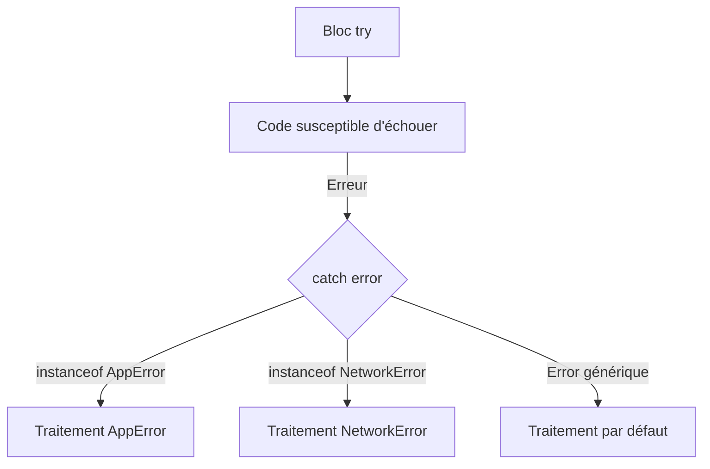

---
tags:
  - TypeScript
  - Avancé
  - Concept
description: "Maîtriser la gestion d'erreurs en TypeScript : erreurs custom, Result pattern, type guards et assertions."
estimated_time: "60 min"
fiche_number: 13
total_fiches: 15
cursus: "TypeScript"
---

# 13 - Gestion d'erreurs typée

> **En bref** : Apprendre à créer des types d'erreurs personnalisés, à utiliser le Result pattern pour gérer les erreurs de manière typée, et à utiliser les assertions de type. Lecture estimée : 60 min.

## Prérequis

- [12 - TypeScript avec Node.js](12-typescript-nodejs.md)
- [10 - Generics](10-generics.md)
- [06 - Types union et intersection](06-types-union-intersection.md)

## Objectif de cette fiche

À la fin de cette fiche, tu sauras créer des classes d'erreurs personnalisées, utiliser le Result pattern pour éviter les exceptions, écrire des type guards pour les erreurs, et utiliser les assertion functions de TypeScript.

---

## Concepts

### Qu'est-ce qu'une erreur typée ?

**Définition** : Une erreur typée est une erreur qui a un type précis en TypeScript, contrairement au `catch (error)` standard où `error` est de type `unknown`. Les erreurs typées permettent de distinguer différents types d'erreurs et de les traiter de manière spécifique.

> **Lien avec la configuration** : Le comportement `catch(e)` de type `unknown` (au lieu de `any`) est activé par l'option `useUnknownInCatchVariables`, elle-même incluse dans `strict: true` depuis TypeScript 4.4. Si tu utilises `strict: true` dans ton `tsconfig.json` (voir fiche 02), cette option est active automatiquement.

**Le problème que les erreurs typées résolvent** :

Sans erreurs typées, voici les problèmes rencontrés :

1. **Type `unknown` dans le catch** : Depuis TypeScript 4.4, l'erreur dans un `catch` est de type `unknown`. On ne peut pas accéder à ses propriétés sans vérification.
2. **Erreurs indistinguables** : Toutes les erreurs ont le même type (`Error`). On ne peut pas distinguer une erreur de validation d'une erreur réseau sans inspecter le message.
3. **Pas de documentation** : Les signatures de fonctions ne montrent pas quelles erreurs elles peuvent lancer.

**Comment les erreurs typées résolvent ces problèmes** :

| Problème | Solution apportée par les erreurs typées |
| -------- | ---------------------------------------- |
| Type `unknown` dans le catch | Des classes d'erreurs avec des propriétés typées |
| Erreurs indistinguables | Chaque type d'erreur a sa propre classe |
| Pas de documentation | Le Result pattern rend les erreurs visibles dans la signature |

**Analogie concrète** : Sans erreurs typées, c'est comme recevoir une alerte "Problème" sans savoir si c'est un incendie, une fuite d'eau ou une panne de courant. Avec des erreurs typées, chaque alerte est spécifique : "Incendie au 3e étage", "Fuite d'eau dans la cuisine". Tu sais exactement quel problème traiter et comment.

**Ce qu'une erreur typée n'est PAS** :

- Une erreur typée n'empêche pas l'erreur de se produire. Elle permet de la gérer de manière structurée.
- Une erreur typée n'est pas un simple message string. C'est un objet avec des propriétés spécifiques au type d'erreur.

---

### Qu'est-ce que le Result pattern ?

**Définition** : Le Result pattern est une approche où une fonction retourne un objet qui contient soit le résultat de succès, soit l'erreur. Au lieu de lancer une exception avec `throw`, la fonction retourne un type union discriminée : `{ succes: true; donnees: T }` ou `{ succes: false; erreur: E }`.

**Le problème que le Result pattern résout** :

Sans le Result pattern, voici les problèmes rencontrés :

1. **Exceptions invisibles** : La signature `function parse(json: string): Objet` ne montre pas qu'elle peut lancer une erreur. L'appelant peut oublier le `try/catch`.
2. **Flux de contrôle imprévisible** : `throw` interrompt le flux normal du programme. L'erreur peut être attrapée n'importe où dans la pile d'appels.
3. **Pas de vérification par le compilateur** : TypeScript ne vérifie pas que les exceptions sont attrapées. Un `throw` oublié provoque un crash à l'exécution.

**Comment le Result pattern résout ces problèmes** :

| Problème | Solution apportée par le Result pattern |
| -------- | --------------------------------------- |
| Exceptions invisibles | L'erreur fait partie du type de retour |
| Flux de contrôle imprévisible | Pas de `throw`, le flux reste linéaire |
| Pas de vérification compilateur | TypeScript force la gestion du cas d'erreur |

**Comparaison try/catch vs Result pattern** :

| try/catch | Result pattern |
| --------- | -------------- |
| Erreur invisible dans la signature | Erreur visible dans le type de retour |
| `throw` interrompt le flux | Retour normal, pas d'interruption |
| Oubli de `catch` = crash | Oubli de vérification = erreur de type |
| Standard JavaScript | Pattern de programmation fonctionnelle |

**Analogie concrète** : Le Result pattern est comme un formulaire médical avec deux cases : "Examen normal" et "Anomalie détectée". Quand le médecin (la fonction) termine l'examen, il coche une case et remplit les détails correspondants. Le patient (l'appelant) reçoit toujours un formulaire lisible et sait exactement quoi faire.
Avec `try/catch`, c'est comme si le médecin quittait la salle en criant "Problème !" sans donner de formulaire : n'importe qui dans le couloir peut entendre le cri et réagir de manière imprévisible.

---

### Que sont les assertion functions ?

**Définition** : Une assertion function est une fonction qui garantit à TypeScript qu'une condition est vraie après son appel. Si la condition est fausse, la fonction lance une erreur. La syntaxe `asserts condition` dans le type de retour indique à TypeScript que la variable est d'un type spécifique après l'appel.

**Le problème que les assertion functions résolvent** :

Sans assertion functions, voici le problème rencontré :

1. **Vérifications répétitives** : On doit répéter les mêmes vérifications de type (type guards) à chaque utilisation d'une variable. TypeScript ne se souvient pas des vérifications faites dans d'autres fonctions.

**Comment les assertion functions résolvent ce problème** :

| Problème | Solution apportée par les assertion functions |
| -------- | --------------------------------------------- |
| Vérifications répétitives | Une seule fonction de validation, TypeScript met à jour le type automatiquement |

**Analogie concrète** : Une assertion function est comme un agent de sécurité à l'entrée d'un bâtiment. L'agent vérifie ton badge une seule fois à l'entrée. Après ce contrôle, tout le monde dans le bâtiment sait que tu es autorisé : tu n'as plus besoin de montrer ton badge à chaque porte. De la même manière, après l'appel à `assertString(valeur)`, TypeScript sait que `valeur` est un `string` pour tout le reste de la fonction, sans avoir à revérifier.

---

## Étapes Pratiques

### Étape 1 : Classes d'erreurs personnalisées

Le diagramme suivant montre le flux de traitement d'une erreur typée dans un bloc try/catch avec `instanceof`.



Crée un fichier `src/erreurs-custom.ts` :

```typescript
// src/erreurs-custom.ts
// Classes d'erreurs personnalisées pour une gestion fine

// Classe de base pour les erreurs de l'application
class AppErreur extends Error {
  constructor(
    message: string,
    public readonly code: string,
    public readonly horodatage: Date = new Date()
  ) {
    super(message);
    // Nécessaire pour que instanceof fonctionne avec les classes étendant Error
    this.name = this.constructor.name;
  }
}

// Erreur de validation
class ErreurValidation extends AppErreur {
  constructor(
    public readonly champ: string,
    public readonly valeurRecue: unknown,
    message: string
  ) {
    super(message, "VALIDATION_ERROR");
  }
}

// Erreur "non trouvé"
class ErreurNonTrouve extends AppErreur {
  constructor(
    public readonly entite: string,
    public readonly identifiant: string | number
  ) {
    super(`${entite} #${identifiant} non trouvé`, "NOT_FOUND");
  }
}

// Erreur d'autorisation
class ErreurAutorisation extends AppErreur {
  constructor(
    public readonly action: string,
    public readonly role: string
  ) {
    super(
      `Le rôle "${role}" n'a pas la permission d'effectuer "${action}"`,
      "UNAUTHORIZED"
    );
  }
}

// Utilisation avec try/catch et vérification de type
interface Utilisateur {
  id: number;
  nom: string;
  email: string;
  role: string;
}

const utilisateurs: Utilisateur[] = [
  { id: 1, nom: "Alice", email: "alice@test.fr", role: "admin" },
  { id: 2, nom: "Bob", email: "bob@test.fr", role: "lecteur" },
];

function trouverUtilisateur(id: number): Utilisateur {
  const utilisateur: Utilisateur | undefined = utilisateurs.find(
    (u: Utilisateur): boolean => u.id === id
  );
  if (utilisateur === undefined) {
    throw new ErreurNonTrouve("Utilisateur", id);
  }
  return utilisateur;
}

function validerEmail(email: string): void {
  if (!email.includes("@")) {
    throw new ErreurValidation("email", email, "L'email doit contenir un @");
  }
}

function verifierPermission(utilisateur: Utilisateur, action: string): void {
  if (utilisateur.role !== "admin") {
    throw new ErreurAutorisation(action, utilisateur.role);
  }
}

// Gestion des erreurs typées
function traiterRequete(userId: number, email: string): void {
  try {
    const utilisateur: Utilisateur = trouverUtilisateur(userId);
    validerEmail(email);
    verifierPermission(utilisateur, "modifier_config");
    console.log(`  Requête traitée pour ${utilisateur.nom}`);
  } catch (erreur: unknown) {
    // On vérifie le type de l'erreur avec instanceof
    if (erreur instanceof ErreurNonTrouve) {
      console.log(`  [404] ${erreur.message}`);
    } else if (erreur instanceof ErreurValidation) {
      console.log(`  [400] Champ "${erreur.champ}" invalide : ${erreur.message}`);
    } else if (erreur instanceof ErreurAutorisation) {
      console.log(`  [403] ${erreur.message}`);
    } else if (erreur instanceof Error) {
      console.log(`  [500] Erreur inattendue : ${erreur.message}`);
    }
  }
}

console.log("--- Test 1 : utilisateur inexistant ---");
traiterRequete(99, "test@test.fr");

console.log("\n--- Test 2 : email invalide ---");
traiterRequete(1, "email-invalide");

console.log("\n--- Test 3 : permission refusée ---");
traiterRequete(2, "bob@test.fr");

console.log("\n--- Test 4 : succès ---");
traiterRequete(1, "alice@test.fr");
```

Compile et exécute :

```bash
npx tsc && node dist/erreurs-custom.js
```

**Résultat attendu** :

```text
--- Test 1 : utilisateur inexistant ---
  [404] Utilisateur #99 non trouvé

--- Test 2 : email invalide ---
  [400] Champ "email" invalide : L'email doit contenir un @

--- Test 3 : permission refusée ---
  [403] Le rôle "lecteur" n'a pas la permission d'effectuer "modifier_config"

--- Test 4 : succès ---
  Requête traitée pour Alice
```

---

### Étape 2 : Le Result pattern

Crée un fichier `src/result-pattern.ts` :

```typescript
// src/result-pattern.ts
// Result pattern : gestion d'erreurs sans exceptions

// Type Result générique
type Succes<T> = {
  succes: true;
  donnees: T;
};

type Echec<E> = {
  succes: false;
  erreur: E;
};

type Result<T, E = string> = Succes<T> | Echec<E>;

// Fonctions utilitaires pour créer des résultats
function ok<T>(donnees: T): Succes<T> {
  return { succes: true, donnees: donnees };
}

function err<E>(erreur: E): Echec<E> {
  return { succes: false, erreur: erreur };
}

// --- Utilisation ---

// Types d'erreurs spécifiques
type ErreurParsing =
  | { type: "json_invalide"; message: string }
  | { type: "champ_manquant"; champ: string }
  | { type: "type_invalide"; champ: string; attendu: string; recu: string };

interface Config {
  port: number;
  host: string;
  debug: boolean;
}

// Fonction qui retourne un Result au lieu de lancer une exception
function parserConfig(json: string): Result<Config, ErreurParsing> {
  // Étape 1 : parser le JSON
  let donnees: unknown;
  try {
    donnees = JSON.parse(json);
  } catch {
    return err({ type: "json_invalide", message: "Le JSON est mal formé" });
  }

  // Étape 2 : vérifier que c'est un objet
  if (typeof donnees !== "object" || donnees === null) {
    return err({ type: "json_invalide", message: "Le JSON doit être un objet" });
  }

  const obj = donnees as Record<string, unknown>;

  // Étape 3 : vérifier les champs obligatoires
  if (!("port" in obj)) {
    return err({ type: "champ_manquant", champ: "port" });
  }
  if (!("host" in obj)) {
    return err({ type: "champ_manquant", champ: "host" });
  }

  // Étape 4 : vérifier les types
  if (typeof obj.port !== "number") {
    return err({
      type: "type_invalide",
      champ: "port",
      attendu: "number",
      recu: typeof obj.port,
    });
  }
  if (typeof obj.host !== "string") {
    return err({
      type: "type_invalide",
      champ: "host",
      attendu: "string",
      recu: typeof obj.host,
    });
  }

  // Étape 5 : retourner le résultat
  return ok({
    port: obj.port,
    host: obj.host,
    debug: typeof obj.debug === "boolean" ? obj.debug : false,
  });
}

// Traitement du résultat : TypeScript force la vérification
function afficherConfig(json: string): void {
  const resultat: Result<Config, ErreurParsing> = parserConfig(json);

  if (resultat.succes) {
    // TypeScript sait que resultat.donnees est de type Config
    console.log(`  Port : ${resultat.donnees.port}`);
    console.log(`  Host : ${resultat.donnees.host}`);
    console.log(`  Debug : ${resultat.donnees.debug}`);
  } else {
    // TypeScript sait que resultat.erreur est de type ErreurParsing
    switch (resultat.erreur.type) {
      case "json_invalide":
        console.log(`  Erreur JSON : ${resultat.erreur.message}`);
        break;
      case "champ_manquant":
        console.log(`  Champ manquant : ${resultat.erreur.champ}`);
        break;
      case "type_invalide":
        console.log(
          `  Type invalide pour "${resultat.erreur.champ}" : attendu ${resultat.erreur.attendu}, reçu ${resultat.erreur.recu}`
        );
        break;
    }
  }
}

console.log("--- Test 1 : JSON valide ---");
afficherConfig('{"port": 3000, "host": "localhost", "debug": true}');

console.log("\n--- Test 2 : JSON mal formé ---");
afficherConfig("{port: 3000}");

console.log("\n--- Test 3 : champ manquant ---");
afficherConfig('{"port": 3000}');

console.log("\n--- Test 4 : type invalide ---");
afficherConfig('{"port": "trois-mille", "host": "localhost"}');
```

Compile et exécute :

```bash
npx tsc && node dist/result-pattern.js
```

**Résultat attendu** :

```text
--- Test 1 : JSON valide ---
  Port : 3000
  Host : localhost
  Debug : true

--- Test 2 : JSON mal formé ---
  Erreur JSON : Le JSON est mal formé

--- Test 3 : champ manquant ---
  Champ manquant : host

--- Test 4 : type invalide ---
  Type invalide pour "port" : attendu number, reçu string
```

---

### Étape 3 : Type guards pour les erreurs

Crée un fichier `src/type-guards-erreurs.ts` :

```typescript
// src/type-guards-erreurs.ts
// Type guards pour vérifier et distinguer les erreurs

// Erreurs réseau simulées
interface ErreurReseau {
  type: "reseau";
  statut: number;
  message: string;
}

interface ErreurTimeout {
  type: "timeout";
  dureeMs: number;
}

interface ErreurInconnue {
  type: "inconnue";
  erreurOriginale: unknown;
}

type ErreurRequete = ErreurReseau | ErreurTimeout | ErreurInconnue;

// Type guard : vérifie si une valeur inconnue est une Error
function estError(valeur: unknown): valeur is Error {
  return valeur instanceof Error;
}

// Type guard : vérifie si une erreur a un code spécifique
function estErreurReseau(erreur: ErreurRequete): erreur is ErreurReseau {
  return erreur.type === "reseau";
}

function estErreurTimeout(erreur: ErreurRequete): erreur is ErreurTimeout {
  return erreur.type === "timeout";
}

// Simuler des requêtes qui échouent
function simulerRequete(scenario: number): ErreurRequete | null {
  switch (scenario) {
    case 1:
      return { type: "reseau", statut: 404, message: "Page non trouvée" };
    case 2:
      return { type: "timeout", dureeMs: 5000 };
    case 3:
      return { type: "inconnue", erreurOriginale: new Error("Erreur inattendue") };
    default:
      return null; // Succès
  }
}

// Gestion avec type guards
function traiterErreur(erreur: ErreurRequete): void {
  if (estErreurReseau(erreur)) {
    // TypeScript sait que erreur est ErreurReseau ici
    console.log(`  [Réseau] Statut ${erreur.statut} : ${erreur.message}`);
    if (erreur.statut >= 500) {
      console.log("  → Réessayer plus tard");
    }
  } else if (estErreurTimeout(erreur)) {
    // TypeScript sait que erreur est ErreurTimeout ici
    console.log(`  [Timeout] La requête a dépassé ${erreur.dureeMs}ms`);
    console.log("  → Vérifier la connexion");
  } else {
    // TypeScript sait que erreur est ErreurInconnue ici
    console.log("  [Inconnue] Erreur non identifiée");
    if (estError(erreur.erreurOriginale)) {
      console.log(`  → Détail : ${erreur.erreurOriginale.message}`);
    }
  }
}

console.log("--- Scénario 1 : erreur réseau ---");
const err1: ErreurRequete | null = simulerRequete(1);
if (err1 !== null) traiterErreur(err1);

console.log("\n--- Scénario 2 : timeout ---");
const err2: ErreurRequete | null = simulerRequete(2);
if (err2 !== null) traiterErreur(err2);

console.log("\n--- Scénario 3 : erreur inconnue ---");
const err3: ErreurRequete | null = simulerRequete(3);
if (err3 !== null) traiterErreur(err3);

console.log("\n--- Scénario 4 : succès ---");
const err4: ErreurRequete | null = simulerRequete(4);
if (err4 === null) {
  console.log("  Requête réussie");
}
```

Compile et exécute :

```bash
npx tsc && node dist/type-guards-erreurs.js
```

**Résultat attendu** :

```text
--- Scénario 1 : erreur réseau ---
  [Réseau] Statut 404 : Page non trouvée

--- Scénario 2 : timeout ---
  [Timeout] La requête a dépassé 5000ms
  → Vérifier la connexion

--- Scénario 3 : erreur inconnue ---
  [Inconnue] Erreur non identifiée
  → Détail : Erreur inattendue

--- Scénario 4 : succès ---
  Requête réussie
```

---

### Étape 4 : Assertion functions

Crée un fichier `src/assertions.ts` :

```typescript
// src/assertions.ts
// Assertion functions : garantir un type après l'appel

// Assertion function simple : vérifie qu'une valeur n'est pas null/undefined
function assertDefini<T>(
  valeur: T | null | undefined,
  message: string = "La valeur est null ou undefined"
): asserts valeur is T {
  if (valeur === null || valeur === undefined) {
    throw new Error(message);
  }
}

// Assertion function : vérifie qu'une valeur est un string
function assertString(
  valeur: unknown,
  nomVariable: string = "valeur"
): asserts valeur is string {
  if (typeof valeur !== "string") {
    throw new Error(
      `${nomVariable} doit être un string, reçu : ${typeof valeur}`
    );
  }
}

// Assertion function : vérifie qu'une valeur est un nombre positif
function assertNombrePositif(
  valeur: unknown,
  nomVariable: string = "valeur"
): asserts valeur is number {
  if (typeof valeur !== "number" || valeur <= 0) {
    throw new Error(
      `${nomVariable} doit être un nombre positif, reçu : ${valeur}`
    );
  }
}

// Utilisation
interface Produit {
  id: number;
  nom: string;
  prix: number;
  description: string | null;
}

function traiterProduit(donnees: Record<string, unknown>): Produit {
  // Chaque assertion garantit le type après l'appel
  assertDefini(donnees.nom, "Le nom est requis");
  assertString(donnees.nom, "nom");
  // Après ces deux lignes, TypeScript sait que donnees.nom est un string

  assertDefini(donnees.prix, "Le prix est requis");
  assertNombrePositif(donnees.prix, "prix");
  // Après ces deux lignes, TypeScript sait que donnees.prix est un number

  return {
    id: Date.now(),
    nom: donnees.nom,
    prix: donnees.prix,
    description: typeof donnees.description === "string"
      ? donnees.description
      : null,
  };
}

// Tests
console.log("--- Test 1 : données valides ---");
try {
  const produit: Produit = traiterProduit({
    nom: "Clavier",
    prix: 49.99,
    description: "Clavier mécanique",
  });
  console.log("  Produit créé :", produit.nom, "-", produit.prix, "€");
} catch (e: unknown) {
  if (e instanceof Error) console.log("  Erreur :", e.message);
}

console.log("\n--- Test 2 : nom manquant ---");
try {
  traiterProduit({ prix: 49.99 });
} catch (e: unknown) {
  if (e instanceof Error) console.log("  Erreur :", e.message);
}

console.log("\n--- Test 3 : prix invalide ---");
try {
  traiterProduit({ nom: "Souris", prix: -10 });
} catch (e: unknown) {
  if (e instanceof Error) console.log("  Erreur :", e.message);
}

console.log("\n--- Test 4 : type invalide ---");
try {
  traiterProduit({ nom: 42, prix: 10 });
} catch (e: unknown) {
  if (e instanceof Error) console.log("  Erreur :", e.message);
}
```

Compile et exécute :

```bash
npx tsc && node dist/assertions.js
```

**Résultat attendu** :

```text
--- Test 1 : données valides ---
  Produit créé : Clavier - 49.99 €

--- Test 2 : nom manquant ---
  Erreur : Le nom est requis

--- Test 3 : prix invalide ---
  Erreur : prix doit être un nombre positif, reçu : -10

--- Test 4 : type invalide ---
  Erreur : nom doit être un string, reçu : number
```

---

## Commandes Utiles

| Commande | Action |
| -------- | ------ |
| `npx tsc && node dist/fichier.js` | Compile puis exécute |
| `npx tsc --noEmit` | Vérifie les types sans compiler |
| `npx ts-node src/fichier.ts` | Compile et exécute directement |

---

## Pièges Fréquents

### Piège 1 : Oublier que `catch` reçoit `unknown`

⚠️ **Problème** : Accéder directement à `error.message` dans un `catch` sans vérifier le type.

```typescript
try {
  // ...
} catch (error) {
  // error est de type 'unknown'
  // console.log(error.message); // Erreur : 'error' is of type 'unknown'
}
```

✅ **Solution** : Vérifie le type avec `instanceof Error` ou un type guard.

```typescript
try {
  // ...
} catch (error: unknown) {
  if (error instanceof Error) {
    console.log(error.message); // OK : error est de type Error
  }
}
```

---

### Piège 2 : `instanceof` ne fonctionne pas avec les interfaces

⚠️ **Problème** : Essayer d'utiliser `instanceof` avec une interface TypeScript.

```typescript
interface MonErreur {
  code: string;
}

// Erreur : 'MonErreur' only refers to a type
// if (error instanceof MonErreur) { }
```

✅ **Solution** : Utilise `instanceof` avec des classes (qui existent à l'exécution), ou utilise un type guard basé sur les propriétés.

```typescript
// Avec une classe
class MonErreur extends Error {
  constructor(public code: string) {
    super();
  }
}
if (error instanceof MonErreur) { /* ... */ }

// Avec un type guard
function estMonErreur(valeur: unknown): valeur is MonErreur {
  return typeof valeur === "object"
    && valeur !== null
    && "code" in valeur;
}
```

---

### Piège 3 : Ne pas gérer tous les cas du Result pattern

⚠️ **Problème** : Accéder à `donnees` sans vérifier que `succes` est `true`.

```typescript
const resultat = parserConfig(json);
// console.log(resultat.donnees); // Erreur : 'donnees' n'existe pas toujours
```

✅ **Solution** : Vérifie toujours le champ `succes` avant d'accéder aux données.

```typescript
const resultat = parserConfig(json);
if (resultat.succes) {
  console.log(resultat.donnees); // OK : TypeScript sait que donnees existe
} else {
  console.log(resultat.erreur); // OK : TypeScript sait que erreur existe
}
```

---

## Checklist de Validation

- [ ] Je sais créer des classes d'erreurs personnalisées qui étendent `Error`
- [ ] Je sais utiliser `instanceof` pour distinguer les types d'erreurs dans un `catch`
- [ ] Je sais créer et utiliser le Result pattern avec des types génériques
- [ ] Je sais écrire des type guards pour les erreurs
- [ ] Je sais créer des assertion functions avec `asserts`
- [ ] Je comprends que `catch` reçoit `unknown` et je vérifie le type
- [ ] Je sais choisir entre try/catch et Result pattern selon le contexte

---

## Exercice Pratique

**Énoncé** : Crée un validateur de formulaire avec le Result pattern :

1. Crée un type `ErreurFormulaire` avec : `champ`, `message`, `valeurRecue`
2. Crée un type `ResultatValidation<T>` basé sur le Result pattern
3. Crée une interface `InscriptionFormulaire` avec : `nom`, `email`, `age`, `motDePasse`
4. Crée une fonction `validerInscription(donnees)` qui retourne un `ResultatValidation<InscriptionFormulaire>`
5. Règles de validation : nom non vide, email contient @, age entre 13 et 120, mot de passe >= 8 caractères
6. Teste avec 3 cas : données valides, email invalide, mot de passe trop court

**Indications** :

- Collecte toutes les erreurs (ne t'arrête pas à la première)
- Retourne un tableau d'erreurs dans le cas `Echec`
- Utilise le type `ErreurFormulaire[]` comme type d'erreur du Result

**Résultat attendu** :

```text
--- Test 1 : données valides ---
  Inscription réussie : Alice (alice@test.fr)

--- Test 2 : email invalide ---
  2 erreur(s) :
  - email : L'email doit contenir un @ (reçu: "alice")
  - motDePasse : Le mot de passe doit contenir au moins 8 caractères (reçu: "123")

--- Test 3 : tout invalide ---
  4 erreur(s) :
  - nom : Le nom ne peut pas être vide (reçu: "")
  - email : L'email doit contenir un @ (reçu: "")
  - age : L'âge doit être entre 13 et 120 (reçu: 5)
  - motDePasse : Le mot de passe doit contenir au moins 8 caractères (reçu: "")
```

---

## Solution de l'Exercice

> **Note** : Cette section contient la solution complète. Essaie d'abord de résoudre l'exercice par toi-même avant de consulter cette solution.

---

```typescript
// src/validateur-formulaire.ts

interface ErreurFormulaire {
  champ: string;
  message: string;
  valeurRecue: unknown;
}

type ResultatValidation<T> =
  | { succes: true; donnees: T }
  | { succes: false; erreurs: ErreurFormulaire[] };

interface InscriptionFormulaire {
  nom: string;
  email: string;
  age: number;
  motDePasse: string;
}

function validerInscription(
  donnees: InscriptionFormulaire
): ResultatValidation<InscriptionFormulaire> {
  const erreurs: ErreurFormulaire[] = [];

  // Validation du nom
  if (donnees.nom.trim().length === 0) {
    erreurs.push({
      champ: "nom",
      message: "Le nom ne peut pas être vide",
      valeurRecue: donnees.nom,
    });
  }

  // Validation de l'email
  if (!donnees.email.includes("@")) {
    erreurs.push({
      champ: "email",
      message: "L'email doit contenir un @",
      valeurRecue: donnees.email,
    });
  }

  // Validation de l'âge
  if (donnees.age < 13 || donnees.age > 120) {
    erreurs.push({
      champ: "age",
      message: "L'âge doit être entre 13 et 120",
      valeurRecue: donnees.age,
    });
  }

  // Validation du mot de passe
  if (donnees.motDePasse.length < 8) {
    erreurs.push({
      champ: "motDePasse",
      message: "Le mot de passe doit contenir au moins 8 caractères",
      valeurRecue: donnees.motDePasse,
    });
  }

  // Retourner le résultat
  if (erreurs.length > 0) {
    return { succes: false, erreurs: erreurs };
  }

  return { succes: true, donnees: donnees };
}

function afficherResultat(resultat: ResultatValidation<InscriptionFormulaire>): void {
  if (resultat.succes) {
    console.log(
      `  Inscription réussie : ${resultat.donnees.nom} (${resultat.donnees.email})`
    );
  } else {
    console.log(`  ${resultat.erreurs.length} erreur(s) :`);
    resultat.erreurs.forEach((erreur: ErreurFormulaire): void => {
      console.log(
        `  - ${erreur.champ} : ${erreur.message} (reçu: ${JSON.stringify(erreur.valeurRecue)})`
      );
    });
  }
}

// Tests
console.log("--- Test 1 : données valides ---");
afficherResultat(
  validerInscription({
    nom: "Alice",
    email: "alice@test.fr",
    age: 25,
    motDePasse: "motdepasse123",
  })
);

console.log("\n--- Test 2 : email invalide ---");
afficherResultat(
  validerInscription({
    nom: "Alice",
    email: "alice",
    age: 25,
    motDePasse: "123",
  })
);

console.log("\n--- Test 3 : tout invalide ---");
afficherResultat(
  validerInscription({
    nom: "",
    email: "",
    age: 5,
    motDePasse: "",
  })
);
```

Compile et exécute :

```bash
npx tsc && node dist/validateur-formulaire.js
```

**Résultat attendu** :

```text
--- Test 1 : données valides ---
  Inscription réussie : Alice (alice@test.fr)

--- Test 2 : email invalide ---
  2 erreur(s) :
  - email : L'email doit contenir un @ (reçu: "alice")
  - motDePasse : Le mot de passe doit contenir au moins 8 caractères (reçu: "123")

--- Test 3 : tout invalide ---
  4 erreur(s) :
  - nom : Le nom ne peut pas être vide (reçu: "")
  - email : L'email doit contenir un @ (reçu: "")
  - age : L'âge doit être entre 13 et 120 (reçu: 5)
  - motDePasse : Le mot de passe doit contenir au moins 8 caractères (reçu: "")
```

---

## Navigation

← Fiche précédente : **[12 - TypeScript avec Node.js](12-typescript-nodejs.md)**

→ Fiche suivante : **[14 - Projet intégrateur](14-projet-integrateur.md)**
