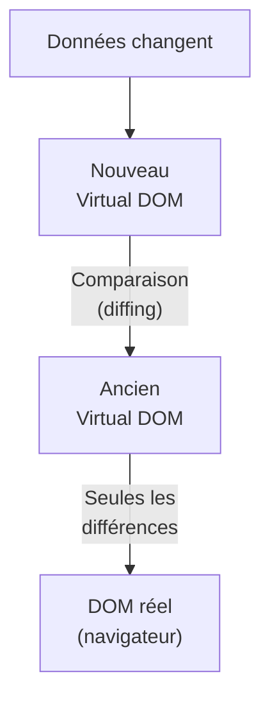

---
tags:
  - React
  - Débutant
  - Concept
description: "Découvrir React, comprendre le virtual DOM et l'approche par composants."
estimated_time: "60 min"
fiche_number: 1
total_fiches: 19
cursus: "React"
---

# 01 - Introduction à React

> **En bref** : Comprendre ce qu'est React, pourquoi il existe et comment il fonctionne grâce au virtual DOM et aux composants. Lecture estimée : 60 min.

## Prérequis

- [Cursus JavaScript Moderne](../06-javascript-moderne/index.md) terminé
- [Cursus TypeScript](../07-typescript/index.md) terminé
- Connaître HTML et CSS

## Objectif de cette fiche

À la fin de cette fiche, tu sauras expliquer ce qu'est React, pourquoi il est utilisé et comment fonctionne le virtual DOM.

---

## Concepts

### Qu'est-ce que React ?

**Définition** : React est une bibliothèque JavaScript open source, créée par Meta (Facebook) en 2013, qui permet de construire des interfaces utilisateur (UI) en découpant la page en composants réutilisables.

**Le problème que React résout** :

Sans React, voici les problèmes rencontrés quand on construit une interface dynamique avec du JavaScript classique (vanilla JS) :

1. **Manipulation manuelle du DOM** : chaque mise à jour de la page nécessite de sélectionner des éléments HTML (`querySelector`, `getElementById`) et de les modifier un par un. Cela devient rapidement complexe sur une grande page.
2. **Synchronisation état/affichage** : quand les données changent (par exemple un compteur qui s'incrémente), il faut manuellement mettre à jour tous les endroits de la page qui affichent cette donnée. On oublie facilement un endroit, ce qui crée des bugs.
3. **Code non réutilisable** : une barre de navigation écrite en vanilla JS pour une page ne peut pas être facilement réutilisée sur une autre page sans copier-coller le code.
4. **Maintenance difficile** : sur une application de plusieurs milliers de lignes, le code JavaScript devient très difficile à organiser et à maintenir.

**Comment React résout ces problèmes** :

| Problème | Solution apportée par React |
| --- | --- |
| Manipulation manuelle du DOM | React met à jour le DOM automatiquement quand les données changent |
| Synchronisation état/affichage | React re-rend automatiquement les composants dont les données ont changé |
| Code non réutilisable | Les composants React sont des blocs indépendants réutilisables partout |
| Maintenance difficile | Chaque composant a sa propre logique, isolée du reste |

**Analogie concrète** : Imagine une cuisine de restaurant. Sans React, c'est comme si un seul cuisinier devait préparer tous les plats, servir les clients et faire la vaisselle. Avec React, chaque cuisinier (composant) a une responsabilité précise : l'un prépare les entrées, l'autre les plats principaux, un autre les desserts. Si le menu des desserts change, seul le cuisinier des desserts est impacté.

**Ce que React n'est PAS** :

- React n'est pas un framework complet comme Angular. React ne gère que l'interface utilisateur (la vue). Pour le routing ou la gestion d'état globale, il faut ajouter d'autres bibliothèques.
- React n'est pas un langage de programmation. C'est une bibliothèque JavaScript. Tu écris du JavaScript (ou TypeScript) pour utiliser React.
- React n'est pas réservé au web. React Native permet de créer des applications mobiles avec la même approche.

---

### Qu'est-ce que le DOM ?

**Définition** : Le DOM (Document Object Model) est la représentation en mémoire de la structure HTML d'une page web. Le navigateur construit cet arbre d'objets à partir du code HTML pour afficher la page.

**Le problème que le DOM pose** :

Sans optimisation, voici ce qui se passe quand on modifie le DOM :

1. **Lenteur des modifications** : chaque modification du DOM déclenche un recalcul du positionnement de tous les éléments de la page (reflow) et un redessin (repaint). Sur une page complexe, cela ralentit l'affichage.
2. **Modifications en cascade** : modifier un élément parent peut forcer le navigateur à recalculer tous ses enfants.
3. **Pas de regroupement** : si tu fais 10 modifications séparées, le navigateur recalcule 10 fois la page au lieu d'une seule.

**Comment le DOM est structuré** :

```text
document
└── html
    ├── head
    │   └── title
    └── body
        ├── header
        │   └── nav
        ├── main
        │   ├── h1
        │   └── p
        └── footer
```

Chaque élément HTML devient un nœud dans cet arbre. Modifier un nœud peut affecter tous ses descendants.

**Analogie concrète** : Le DOM est comme un organigramme d'entreprise affiché sur un grand tableau blanc. Si tu veux changer le nom d'un département, tu dois effacer et réécrire non seulement ce département, mais potentiellement tous les sous-départements en dessous.

---

### Qu'est-ce que le Virtual DOM ?

**Définition** : Le virtual DOM est une copie légère du DOM réel, stockée en mémoire sous forme d'objets JavaScript. React travaille d'abord sur cette copie, puis applique uniquement les changements nécessaires au vrai DOM.

**Le problème que le virtual DOM résout** :

Sans virtual DOM, voici les problèmes rencontrés :

1. **Performances dégradées** : modifier directement le DOM réel à chaque changement de données est lent, car chaque modification déclenche un recalcul complet de la mise en page.
2. **Mises à jour inutiles** : sans mécanisme de comparaison, on remplace souvent des parties entières de la page même si seul un petit texte a changé.
3. **Complexité du code** : le développeur doit lui-même déterminer quels éléments précis doivent être mis à jour.

**Comment le virtual DOM résout ces problèmes** :

| Problème | Solution apportée par le virtual DOM |
| --- | --- |
| Performances dégradées | React compare l'ancien et le nouveau virtual DOM, puis applique uniquement les différences au DOM réel |
| Mises à jour inutiles | L'algorithme de diffing identifie précisément ce qui a changé |
| Complexité du code | Le développeur décrit le résultat souhaité, React calcule les modifications nécessaires |

**Le processus en 3 étapes** :

1. **Render** : quand les données changent, React crée un nouveau virtual DOM (un nouvel arbre d'objets JavaScript)
2. **Diffing** : React compare le nouveau virtual DOM avec l'ancien pour trouver les différences
3. **Commit** : React applique uniquement les différences au DOM réel du navigateur



**Analogie concrète** : Imagine que tu corriges un document de 100 pages. Sans virtual DOM, c'est comme réimprimer les 100 pages à chaque correction. Avec le virtual DOM, c'est comme comparer le brouillon corrigé avec l'original et ne réimprimer que les pages qui ont changé.

**Ce que le virtual DOM n'est PAS** :

- Le virtual DOM n'est pas une technologie du navigateur. C'est un concept inventé par React, implémenté en JavaScript.
- Le virtual DOM n'est pas toujours plus rapide que le DOM réel. Pour une modification unique et simple, manipuler directement le DOM peut être plus rapide. L'avantage du virtual DOM apparaît quand il y a beaucoup de modifications simultanées.

---

### Qu'est-ce qu'un composant React ?

**Définition** : Un composant React est une fonction JavaScript (ou TypeScript) qui retourne du JSX (un mélange de JavaScript et de HTML) et qui représente une partie de l'interface utilisateur.

**Le problème que les composants résolvent** :

Sans composants, voici les problèmes rencontrés :

1. **Duplication de code** : la même barre de navigation est copiée-collée dans chaque page HTML.
2. **Difficile à modifier** : si le design de la barre de navigation change, il faut modifier chaque copie.
3. **Pas d'encapsulation** : le JavaScript, le HTML et le CSS d'une partie de la page sont dispersés dans des fichiers différents, ce qui rend difficile de comprendre comment fonctionne cette partie.

**Comment les composants résolvent ces problèmes** :

| Problème | Solution apportée par les composants |
| --- | --- |
| Duplication de code | Un composant est écrit une seule fois et utilisé partout |
| Difficile à modifier | Modifier le composant met à jour toutes ses utilisations |
| Pas d'encapsulation | Chaque composant contient sa logique, son rendu et potentiellement son style |

**Exemple concret** :

```tsx
// Ce composant affiche un bouton avec un texte personnalisable
function Button() {
  return <button>Cliquer ici</button>;
}

// On peut utiliser ce composant plusieurs fois dans la page
function App() {
  return (
    <div>
      <Button />
      <Button />
      <Button />
    </div>
  );
}
```

**Analogie concrète** : Un composant est comme une brique LEGO. Chaque brique a une forme et une couleur précises. Tu peux assembler plusieurs briques pour construire des structures complexes. Si tu veux changer la couleur d'une brique, toutes les constructions qui utilisent cette brique sont mises à jour.

**Ce qu'un composant n'est PAS** :

- Un composant n'est pas une page complète. Un composant représente une partie de la page (un bouton, un formulaire, une carte, un en-tête). Une page est un assemblage de plusieurs composants.
- Un composant n'est pas un fichier HTML. Un composant est une fonction JavaScript/TypeScript qui retourne du JSX, pas du HTML pur.

---

### L'écosystème React

**Définition** : L'écosystème React est l'ensemble des bibliothèques et outils complémentaires qui s'utilisent avec React pour construire des applications complètes.

React ne fournit que la couche d'affichage (la vue). Pour une application complète, il faut ajouter d'autres outils :

| Besoin | Bibliothèque | Rôle |
| --- | --- | --- |
| Création de projet | Vite | Bundler rapide pour le développement et la production |
| Routing (navigation entre pages) | React Router | Gère les URLs et la navigation sans rechargement |
| Gestion d'état globale | Context API (intégré) ou Zustand | Partage des données entre composants éloignés |
| Formulaires | React Hook Form | Gestion performante des formulaires complexes |
| Validation | Zod | Validation de données avec TypeScript |
| Tests | Vitest + Testing Library | Tests unitaires et d'intégration |
| Requêtes HTTP | fetch (natif) | Appels API vers un backend |

**Ce cursus couvre** : Vite, React Router, Context API, React Hook Form, Zod, Vitest et Testing Library.

---

### React vs Vanilla JavaScript

Pour comprendre concrètement ce que React apporte, voici le même exemple écrit de deux manières : un compteur qui s'incrémente au clic.

**Version vanilla JavaScript** :

```html
<!-- index.html -->
<div>
  <p id="compteur">Compteur : 0</p>
  <button id="bouton">Incrémenter</button>
</div>

<script>
  // On doit sélectionner manuellement les éléments du DOM
  const paragraphe = document.getElementById("compteur");
  const bouton = document.getElementById("bouton");

  // On gère l'état dans une variable
  let compteur = 0;

  // On doit manuellement mettre à jour le DOM quand l'état change
  bouton.addEventListener("click", () => {
    compteur += 1;
    paragraphe.textContent = `Compteur : ${compteur}`;
  });
</script>
```

**Version React** :

```tsx
// Counter.tsx
import { useState } from "react";

// Le composant décrit le résultat souhaité
// React se charge de mettre à jour le DOM automatiquement
function Counter() {
  // useState crée une variable d'état et une fonction pour la modifier
  const [compteur, setCompteur] = useState(0);

  return (
    <div>
      {/* L'affichage est automatiquement synchronisé avec l'état */}
      <p>Compteur : {compteur}</p>
      <button onClick={() => setCompteur(compteur + 1)}>
        Incrémenter
      </button>
    </div>
  );
}
```

**Différences clés** :

| Aspect | Vanilla JavaScript | React |
| --- | --- | --- |
| Sélection des éléments | Manuelle (`getElementById`) | Automatique |
| Mise à jour du DOM | Manuelle (`textContent = ...`) | Automatique quand l'état change |
| Synchronisation état/affichage | À la charge du développeur | Garantie par React |
| Réutilisabilité | Copier-coller | Importer le composant |

---

## Étapes Pratiques

### Étape 1 : Vérifier les prérequis installés

Avant de commencer avec React, vérifie que Node.js et npm sont installés sur ta machine.

Commande :

```bash
# Vérifie la version de Node.js (22 LTS recommandé)
node --version
```

**Résultat attendu** :

```text
v22.x.x
```

```bash
# Vérifie la version de npm
npm --version
```

**Résultat attendu** :

```text
10.x.x
```

Si Node.js n'est pas installé, installe la version 22 LTS depuis le site officiel ou avec un gestionnaire de versions.

---

### Étape 2 : Créer un premier projet React (aperçu rapide)

Cette étape te donne un aperçu. La fiche suivante détaille chaque fichier en profondeur.

Commande :

```bash
# Crée un nouveau projet React avec TypeScript via Vite
npm create vite@latest mon-premier-react -- --template react-ts
```

**Résultat attendu** :

```text
Scaffolding project in ./mon-premier-react...

Done. Now run:

  cd mon-premier-react
  npm install
  npm run dev
```

---

### Étape 3 : Installer les dépendances

```bash
# Entre dans le dossier du projet
cd mon-premier-react

# Installe toutes les dépendances listées dans package.json
npm install
```

**Résultat attendu** :

```text
added XXX packages in Xs
```

---

### Étape 4 : Lancer le serveur de développement

```bash
# Démarre le serveur de développement Vite
npm run dev
```

**Résultat attendu** :

```text
  VITE v6.x.x  ready in XXX ms

  ➜  Local:   http://localhost:5173/
  ➜  Network: use --host to expose
  ➜  press h + enter to show help
```

Ouvre ton navigateur à l'adresse `http://localhost:5173/`. Tu dois voir une page avec le logo React et un compteur.

---

### Étape 5 : Observer le rechargement automatique

Ouvre le fichier `src/App.tsx` dans VS Code. Modifie le texte affiché :

```tsx
// Remplace le contenu du return par :
return (
  <div>
    <h1>Ma première application React</h1>
    <p>Le rechargement est automatique.</p>
  </div>
);
```

**Résultat attendu** : la page dans le navigateur se met à jour instantanément, sans que tu aies besoin de recharger manuellement. C'est le **Hot Module Replacement (HMR)** de Vite.

---

### Étape 6 : Arrêter le serveur

Pour arrêter le serveur de développement :

```bash
# Appuie sur Ctrl+C dans le terminal où le serveur tourne
```

**Résultat attendu** : le terminal redevient disponible pour taper de nouvelles commandes.

---

## Commandes Utiles

| Commande | Action |
| --- | --- |
| `npm create vite@latest nom -- --template react-ts` | Crée un projet React + TypeScript avec Vite |
| `npm install` | Installe les dépendances du projet |
| `npm run dev` | Lance le serveur de développement |
| `npm run build` | Compile le projet pour la production |
| `npm run preview` | Prévisualise le build de production |
| `node --version` | Affiche la version de Node.js |
| `npm --version` | Affiche la version de npm |

---

## Pièges Fréquents

### Piège 1 : Confondre React et un framework

**Problème** : Penser que React gère tout (routing, état global, requêtes HTTP) comme le fait Angular.

**Solution** : React est une bibliothèque qui gère uniquement l'affichage. Pour le routing, il faut React Router. Pour les requêtes HTTP, il faut fetch ou axios. Ce cursus te montre quelles bibliothèques ajouter et quand.

---

### Piège 2 : Version de Node.js trop ancienne

**Problème** : Des erreurs lors de l'installation ou du lancement du projet avec une version de Node.js trop ancienne.

**Solution** : Vérifie ta version avec `node --version`. Ce cursus utilise Node.js 22 LTS. Si ta version est plus ancienne, mets-la à jour.

```bash
# Vérifie ta version actuelle
node --version

# Si la version est inférieure à 20, mets à jour Node.js vers 22 LTS
```

---

### Piège 3 : Confondre JSX et HTML

**Problème** : Écrire du HTML classique dans un composant React et obtenir des erreurs (par exemple `class` au lieu de `className`).

**Solution** : JSX ressemble à du HTML mais ce n'est pas du HTML. Les différences principales sont :

- `class` devient `className`
- `for` devient `htmlFor`
- Les attributs sont en camelCase (`onclick` devient `onClick`)

La fiche 03 détaille toutes ces différences.

---

## Checklist de Validation

- [ ] Je sais expliquer ce qu'est React en une phrase
- [ ] Je comprends la différence entre le DOM réel et le virtual DOM
- [ ] Je sais expliquer le processus render/diffing/commit
- [ ] Je comprends ce qu'est un composant React
- [ ] Je connais la différence entre React et un framework comme Angular
- [ ] J'ai créé et lancé un projet React avec Vite
- [ ] J'ai observé le rechargement automatique (HMR)

---

## Exercice Pratique

**Énoncé** : Crée un nouveau projet React avec Vite et TypeScript. Modifie le composant `App.tsx` pour qu'il affiche :

- Un titre `<h1>` avec ton prénom
- Un paragraphe `<p>` qui explique en une phrase ce que tu retiens de React
- Une liste `<ul>` avec 3 avantages de React que tu as compris

**Indications** :

- Utilise la commande `npm create vite@latest` avec le template `react-ts`
- N'oublie pas `npm install` avant `npm run dev`
- Modifie uniquement le fichier `src/App.tsx`
- Supprime le contenu par défaut du `return` et remplace-le par ton propre contenu

**Résultat attendu** : une page affichant ton prénom en titre, un paragraphe explicatif et une liste de 3 avantages.

---

## Solution de l'Exercice

> **Note** : Cette section contient la solution complète. Essaie d'abord de résoudre l'exercice par toi-même avant de consulter cette solution.

---

```bash
# Crée le projet
npm create vite@latest exercice-react -- --template react-ts

# Entre dans le dossier
cd exercice-react

# Installe les dépendances
npm install
```

Modifie le fichier `src/App.tsx` :

```tsx
// src/App.tsx

// Composant principal de l'application
function App() {
  return (
    <div>
      {/* Titre avec ton prénom */}
      <h1>John</h1>

      {/* Paragraphe explicatif */}
      <p>
        React permet de construire des interfaces en découpant la page
        en composants réutilisables, et il met à jour le DOM
        automatiquement grâce au virtual DOM.
      </p>

      {/* Liste des 3 avantages */}
      <ul>
        <li>Les composants sont réutilisables</li>
        <li>Le DOM se met à jour automatiquement</li>
        <li>Le code est mieux organisé</li>
      </ul>
    </div>
  );
}

// On exporte le composant pour qu'il soit utilisé dans main.tsx
export default App;
```

```bash
# Lance le serveur pour voir le résultat
npm run dev
```

**Résultat attendu dans le navigateur** :

```text
John

React permet de construire des interfaces en découpant la page
en composants réutilisables, et il met à jour le DOM
automatiquement grâce au virtual DOM.

  - Les composants sont réutilisables
  - Le DOM se met à jour automatiquement
  - Le code est mieux organisé
```

---

## Navigation

→ Fiche suivante : **[02 - Créer un projet React](02-creer-projet-react.md)**
