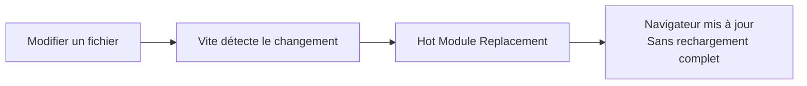

---
tags:
  - React
  - Débutant
  - Pratique
description: "Créer un projet React avec Vite et TypeScript, comprendre la structure des fichiers."
estimated_time: "60 min"
fiche_number: 2
total_fiches: 19
cursus: "React"
---

# 02 - Créer un projet React

> **En bref** : Créer un projet React avec Vite et TypeScript, comprendre chaque fichier de la structure générée et configurer l'environnement de développement. Lecture estimée : 60 min.

## Prérequis

- Fiche précédente : [01 - Introduction à React](01-introduction-react.md)
- Node.js 22 LTS installé
- npm fonctionnel
- VS Code installé

## Objectif de cette fiche

À la fin de cette fiche, tu sauras créer un projet React avec Vite, comprendre le rôle de chaque fichier généré et configurer ton environnement de développement.

---

## Concepts

### Qu'est-ce que Vite ?

**Définition** : Vite est un outil de build (bundler) rapide pour les projets JavaScript et TypeScript. Il remplace les anciens outils comme Webpack par une approche plus moderne et plus rapide.

**Le problème que Vite résout** :

Sans Vite, voici les problèmes rencontrés :

1. **Temps de démarrage long** : avec Webpack, démarrer le serveur de développement d'un gros projet peut prendre 30 secondes ou plus, car Webpack compile tous les fichiers avant de démarrer.
2. **Rechargement lent** : après une modification, Webpack doit recompiler une partie du projet, ce qui peut prendre plusieurs secondes.
3. **Configuration complexe** : Webpack nécessite un fichier de configuration détaillé (`webpack.config.js`) avec de nombreux plugins et loaders.

**Comment Vite résout ces problèmes** :

| Problème | Solution apportée par Vite |
| --- | --- |
| Temps de démarrage long | Vite utilise les modules ES natifs du navigateur et ne compile que ce qui est demandé |
| Rechargement lent | Le Hot Module Replacement (HMR) de Vite met à jour uniquement le module modifié en quelques millisecondes |
| Configuration complexe | Vite fonctionne avec une configuration minimale et des conventions par défaut |

**Analogie concrète** : Imagine une bibliothèque avec 10 000 livres. Webpack, c'est comme photocopier tous les livres avant d'ouvrir la bibliothèque. Vite, c'est comme ouvrir la bibliothèque immédiatement et ne sortir que le livre demandé par le lecteur.

**Ce que Vite n'est PAS** :

- Vite n'est pas un framework. C'est un outil de build qui fonctionne avec React, Vue, Svelte ou tout autre framework.
- Vite n'est pas nécessaire en production. En production, Vite utilise Rollup pour créer un bundle optimisé, puis Vite n'est plus impliqué.

**Comparaison Vite vs Webpack** :

| Vite | Webpack |
| --- | --- |
| Démarrage instantané | Démarrage lent sur les gros projets |
| HMR en millisecondes | HMR en secondes |
| Configuration minimale | Configuration détaillée nécessaire |
| Utilise les modules ES natifs | Compile tout en un bundle |
| Rollup pour le build de production | Webpack pour le build de production |

---

### Qu'est-ce que le template react-ts ?

**Définition** : Le template `react-ts` est un modèle de projet préconfiguré par Vite qui crée un projet React avec TypeScript, incluant tous les fichiers et configurations nécessaires pour commencer à développer.

**Le problème que le template résout** :

Sans template, voici les problèmes rencontrés :

1. **Configuration manuelle longue** : il faut installer React, ReactDOM, TypeScript, configurer le compilateur TypeScript, configurer Vite, créer la structure de fichiers.
2. **Risque d'erreurs de configuration** : une mauvaise configuration du `tsconfig.json` ou du `vite.config.ts` peut provoquer des erreurs difficiles à diagnostiquer.
3. **Temps perdu** : cette configuration initiale peut prendre 30 minutes à une heure, sans aucune ligne de code utile écrite.

**Comment le template résout ces problèmes** :

| Problème | Solution apportée par le template |
| --- | --- |
| Configuration manuelle longue | Tout est préconfiguré en une seule commande |
| Risque d'erreurs | Les configurations sont testées et fonctionnelles |
| Temps perdu | Le projet est prêt en moins d'une minute |

**Analogie concrète** : Le template est comme un kit de meuble IKEA. Toutes les pièces sont fournies avec un plan de montage. Sans template, c'est comme acheter les planches, les vis et les outils séparément dans des magasins différents, sans plan.

---

### Qu'est-ce que le fichier package.json ?

**Définition** : Le fichier `package.json` est le fichier central d'un projet Node.js. Il contient le nom du projet, sa version, ses dépendances (les bibliothèques utilisées) et ses scripts (les commandes disponibles).

**Structure du package.json d'un projet React** :

```json
{
  "name": "mon-projet-react",
  "private": true,
  "version": "0.0.0",
  "type": "module",
  "scripts": {
    "dev": "vite",
    "build": "tsc -b && vite build",
    "lint": "eslint .",
    "preview": "vite preview"
  },
  "dependencies": {
    "react": "^19.0.0",
    "react-dom": "^19.0.0"
  },
  "devDependencies": {
    "@eslint/js": "^9.0.0",
    "@types/react": "^19.0.0",
    "@types/react-dom": "^19.0.0",
    "@vitejs/plugin-react": "^4.0.0",
    "eslint": "^9.0.0",
    "eslint-plugin-react-hooks": "^5.0.0",
    "eslint-plugin-react-refresh": "^0.4.0",
    "globals": "^15.0.0",
    "typescript": "~7.0.0",
    "typescript-eslint": "^8.0.0",
    "vite": "^7.0.0"
  }
}
```

**Explication de chaque section** :

| Section | Rôle |
| --- | --- |
| `name` | Nom du projet |
| `private: true` | Empêche la publication accidentelle sur npm |
| `type: "module"` | Active les modules ES (import/export) |
| `scripts` | Commandes exécutables avec `npm run` |
| `dependencies` | Bibliothèques nécessaires en production (React) |
| `devDependencies` | Outils nécessaires uniquement pour le développement (TypeScript, Vite, ESLint) |

---

### Qu'est-ce que le fichier tsconfig.json ?

**Définition** : Le fichier `tsconfig.json` configure le compilateur TypeScript. Il définit quelles règles TypeScript appliquer, quels fichiers compiler et comment les compiler.

**Le problème que tsconfig.json résout** :

Sans configuration TypeScript explicite :

1. **Comportement imprévisible** : TypeScript utilise des options par défaut qui ne conviennent pas toujours à un projet React.
2. **Erreurs non détectées** : certaines vérifications importantes sont désactivées par défaut.
3. **JSX non supporté** : TypeScript ne sait pas par défaut comment gérer le JSX (la syntaxe HTML dans le JavaScript).

**Comment tsconfig.json résout ces problèmes** :

| Problème | Solution |
| --- | --- |
| Comportement imprévisible | Les options sont définies explicitement |
| Erreurs non détectées | Le mode `strict` active toutes les vérifications |
| JSX non supporté | L'option `jsx: "react-jsx"` active le support JSX |

---

## Étapes Pratiques

### Étape 1 : Créer le projet

```bash
# Crée un projet React + TypeScript avec Vite
# "mon-app" est le nom du dossier qui sera créé
npm create vite@latest mon-app -- --template react-ts
```

**Résultat attendu** :

```text
Scaffolding project in ./mon-app...

Done. Now run:

  cd mon-app
  npm install
  npm run dev
```

---

### Étape 2 : Installer les dépendances

```bash
# Entre dans le dossier du projet
cd mon-app

# Installe toutes les dépendances définies dans package.json
# Cela crée le dossier node_modules/ avec toutes les bibliothèques
npm install
```

**Résultat attendu** :

```text
added XXX packages in Xs
```

Le dossier `node_modules/` est maintenant créé. Il contient toutes les bibliothèques téléchargées. Ce dossier est volumineux (souvent 200+ Mo) et ne doit jamais être commité dans Git (il est listé dans `.gitignore`).

---

### Étape 3 : Explorer la structure du projet

```bash
# Affiche l'arborescence du projet (sans node_modules)
ls -la mon-app/
```

**Résultat attendu** :

```text
mon-app/
├── node_modules/          # Dépendances installées (ne pas toucher)
├── public/                # Fichiers statiques servis tels quels
│   └── vite.svg           # Logo Vite (favicon)
├── src/                   # Code source de l'application
│   ├── assets/            # Images et ressources
│   │   └── react.svg      # Logo React
│   ├── App.css            # Styles du composant App
│   ├── App.tsx            # Composant principal
│   ├── index.css          # Styles globaux
│   ├── main.tsx           # Point d'entrée de l'application
│   └── vite-env.d.ts      # Déclarations de types pour Vite
├── .gitignore             # Fichiers ignorés par Git
├── eslint.config.js       # Configuration ESLint
├── index.html             # Page HTML principale
├── package.json           # Dépendances et scripts
├── tsconfig.app.json      # Config TypeScript pour l'application
├── tsconfig.json          # Config TypeScript principale
├── tsconfig.node.json     # Config TypeScript pour les fichiers Node
└── vite.config.ts         # Configuration de Vite
```

---

### Étape 4 : Comprendre index.html

Ouvre le fichier `index.html` à la racine du projet :

```html
<!doctype html>
<html lang="en">
  <head>
    <meta charset="UTF-8" />
    <!-- Favicon affichée dans l'onglet du navigateur -->
    <link rel="icon" type="image/svg+xml" href="/vite.svg" />
    <meta name="viewport" content="width=device-width, initial-scale=1.0" />
    <title>Vite + React + TS</title>
  </head>
  <body>
    <!-- Ce div est le conteneur où React va injecter toute l'application -->
    <div id="root"></div>
    <!-- Vite charge le fichier TypeScript directement (il le compile à la volée) -->
    <script type="module" src="/src/main.tsx"></script>
  </body>
</html>
```

**Points importants** :

- Le `<div id="root">` est vide. C'est React qui va le remplir avec le contenu de l'application.
- Le `<script>` pointe vers `main.tsx`, pas vers un fichier JavaScript compilé. Vite gère la compilation en temps réel.

---

### Étape 5 : Comprendre main.tsx

Ouvre le fichier `src/main.tsx` :

```tsx
// Importe la fonction createRoot de ReactDOM
// createRoot est le point d'entrée pour afficher du React dans le navigateur
import { createRoot } from "react-dom/client";

// Importe les styles globaux
import "./index.css";

// Importe le composant principal de l'application
import App from "./App.tsx";

// Sélectionne l'élément HTML avec l'id "root" (le div dans index.html)
// Le "!" indique à TypeScript que cet élément existe forcément (non null)
// createRoot crée une racine React dans cet élément
// .render() affiche le composant App dans cette racine
createRoot(document.getElementById("root")!).render(<App />);
```

**Le flux complet** :

1. Le navigateur charge `index.html`
2. `index.html` charge `main.tsx` via la balise `<script>`
3. `main.tsx` sélectionne le `<div id="root">`
4. `main.tsx` crée une racine React et y rend le composant `<App />`
5. Le composant `App` retourne du JSX qui est affiché dans le navigateur

---

### Étape 6 : Comprendre App.tsx

Ouvre le fichier `src/App.tsx` :

```tsx
// Importe le hook useState pour gérer l'état local
import { useState } from "react";

// Importe les logos (fichiers SVG)
import reactLogo from "./assets/react.svg";
import viteLogo from "/vite.svg";

// Importe les styles spécifiques à ce composant
import "./App.css";

// Définit le composant App (c'est une fonction qui retourne du JSX)
function App() {
  // Crée une variable d'état "count" avec une valeur initiale de 0
  // setCount est la fonction qui permet de modifier cette valeur
  const [count, setCount] = useState(0);

  // Le composant retourne du JSX (la description de ce qui doit être affiché)
  return (
    <>
      <div>
        <a href="https://vite.dev" target="_blank">
          
        </a>
        <a href="https://react.dev" target="_blank">
          
        </a>
      </div>
      <h1>Vite + React</h1>
      <div className="card">
        <button onClick={() => setCount((count) => count + 1)}>
          count is {count}
        </button>
        <p>
          Edit <code>src/App.tsx</code> and save to test HMR
        </p>
      </div>
      <p className="read-the-docs">
        Click on the Vite and React logos to learn more
      </p>
    </>
  );
}

// Exporte le composant pour qu'il puisse être importé dans main.tsx
export default App;
```

---

### Étape 7 : Comprendre vite.config.ts

Ouvre le fichier `vite.config.ts` :

```typescript
// Importe la fonction defineConfig pour bénéficier de l'autocomplétion
import { defineConfig } from "vite";

// Importe le plugin React pour Vite
// Ce plugin permet à Vite de comprendre le JSX et d'activer le HMR pour React
import react from "@vitejs/plugin-react";

// Configuration de Vite
export default defineConfig({
  // Liste des plugins utilisés
  plugins: [react()],
});
```

Cette configuration est minimale. Le plugin `@vitejs/plugin-react` fait tout le travail :

- Il compile le JSX en JavaScript
- Il active le Hot Module Replacement pour les composants React
- Il gère les transformations TypeScript

---

### Étape 8 : Nettoyer le projet pour partir sur une base propre

Le diagramme suivant montre le pipeline HMR de Vite : quand tu modifies un fichier, Vite met à jour le navigateur sans rechargement complet.



Pour les exercices de ce cursus, on va nettoyer le projet par défaut.

Supprime les fichiers inutiles :

```bash
# Supprime les fichiers de style par défaut et les logos
rm src/App.css src/index.css src/assets/react.svg public/vite.svg
```

Remplace le contenu de `src/App.tsx` par un composant minimal :

```tsx
// src/App.tsx

// Composant principal de l'application
// Pour l'instant, il affiche un simple titre
function App() {
  return (
    <div>
      <h1>Mon application React</h1>
    </div>
  );
}

export default App;
```

Remplace le contenu de `src/main.tsx` pour retirer l'import CSS :

```tsx
// src/main.tsx
import { createRoot } from "react-dom/client";
import App from "./App.tsx";

// Monte le composant App dans le div#root de index.html
createRoot(document.getElementById("root")!).render(<App />);
```

---

### Étape 9 : Lancer et vérifier

```bash
# Lance le serveur de développement
npm run dev
```

**Résultat attendu** :

```text
  VITE v6.x.x  ready in XXX ms

  ➜  Local:   http://localhost:5173/
```

Ouvre `http://localhost:5173/` dans ton navigateur. Tu dois voir uniquement le titre "Mon application React" sur fond blanc.

---

## Commandes Utiles

| Commande | Action |
| --- | --- |
| `npm create vite@latest nom -- --template react-ts` | Crée un projet React + TypeScript |
| `npm install` | Installe les dépendances |
| `npm run dev` | Lance le serveur de développement (port 5173) |
| `npm run build` | Compile le projet pour la production |
| `npm run preview` | Prévisualise le build de production |
| `npm run lint` | Vérifie le code avec ESLint |
| `npx tsc --noEmit` | Vérifie les types TypeScript sans compiler |

---

## Pièges Fréquents

### Piège 1 : Oublier npm install

**Problème** : Lancer `npm run dev` immédiatement après `npm create vite@latest` sans faire `npm install`. Le serveur ne démarre pas car les dépendances ne sont pas installées.

**Solution** : Toujours exécuter `npm install` après la création du projet ou après un `git clone`.

```bash
# Toujours faire dans cet ordre :
cd mon-app
npm install
npm run dev
```

---

### Piège 2 : Modifier node_modules

**Problème** : Modifier un fichier dans `node_modules/` pour "corriger" un bug. Ces modifications sont perdues au prochain `npm install`.

**Solution** : Ne jamais modifier `node_modules/`. Si une bibliothèque a un bug, cherche une solution dans la configuration du projet ou utilise une version différente.

---

### Piège 3 : Commiter node_modules dans Git

**Problème** : Ajouter le dossier `node_modules/` dans Git. Ce dossier contient des centaines de Mo de fichiers et change à chaque installation.

**Solution** : Le fichier `.gitignore` généré par Vite exclut déjà `node_modules/`. Vérifie qu'il contient bien cette ligne :

```text
node_modules
```

---

### Piège 4 : Port 5173 déjà utilisé

**Problème** : Le message "Port 5173 is already in use" apparaît au lancement du serveur.

**Solution** : Un autre serveur Vite tourne déjà. Soit tu l'arrêtes (`Ctrl+C` dans son terminal), soit tu lances sur un autre port :

```bash
# Lance sur le port 3000 à la place
npm run dev -- --port 3000
```

---

## Checklist de Validation

- [ ] Je sais créer un projet React avec `npm create vite@latest`
- [ ] Je comprends le rôle de `index.html` (contient le `div#root`)
- [ ] Je comprends le rôle de `main.tsx` (point d'entrée, monte App dans le DOM)
- [ ] Je comprends le rôle de `App.tsx` (composant principal)
- [ ] Je comprends le rôle de `vite.config.ts` (configuration de Vite)
- [ ] Je comprends le rôle de `package.json` (dépendances et scripts)
- [ ] Je sais lancer le serveur de développement avec `npm run dev`
- [ ] J'ai nettoyé le projet pour partir sur une base propre

---

## Exercice Pratique

**Énoncé** : Crée un nouveau projet React avec Vite et TypeScript. Nettoie-le (supprime les styles et logos par défaut), puis crée un composant `App` qui affiche :

- Un titre `<h1>` : "Mon portfolio"
- Un paragraphe `<p>` : "Application créée avec React et TypeScript"
- Un pied de page `<footer>` avec l'année actuelle

**Indications** :

- Utilise `npm create vite@latest portfolio -- --template react-ts`
- Supprime les fichiers CSS et les logos par défaut
- Dans le JSX, tu peux écrire du JavaScript entre accolades : `{new Date().getFullYear()}`
- N'oublie pas d'exporter le composant avec `export default`

**Résultat attendu** : une page blanche avec le titre, le paragraphe et le pied de page affichant l'année.

---

## Solution de l'Exercice

> **Note** : Cette section contient la solution complète. Essaie d'abord de résoudre l'exercice par toi-même avant de consulter cette solution.

---

```bash
# Crée le projet
npm create vite@latest portfolio -- --template react-ts

# Entre dans le dossier et installe les dépendances
cd portfolio
npm install

# Nettoie les fichiers par défaut
rm src/App.css src/index.css src/assets/react.svg public/vite.svg
```

Modifie `src/main.tsx` :

```tsx
// src/main.tsx
import { createRoot } from "react-dom/client";
import App from "./App.tsx";

// Monte l'application dans le DOM
createRoot(document.getElementById("root")!).render(<App />);
```

Modifie `src/App.tsx` :

```tsx
// src/App.tsx

// Composant principal qui affiche un portfolio simple
function App() {
  return (
    <div>
      {/* Titre principal de la page */}
      <h1>Mon portfolio</h1>

      {/* Description de l'application */}
      <p>Application créée avec React et TypeScript</p>

      {/* Pied de page avec l'année courante */}
      {/* new Date().getFullYear() retourne l'année en cours (ex: 2026) */}
      <footer>
        <p>&copy; {new Date().getFullYear()} - Tous droits réservés</p>
      </footer>
    </div>
  );
}

// Exporte le composant pour qu'il soit importé dans main.tsx
export default App;
```

```bash
# Lance le serveur
npm run dev
```

**Résultat attendu dans le navigateur** :

```text
Mon portfolio

Application créée avec React et TypeScript

© 2026 - Tous droits réservés
```

---

## Navigation

← Fiche précédente : **[01 - Introduction à React](01-introduction-react.md)**

→ Fiche suivante : **[03 - JSX et composants](03-jsx-composants.md)**
