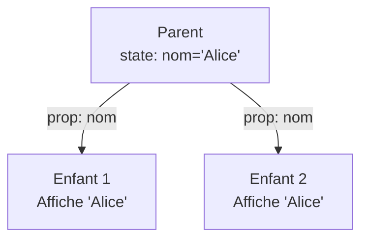

---
tags:
  - React
  - Débutant
  - Concept
description: "Comprendre les props, le children et la composition de composants React."
estimated_time: "75 min"
fiche_number: 4
total_fiches: 19
cursus: "React"
---

# 04 - Props et children

> **En bref** : Passer des données aux composants avec les props, utiliser children pour la composition et typer les props avec TypeScript. Lecture estimée : 75 min.

## Prérequis

- Fiche précédente : [03 - JSX et composants](03-jsx-composants.md)
- Connaître les interfaces TypeScript
- Savoir créer un composant fonctionnel React

## Objectif de cette fiche

À la fin de cette fiche, tu sauras passer des données à un composant via les props, utiliser `children` pour la composition et typer correctement les props avec TypeScript.

---

## Concepts

### Qu'est-ce que les props ?

**Définition** : Les props (abréviation de "properties") sont des données passées d'un composant parent à un composant enfant. Elles permettent de rendre un composant configurable et réutilisable.

**Le problème que les props résolvent** :

Sans props, voici les problèmes rencontrés :

1. **Composants figés** : un composant affiche toujours les mêmes données. Si tu veux afficher un bouton avec un texte différent, il faut créer un nouveau composant.
2. **Duplication de code** : pour afficher 3 cartes utilisateur avec des noms différents, il faut 3 composants quasi identiques.
3. **Impossible de personnaliser** : un composant ne peut pas s'adapter au contexte dans lequel il est utilisé.

**Comment les props résolvent ces problèmes** :

| Problème | Solution apportée par les props |
| --- | --- |
| Composants figés | Les props injectent des données différentes à chaque utilisation |
| Duplication de code | Un seul composant sert pour tous les cas, avec des props différentes |
| Impossible de personnaliser | Les props permettent de configurer le comportement et l'affichage |

**Analogie concrète** : Les props sont comme les ingrédients d'une recette. La recette (le composant) est la même, mais en changeant les ingrédients (les props), tu obtiens un plat différent. Une recette de crêpe avec du sucre donne une crêpe sucrée. La même recette avec du fromage donne une crêpe salée.

**Ce que les props ne sont PAS** :

- Les props ne sont pas modifiables par le composant enfant. Un composant reçoit des props en lecture seule. Si tu veux modifier une valeur, il faut utiliser l'état (fiche 05).
- Les props ne sont pas de l'état. L'état est géré à l'intérieur du composant. Les props viennent de l'extérieur (du parent).

---

### Qu'est-ce que children ?

**Définition** : `children` est une prop spéciale qui contient les éléments JSX placés entre les balises ouvrante et fermante d'un composant. C'est la base de la composition en React.

**Le problème que children résout** :

Sans children :

1. **Pas de composition** : impossible de créer un composant "conteneur" (comme une carte, une boîte de dialogue) qui enveloppe du contenu variable.
2. **Props complexes** : il faudrait passer le contenu via une prop comme `contenu={<p>Texte</p>}`, ce qui est moins lisible.

**Comment children résout ces problèmes** :

| Problème | Solution |
| --- | --- |
| Pas de composition | children permet d'imbriquer du JSX arbitraire dans un composant |
| Props complexes | La syntaxe est naturelle : on écrit le contenu entre les balises |

**Analogie concrète** : `children` est comme un cadre photo. Le cadre (le composant) est toujours le même, mais on peut y mettre n'importe quelle photo (le children). Le cadre fournit la bordure et le style, la photo fournit le contenu.

**Ce que children n'est PAS** :

- children n'est pas une prop "normale". Contrairement aux autres props passées comme attributs (`<Composant nom="valeur">`), children est passé entre les balises (`<Composant>contenu</Composant>`).
- children n'est pas limité à du texte. children peut contenir du texte, des éléments JSX, d'autres composants, ou même un tableau d'éléments.

---

### Qu'est-ce que le destructuring des props ?

**Définition** : Le destructuring des props est une technique JavaScript qui consiste à extraire directement les propriétés d'un objet dans des variables séparées, au lieu d'accéder à chaque propriété via `props.nom`.

**Le problème que le destructuring résout** :

Sans destructuring :

1. **Code verbeux** : il faut écrire `props.nom`, `props.age`, `props.email` à chaque utilisation.
2. **Lisibilité réduite** : le préfixe `props.` alourdit le JSX.

**Comment le destructuring résout ces problèmes** :

| Problème | Solution |
| --- | --- |
| Code verbeux | On écrit directement `nom`, `age`, `email` |
| Lisibilité réduite | Le JSX est plus propre et plus court |

```tsx
// ❌ Sans destructuring : verbeux
function Profil(props: { nom: string; age: number }) {
  return (
    <div>
      <p>{props.nom}</p>
      <p>{props.age} ans</p>
    </div>
  );
}

// ✅ Avec destructuring : concis
function Profil({ nom, age }: { nom: string; age: number }) {
  return (
    <div>
      <p>{nom}</p>
      <p>{age} ans</p>
    </div>
  );
}
```

---

### Qu'est-ce que les props par défaut ?

**Définition** : Les props par défaut sont des valeurs attribuées automatiquement à une prop quand le composant parent ne la fournit pas. En TypeScript, on utilise la syntaxe de valeur par défaut du destructuring.

**Le problème que les props par défaut résolvent** :

Sans props par défaut :

1. **Erreur si la prop manque** : le composant reçoit `undefined`, ce qui peut provoquer une erreur ou un affichage incorrect.
2. **Vérifications manuelles** : il faut écrire `const valeur = props.couleur || "bleu"` dans le corps du composant.

**Comment les props par défaut résolvent ces problèmes** :

| Problème | Solution |
| --- | --- |
| Erreur si la prop manque | La valeur par défaut est utilisée automatiquement |
| Vérifications manuelles | La valeur par défaut est dans la signature de la fonction |

```tsx
// La prop "variante" a une valeur par défaut de "primaire"
// Si le parent ne passe pas cette prop, elle vaut "primaire"
function Bouton({ texte, variante = "primaire" }: {
  texte: string;
  variante?: string;  // Le ? rend la prop optionnelle
}) {
  return <button className={variante}>{texte}</button>;
}

// Utilisation :
<Bouton texte="Valider" />                    // variante = "primaire"
<Bouton texte="Annuler" variante="danger" />  // variante = "danger"
```

---

## Étapes Pratiques

### Étape 1 : Créer un composant avec des props typées

Crée `src/components/Carte.tsx` :

```tsx
// src/components/Carte.tsx

// Définit l'interface des props que le composant accepte
// C'est le contrat : le parent DOIT fournir ces données
interface CarteProps {
  titre: string;        // Obligatoire : le titre de la carte
  description: string;  // Obligatoire : la description
  image?: string;       // Optionnel : URL d'une image (le ? rend la prop optionnelle)
}

// Le composant reçoit les props en paramètre
// On destructure directement pour accéder aux valeurs
function Carte({ titre, description, image }: CarteProps) {
  return (
    <div style={{ border: "1px solid #ccc", padding: "16px", margin: "8px" }}>
      {/* Affiche l'image seulement si la prop est fournie */}
      {image && }

      <h2>{titre}</h2>
      <p>{description}</p>
    </div>
  );
}

export default Carte;
```

---

### Étape 2 : Utiliser le composant avec différentes props

Modifie `src/App.tsx` :

```tsx
// src/App.tsx
import Carte from "./components/Carte";

function App() {
  return (
    <div>
      <h1>Mes projets</h1>

      {/* Chaque carte reçoit des props différentes */}
      {/* Le même composant Carte est réutilisé 3 fois */}
      <Carte
        titre="Site Portfolio"
        description="Mon site personnel en React et TypeScript."
      />

      <Carte
        titre="API REST"
        description="Backend Symfony avec PostgreSQL."
        image="https://exemple.com/api.png"
      />

      <Carte
        titre="Application Mobile"
        description="App React Native pour la gestion de tâches."
      />
    </div>
  );
}

export default App;
```

**Résultat attendu** : trois cartes avec des titres et descriptions différents. Seule la deuxième carte affiche une image.

---

### Étape 3 : Créer un composant avec children

Crée `src/components/Encadre.tsx` :

```tsx
// src/components/Encadre.tsx
import { ReactNode } from "react";

// ReactNode est le type TypeScript qui représente tout ce qui peut être
// affiché dans du JSX : texte, éléments, composants, tableaux, null...
interface EncadreProps {
  titre: string;
  couleur?: string;           // Optionnel, avec valeur par défaut
  children: ReactNode;        // Le contenu entre les balises
}

// children reçoit tout ce qui est placé entre <Encadre> et </Encadre>
function Encadre({ titre, couleur = "#0066cc", children }: EncadreProps) {
  return (
    <div
      style={{
        border: `2px solid ${couleur}`,
        borderRadius: "8px",
        padding: "16px",
        margin: "16px 0",
      }}
    >
      {/* Le titre est une prop normale */}
      <h3 style={{ color: couleur, marginTop: 0 }}>{titre}</h3>

      {/* children affiche tout le contenu passé entre les balises */}
      {children}
    </div>
  );
}

export default Encadre;
```

Utilise ce composant dans `App.tsx` :

```tsx
// src/App.tsx
import Encadre from "./components/Encadre";

function App() {
  return (
    <div>
      {/* Le contenu entre les balises est passé comme children */}
      <Encadre titre="Information">
        <p>Ceci est un message informatif.</p>
        <p>Tu peux mettre autant d'éléments que tu veux.</p>
      </Encadre>

      {/* Même composant, contenu et couleur différents */}
      <Encadre titre="Attention" couleur="#cc6600">
        <p>Ce composant est réutilisable avec n'importe quel contenu.</p>
        <ul>
          <li>Texte</li>
          <li>Listes</li>
          <li>Autres composants</li>
        </ul>
      </Encadre>
    </div>
  );
}

export default App;
```

**Résultat attendu** : deux encadrés avec des bordures colorées, des titres et des contenus différents.

---

Le diagramme suivant illustre le flux unidirectionnel des props : le parent transmet les données aux enfants.



### Étape 4 : Passer des fonctions comme props

Crée `src/components/Bouton.tsx` :

```tsx
// src/components/Bouton.tsx

interface BoutonProps {
  texte: string;
  // Une prop peut être une fonction
  // Ici, onClick est une fonction qui ne prend aucun paramètre et ne retourne rien
  onClick: () => void;
  variante?: "primaire" | "secondaire" | "danger";
}

function Bouton({ texte, onClick, variante = "primaire" }: BoutonProps) {
  // Définit les couleurs selon la variante
  const couleurs: Record<string, string> = {
    primaire: "#0066cc",
    secondaire: "#666666",
    danger: "#cc0000",
  };

  return (
    <button
      onClick={onClick}
      style={{
        backgroundColor: couleurs[variante],
        color: "white",
        padding: "8px 16px",
        border: "none",
        borderRadius: "4px",
        cursor: "pointer",
        marginRight: "8px",
      }}
    >
      {texte}
    </button>
  );
}

export default Bouton;
```

Utilise ce composant :

```tsx
// src/App.tsx
import Bouton from "./components/Bouton";

function App() {
  // Les fonctions passées en props sont définies dans le parent
  const handleSauvegarder = () => {
    console.log("Sauvegardé !");
  };

  const handleAnnuler = () => {
    console.log("Annulé !");
  };

  const handleSupprimer = () => {
    console.log("Supprimé !");
  };

  return (
    <div>
      <h1>Actions</h1>

      {/* Chaque bouton reçoit une fonction différente via onClick */}
      <Bouton texte="Sauvegarder" onClick={handleSauvegarder} />
      <Bouton texte="Annuler" onClick={handleAnnuler} variante="secondaire" />
      <Bouton texte="Supprimer" onClick={handleSupprimer} variante="danger" />
    </div>
  );
}

export default App;
```

**Résultat attendu** : trois boutons de couleurs différentes. Cliquer sur chacun affiche un message dans la console du navigateur.

---

### Étape 5 : Composition avancée avec children

Crée `src/components/Disposition.tsx` :

```tsx
// src/components/Disposition.tsx
import { ReactNode } from "react";

// Composant de mise en page qui fournit une structure commune
interface DispositionProps {
  children: ReactNode;
}

function Disposition({ children }: DispositionProps) {
  return (
    <div style={{ maxWidth: "800px", margin: "0 auto", padding: "20px" }}>
      <header style={{ borderBottom: "2px solid #333", paddingBottom: "10px" }}>
        <h1>Mon Application</h1>
      </header>

      {/* Le contenu spécifique à chaque page est injecté ici */}
      <main style={{ padding: "20px 0" }}>
        {children}
      </main>

      <footer style={{ borderTop: "1px solid #ccc", paddingTop: "10px" }}>
        <p>&copy; 2026</p>
      </footer>
    </div>
  );
}

export default Disposition;
```

Utilise ce layout dans `App.tsx` :

```tsx
// src/App.tsx
import Disposition from "./components/Disposition";
import Carte from "./components/Carte";

function App() {
  return (
    // Disposition fournit le header, le main et le footer
    // Le contenu spécifique est passé comme children
    <Disposition>
      <h2>Bienvenue</h2>
      <Carte titre="Premier projet" description="Description ici" />
      <Carte titre="Deuxième projet" description="Autre description" />
    </Disposition>
  );
}

export default App;
```

**Résultat attendu** : une page avec un header fixe, un footer fixe, et le contenu (titre + cartes) entre les deux.

---

### Étape 6 : Interface avec héritage pour les props

```tsx
// src/components/BoutonIcone.tsx

// L'interface hérite de BoutonProps et ajoute de nouvelles props
interface BoutonIconeProps {
  texte: string;
  onClick: () => void;
  icone: string;         // Emoji ou caractère pour l'icône
  position?: "gauche" | "droite";
}

function BoutonIcone({
  texte,
  onClick,
  icone,
  position = "gauche",
}: BoutonIconeProps) {
  return (
    <button onClick={onClick} style={{ padding: "8px 16px", cursor: "pointer" }}>
      {/* Affiche l'icône avant ou après le texte selon la position */}
      {position === "gauche" && <span>{icone} </span>}
      {texte}
      {position === "droite" && <span> {icone}</span>}
    </button>
  );
}

export default BoutonIcone;
```

---

## Commandes Utiles

| Commande | Action |
| --- | --- |
| `npx tsc --noEmit` | Vérifie que les types des props sont corrects |
| `npm run dev` | Lance le serveur de développement |
| `npm run lint` | Vérifie le code avec ESLint |

---

## Pièges Fréquents

### Piège 1 : Oublier de typer les props

**Problème** : Ne pas définir d'interface TypeScript pour les props. Le composant accepte n'importe quoi et les erreurs ne sont détectées qu'à l'exécution.

**Solution** : Toujours définir une interface pour les props.

```tsx
// ❌ Pas de typage : aucune vérification
function Carte(props: any) {
  return <h2>{props.titre}</h2>;
}

// ✅ Props typées : erreurs détectées à la compilation
interface CarteProps {
  titre: string;
}

function Carte({ titre }: CarteProps) {
  return <h2>{titre}</h2>;
}
```

---

### Piège 2 : Modifier les props dans le composant enfant

**Problème** : Tenter de modifier une prop reçue. React interdit la modification des props (elles sont en lecture seule).

**Solution** : Si tu dois modifier une valeur, utilise l'état local (fiche 05). Les props servent uniquement à recevoir des données.

```tsx
// ❌ Erreur : on ne peut pas modifier une prop
function Compteur({ valeur }: { valeur: number }) {
  valeur = valeur + 1; // Interdit !
  return <p>{valeur}</p>;
}

// ✅ Correct : on utilise la prop en lecture seule
function Compteur({ valeur }: { valeur: number }) {
  return <p>{valeur}</p>;
}
```

---

### Piège 3 : Oublier la prop obligatoire

**Problème** : Ne pas passer une prop obligatoire au composant. TypeScript affiche une erreur mais le message peut être confus.

**Solution** : Lis le message d'erreur TypeScript. Il indique quelle prop manque.

```tsx
interface CarteProps {
  titre: string;      // Obligatoire
  description: string; // Obligatoire
}

// ❌ Erreur TypeScript : "description" est manquant
<Carte titre="Mon titre" />

// ✅ Correct : toutes les props obligatoires sont fournies
<Carte titre="Mon titre" description="Ma description" />
```

---

### Piège 4 : Confondre children et une prop

**Problème** : Passer du contenu comme une prop au lieu d'utiliser children, ce qui rend le code moins lisible.

**Solution** : Utilise children quand le contenu est du JSX complexe.

```tsx
// ❌ Moins lisible : contenu passé comme prop
<Encadre titre="Info" contenu={<><p>Ligne 1</p><p>Ligne 2</p></>} />

// ✅ Plus lisible : contenu passé comme children
<Encadre titre="Info">
  <p>Ligne 1</p>
  <p>Ligne 2</p>
</Encadre>
```

---

## Checklist de Validation

- [ ] Je sais ce que sont les props et à quoi elles servent
- [ ] Je sais typer les props avec une interface TypeScript
- [ ] Je sais utiliser le destructuring des props
- [ ] Je sais définir des props optionnelles avec des valeurs par défaut
- [ ] Je sais passer des fonctions comme props
- [ ] Je comprends children et je sais créer un composant conteneur
- [ ] Je sais que les props sont en lecture seule

---

## Exercice Pratique

**Énoncé** : Crée un système de notification réutilisable avec les composants suivants :

1. Un composant `Notification` qui accepte les props :
   - `type` : "succès" | "erreur" | "info" (obligatoire)
   - `children` : le contenu du message (obligatoire)
   - `fermable` : booléen optionnel (par défaut `false`), affiche un bouton "X" si `true`

2. Un composant `App` qui utilise `Notification` pour afficher :
   - Une notification de succès : "Fichier sauvegardé avec succès"
   - Une notification d'erreur fermable : "Connexion au serveur impossible"
   - Une notification d'information : "Nouvelle mise à jour disponible"

**Indications** :

- Utilise des couleurs de fond différentes selon le type (vert, rouge, bleu)
- Le bouton "X" ne doit afficher qu'un `console.log` pour l'instant
- Utilise `children` pour le contenu du message
- Type les props avec une interface

**Résultat attendu** : trois notifications empilées avec des couleurs différentes et un bouton X sur celle du milieu.

---

## Solution de l'Exercice

> **Note** : Cette section contient la solution complète. Essaie d'abord de résoudre l'exercice par toi-même avant de consulter cette solution.

---

`src/components/Notification.tsx` :

```tsx
// src/components/Notification.tsx
import { ReactNode } from "react";

// Définit les types possibles pour la notification
type TypeNotification = "succes" | "erreur" | "info";

interface NotificationProps {
  type: TypeNotification;        // Le type détermine la couleur
  children: ReactNode;           // Le contenu du message
  fermable?: boolean;            // Optionnel, false par défaut
}

function Notification({ type, children, fermable = false }: NotificationProps) {
  // Associe chaque type à une couleur de fond
  const couleurs: Record<TypeNotification, string> = {
    succes: "#d4edda",  // Vert clair
    erreur: "#f8d7da",  // Rouge clair
    info: "#d1ecf1",    // Bleu clair
  };

  // Associe chaque type à une couleur de texte
  const couleursTexte: Record<TypeNotification, string> = {
    succes: "#155724",
    erreur: "#721c24",
    info: "#0c5460",
  };

  // Associe chaque type à un préfixe
  const prefixes: Record<TypeNotification, string> = {
    succes: "Succès",
    erreur: "Erreur",
    info: "Info",
  };

  return (
    <div
      style={{
        backgroundColor: couleurs[type],
        color: couleursTexte[type],
        padding: "12px 16px",
        borderRadius: "4px",
        margin: "8px 0",
        display: "flex",
        justifyContent: "space-between",
        alignItems: "center",
      }}
    >
      <div>
        <strong>{prefixes[type]} :</strong> {children}
      </div>

      {/* Le bouton X n'est affiché que si fermable est true */}
      {fermable && (
        <button
          onClick={() => console.log("Fermeture demandée")}
          style={{
            background: "none",
            border: "none",
            color: couleursTexte[type],
            fontSize: "18px",
            cursor: "pointer",
          }}
        >
          X
        </button>
      )}
    </div>
  );
}

export default Notification;
```

`src/App.tsx` :

```tsx
// src/App.tsx
import Notification from "./components/Notification";

function App() {
  return (
    <div style={{ maxWidth: "600px", margin: "20px auto" }}>
      <h1>Notifications</h1>

      {/* Notification de succès (sans bouton X) */}
      <Notification type="succes">
        Fichier sauvegardé avec succès
      </Notification>

      {/* Notification d'erreur (avec bouton X) */}
      <Notification type="erreur" fermable>
        Connexion au serveur impossible
      </Notification>

      {/* Notification d'information (sans bouton X) */}
      <Notification type="info">
        Nouvelle mise à jour disponible
      </Notification>
    </div>
  );
}

export default App;
```

---

## Navigation

← Fiche précédente : **[03 - JSX et composants](03-jsx-composants.md)**

→ Fiche suivante : **[05 - État avec useState](05-etat-usestate.md)**
