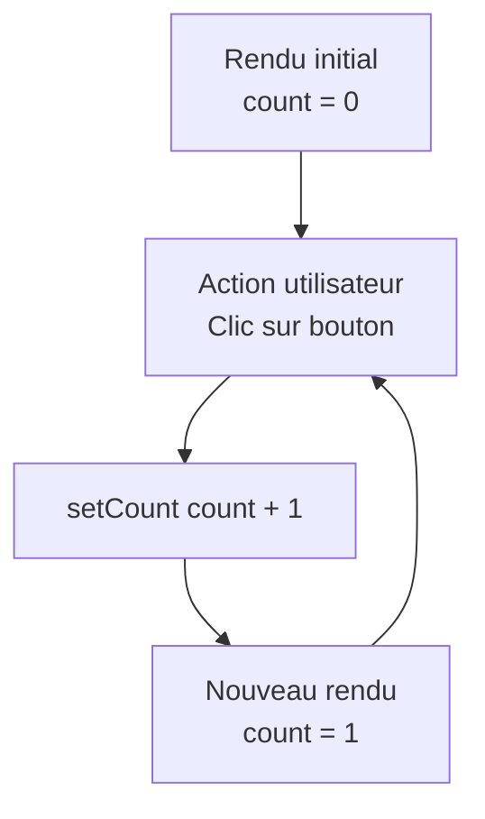

---
tags:
  - React
  - Intermédiaire
  - Concept
description: "Gérer l'état local d'un composant avec le hook useState."
estimated_time: "90 min"
fiche_number: 5
total_fiches: 19
cursus: "React"
---

# 05 - État avec useState

> **En bref** : Comprendre le concept d'état, utiliser useState pour gérer des données dynamiques et maîtriser l'immutabilité. Lecture estimée : 90 min.

## Prérequis

- Fiche précédente : [04 - Props et children](04-props-children.md)
- Connaître les types TypeScript (string, number, boolean, tableaux, objets)
- Savoir créer un composant fonctionnel avec des props

## Objectif de cette fiche

À la fin de cette fiche, tu sauras utiliser `useState` pour créer des composants interactifs dont l'affichage change en réponse aux actions de l'utilisateur.

---

## Concepts

### Qu'est-ce que l'état (state) ?

**Définition** : L'état (state) est un ensemble de données internes à un composant qui, lorsqu'elles changent, déclenchent un nouveau rendu (re-render) du composant. C'est ce qui rend un composant interactif.

**Le problème que l'état résout** :

Sans état, voici les problèmes rencontrés :

1. **Interface statique** : un composant affiche toujours les mêmes données. Un clic sur un bouton ne change rien à l'affichage.
2. **Variables normales ignorées par React** : si tu utilises une variable `let compteur = 0` et que tu l'incrémentes, React ne sait pas que la variable a changé et ne met pas à jour l'affichage.
3. **Pas de mémoire entre les rendus** : une variable `let` est réinitialisée à chaque fois que React re-rend le composant.

**Comment l'état résout ces problèmes** :

| Problème | Solution apportée par l'état |
| --- | --- |
| Interface statique | Modifier l'état déclenche un re-render automatique |
| Variables ignorées par React | useState crée des variables que React surveille |
| Pas de mémoire entre les rendus | L'état persiste entre les rendus du composant |

**Analogie concrète** : L'état est comme le tableau de score dans un match de sport. Quand un joueur marque un point, le score (l'état) change et le tableau d'affichage (l'interface) se met à jour automatiquement. Une variable `let` serait comme noter le score sur un post-it que l'on jette et réécrit à chaque minute.

**Ce que l'état n'est PAS** :

- L'état n'est pas une prop. Les props viennent du parent (données externes). L'état est géré à l'intérieur du composant (données internes).
- L'état n'est pas global par défaut. Chaque composant a son propre état indépendant. Pour partager l'état, il faut le remonter au parent commun (fiche 10).

**Comparaison props vs état** :

| Props | État (state) |
| --- | --- |
| Viennent du parent | Géré à l'intérieur du composant |
| Lecture seule | Modifiable via le setter |
| Le parent contrôle la valeur | Le composant contrôle sa propre valeur |
| Passées comme attributs | Créé avec useState |

---

### Qu'est-ce que useState ?

**Définition** : `useState` est un hook React qui permet de déclarer une variable d'état dans un composant fonctionnel. Il retourne un tableau avec deux éléments : la valeur actuelle et une fonction pour la modifier.

**Le problème que useState résout** :

Sans useState :

1. **Pas de moyen déclaratif** : avant les hooks (React < 16.8), il fallait utiliser des composants de classe avec `this.state` et `this.setState`, ce qui était verbeux.
2. **Variables perdues au re-render** : une variable `let` est réinitialisée à chaque rendu.

**Comment useState résout ces problèmes** :

| Problème | Solution |
| --- | --- |
| Pas de moyen déclaratif | `useState` est simple et direct |
| Variables perdues au re-render | React conserve la valeur de l'état entre les rendus |

Le schéma suivant illustre le cycle de re-rendu déclenché par `useState` :



**Syntaxe de base** :

```tsx
// Importe le hook
import { useState } from "react";

function Composant() {
  // Déclare une variable d'état "compteur" avec une valeur initiale de 0
  // setCompteur est la fonction pour modifier la valeur
  const [compteur, setCompteur] = useState(0);
  //     ^^^^^^^^  ^^^^^^^^^^^              ^
  //     valeur    setter         valeur initiale
  //     actuelle  (modificateur)

  return <p>{compteur}</p>;
}
```

**Règles de nommage** :

- La variable d'état : nom descriptif en camelCase (`compteur`, `estVisible`, `utilisateur`)
- Le setter : `set` + nom de la variable avec majuscule (`setCompteur`, `setEstVisible`, `setUtilisateur`)

---

### Qu'est-ce que l'immutabilité ?

**Définition** : L'immutabilité est le principe selon lequel on ne modifie jamais directement une valeur existante. On crée toujours une nouvelle valeur à partir de l'ancienne. C'est une règle fondamentale en React pour la gestion de l'état.

**Le problème que l'immutabilité résout** :

Sans immutabilité :

1. **React ne détecte pas les changements** : si tu modifies un objet ou un tableau directement (mutation), React ne sait pas que la valeur a changé car la référence en mémoire est la même.
2. **Bugs silencieux** : l'état semble changer dans le code mais l'affichage ne se met pas à jour.
3. **Effets de bord** : modifier directement un objet peut affecter d'autres parties du code qui référencent le même objet.

**Comment l'immutabilité résout ces problèmes** :

| Problème | Solution |
| --- | --- |
| React ne détecte pas les changements | Créer un nouvel objet/tableau change la référence, React détecte le changement |
| Bugs silencieux | Le re-render se déclenche correctement |
| Effets de bord | L'ancien objet n'est pas modifié |

**Analogie concrète** : L'immutabilité est comme corriger un document officiel. Tu ne ratures jamais le document original. Tu crées une nouvelle version du document avec la correction, et tu archives l'ancienne version. De cette façon, on peut toujours comparer les versions.

```tsx
// ❌ Mutation directe : React ne détecte PAS le changement
const [utilisateur, setUtilisateur] = useState({ nom: "John", age: 25 });
utilisateur.age = 26;           // Modifie l'objet existant
setUtilisateur(utilisateur);    // Même référence = pas de re-render

// ✅ Immutabilité : React détecte le changement
setUtilisateur({ ...utilisateur, age: 26 });
// Crée un NOUVEL objet avec toutes les propriétés de l'ancien + age modifié
```

---

## Étapes Pratiques

### Étape 1 : Créer un compteur simple

Crée `src/components/Compteur.tsx` :

```tsx
// src/components/Compteur.tsx
import { useState } from "react";

// Composant compteur interactif
function Compteur() {
  // Déclare un état "compte" initialisé à 0
  // setCompte est la seule façon de modifier cette valeur
  const [compte, setCompte] = useState(0);

  return (
    <div>
      <h2>Compteur : {compte}</h2>

      {/* Au clic, on appelle setCompte avec la nouvelle valeur */}
      <button onClick={() => setCompte(compte + 1)}>
        + 1
      </button>

      <button onClick={() => setCompte(compte - 1)}>
        - 1
      </button>

      {/* Remet le compteur à 0 */}
      <button onClick={() => setCompte(0)}>
        Réinitialiser
      </button>
    </div>
  );
}

export default Compteur;
```

**Résultat attendu** : un compteur qui s'incrémente, se décrémente et se remet à zéro au clic.

---

### Étape 2 : Utiliser useState avec un booléen

Crée `src/components/Bascule.tsx` :

```tsx
// src/components/Bascule.tsx
import { useState } from "react";

// Composant qui bascule entre deux états (visible/caché)
function Bascule() {
  // État booléen : true = visible, false = caché
  const [estVisible, setEstVisible] = useState(false);

  return (
    <div>
      {/* Le texte du bouton change selon l'état */}
      <button onClick={() => setEstVisible(!estVisible)}>
        {estVisible ? "Masquer" : "Afficher"}
      </button>

      {/* Le paragraphe n'est affiché que si estVisible est true */}
      {estVisible && (
        <p style={{ marginTop: "10px", padding: "10px", backgroundColor: "#f0f0f0" }}>
          Ce contenu est maintenant visible. Clique sur le bouton pour le masquer.
        </p>
      )}
    </div>
  );
}

export default Bascule;
```

**Résultat attendu** : un bouton "Afficher" qui, au clic, affiche un paragraphe et change son texte en "Masquer".

---

### Étape 3 : Utiliser useState avec une chaîne de caractères

Crée `src/components/Salutation.tsx` :

```tsx
// src/components/Salutation.tsx
import { useState } from "react";

// Composant qui met à jour un message de salutation
function Salutation() {
  // État de type string, initialisé avec une chaîne vide
  const [nom, setNom] = useState("");

  return (
    <div>
      <label htmlFor="nom">Ton prénom : </label>
      {/* L'input est contrôlé par React : sa valeur vient de l'état */}
      <input
        id="nom"
        type="text"
        value={nom}
        // onChange est déclenché à chaque frappe de touche
        // e.target.value contient la valeur actuelle de l'input
        onChange={(e) => setNom(e.target.value)}
      />

      {/* Affiche le message seulement si un nom est saisi */}
      {nom.length > 0 && (
        <p>Bonjour {nom} !</p>
      )}
    </div>
  );
}

export default Salutation;
```

**Résultat attendu** : un champ de texte qui affiche "Bonjour [prénom] !" en temps réel pendant la saisie.

---

### Étape 4 : Gérer un état avec un objet

Crée `src/components/FormulaireContact.tsx` :

```tsx
// src/components/FormulaireContact.tsx
import { useState } from "react";

// Interface qui définit la structure de l'état
interface Contact {
  nom: string;
  email: string;
  message: string;
}

function FormulaireContact() {
  // L'état est un objet avec trois propriétés
  const [contact, setContact] = useState<Contact>({
    nom: "",
    email: "",
    message: "",
  });

  // Fonction qui met à jour une propriété spécifique de l'objet
  // Sans muter l'objet existant (respect de l'immutabilité)
  const mettreAJour = (champ: keyof Contact, valeur: string) => {
    setContact({
      ...contact,      // Copie toutes les propriétés existantes
      [champ]: valeur,  // Remplace la propriété spécifiée
    });
  };

  return (
    <div>
      <h2>Formulaire de contact</h2>

      <div>
        <label htmlFor="nom">Nom :</label>
        <br />
        <input
          id="nom"
          type="text"
          value={contact.nom}
          onChange={(e) => mettreAJour("nom", e.target.value)}
        />
      </div>

      <div>
        <label htmlFor="email">Email :</label>
        <br />
        <input
          id="email"
          type="email"
          value={contact.email}
          onChange={(e) => mettreAJour("email", e.target.value)}
        />
      </div>

      <div>
        <label htmlFor="message">Message :</label>
        <br />
        <textarea
          id="message"
          value={contact.message}
          onChange={(e) => mettreAJour("message", e.target.value)}
        />
      </div>

      {/* Affiche un résumé des données saisies */}
      <h3>Résumé :</h3>
      <pre>{JSON.stringify(contact, null, 2)}</pre>
    </div>
  );
}

export default FormulaireContact;
```

**Résultat attendu** : un formulaire qui affiche en temps réel un résumé JSON des données saisies.

---

### Étape 5 : Gérer un état avec un tableau

Crée `src/components/ListeTaches.tsx` :

```tsx
// src/components/ListeTaches.tsx
import { useState } from "react";

// Interface pour une tâche
interface Tache {
  id: number;
  texte: string;
  terminee: boolean;
}

function ListeTaches() {
  // État : tableau de tâches
  const [taches, setTaches] = useState<Tache[]>([]);

  // État pour le champ de saisie
  const [nouvelleTache, setNouvelleTache] = useState("");

  // Ajoute une tâche au tableau (immutabilité : on crée un nouveau tableau)
  const ajouterTache = () => {
    // Ignore si le champ est vide
    if (nouvelleTache.trim() === "") return;

    const tache: Tache = {
      id: Date.now(),             // Utilise le timestamp comme identifiant unique
      texte: nouvelleTache.trim(),
      terminee: false,
    };

    // Crée un nouveau tableau avec toutes les tâches existantes + la nouvelle
    setTaches([...taches, tache]);

    // Vide le champ de saisie
    setNouvelleTache("");
  };

  // Bascule l'état terminée d'une tâche
  const basculerTache = (id: number) => {
    // map() crée un nouveau tableau
    // Pour chaque tâche, si c'est celle qu'on cherche, on inverse "terminee"
    setTaches(
      taches.map((tache) =>
        tache.id === id
          ? { ...tache, terminee: !tache.terminee }  // Nouveau objet
          : tache                                      // Inchangé
      )
    );
  };

  // Supprime une tâche du tableau
  const supprimerTache = (id: number) => {
    // filter() crée un nouveau tableau sans la tâche supprimée
    setTaches(taches.filter((tache) => tache.id !== id));
  };

  return (
    <div>
      <h2>Liste de tâches ({taches.length})</h2>

      <div>
        <input
          type="text"
          value={nouvelleTache}
          onChange={(e) => setNouvelleTache(e.target.value)}
          placeholder="Nouvelle tâche..."
          // Permet d'ajouter avec la touche Entrée
          onKeyDown={(e) => e.key === "Enter" && ajouterTache()}
        />
        <button onClick={ajouterTache}>Ajouter</button>
      </div>

      {/* Affiche un message si la liste est vide */}
      {taches.length === 0 && <p>Aucune tâche pour le moment.</p>}

      <ul style={{ listStyle: "none", padding: 0 }}>
        {taches.map((tache) => (
          <li
            key={tache.id}
            style={{
              padding: "8px",
              margin: "4px 0",
              backgroundColor: tache.terminee ? "#d4edda" : "#fff",
              textDecoration: tache.terminee ? "line-through" : "none",
            }}
          >
            {/* Checkbox pour basculer l'état */}
            <input
              type="checkbox"
              checked={tache.terminee}
              onChange={() => basculerTache(tache.id)}
            />
            {tache.texte}
            <button
              onClick={() => supprimerTache(tache.id)}
              style={{ marginLeft: "8px", color: "red" }}
            >
              Supprimer
            </button>
          </li>
        ))}
      </ul>
    </div>
  );
}

export default ListeTaches;
```

**Résultat attendu** : une liste de tâches interactive avec ajout, complétion et suppression.

---

### Étape 6 : Utiliser le setter avec une fonction

```tsx
// src/components/CompteurFonctionnel.tsx
import { useState } from "react";

function CompteurFonctionnel() {
  const [compte, setCompte] = useState(0);

  // ❌ Problème : si on appelle setCompte 3 fois d'affilée,
  // chaque appel utilise la même valeur de "compte" (celle du rendu actuel)
  const incrementerTroisFoisMauvais = () => {
    setCompte(compte + 1); // compte = 0, donc 0 + 1 = 1
    setCompte(compte + 1); // compte = 0, donc 0 + 1 = 1
    setCompte(compte + 1); // compte = 0, donc 0 + 1 = 1
    // Résultat : compte = 1 (au lieu de 3)
  };

  // ✅ Solution : utiliser la forme fonctionnelle du setter
  // La fonction reçoit la valeur la plus récente en paramètre
  const incrementerTroisFoisCorrect = () => {
    setCompte((precedent) => precedent + 1); // 0 + 1 = 1
    setCompte((precedent) => precedent + 1); // 1 + 1 = 2
    setCompte((precedent) => precedent + 1); // 2 + 1 = 3
    // Résultat : compte = 3
  };

  return (
    <div>
      <h2>Compteur : {compte}</h2>
      <button onClick={incrementerTroisFoisMauvais}>
        +3 (mauvais)
      </button>
      <button onClick={incrementerTroisFoisCorrect}>
        +3 (correct)
      </button>
    </div>
  );
}

export default CompteurFonctionnel;
```

**Règle** : utilise la forme fonctionnelle `setValeur((precedent) => ...)` quand la nouvelle valeur dépend de l'ancienne.

---

## Commandes Utiles

| Commande | Action |
| --- | --- |
| `npm run dev` | Lance le serveur de développement |
| `npx tsc --noEmit` | Vérifie les types TypeScript |
| `Ctrl+Shift+J` | Ouvre la console du navigateur (Chrome) |

---

## Pièges Fréquents

### Piège 1 : Modifier l'état directement (mutation)

**Problème** : Modifier un objet ou un tableau d'état directement au lieu d'utiliser le setter.

**Solution** : Toujours utiliser le setter avec une copie.

```tsx
const [items, setItems] = useState(["a", "b"]);

// ❌ Mutation directe : React ne détecte pas le changement
items.push("c");
setItems(items);

// ✅ Immutabilité : nouveau tableau
setItems([...items, "c"]);
```

---

### Piège 2 : Oublier que setState est asynchrone

**Problème** : Lire l'état immédiatement après l'avoir modifié et obtenir l'ancienne valeur.

**Solution** : L'état n'est mis à jour qu'au prochain rendu. Si tu as besoin de la nouvelle valeur immédiatement, calcule-la avant.

```tsx
const [compte, setCompte] = useState(0);

const incrementer = () => {
  setCompte(compte + 1);
  // ❌ Affiche toujours l'ancienne valeur
  console.log(compte); // Affiche 0, pas 1

  // ✅ Si tu as besoin de la nouvelle valeur
  const nouveauCompte = compte + 1;
  setCompte(nouveauCompte);
  console.log(nouveauCompte); // Affiche 1
};
```

---

### Piège 3 : Appeler useState dans une condition

**Problème** : Placer un `useState` dans un `if`, une boucle ou une fonction imbriquée. React exige que les hooks soient appelés dans le même ordre à chaque rendu.

**Solution** : Appelle `useState` uniquement au niveau supérieur du composant.

```tsx
// ❌ Interdit : useState dans une condition
function Composant({ admin }: { admin: boolean }) {
  if (admin) {
    const [role, setRole] = useState("admin"); // Erreur !
  }
}

// ✅ Correct : useState au niveau supérieur
function Composant({ admin }: { admin: boolean }) {
  const [role, setRole] = useState(admin ? "admin" : "utilisateur");
}
```

---

### Piège 4 : Spread operator insuffisant pour les objets imbriqués

**Problème** : Le spread operator (`...`) ne copie que le premier niveau. Les objets imbriqués sont partagés par référence.

**Solution** : Copie chaque niveau d'imbrication.

```tsx
const [utilisateur, setUtilisateur] = useState({
  nom: "John",
  adresse: { ville: "Paris", code: "75000" },
});

// ❌ La ville est modifiée mais l'objet adresse est le même
setUtilisateur({
  ...utilisateur,
  adresse: utilisateur.adresse, // Même référence !
});

// ✅ On copie aussi l'objet adresse
setUtilisateur({
  ...utilisateur,
  adresse: { ...utilisateur.adresse, ville: "Lyon" },
});
```

---

## Checklist de Validation

- [ ] Je comprends la différence entre props et état
- [ ] Je sais utiliser `useState` avec différents types (number, string, boolean)
- [ ] Je sais utiliser `useState` avec un objet
- [ ] Je sais utiliser `useState` avec un tableau
- [ ] Je comprends l'immutabilité et pourquoi elle est nécessaire
- [ ] Je sais utiliser le setter fonctionnel `setValeur((prev) => ...)`
- [ ] Je connais les règles des hooks (pas de condition, pas de boucle)

---

## Exercice Pratique

**Énoncé** : Crée un mini carnet de notes qui permet de :

1. Ajouter une note avec un titre et un contenu
2. Afficher la liste des notes
3. Supprimer une note
4. Compter le nombre total de notes

**Indications** :

- Crée une interface `Note` avec `id`, `titre`, `contenu` et `dateCreation`
- Utilise `useState` pour le tableau de notes et pour les champs du formulaire
- Utilise `Date.now()` pour l'identifiant unique
- Utilise `new Date().toLocaleString("fr-FR")` pour la date
- Respecte l'immutabilité pour les ajouts et suppressions

**Résultat attendu** : un formulaire en haut, la liste des notes en dessous, avec un compteur et un bouton supprimer par note.

---

## Solution de l'Exercice

> **Note** : Cette section contient la solution complète. Essaie d'abord de résoudre l'exercice par toi-même avant de consulter cette solution.

---

```tsx
// src/components/CarnetNotes.tsx
import { useState } from "react";

// Interface qui définit la structure d'une note
interface Note {
  id: number;
  titre: string;
  contenu: string;
  dateCreation: string;
}

function CarnetNotes() {
  // État : liste des notes
  const [notes, setNotes] = useState<Note[]>([]);

  // État : champs du formulaire
  const [titre, setTitre] = useState("");
  const [contenu, setContenu] = useState("");

  // Ajoute une note au tableau
  const ajouterNote = () => {
    // Vérifie que les champs ne sont pas vides
    if (titre.trim() === "" || contenu.trim() === "") return;

    const nouvelleNote: Note = {
      id: Date.now(),
      titre: titre.trim(),
      contenu: contenu.trim(),
      dateCreation: new Date().toLocaleString("fr-FR"),
    };

    // Ajoute la note au début du tableau (la plus récente en premier)
    setNotes([nouvelleNote, ...notes]);

    // Vide les champs du formulaire
    setTitre("");
    setContenu("");
  };

  // Supprime une note par son identifiant
  const supprimerNote = (id: number) => {
    setNotes(notes.filter((note) => note.id !== id));
  };

  return (
    <div style={{ maxWidth: "600px", margin: "20px auto" }}>
      <h1>Carnet de notes ({notes.length})</h1>

      {/* Formulaire d'ajout */}
      <div style={{ marginBottom: "20px" }}>
        <div>
          <label htmlFor="titre">Titre :</label>
          <br />
          <input
            id="titre"
            type="text"
            value={titre}
            onChange={(e) => setTitre(e.target.value)}
            placeholder="Titre de la note"
            style={{ width: "100%", padding: "8px" }}
          />
        </div>

        <div style={{ marginTop: "8px" }}>
          <label htmlFor="contenu">Contenu :</label>
          <br />
          <textarea
            id="contenu"
            value={contenu}
            onChange={(e) => setContenu(e.target.value)}
            placeholder="Contenu de la note"
            style={{ width: "100%", padding: "8px", minHeight: "80px" }}
          />
        </div>

        <button
          onClick={ajouterNote}
          style={{ marginTop: "8px", padding: "8px 16px" }}
        >
          Ajouter la note
        </button>
      </div>

      {/* Liste des notes */}
      {notes.length === 0 && <p>Aucune note. Crée ta première note ci-dessus.</p>}

      {notes.map((note) => (
        <div
          key={note.id}
          style={{
            border: "1px solid #ccc",
            borderRadius: "4px",
            padding: "12px",
            marginBottom: "8px",
          }}
        >
          <h3 style={{ margin: "0 0 4px 0" }}>{note.titre}</h3>
          <p style={{ margin: "0 0 8px 0", color: "#666", fontSize: "12px" }}>
            {note.dateCreation}
          </p>
          <p style={{ margin: "0 0 8px 0" }}>{note.contenu}</p>
          <button
            onClick={() => supprimerNote(note.id)}
            style={{ color: "red", cursor: "pointer" }}
          >
            Supprimer
          </button>
        </div>
      ))}
    </div>
  );
}

export default CarnetNotes;
```

`src/App.tsx` :

```tsx
// src/App.tsx
import CarnetNotes from "./components/CarnetNotes";

function App() {
  return <CarnetNotes />;
}

export default App;
```

---

## Navigation

← Fiche précédente : **[04 - Props et children](04-props-children.md)**

→ Fiche suivante : **[06 - Événements et formulaires](06-evenements-formulaires.md)**
