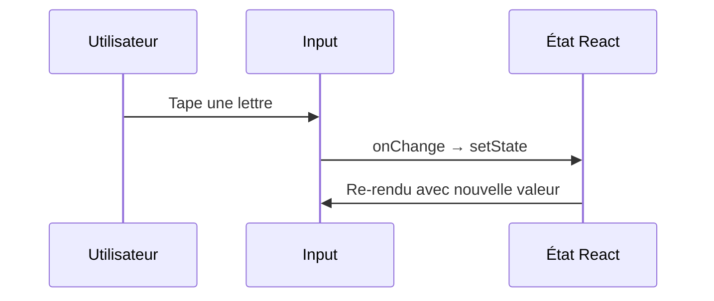

---
tags:
  - React
  - Intermédiaire
  - Pratique
description: "Gérer les événements React et créer des formulaires contrôlés."
estimated_time: "90 min"
fiche_number: 6
total_fiches: 19
cursus: "React"
---

# 06 - Événements et formulaires

> **En bref** : Gérer les événements utilisateur (clic, saisie, soumission), comprendre SyntheticEvent et créer des formulaires contrôlés avec validation élémentaire. Lecture estimée : 90 min.

## Prérequis

- Fiche précédente : [05 - État avec useState](05-etat-usestate.md)
- Savoir utiliser `useState`
- Connaître le destructuring TypeScript

## Objectif de cette fiche

À la fin de cette fiche, tu sauras gérer tous les types d'événements React, créer des formulaires contrôlés et implémenter une validation simple.

---

## Concepts

### Qu'est-ce qu'un événement React ?

**Définition** : Un événement React est un objet (SyntheticEvent) créé par React quand l'utilisateur interagit avec la page (clic, frappe de touche, soumission de formulaire, survol). React enveloppe les événements natifs du navigateur dans ses propres objets pour garantir un comportement identique sur tous les navigateurs.

**Le problème que les événements React résolvent** :

Sans les événements React :

1. **Différences entre navigateurs** : les événements natifs ne fonctionnent pas exactement de la même manière selon le navigateur (Chrome, Firefox, Safari).
2. **addEventListener manuel** : en vanilla JS, il faut attacher manuellement les écouteurs d'événements avec `addEventListener` et les retirer avec `removeEventListener` pour éviter les fuites mémoire.
3. **Performance** : attacher un écouteur à chaque élément est coûteux en mémoire.

**Comment les événements React résolvent ces problèmes** :

| Problème | Solution |
| --- | --- |
| Différences entre navigateurs | SyntheticEvent normalise le comportement |
| addEventListener manuel | Les événements sont déclarés dans le JSX (`onClick`, `onChange`) |
| Performance | React utilise la délégation d'événements (un seul écouteur à la racine) |

**Les événements les plus courants** :

| Événement React | Déclenché quand... |
| --- | --- |
| `onClick` | L'utilisateur clique sur un élément |
| `onChange` | La valeur d'un champ de formulaire change |
| `onSubmit` | Un formulaire est soumis |
| `onKeyDown` | Une touche du clavier est enfoncée |
| `onKeyUp` | Une touche du clavier est relâchée |
| `onFocus` | Un élément reçoit le focus |
| `onBlur` | Un élément perd le focus |
| `onMouseEnter` | La souris entre dans un élément |
| `onMouseLeave` | La souris quitte un élément |

**Analogie concrète** : Les événements React sont comme un système d'interphone dans un immeuble. Quand un visiteur (l'utilisateur) appuie sur un bouton (interagit), l'interphone (SyntheticEvent) transmet l'information de manière standardisée au résident (le composant), peu importe le modèle d'interphone installé (le navigateur).

**Ce que les événements React ne sont PAS** :

- Les événements React ne sont pas les événements natifs du navigateur. Ils enveloppent les événements natifs et normalisent le comportement entre navigateurs. Le pooling d'événements (React 16) n'existe plus depuis React 17.
- Les événements React ne nécessitent pas `addEventListener`. On les déclare directement dans le JSX.

---

### Qu'est-ce qu'un formulaire contrôlé ?

**Définition** : Un formulaire contrôlé est un formulaire dont chaque champ a sa valeur gérée par l'état React (`useState`). L'état React est la "source de vérité" : la valeur affichée dans le champ est toujours celle de l'état.

**Le problème que les formulaires contrôlés résolvent** :

Sans formulaire contrôlé :

1. **Deux sources de vérité** : le DOM contient une valeur (ce que l'utilisateur a tapé) et le JavaScript peut en contenir une autre.
2. **Difficile de valider** : il faut lire la valeur du DOM avec `document.getElementById("champ").value` pour la vérifier.
3. **Pas de réactivité** : impossible de réagir en temps réel à chaque modification du champ.

**Comment les formulaires contrôlés résolvent ces problèmes** :

| Problème | Solution |
| --- | --- |
| Deux sources de vérité | L'état React est la seule source de vérité |
| Difficile de valider | L'état est accessible directement dans le composant |
| Pas de réactivité | Chaque modification met à jour l'état et déclenche un re-render |

**Le cycle d'un formulaire contrôlé** :

```text
1. L'utilisateur tape "a" dans l'input
2. L'événement onChange se déclenche
3. Le handler appelle setValeur("a")
4. React re-rend le composant
5. L'input affiche la valeur de l'état : "a"
```

**Analogie concrète** : Un formulaire contrôlé est comme un tableau blanc interactif en classe. Quand un élève (l'utilisateur) propose un mot, le professeur (React) l'écrit au tableau (état). Le mot affiché au tableau est toujours celui validé par le professeur. Un formulaire non contrôlé serait comme laisser chaque élève écrire directement sur le tableau.

**Ce qu'un formulaire contrôlé n'est PAS** :

- Un formulaire contrôlé n'est pas la seule façon de gérer les formulaires. Les formulaires non contrôlés (avec `useRef`) existent aussi, mais les formulaires contrôlés sont recommandés pour la plupart des cas.

---

Le diagramme suivant montre le cycle d'un formulaire contrôlé React : l'utilisateur tape, l'état est mis à jour, et le composant se re-rend avec la nouvelle valeur.



### Qu'est-ce que SyntheticEvent ?

**Définition** : `SyntheticEvent` est la classe de base de tous les événements React. C'est un objet qui enveloppe l'événement natif du navigateur et fournit une interface identique, quel que soit le navigateur.

**Types d'événements TypeScript courants** :

| Type TypeScript | Utilisé pour |
| --- | --- |
| `React.MouseEvent<HTMLButtonElement>` | Clic sur un bouton |
| `React.ChangeEvent<HTMLInputElement>` | Modification d'un input |
| `React.ChangeEvent<HTMLSelectElement>` | Modification d'un select |
| `React.ChangeEvent<HTMLTextAreaElement>` | Modification d'un textarea |
| `React.FormEvent<HTMLFormElement>` | Soumission d'un formulaire |
| `React.KeyboardEvent<HTMLInputElement>` | Touche clavier dans un input |
| `React.FocusEvent<HTMLInputElement>` | Focus/blur d'un input |

---

## Étapes Pratiques

### Étape 1 : Gérer un événement de clic

Crée `src/components/BoutonClic.tsx` :

```tsx
// src/components/BoutonClic.tsx
import { useState } from "react";

function BoutonClic() {
  const [compteur, setCompteur] = useState(0);
  const [dernierClic, setDernierClic] = useState<string | null>(null);

  // Handler d'événement typé avec React.MouseEvent
  const gererClic = (e: React.MouseEvent<HTMLButtonElement>) => {
    setCompteur((prev) => prev + 1);

    // e.clientX et e.clientY donnent la position du clic
    setDernierClic(`Position : x=${e.clientX}, y=${e.clientY}`);
  };

  return (
    <div>
      <h2>Clics : {compteur}</h2>
      <button onClick={gererClic}>Clique ici</button>
      {dernierClic && <p>{dernierClic}</p>}
    </div>
  );
}

export default BoutonClic;
```

**Résultat attendu** : un compteur qui s'incrémente à chaque clic avec la position du curseur.

---

### Étape 2 : Créer un formulaire contrôlé complet

Crée `src/components/FormulaireInscription.tsx` :

```tsx
// src/components/FormulaireInscription.tsx
import { useState } from "react";

// Interface pour les données du formulaire
interface DonneesFormulaire {
  nom: string;
  email: string;
  motDePasse: string;
  role: string;
  accepteConditions: boolean;
}

function FormulaireInscription() {
  // État initial du formulaire
  const [donnees, setDonnees] = useState<DonneesFormulaire>({
    nom: "",
    email: "",
    motDePasse: "",
    role: "developpeur",
    accepteConditions: false,
  });

  // État pour afficher le résultat après soumission
  const [soumis, setSoumis] = useState(false);

  // Handler générique pour les champs texte et select
  const gererChangement = (
    e: React.ChangeEvent<HTMLInputElement | HTMLSelectElement>
  ) => {
    const { name, value } = e.target;
    setDonnees({ ...donnees, [name]: value });
  };

  // Handler spécifique pour les checkboxes
  const gererCheckbox = (e: React.ChangeEvent<HTMLInputElement>) => {
    const { name, checked } = e.target;
    setDonnees({ ...donnees, [name]: checked });
  };

  // Handler de soumission du formulaire
  const gererSoumission = (e: React.FormEvent<HTMLFormElement>) => {
    // Empêche le rechargement de la page (comportement par défaut d'un formulaire)
    e.preventDefault();
    setSoumis(true);
    console.log("Données soumises :", donnees);
  };

  return (
    <div style={{ maxWidth: "400px", margin: "20px auto" }}>
      <h2>Inscription</h2>

      <form onSubmit={gererSoumission}>
        {/* Champ texte : nom */}
        <div style={{ marginBottom: "12px" }}>
          <label htmlFor="nom">Nom complet :</label>
          <br />
          <input
            id="nom"
            name="nom"
            type="text"
            value={donnees.nom}
            onChange={gererChangement}
            style={{ width: "100%", padding: "8px" }}
          />
        </div>

        {/* Champ email */}
        <div style={{ marginBottom: "12px" }}>
          <label htmlFor="email">Email :</label>
          <br />
          <input
            id="email"
            name="email"
            type="email"
            value={donnees.email}
            onChange={gererChangement}
            style={{ width: "100%", padding: "8px" }}
          />
        </div>

        {/* Champ mot de passe */}
        <div style={{ marginBottom: "12px" }}>
          <label htmlFor="motDePasse">Mot de passe :</label>
          <br />
          <input
            id="motDePasse"
            name="motDePasse"
            type="password"
            value={donnees.motDePasse}
            onChange={gererChangement}
            style={{ width: "100%", padding: "8px" }}
          />
        </div>

        {/* Liste déroulante : rôle */}
        <div style={{ marginBottom: "12px" }}>
          <label htmlFor="role">Rôle :</label>
          <br />
          <select
            id="role"
            name="role"
            value={donnees.role}
            onChange={gererChangement}
            style={{ width: "100%", padding: "8px" }}
          >
            <option value="developpeur">Développeur</option>
            <option value="designer">Designer</option>
            <option value="chef-projet">Chef de projet</option>
          </select>
        </div>

        {/* Checkbox : conditions */}
        <div style={{ marginBottom: "12px" }}>
          <label>
            <input
              name="accepteConditions"
              type="checkbox"
              checked={donnees.accepteConditions}
              onChange={gererCheckbox}
            />
            {" "}J'accepte les conditions d'utilisation
          </label>
        </div>

        {/* Bouton de soumission */}
        <button
          type="submit"
          disabled={!donnees.accepteConditions}
          style={{ padding: "10px 20px" }}
        >
          S'inscrire
        </button>
      </form>

      {/* Affiche le résumé après soumission */}
      {soumis && (
        <div style={{ marginTop: "20px", padding: "10px", backgroundColor: "#d4edda" }}>
          <h3>Inscription réussie !</h3>
          <p>Nom : {donnees.nom}</p>
          <p>Email : {donnees.email}</p>
          <p>Rôle : {donnees.role}</p>
        </div>
      )}
    </div>
  );
}

export default FormulaireInscription;
```

**Résultat attendu** : un formulaire complet avec validation de la checkbox. Après soumission, un résumé s'affiche.

---

### Étape 3 : Ajouter une validation simple

Crée `src/components/FormulaireValide.tsx` :

```tsx
// src/components/FormulaireValide.tsx
import { useState } from "react";

// Interface pour les erreurs de validation
interface Erreurs {
  nom?: string;
  email?: string;
  motDePasse?: string;
}

function FormulaireValide() {
  const [nom, setNom] = useState("");
  const [email, setEmail] = useState("");
  const [motDePasse, setMotDePasse] = useState("");
  const [erreurs, setErreurs] = useState<Erreurs>({});
  const [soumis, setSoumis] = useState(false);

  // Fonction de validation qui retourne les erreurs trouvées
  const valider = (): Erreurs => {
    const nouvellesErreurs: Erreurs = {};

    // Validation du nom : minimum 2 caractères
    if (nom.trim().length < 2) {
      nouvellesErreurs.nom = "Le nom doit contenir au moins 2 caractères";
    }

    // Validation de l'email : doit contenir @ et un point
    if (!email.includes("@") || !email.includes(".")) {
      nouvellesErreurs.email = "L'email doit contenir @ et un point";
    }

    // Validation du mot de passe : minimum 8 caractères
    if (motDePasse.length < 8) {
      nouvellesErreurs.motDePasse = "Le mot de passe doit contenir au moins 8 caractères";
    }

    return nouvellesErreurs;
  };

  const gererSoumission = (e: React.FormEvent<HTMLFormElement>) => {
    e.preventDefault();

    // Lance la validation
    const nouvellesErreurs = valider();

    // Si des erreurs existent, on les affiche
    if (Object.keys(nouvellesErreurs).length > 0) {
      setErreurs(nouvellesErreurs);
      setSoumis(false);
      return;
    }

    // Aucune erreur : soumission réussie
    setErreurs({});
    setSoumis(true);
  };

  return (
    <div style={{ maxWidth: "400px", margin: "20px auto" }}>
      <h2>Formulaire avec validation</h2>

      <form onSubmit={gererSoumission}>
        <div style={{ marginBottom: "12px" }}>
          <label htmlFor="nom-valide">Nom :</label>
          <br />
          <input
            id="nom-valide"
            type="text"
            value={nom}
            onChange={(e) => setNom(e.target.value)}
            style={{
              width: "100%",
              padding: "8px",
              borderColor: erreurs.nom ? "red" : "#ccc",
            }}
          />
          {/* Affiche le message d'erreur si présent */}
          {erreurs.nom && (
            <p style={{ color: "red", fontSize: "12px", margin: "4px 0 0" }}>
              {erreurs.nom}
            </p>
          )}
        </div>

        <div style={{ marginBottom: "12px" }}>
          <label htmlFor="email-valide">Email :</label>
          <br />
          <input
            id="email-valide"
            type="text"
            value={email}
            onChange={(e) => setEmail(e.target.value)}
            style={{
              width: "100%",
              padding: "8px",
              borderColor: erreurs.email ? "red" : "#ccc",
            }}
          />
          {erreurs.email && (
            <p style={{ color: "red", fontSize: "12px", margin: "4px 0 0" }}>
              {erreurs.email}
            </p>
          )}
        </div>

        <div style={{ marginBottom: "12px" }}>
          <label htmlFor="mdp-valide">Mot de passe :</label>
          <br />
          <input
            id="mdp-valide"
            type="password"
            value={motDePasse}
            onChange={(e) => setMotDePasse(e.target.value)}
            style={{
              width: "100%",
              padding: "8px",
              borderColor: erreurs.motDePasse ? "red" : "#ccc",
            }}
          />
          {erreurs.motDePasse && (
            <p style={{ color: "red", fontSize: "12px", margin: "4px 0 0" }}>
              {erreurs.motDePasse}
            </p>
          )}
          {/* Indicateur de force du mot de passe */}
          <p style={{ fontSize: "12px", margin: "4px 0 0", color: "#666" }}>
            Force : {motDePasse.length < 8 ? "Faible" : motDePasse.length < 12 ? "Moyen" : "Fort"}
          </p>
        </div>

        <button type="submit" style={{ padding: "10px 20px" }}>
          Valider
        </button>
      </form>

      {soumis && (
        <div style={{ marginTop: "20px", padding: "10px", backgroundColor: "#d4edda" }}>
          <p>Formulaire soumis avec succès !</p>
        </div>
      )}
    </div>
  );
}

export default FormulaireValide;
```

**Résultat attendu** : un formulaire qui affiche des messages d'erreur en rouge sous chaque champ invalide.

---

### Étape 4 : Gérer les événements clavier

Crée `src/components/RechercheClavier.tsx` :

```tsx
// src/components/RechercheClavier.tsx
import { useState } from "react";

function RechercheClavier() {
  const [recherche, setRecherche] = useState("");
  const [resultats, setResultats] = useState<string[]>([]);

  // Liste de données fictives pour la recherche
  const donnees = [
    "React", "TypeScript", "JavaScript", "Docker",
    "PostgreSQL", "Symfony", "PHP", "Node.js",
    "HTML", "CSS", "Git", "Vite",
  ];

  const gererTouche = (e: React.KeyboardEvent<HTMLInputElement>) => {
    // e.key contient le nom de la touche pressée
    if (e.key === "Enter") {
      // Filtre les données qui contiennent le texte recherché
      const filtres = donnees.filter((item) =>
        item.toLowerCase().includes(recherche.toLowerCase())
      );
      setResultats(filtres);
    }

    // Échap vide le champ de recherche
    if (e.key === "Escape") {
      setRecherche("");
      setResultats([]);
    }
  };

  return (
    <div>
      <h2>Recherche</h2>
      <input
        type="text"
        value={recherche}
        onChange={(e) => setRecherche(e.target.value)}
        onKeyDown={gererTouche}
        placeholder="Tape un mot et appuie sur Entrée..."
        style={{ width: "300px", padding: "8px" }}
      />
      <p style={{ color: "#666", fontSize: "12px" }}>
        Entrée pour chercher, Échap pour effacer
      </p>

      {resultats.length > 0 && (
        <ul>
          {resultats.map((item) => (
            <li key={item}>{item}</li>
          ))}
        </ul>
      )}

      {recherche.length > 0 && resultats.length === 0 && (
        <p>Aucun résultat pour "{recherche}"</p>
      )}
    </div>
  );
}

export default RechercheClavier;
```

**Résultat attendu** : un champ de recherche qui filtre une liste quand on appuie sur Entrée.

---

### Étape 5 : Gérer les événements de focus

```tsx
// src/components/ChampAvecAide.tsx
import { useState } from "react";

function ChampAvecAide() {
  const [champActif, setChampActif] = useState<string | null>(null);

  // Messages d'aide associés à chaque champ
  const aides: Record<string, string> = {
    nom: "Entre ton nom complet (prénom et nom de famille)",
    email: "Utilise une adresse email valide (exemple@domaine.fr)",
    telephone: "Format : 06 12 34 56 78 (10 chiffres)",
  };

  return (
    <div style={{ maxWidth: "400px" }}>
      <h2>Formulaire avec aide contextuelle</h2>

      <div style={{ marginBottom: "12px" }}>
        <label htmlFor="aide-nom">Nom :</label>
        <br />
        <input
          id="aide-nom"
          type="text"
          onFocus={() => setChampActif("nom")}
          onBlur={() => setChampActif(null)}
          style={{ width: "100%", padding: "8px" }}
        />
      </div>

      <div style={{ marginBottom: "12px" }}>
        <label htmlFor="aide-email">Email :</label>
        <br />
        <input
          id="aide-email"
          type="email"
          onFocus={() => setChampActif("email")}
          onBlur={() => setChampActif(null)}
          style={{ width: "100%", padding: "8px" }}
        />
      </div>

      <div style={{ marginBottom: "12px" }}>
        <label htmlFor="aide-tel">Téléphone :</label>
        <br />
        <input
          id="aide-tel"
          type="tel"
          onFocus={() => setChampActif("telephone")}
          onBlur={() => setChampActif(null)}
          style={{ width: "100%", padding: "8px" }}
        />
      </div>

      {/* Affiche le message d'aide du champ actif */}
      {champActif && (
        <div style={{
          padding: "10px",
          backgroundColor: "#e8f4fd",
          borderRadius: "4px",
          borderLeft: "4px solid #0066cc",
        }}>
          <p style={{ margin: 0 }}>{aides[champActif]}</p>
        </div>
      )}
    </div>
  );
}

export default ChampAvecAide;
```

**Résultat attendu** : un message d'aide apparaît sous le formulaire quand on clique dans un champ, et disparaît quand on le quitte.

---

## Commandes Utiles

| Commande | Action |
| --- | --- |
| `npm run dev` | Lance le serveur de développement |
| `npx tsc --noEmit` | Vérifie les types des événements |
| `Ctrl+Shift+J` | Console du navigateur pour voir les logs |

---

## Pièges Fréquents

### Piège 1 : Oublier e.preventDefault() dans onSubmit

**Problème** : Le formulaire recharge la page quand on clique sur le bouton de soumission, car c'est le comportement par défaut d'un `<form>`.

**Solution** : Appelle toujours `e.preventDefault()` dans le handler de soumission.

```tsx
// ❌ La page recharge
const gererSoumission = () => {
  console.log("Soumis");
};

// ✅ La page ne recharge pas
const gererSoumission = (e: React.FormEvent<HTMLFormElement>) => {
  e.preventDefault();
  console.log("Soumis");
};
```

---

### Piège 2 : Passer l'appel de fonction au lieu de la référence

**Problème** : Écrire `onClick={maFonction()}` au lieu de `onClick={maFonction}`. La fonction est exécutée immédiatement au rendu, pas au clic.

**Solution** : Passe la référence de la fonction, sans parenthèses.

```tsx
// ❌ La fonction est exécutée immédiatement (pas au clic)
<button onClick={alert("Clic !")}>Cliquer</button>

// ✅ Correct : référence de fonction
<button onClick={() => alert("Clic !")}>Cliquer</button>

// ✅ Correct : référence sans parenthèses
<button onClick={maFonction}>Cliquer</button>
```

---

### Piège 3 : Input non contrôlé qui devient contrôlé

**Problème** : Passer de `undefined` à une valeur pour la prop `value` d'un input. React affiche un avertissement.

**Solution** : Initialise toujours l'état avec une chaîne vide, pas `undefined`.

```tsx
// ❌ Avertissement : passage de non contrôlé à contrôlé
const [valeur, setValeur] = useState<string | undefined>(undefined);
<input value={valeur} onChange={(e) => setValeur(e.target.value)} />

// ✅ Correct : initialisé avec une chaîne vide
const [valeur, setValeur] = useState("");
<input value={valeur} onChange={(e) => setValeur(e.target.value)} />
```

---

### Piège 4 : Oublier name pour les handlers génériques

**Problème** : Utiliser un handler générique avec `e.target.name` mais oublier l'attribut `name` sur l'input.

**Solution** : Ajoute toujours l'attribut `name` quand tu utilises un handler générique.

```tsx
// ❌ e.target.name sera une chaîne vide
<input value={donnees.nom} onChange={gererChangement} />

// ✅ name correspond à la clé dans l'objet d'état
<input name="nom" value={donnees.nom} onChange={gererChangement} />
```

---

## Checklist de Validation

- [ ] Je sais gérer un événement onClick
- [ ] Je sais typer les événements avec TypeScript (MouseEvent, ChangeEvent, FormEvent)
- [ ] Je sais créer un formulaire contrôlé avec value et onChange
- [ ] Je sais utiliser e.preventDefault() pour empêcher le rechargement de page
- [ ] Je sais valider un formulaire avant soumission
- [ ] Je connais la différence entre passer une fonction et l'appeler (`fn` vs `fn()`)
- [ ] Je sais gérer les événements clavier (onKeyDown)
- [ ] Je sais gérer les événements focus (onFocus, onBlur)

---

## Exercice Pratique

**Énoncé** : Crée un formulaire de connexion complet avec les fonctionnalités suivantes :

1. Deux champs : email et mot de passe
2. Validation en temps réel (pendant la saisie, pas seulement à la soumission)
3. L'email doit contenir "@" et "."
4. Le mot de passe doit faire au moins 6 caractères
5. Le bouton "Se connecter" est désactivé tant que le formulaire est invalide
6. Affiche "Connexion réussie" après soumission si tout est valide

**Indications** :

- Utilise `useState` pour les champs et les erreurs
- Valide à chaque changement dans le handler `onChange`
- Utilise `disabled` sur le bouton quand le formulaire est invalide
- Affiche les erreurs sous chaque champ en rouge

**Résultat attendu** : un formulaire interactif avec retour visuel en temps réel.

---

## Solution de l'Exercice

> **Note** : Cette section contient la solution complète. Essaie d'abord de résoudre l'exercice par toi-même avant de consulter cette solution.

---

```tsx
// src/components/FormulaireConnexion.tsx
import { useState } from "react";

function FormulaireConnexion() {
  const [email, setEmail] = useState("");
  const [motDePasse, setMotDePasse] = useState("");
  const [erreurEmail, setErreurEmail] = useState("");
  const [erreurMotDePasse, setErreurMotDePasse] = useState("");
  const [connecte, setConnecte] = useState(false);

  // Validation de l'email en temps réel
  const validerEmail = (valeur: string) => {
    setEmail(valeur);
    if (valeur.length === 0) {
      setErreurEmail("");
    } else if (!valeur.includes("@") || !valeur.includes(".")) {
      setErreurEmail("L'email doit contenir @ et un point");
    } else {
      setErreurEmail("");
    }
  };

  // Validation du mot de passe en temps réel
  const validerMotDePasse = (valeur: string) => {
    setMotDePasse(valeur);
    if (valeur.length === 0) {
      setErreurMotDePasse("");
    } else if (valeur.length < 6) {
      setErreurMotDePasse(`Encore ${6 - valeur.length} caractère(s) requis`);
    } else {
      setErreurMotDePasse("");
    }
  };

  // Le formulaire est valide si aucune erreur et les champs sont remplis
  const estValide =
    email.length > 0 &&
    motDePasse.length >= 6 &&
    erreurEmail === "" &&
    erreurMotDePasse === "";

  const gererSoumission = (e: React.FormEvent<HTMLFormElement>) => {
    e.preventDefault();
    if (estValide) {
      setConnecte(true);
    }
  };

  // Affiche le message de succès si connecté
  if (connecte) {
    return (
      <div style={{ padding: "20px", backgroundColor: "#d4edda", borderRadius: "4px" }}>
        <h2>Connexion réussie !</h2>
        <p>Bienvenue, {email}</p>
        <button onClick={() => { setConnecte(false); setEmail(""); setMotDePasse(""); }}>
          Se déconnecter
        </button>
      </div>
    );
  }

  return (
    <div style={{ maxWidth: "400px", margin: "20px auto" }}>
      <h2>Connexion</h2>

      <form onSubmit={gererSoumission}>
        <div style={{ marginBottom: "12px" }}>
          <label htmlFor="conn-email">Email :</label>
          <br />
          <input
            id="conn-email"
            type="text"
            value={email}
            onChange={(e) => validerEmail(e.target.value)}
            style={{
              width: "100%",
              padding: "8px",
              borderColor: erreurEmail ? "red" : "#ccc",
            }}
          />
          {erreurEmail && (
            <p style={{ color: "red", fontSize: "12px", margin: "4px 0 0" }}>
              {erreurEmail}
            </p>
          )}
        </div>

        <div style={{ marginBottom: "12px" }}>
          <label htmlFor="conn-mdp">Mot de passe :</label>
          <br />
          <input
            id="conn-mdp"
            type="password"
            value={motDePasse}
            onChange={(e) => validerMotDePasse(e.target.value)}
            style={{
              width: "100%",
              padding: "8px",
              borderColor: erreurMotDePasse ? "red" : "#ccc",
            }}
          />
          {erreurMotDePasse && (
            <p style={{ color: "red", fontSize: "12px", margin: "4px 0 0" }}>
              {erreurMotDePasse}
            </p>
          )}
        </div>

        <button
          type="submit"
          disabled={!estValide}
          style={{
            padding: "10px 20px",
            backgroundColor: estValide ? "#0066cc" : "#cccccc",
            color: "white",
            border: "none",
            cursor: estValide ? "pointer" : "not-allowed",
          }}
        >
          Se connecter
        </button>
      </form>
    </div>
  );
}

export default FormulaireConnexion;
```

---

## Navigation

← Fiche précédente : **[05 - État avec useState](05-etat-usestate.md)**

→ Fiche suivante : **[07 - useEffect et cycle de vie](07-useeffect-cycle-vie.md)**
