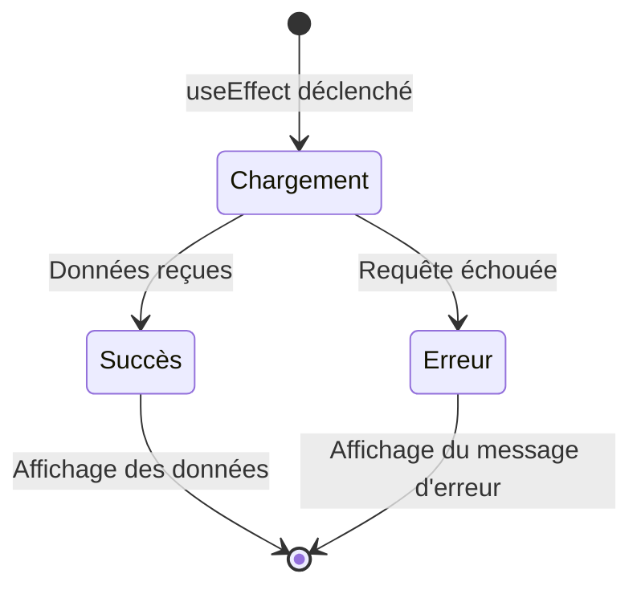

---
tags:
  - React
  - Intermédiaire
  - Pratique
description: "Consommer une API REST avec fetch, gérer le loading et les erreurs, créer un hook useFetch."
estimated_time: "90 min"
fiche_number: 12
total_fiches: 19
cursus: "React"
---

# 12 - Appels API avec fetch

> **En bref** : Consommer une API REST avec `fetch` dans React, gérer les états de chargement et d'erreur, et créer un hook réutilisable `useFetch`. Lecture estimée : 90 min.

## Prérequis

- Fiche précédente : [11 - Hooks personnalisés](11-hooks-personnalises.md)
- Savoir utiliser `useState`, `useEffect` et les hooks personnalisés
- Connaître les bases du format JSON

## Objectif de cette fiche

À la fin de cette fiche, tu sauras appeler une API REST avec `fetch`, gérer les trois états d'une requête (chargement, succès, erreur), créer un hook `useFetch` réutilisable et envoyer des données avec POST/PUT/DELETE.

---

## Concepts

### Qu'est-ce que l'API fetch ?

**Définition** : `fetch` est une fonction intégrée au navigateur qui permet d'envoyer des requêtes HTTP (GET, POST, PUT, DELETE) vers un serveur. Elle retourne une `Promise` qui se résout avec un objet `Response`.

**Le problème que fetch résout** :

Sans fetch :

1. **Pas de données dynamiques** : l'application ne peut afficher que des données codées en dur.
2. **XMLHttpRequest complexe** : l'ancienne API (`XMLHttpRequest`) nécessite beaucoup de code et des callbacks imbriqués.
3. **Pas de standard moderne** : chaque bibliothèque tierce avait sa propre API.

**Comment fetch résout ces problèmes** :

| Problème | Solution |
| --- | --- |
| Pas de données dynamiques | fetch récupère les données depuis un serveur |
| XMLHttpRequest complexe | fetch utilise les Promises, ce qui permet `async/await` |
| Pas de standard moderne | fetch est intégrée au navigateur, aucune dépendance nécessaire |

**Analogie concrète** : `fetch` est comme passer une commande au restaurant. Tu envoies ta commande (la requête) au serveur (l'API). Le serveur prépare la réponse (les données). Pendant ce temps, tu attends (état loading). Le serveur revient soit avec ton plat (succès), soit pour te dire que le plat n'est plus disponible (erreur).

**Ce que fetch n'est PAS** :

- fetch ne lève pas d'erreur pour les codes HTTP 4xx ou 5xx. Un `fetch` qui reçoit un 404 ne rejette pas la Promise. Il faut vérifier `response.ok` manuellement.
- fetch n'annule pas automatiquement les requêtes. Si le composant est détruit pendant la requête, il faut annuler la requête avec `AbortController`.

---

### Les trois états d'une requête

**Définition** : Toute requête HTTP passe par trois états possibles que le composant doit gérer pour offrir une bonne expérience utilisateur.

Le schéma suivant illustre les transitions entre les trois états possibles d'une requête API :



**Les trois états** :

```text
1. CHARGEMENT (loading) → La requête est en cours
2. SUCCÈS (data)        → La requête a réussi, les données sont disponibles
3. ERREUR (error)       → La requête a échoué
```

**Le problème de ne pas gérer ces états** :

Sans gestion des états :

1. **Écran vide** : l'utilisateur ne voit rien pendant le chargement.
2. **Erreur silencieuse** : l'application plante ou affiche des données incorrectes sans explication.
3. **Actions en double** : l'utilisateur clique plusieurs fois sur un bouton car il ne sait pas que la requête est en cours.

**Comment la gestion des états résout ces problèmes** :

| Problème | Solution |
| --- | --- |
| Écran vide | Un indicateur de chargement informe l'utilisateur |
| Erreur silencieuse | Un message d'erreur explique le problème |
| Actions en double | Les boutons sont désactivés pendant le chargement |

**Analogie concrète** : Gérer les états d'une requête est comme suivre une livraison de colis. Le site de livraison affiche "En préparation" (loading), puis "Livré" (succès) ou "Problème de livraison" (erreur). Sans ce suivi, tu ne saurais pas si ton colis arrive ou non.

---

### Qu'est-ce que AbortController ?

**Définition** : `AbortController` est une API du navigateur qui permet d'annuler une requête `fetch` en cours. C'est indispensable dans React pour éviter de mettre à jour l'état d'un composant qui a été détruit.

**Le problème que AbortController résout** :

Sans AbortController :

1. **Mises à jour sur composant détruit** : si l'utilisateur change de page pendant un appel API, la réponse arrive et tente de mettre à jour un composant qui n'existe plus (avertissement React).
2. **Requêtes concurrentes** : si l'utilisateur change rapidement de filtre, plusieurs requêtes sont envoyées et les réponses peuvent arriver dans le désordre.

**Analogie concrète** : `AbortController` est comme le bouton "Annuler" d'une commande en ligne. Tu commandes un livre (la requête `fetch`). Pendant que l'entrepôt prépare ton colis (le serveur traite la requête), tu changes d'avis et tu cliques sur "Annuler la commande" (`controleur.abort()`). L'entrepôt arrête de préparer le colis et ne te l'envoie pas. Sans ce bouton, le colis arriverait chez toi alors que tu as déjà déménagé (le composant est détruit), et personne ne serait là pour le réceptionner.

**Syntaxe** :

```tsx
const controleur = new AbortController();

// Passe le signal au fetch
fetch(url, { signal: controleur.signal });

// Pour annuler la requête
controleur.abort();
```

---

## Étapes Pratiques

### Étape 1 : Premier appel API avec fetch

Pour cette étape, tu vas utiliser un fichier JSON local. JSONPlaceholder (`https://jsonplaceholder.typicode.com`) est un service en ligne couramment utilisé pour tester les appels API, mais il nécessite une connexion internet. Pour un environnement offline, on utilise le fichier JSON local ci-dessous.

Crée `public/api/utilisateurs.json` :

```json
[
  { "id": 1, "nom": "Alice Dupont", "email": "alice@exemple.fr" },
  { "id": 2, "nom": "Bob Martin", "email": "bob@exemple.fr" },
  { "id": 3, "nom": "Claire Leroy", "email": "claire@exemple.fr" },
  { "id": 4, "nom": "David Petit", "email": "david@exemple.fr" },
  { "id": 5, "nom": "Eve Durand", "email": "eve@exemple.fr" }
]
```

Crée `src/components/ListeUtilisateurs.tsx` :

```tsx
// src/components/ListeUtilisateurs.tsx
import { useState, useEffect } from "react";

// Interface pour typer les données reçues
interface Utilisateur {
  id: number;
  nom: string;
  email: string;
}

function ListeUtilisateurs() {
  // Les trois états d'une requête
  const [utilisateurs, setUtilisateurs] = useState<Utilisateur[]>([]);
  const [chargement, setChargement] = useState(true);
  const [erreur, setErreur] = useState<string | null>(null);

  useEffect(() => {
    // Fonction async définie à l'intérieur de l'effet
    const charger = async () => {
      try {
        // Envoie la requête GET vers le fichier JSON local
        const reponse = await fetch("/api/utilisateurs.json");

        // Vérifie que la réponse est OK (code 200-299)
        if (!reponse.ok) {
          throw new Error(`Erreur HTTP : ${reponse.status}`);
        }

        // Parse le JSON
        const donnees: Utilisateur[] = await reponse.json();
        setUtilisateurs(donnees);
      } catch (err) {
        // Capture les erreurs réseau ou de parsing
        if (err instanceof Error) {
          setErreur(err.message);
        } else {
          setErreur("Une erreur inconnue est survenue");
        }
      } finally {
        // Que ce soit un succès ou une erreur, le chargement est terminé
        setChargement(false);
      }
    };

    charger();
  }, []); // [] = exécuté une seule fois au montage

  // Affichage conditionnel selon l'état
  if (chargement) {
    return <p>Chargement des utilisateurs...</p>;
  }

  if (erreur) {
    return <p style={{ color: "red" }}>Erreur : {erreur}</p>;
  }

  return (
    <div>
      <h2>Utilisateurs ({utilisateurs.length})</h2>
      <ul>
        {utilisateurs.map((u) => (
          <li key={u.id}>
            <strong>{u.nom}</strong> -- {u.email}
          </li>
        ))}
      </ul>
    </div>
  );
}

export default ListeUtilisateurs;
```

**Résultat attendu** : la liste des utilisateurs s'affiche après un court chargement.

---

### Étape 2 : Annuler une requête avec AbortController

```tsx
// src/components/ListeUtilisateursV2.tsx
import { useState, useEffect } from "react";

interface Utilisateur {
  id: number;
  nom: string;
  email: string;
}

function ListeUtilisateursV2() {
  const [utilisateurs, setUtilisateurs] = useState<Utilisateur[]>([]);
  const [chargement, setChargement] = useState(true);
  const [erreur, setErreur] = useState<string | null>(null);

  useEffect(() => {
    // Crée un contrôleur pour annuler la requête
    const controleur = new AbortController();

    const charger = async () => {
      try {
        const reponse = await fetch("/api/utilisateurs.json", {
          // Passe le signal au fetch
          signal: controleur.signal,
        });

        if (!reponse.ok) {
          throw new Error(`Erreur HTTP : ${reponse.status}`);
        }

        const donnees: Utilisateur[] = await reponse.json();
        setUtilisateurs(donnees);
      } catch (err) {
        // Vérifie si l'erreur est due à l'annulation
        if (err instanceof DOMException && err.name === "AbortError") {
          // La requête a été annulée volontairement, on ne fait rien
          console.log("Requête annulée");
          return;
        }

        if (err instanceof Error) {
          setErreur(err.message);
        }
      } finally {
        setChargement(false);
      }
    };

    charger();

    // Nettoyage : annule la requête si le composant est démonté
    return () => {
      controleur.abort();
    };
  }, []);

  if (chargement) return <p>Chargement...</p>;
  if (erreur) return <p style={{ color: "red" }}>Erreur : {erreur}</p>;

  return (
    <div>
      <h2>Utilisateurs</h2>
      <ul>
        {utilisateurs.map((u) => (
          <li key={u.id}>{u.nom}</li>
        ))}
      </ul>
    </div>
  );
}

export default ListeUtilisateursV2;
```

**Résultat attendu** : le composant charge les données et annule proprement la requête s'il est démonté avant la fin.

---

### Étape 3 : Créer le hook useFetch

Crée `src/hooks/useFetch.ts` :

```tsx
// src/hooks/useFetch.ts
import { useState, useEffect } from "react";

// Interface pour le retour du hook
interface RetourFetch<T> {
  donnees: T | null;
  chargement: boolean;
  erreur: string | null;
}

// useFetch gère un appel GET avec loading, erreur et annulation
function useFetch<T>(url: string): RetourFetch<T> {
  const [donnees, setDonnees] = useState<T | null>(null);
  const [chargement, setChargement] = useState(true);
  const [erreur, setErreur] = useState<string | null>(null);

  useEffect(() => {
    const controleur = new AbortController();

    const charger = async () => {
      // Réinitialise les états à chaque nouvelle URL
      setChargement(true);
      setErreur(null);
      setDonnees(null);

      try {
        const reponse = await fetch(url, { signal: controleur.signal });

        if (!reponse.ok) {
          throw new Error(`Erreur HTTP : ${reponse.status}`);
        }

        const resultat: T = await reponse.json();
        setDonnees(resultat);
      } catch (err) {
        if (err instanceof DOMException && err.name === "AbortError") {
          return;
        }
        if (err instanceof Error) {
          setErreur(err.message);
        } else {
          setErreur("Une erreur inconnue est survenue");
        }
      } finally {
        setChargement(false);
      }
    };

    charger();

    return () => controleur.abort();
  }, [url]); // Se relance quand l'URL change

  return { donnees, chargement, erreur };
}

export default useFetch;
```

Crée `src/components/ExempleUseFetch.tsx` :

```tsx
// src/components/ExempleUseFetch.tsx
import useFetch from "../hooks/useFetch";

interface Utilisateur {
  id: number;
  nom: string;
  email: string;
}

function ExempleUseFetch() {
  // Utilise le hook générique avec le type Utilisateur[]
  const { donnees, chargement, erreur } = useFetch<Utilisateur[]>("/api/utilisateurs.json");

  if (chargement) return <p>Chargement...</p>;
  if (erreur) return <p style={{ color: "red" }}>Erreur : {erreur}</p>;
  if (!donnees) return <p>Aucune donnée.</p>;

  return (
    <div>
      <h2>Utilisateurs (via useFetch)</h2>
      <ul>
        {donnees.map((u) => (
          <li key={u.id}>
            <strong>{u.nom}</strong> -- {u.email}
          </li>
        ))}
      </ul>
    </div>
  );
}

export default ExempleUseFetch;
```

**Résultat attendu** : le composant affiche les utilisateurs avec seulement 3 lignes de logique grâce au hook `useFetch`.

---

### Étape 4 : Envoyer des données avec POST

Crée `public/api/taches.json` :

```json
[
  { "id": 1, "titre": "Apprendre React", "complete": false },
  { "id": 2, "titre": "Créer un hook useFetch", "complete": true },
  { "id": 3, "titre": "Connecter à une API", "complete": false }
]
```

Crée `src/components/GestionnaireTaches.tsx` :

```tsx
// src/components/GestionnaireTaches.tsx
import { useState, useEffect } from "react";

interface Tache {
  id: number;
  titre: string;
  complete: boolean;
}

function GestionnaireTaches() {
  const [taches, setTaches] = useState<Tache[]>([]);
  const [nouvelleTache, setNouvelleTache] = useState("");
  const [chargement, setChargement] = useState(true);
  const [envoi, setEnvoi] = useState(false);

  // Charge les tâches au montage
  useEffect(() => {
    const charger = async () => {
      try {
        const reponse = await fetch("/api/taches.json");
        const donnees: Tache[] = await reponse.json();
        setTaches(donnees);
      } catch (err) {
        console.error("Erreur de chargement :", err);
      } finally {
        setChargement(false);
      }
    };
    charger();
  }, []);

  // Simule l'ajout d'une tâche via POST
  // En production, cet appel irait vers un vrai backend
  const ajouterTache = async (e: React.FormEvent<HTMLFormElement>) => {
    e.preventDefault();
    if (nouvelleTache.trim().length === 0) return;

    setEnvoi(true);

    try {
      // Simule un appel POST (en production, le serveur traiterait la requête)
      // fetch("/api/taches", {
      //   method: "POST",
      //   headers: { "Content-Type": "application/json" },
      //   body: JSON.stringify({ titre: nouvelleTache, complete: false }),
      // });

      // Simule un délai réseau
      await new Promise((resolve) => setTimeout(resolve, 500));

      // Ajoute la tâche localement (en production, on utiliserait la réponse du serveur)
      const nouvelleTacheObj: Tache = {
        id: Date.now(),
        titre: nouvelleTache,
        complete: false,
      };

      setTaches((prev) => [...prev, nouvelleTacheObj]);
      setNouvelleTache("");
    } catch (err) {
      console.error("Erreur lors de l'ajout :", err);
    } finally {
      setEnvoi(false);
    }
  };

  // Bascule l'état complet d'une tâche
  const basculerComplete = (id: number) => {
    setTaches((prev) =>
      prev.map((t) => (t.id === id ? { ...t, complete: !t.complete } : t))
    );
  };

  // Supprime une tâche
  const supprimer = (id: number) => {
    setTaches((prev) => prev.filter((t) => t.id !== id));
  };

  if (chargement) return <p>Chargement des tâches...</p>;

  return (
    <div style={{ maxWidth: "500px" }}>
      <h2>Gestionnaire de tâches</h2>

      <form onSubmit={ajouterTache} style={{ marginBottom: "16px" }}>
        <input
          type="text"
          value={nouvelleTache}
          onChange={(e) => setNouvelleTache(e.target.value)}
          placeholder="Nouvelle tâche..."
          disabled={envoi}
          style={{ padding: "8px", width: "300px", marginRight: "8px" }}
        />
        <button type="submit" disabled={envoi} style={{ padding: "8px 16px" }}>
          {envoi ? "Ajout..." : "Ajouter"}
        </button>
      </form>

      <ul style={{ listStyle: "none", padding: 0 }}>
        {taches.map((tache) => (
          <li
            key={tache.id}
            style={{
              display: "flex",
              justifyContent: "space-between",
              alignItems: "center",
              padding: "8px",
              borderBottom: "1px solid #eee",
              textDecoration: tache.complete ? "line-through" : "none",
              color: tache.complete ? "#999" : "#333",
            }}
          >
            <span
              onClick={() => basculerComplete(tache.id)}
              style={{ cursor: "pointer", flex: 1 }}
            >
              {tache.complete ? "[x]" : "[ ]"} {tache.titre}
            </span>
            <button
              onClick={() => supprimer(tache.id)}
              style={{ color: "red", border: "none", background: "none", cursor: "pointer" }}
            >
              Supprimer
            </button>
          </li>
        ))}
      </ul>

      <p style={{ color: "#666", fontSize: "14px" }}>
        {taches.filter((t) => !t.complete).length} tâche(s) restante(s)
      </p>
    </div>
  );
}

export default GestionnaireTaches;
```

**Résultat attendu** : une liste de tâches avec ajout, complétion et suppression. Le bouton "Ajouter" est désactivé pendant l'envoi.

---

### Étape 5 : Requête avec paramètres dynamiques

```tsx
// src/components/RechercheUtilisateurs.tsx
import { useState } from "react";
import useFetch from "../hooks/useFetch";
import useDebounce from "../hooks/useDebounce";

interface Utilisateur {
  id: number;
  nom: string;
  email: string;
}

function RechercheUtilisateurs() {
  const [recherche, setRecherche] = useState("");
  const rechercheRetardee = useDebounce(recherche, 300);

  // useFetch se relance quand l'URL change
  // En production, on utiliserait un endpoint de recherche côté serveur
  const { donnees, chargement, erreur } = useFetch<Utilisateur[]>(
    "/api/utilisateurs.json"
  );

  // Filtre les résultats côté client
  const resultats = donnees?.filter((u) =>
    u.nom.toLowerCase().includes(rechercheRetardee.toLowerCase())
  ) ?? [];

  return (
    <div>
      <h2>Recherche d'utilisateurs</h2>
      <input
        type="text"
        value={recherche}
        onChange={(e) => setRecherche(e.target.value)}
        placeholder="Rechercher par nom..."
        style={{ padding: "8px", width: "300px" }}
      />

      {chargement && <p>Chargement...</p>}
      {erreur && <p style={{ color: "red" }}>Erreur : {erreur}</p>}

      {!chargement && !erreur && (
        <>
          <p style={{ color: "#666" }}>
            {resultats.length} résultat(s)
            {rechercheRetardee && ` pour "${rechercheRetardee}"`}
          </p>
          <ul>
            {resultats.map((u) => (
              <li key={u.id}>
                <strong>{u.nom}</strong> -- {u.email}
              </li>
            ))}
          </ul>
        </>
      )}
    </div>
  );
}

export default RechercheUtilisateurs;
```

**Résultat attendu** : un champ de recherche qui filtre les utilisateurs en temps réel avec debounce.

---

## Commandes Utiles

| Commande | Action |
| --- | --- |
| `npm run dev` | Lance le serveur de développement |
| `npx tsc --noEmit` | Vérifie les types |

---

## Pièges Fréquents

### Piège 1 : Ne pas vérifier response.ok

⚠️ **Problème** : `fetch` ne rejette pas la Promise pour les erreurs HTTP (404, 500). Le code continue comme si tout allait bien, mais les données sont invalides.

✅ **Solution** : Vérifie toujours `response.ok` après le `fetch`.

```tsx
// ❌ Ne détecte pas les erreurs 404/500
const reponse = await fetch(url);
const donnees = await reponse.json(); // Peut échouer silencieusement

// ✅ Détecte les erreurs HTTP
const reponse = await fetch(url);
if (!reponse.ok) {
  throw new Error(`Erreur HTTP : ${reponse.status}`);
}
const donnees = await reponse.json();
```

---

### Piège 2 : useEffect async direct

⚠️ **Problème** : Passer une fonction `async` directement à `useEffect`. React attend une fonction qui retourne `void` ou une fonction de nettoyage.

✅ **Solution** : Crée la fonction async à l'intérieur de l'effet.

```tsx
// ❌ Erreur : useEffect ne peut pas être async
useEffect(async () => {
  const data = await fetch("/api/data");
}, []);

// ✅ Correct : fonction async définie à l'intérieur
useEffect(() => {
  const charger = async () => {
    const data = await fetch("/api/data");
  };
  charger();
}, []);
```

---

### Piège 3 : Mise à jour d'état après démontage

⚠️ **Problème** : La requête se termine après la destruction du composant. L'appel à `setState` génère un avertissement React.

✅ **Solution** : Utilise `AbortController` pour annuler la requête au démontage.

```tsx
useEffect(() => {
  const controleur = new AbortController();

  fetch(url, { signal: controleur.signal })
    .then((r) => r.json())
    .then(setDonnees);

  // Annule la requête si le composant est démonté
  return () => controleur.abort();
}, [url]);
```

---

### Piège 4 : Boucle infinie avec un objet comme dépendance

⚠️ **Problème** : Passer un objet ou un tableau dans le tableau de dépendances de `useEffect`. Comme un nouvel objet est créé à chaque rendu, l'effet se relance indéfiniment.

✅ **Solution** : Utilise des valeurs primitives (string, number) comme dépendances ou mémorise l'objet.

```tsx
// ❌ Boucle infinie : un nouvel objet est créé à chaque rendu
useEffect(() => {
  fetch(url, { method: "POST", body: JSON.stringify(options) });
}, [options]); // options est recréé à chaque rendu

// ✅ Correct : dépend de valeurs primitives
useEffect(() => {
  fetch(`/api/data?page=${page}&limit=${limit}`);
}, [page, limit]); // des nombres, pas un objet
```

---

## Checklist de Validation

- [ ] Je sais utiliser `fetch` pour envoyer une requête GET
- [ ] Je sais vérifier `response.ok` pour détecter les erreurs HTTP
- [ ] Je gère les trois états : chargement, succès, erreur
- [ ] Je sais annuler une requête avec `AbortController`
- [ ] Je sais créer un hook `useFetch` réutilisable
- [ ] Je sais envoyer des données avec `fetch` (méthode POST)
- [ ] Je sais combiner `useFetch` avec `useDebounce` pour la recherche

---

## Exercice Pratique

**Énoncé** : Crée une application qui affiche une liste de produits avec les fonctionnalités suivantes :

1. Charge les produits depuis un fichier JSON local (`public/api/produits.json`)
2. Affiche un état de chargement avec un message "Chargement..."
3. Gère les erreurs avec un message explicite
4. Permet de filtrer les produits par catégorie (avec un select)
5. Permet de rechercher un produit par nom (avec debounce)
6. Utilise le hook `useFetch` créé dans cette fiche

**Indications** :

- Crée le fichier `public/api/produits.json` avec 8-10 produits (id, nom, prix, catégorie)
- Utilise les catégories : "Périphériques", "Composants", "Accessoires"
- Le filtrage par catégorie et la recherche se combinent
- Affiche le nombre de résultats

**Résultat attendu** : une liste de produits avec recherche et filtrage simultanés.

---

## Solution de l'Exercice

> **Note** : Cette section contient la solution complète. Essaie d'abord de résoudre l'exercice par toi-même avant de consulter cette solution.

---

`public/api/produits.json` :

```json
[
  { "id": 1, "nom": "Clavier mécanique", "prix": 89, "categorie": "Périphériques" },
  { "id": 2, "nom": "Souris ergonomique", "prix": 45, "categorie": "Périphériques" },
  { "id": 3, "nom": "Casque audio", "prix": 120, "categorie": "Périphériques" },
  { "id": 4, "nom": "Carte graphique RTX", "prix": 650, "categorie": "Composants" },
  { "id": 5, "nom": "SSD NVMe 1 To", "prix": 95, "categorie": "Composants" },
  { "id": 6, "nom": "RAM 32 Go DDR5", "prix": 130, "categorie": "Composants" },
  { "id": 7, "nom": "Tapis de souris XXL", "prix": 25, "categorie": "Accessoires" },
  { "id": 8, "nom": "Support écran", "prix": 40, "categorie": "Accessoires" },
  { "id": 9, "nom": "Hub USB-C", "prix": 35, "categorie": "Accessoires" },
  { "id": 10, "nom": "Webcam HD", "prix": 65, "categorie": "Périphériques" }
]
```

`src/components/CatalogueProduits.tsx` :

```tsx
// src/components/CatalogueProduits.tsx
import { useState } from "react";
import useFetch from "../hooks/useFetch";
import useDebounce from "../hooks/useDebounce";

interface Produit {
  id: number;
  nom: string;
  prix: number;
  categorie: string;
}

function CatalogueProduits() {
  const [recherche, setRecherche] = useState("");
  const [categorie, setCategorie] = useState("Toutes");
  const rechercheRetardee = useDebounce(recherche, 300);

  const { donnees, chargement, erreur } = useFetch<Produit[]>("/api/produits.json");

  if (chargement) return <p>Chargement des produits...</p>;
  if (erreur) return <p style={{ color: "red" }}>Erreur : {erreur}</p>;
  if (!donnees) return <p>Aucun produit.</p>;

  // Extrait les catégories uniques pour le select
  const categories = ["Toutes", ...new Set(donnees.map((p) => p.categorie))];

  // Filtre par catégorie ET par recherche
  const produitsFiltres = donnees.filter((p) => {
    const correspondCategorie = categorie === "Toutes" || p.categorie === categorie;
    const correspondRecherche = p.nom.toLowerCase().includes(rechercheRetardee.toLowerCase());
    return correspondCategorie && correspondRecherche;
  });

  return (
    <div style={{ maxWidth: "600px" }}>
      <h2>Catalogue de produits</h2>

      <div style={{ display: "flex", gap: "12px", marginBottom: "16px" }}>
        <input
          type="text"
          value={recherche}
          onChange={(e) => setRecherche(e.target.value)}
          placeholder="Rechercher..."
          style={{ padding: "8px", flex: 1 }}
        />
        <select
          value={categorie}
          onChange={(e) => setCategorie(e.target.value)}
          style={{ padding: "8px" }}
        >
          {categories.map((cat) => (
            <option key={cat} value={cat}>{cat}</option>
          ))}
        </select>
      </div>

      <p style={{ color: "#666" }}>{produitsFiltres.length} produit(s) trouvé(s)</p>

      <div style={{ display: "grid", gap: "12px" }}>
        {produitsFiltres.map((p) => (
          <div
            key={p.id}
            style={{
              border: "1px solid #ddd",
              padding: "12px",
              display: "flex",
              justifyContent: "space-between",
              alignItems: "center",
            }}
          >
            <div>
              <strong>{p.nom}</strong>
              <br />
              <span style={{ color: "#666", fontSize: "14px" }}>{p.categorie}</span>
            </div>
            <span style={{ fontWeight: "bold" }}>{p.prix} EUR</span>
          </div>
        ))}
      </div>
    </div>
  );
}

export default CatalogueProduits;
```

---

## Navigation

← Fiche précédente : **[11 - Hooks personnalisés](11-hooks-personnalises.md)**

→ Fiche suivante : **[13 - React et Symfony](13-react-symfony.md)**
