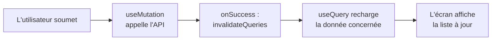

---
tags:
  - React
  - Avancé
  - Concept
description: "Gérer le cache des données serveur avec TanStack Query : useQuery, useMutation, clés de requête, staleTime et invalidation."
estimated_time: "90 min"
fiche_number: 18
total_fiches: 19
cursus: "React"
---

# 18 - TanStack Query (gestion du cache serveur)

> **En bref** : Remplacer le fetch manuel (useEffect + useState) par TanStack Query pour gérer le cache des données serveur, avec useQuery, useMutation, les clés de requête, staleTime et l'invalidation. Lecture estimée : 90 min.

## Prérequis

- [React 19 : ce qui a changé](17-react-19-nouveautes.md) terminée
- Avoir compris le hook `useFetch` construit dans les fiches [11 - Hooks personnalisés](11-hooks-personnalises.md) et [12 - Appels API avec fetch](12-appels-api-fetch.md)
- Savoir utiliser `useState`, `useEffect` et les promesses

## Objectif de cette fiche

À la fin de cette fiche, tu sauras installer et configurer TanStack Query, lire des données serveur avec `useQuery`, modifier des données avec `useMutation`, comprendre les clés de requête et le cache, et rafraîchir automatiquement les données après une modification grâce à l'invalidation.

---

## Concepts

Cette section explique pourquoi le fetch manuel atteint vite ses limites, puis comment TanStack Query répond à chaque limite. Lis-la entièrement avant les étapes pratiques.

### Qu'est-ce que l'état serveur ?

**Définition** : L'état serveur (ou "données serveur") est l'ensemble des données qui vivent sur un serveur distant et que ton application affiche : une liste d'articles, le profil d'un utilisateur, le contenu d'un panier stocké en base. Ton application n'en possède qu'une copie temporaire.

**Le problème que la distinction "état serveur" résout** :

On a tendance à traiter les données serveur comme un état local ordinaire (un `useState`). Or l'état serveur a des contraintes propres :

1. **Il peut devenir périmé** : la donnée affichée a pu changer côté serveur depuis le chargement.
2. **Il est partagé** : plusieurs composants peuvent avoir besoin de la même donnée au même moment.
3. **Il est asynchrone** : il faut gérer le chargement, l'erreur et les nouvelles tentatives.

**Comment cette distinction aide** :

| Caractéristique de l'état serveur | Conséquence pratique |
| --- | --- |
| Peut devenir périmé | Il faut une stratégie de rafraîchissement |
| Partagé entre composants | Il faut éviter de le charger plusieurs fois |
| Asynchrone | Il faut gérer chargement, erreur et retentatives |

**Analogie concrète** : L'état serveur est comme la photo d'un tableau d'affichage que tu prends avec ton téléphone. Au moment de la photo, elle est exacte. Mais quelqu'un peut ajouter ou retirer une annonce sur le vrai tableau ensuite. Ta photo (le cache) devient alors périmée : il faut décider quand reprendre une nouvelle photo.

**Comparaison : état local vs état serveur** :

| État local (useState) | État serveur (données distantes) |
| --- | --- |
| Vit uniquement dans le composant | Vit sur le serveur, copié dans l'application |
| Toujours à jour | Peut devenir périmé |
| Synchrone | Asynchrone (chargement, erreur) |
| Exemple : champ de formulaire | Exemple : liste d'articles d'une API |

---

### Le problème du fetch manuel

**Définition** : Le fetch manuel est l'approche vue dans les fiches précédentes : un `useEffect` lance la requête, et trois `useState` stockent les données, l'état de chargement et l'erreur. C'est exactement ce que fait le hook `useFetch`.

**Le problème que le fetch manuel pose** :

Rappel du hook `useFetch` des fiches précédentes :

```tsx
// Rappel : le hook useFetch construit dans les fiches 11 et 12
function useFetch<T>(url: string) {
  const [donnees, setDonnees] = useState<T | null>(null);
  const [chargement, setChargement] = useState(true);
  const [erreur, setErreur] = useState<string | null>(null);

  useEffect(() => {
    // Lance la requête, gère ok/erreur, met à jour les trois états
    // (code complet dans la fiche 12)
  }, [url]);

  return { donnees, chargement, erreur };
}
```

Ce hook fonctionne, mais il lui manque tout ce qui rend les données serveur agréables à utiliser :

1. **Pas de cache partagé** : si deux composants appellent `useFetch("/api/articles")`, la requête part deux fois. Chacun a sa propre copie.
2. **Pas de déduplication** : afficher la même liste à deux endroits déclenche deux appels réseau simultanés identiques.
3. **Pas de rafraîchissement intelligent** : `useFetch` ne sait pas quand la donnée est périmée. Il recharge seulement si l'URL change.
4. **Pas de retentative ni de gestion d'arrière-plan** : en cas d'erreur réseau passagère, rien ne réessaie automatiquement.
5. **Invalidation manuelle** : après avoir ajouté un article, il faut penser à recharger la liste à la main (le `recharger` de `useFetch`).

**Comment TanStack Query résout ces problèmes** :

| Limite du fetch manuel | Solution apportée par TanStack Query |
| --- | --- |
| Pas de cache partagé | Le cache est global, indexé par clé de requête |
| Pas de déduplication | Les requêtes identiques simultanées sont fusionnées |
| Pas de rafraîchissement intelligent | `staleTime` définit quand une donnée devient périmée |
| Pas de retentative | Retentatives automatiques en cas d'erreur |
| Invalidation manuelle | `invalidateQueries` recharge les données concernées |

---

### Qu'est-ce que TanStack Query ?

**Définition** : TanStack Query (anciennement React Query) est une bibliothèque de gestion de l'état serveur. Elle met en cache les résultats des requêtes, déduplique les appels, gère le chargement et l'erreur, rafraîchit les données périmées et coordonne les modifications, le tout via deux hooks principaux : `useQuery` (lire) et `useMutation` (modifier).

**Analogie concrète** : TanStack Query est comme un assistant documentaire dans une bibliothèque. Quand tu demandes un livre (une donnée), il vérifie d'abord s'il l'a déjà sur son bureau (le cache). Si oui, il te le donne immédiatement. Si le livre est trop vieux (périmé), il va en chercher une édition récente pendant que tu lis l'ancienne. Et si dix personnes demandent le même livre en même temps, il ne fait qu'un seul aller-retour au rayon (déduplication).

**Pourquoi c'est devenu un standard** :

Avant TanStack Query, chaque équipe réécrivait sa propre logique de cache, de déduplication et de rafraîchissement, souvent avec des bugs. TanStack Query a normalisé cette logique dans une bibliothèque testée et largement adoptée. Aujourd'hui, c'est l'outil de référence pour gérer les données serveur dans une application React, parce qu'il supprime des centaines de lignes de code répétitif et évite des erreurs subtiles.

**Ce que TanStack Query n'est PAS** :

- TanStack Query n'est pas un gestionnaire d'état local. Pour l'état d'un formulaire ou l'ouverture d'un menu, tu continues d'utiliser `useState`. TanStack Query gère uniquement les données qui viennent d'un serveur.
- TanStack Query n'est pas un client HTTP. Il ne remplace pas `fetch` ni Axios : tu lui fournis ta propre fonction de requête. Il orchestre l'appel, mais ne le réalise pas à ta place.

**Comparaison : useFetch vs useQuery** :

| Hook useFetch (fiches précédentes) | useQuery (TanStack Query) |
| --- | --- |
| Une copie des données par composant | Cache partagé entre tous les composants |
| Recharge seulement si l'URL change | Rafraîchit selon `staleTime` et au retour de focus |
| Pas de retentative automatique | Retentatives automatiques en cas d'échec |
| `recharger()` manuel après modification | `invalidateQueries` cible les données à recharger |
| Code à maintenir soi-même | Bibliothèque maintenue et testée |

---

### Qu'est-ce qu'une clé de requête ?

**Définition** : Une clé de requête (query key) est un identifiant unique, sous forme de tableau, qui désigne une donnée dans le cache. TanStack Query l'utilise pour savoir quelles requêtes sont identiques, quand réutiliser le cache et quoi rafraîchir.

**Le problème que la clé de requête résout** :

Sans identifiant stable des données :

1. **Impossible de réutiliser le cache** : on ne saurait pas que deux composants demandent la même chose.
2. **Impossible d'invalider précisément** : on ne pourrait pas dire "recharge la liste des articles" sans recharger tout.

**Comment la clé de requête résout ces problèmes** :

| Problème | Solution apportée par la clé de requête |
| --- | --- |
| Réutiliser le cache | Deux requêtes avec la même clé partagent le même cache |
| Invalider précisément | On invalide par clé (par exemple `["articles"]`) |

**Exemples de clés** :

| Donnée | Clé de requête |
| --- | --- |
| Liste de tous les articles | `["articles"]` |
| Article numéro 42 | `["articles", 42]` |
| Articles filtrés par catégorie | `["articles", { categorie: "react" }]` |

**Analogie concrète** : Une clé de requête est comme la cote d'un livre en bibliothèque (par exemple "REACT-042"). Deux personnes qui citent la même cote parlent du même livre. Et pour ranger ou retirer une catégorie entière, on agit sur le préfixe de la cote, sans toucher aux autres rayons.

---

### Qu'est-ce que staleTime (donnée fraîche ou périmée) ?

**Définition** : `staleTime` est la durée pendant laquelle une donnée en cache est considérée comme "fraîche". Tant qu'elle est fraîche, TanStack Query l'affiche sans relancer de requête. Une fois ce délai écoulé, la donnée devient "périmée" (stale) et sera rafraîchie en arrière-plan à la prochaine occasion.

**Le problème que staleTime résout** :

1. **Trop de requêtes** : sans contrôle, on rechargerait les données à chaque affichage du composant, surchargeant le serveur.
2. **Données trop anciennes** : à l'inverse, ne jamais recharger afficherait des données obsolètes.

**Comment staleTime résout ces problèmes** :

| Problème | Solution apportée par staleTime |
| --- | --- |
| Trop de requêtes | Pendant `staleTime`, le cache est servi sans appel réseau |
| Données trop anciennes | Après `staleTime`, la donnée est rafraîchie automatiquement |

**Analogie concrète** : `staleTime` est comme la date de péremption sur un produit frais. Avant la date, tu le consommes sans te poser de question (cache servi directement). Après la date, tu vas en racheter un (rafraîchissement), même si l'ancien est encore là en attendant.

**Note** : ne pas confondre `staleTime` (quand la donnée devient périmée) et `gcTime` (quand une donnée inutilisée est retirée du cache pour libérer la mémoire). Cette fiche se concentre sur `staleTime`, le réglage le plus courant.

---

### Qu'est-ce que useMutation et l'invalidation ?

**Définition** : `useMutation` est le hook pour **modifier** des données serveur (créer, mettre à jour, supprimer). L'invalidation (`invalidateQueries`) est l'action de marquer une donnée du cache comme périmée pour forcer son rechargement, typiquement après une mutation réussie.

**Le problème que useMutation et l'invalidation résolvent** :

Avec le fetch manuel, après avoir ajouté un article :

1. **La liste reste obsolète** : l'ajout réussit côté serveur, mais l'écran affiche encore l'ancienne liste.
2. **Rafraîchissement à la main** : il fallait rappeler manuellement la fonction de chargement, sans oublier de cas.

**Comment useMutation et l'invalidation résolvent ces problèmes** :

| Problème | Solution apportée par useMutation + invalidation |
| --- | --- |
| Liste obsolète après ajout | `invalidateQueries(["articles"])` recharge la liste |
| Rafraîchissement à la main | L'invalidation est déclenchée dans `onSuccess` |

**Le cycle complet d'une mutation** :



**Analogie concrète** : `useMutation` est comme déposer une nouvelle annonce sur le tableau d'affichage. L'invalidation, c'est dire à l'assistant documentaire : "le tableau a changé, ta photo n'est plus valable". Il reprend alors une photo récente (rechargement), et tout le monde voit la version à jour.

---

## Étapes Pratiques

Pour ces exemples, repars d'un projet React + TypeScript créé avec Vite. Les requêtes utilisent l'API publique de test JSONPlaceholder, qui ne nécessite aucune clé.

### Étape 1 : Installer et configurer TanStack Query

```bash
# Installe la bibliothèque dans le projet
npm install @tanstack/react-query
```

Configure le `QueryClient` à la racine de l'application :

```tsx
// src/main.tsx
import { createRoot } from "react-dom/client";
import { QueryClient, QueryClientProvider } from "@tanstack/react-query";
import App from "./App.tsx";

// Le QueryClient stocke le cache de toutes les requêtes
const queryClient = new QueryClient({
  defaultOptions: {
    queries: {
      // Par défaut, une donnée reste fraîche 1 minute
      staleTime: 60_000,
    },
  },
});

// Le QueryClientProvider rend le cache accessible à toute l'application
createRoot(document.getElementById("root")!).render(
  <QueryClientProvider client={queryClient}>
    <App />
  </QueryClientProvider>
);
```

**Résultat attendu** :

```text
Le paquet @tanstack/react-query est installé. L'application se lance avec
npm run dev sans erreur. Le QueryClientProvider enveloppe l'application.
```

---

### Étape 2 : Lire des données avec useQuery

Crée `src/components/ListeArticles.tsx` :

```tsx
// src/components/ListeArticles.tsx
import { useQuery } from "@tanstack/react-query";

// Type d'un article retourné par l'API
interface Article {
  id: number;
  title: string;
  body: string;
}

// Fonction de requête : c'est à toi de la fournir (fetch, Axios, etc.)
async function recupererArticles(): Promise<Article[]> {
  const reponse = await fetch(
    "https://jsonplaceholder.typicode.com/posts?_limit=5"
  );
  if (!reponse.ok) {
    throw new Error(`Erreur HTTP : ${reponse.status}`);
  }
  return reponse.json();
}

function ListeArticles() {
  // useQuery prend une clé (queryKey) et une fonction (queryFn)
  // Il retourne notamment data, isLoading et isError
  const { data, isLoading, isError, error } = useQuery({
    queryKey: ["articles"],
    queryFn: recupererArticles,
  });

  // Pendant le premier chargement
  if (isLoading) {
    return <p>Chargement des articles...</p>;
  }

  // En cas d'erreur (après les retentatives automatiques)
  if (isError) {
    return <p style={{ color: "red" }}>Erreur : {error.message}</p>;
  }

  // data est garanti défini ici
  return (
    <ul>
      {data?.map((article) => (
        <li key={article.id}>
          <strong>{article.title}</strong>
        </li>
      ))}
    </ul>
  );
}

export default ListeArticles;
```

**Résultat attendu** : le texte "Chargement des articles..." s'affiche brièvement, puis la liste des 5 titres apparaît. Si tu affiches `<ListeArticles />` à deux endroits de la page, une seule requête réseau part (déduplication), contrairement au hook `useFetch` qui en aurait lancé deux.

---

### Étape 3 : Observer le cache et staleTime

Pour visualiser le comportement du cache, crée un composant avec un bouton qui monte et démonte la liste :

```tsx
// src/components/DemoCache.tsx
import { useState } from "react";
import ListeArticles from "./ListeArticles";

function DemoCache() {
  const [afficher, setAfficher] = useState(true);

  return (
    <div>
      <button
        onClick={() => setAfficher((v) => !v)}
        style={{ padding: "8px 16px", marginBottom: "12px" }}
      >
        {afficher ? "Masquer la liste" : "Afficher la liste"}
      </button>

      {afficher && <ListeArticles />}
    </div>
  );
}

export default DemoCache;
```

**Résultat attendu** : au premier affichage, la requête part (tu vois "Chargement..."). Si tu masques puis réaffiches la liste dans la minute (le `staleTime` configuré à l'étape 1), les données apparaissent **instantanément** depuis le cache, sans nouveau "Chargement...". Au-delà d'une minute, la donnée est périmée et un rafraîchissement en arrière-plan se déclenche.

---

### Étape 4 : Modifier des données avec useMutation

Crée `src/components/AjoutArticle.tsx`. Ce composant ajoute un article puis invalide la liste pour la rafraîchir :

```tsx
// src/components/AjoutArticle.tsx
import { useState } from "react";
import { useMutation, useQueryClient } from "@tanstack/react-query";

interface NouvelArticle {
  title: string;
  body: string;
}

// Fonction d'envoi : POST de l'article vers l'API
async function creerArticle(article: NouvelArticle) {
  const reponse = await fetch("https://jsonplaceholder.typicode.com/posts", {
    method: "POST",
    headers: { "Content-Type": "application/json" },
    body: JSON.stringify(article),
  });
  if (!reponse.ok) {
    throw new Error("La création a échoué");
  }
  return reponse.json();
}

function AjoutArticle() {
  const [titre, setTitre] = useState("");

  // Le queryClient permet d'invalider des requêtes depuis ce composant
  const queryClient = useQueryClient();

  // useMutation prend la fonction de modification (mutationFn)
  const mutation = useMutation({
    mutationFn: creerArticle,
    // onSuccess s'exécute si la mutation réussit
    onSuccess: () => {
      // Marque la liste ["articles"] comme périmée -> useQuery la recharge
      queryClient.invalidateQueries({ queryKey: ["articles"] });
      // Vide le champ
      setTitre("");
    },
  });

  const gererSoumission = (e: React.FormEvent<HTMLFormElement>) => {
    e.preventDefault();
    if (titre.trim().length < 3) return;
    // Déclenche la mutation avec les données du nouvel article
    mutation.mutate({ title: titre.trim(), body: "Contenu de démonstration" });
  };

  return (
    <form onSubmit={gererSoumission} style={{ marginBottom: "16px" }}>
      <input
        type="text"
        value={titre}
        onChange={(e) => setTitre(e.target.value)}
        placeholder="Titre du nouvel article"
        disabled={mutation.isPending}
        style={{ padding: "8px", width: "60%", marginRight: "8px" }}
      />

      <button type="submit" disabled={mutation.isPending} style={{ padding: "8px 16px" }}>
        {mutation.isPending ? "Ajout..." : "Ajouter"}
      </button>

      {/* Message d'erreur de mutation */}
      {mutation.isError && (
        <p style={{ color: "red" }}>{mutation.error.message}</p>
      )}
    </form>
  );
}

export default AjoutArticle;
```

Assemble les deux composants dans `App.tsx` :

```tsx
// src/App.tsx
import AjoutArticle from "./components/AjoutArticle";
import ListeArticles from "./components/ListeArticles";

function App() {
  return (
    <div style={{ maxWidth: "600px", margin: "0 auto", padding: "20px" }}>
      <h1>Articles</h1>
      <AjoutArticle />
      <ListeArticles />
    </div>
  );
}

export default App;
```

**Résultat attendu** : le bouton "Ajouter" affiche "Ajout..." pendant la requête. Après succès, le champ se vide et la liste `["articles"]` est invalidée, ce qui déclenche son rechargement automatique. Tu n'as appelé aucune fonction de rechargement manuelle : l'invalidation s'en charge.

> **Note** : JSONPlaceholder est une API de test qui ne persiste pas réellement les données. La requête POST réussit et renvoie un faux article, mais le rechargement de la liste affiche les données d'origine. Le mécanisme d'invalidation, lui, fonctionne et est observable (un nouvel appel réseau part après l'ajout).

---

### Étape 5 : Une requête paramétrée par identifiant

Crée `src/components/DetailArticle.tsx` pour montrer une clé de requête avec paramètre :

```tsx
// src/components/DetailArticle.tsx
import { useQuery } from "@tanstack/react-query";

interface Article {
  id: number;
  title: string;
  body: string;
}

async function recupererArticle(id: number): Promise<Article> {
  const reponse = await fetch(
    `https://jsonplaceholder.typicode.com/posts/${id}`
  );
  if (!reponse.ok) {
    throw new Error(`Erreur HTTP : ${reponse.status}`);
  }
  return reponse.json();
}

function DetailArticle({ id }: { id: number }) {
  const { data, isLoading, isError } = useQuery({
    // La clé inclut l'id : chaque article a son entrée de cache distincte
    queryKey: ["articles", id],
    queryFn: () => recupererArticle(id),
  });

  if (isLoading) return <p>Chargement de l'article...</p>;
  if (isError || !data) return <p style={{ color: "red" }}>Article introuvable.</p>;

  return (
    <article style={{ border: "1px solid #ccc", padding: "12px" }}>
      <h2>{data.title}</h2>
      <p>{data.body}</p>
    </article>
  );
}

export default DetailArticle;
```

**Résultat attendu** : `<DetailArticle id={1} />` charge l'article 1. Si tu affiches plus tard `<DetailArticle id={1} />` à nouveau, la donnée vient du cache (clé `["articles", 1]`). Un `<DetailArticle id={2} />` a sa propre entrée de cache et déclenche sa propre requête.

---

## Commandes Utiles

| Commande | Action |
| --- | --- |
| `npm install @tanstack/react-query` | Installe TanStack Query |
| `npm run dev` | Lance le serveur de développement |
| `npx tsc --noEmit` | Vérifie les types TypeScript |
| `npm install @tanstack/react-query-devtools` | Installe l'outil de débogage du cache (optionnel) |

---

## Pièges Fréquents

### Piège 1 : Oublier le QueryClientProvider

⚠️ **Problème** : Utiliser `useQuery` sans avoir enveloppé l'application dans `<QueryClientProvider>`. React lève une erreur du type "No QueryClient set".

✅ **Solution** : Place `<QueryClientProvider client={queryClient}>` à la racine, dans `main.tsx`, comme à l'étape 1.

---

### Piège 2 : Une clé de requête instable

⚠️ **Problème** : Le vrai problème n'est pas qu'un objet soit présent dans la clé, mais qu'il soit **recréé à chaque rendu**. TanStack Query compare les clés par valeur sérialisée et relance la requête si la clé change entre deux rendus. Un objet littéral `{ page: 1 }` écrit inline dans le JSX est recréé à chaque rendu, ce qui donne l'impression à TanStack Query qu'il s'agit d'une nouvelle clé.

✅ **Solution** : Si tu inclus un objet dans une clé, assure-toi qu'il est **stable** entre les rendus (variable constante hors du composant, ou valeur dérivée d'une variable d'état stable). La forme la plus sûre reste d'utiliser des primitives.

```tsx
// ❌ Incorrect : l'objet est recréé à chaque rendu -> requête relancée en boucle
useQuery({ queryKey: ["articles", { page: currentPage }], queryFn });

// ✅ Correct : valeur primitive directement dans la clé
useQuery({ queryKey: ["articles", currentPage], queryFn });

// ✅ Correct aussi : objet stable, défini hors du composant (valeur fixe)
const FILTRE_ACTIF = { categorie: "react" };
useQuery({ queryKey: ["articles", FILTRE_ACTIF], queryFn });
```

---

### Piège 3 : Mettre la logique de fetch dans queryFn de façon non réutilisable

⚠️ **Problème** : Écrire un `fetch` inline qui ne lève pas d'erreur sur les statuts HTTP d'échec. TanStack Query considère alors la requête comme réussie même si le serveur a renvoyé une erreur 404 ou 500.

✅ **Solution** : Dans `queryFn`, vérifie `reponse.ok` et lance une `Error` sinon. Ainsi, `isError` est correctement positionné.

```tsx
// ✅ La queryFn lève une erreur si le statut n'est pas OK
async function queryFn() {
  const r = await fetch(url);
  if (!r.ok) throw new Error(`Erreur HTTP : ${r.status}`);
  return r.json();
}
```

---

### Piège 4 : Oublier d'invalider après une mutation

⚠️ **Problème** : Faire une `useMutation` qui réussit, mais ne pas invalider la requête associée. L'écran continue d'afficher l'ancienne donnée.

✅ **Solution** : Dans `onSuccess`, appelle `queryClient.invalidateQueries` avec la clé concernée pour déclencher le rechargement.

```tsx
onSuccess: () => {
  queryClient.invalidateQueries({ queryKey: ["articles"] });
}
```

---

## Checklist de Validation

- [ ] Je comprends la différence entre état local et état serveur
- [ ] Je sais expliquer les limites du fetch manuel (useEffect + useState)
- [ ] Je sais installer TanStack Query et configurer le QueryClient
- [ ] Je sais lire des données avec `useQuery` (queryKey + queryFn)
- [ ] Je comprends le rôle d'une clé de requête et de `staleTime`
- [ ] Je sais modifier des données avec `useMutation`
- [ ] Je sais rafraîchir une liste avec `invalidateQueries` après une mutation
- [ ] Je sais quand préférer TanStack Query au hook `useFetch`

---

## Exercice Pratique

**Énoncé** : Construis une mini-application de gestion d'utilisateurs avec TanStack Query : une liste d'utilisateurs lue avec `useQuery`, et un formulaire d'ajout qui utilise `useMutation` puis invalide la liste.

**Indications** :

- Utilise l'API `https://jsonplaceholder.typicode.com/users` (GET) pour la liste, avec la clé `["users"]`.
- Crée un type `Utilisateur` avec au moins `id`, `name` et `email`.
- Affiche les états `isLoading` et `isError` de `useQuery`.
- Crée un formulaire avec un champ "nom" et un champ "email".
- Utilise `useMutation` pour envoyer un POST vers `https://jsonplaceholder.typicode.com/users`.
- Dans `onSuccess`, invalide la clé `["users"]` et vide les champs.
- Désactive le bouton pendant `mutation.isPending`.

**Résultat attendu** : la liste des utilisateurs s'affiche après chargement. Après soumission du formulaire, le bouton affiche un état d'envoi, puis la liste est rechargée automatiquement grâce à l'invalidation. Aucune fonction de rechargement manuelle n'est appelée.

---

## Solution de l'Exercice

> **Note** : Cette section contient la solution complète. Essaie d'abord de résoudre l'exercice par toi-même avant de consulter cette solution.

---

### 1. La liste avec useQuery

Crée `src/components/ListeUtilisateurs.tsx` :

```tsx
// src/components/ListeUtilisateurs.tsx
import { useQuery } from "@tanstack/react-query";

// Type d'un utilisateur (champs utiles uniquement)
interface Utilisateur {
  id: number;
  name: string;
  email: string;
}

// Fonction de requête : récupère la liste des utilisateurs
async function recupererUtilisateurs(): Promise<Utilisateur[]> {
  const reponse = await fetch("https://jsonplaceholder.typicode.com/users");
  if (!reponse.ok) {
    throw new Error(`Erreur HTTP : ${reponse.status}`);
  }
  return reponse.json();
}

function ListeUtilisateurs() {
  const { data, isLoading, isError, error } = useQuery({
    queryKey: ["users"],
    queryFn: recupererUtilisateurs,
  });

  if (isLoading) return <p>Chargement des utilisateurs...</p>;
  if (isError) return <p style={{ color: "red" }}>Erreur : {error.message}</p>;

  return (
    <ul>
      {data?.map((u) => (
        <li key={u.id}>
          <strong>{u.name}</strong> - {u.email}
        </li>
      ))}
    </ul>
  );
}

export default ListeUtilisateurs;
```

### 2. Le formulaire avec useMutation

Crée `src/components/AjoutUtilisateur.tsx` :

```tsx
// src/components/AjoutUtilisateur.tsx
import { useState } from "react";
import { useMutation, useQueryClient } from "@tanstack/react-query";

interface NouvelUtilisateur {
  name: string;
  email: string;
}

// Fonction d'envoi : POST du nouvel utilisateur
async function creerUtilisateur(utilisateur: NouvelUtilisateur) {
  const reponse = await fetch("https://jsonplaceholder.typicode.com/users", {
    method: "POST",
    headers: { "Content-Type": "application/json" },
    body: JSON.stringify(utilisateur),
  });
  if (!reponse.ok) {
    throw new Error("La création a échoué");
  }
  return reponse.json();
}

function AjoutUtilisateur() {
  const [nom, setNom] = useState("");
  const [email, setEmail] = useState("");

  const queryClient = useQueryClient();

  const mutation = useMutation({
    mutationFn: creerUtilisateur,
    onSuccess: () => {
      // Recharge la liste ["users"]
      queryClient.invalidateQueries({ queryKey: ["users"] });
      // Vide les champs
      setNom("");
      setEmail("");
    },
  });

  const gererSoumission = (e: React.FormEvent<HTMLFormElement>) => {
    e.preventDefault();
    if (nom.trim().length < 2 || !email.includes("@")) return;
    mutation.mutate({ name: nom.trim(), email: email.trim() });
  };

  return (
    <form onSubmit={gererSoumission} style={{ marginBottom: "16px" }}>
      <input
        type="text"
        value={nom}
        onChange={(e) => setNom(e.target.value)}
        placeholder="Nom"
        disabled={mutation.isPending}
        style={{ padding: "8px", marginRight: "8px" }}
      />
      <input
        type="email"
        value={email}
        onChange={(e) => setEmail(e.target.value)}
        placeholder="Email"
        disabled={mutation.isPending}
        style={{ padding: "8px", marginRight: "8px" }}
      />
      <button type="submit" disabled={mutation.isPending} style={{ padding: "8px 16px" }}>
        {mutation.isPending ? "Ajout..." : "Ajouter"}
      </button>

      {mutation.isError && (
        <p style={{ color: "red" }}>{mutation.error.message}</p>
      )}
    </form>
  );
}

export default AjoutUtilisateur;
```

### 3. Assembler dans App.tsx

```tsx
// src/App.tsx
import AjoutUtilisateur from "./components/AjoutUtilisateur";
import ListeUtilisateurs from "./components/ListeUtilisateurs";

function App() {
  return (
    <div style={{ maxWidth: "600px", margin: "0 auto", padding: "20px" }}>
      <h1>Utilisateurs</h1>
      <AjoutUtilisateur />
      <ListeUtilisateurs />
    </div>
  );
}

export default App;
```

### 4. Vérification

Lance l'application :

```bash
# Lance le serveur de développement
npm run dev
```

Comportement attendu :

1. La liste des utilisateurs s'affiche après un court "Chargement des utilisateurs...".
2. Remplis le nom et l'email, puis clique sur "Ajouter" : le bouton affiche "Ajout...".
3. Après succès, les champs se vident et un nouvel appel réseau vers `["users"]` part (visible dans l'onglet réseau du navigateur), preuve que l'invalidation a fonctionné.
4. Le code n'appelle aucune fonction de rechargement manuelle : tout passe par `invalidateQueries`.

---

## Navigation

← Fiche précédente : **[17 - React 19 : ce qui a changé](17-react-19-nouveautes.md)**

→ Fiche suivante : **[19 - Zustand et Jotai (état global léger)](19-zustand-jotai.md)**
