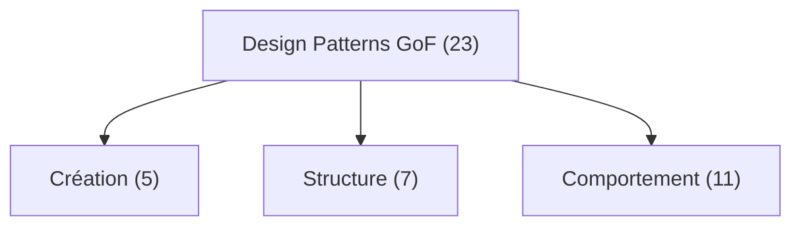
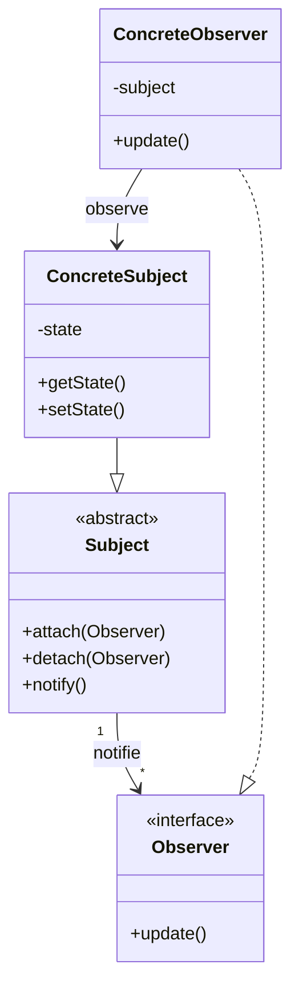

---
tags:
  - Architecture
  - Débutant
  - Concept
description: "Introduction aux design patterns : histoire, catégories, comment les lire et quand les utiliser."
estimated_time: "45 min"
fiche_number: 1
total_fiches: 17
cursus: "Architecture et Design Patterns"
---

# 01 - Introduction aux design patterns

> **En bref** : Comprendre ce que sont les design patterns, leur histoire, leurs catégories et quand les utiliser. Lecture estimée : 45 min.

## Prérequis

- [Cursus PHP](../02-php/index.md), fiches 7 à 14 (programmation orientée objet)
- Connaître les notions de classe, interface, héritage et polymorphisme

## Objectif de cette fiche

À la fin de cette fiche, tu sauras expliquer ce qu'est un design pattern, distinguer les trois catégories de patterns et décider quand utiliser un pattern plutôt que du code simple.

---

## Concepts

### Qu'est-ce qu'un design pattern ?

**Définition** : Un design pattern (patron de conception) est une solution réutilisable à un problème récurrent en conception logicielle. Ce n'est pas du code prêt à copier-coller : c'est un schéma, une stratégie que tu adaptes à ton contexte.

**Le problème que les design patterns résolvent** :

Sans design patterns, voici les problèmes rencontrés :

1. **Réinvention permanente** : chaque développeur invente sa propre solution à un problème déjà résolu des milliers de fois.
2. **Communication difficile** : sans vocabulaire commun, expliquer une architecture prend des heures au lieu d'une phrase.
3. **Erreurs répétées** : sans guide, on tombe dans les mêmes pièges que d'autres ont déjà identifiés.

**Comment les design patterns résolvent ces problèmes** :

| Problème | Solution apportée par les design patterns |
| --- | --- |
| Réinvention permanente | Solutions éprouvées, testées par des milliers de projets |
| Communication difficile | Vocabulaire partagé : "c'est un Observer" suffit à comprendre |
| Erreurs répétées | Les pièges sont documentés dans chaque pattern |

**Analogie concrète** : Pense à une recette de cuisine. Tu peux inventer toi-même comment faire une béchamel, mais il existe une recette standard que des milliers de cuisiniers ont perfectionnée. Tu peux l'adapter (ajouter du gruyère, changer le lait), mais la base reste la même. Un design pattern, c'est cette recette : un guide fiable que tu adaptes à ton plat.

**Ce qu'un design pattern n'est PAS** :

- Un design pattern n'est pas une bibliothèque ou un framework. Tu ne l'installes pas avec `composer require`. C'est un schéma que tu implémentes toi-même.
- Un design pattern n'est pas une règle absolue. C'est une recommandation. Si ton problème est simple, un pattern peut compliquer inutilement ton code.
- Un design pattern n'est pas du code copié-collé. Chaque implémentation doit être adaptée à ton contexte.

---

### L'histoire des design patterns : le Gang of Four

**Définition** : Le "Gang of Four" (GoF) désigne les quatre auteurs du livre "Design Patterns: Éléments of Reusable Object-Oriented Software" (1994) : Erich Gamma, Richard Helm, Ralph Johnson et John Vlissides.

**Le problème que le livre GoF résout** :

Sans ce livre, voici les problèmes rencontrés :

1. **Pas de catalogue** : les solutions existaient mais n'étaient pas répertoriées.
2. **Pas de formalisme** : chacun décrivait ses solutions à sa manière.
3. **Pas de classification** : impossible de chercher un pattern par type de problème.

**Comment le livre GoF résout ces problèmes** :

| Problème | Solution apportée |
| --- | --- |
| Pas de catalogue | 23 patterns documentés et classés |
| Pas de formalisme | Un format standard pour décrire chaque pattern |
| Pas de classification | 3 catégories : création, structure, comportement |

**Analogie concrète** : Avant le GoF, les patterns étaient comme des astuces de bricolage transmises oralement entre artisans. Le livre GoF, c'est le manuel technique officiel qui référence toutes ces astuces avec des schémas, des cas d'utilisation et des mises en garde.

**Le format GoF pour décrire un pattern** :

Chaque pattern du livre est décrit avec ces éléments :

| Élément | Description |
| --- | --- |
| Nom | Le nom du pattern (ex: "Observer") |
| Intention | Le problème qu'il résout en une phrase |
| Motivation | Un scénario concret où le pattern est utile |
| Structure | Un schéma UML montrant les classes impliquées |
| Participants | Les classes/interfaces et leur rôle |
| Conséquences | Avantages et inconvénients |
| Implémentation | Conseils pratiques pour coder le pattern |

---

### Les trois catégories de patterns

**Définition** : Les 23 patterns du GoF sont répartis en trois catégories selon le type de problème qu'ils résolvent.

**Catégorie 1 : Patterns de création (Creational)**

Ces patterns contrôlent **comment les objets sont créés**.

| Pattern | Problème résolu |
| --- | --- |
| Factory Method | Créer un objet sans spécifier sa classe exacte |
| Abstract Factory | Créer des familles d'objets liés |
| Builder | Construire un objet complexe étape par étape |
| Singleton | Garantir qu'une classe n'a qu'une seule instance |
| Prototype | Créer un objet en copiant un modèle existant |

**Catégorie 2 : Patterns de structure (Structural)**

Ces patterns contrôlent **comment les objets sont assemblés**.

| Pattern | Problème résolu |
| --- | --- |
| Adapter | Rendre compatibles deux interfaces différentes |
| Decorator | Ajouter des fonctionnalités à un objet sans modifier sa classe |
| Façade | Simplifier l'accès à un sous-système complexe |
| Proxy | Contrôler l'accès à un objet |
| Composite | Traiter un groupe d'objets comme un seul objet |
| Bridge | Séparer une abstraction de son implémentation |
| Flyweight | Partager des objets pour économiser la mémoire |

**Catégorie 3 : Patterns de comportement (Behavioral)**

Ces patterns contrôlent **comment les objets communiquent entre eux**.

| Pattern | Problème résolu |
| --- | --- |
| Observer | Notifier plusieurs objets quand un état change |
| Strategy | Choisir un algorithme à l'exécution |
| Command | Encapsuler une action dans un objet |
| Template Method | Définir le squelette d'un algorithme, laisser les sous-classes remplir les détails |
| State | Changer le comportement d'un objet selon son état |
| Iterator | Parcourir une collection sans exposer sa structure interne |
| Mediator | Centraliser les communications entre objets |
| Chain of Responsibility | Passer une requête le long d'une chaîne de gestionnaires |
| Visitor | Ajouter des opérations à des objets sans modifier leurs classes |
| Memento | Sauvegarder et restaurer l'état d'un objet |
| Interpreter | Interpréter un langage ou une expression |

**Analogie concrète** :

- **Création** : c'est l'usine qui fabrique les meubles. Comment produit-on chaque pièce ?
- **Structure** : c'est le plan de la maison. Comment les pièces s'assemblent-elles ?
- **Comportement** : c'est le règlement intérieur. Comment les habitants communiquent-ils ?

**Vue d'ensemble des 23 patterns GoF** :



Ce diagramme montre la classification complète. Les patterns de comportement sont les plus nombreux (11) car la communication entre objets est le problème le plus varié en programmation orientée objet.

---

### Comment lire et comprendre un pattern

**Définition** : Lire un pattern, c'est suivre un processus en 4 étapes pour comprendre le problème, la solution, les participants et les conséquences.

**Étape 1 : Identifier le problème**

Avant de lire la solution, assure-toi de comprendre le problème. Pose-toi ces questions :

- Quel problème ce pattern résout-il ?
- Est-ce que j'ai ce problème dans mon projet ?
- Est-ce que ce problème est suffisamment complexe pour justifier un pattern ?

**Étape 2 : Comprendre les participants**

Chaque pattern implique des classes ou interfaces avec des rôles précis :

```text
Exemple pour le pattern Observer :
- Subject (Sujet) : l'objet observe, celui qui change d'etat
- Observer (Observateur) : l'objet qui reagit aux changements
- ConcreteSubject : une implementation specifique du sujet
- ConcreteObserver : une implementation specifique de l'observateur
```

**Étape 3 : Lire le schéma**

Le schéma montre les relations entre les participants :



**Étape 4 : Examiner les conséquences**

Chaque pattern a des avantages et des inconvénients :

```text
Observer :
✅ Couplage faible entre Subject et Observer
✅ Ajout de nouveaux observers sans modifier le Subject
❌ Les observers sont notifies dans un ordre imprevisible
❌ Risque de mise a jour en cascade (un observer modifie le subject)
```

---

### Quand utiliser un pattern vs la simplicité

**Définition** : La décision d'utiliser un pattern repose sur un équilibre entre la complexité du problème et la complexité ajoutée par le pattern.

**Le problème de la sur-ingénierie** :

Sans discernement, voici les problèmes rencontrés :

1. **Code sur-complexe** : un pattern là où un simple `if` suffit.
2. **Lisibilité réduite** : trop d'abstractions rendent le code difficile à suivre.
3. **Temps perdu** : implémenter un pattern prend du temps qui n'est pas toujours justifié.

**Règle de décision : utiliser un pattern ou non**

| Situation | Décision |
| --- | --- |
| Le problème est simple et ne changera pas | Pas de pattern, du code direct |
| Le problème est simple mais pourrait évoluer | Pas de pattern maintenant, on refactorera si besoin |
| Le problème est complexe et récurrent | Pattern justifié |
| Plusieurs développeurs travaillent sur le même code | Pattern utile pour la communication |
| Le code doit être extensible sans modification | Pattern fortement recommandé |

**Analogie concrète** : Tu ne prends pas un camion de déménagement pour transporter un sac de courses. Le camion est utile quand tu déménages toute une maison. De la même manière, un design pattern est utile quand le problème est suffisamment complexe pour le justifier.

**La règle YAGNI (You Ain't Gonna Need It)** :

N'implémente pas un pattern "au cas où". Attends d'avoir le problème concret avant d'appliquer la solution. Cela ne veut pas dire ignorer les patterns : cela veut dire les appliquer au bon moment.

```php
// ❌ Sur-ingenierie : un pattern Factory pour un seul type
class UserFactory
{
    // On cree toujours le meme type d'objet
    // La factory n'apporte rien ici
    public function create(): User
    {
        return new User();
    }
}

// ✅ Simple et suffisant
$user = new User();
```

```php
// ✅ Factory justifiee : plusieurs types possibles
class NotificationFactory
{
    // Selon le canal, on cree un objet different
    // La factory centralise cette logique de creation
    public function create(string $channel): NotificationInterface
    {
        return match ($channel) {
            'email' => new EmailNotification(),
            'sms' => new SmsNotification(),
            'push' => new PushNotification(),
            default => throw new \InvalidArgumentException(
                "Canal inconnu : $channel"
            ),
        };
    }
}
```

---

## Étapes Pratiques

### Étape 1 : Identifier les patterns dans Symfony

Symfony utilise de nombreux design patterns. Voici comment les repérer.

Ouvre un terminal et crée un projet Symfony de test (si tu n'en as pas déjà un) :

```bash
# Creer un projet Symfony minimal pour les exemples
symfony new pattern-demo --webapp
cd pattern-demo
```

**Résultat attendu** :

```text
 [OK] Your project is now ready in /chemin/vers/pattern-demo
```

---

### Étape 2 : Repérer le pattern Observer dans Symfony

Symfony utilise un système d'événements qui est une implémentation du pattern Observer.

Crée un fichier `src/EventListener/UserCreatedListener.php` :

```php
<?php

namespace App\EventListener;

use App\Event\UserCreatedEvent;
use Symfony\Component\EventDispatcher\Attribute\AsEventListener;

// Ce listener (observateur) reagit quand un utilisateur est cree
// C'est le pattern Observer : le listener observe l'evenement
#[AsEventListener(event: UserCreatedEvent::class)]
class UserCreatedListener
{
    // Cette methode est appelee automatiquement quand l'evenement est emis
    public function __invoke(UserCreatedEvent $event): void
    {
        // On recupere l'email de l'utilisateur cree
        $email = $event->getUserEmail();

        // Ici, on pourrait envoyer un email de bienvenue
        // Pour l'exemple, on affiche un message
        echo "Nouvel utilisateur : $email\n";
    }
}
```

Crée le fichier d'événement `src/Event/UserCreatedEvent.php` :

```php
<?php

namespace App\Event;

use Symfony\Contracts\EventDispatcher\Event;

// Cet evenement represente la creation d'un utilisateur
// C'est le "sujet" dans le pattern Observer
class UserCreatedEvent extends Event
{
    // On passe les donnees necessaires dans le constructeur
    public function __construct(
        private string $userEmail,
    ) {
    }

    // Accesseur pour recuperer l'email
    public function getUserEmail(): string
    {
        return $this->userEmail;
    }
}
```

**Résultat attendu** :

```text
src/
├── Event/
│   └── UserCreatedEvent.php      ← Le sujet (Subject)
└── EventListener/
    └── UserCreatedListener.php   ← L'observateur (Observer)
```

---

### Étape 3 : Repérer le pattern Strategy dans Symfony

Les Voters de Symfony sont une implémentation du pattern Strategy.

Crée un fichier `src/Security/PostVoter.php` :

```php
<?php

namespace App\Security;

use App\Entity\Post;
use Symfony\Component\Security\Core\Authentication\Token\TokenInterface;
use Symfony\Component\Security\Core\Authorization\Voter\Voter;

// Ce Voter est une "strategie" pour decider si un utilisateur
// peut effectuer une action sur un Post
// Symfony choisit automatiquement le bon Voter selon le contexte
class PostVoter extends Voter
{
    // Cette methode indique si ce Voter sait gerer cette demande
    protected function supports(string $attribute, mixed $subject): bool
    {
        // Ce Voter gere uniquement les actions 'edit' et 'delete' sur des Post
        return in_array($attribute, ['edit', 'delete'])
            && $subject instanceof Post;
    }

    // Cette methode contient la logique de decision
    protected function voteOnAttribute(
        string $attribute,
        mixed $subject,
        TokenInterface $token
    ): bool {
        $user = $token->getUser();

        // Si l'utilisateur n'est pas connecte, on refuse
        if (!$user) {
            return false;
        }

        /** @var Post $post */
        $post = $subject;

        // On verifie si l'utilisateur est l'auteur du post
        return $post->getAuthor() === $user;
    }
}
```

**Résultat attendu** :

```text
Le Voter est automatiquement detecte par Symfony.
Quand tu appeles $this->denyAccessUnlessGranted('edit', $post),
Symfony parcourt tous les Voters et utilise celui qui "supports" cette demande.
C'est le pattern Strategy : chaque Voter est une strategie de securite.
```

---

### Étape 4 : Repérer le pattern Decorator dans Symfony

Le système de cache de Symfony utilise le pattern Decorator.

```php
<?php

namespace App\Service;

// Interface commune : le "contrat" que toutes les implementations respectent
interface PriceCalculatorInterface
{
    public function calculate(int $productId): float;
}

// Implementation de base : calcule le prix normalement
class PriceCalculator implements PriceCalculatorInterface
{
    public function calculate(int $productId): float
    {
        // Simule un calcul couteux (requete base de donnees, etc.)
        return 29.99;
    }
}

// Decorator : ajoute du cache SANS modifier la classe de base
// Le decorator implemente la meme interface et "enveloppe" l'objet original
class CachedPriceCalculator implements PriceCalculatorInterface
{
    // Le decorator contient une reference vers l'objet decore
    public function __construct(
        private PriceCalculatorInterface $inner,
        private array $cache = [],
    ) {
    }

    public function calculate(int $productId): float
    {
        // Si le resultat est en cache, on le retourne directement
        if (isset($this->cache[$productId])) {
            return $this->cache[$productId];
        }

        // Sinon, on delegue le calcul a l'objet decore
        $price = $this->inner->calculate($productId);

        // On stocke le resultat en cache pour la prochaine fois
        $this->cache[$productId] = $price;

        return $price;
    }
}
```

**Résultat attendu** :

```text
$calculator = new PriceCalculator();
$cachedCalculator = new CachedPriceCalculator($calculator);

// Premier appel : calcul reel (via $inner)
$price1 = $cachedCalculator->calculate(42); // 29.99

// Deuxieme appel : resultat en cache (pas de calcul)
$price2 = $cachedCalculator->calculate(42); // 29.99 (depuis le cache)
```

---

## Commandes Utiles

| Commande | Action |
| --- | --- |
| `php bin/console debug:event-dispatcher` | Lister tous les listeners (pattern Observer) |
| `php bin/console debug:container` | Lister tous les services (voir les decorators) |
| `php bin/console debug:autowiring` | Voir les interfaces et leurs implémentations |
| `php bin/console make:listener` | Créer un event listener |

---

## Pièges Fréquents

### Piège 1 : Appliquer un pattern partout

**Problème** : Tu viens d'apprendre le pattern Strategy et tu veux l'utiliser dans chaque classe, même quand un simple `if/else` suffit.

**Solution** : Avant d'utiliser un pattern, pose-toi ces trois questions :

1. Est-ce que j'ai un problème concret à résoudre ?
2. Est-ce que ce problème est récurrent ou susceptible d'évoluer ?
3. Est-ce que le pattern simplifie la compréhension du code ?

Si la réponse à l'une de ces questions est "non", n'utilise pas le pattern.

### Piège 2 : Confondre pattern et implémentation

**Problème** : Tu penses qu'un pattern doit être implémenté exactement comme dans le livre, avec les mêmes noms de classes.

**Solution** : Un pattern est un concept, pas un code rigide. Tu peux adapter les noms, fusionner des rôles, simplifier la structure. L'important est de respecter l'intention du pattern, pas sa forme exacte.

```php
// ❌ Copie rigide du livre
class ConcreteObserverA implements ObserverInterface { }
class ConcreteSubject implements SubjectInterface { }

// ✅ Noms adaptes au contexte metier
class EmailNotifier implements EventListenerInterface { }
class OrderPlacedEvent { }
```

### Piège 3 : Ignorer les patterns déjà présents dans le framework

**Problème** : Tu réimplémentes un pattern que Symfony fournit déjà (événements, voters, décorateurs de services).

**Solution** : Avant de créer ton propre système, vérifie si Symfony propose déjà une solution. Dans la plupart des cas, le framework a déjà implémenté le pattern pour toi.

---

## Checklist de Validation

- [ ] Je sais définir ce qu'est un design pattern en une phrase
- [ ] Je connais les trois catégories de patterns (création, structure, comportement)
- [ ] Je sais expliquer l'origine des patterns (Gang of Four, 1994)
- [ ] Je peux nommer au moins 2 patterns de chaque catégorie
- [ ] Je sais identifier un pattern Observer dans Symfony (events)
- [ ] Je sais identifier un pattern Strategy dans Symfony (voters)
- [ ] Je comprends quand ne PAS utiliser un pattern (YAGNI)

---

## Exercice Pratique

**Énoncé** : Identifie les design patterns dans un projet Symfony existant.

**Instructions** :

1. Ouvre un projet Symfony (le tien ou celui de test)
2. Identifie au moins 3 utilisations de design patterns dans le framework
3. Pour chaque pattern trouvé, écris :
   - Le nom du pattern
   - La catégorie (création, structure, comportement)
   - Les fichiers/classes concernés
   - Le problème que le pattern résout dans ce contexte

**Résultat attendu** : Un document avec au moins 3 patterns identifiés et documentés.

---

## Solution de l'Exercice

> **Note** : Cette section contient la solution complète. Essaie d'abord de résoudre l'exercice par toi-même avant de consulter cette solution.

---

Voici 3 patterns que tu peux trouver dans Symfony :

**Pattern 1 : Observer (Comportement)**

```text
Categorie : Comportement
Fichiers : EventDispatcher, EventListener, EventSubscriber
Probleme resolu : Decoupler les actions declenchees par un evenement
  du code qui emet cet evenement.

Exemple : Quand un utilisateur s'inscrit, on veut envoyer un email,
  mettre a jour les statistiques et logger l'action.
  Sans Observer, tout ce code serait dans le controleur.
  Avec Observer, chaque action est un listener independant.
```

**Pattern 2 : Strategy (Comportement)**

```text
Categorie : Comportement
Fichiers : Security/Voter, AccessDecisionManager
Probleme resolu : Choisir dynamiquement la strategie d'autorisation
  selon le contexte (type d'objet, role de l'utilisateur).

Exemple : Verifier si un utilisateur peut modifier un article.
  Le PostVoter gere les articles, le CommentVoter gere les commentaires.
  Symfony choisit automatiquement le bon Voter.
```

**Pattern 3 : Factory Method (Création)**

```text
Categorie : Creation
Fichiers : Form/FormFactory, FormBuilder
Probleme resolu : Creer des formulaires complexes sans que le controleur
  connaisse les details de construction.

Exemple : $this->createForm(PostType::class) delegue la creation
  du formulaire a la FormFactory, qui sait comment assembler
  les champs, les validations et les transformateurs de donnees.
```

---

## Navigation

→ Fiche suivante : **[SOLID - Principes fondamentaux](02-solid-principes.md)**
