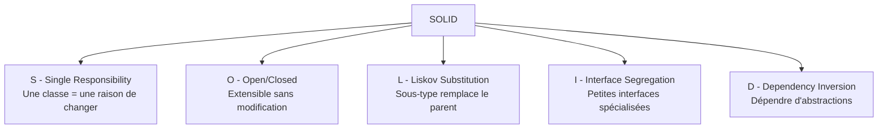
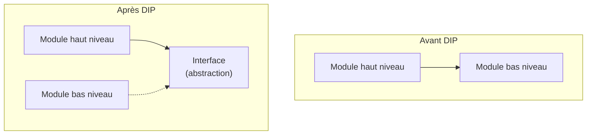

---
tags:
  - Architecture
  - Intermédiaire
  - Concept
description: "Les 5 principes SOLID expliqués avec des exemples PHP concrets."
estimated_time: "90 min"
fiche_number: 2
total_fiches: 17
cursus: "Architecture et Design Patterns"
---

# 02 - SOLID - Principes fondamentaux

> **En bref** : Comprendre et appliquer les 5 principes SOLID (Single Responsibility, Open/Closed, Liskov Substitution, Interface Segregation, Dependency Inversion) avec des exemples PHP. Lecture estimée : 90 min.

## Prérequis

- Fiche 1 : [Introduction aux design patterns](01-introduction-design-patterns.md)
- Programmation orientée objet en PHP (classes, interfaces, héritage)

## Objectif de cette fiche

À la fin de cette fiche, tu sauras expliquer chaque principe SOLID, identifier les violations dans du code existant et appliquer chaque principe dans du code PHP.

---

## Concepts

### Qu'est-ce que SOLID ?

**Définition** : SOLID est un acronyme qui regroupe 5 principes de conception orientée objet, formulés par Robert C. Martin ("Uncle Bob") dans les années 2000. Ces principes guident la création de code maintenable, extensible et testable.

**Le problème que SOLID résout** :

Sans SOLID, voici les problèmes rencontrés :

1. **Code fragile** : modifier une fonctionnalité casse d'autres parties du code.
2. **Code rigide** : ajouter une nouvelle fonctionnalité oblige à modifier de nombreux fichiers.
3. **Code non testable** : les dépendances sont codées "en dur", rendant les tests unitaires impossibles.

**Comment SOLID résout ces problèmes** :

| Problème | Solution apportée par SOLID |
| --- | --- |
| Code fragile | Chaque classe a une seule responsabilité, les modifications sont isolées |
| Code rigide | Le code est ouvert à l'extension mais fermé à la modification |
| Code non testable | Les dépendances sont injectées via des interfaces |

**Analogie concrète** : Pense à une cuisine bien organisée. Chaque tiroir a un rôle précis : un pour les couverts, un pour les ustensiles, un pour les épices. Si tu ajoutes un nouvel ustensile, tu le ranges dans le bon tiroir sans réorganiser toute la cuisine. Si tu changes les couverts, cela n'affecte pas les épices. SOLID organise ton code comme cette cuisine.

**Les 5 lettres** :

| Lettre | Principe | En une phrase |
| --- | --- | --- |
| S | Single Responsibility | Une classe = une raison de changer |
| O | Open/Closed | Ouvert à l'extension, fermé à la modification |
| L | Liskov Substitution | Un sous-type doit pouvoir remplacer son type parent |
| I | Interface Segregation | Plusieurs petites interfaces plutôt qu'une grosse |
| D | Dependency Inversion | Dépendre d'abstractions, pas d'implémentations |

**Vue d'ensemble des 5 principes** :



Chaque principe renforce les autres. Ensemble, ils produisent du code maintenable, extensible et testable.

---

### S - Single Responsibility Principle (SRP)

**Définition** : Une classe ne doit avoir qu'une seule raison de changer. Dit autrement, une classe ne doit être responsable que d'une seule chose.

**Le problème que SRP résout** :

Sans SRP, voici les problèmes rencontrés :

1. **Classe "couteau suisse"** : une classe qui fait tout (lire, écrire, valider, envoyer).
2. **Effet domino** : modifier l'envoi d'email casse la validation des données.
3. **Tests impossibles** : pour tester la validation, tu dois aussi configurer l'envoi d'email.

**Analogie concrète** : Dans un restaurant, le serveur prend les commandes, le cuisinier prépare les plats, le caissier encaisse. Si le serveur devait aussi cuisiner et encaisser, il serait débordé et ferait des erreurs partout. Chaque personne a un rôle unique.

**Exemple : violation de SRP** :

```php
<?php

// ❌ VIOLATION SRP : cette classe a 3 responsabilites
class UserService
{
    // Responsabilite 1 : creer un utilisateur en base de donnees
    public function createUser(string $name, string $email): void
    {
        // Code pour inserer en base de donnees
        $pdo = new \PDO('pgsql:host=localhost;dbname=app', 'user', 'pass');
        $stmt = $pdo->prepare('INSERT INTO users (name, email) VALUES (?, ?)');
        $stmt->execute([$name, $email]);
    }

    // Responsabilite 2 : envoyer un email
    public function sendWelcomeEmail(string $email): void
    {
        // Code pour envoyer un email
        mail($email, 'Bienvenue', 'Bienvenue sur notre site !');
    }

    // Responsabilite 3 : valider les donnees
    public function validateEmail(string $email): bool
    {
        return filter_var($email, FILTER_VALIDATE_EMAIL) !== false;
    }
}
```

**Exemple : SRP respecté** :

```php
<?php

// ✅ SRP respecte : chaque classe a une seule responsabilite

// Responsabilite 1 : gerer la persistance des utilisateurs
class UserRepository
{
    public function __construct(
        private \PDO $pdo,
    ) {
    }

    // Cette classe ne fait qu'une chose : lire/ecrire des utilisateurs en BDD
    public function save(string $name, string $email): void
    {
        $stmt = $this->pdo->prepare(
            'INSERT INTO users (name, email) VALUES (?, ?)'
        );
        $stmt->execute([$name, $email]);
    }
}

// Responsabilite 2 : envoyer des emails
class WelcomeEmailSender
{
    // Cette classe ne fait qu'une chose : envoyer des emails de bienvenue
    public function send(string $email): void
    {
        mail($email, 'Bienvenue', 'Bienvenue sur notre site !');
    }
}

// Responsabilite 3 : valider des donnees
class EmailValidator
{
    // Cette classe ne fait qu'une chose : valider des emails
    public function isValid(string $email): bool
    {
        return filter_var($email, FILTER_VALIDATE_EMAIL) !== false;
    }
}
```

---

### O - Open/Closed Principle (OCP)

**Définition** : Une classe doit être ouverte à l'extension mais fermée à la modification. Tu peux ajouter de nouveaux comportements sans modifier le code existant.

**Le problème que OCP résout** :

Sans OCP, voici les problèmes rencontrés :

1. **Modification risquée** : chaque nouvelle fonctionnalité oblige à modifier du code qui fonctionne déjà.
2. **Switch/if grandissant** : à chaque nouveau type, tu ajoutes un `case` dans un `switch` de plus en plus long.
3. **Régression** : modifier du code existant peut introduire des bugs dans des fonctionnalités qui marchaient.

**Analogie concrète** : Pense à une multiprise. Pour ajouter un appareil, tu branches une nouvelle prise. Tu ne démontes pas la multiprise pour ajouter un emplacement. La multiprise est "fermée" (tu ne la modifies pas) mais "ouverte" (tu peux y brancher de nouvelles choses).

**Exemple : violation de OCP** :

```php
<?php

// ❌ VIOLATION OCP : a chaque nouveau type de notification,
// on doit modifier cette methode
class NotificationService
{
    public function send(string $type, string $message): void
    {
        // Chaque nouveau canal oblige a modifier ce switch
        switch ($type) {
            case 'email':
                // Code pour envoyer un email
                echo "Email : $message\n";
                break;
            case 'sms':
                // Code pour envoyer un SMS
                echo "SMS : $message\n";
                break;
            // ❌ Pour ajouter 'push', on doit modifier cette classe
            // case 'push':
            //     ...
        }
    }
}
```

**Exemple : OCP respecté** :

```php
<?php

// ✅ OCP respecte : on ajoute de nouveaux canaux SANS modifier le code existant

// Interface commune pour tous les canaux de notification
interface NotificationChannelInterface
{
    public function send(string $message): void;
}

// Canal email : une implementation independante
class EmailChannel implements NotificationChannelInterface
{
    public function send(string $message): void
    {
        // Logique specifique a l'email
        echo "Email : $message\n";
    }
}

// Canal SMS : une autre implementation independante
class SmsChannel implements NotificationChannelInterface
{
    public function send(string $message): void
    {
        // Logique specifique au SMS
        echo "SMS : $message\n";
    }
}

// ✅ Pour ajouter 'push', on cree une NOUVELLE classe
// sans modifier les classes existantes
class PushChannel implements NotificationChannelInterface
{
    public function send(string $message): void
    {
        echo "Push : $message\n";
    }
}

// Le service utilise l'interface, pas les implementations
class NotificationService
{
    public function __construct(
        // On injecte le canal voulu
        private NotificationChannelInterface $channel,
    ) {
    }

    public function send(string $message): void
    {
        // Pas de switch : le bon canal est deja injecte
        $this->channel->send($message);
    }
}
```

---

### L - Liskov Substitution Principle (LSP)

**Définition** : Si une classe B hérite d'une classe A, alors on doit pouvoir utiliser B partout où A est attendue, sans que le programme ne se comporte de manière inattendue.

**Le problème que LSP résout** :

Sans LSP, voici les problèmes rencontrés :

1. **Héritage trompeur** : une sous-classe a le même type que son parent mais se comporte différemment.
2. **Exceptions inattendues** : du code qui fonctionne avec le parent plante avec la sous-classe.
3. **Contrats violés** : la sous-classe ne respecte pas les promesses du parent.

**Analogie concrète** : Si tu commandes un "véhicule de livraison" et qu'on te livre un vélo, c'est un véhicule... mais il ne peut pas transporter 500 kg de marchandises. Le vélo viole le "contrat" de véhicule de livraison. LSP dit que chaque sous-type doit honorer les promesses de son type parent.

**Exemple : violation de LSP** :

```php
<?php

// Classe parent : un rectangle a une largeur et une hauteur
class Rectangle
{
    public function __construct(
        protected int $width,
        protected int $height,
    ) {
    }

    public function setWidth(int $width): void
    {
        $this->width = $width;
    }

    public function setHeight(int $height): void
    {
        $this->height = $height;
    }

    public function getArea(): int
    {
        return $this->width * $this->height;
    }
}

// ❌ VIOLATION LSP : le carre modifie le comportement de setWidth/setHeight
// Un carre EST un rectangle mathematiquement, mais pas en programmation
class Square extends Rectangle
{
    // Pour un carre, largeur = hauteur, donc on force les deux
    public function setWidth(int $width): void
    {
        $this->width = $width;
        $this->height = $width; // ❌ Effet de bord inattendu
    }

    public function setHeight(int $height): void
    {
        $this->width = $height; // ❌ Effet de bord inattendu
        $this->height = $height;
    }
}

// Ce code fonctionne avec Rectangle mais PAS avec Square
function testRectangle(Rectangle $rect): void
{
    $rect->setWidth(5);
    $rect->setHeight(10);

    // On s'attend a 5 * 10 = 50
    // Avec Square, on obtient 10 * 10 = 100 ❌
    echo $rect->getArea(); // 50 avec Rectangle, 100 avec Square
}
```

**Exemple : LSP respecté** :

```php
<?php

// ✅ LSP respecte : on utilise une interface commune sans heritage trompeur

interface ShapeInterface
{
    public function getArea(): int;
}

// Le rectangle implemente l'interface directement
class Rectangle implements ShapeInterface
{
    public function __construct(
        private int $width,
        private int $height,
    ) {
    }

    public function getArea(): int
    {
        return $this->width * $this->height;
    }
}

// Le carre implemente l'interface directement, sans heriter de Rectangle
class Square implements ShapeInterface
{
    public function __construct(
        private int $side,
    ) {
    }

    public function getArea(): int
    {
        return $this->side * $this->side;
    }
}
```

---

### I - Interface Segregation Principle (ISP)

**Définition** : Un client ne doit pas être forcé d'implémenter des méthodes qu'il n'utilise pas. Préfère plusieurs petites interfaces spécifiques à une seule interface générale.

**Le problème que ISP résout** :

Sans ISP, voici les problèmes rencontrés :

1. **Implémentations vides** : une classe est forcée d'implémenter des méthodes dont elle n'a pas besoin.
2. **Couplage inutile** : un changement dans une méthode non utilisée oblige à recompiler/tester des classes qui ne l'utilisent pas.
3. **Interface "fourre-tout"** : une interface avec 20 méthodes dont chaque classe n'utilise que 3.

**Analogie concrète** : Imagine un permis de conduire universel qui t'oblige à savoir piloter un avion, un bateau et un camion en plus d'une voiture. Si tu veux juste conduire une voiture, tu es forcé d'apprendre des choses inutiles. ISP dit : crée un permis voiture, un permis bateau, un permis avion. Chacun ne contient que ce qui est nécessaire.

**Exemple : violation de ISP** :

```php
<?php

// ❌ VIOLATION ISP : une interface trop large
interface WorkerInterface
{
    public function work(): void;
    public function eat(): void;
    public function sleep(): void;
}

// Un humain utilise les 3 methodes : ok
class HumanWorker implements WorkerInterface
{
    public function work(): void { echo "Je travaille\n"; }
    public function eat(): void { echo "Je mange\n"; }
    public function sleep(): void { echo "Je dors\n"; }
}

// ❌ Un robot ne mange pas et ne dort pas
// Il est force d'implementer des methodes inutiles
class RobotWorker implements WorkerInterface
{
    public function work(): void { echo "Je travaille\n"; }

    // ❌ Implementations vides ou exceptions : signe de violation ISP
    public function eat(): void
    {
        throw new \LogicException('Un robot ne mange pas');
    }

    public function sleep(): void
    {
        throw new \LogicException('Un robot ne dort pas');
    }
}
```

**Exemple : ISP respecté** :

```php
<?php

// ✅ ISP respecte : interfaces separees par responsabilite

interface WorkableInterface
{
    public function work(): void;
}

interface FeedableInterface
{
    public function eat(): void;
}

interface SleepableInterface
{
    public function sleep(): void;
}

// Un humain implemente les 3 interfaces
class HumanWorker implements WorkableInterface, FeedableInterface, SleepableInterface
{
    public function work(): void { echo "Je travaille\n"; }
    public function eat(): void { echo "Je mange\n"; }
    public function sleep(): void { echo "Je dors\n"; }
}

// Un robot n'implemente QUE ce dont il a besoin
class RobotWorker implements WorkableInterface
{
    public function work(): void { echo "Je travaille\n"; }
    // Pas de methode eat() ni sleep() : le robot n'en a pas besoin
}
```

---

### D - Dependency Inversion Principle (DIP)

**Définition** : Les modules de haut niveau ne doivent pas dépendre des modules de bas niveau. Les deux doivent dépendre d'abstractions (interfaces). Les abstractions ne doivent pas dépendre des détails. Les détails doivent dépendre des abstractions.

**Le problème que DIP résout** :

Sans DIP, voici les problèmes rencontrés :

1. **Couplage fort** : le code métier dépend directement de la base de données, du système de fichiers, etc.
2. **Tests impossibles** : pour tester la logique métier, tu dois avoir une base de données réelle.
3. **Changement difficile** : remplacer MySQL par PostgreSQL oblige à modifier le code métier.

**Analogie concrète** : Quand tu branches un appareil sur une prise électrique, tu ne te soucies pas de la centrale électrique (nucléaire, éolienne, solaire). La prise est l'abstraction. L'appareil (module haut niveau) dépend de la prise (abstraction), pas de la centrale (détail). Tu peux changer de centrale sans modifier tes appareils.

**Ce que DIP n'est PAS** :

- DIP n'est pas l'injection de dépendances. L'injection de dépendances est une technique pour mettre en oeuvre DIP, mais ce n'est pas la même chose. DIP est un principe, l'injection est une implémentation.
- DIP ne signifie pas "tout doit être une interface". Seules les dépendances volatiles (qui peuvent changer) doivent passer par des interfaces.

**Avant vs après DIP** :



Avant DIP, le module haut niveau dépend directement du bas niveau. Après DIP, les deux dépendent d'une abstraction (interface). Le module bas niveau implémente l'interface (flèche pointillée).

**Exemple : violation de DIP** :

```php
<?php

// ❌ VIOLATION DIP : le module haut niveau depend du module bas niveau

// Module bas niveau : acces a la base de donnees
class MySQLUserRepository
{
    public function findById(int $id): array
    {
        // Requete MySQL directe
        $pdo = new \PDO('mysql:host=localhost;dbname=app', 'root', '');
        $stmt = $pdo->prepare('SELECT * FROM users WHERE id = ?');
        $stmt->execute([$id]);
        return $stmt->fetch();
    }
}

// ❌ Module haut niveau : depend directement de MySQL
class UserService
{
    private MySQLUserRepository $repository;

    public function __construct()
    {
        // ❌ Dependance codee en dur : impossible de changer de BDD
        // ❌ Impossible de tester sans base MySQL reelle
        $this->repository = new MySQLUserRepository();
    }

    public function getUser(int $id): array
    {
        return $this->repository->findById($id);
    }
}
```

**Exemple : DIP respecté** :

```php
<?php

// ✅ DIP respecte : les deux niveaux dependent d'une abstraction

// L'abstraction (interface) est definie dans le module haut niveau
interface UserRepositoryInterface
{
    public function findById(int $id): array;
}

// Module bas niveau : implemente l'abstraction
class PostgreSQLUserRepository implements UserRepositoryInterface
{
    public function __construct(
        private \PDO $pdo,
    ) {
    }

    public function findById(int $id): array
    {
        $stmt = $this->pdo->prepare('SELECT * FROM users WHERE id = ?');
        $stmt->execute([$id]);
        return $stmt->fetch();
    }
}

// Module haut niveau : depend de l'abstraction, pas de l'implementation
class UserService
{
    public function __construct(
        // ✅ On injecte l'interface, pas la classe concrete
        private UserRepositoryInterface $repository,
    ) {
    }

    public function getUser(int $id): array
    {
        // UserService ne sait pas si c'est MySQL, PostgreSQL ou un mock
        return $this->repository->findById($id);
    }
}

// ✅ Pour les tests, on peut creer un faux repository
class InMemoryUserRepository implements UserRepositoryInterface
{
    private array $users = [
        1 => ['id' => 1, 'name' => 'Alice', 'email' => 'alice@test.com'],
    ];

    public function findById(int $id): array
    {
        return $this->users[$id] ?? [];
    }
}
```

---

## Étapes Pratiques

### Étape 1 : Détecter les violations SOLID dans un code existant

Crée un fichier `src/BadExample/OrderProcessor.php` pour analyser les violations :

```php
<?php

namespace App\BadExample;

// ❌ Cette classe viole PLUSIEURS principes SOLID
// Exercice : identifie lesquels
class OrderProcessor
{
    // ❌ SRP : cette classe fait trop de choses
    public function process(array $order): void
    {
        // Validation (responsabilite 1)
        if (empty($order['items'])) {
            throw new \InvalidArgumentException('Commande vide');
        }

        // Calcul du total (responsabilite 2)
        $total = 0;
        foreach ($order['items'] as $item) {
            $total += $item['price'] * $item['quantity'];
        }

        // Persistance en BDD (responsabilite 3)
        $pdo = new \PDO('mysql:host=localhost;dbname=shop', 'root', '');
        $stmt = $pdo->prepare('INSERT INTO orders (total) VALUES (?)');
        $stmt->execute([$total]);

        // Envoi d'email (responsabilite 4)
        mail($order['email'], 'Commande confirmee', "Total : $total EUR");

        // ❌ OCP : pour ajouter un SMS, on doit modifier cette methode
        // ❌ DIP : on depend directement de PDO et mail()
    }
}
```

**Résultat attendu** : tu identifies les violations suivantes :

```text
1. SRP viole : 4 responsabilites dans une seule classe
2. OCP viole : impossible d'ajouter un canal de notification sans modifier process()
3. DIP viole : dependances directes vers PDO et la fonction mail()
```

---

### Étape 2 : Refactorer en respectant SRP

Sépare les responsabilités :

```php
<?php

namespace App\GoodExample;

// ✅ SRP : cette classe ne fait QUE valider les commandes
class OrderValidator
{
    public function validate(array $order): void
    {
        if (empty($order['items'])) {
            throw new \InvalidArgumentException('Commande vide');
        }
    }
}

// ✅ SRP : cette classe ne fait QUE calculer les totaux
class OrderCalculator
{
    public function calculateTotal(array $items): float
    {
        $total = 0;

        foreach ($items as $item) {
            // On additionne prix * quantite pour chaque article
            $total += $item['price'] * $item['quantity'];
        }

        return $total;
    }
}
```

---

### Étape 3 : Refactorer en respectant OCP et DIP

```php
<?php

namespace App\GoodExample;

// ✅ Interface pour la persistance (DIP)
interface OrderRepositoryInterface
{
    public function save(float $total): void;
}

// ✅ Interface pour les notifications (OCP + DIP)
interface OrderNotifierInterface
{
    public function notify(string $email, float $total): void;
}

// ✅ Implementation PostgreSQL du repository
class PostgreSQLOrderRepository implements OrderRepositoryInterface
{
    public function __construct(
        private \PDO $pdo,
    ) {
    }

    public function save(float $total): void
    {
        $stmt = $this->pdo->prepare('INSERT INTO orders (total) VALUES (?)');
        $stmt->execute([$total]);
    }
}

// ✅ Implementation email du notifier
class EmailOrderNotifier implements OrderNotifierInterface
{
    public function notify(string $email, float $total): void
    {
        mail($email, 'Commande confirmee', "Total : $total EUR");
    }
}

// ✅ Le processeur depend d'interfaces, pas d'implementations
class OrderProcessor
{
    public function __construct(
        private OrderValidator $validator,
        private OrderCalculator $calculator,
        private OrderRepositoryInterface $repository,
        private OrderNotifierInterface $notifier,
    ) {
    }

    public function process(array $order): void
    {
        // Chaque etape est deleguee a une classe specialisee
        $this->validator->validate($order);
        $total = $this->calculator->calculateTotal($order['items']);
        $this->repository->save($total);
        $this->notifier->notify($order['email'], $total);
    }
}
```

**Résultat attendu** :

```text
Avant : 1 classe avec 4 responsabilites et des dependances en dur
Apres : 6 classes, chacune avec 1 responsabilite, liees par des interfaces

Structure :
src/GoodExample/
├── OrderValidator.php         ← SRP : validation
├── OrderCalculator.php        ← SRP : calcul
├── OrderRepositoryInterface.php   ← DIP : abstraction persistance
├── PostgreSQLOrderRepository.php  ← Implementation persistance
├── OrderNotifierInterface.php     ← DIP + OCP : abstraction notification
├── EmailOrderNotifier.php         ← Implementation notification
└── OrderProcessor.php             ← Orchestration via interfaces
```

---

## Commandes Utiles

| Commande | Action |
| --- | --- |
| `php bin/console debug:autowiring` | Vérifier les interfaces et leurs implémentations |
| `php bin/console debug:container --tag=controller.service_arguments` | Voir les services injectés dans les contrôleurs |
| `vendor/bin/phpstan analyse src/` | Détecter les problèmes de types (aide à respecter LSP) |

---

## Pièges Fréquents

### Piège 1 : Pousser SRP trop loin

**Problème** : Tu crées une classe par méthode, avec des dizaines de fichiers pour une fonctionnalité simple.

**Solution** : SRP dit "une raison de changer", pas "une seule méthode". Une classe peut avoir plusieurs méthodes si elles concernent la même responsabilité.

```php
// ❌ Trop granulaire : chaque operation dans sa propre classe
class UserNameUpdater { }
class UserEmailUpdater { }
class UserPasswordUpdater { }

// ✅ Une seule classe qui gere la mise a jour des utilisateurs
class UserUpdater
{
    public function updateName(User $user, string $name): void { }
    public function updateEmail(User $user, string $email): void { }
    public function updatePassword(User $user, string $password): void { }
}
```

### Piège 2 : Créer des interfaces pour tout

**Problème** : Tu crées une interface pour chaque classe, même quand il n'y aura jamais qu'une seule implémentation.

**Solution** : Crée une interface uniquement quand :

- Tu prévois plusieurs implémentations (ex: PostgreSQL + InMemory pour les tests)
- Tu veux découpler deux modules
- La classe est une dépendance volatile (accès externe, envoi d'email, etc.)

### Piège 3 : Confondre héritage et composition

**Problème** : Tu utilises l'héritage pour réutiliser du code, ce qui viole souvent LSP.

**Solution** : Préfère la composition (injecter un objet) à l'héritage (hériter d'une classe). L'héritage doit modéliser une relation "est un" véritable.

```php
// ❌ Heritage pour reutiliser du code
class LoggingService extends FileWriter
{
    // LoggingService n'EST PAS un FileWriter
}

// ✅ Composition : LoggingService UTILISE un FileWriter
class LoggingService
{
    public function __construct(
        private FileWriter $writer,
    ) {
    }
}
```

---

## Checklist de Validation

- [ ] Je sais expliquer chaque lettre de SOLID en une phrase
- [ ] Je sais identifier une violation de SRP dans du code
- [ ] Je sais refactorer du code pour respecter OCP (utiliser des interfaces)
- [ ] Je comprends pourquoi le carré n'est pas un rectangle en POO (LSP)
- [ ] Je sais quand créer une interface (ISP) et quand c'est inutile
- [ ] Je sais appliquer DIP en injectant des interfaces plutôt que des classes

---

## Exercice Pratique

**Énoncé** : Refactore la classe suivante pour qu'elle respecte les 5 principes SOLID.

```php
<?php

class ReportGenerator
{
    public function generate(array $data): void
    {
        // Validation
        if (empty($data)) {
            throw new \InvalidArgumentException('Donnees vides');
        }

        // Formatage en HTML
        $html = '<table>';
        foreach ($data as $row) {
            $html .= '<tr><td>' . $row['name'] . '</td>';
            $html .= '<td>' . $row['value'] . '</td></tr>';
        }
        $html .= '</table>';

        // Sauvegarde dans un fichier
        file_put_contents('/tmp/report.html', $html);

        // Envoi par email
        mail('admin@example.com', 'Rapport', $html);
    }
}
```

**Indications** :

- Identifie les responsabilités (SRP)
- Crée des interfaces pour les dépendances volatiles (DIP)
- Rends le formatage extensible sans modifier le code existant (OCP)

**Résultat attendu** : au moins 4 classes et 2 interfaces.

---

## Solution de l'Exercice

> **Note** : Cette section contient la solution complète. Essaie d'abord de résoudre l'exercice par toi-même avant de consulter cette solution.

---

```php
<?php

// Interface pour le formatage (OCP + DIP)
// On pourra ajouter JSON, CSV sans modifier le code existant
interface ReportFormatterInterface
{
    public function format(array $data): string;
}

// Interface pour la sauvegarde (DIP)
interface ReportStorageInterface
{
    public function save(string $content): void;
}

// Interface pour l'envoi (DIP)
interface ReportSenderInterface
{
    public function send(string $content): void;
}

// Validation (SRP)
class ReportValidator
{
    public function validate(array $data): void
    {
        if (empty($data)) {
            throw new \InvalidArgumentException('Donnees vides');
        }
    }
}

// Formatage HTML (SRP + OCP : une implementation parmi d'autres possibles)
class HtmlReportFormatter implements ReportFormatterInterface
{
    public function format(array $data): string
    {
        $html = '<table>';

        foreach ($data as $row) {
            $html .= '<tr>';
            $html .= '<td>' . htmlspecialchars($row['name']) . '</td>';
            $html .= '<td>' . htmlspecialchars($row['value']) . '</td>';
            $html .= '</tr>';
        }

        $html .= '</table>';

        return $html;
    }
}

// Sauvegarde fichier (SRP)
class FileReportStorage implements ReportStorageInterface
{
    public function __construct(
        private string $filePath,
    ) {
    }

    public function save(string $content): void
    {
        file_put_contents($this->filePath, $content);
    }
}

// Envoi email (SRP)
class EmailReportSender implements ReportSenderInterface
{
    public function __construct(
        private string $recipientEmail,
    ) {
    }

    public function send(string $content): void
    {
        mail($this->recipientEmail, 'Rapport', $content);
    }
}

// Orchestrateur (depend d'interfaces, pas d'implementations)
class ReportGenerator
{
    public function __construct(
        private ReportValidator $validator,
        private ReportFormatterInterface $formatter,
        private ReportStorageInterface $storage,
        private ReportSenderInterface $sender,
    ) {
    }

    public function generate(array $data): void
    {
        // Chaque etape est deleguee a un specialiste
        $this->validator->validate($data);
        $content = $this->formatter->format($data);
        $this->storage->save($content);
        $this->sender->send($content);
    }
}
```

---

## Navigation

← Fiche précédente : **[Introduction aux design patterns](01-introduction-design-patterns.md)**

→ Fiche suivante : **[SOLID - Application dans Symfony](03-solid-symfony.md)**
