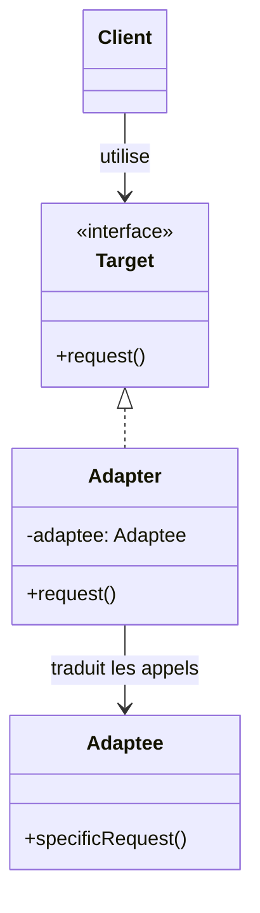
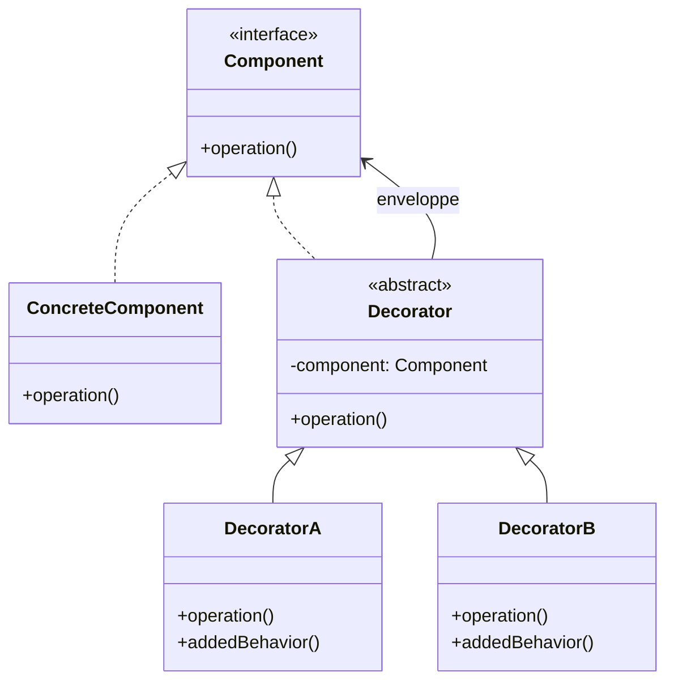

---
tags:
  - Architecture
  - Intermédiaire
  - Pratique
description: "Patterns de structure : Adapter, Decorator, Façade et Proxy avec exemples PHP et Symfony."
estimated_time: "75 min"
fiche_number: 5
total_fiches: 17
cursus: "Architecture et Design Patterns"
---

# 05 - Patterns de structure

> **En bref** : Comprendre et implémenter les patterns Adapter, Decorator, Façade et Proxy en PHP, avec des exemples concrets dans Symfony. Lecture estimée : 75 min.

## Prérequis

- Fiche 1 : [Introduction aux design patterns](01-introduction-design-patterns.md)
- Fiche 2 : [SOLID - Principes fondamentaux](02-solid-principes.md)
- Fiche 4 : [Patterns de création](04-patterns-creation.md)

## Objectif de cette fiche

À la fin de cette fiche, tu sauras implémenter les 4 principaux patterns de structure, expliquer la différence entre chacun et reconnaître leurs usages dans Symfony.

---

## Concepts

### Qu'est-ce qu'un pattern de structure ?

**Définition** : Un pattern de structure contrôle la manière dont les classes et les objets sont assemblés pour former des structures plus grandes. Ces patterns utilisent la composition (un objet contient un autre objet) plutôt que l'héritage.

**Le problème que les patterns de structure résolvent** :

Sans patterns de structure, voici les problèmes rencontrés :

1. **Interfaces incompatibles** : deux classes doivent collaborer mais leurs interfaces ne sont pas compatibles.
2. **Code monolithique** : tout le code est dans une seule classe, impossible d'ajouter des fonctionnalités sans la modifier.
3. **Complexité exposée** : les utilisateurs d'un sous-système doivent connaître tous ses détails internes.

**Comment les patterns de structure résolvent ces problèmes** :

| Problème | Pattern | Solution |
| --- | --- | --- |
| Interfaces incompatibles | Adapter | Traduit une interface en une autre |
| Ajout de fonctionnalités | Decorator | Enveloppe un objet pour ajouter des comportements |
| Complexité exposée | Façade | Cache la complexité derrière une interface simple |
| Contrôle d'accès | Proxy | Interpose un intermédiaire entre le client et l'objet |

**Analogie concrète** : Pense à la construction d'une maison. L'Adapter est un adaptateur de prise électrique (il rend compatible deux formats différents). Le Decorator est une couche de peinture (il ajoute quelque chose sans changer la structure du mur). La Façade est l'interrupteur (un bouton simple qui cache toute la complexité électrique). Le Proxy est le gardien de l'immeuble (il contrôle qui entre).

---

### Adapter

**Définition** : Le pattern Adapter permet à deux interfaces incompatibles de travailler ensemble. Il "traduit" les appels d'une interface vers une autre.

**Le problème que Adapter résout** :

Sans Adapter, voici les problèmes rencontrés :

1. **Code tiers incompatible** : une librairie externe utilise une interface différente de celle de ton application.
2. **Migration impossible** : passer d'un service à un autre (ex: Mailchimp vers Sendinblue) oblige à modifier tout le code.
3. **Tests bloqués** : impossible de remplacer un service réel par un mock si les interfaces diffèrent.

**Analogie concrète** : Quand tu voyages au Royaume-Uni, les prises sont différentes de celles en France. Tu utilises un adaptateur de voyage : il ne change ni ta prise ni la prise britannique, mais il permet aux deux de fonctionner ensemble. C'est exactement ce que fait le pattern Adapter.

**Ce que Adapter n'est PAS** :

- Adapter n'est pas Decorator. Adapter change l'interface d'un objet (la forme de la prise). Decorator garde la même interface mais ajoute des fonctionnalités (comme un multiprises avec protection surtension).
- Adapter n'est pas Façade. Adapter adapte une SEULE interface. Façade simplifie un SYSTÈME entier.

**Structure du pattern** :



Le Client utilise l'interface Target. L'Adapter traduit les appels vers l'Adaptee sans que le Client ne connaisse l'Adaptee.

**Implémentation en PHP** :

```php
<?php

// L'interface attendue par ton application
interface PaymentGatewayInterface
{
    // Ton application utilise cette methode pour payer
    public function charge(float $amount, string $currency): PaymentResult;
}

// Classe de resultat utilisee par ton application
class PaymentResult
{
    public function __construct(
        public readonly bool $success,
        public readonly string $transactionId,
        public readonly string $message,
    ) {
    }
}

// La librairie externe (que tu ne peux PAS modifier)
// Elle utilise une interface DIFFERENTE de la tienne
class StripeClient
{
    // Stripe utilise des centimes, pas des euros
    // Stripe retourne un tableau, pas un objet PaymentResult
    public function createCharge(int $amountInCents, string $curr): array
    {
        // Simule un appel a l'API Stripe
        return [
            'status' => 'succeeded',
            'id' => 'ch_' . uniqid(),
            'description' => 'Payment processed',
        ];
    }
}

// L'Adapter : fait le pont entre StripeClient et PaymentGatewayInterface
class StripeAdapter implements PaymentGatewayInterface
{
    public function __construct(
        // L'adapter contient une reference vers l'objet adapte
        private StripeClient $stripe,
    ) {
    }

    public function charge(float $amount, string $currency): PaymentResult
    {
        // Conversion : ton app utilise des euros, Stripe des centimes
        $amountInCents = (int) ($amount * 100);

        // Appel a Stripe via son interface propre
        $result = $this->stripe->createCharge($amountInCents, $currency);

        // Conversion du resultat Stripe vers ton format
        return new PaymentResult(
            success: $result['status'] === 'succeeded',
            transactionId: $result['id'],
            message: $result['description'],
        );
    }
}

// Utilisation : ton code ne connait QUE PaymentGatewayInterface
function processOrder(PaymentGatewayInterface $gateway): void
{
    $result = $gateway->charge(29.99, 'EUR');

    if ($result->success) {
        echo "Paiement reussi : {$result->transactionId}\n";
    }
}

// Injection de l'adapter
$stripe = new StripeClient();
$adapter = new StripeAdapter($stripe);
processOrder($adapter);
```

**Adapter dans Symfony : les serializer encoders**

```php
<?php

// Symfony utilise des Adapters pour normaliser/serialiser les donnees
// Chaque encoder "adapte" un format (JSON, XML, CSV)
// vers une interface commune

use Symfony\Component\Serializer\Encoder\JsonEncoder;
use Symfony\Component\Serializer\Encoder\XmlEncoder;
use Symfony\Component\Serializer\Serializer;

// Les encoders adaptent differents formats vers la meme interface
$serializer = new Serializer([], [
    new JsonEncoder(),  // Adapte le format JSON
    new XmlEncoder(),   // Adapte le format XML
]);

// L'interface est la meme quel que soit le format
$json = $serializer->serialize($data, 'json');
$xml = $serializer->serialize($data, 'xml');
```

---

### Decorator

**Définition** : Le pattern Decorator ajoute dynamiquement des responsabilités à un objet, sans modifier sa classe. Le decorator "enveloppe" l'objet original et ajoute son comportement avant ou après avoir délégué l'appel.

**Le problème que Decorator résout** :

Sans Decorator, voici les problèmes rencontrés :

1. **Héritage explosif** : pour combiner des fonctionnalités, tu dois créer une classe pour chaque combinaison (LoggedCachedService, CachedLoggedService, etc.).
2. **Modification de code stable** : ajouter du logging oblige à modifier la classe originale.
3. **Fonctionnalités non composables** : impossible d'activer/désactiver des fonctionnalités indépendamment.

**Comparaison héritage vs Decorator** :

| Héritage | Decorator |
| --- | --- |
| Combinaisons figées à la compilation | Combinaisons choisies à l'exécution |
| Explosion de sous-classes | Un decorator par fonctionnalité |
| Modification de la hiérarchie | Aucune modification des classes existantes |
| Non composable | Composable : empiler plusieurs decorators |

**Analogie concrète** : Pense à un cadeau. Tu as un objet (le cadeau). Tu l'enveloppes dans du papier cadeau (premier decorator), tu ajoutes un ruban (deuxième decorator), puis une étiquette (troisième decorator). Chaque couche ajoute quelque chose sans modifier le cadeau lui-même. Tu peux ajouter ou retirer des couches indépendamment.

**Structure du pattern** :



Chaque Decorator enveloppe un Component (qui peut être un autre Decorator). C'est cette imbrication qui permet d'empiler les fonctionnalités.

**Implémentation en PHP** :

```php
<?php

// Interface commune : le decorator et l'objet original la respectent
interface LoggerInterface
{
    public function log(string $level, string $message): void;
}

// Implementation de base : ecrit dans un fichier
class FileLogger implements LoggerInterface
{
    public function __construct(
        private string $filePath,
    ) {
    }

    public function log(string $level, string $message): void
    {
        $line = date('Y-m-d H:i:s') . " [$level] $message\n";
        file_put_contents($this->filePath, $line, FILE_APPEND);
    }
}

// Decorator 1 : ajoute un prefixe avec le nom du canal
class ChannelLoggerDecorator implements LoggerInterface
{
    public function __construct(
        // Reference vers l'objet decore (le "cadeau" dans l'analogie)
        private LoggerInterface $inner,
        private string $channel,
    ) {
    }

    public function log(string $level, string $message): void
    {
        // On enrichit le message AVANT de deleguer
        $prefixedMessage = "[{$this->channel}] $message";

        // On delegue le travail a l'objet decore
        $this->inner->log($level, $prefixedMessage);
    }
}

// Decorator 2 : filtre les messages par niveau minimum
class FilteredLoggerDecorator implements LoggerInterface
{
    private const LEVELS = [
        'debug' => 0,
        'info' => 1,
        'warning' => 2,
        'error' => 3,
    ];

    public function __construct(
        private LoggerInterface $inner,
        private string $minLevel = 'info',
    ) {
    }

    public function log(string $level, string $message): void
    {
        // On filtre : si le niveau est trop bas, on ne log pas
        $currentLevel = self::LEVELS[$level] ?? 0;
        $minimumLevel = self::LEVELS[$this->minLevel] ?? 0;

        if ($currentLevel >= $minimumLevel) {
            // Le message passe le filtre : on delegue
            $this->inner->log($level, $message);
        }
        // Sinon, le message est ignore silencieusement
    }
}

// Decorator 3 : mesure le temps d'execution du logging
class TimedLoggerDecorator implements LoggerInterface
{
    public function __construct(
        private LoggerInterface $inner,
    ) {
    }

    public function log(string $level, string $message): void
    {
        $start = microtime(true);

        // On delegue le travail
        $this->inner->log($level, $message);

        $duration = microtime(true) - $start;
        // On pourrait enregistrer la duree quelque part
        echo "Log execute en " . round($duration * 1000, 2) . " ms\n";
    }
}

// Utilisation : on empile les decorators comme des couches
$logger = new FileLogger('/var/log/app.log');

// Couche 1 : ajouter le nom du canal
$logger = new ChannelLoggerDecorator($logger, 'app');

// Couche 2 : filtrer les messages trop bas
$logger = new FilteredLoggerDecorator($logger, 'warning');

// Couche 3 : mesurer le temps
$logger = new TimedLoggerDecorator($logger);

// Seuls les messages 'warning' et 'error' seront logges
$logger->log('debug', 'Message de debug');    // Ignore (niveau trop bas)
$logger->log('warning', 'Attention !');       // Logge avec canal et timing
$logger->log('error', 'Erreur critique !');   // Logge avec canal et timing
```

**Decorator dans Symfony : décoration de services**

```yaml
# config/services.yaml
services:
    # Service original
    App\Service\ProductFinder:
        arguments:
            - '@doctrine.orm.entity_manager'

    # Decorator : ajoute du cache autour du service original
    App\Service\CachedProductFinder:
        decorates: App\Service\ProductFinder
        arguments:
            # .inner est une reference vers le service decore
            - '@.inner'
            - '@cache.app'
```

```php
<?php

namespace App\Service;

// Le decorator dans Symfony
class CachedProductFinder implements ProductFinderInterface
{
    public function __construct(
        // .inner = le service original (ProductFinder)
        private ProductFinderInterface $inner,
        private CacheInterface $cache,
    ) {
    }

    public function findById(int $id): ?Product
    {
        $cacheKey = "product_$id";

        // On cherche d'abord en cache
        return $this->cache->get($cacheKey, function () use ($id) {
            // Si pas en cache, on delegue au service original
            return $this->inner->findById($id);
        });
    }
}
```

---

### Façade

**Définition** : Le pattern Façade fournit une interface simplifiée à un ensemble de classes ou un sous-système complexe. La façade cache la complexité et expose uniquement les opérations nécessaires.

**Le problème que Façade résout** :

Sans Façade, voici les problèmes rencontrés :

1. **API trop complexe** : le client doit connaître de nombreuses classes et leur ordre d'utilisation.
2. **Couplage excessif** : le client dépend de tous les détails du sous-système.
3. **Code dupliqué** : chaque client reproduit la même séquence d'appels.

**Analogie concrète** : Pense à un guichet de banque. Pour transférer de l'argent, tu ne vas pas dans la salle des coffres, tu ne consultes pas le grand livre des comptes et tu ne fais pas l'écriture comptable toi-même. Tu vas au guichet (la façade) et tu dis "je veux transférer 100 euros". Le guichet fait tout le travail en coulisses.

**Ce que Façade n'est PAS** :

- Façade n'est pas Adapter. Adapter adapte une interface existante pour qu'elle corresponde à une autre. Façade crée une NOUVELLE interface simplifiée.
- Façade n'est pas un singleton. La façade est un objet normal qui peut être instancié plusieurs fois.

**Implémentation en PHP** :

```php
<?php

// Sous-systeme complexe : 4 classes independantes

class InventoryService
{
    public function checkStock(int $productId, int $quantity): bool
    {
        // Verifie que le stock est suffisant
        echo "Verification du stock...\n";
        return true; // Simplifie pour l'exemple
    }

    public function reserveStock(int $productId, int $quantity): void
    {
        echo "Stock reserve pour le produit $productId\n";
    }
}

class PaymentService
{
    public function authorize(float $amount, string $cardNumber): string
    {
        // Autorise le paiement et retourne un ID de transaction
        echo "Paiement de $amount EUR autorise\n";
        return 'tx_' . uniqid();
    }

    public function capture(string $transactionId): void
    {
        echo "Paiement $transactionId capture\n";
    }
}

class ShippingService
{
    public function calculateCost(string $address): float
    {
        echo "Calcul des frais de livraison...\n";
        return 5.99;
    }

    public function createShipment(int $orderId, string $address): string
    {
        echo "Expedition creee pour la commande $orderId\n";
        return 'SHIP_' . uniqid();
    }
}

class NotificationService
{
    public function sendOrderConfirmation(string $email, int $orderId): void
    {
        echo "Email de confirmation envoye a $email\n";
    }
}

// La Facade : une interface simple pour tout le processus de commande
class OrderFacade
{
    public function __construct(
        private InventoryService $inventory,
        private PaymentService $payment,
        private ShippingService $shipping,
        private NotificationService $notification,
    ) {
    }

    // UNE seule methode qui orchestre tout le processus
    public function placeOrder(
        int $productId,
        int $quantity,
        float $price,
        string $cardNumber,
        string $address,
        string $email,
    ): int {
        // Etape 1 : verifier le stock
        if (!$this->inventory->checkStock($productId, $quantity)) {
            throw new \RuntimeException('Stock insuffisant');
        }

        // Etape 2 : reserver le stock
        $this->inventory->reserveStock($productId, $quantity);

        // Etape 3 : calculer les frais de livraison
        $shippingCost = $this->shipping->calculateCost($address);

        // Etape 4 : autoriser le paiement
        $total = ($price * $quantity) + $shippingCost;
        $transactionId = $this->payment->authorize($total, $cardNumber);

        // Etape 5 : capturer le paiement
        $this->payment->capture($transactionId);

        // Etape 6 : creer l'expedition
        $orderId = random_int(1000, 9999);
        $this->shipping->createShipment($orderId, $address);

        // Etape 7 : envoyer la confirmation
        $this->notification->sendOrderConfirmation($email, $orderId);

        return $orderId;
    }
}

// Utilisation : le client ne connait QUE la facade
$facade = new OrderFacade(
    new InventoryService(),
    new PaymentService(),
    new ShippingService(),
    new NotificationService(),
);

// UN seul appel au lieu de 7 appels a 4 services differents
$orderId = $facade->placeOrder(
    productId: 42,
    quantity: 2,
    price: 29.99,
    cardNumber: '4242424242424242',
    address: '10 rue de Paris, 75001 Paris',
    email: 'client@example.com',
);

echo "Commande $orderId passee avec succes !\n";
```

**Façade dans Symfony : le HttpKernel**

```text
Le HttpKernel de Symfony est une Facade.

Quand tu appelles $kernel->handle($request), en coulisses :
1. Le Router trouve le controleur correspondant a l'URL
2. L'ArgumentResolver resout les arguments du controleur
3. Le controleur est execute
4. Le ResponseListener formate la reponse
5. Les listeners d'evenements sont appeles

Tu n'as pas besoin de connaitre ces details.
$kernel->handle($request) fait tout le travail.
```

---

### Proxy

**Définition** : Le pattern Proxy fournit un substitut ou un intermédiaire à un autre objet pour contrôler l'accès à celui-ci. Le proxy a la même interface que l'objet réel.

**Le problème que Proxy résout** :

Sans Proxy, voici les problèmes rencontrés :

1. **Chargement coûteux** : un objet lourd est chargé en mémoire même si on ne l'utilise pas.
2. **Pas de contrôle d'accès** : n'importe quel code peut accéder à n'importe quel objet.
3. **Pas de logging** : impossible de tracer les accès à un objet sans modifier sa classe.

**Types de proxy** :

| Type | Rôle | Exemple |
| --- | --- | --- |
| Proxy virtuel (lazy) | Retarde la création de l'objet coûteux | Chargement lazy de Doctrine |
| Proxy de protection | Contrôle les droits d'accès | Vérification des permissions |
| Proxy de logging | Enregistre les accès | Audit des opérations sensibles |
| Proxy de cache | Stocke les résultats en cache | Cache de requêtes |

**Analogie concrète** : Pense à une carte bancaire. La carte (le proxy) représente ton compte en banque (l'objet réel). Tu n'emportes pas tout ton argent avec toi (chargement lazy). La carte vérifie ton code PIN avant d'autoriser un paiement (contrôle d'accès). Et chaque transaction est enregistrée (logging).

**Ce que Proxy n'est PAS** :

- Proxy n'est pas Decorator. Decorator AJOUTE des fonctionnalités. Proxy CONTRÔLE l'accès. Le decorator enrichit, le proxy protège ou optimise.
- Proxy n'est pas Adapter. Proxy a la MÊME interface que l'objet réel. Adapter CHANGE l'interface.

**Implémentation en PHP** :

```php
<?php

// Interface commune : le proxy et l'objet reel la partagent
interface ImageInterface
{
    public function display(): string;
    public function getFilename(): string;
}

// L'objet reel : charge une image (operation couteuse)
class RealImage implements ImageInterface
{
    private string $data;

    public function __construct(
        private string $filename,
    ) {
        // Le chargement est couteux (lecture disque, decompression, etc.)
        $this->loadFromDisk();
    }

    private function loadFromDisk(): void
    {
        // Simule un chargement lent
        echo "Chargement de l'image {$this->filename} depuis le disque...\n";
        $this->data = "Donnees de l'image {$this->filename}";
    }

    public function display(): string
    {
        return $this->data;
    }

    public function getFilename(): string
    {
        return $this->filename;
    }
}

// Proxy virtuel (lazy loading)
// L'image n'est chargee QUE quand on appelle display()
class LazyImageProxy implements ImageInterface
{
    // L'objet reel n'est pas cree immediatement
    private ?RealImage $realImage = null;

    public function __construct(
        private string $filename,
    ) {
        // PAS de chargement ici : on attend d'en avoir besoin
        echo "Proxy cree pour {$this->filename} (pas encore charge)\n";
    }

    public function display(): string
    {
        // Chargement a la demande (lazy loading)
        if ($this->realImage === null) {
            echo "Premier acces : chargement reel...\n";
            $this->realImage = new RealImage($this->filename);
        }

        return $this->realImage->display();
    }

    public function getFilename(): string
    {
        // Pas besoin de charger l'image pour retourner le nom
        return $this->filename;
    }
}

// Utilisation
echo "--- Creation des proxies ---\n";
$image1 = new LazyImageProxy('photo1.jpg');
$image2 = new LazyImageProxy('photo2.jpg');
$image3 = new LazyImageProxy('photo3.jpg');
// Aucune image n'est chargee a ce stade

echo "\n--- Affichage de l'image 2 ---\n";
echo $image2->display(); // Seule l'image 2 est chargee
// Les images 1 et 3 ne sont jamais chargees si on ne les utilise pas
```

**Proxy dans Symfony : Doctrine Lazy Loading**

```php
<?php

// Doctrine utilise des proxies pour le lazy loading des relations

// Quand tu charges un Article, ses commentaires ne sont PAS charges
// Doctrine cree un Proxy qui ressemble a une Collection
$article = $repository->find(42);

// A ce stade, $article->getComments() retourne un Proxy
// Les commentaires ne sont pas encore en memoire

// Le chargement reel se fait au premier acces
foreach ($article->getComments() as $comment) {
    // C'est ici que Doctrine execute la requete SQL
    // pour charger les commentaires
    echo $comment->getContent();
}
```

---

## Étapes Pratiques

### Étape 1 : Implémenter un Adapter pour un service externe

Crée un adapter pour intégrer un service de traduction externe :

```php
<?php

namespace App\Service\Translation;

// Interface attendue par ton application
interface TranslatorInterface
{
    public function translate(
        string $text,
        string $sourceLang,
        string $targetLang,
    ): string;
}

// Librairie externe fictive (que tu ne peux pas modifier)
class DeepLClient
{
    public function translateText(array $params): array
    {
        // L'API DeepL utilise un format specifique
        return [
            'translations' => [
                ['text' => "Texte traduit : {$params['text']}"],
            ],
        ];
    }
}

// L'Adapter : fait le pont
class DeepLTranslatorAdapter implements TranslatorInterface
{
    public function __construct(
        private DeepLClient $client,
    ) {
    }

    public function translate(
        string $text,
        string $sourceLang,
        string $targetLang,
    ): string {
        // On convertit les parametres au format attendu par DeepL
        $result = $this->client->translateText([
            'text' => $text,
            'source_lang' => strtoupper($sourceLang),
            'target_lang' => strtoupper($targetLang),
        ]);

        // On extrait le resultat au format attendu par notre application
        return $result['translations'][0]['text'];
    }
}
```

**Résultat attendu** :

```text
$adapter = new DeepLTranslatorAdapter(new DeepLClient());
$result = $adapter->translate('Hello', 'en', 'fr');
// $result === "Texte traduit : Hello"
```

---

### Étape 2 : Implémenter un Decorator de cache dans Symfony

```php
<?php

namespace App\Service;

use Symfony\Contracts\Cache\CacheInterface;
use Symfony\Contracts\Cache\ItemInterface;

interface ProductFinderInterface
{
    public function findBestSellers(int $limit): array;
}

// Service original
class ProductFinder implements ProductFinderInterface
{
    public function __construct(
        private ProductRepository $repository,
    ) {
    }

    public function findBestSellers(int $limit): array
    {
        // Requete couteuse a la base de donnees
        return $this->repository->findBestSellers($limit);
    }
}

// Decorator : ajoute du cache sans modifier ProductFinder
class CachedProductFinder implements ProductFinderInterface
{
    public function __construct(
        private ProductFinderInterface $inner,
        private CacheInterface $cache,
    ) {
    }

    public function findBestSellers(int $limit): array
    {
        $cacheKey = "best_sellers_$limit";

        // Si le resultat est en cache, on le retourne directement
        // Sinon, on delegue au service original et on met en cache
        return $this->cache->get(
            $cacheKey,
            function (ItemInterface $item) use ($limit) {
                // Le cache expire apres 1 heure
                $item->expiresAfter(3600);

                // On delegue au service original
                return $this->inner->findBestSellers($limit);
            }
        );
    }
}
```

Configuration dans `services.yaml` :

```yaml
services:
    App\Service\CachedProductFinder:
        decorates: App\Service\ProductFinder
        arguments:
            - '@.inner'
            - '@cache.app'
```

**Résultat attendu** :

```text
Premier appel : requête SQL exécutée, résultat mis en cache (3600 secondes)
Appels suivants : résultat retourné depuis le cache, pas de requête SQL
```

---

### Étape 3 : Implémenter une Façade pour simplifier un processus

```php
<?php

namespace App\Service;

// Facade pour la gestion des utilisateurs
// Simplifie l'interaction avec 4 services differents
class UserManagementFacade
{
    public function __construct(
        private UserRepository $repository,
        private PasswordHasherInterface $hasher,
        private MailerInterface $mailer,
        private LoggerInterface $logger,
    ) {
    }

    // UNE methode simple pour un processus complexe
    public function registerUser(string $email, string $password): User
    {
        // Etape 1 : verification unicite
        $existing = $this->repository->findByEmail($email);
        if ($existing) {
            throw new \DomainException('Email deja utilise');
        }

        // Etape 2 : creation et hashage
        $user = new User();
        $user->setEmail($email);
        $user->setPassword($this->hasher->hash($password));

        // Etape 3 : persistance
        $this->repository->save($user);

        // Etape 4 : notification
        $this->mailer->sendWelcomeEmail($user);

        // Etape 5 : logging
        $this->logger->info('Nouvel utilisateur enregistre', [
            'email' => $email,
        ]);

        return $user;
    }
}
```

**Résultat attendu** :

```text
// Sans facade : 5 appels à 4 services différents
$existing = $repository->findByEmail($email);
$user = new User();
$user->setPassword($hasher->hash($password));
$repository->save($user);
$mailer->sendWelcomeEmail($user);
$logger->info('...');

// Avec facade : 1 seul appel
$user = $facade->registerUser($email, $password);
```

---

## Commandes Utiles

| Commande | Action |
| --- | --- |
| `php bin/console debug:container --tag=proxy` | Lister les services proxy |
| `php bin/console debug:container --deprecations` | Vérifier les services dépréciés |
| `php bin/console cache:clear` | Vider le cache (utile pour tester les decorators de cache) |
| `php bin/console debug:container NomDuService` | Voir si un service est décoré |

---

## Pièges Fréquents

### Piège 1 : Confondre Adapter et Decorator

**Problème** : Tu utilises un Adapter quand tu voulais un Decorator, ou inversement.

**Solution** : Pose-toi cette question :

- Est-ce que je veux **changer l'interface** ? → Adapter
- Est-ce que je veux **ajouter un comportement en gardant la même interface** ? → Decorator

### Piège 2 : Façade qui fait trop de choses

**Problème** : Ta façade devient un "God Object" avec 30 méthodes.

**Solution** : Crée plusieurs façades, une par domaine fonctionnel : `OrderFacade`, `UserFacade`, `ProductFacade`.

### Piège 3 : Proxy qui ne délègue pas tout

**Problème** : Ton proxy n'implémente pas toutes les méthodes de l'interface, ou modifie le comportement au lieu de contrôler l'accès.

**Solution** : Le proxy doit avoir EXACTEMENT la même interface que l'objet réel. S'il modifie le comportement, c'est un Decorator, pas un Proxy.

---

## Checklist de Validation

- [ ] Je sais implémenter un Adapter pour intégrer une librairie externe
- [ ] Je sais implémenter un Decorator pour ajouter du cache ou du logging
- [ ] Je sais créer une Façade pour simplifier un processus complexe
- [ ] Je comprends la différence entre Adapter (change l'interface) et Decorator (garde l'interface)
- [ ] Je sais configurer un decorator de service dans Symfony (`decorates`)
- [ ] Je reconnais le lazy loading de Doctrine comme un exemple de Proxy

---

## Exercice Pratique

**Énoncé** : Crée un système de logging avec les patterns Adapter et Decorator.

**Instructions** :

1. Définis une interface `LoggerInterface` avec une méthode `log(string $level, string $message)`
2. Crée un `FileLogger` (implémentation de base)
3. Crée un `SlackLoggerAdapter` qui adapte une API Slack fictive vers `LoggerInterface`
4. Crée un `TimestampLoggerDecorator` qui ajoute la date/heure au message
5. Crée un `JsonLoggerDecorator` qui formate le message en JSON
6. Compose les decorators : `JsonDecorator(TimestampDecorator(FileLogger))`

**Résultat attendu** : Un appel à `log('error', 'Serveur HS')` produit un JSON avec timestamp écrit dans un fichier.

---

## Solution de l'Exercice

> **Note** : Cette section contient la solution complète. Essaie d'abord de résoudre l'exercice par toi-même avant de consulter cette solution.

---

```php
<?php

// Interface commune
interface LoggerInterface
{
    public function log(string $level, string $message): void;
}

// Implementation de base
class FileLogger implements LoggerInterface
{
    public function __construct(
        private string $filePath,
    ) {
    }

    public function log(string $level, string $message): void
    {
        file_put_contents(
            $this->filePath,
            $message . "\n",
            FILE_APPEND
        );
    }
}

// Adapter pour Slack
class SlackApiClient
{
    public function postMessage(string $channel, string $text): void
    {
        echo "Slack [$channel]: $text\n";
    }
}

class SlackLoggerAdapter implements LoggerInterface
{
    public function __construct(
        private SlackApiClient $slack,
        private string $channel = '#alerts',
    ) {
    }

    public function log(string $level, string $message): void
    {
        $emoji = match ($level) {
            'error' => ':red_circle:',
            'warning' => ':warning:',
            default => ':information_source:',
        };
        $this->slack->postMessage(
            $this->channel,
            "$emoji [$level] $message"
        );
    }
}

// Decorator : timestamp
class TimestampLoggerDecorator implements LoggerInterface
{
    public function __construct(
        private LoggerInterface $inner,
    ) {
    }

    public function log(string $level, string $message): void
    {
        $timestamp = date('Y-m-d H:i:s');
        $this->inner->log($level, "[$timestamp] $message");
    }
}

// Decorator : format JSON
class JsonLoggerDecorator implements LoggerInterface
{
    public function __construct(
        private LoggerInterface $inner,
    ) {
    }

    public function log(string $level, string $message): void
    {
        $json = json_encode([
            'level' => $level,
            'message' => $message,
        ], JSON_UNESCAPED_UNICODE);

        $this->inner->log($level, $json);
    }
}

// Composition
$logger = new FileLogger('/tmp/app.log');
$logger = new TimestampLoggerDecorator($logger);
$logger = new JsonLoggerDecorator($logger);

$logger->log('error', 'Serveur HS');
// Ecrit dans /tmp/app.log :
// {"level":"error","message":"[2026-03-20 10:30:00] Serveur HS"}
```

---

## Navigation

← Fiche précédente : **[Patterns de création](04-patterns-creation.md)**

→ Fiche suivante : **[Patterns de comportement](06-patterns-comportement.md)**
