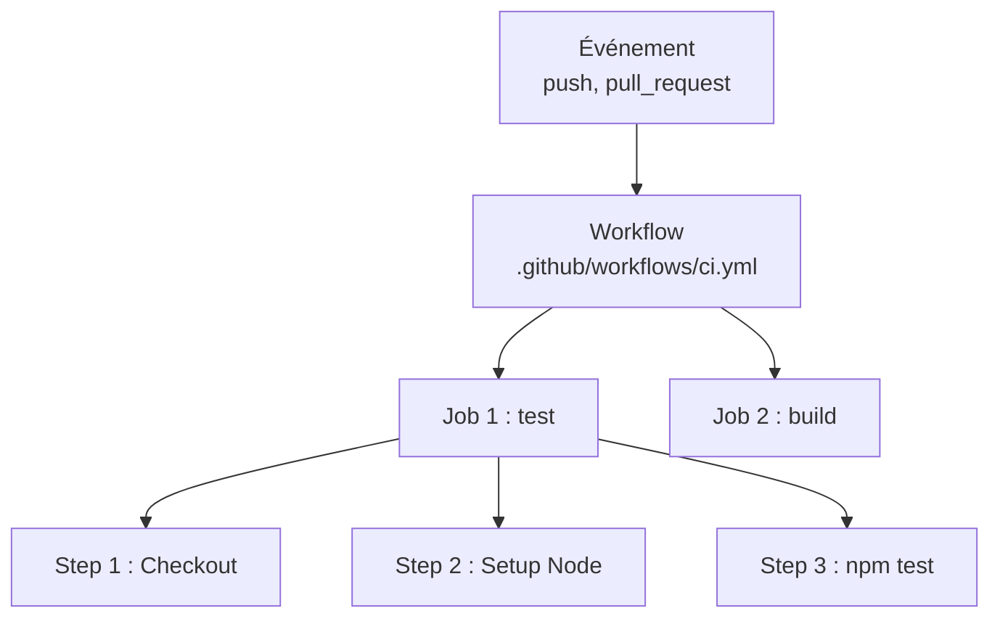

---
tags:
  - CI/CD
  - Débutant
  - Pratique
description: "Créer et exécuter un premier workflow GitHub Actions"
estimated_time: "75 min"
fiche_number: 2
total_fiches: 10
cursus: "CI/CD Pipelines"
---

# 02 - GitHub Actions - Premiers pas

> **En bref** : Cette fiche t'apprend à créer ton premier workflow GitHub Actions : structure YAML, événements déclencheurs, jobs, steps, et utilisation d'actions du marketplace. Lecture estimée : 75 min.

## Prérequis

- Avoir lu la fiche [01 - Introduction à la CI/CD](01-introduction-ci-cd.md)
- Avoir un compte GitHub
- Savoir utiliser Git (clone, commit, push)
- Savoir lire un fichier YAML (indentation par espaces, clé: valeur)

## Objectif de cette fiche

À la fin de cette fiche, tu sauras créer un workflow GitHub Actions complet avec plusieurs jobs et steps, comprendre les événements déclencheurs, et utiliser des actions du marketplace.

---

## Concepts

Cette section explique tous les concepts nécessaires. Lis-la entièrement avant de passer aux étapes pratiques.

### Qu'est-ce que GitHub Actions ?

**Définition** : GitHub Actions est un service d'intégration et de déploiement continus intégré à GitHub. Il permet d'exécuter des tâches automatisées (tests, build, déploiement) directement depuis un dépôt GitHub, sans outil externe.

**Le problème que GitHub Actions résout** :

Sans GitHub Actions, voici les problèmes rencontrés :

1. **Outil externe nécessaire** : Pour faire de la CI/CD, tu dois installer et configurer un outil séparé (Jenkins, Travis CI). Cela demande un serveur, de la maintenance, et une connexion entre l'outil et GitHub.

2. **Configuration complexe** : Chaque outil a sa propre syntaxe, ses propres concepts. Passer de l'un à l'autre demande un réapprentissage complet.

3. **Pas de partage** : Chaque équipe réécrit les mêmes tâches (installer Node.js, configurer PHP, publier un package). Il n'existe pas de moyen simple de partager ces configurations.

**Comment GitHub Actions résout ces problèmes** :

| Problème | Solution apportée par GitHub Actions |
| --- | --- |
| Outil externe nécessaire | Intégré à GitHub, aucune installation requise |
| Configuration complexe | Un seul fichier YAML dans `.github/workflows/` |
| Pas de partage | Marketplace avec des milliers d'actions réutilisables |

**Analogie concrète** : Imagine un immeuble avec un gardien intégré. Pas besoin d'engager une société de sécurité externe. Le gardien connaît déjà l'immeuble, les résidents, les accès. GitHub Actions est ce gardien intégré : il connaît déjà ton dépôt, tes branches, tes commits.

**Ce que GitHub Actions n'est PAS** :

- GitHub Actions n'est pas un serveur que tu dois héberger. Les workflows s'exécutent sur des machines fournies par GitHub (appelées _runners_).
- GitHub Actions n'est pas limité à la CI/CD. Tu peux automatiser n'importe quelle tâche : étiqueter des issues, publier une release, envoyer une notification.

---

### Qu'est-ce qu'un workflow ?

**Définition** : Un workflow est un processus automatisé défini dans un fichier YAML. Il se place dans le dossier `.github/workflows/` du dépôt. Un dépôt peut contenir plusieurs workflows.

**Structure d'un workflow** :

```text
Workflow (fichier .yml)
├── name          → Nom affiché dans l'interface GitHub
├── on            → Événements qui déclenchent le workflow
└── jobs          → Liste des tâches à exécuter
    ├── job_1
    │   ├── runs-on   → Environnement d'exécution
    │   └── steps     → Liste des étapes
    │       ├── step_1
    │       ├── step_2
    │       └── step_3
    └── job_2
        ├── runs-on
        └── steps
            ├── step_1
            └── step_2
```

**Relation entre les éléments** :

| Élément | Contient | Exécution |
| --- | --- | --- |
| Workflow | Un ou plusieurs jobs | Déclenché par un événement Git |
| Job | Un ou plusieurs steps | S'exécute sur un runner (machine virtuelle) |
| Step | Une commande ou une action | S'exécute séquentiellement dans le job |

Le schéma suivant illustre la structure hiérarchique d'un workflow GitHub Actions :



Un événement Git déclenche un workflow. Le workflow contient un ou plusieurs jobs qui s'exécutent en parallèle (ou en séquence avec `needs`). Chaque job contient des steps qui s'exécutent dans l'ordre.

---

### Qu'est-ce qu'un événement (event) ?

**Définition** : Un événement est une action dans GitHub qui déclenche un workflow. Par exemple : un push, la création d'une pull request, la publication d'une release.

**Les événements les plus courants** :

| Événement | Déclencheur | Exemple d'utilisation |
| --- | --- | --- |
| `push` | Du code est poussé sur une branche | Lancer les tests à chaque push |
| `pull_request` | Une PR est créée, mise à jour ou fermée | Vérifier le code avant fusion |
| `schedule` | Horaire planifié (syntaxe cron) | Audit de sécurité chaque nuit |
| `workflow_dispatch` | Bouton manuel dans l'interface GitHub | Déployer en production à la demande |
| `release` | Une release GitHub est publiée | Publier un package |

**Syntaxe YAML pour les événements** :

```yaml
# Événement unique
on: push

# Événement avec filtre sur les branches
on:
  push:
    branches:
      - main
      - develop

# Plusieurs événements
on:
  push:
    branches:
      - main
  pull_request:
    branches:
      - main

# Événement planifié (chaque jour à 2h du matin UTC)
on:
  schedule:
    - cron: "0 2 * * *"

# Déclenchement manuel
on:
  workflow_dispatch:
```

---

### Qu'est-ce qu'un job ?

**Définition** : Un job est une tâche au sein d'un workflow. Chaque job s'exécute sur un runner (une machine virtuelle). Par défaut, les jobs s'exécutent en parallèle. Tu peux les rendre séquentiels avec le mot-clé `needs`.

**Le problème que les jobs résolvent** :

Sans jobs séparés, voici les problèmes rencontrés :

1. **Tout dans un seul bloc** : Si le lint et les tests sont dans le même job, un échec du lint empêche de savoir si les tests passent aussi.

2. **Pas de parallélisme** : Si tout est séquentiel, le pipeline est lent. Le lint prend 30 secondes, les tests prennent 5 minutes. En séquentiel : 5 min 30. En parallèle : 5 minutes.

**Comment les jobs résolvent ces problèmes** :

| Problème | Solution |
| --- | --- |
| Tout dans un seul bloc | Chaque tâche est un job isolé avec un résultat distinct |
| Pas de parallélisme | Les jobs s'exécutent en parallèle par défaut |

**Syntaxe YAML pour les jobs** :

```yaml
jobs:
  # Premier job : vérifier le formatage
  lint:
    # Exécuter sur une machine Ubuntu
    runs-on: ubuntu-latest
    steps:
      - uses: actions/checkout@v4
      - run: npm run lint

  # Deuxième job : exécuter les tests
  test:
    # Exécuter sur une machine Ubuntu
    runs-on: ubuntu-latest
    # Ce job attend que le job "lint" soit terminé avec succès
    needs: lint
    steps:
      - uses: actions/checkout@v4
      - run: npm test
```

---

### Qu'est-ce qu'un step ?

**Définition** : Un step est une étape au sein d'un job. Chaque step exécute soit une commande shell (mot-clé `run`), soit une action réutilisable (mot-clé `uses`). Les steps s'exécutent toujours de façon séquentielle dans un job.

**Deux types de steps** :

| Type | Mot-clé | Exemple |
| --- | --- | --- |
| Commande shell | `run` | `run: echo "Hello"` |
| Action réutilisable | `uses` | `uses: actions/checkout@v4` |

---

### Qu'est-ce qu'une action (action) ?

**Définition** : Une action est un bloc de code réutilisable partagé sur le marketplace GitHub. Au lieu d'écrire toi-même les commandes pour installer Node.js ou déployer sur un serveur, tu utilises une action existante.

**Les actions les plus courantes** :

| Action | Rôle |
| --- | --- |
| `actions/checkout@v4` | Récupère le code du dépôt dans le runner |
| `actions/setup-node@v4` | Installe Node.js sur le runner |
| `actions/setup-java@v4` | Installe Java sur le runner |
| `shivammathur/setup-php@v2` | Installe PHP sur le runner |
| `actions/cache@v4` | Met en cache des fichiers entre les exécutions |
| `actions/upload-artifact@v4` | Sauvegarde des fichiers produits par le pipeline |

**Syntaxe YAML** :

```yaml
steps:
  # Utiliser une action avec le mot-clé "uses"
  - name: Récupérer le code
    uses: actions/checkout@v4

  # Utiliser une action avec des paramètres (mot-clé "with")
  - name: Installer Node.js 22
    uses: actions/setup-node@v4
    with:
      node-version: "22"

  # Exécuter une commande shell avec le mot-clé "run"
  - name: Installer les dépendances
    run: npm install

  # Exécuter plusieurs commandes shell
  - name: Lancer les tests
    run: |
      npm run lint
      npm test
```

---

### Qu'est-ce qu'un runner ?

**Définition** : Un runner est une machine virtuelle qui exécute les jobs d'un workflow. GitHub fournit des runners hébergés (Ubuntu, Windows, macOS). Tu peux aussi utiliser tes propres machines (self-hosted runners).

**Runners hébergés par GitHub** :

| Label | Système d'exploitation | Utilisation typique |
| --- | --- | --- |
| `ubuntu-latest` | Ubuntu Linux | La majorité des pipelines |
| `windows-latest` | Windows Server | Applications .NET, PowerShell |
| `macos-latest` | macOS | Applications iOS, macOS |

**Ce qu'un runner n'est PAS** :

- Un runner n'est pas un serveur permanent. Il est créé pour un job et détruit après. Chaque job commence sur une machine propre.
- Un runner n'est pas ton ordinateur. Le code n'est pas présent sur le runner par défaut. Tu dois utiliser `actions/checkout@v4` pour le récupérer.

---

## Étapes Pratiques

### Étape 1 : Créer un dépôt de test sur GitHub

Crée un nouveau dépôt sur GitHub :

```bash
# Crée un dossier local
mkdir mon-projet-actions
cd mon-projet-actions

# Initialise Git
git init

# Crée un fichier README
echo "# Mon Projet Actions" > README.md

# Crée un premier commit
git add README.md
git commit -m "Initial commit"

# Crée la branche main
git branch -M main
```

Ensuite, crée le dépôt sur GitHub (via l'interface web ou la CLI `gh`) et lie-le :

```bash
# Lie le dépôt local au dépôt GitHub (remplace par ton URL)
git remote add origin https://github.com/ton-utilisateur/mon-projet-actions.git

# Pousse le code
git push -u origin main
```

**Résultat attendu** :

```text
Le dépôt est créé sur GitHub avec un fichier README.md.
```

---

### Étape 2 : Créer le dossier des workflows

```bash
# Crée le dossier pour les workflows GitHub Actions
mkdir -p .github/workflows
```

**Résultat attendu** :

```text
Le dossier .github/workflows/ existe dans ton projet.
```

---

### Étape 3 : Créer un workflow "Hello World"

Crée le fichier `.github/workflows/hello.yml` :

```yaml
# Nom du workflow affiché dans l'onglet Actions de GitHub
name: Hello World

# Événement déclencheur : ce workflow s'exécute à chaque push sur main
on:
  push:
    branches:
      - main

# Liste des jobs
jobs:
  # Job nommé "saluer"
  saluer:
    # Exécuter sur une machine Ubuntu fournie par GitHub
    runs-on: ubuntu-latest

    # Étapes du job
    steps:
      # Étape 1 : afficher un message
      - name: Dire bonjour
        run: echo "Bonjour depuis GitHub Actions !"

      # Étape 2 : afficher la date
      - name: Afficher la date
        run: date

      # Étape 3 : afficher des informations sur le runner
      - name: Informations système
        run: |
          echo "Système : $(uname -s)"
          echo "Architecture : $(uname -m)"
          echo "Utilisateur : $(whoami)"
```

**Résultat attendu** :

```text
Le fichier .github/workflows/hello.yml est créé avec 3 steps.
```

---

### Étape 4 : Pousser le workflow et observer l'exécution

```bash
# Ajoute le fichier au staging
git add .github/workflows/hello.yml

# Crée un commit
git commit -m "Ajouter le workflow Hello World"

# Pousse sur GitHub
git push
```

Ensuite, va sur GitHub et clique sur l'onglet **Actions**. Tu dois voir le workflow "Hello World" en cours d'exécution.

**Résultat attendu** :

```text
Dans l'onglet Actions :
- Le workflow "Hello World" apparaît
- Le statut est "✓" (succès) après quelques secondes
- En cliquant dessus, tu vois les 3 steps avec leur sortie :
  - "Dire bonjour" → "Bonjour depuis GitHub Actions !"
  - "Afficher la date" → la date actuelle
  - "Informations système" → Système : Linux, Architecture : x86_64
```

---

### Étape 5 : Créer un workflow avec plusieurs jobs

Crée le fichier `.github/workflows/multi-jobs.yml` :

```yaml
# Workflow avec plusieurs jobs pour illustrer le parallélisme
name: Multi Jobs

on:
  push:
    branches:
      - main

jobs:
  # Job 1 : vérification rapide
  verification:
    runs-on: ubuntu-latest
    steps:
      - name: Vérification
        run: echo "Vérification terminée"

  # Job 2 : analyse (s'exécute EN PARALLÈLE avec le job 1)
  analyse:
    runs-on: ubuntu-latest
    steps:
      - name: Analyse
        run: |
          echo "Début de l'analyse..."
          sleep 5
          echo "Analyse terminée"

  # Job 3 : rapport (attend que les jobs 1 ET 2 soient terminés)
  rapport:
    runs-on: ubuntu-latest
    # Le mot-clé "needs" rend ce job séquentiel
    needs:
      - verification
      - analyse
    steps:
      - name: Générer le rapport
        run: echo "Les jobs verification et analyse sont terminés"
```

```bash
# Ajoute et pousse le fichier
git add .github/workflows/multi-jobs.yml
git commit -m "Ajouter le workflow multi-jobs"
git push
```

**Résultat attendu** :

```text
Dans l'onglet Actions, le workflow "Multi Jobs" montre :
- "verification" et "analyse" s'exécutent en même temps (parallèle)
- "rapport" attend que les deux soient terminés (séquentiel)

Schéma d'exécution :
┌──────────────┐
│ verification │──┐
└──────────────┘  │
                  ├──▶ rapport
┌──────────────┐  │
│   analyse    │──┘
└──────────────┘
```

---

### Étape 6 : Utiliser une action du marketplace

Crée le fichier `.github/workflows/node-check.yml` :

```yaml
# Workflow qui utilise des actions du marketplace
name: Node Check

on:
  push:
    branches:
      - main

jobs:
  check-node:
    runs-on: ubuntu-latest
    steps:
      # Étape 1 : récupérer le code du dépôt
      # Sans cette étape, le runner ne contient PAS ton code
      - name: Récupérer le code
        uses: actions/checkout@v4

      # Étape 2 : installer Node.js via une action du marketplace
      # Le paramètre "with" permet de configurer l'action
      - name: Installer Node.js
        uses: actions/setup-node@v4
        with:
          # Installe Node.js version 22 LTS (référence du cursus)
          node-version: "22"

      # Étape 3 : vérifier que Node.js est bien installé
      - name: Vérifier Node.js
        run: |
          echo "Version de Node.js :"
          node --version
          echo "Version de npm :"
          npm --version

      # Étape 4 : lister les fichiers du dépôt
      - name: Lister les fichiers
        run: ls -la
```

```bash
# Ajoute et pousse le fichier
git add .github/workflows/node-check.yml
git commit -m "Ajouter le workflow node-check"
git push
```

**Résultat attendu** :

```text
Le workflow affiche :
- Version de Node.js : v22.x.x
- Version de npm : 10.x.x
- La liste des fichiers du dépôt (README.md, .github/)
```

---

### Étape 7 : Créer un workflow déclenché manuellement

Crée le fichier `.github/workflows/manuel.yml` :

```yaml
# Workflow déclenché manuellement depuis l'interface GitHub
name: Déploiement Manuel

# workflow_dispatch permet le déclenchement manuel
on:
  workflow_dispatch:
    # Tu peux définir des paramètres que l'utilisateur saisit
    inputs:
      environnement:
        description: "Environnement cible"
        required: true
        default: "staging"
        # Liste déroulante avec choix prédéfinis
        type: choice
        options:
          - staging
          - production

jobs:
  deployer:
    runs-on: ubuntu-latest
    steps:
      - name: Afficher l'environnement choisi
        # La syntaxe ${{ }} permet d'accéder aux variables
        run: |
          echo "Déploiement sur : ${{ github.event.inputs.environnement }}"
          echo "Déclenché par : ${{ github.actor }}"
          echo "Branche : ${{ github.ref_name }}"
```

```bash
# Ajoute et pousse le fichier
git add .github/workflows/manuel.yml
git commit -m "Ajouter le workflow déclenché manuellement"
git push
```

Pour l'exécuter, va dans l'onglet **Actions** sur GitHub, sélectionne le workflow "Déploiement Manuel", puis clique sur **Run workflow**. Tu peux choisir l'environnement dans la liste déroulante.

**Résultat attendu** :

```text
Le workflow affiche :
- Déploiement sur : staging (ou production, selon ton choix)
- Déclenché par : ton-utilisateur
- Branche : main
```

---

### Étape 8 : Comprendre les variables de contexte GitHub

GitHub Actions fournit des variables automatiques accessibles via `${{ }}`. Crée le fichier `.github/workflows/contexte.yml` :

```yaml
# Workflow qui affiche les variables de contexte
name: Variables de Contexte

on:
  push:
    branches:
      - main

jobs:
  afficher-contexte:
    runs-on: ubuntu-latest
    steps:
      - name: Informations sur le dépôt
        run: |
          echo "Dépôt : ${{ github.repository }}"
          echo "Propriétaire : ${{ github.repository_owner }}"
          echo "Branche : ${{ github.ref_name }}"
          echo "SHA du commit : ${{ github.sha }}"
          echo "Auteur du push : ${{ github.actor }}"
          echo "Événement : ${{ github.event_name }}"
          echo "Numéro de run : ${{ github.run_number }}"
```

**Résultat attendu** :

```text
Le workflow affiche :
- Dépôt : ton-utilisateur/mon-projet-actions
- Propriétaire : ton-utilisateur
- Branche : main
- SHA du commit : abc123...
- Auteur du push : ton-utilisateur
- Événement : push
- Numéro de run : 5
```

**Variables de contexte les plus utiles** :

| Variable | Contenu |
| --- | --- |
| `github.repository` | Nom complet du dépôt (propriétaire/nom) |
| `github.ref_name` | Nom de la branche ou du tag |
| `github.sha` | SHA complet du commit |
| `github.actor` | Utilisateur qui a déclenché le workflow |
| `github.event_name` | Type d'événement (push, pull_request, etc.) |
| `github.run_number` | Numéro incrémental du run |
| `github.workspace` | Chemin vers le dossier de travail sur le runner |

---

## Commandes Utiles

| Commande | Action |
| --- | --- |
| `mkdir -p .github/workflows` | Crée le dossier des workflows |
| `git add .github/workflows/` | Ajoute tous les workflows au staging |
| `git push` | Pousse le code et déclenche les workflows |
| `gh run list` | Liste les exécutions récentes (CLI GitHub) |
| `gh run view <id>` | Affiche les détails d'une exécution |
| `gh run watch <id>` | Suit l'exécution en temps réel |

---

## Pièges Fréquents

### Piège 1 : Oublier `actions/checkout`

⚠️ **Problème** : Tu écris un workflow qui compile du code, mais tu oublies l'étape `actions/checkout@v4`. Le runner ne contient pas ton code. Le build échoue avec "fichier introuvable".

✅ **Solution** : Ajoute toujours `actions/checkout@v4` comme première étape si ton workflow a besoin du code du dépôt.

```yaml
steps:
  # Toujours en premier si tu as besoin du code
  - uses: actions/checkout@v4
  # Ensuite les autres étapes
  - run: npm install
```

---

### Piège 2 : Indentation YAML incorrecte

⚠️ **Problème** : Tu utilises des tabulations au lieu d'espaces dans le fichier YAML. GitHub affiche une erreur de parsing. Le workflow ne s'exécute pas.

✅ **Solution** : YAML exige des espaces (pas de tabulations). Utilise 2 espaces par niveau d'indentation. Configure ton éditeur pour convertir les tabulations en espaces dans les fichiers `.yml`.

```yaml
# Incorrect (tabulations) - provoque une erreur
jobs:
 test:
  runs-on: ubuntu-latest

# Correct (espaces)
jobs:
  test:
    runs-on: ubuntu-latest
```

---

### Piège 3 : Nom de branche incorrect dans le filtre

⚠️ **Problème** : Tu configures le déclencheur sur la branche `main`, mais ta branche par défaut s'appelle `master`. Le workflow ne se déclenche jamais.

✅ **Solution** : Vérifie le nom de ta branche par défaut avec `git branch`. Utilise ce nom dans le filtre `on.push.branches`.

```bash
# Vérifie le nom de ta branche
git branch
```

---

### Piège 4 : Workflow qui ne se déclenche pas

⚠️ **Problème** : Tu as créé le fichier workflow, mais il ne se déclenche pas. Aucune erreur n'apparaît.

✅ **Solution** : Vérifie ces points dans l'ordre :

1. Le fichier est dans `.github/workflows/` (avec le point devant `github`)
2. Le fichier a l'extension `.yml` ou `.yaml`
3. Le YAML est valide (pas d'erreur d'indentation)
4. L'événement configuré correspond à ton action (ex: `push` sur la bonne branche)
5. Le fichier est bien poussé sur GitHub (vérifie sur l'interface web)

---

## Checklist de Validation

- [ ] Je sais créer un workflow GitHub Actions dans `.github/workflows/`
- [ ] Je comprends la hiérarchie : workflow > jobs > steps
- [ ] Je sais utiliser les événements `push`, `pull_request` et `workflow_dispatch`
- [ ] Je sais différencier `run` (commande shell) et `uses` (action réutilisable)
- [ ] Je sais rendre des jobs séquentiels avec `needs`
- [ ] Je sais utiliser les variables de contexte `${{ github.xxx }}`
- [ ] J'ai créé et exécuté au moins un workflow sur GitHub

---

## Exercice Pratique

**Énoncé** : Crée un workflow nommé `exercice.yml` qui :

1. Se déclenche sur push vers `main` et sur `pull_request` vers `main`
2. Contient deux jobs :
   - `info` : affiche le nom du dépôt, la branche, et l'événement déclencheur
   - `check` : récupère le code avec `actions/checkout@v4`, puis affiche la liste des fichiers. Ce job doit attendre la fin du job `info`.

**Indications** :

- Utilise `ubuntu-latest` comme runner
- Utilise les variables `${{ github.xxx }}` pour les informations
- Utilise `needs` pour créer la dépendance entre les jobs
- N'oublie pas `actions/checkout@v4` avant de lister les fichiers

**Résultat attendu** : Le workflow s'exécute en deux étapes : d'abord `info`, puis `check`. Le job `info` affiche 3 informations. Le job `check` affiche la liste des fichiers du dépôt.

---

## Solution de l'Exercice

> **Note** : Cette section contient la solution complète. Essaie d'abord de résoudre l'exercice par toi-même avant de consulter cette solution.

---

Fichier `.github/workflows/exercice.yml` :

```yaml
# Workflow d'exercice avec deux jobs séquentiels
name: Exercice

# Déclenché sur push ET pull_request vers main
on:
  push:
    branches:
      - main
  pull_request:
    branches:
      - main

jobs:
  # Job 1 : afficher des informations
  info:
    runs-on: ubuntu-latest
    steps:
      - name: Afficher les informations
        run: |
          echo "Dépôt : ${{ github.repository }}"
          echo "Branche : ${{ github.ref_name }}"
          echo "Événement : ${{ github.event_name }}"

  # Job 2 : vérifier les fichiers (attend le job "info")
  check:
    runs-on: ubuntu-latest
    # Attend que le job "info" soit terminé avec succès
    needs: info
    steps:
      # Récupère le code du dépôt
      - name: Récupérer le code
        uses: actions/checkout@v4

      # Liste les fichiers
      - name: Lister les fichiers
        run: |
          echo "Fichiers du dépôt :"
          ls -la
```

**Explication** :

- `on.push.branches` et `on.pull_request.branches` : deux événements qui déclenchent le même workflow
- `needs: info` : le job `check` attend la fin du job `info`
- `actions/checkout@v4` : récupère le code avant de pouvoir le lister
- `ls -la` : affiche tous les fichiers, y compris les fichiers cachés

---

## Navigation

← Fiche précédente : **[Introduction à la CI/CD](01-introduction-ci-cd.md)**

→ Fiche suivante : **[GitHub Actions - Tests et lint](03-github-actions-tests-lint.md)**
