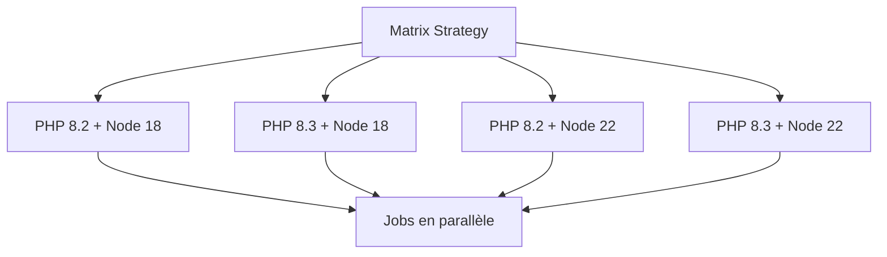

---
tags:
  - CI/CD
  - Avancé
  - Pratique
description: "Maîtriser les fonctionnalités avancées de GitHub Actions : matrix builds, secrets, environments, réutilisation de workflows"
estimated_time: "90 min"
fiche_number: 5
total_fiches: 10
cursus: "CI/CD Pipelines"
---

# 05 - GitHub Actions - Avancé

> **En bref** : Cette fiche couvre les fonctionnalités avancées de GitHub Actions : matrix builds, gestion des secrets, environments (staging/production), conditions, réutilisation de workflows et contrôle de la concurrence. Lecture estimée : 90 min.

## Prérequis

- Avoir lu la fiche [04 - GitHub Actions - Build et artefacts](04-github-actions-build-artefacts.md)
- Comprendre les workflows, jobs et steps
- Savoir builder et pousser une image Docker dans un pipeline

## Objectif de cette fiche

À la fin de cette fiche, tu sauras créer des matrix builds pour tester sur plusieurs versions, gérer les secrets et variables d'environnement, configurer des environments avec approbation, créer des workflows réutilisables, et contrôler la concurrence.

---

## Concepts

Cette section explique tous les concepts nécessaires. Lis-la entièrement avant de passer aux étapes pratiques.

### Qu'est-ce qu'un matrix build ?

**Définition** : Un matrix build est un mécanisme qui exécute le même job avec plusieurs combinaisons de paramètres. Par exemple : tester un projet sur PHP 8.2 et PHP 8.3, ou sur Ubuntu et macOS.

**Le problème que les matrix builds résolvent** :

Sans matrix builds, voici les problèmes rencontrés :

1. **Duplication de code** : Tu crées un job pour PHP 8.2 et un autre pour PHP 8.3. Les deux jobs sont identiques sauf la version de PHP. Le fichier YAML est verbeux et difficile à maintenir.

2. **Oubli de version** : L'équipe supporte PHP 8.2 et 8.3. Un développeur ajoute un test pour 8.3 mais oublie 8.2. Le code fonctionne sur 8.3 mais casse sur 8.2.

**Comment les matrix builds résolvent ces problèmes** :

| Problème | Solution |
| --- | --- |
| Duplication de code | Un seul job avec une matrice de paramètres |
| Oubli de version | La matrice teste automatiquement toutes les combinaisons |

Le diagramme suivant montre comment une matrice génère plusieurs combinaisons de paramètres exécutées en parallèle.



**Analogie concrète** : Imagine un fabricant de t-shirts. Au lieu de créer une chaîne de production par taille (S, M, L, XL), il utilise une seule chaîne qui ajuste automatiquement les dimensions. Le matrix build fonctionne de la même façon : un seul job ajuste automatiquement les paramètres.

---

### Qu'est-ce qu'un secret dans GitHub Actions ?

**Définition** : Un secret est une valeur sensible (mot de passe, clé API, token) stockée de façon chiffrée dans les paramètres du dépôt GitHub. Les secrets sont accessibles dans les workflows via `${{ secrets.NOM_DU_SECRET }}`.

**Le problème que les secrets résolvent** :

Sans secrets, voici les problèmes rencontrés :

1. **Mot de passe dans le code** : Un développeur écrit le mot de passe de la base de données directement dans le fichier YAML. Toute personne ayant accès au dépôt voit le mot de passe.

2. **Fuite lors de l'affichage** : Un `echo` affiche accidentellement un token dans les logs du pipeline. Le token est visible par tous ceux qui lisent les logs.

**Comment les secrets résolvent ces problèmes** :

| Problème | Solution |
| --- | --- |
| Mot de passe dans le code | Les secrets sont stockés chiffrés, hors du code |
| Fuite lors de l'affichage | GitHub masque automatiquement les secrets dans les logs (`***`) |

**Ce que les secrets ne sont PAS** :

- Les secrets ne sont pas des variables d'environnement classiques. Ils sont chiffrés au repos et ne sont déchiffrés que pendant l'exécution du workflow.
- Les secrets ne sont pas accessibles depuis les forks. Un workflow déclenché par une PR depuis un fork n'a pas accès aux secrets du dépôt d'origine (mesure de sécurité).

---

### Qu'est-ce qu'un environment dans GitHub Actions ?

**Définition** : Un environment est un contexte de déploiement nommé (staging, production) avec ses propres secrets, variables et règles de protection. Les environments permettent de contrôler qui peut déployer et où.

**Le problème que les environments résolvent** :

Sans environments, voici les problèmes rencontrés :

1. **Déploiement accidentel** : Un push sur `main` déclenche un déploiement en production sans vérification. Une erreur arrive en production.

2. **Secrets partagés** : Les secrets de staging et de production sont dans le même espace. Un job de staging peut accidentellement utiliser les secrets de production.

**Comment les environments résolvent ces problèmes** :

| Problème | Solution |
| --- | --- |
| Déploiement accidentel | L'environment production exige une approbation manuelle |
| Secrets partagés | Chaque environment a ses propres secrets, isolés |

---

### Qu'est-ce qu'un workflow réutilisable ?

**Définition** : Un workflow réutilisable est un workflow qui peut être appelé par d'autres workflows. Il fonctionne comme une fonction : il accepte des paramètres (inputs) et peut retourner des résultats (outputs). Il se déclenche avec l'événement `workflow_call`.

**Le problème que les workflows réutilisables résolvent** :

Sans réutilisation, voici les problèmes rencontrés :

1. **Copier-coller** : Tu as 5 dépôts avec le même pipeline. Tu copies le workflow dans chaque dépôt. Quand tu modifies le pipeline, tu dois modifier les 5 copies.

2. **Incohérence** : Après plusieurs modifications, les 5 copies divergent. Le pipeline du dépôt A fait des choses différentes de celui du dépôt B.

**Comment les workflows réutilisables résolvent ces problèmes** :

| Problème | Solution |
| --- | --- |
| Copier-coller | Un seul workflow réutilisable, appelé par les 5 dépôts |
| Incohérence | Les 5 dépôts utilisent la même source de vérité |

---

### Qu'est-ce que la concurrence (concurrency) ?

**Définition** : La concurrence contrôle combien d'exécutions d'un workflow peuvent s'exécuter simultanément. Par défaut, chaque push déclenche une nouvelle exécution, même si la précédente est encore en cours.

**Le problème que la concurrence résout** :

Sans contrôle de concurrence, si tu pousses 5 commits rapidement, 5 pipelines s'exécutent en parallèle. Les 4 premiers sont inutiles car seul le dernier commit compte.

---

## Étapes Pratiques

### Étape 1 : Créer un matrix build

Crée le fichier `.github/workflows/matrix.yml` :

```yaml
# Workflow avec matrix build pour tester sur plusieurs versions de PHP
name: Matrix Tests

on:
  push:
    branches:
      - main
  pull_request:
    branches:
      - main

jobs:
  test:
    name: PHP ${{ matrix.php-version }} - ${{ matrix.os }}
    # La matrice génère un job pour chaque combinaison
    runs-on: ${{ matrix.os }}

    # Définition de la matrice
    strategy:
      # Ne pas arrêter les autres jobs si un échoue
      fail-fast: false
      matrix:
        # Versions de PHP à tester
        php-version:
          - "8.2"
          - "8.3"
        # Systèmes d'exploitation
        os:
          - ubuntu-latest

    steps:
      - uses: actions/checkout@v4

      - name: Installer PHP ${{ matrix.php-version }}
        uses: shivammathur/setup-php@v2
        with:
          # Utilise la version de la matrice
          php-version: ${{ matrix.php-version }}
          tools: composer:v2

      - name: Installer les dépendances
        run: composer install --no-interaction --prefer-dist

      - name: Exécuter les tests
        run: |
          echo "Tests sur PHP ${{ matrix.php-version }}"
          vendor/bin/phpunit --testdox
```

**Résultat attendu** :

```text
Le workflow crée 2 jobs :
- PHP 8.2 - ubuntu-latest
- PHP 8.3 - ubuntu-latest

Chaque job exécute les mêmes étapes avec sa version de PHP.
Si un job échoue, l'autre continue (fail-fast: false).
```

---

### Étape 2 : Matrix build avec exclusions et inclusions

```yaml
# Matrix avec exclusions et inclusions spécifiques
name: Matrix Avancée

on:
  push:
    branches:
      - main

jobs:
  test:
    name: PHP ${{ matrix.php }} / ${{ matrix.dependency }}
    runs-on: ubuntu-latest

    strategy:
      fail-fast: false
      matrix:
        php:
          - "8.2"
          - "8.3"
        dependency:
          - "lowest"
          - "highest"
        # Exclure certaines combinaisons
        exclude:
          # Ne pas tester PHP 8.2 avec les dépendances les plus basses
          - php: "8.2"
            dependency: "lowest"
        # Ajouter des combinaisons spécifiques
        include:
          # Ajouter un test sur PHP 8.4 (uniquement avec highest)
          - php: "8.4"
            dependency: "highest"
            # Variable supplémentaire pour cette combinaison
            experimental: true

    # Permettre l'échec des jobs expérimentaux
    continue-on-error: ${{ matrix.experimental || false }}

    steps:
      - uses: actions/checkout@v4

      - name: Installer PHP ${{ matrix.php }}
        uses: shivammathur/setup-php@v2
        with:
          php-version: ${{ matrix.php }}
          tools: composer:v2

      - name: Installer les dépendances (${{ matrix.dependency }})
        run: |
          if [ "${{ matrix.dependency }}" = "lowest" ]; then
            composer update --prefer-lowest --no-interaction
          else
            composer install --no-interaction --prefer-dist
          fi

      - name: Exécuter les tests
        run: vendor/bin/phpunit --testdox
```

**Résultat attendu** :

```text
Jobs créés :
1. PHP 8.2 / highest
2. PHP 8.3 / lowest
3. PHP 8.3 / highest
4. PHP 8.4 / highest (expérimental, peut échouer)

Jobs exclus :
- PHP 8.2 / lowest (exclu par la règle exclude)
```

---

### Étape 3 : Configurer les secrets

Les secrets se configurent dans les paramètres du dépôt GitHub.

```text
Aller dans : Settings → Secrets and variables → Actions

Types de secrets :
1. Repository secrets : accessibles dans tous les workflows du dépôt
2. Environment secrets : accessibles uniquement dans un environment spécifique
3. Organization secrets : partagés entre plusieurs dépôts

Ajouter un secret :
1. Clique sur "New repository secret"
2. Nom : DATABASE_PASSWORD (en majuscules, avec underscores)
3. Valeur : mon-mot-de-passe-secret
4. Clique sur "Add secret"
```

Utiliser les secrets dans un workflow :

```yaml
# Workflow qui utilise des secrets
name: Deploy avec Secrets

on:
  push:
    branches:
      - main

jobs:
  deploy:
    runs-on: ubuntu-latest
    steps:
      - uses: actions/checkout@v4

      # Les secrets sont accessibles via ${{ secrets.NOM }}
      - name: Configurer la base de données
        run: |
          echo "Configuration de la connexion..."
          # Le secret est automatiquement masqué dans les logs
          # GitHub affiche *** au lieu de la valeur
        env:
          DB_PASSWORD: ${{ secrets.DATABASE_PASSWORD }}
          DB_HOST: ${{ secrets.DATABASE_HOST }}

      # Utiliser un secret pour se connecter à un registry
      - name: Se connecter au registry
        uses: docker/login-action@v3
        with:
          registry: ghcr.io
          username: ${{ github.actor }}
          # GITHUB_TOKEN est un secret automatique, toujours disponible
          password: ${{ secrets.GITHUB_TOKEN }}
```

**Résultat attendu** :

```text
Les logs affichent :
"Configuration de la connexion..."
Les valeurs des secrets sont remplacées par *** dans les logs.
```

---

### Étape 4 : Configurer les environments

Les environments se configurent dans les paramètres du dépôt GitHub.

```text
Aller dans : Settings → Environments

Créer l'environment "staging" :
1. Clique sur "New environment"
2. Nom : staging
3. Pas de règle de protection (déploiement automatique)
4. Ajouter des secrets spécifiques (SERVER_URL, API_KEY)

Créer l'environment "production" :
1. Clique sur "New environment"
2. Nom : production
3. Règles de protection :
   - "Required reviewers" : ajoute les personnes qui doivent approuver
   - "Wait timer" : délai en minutes avant le déploiement (optionnel)
4. Ajouter des secrets spécifiques (SERVER_URL, API_KEY)
```

Utiliser les environments dans un workflow :

```yaml
# Workflow avec environments staging et production
name: Deploy Pipeline

on:
  push:
    branches:
      - main

jobs:
  test:
    name: Tests
    runs-on: ubuntu-latest
    steps:
      - uses: actions/checkout@v4
      - run: echo "Tests passés"

  deploy-staging:
    name: Deploy Staging
    runs-on: ubuntu-latest
    needs: test
    # L'environment "staging" avec ses secrets et variables
    environment:
      name: staging
      # URL affichée dans l'interface GitHub
      url: https://staging.mon-app.example.com

    steps:
      - uses: actions/checkout@v4
      - name: Déployer sur staging
        run: |
          echo "Déploiement sur staging..."
          echo "Serveur : ${{ vars.SERVER_URL }}"
        env:
          API_KEY: ${{ secrets.API_KEY }}

  deploy-production:
    name: Deploy Production
    runs-on: ubuntu-latest
    needs: deploy-staging
    # L'environment "production" avec approbation requise
    environment:
      name: production
      url: https://mon-app.example.com

    steps:
      - uses: actions/checkout@v4
      - name: Déployer en production
        run: |
          echo "Déploiement en production..."
          echo "Serveur : ${{ vars.SERVER_URL }}"
        env:
          API_KEY: ${{ secrets.API_KEY }}
```

**Résultat attendu** :

```text
Exécution :
1. test → s'exécute automatiquement
2. deploy-staging → s'exécute automatiquement après les tests
3. deploy-production → EN ATTENTE d'approbation
   → Un revieweur approuve dans l'interface GitHub
   → Le déploiement s'exécute
```

---

### Étape 5 : Utiliser des conditions (if)

```yaml
# Workflow avec des conditions
name: Conditionnel

on:
  push:
    branches:
      - main
      - develop
  pull_request:
    branches:
      - main

jobs:
  build:
    runs-on: ubuntu-latest
    steps:
      - uses: actions/checkout@v4

      # S'exécute uniquement sur la branche main
      - name: Build production
        if: github.ref == 'refs/heads/main'
        run: echo "Build pour la production"

      # S'exécute uniquement sur la branche develop
      - name: Build développement
        if: github.ref == 'refs/heads/develop'
        run: echo "Build pour le développement"

      # S'exécute uniquement pour les pull requests
      - name: Vérification PR
        if: github.event_name == 'pull_request'
        run: echo "Vérification de la pull request #${{ github.event.number }}"

      # S'exécute uniquement si un step précédent a échoué
      - name: Notification d'erreur
        if: failure()
        run: echo "Un step précédent a échoué !"

      # S'exécute toujours, même si un step précédent a échoué
      - name: Nettoyage
        if: always()
        run: echo "Nettoyage..."
```

**Conditions les plus utilisées** :

| Condition | Signification |
| --- | --- |
| `if: github.ref == 'refs/heads/main'` | Seulement sur la branche main |
| `if: github.event_name == 'pull_request'` | Seulement pour les PR |
| `if: github.event_name != 'pull_request'` | Pas pour les PR |
| `if: contains(github.event.head_commit.message, '[skip ci]')` | Si le message de commit contient `[skip ci]` |
| `if: success()` | Si tous les steps précédents ont réussi (défaut) |
| `if: failure()` | Si un step précédent a échoué |
| `if: always()` | Toujours exécuter, quel que soit le résultat |
| `if: cancelled()` | Si le workflow a été annulé |

---

### Étape 6 : Créer un workflow réutilisable

Crée le workflow réutilisable dans `.github/workflows/reusable-test.yml` :

```yaml
# Workflow réutilisable : peut être appelé par d'autres workflows
name: Tests Réutilisables

# L'événement "workflow_call" rend ce workflow appelable
on:
  workflow_call:
    # Paramètres d'entrée
    inputs:
      php-version:
        description: "Version de PHP"
        required: true
        type: string
      run-coverage:
        description: "Générer le rapport de couverture"
        required: false
        type: boolean
        default: false
    # Secrets transmis par le workflow appelant
    secrets:
      codecov-token:
        required: false

jobs:
  test:
    name: Tests PHP ${{ inputs.php-version }}
    runs-on: ubuntu-latest
    steps:
      - uses: actions/checkout@v4

      - name: Installer PHP
        uses: shivammathur/setup-php@v2
        with:
          php-version: ${{ inputs.php-version }}
          tools: composer:v2
          coverage: ${{ inputs.run-coverage && 'xdebug' || 'none' }}

      - run: composer install --no-interaction --prefer-dist

      - name: Exécuter les tests
        run: |
          if [ "${{ inputs.run-coverage }}" = "true" ]; then
            vendor/bin/phpunit --coverage-text --coverage-clover coverage.xml
          else
            vendor/bin/phpunit --testdox
          fi

      # Upload vers Codecov (nécessite le secret codecov-token transmis par l'appelant)
      - name: Upload couverture Codecov
        if: ${{ inputs.run-coverage }}
        uses: codecov/codecov-action@v5
        with:
          token: ${{ secrets.codecov-token }}
          files: coverage.xml
          fail_ci_if_error: false
```

Crée le workflow appelant dans `.github/workflows/ci.yml` :

```yaml
# Workflow qui appelle le workflow réutilisable
name: CI

on:
  push:
    branches:
      - main

jobs:
  # Appelle le workflow réutilisable avec PHP 8.2
  test-82:
    uses: ./.github/workflows/reusable-test.yml
    with:
      php-version: "8.2"
      run-coverage: false

  # Appelle le workflow réutilisable avec PHP 8.3 + couverture
  test-83:
    uses: ./.github/workflows/reusable-test.yml
    with:
      php-version: "8.3"
      run-coverage: true
    secrets:
      codecov-token: ${{ secrets.CODECOV_TOKEN }}
```

**Résultat attendu** :

```text
Le workflow CI crée 2 jobs :
- test-82 : exécute les tests sur PHP 8.2 sans couverture
- test-83 : exécute les tests sur PHP 8.3 avec couverture
Les deux jobs utilisent le même workflow réutilisable.
```

---

### Étape 7 : Configurer la concurrence

```yaml
# Workflow avec contrôle de la concurrence
name: Deploy

on:
  push:
    branches:
      - main

# Concurrence au niveau du workflow
# Un seul workflow "deploy-main" peut s'exécuter à la fois
concurrency:
  # Groupe de concurrence : un nom unique
  group: deploy-${{ github.ref_name }}
  # Annuler l'exécution en cours si une nouvelle arrive
  cancel-in-progress: true

jobs:
  deploy:
    runs-on: ubuntu-latest
    steps:
      - uses: actions/checkout@v4
      - name: Déployer
        run: echo "Déploiement de ${{ github.sha }}"
```

**Explication de la concurrence** :

```text
Scénario sans concurrence :
  Push 1 → Pipeline 1 (en cours)
  Push 2 → Pipeline 2 (en cours)
  Push 3 → Pipeline 3 (en cours)
  → 3 pipelines s'exécutent en même temps, gaspillent des ressources

Scénario avec cancel-in-progress: true :
  Push 1 → Pipeline 1 (en cours)
  Push 2 → Pipeline 1 (annulé) → Pipeline 2 (en cours)
  Push 3 → Pipeline 2 (annulé) → Pipeline 3 (en cours)
  → Seul le dernier pipeline s'exécute

Scénario avec cancel-in-progress: false :
  Push 1 → Pipeline 1 (en cours)
  Push 2 → Pipeline 2 (en attente)
  Push 3 → Pipeline 3 (en attente)
  → Les pipelines s'exécutent un par un, dans l'ordre
```

---

## Commandes Utiles

| Commande | Action |
| --- | --- |
| `gh secret set NOM` | Crée ou met à jour un secret via la CLI |
| `gh secret list` | Liste les secrets du dépôt |
| `gh run list` | Liste les exécutions de workflows |
| `gh run cancel <id>` | Annule une exécution en cours |
| `gh run rerun <id>` | Relance une exécution échouée |
| `gh run watch <id>` | Suit une exécution en temps réel |

---

## Pièges Fréquents

### Piège 1 : Secret dans un echo

⚠️ **Problème** : Tu affiches un secret avec `echo` pour déboguer. GitHub le masque dans les logs, mais si tu concatènes le secret avec d'autres caractères, le masquage peut ne pas fonctionner.

✅ **Solution** : Ne jamais afficher un secret, même pour déboguer. Utilise une variable d'environnement à la place :

```yaml
# Incorrect : risque de fuite
- run: echo "Le mot de passe est ${{ secrets.DB_PASSWORD }}"

# Correct : passe le secret comme variable d'environnement
- run: echo "Connexion configurée"
  env:
    DB_PASSWORD: ${{ secrets.DB_PASSWORD }}
```

---

### Piège 2 : Matrix trop large

⚠️ **Problème** : Tu crées une matrice avec 3 OS, 4 versions de PHP et 2 modes de dépendances. La matrice génère 3 x 4 x 2 = 24 jobs. Le pipeline prend 30 minutes et consomme les minutes gratuites.

✅ **Solution** : Limite la matrice aux combinaisons réellement utiles. Utilise `exclude` pour retirer les combinaisons inutiles :

```yaml
strategy:
  matrix:
    php: ["8.2", "8.3"]
    os: [ubuntu-latest]
    # 2 combinaisons au lieu de 24
```

---

### Piège 3 : Workflow réutilisable introuvable

⚠️ **Problème** : Tu appelles un workflow réutilisable avec `uses: ./.github/workflows/reusable.yml`, mais GitHub affiche "workflow not found".

✅ **Solution** : Vérifie que :

1. Le fichier existe bien à `.github/workflows/reusable.yml`
2. Le workflow réutilisable a `on: workflow_call` (pas `on: push`)
3. Le fichier est sur la même branche que le workflow appelant

---

### Piège 4 : Concurrence qui annule des déploiements importants

⚠️ **Problème** : Tu utilises `cancel-in-progress: true` sur un workflow de déploiement. Un déploiement en cours est annulé à mi-chemin, laissant le serveur dans un état incohérent.

✅ **Solution** : N'utilise `cancel-in-progress: true` que pour les workflows de tests et de lint. Pour les déploiements, utilise `cancel-in-progress: false` :

```yaml
# Pour les tests : annuler l'ancien (rapide, sans risque)
concurrency:
  group: test-${{ github.ref }}
  cancel-in-progress: true

# Pour les déploiements : attendre la fin (sans risque d'état incohérent)
concurrency:
  group: deploy-production
  cancel-in-progress: false
```

---

## Checklist de Validation

- [ ] Je sais créer un matrix build avec plusieurs versions de PHP
- [ ] Je sais utiliser `exclude` et `include` dans une matrice
- [ ] Je sais créer et utiliser des secrets dans un workflow
- [ ] Je sais configurer des environments (staging, production)
- [ ] Je sais utiliser des conditions `if` dans les steps et jobs
- [ ] Je sais créer un workflow réutilisable avec `workflow_call`
- [ ] Je sais contrôler la concurrence avec `concurrency`
- [ ] Je connais les fonctions `success()`, `failure()`, `always()`

---

## Exercice Pratique

**Énoncé** : Crée un fichier de workflow `advanced-ci.yml` qui :

1. Se déclenche sur push vers `main` et sur pull request vers `main`
2. Utilise un matrix build pour tester sur PHP 8.2 et 8.3
3. Après les tests, un job `deploy-staging` déploie sur l'environment `staging` (uniquement sur push vers main, pas sur PR)
4. Après staging, un job `deploy-production` déploie sur l'environment `production` (uniquement sur push vers main)
5. Le workflow utilise la concurrence pour annuler les runs précédents sur les PR

**Indications** :

- Utilise `strategy.matrix` pour les versions de PHP
- Utilise `if: github.event_name != 'pull_request'` pour les déploiements
- Utilise `environment` pour staging et production
- Utilise `concurrency` au niveau du workflow

**Résultat attendu** : Sur une PR, seuls les tests s'exécutent (matrice PHP). Sur un push vers main, les tests puis les déploiements s'enchaînent.

---

## Solution de l'Exercice

> **Note** : Cette section contient la solution complète. Essaie d'abord de résoudre l'exercice par toi-même avant de consulter cette solution.

---

Fichier `.github/workflows/advanced-ci.yml` :

```yaml
# Workflow avancé avec matrix, environments et concurrence
name: Advanced CI/CD

on:
  push:
    branches:
      - main
  pull_request:
    branches:
      - main

# Annuler les runs précédents pour la même branche/PR
concurrency:
  group: ci-${{ github.ref }}
  cancel-in-progress: true

jobs:
  # ──────────────────────────────────────
  # Tests avec matrice PHP
  # ──────────────────────────────────────
  test:
    name: Tests PHP ${{ matrix.php-version }}
    runs-on: ubuntu-latest
    strategy:
      fail-fast: false
      matrix:
        php-version:
          - "8.2"
          - "8.3"

    steps:
      - uses: actions/checkout@v4

      - name: Installer PHP ${{ matrix.php-version }}
        uses: shivammathur/setup-php@v2
        with:
          php-version: ${{ matrix.php-version }}
          tools: composer:v2

      - name: Cache Composer
        uses: actions/cache@v4
        with:
          path: vendor
          key: ${{ runner.os }}-php${{ matrix.php-version }}-composer-${{ hashFiles('composer.lock') }}
          restore-keys: ${{ runner.os }}-php${{ matrix.php-version }}-composer-

      - run: composer install --no-interaction --prefer-dist
      - run: vendor/bin/phpunit --testdox

  # ──────────────────────────────────────
  # Deploy Staging (uniquement sur push vers main)
  # ──────────────────────────────────────
  deploy-staging:
    name: Deploy Staging
    runs-on: ubuntu-latest
    needs: test
    # Ne s'exécute PAS sur les pull requests
    if: github.event_name != 'pull_request'
    environment:
      name: staging
      url: https://staging.mon-app.example.com

    steps:
      - uses: actions/checkout@v4
      - name: Déployer sur staging
        run: echo "Déploiement sur staging réussi"
        env:
          SERVER_URL: ${{ vars.SERVER_URL }}
          API_KEY: ${{ secrets.API_KEY }}

  # ──────────────────────────────────────
  # Deploy Production (après staging, avec approbation)
  # ──────────────────────────────────────
  deploy-production:
    name: Deploy Production
    runs-on: ubuntu-latest
    needs: deploy-staging
    if: github.event_name != 'pull_request'
    environment:
      name: production
      url: https://mon-app.example.com

    steps:
      - uses: actions/checkout@v4
      - name: Déployer en production
        run: echo "Déploiement en production réussi"
        env:
          SERVER_URL: ${{ vars.SERVER_URL }}
          API_KEY: ${{ secrets.API_KEY }}
```

**Explication** :

- La matrice teste PHP 8.2 et 8.3 en parallèle
- `fail-fast: false` : si PHP 8.2 échoue, PHP 8.3 continue
- `if: github.event_name != 'pull_request'` : les déploiements sont ignorés sur les PR
- La concurrence annule les runs précédents sur la même branche/PR
- Le deploy production attend le deploy staging (grâce à `needs`)
- Les environments fournissent des secrets et variables isolés

---

## Navigation

← Fiche précédente : **[GitHub Actions - Build et artefacts](04-github-actions-build-artefacts.md)**

→ Fiche suivante : **[GitLab CI - Introduction](06-gitlab-ci-introduction.md)**
