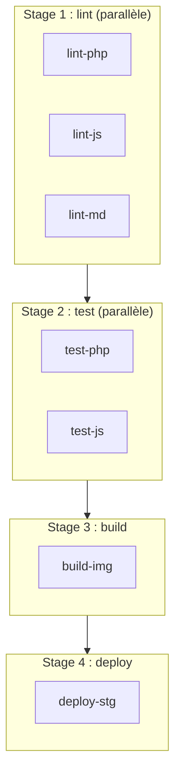

---
tags:
  - CI/CD
  - Intermédiaire
  - Pratique
description: "Découvrir GitLab CI : fichier .gitlab-ci.yml, stages, jobs, runners et variables"
estimated_time: "75 min"
fiche_number: 6
total_fiches: 10
cursus: "CI/CD Pipelines"
---

# 06 - GitLab CI - Introduction

> **En bref** : Cette fiche t'apprend à configurer GitLab CI : fichier `.gitlab-ci.yml`, stages, jobs, runners (shared et self-hosted), variables, et directives `before_script`/`after_script`. Lecture estimée : 75 min.

## Prérequis

- Avoir lu la fiche [01 - Introduction à la CI/CD](01-introduction-ci-cd.md)
- Avoir lu la fiche [02 - GitHub Actions - Premiers pas](02-github-actions-premiers-pas.md)
- Avoir lu la fiche [03 - GitHub Actions - Tests et lint](03-github-actions-tests-lint.md)
- Avoir lu la fiche [04 - GitHub Actions - Build et artefacts](04-github-actions-build-artefacts.md)
- Avoir lu la fiche [05 - GitHub Actions - Avancé](05-github-actions-avance.md)
- Avoir un compte GitLab (gitlab.com ou instance auto-hébergée)
- Savoir utiliser Git (clone, commit, push)

## Objectif de cette fiche

À la fin de cette fiche, tu sauras créer un fichier `.gitlab-ci.yml` avec des stages, des jobs et des variables, comprendre les runners GitLab, et utiliser les directives `before_script`, `after_script` et `rules`.

---

## Concepts

Cette section explique tous les concepts nécessaires. Lis-la entièrement avant de passer aux étapes pratiques.

### Qu'est-ce que GitLab CI ?

**Définition** : GitLab CI est le système d'intégration et de déploiement continus intégré à GitLab. Il exécute des pipelines définis dans un fichier `.gitlab-ci.yml` placé à la racine du dépôt.

**Le problème que GitLab CI résout** :

Sans GitLab CI, les mêmes problèmes que sans GitHub Actions se posent : builds manuels, tests oubliés, déploiements risqués. GitLab CI apporte les mêmes solutions.

**Comparaison GitHub Actions vs GitLab CI** :

| Caractéristique | GitHub Actions | GitLab CI |
| --- | --- | --- |
| Fichier de config | `.github/workflows/*.yml` | `.gitlab-ci.yml` (unique) |
| Emplacement | Un fichier par workflow | Un seul fichier pour tout |
| Organisation | Workflows > Jobs > Steps | Stages > Jobs > Scripts |
| Exécution | Runners GitHub (cloud) | Runners GitLab (cloud ou self-hosted) |
| Marketplace | Actions réutilisables | Templates CI/CD |
| Variables auto | `${{ github.xxx }}` | `$CI_xxx` |
| Événements | `on: push, pull_request...` | `rules:` ou `only/except` |

**Analogie concrète** : Si GitHub Actions est un restaurant avec un chef différent pour chaque plat (un workflow par fichier), GitLab CI est un restaurant avec un seul chef qui prépare tout le menu (un seul fichier `.gitlab-ci.yml`). Les deux produisent le même résultat, mais l'organisation est différente.

**Ce que GitLab CI n'est PAS** :

- GitLab CI n'est pas un outil séparé. Il fait partie intégrante de GitLab. Pas d'installation supplémentaire.
- GitLab CI n'est pas limité à GitLab.com. Tu peux l'utiliser sur une instance GitLab auto-hébergée.

---

### Qu'est-ce qu'un stage ?

**Définition** : Un stage est une étape nommée dans le pipeline. Les jobs d'un même stage s'exécutent en parallèle. Les stages s'exécutent dans l'ordre défini.

**Le problème que les stages résolvent** :

Sans stages, tous les jobs s'exécutent en parallèle. Tu ne peux pas garantir que les tests passent avant le déploiement.

**Comment les stages organisent le pipeline** :



**Comparaison avec GitHub Actions** :

| GitLab CI | GitHub Actions |
| --- | --- |
| `stages:` définit l'ordre global | `needs:` définit les dépendances job par job |
| Tous les jobs d'un stage sont parallèles | Les jobs sont parallèles par défaut |
| Ordre imposé par la position dans `stages:` | Ordre défini par `needs:` |

---

### Qu'est-ce qu'un runner GitLab ?

**Définition** : Un runner GitLab est une machine qui exécute les jobs d'un pipeline. GitLab propose des runners partagés (shared runners) sur gitlab.com. Tu peux aussi installer tes propres runners (self-hosted).

**Types de runners** :

| Type | Hébergement | Avantage | Inconvénient |
| --- | --- | --- | --- |
| Shared runner | GitLab.com | Aucune installation, prêt à l'emploi | Limité en minutes (400/mois gratuit) |
| Self-hosted runner | Ta machine ou ton serveur | Pas de limite, accès au réseau local | Installation et maintenance nécessaires |
| Group runner | Partagé dans un groupe GitLab | Mutualisé entre projets | Configuration au niveau du groupe |

**Ce qu'un runner GitLab n'est PAS** :

- Un runner n'est pas un serveur de production. Il exécute les jobs CI, pas l'application en production.
- Un runner n'est pas permanent pour un job. Chaque job obtient un environnement propre (sauf si tu utilises un runner shell).

---

### Qu'est-ce que les variables CI GitLab ?

**Définition** : Les variables CI sont des valeurs accessibles dans les scripts des jobs. GitLab fournit des variables prédéfinies (préfixées `CI_`) et tu peux définir les tiennes.

**Variables prédéfinies les plus utiles** :

| Variable | Contenu | Exemple |
| --- | --- | --- |
| `CI_COMMIT_SHA` | SHA complet du commit | `abc123def456...` |
| `CI_COMMIT_SHORT_SHA` | SHA court du commit | `abc123de` |
| `CI_COMMIT_BRANCH` | Nom de la branche | `main` |
| `CI_COMMIT_TAG` | Nom du tag (si tag) | `v1.0.0` |
| `CI_PROJECT_NAME` | Nom du projet | `mon-app` |
| `CI_PROJECT_PATH` | Chemin complet du projet | `groupe/mon-app` |
| `CI_PIPELINE_ID` | Identifiant du pipeline | `123456` |
| `CI_JOB_NAME` | Nom du job en cours | `test-php` |
| `CI_REGISTRY_IMAGE` | URL de l'image dans le registry GitLab | `registry.gitlab.com/groupe/mon-app` |

---

## Étapes Pratiques

### Étape 1 : Créer un projet sur GitLab

Crée un nouveau projet sur GitLab :

```bash
# Crée un dossier local
mkdir mon-projet-gitlab
cd mon-projet-gitlab

# Initialise Git
git init

# Crée un fichier README
echo "# Mon Projet GitLab CI" > README.md

# Premier commit
git add README.md
git commit -m "Initial commit"

# Crée la branche main
git branch -M main

# Lie au dépôt GitLab (remplace par ton URL)
git remote add origin https://gitlab.com/ton-utilisateur/mon-projet-gitlab.git

# Pousse le code
git push -u origin main
```

**Résultat attendu** :

```text
Le projet est créé sur GitLab avec un fichier README.md.
```

---

### Étape 2 : Créer un pipeline minimal

Crée le fichier `.gitlab-ci.yml` à la racine du projet :

```yaml
# Définition des stages (étapes) du pipeline
# Les stages s'exécutent dans cet ordre
stages:
  - test
  - build

# Premier job : dans le stage "test"
hello-test:
  # Ce job appartient au stage "test"
  stage: test
  # Script à exécuter (équivalent de "run" dans GitHub Actions)
  script:
    - echo "Bonjour depuis GitLab CI !"
    - echo "Branche : $CI_COMMIT_BRANCH"
    - echo "Commit : $CI_COMMIT_SHORT_SHA"

# Deuxième job : dans le stage "build"
hello-build:
  stage: build
  script:
    - echo "Build en cours..."
    - echo "Le stage test est terminé avec succès"
```

```bash
# Ajoute et pousse le fichier
git add .gitlab-ci.yml
git commit -m "Ajouter le pipeline CI minimal"
git push
```

**Résultat attendu** :

```text
Sur GitLab, va dans CI/CD → Pipelines.
Tu vois un pipeline avec 2 stages :
- Stage "test" : job "hello-test" (succès)
- Stage "build" : job "hello-build" (succès, après le stage test)
```

---

### Étape 3 : Créer un pipeline avec plusieurs jobs par stage

```yaml
# Pipeline avec plusieurs jobs parallèles dans chaque stage
stages:
  - lint
  - test
  - build

# ──────────────────────────────────────
# Stage : lint (les 3 jobs s'exécutent en parallèle)
# ──────────────────────────────────────

lint-php:
  stage: lint
  # Image Docker utilisée pour exécuter le job
  image: php:8.3-cli
  script:
    - echo "Vérification du formatage PHP..."
    - php -l src/*.php || true

lint-js:
  stage: lint
  image: node:22-alpine
  script:
    - echo "Vérification du formatage JavaScript..."
    - echo "Lint JS terminé"

lint-md:
  stage: lint
  image: node:22-alpine
  script:
    - echo "Vérification du Markdown..."
    - echo "Lint MD terminé"

# ──────────────────────────────────────
# Stage : test (s'exécute après que TOUS les jobs lint sont terminés)
# ──────────────────────────────────────

test-php:
  stage: test
  image: php:8.3-cli
  script:
    - echo "Exécution des tests PHP..."
    - echo "Tests PHP terminés"

test-js:
  stage: test
  image: node:22-alpine
  script:
    - echo "Exécution des tests JavaScript..."
    - echo "Tests JS terminés"

# ──────────────────────────────────────
# Stage : build
# ──────────────────────────────────────

build-image:
  stage: build
  script:
    - echo "Build de l'image Docker..."
    - echo "Build terminé"
```

**Résultat attendu** :

```text
Pipeline avec 3 stages :
Stage lint  : lint-php, lint-js, lint-md (3 jobs en parallèle)
Stage test  : test-php, test-js (2 jobs en parallèle, après lint)
Stage build : build-image (1 job, après test)
```

---

### Étape 4 : Utiliser before_script et after_script

```yaml
stages:
  - test

# ──────────────────────────────────────
# Variables globales (accessibles dans tous les jobs)
# ──────────────────────────────────────
variables:
  # Variable personnalisée
  APP_ENV: "test"
  # Désactiver les interactions Composer
  COMPOSER_NO_INTERACTION: "1"

# ──────────────────────────────────────
# before_script global (exécuté AVANT le script de chaque job)
# ──────────────────────────────────────
default:
  before_script:
    - echo "Début du job $CI_JOB_NAME"
    - echo "Environnement : $APP_ENV"

# Job avec before_script et after_script
test-php:
  stage: test
  image: php:8.3-cli
  # before_script spécifique au job (remplace le global)
  before_script:
    - echo "Installation des dépendances PHP..."
    - apt-get update && apt-get install -y unzip
    - curl -sS https://getcomposer.org/installer | php
    - mv composer.phar /usr/local/bin/composer
  script:
    - composer install
    - vendor/bin/phpunit --testdox
  # after_script : exécuté APRÈS le script, même en cas d'échec
  after_script:
    - echo "Nettoyage après les tests..."
    - echo "Job terminé à $(date)"
```

**Explication** :

```text
Ordre d'exécution d'un job :
1. before_script  → Préparation (installer des outils, configurer)
2. script         → Tâche principale (exécuter les tests)
3. after_script   → Nettoyage (s'exécute même si script échoue)

Particularités :
- before_script d'un job remplace le before_script global
- after_script s'exécute dans un shell séparé
- after_script s'exécute même si script échoue
```

---

### Étape 5 : Utiliser les rules (remplacement de only/except)

```yaml
stages:
  - test
  - deploy

# Job qui s'exécute selon des règles
test:
  stage: test
  image: php:8.3-cli
  script:
    - echo "Tests en cours..."
  # Les rules remplacent l'ancien only/except
  rules:
    # Règle 1 : s'exécuter sur les merge requests
    - if: $CI_PIPELINE_SOURCE == "merge_request_event"
    # Règle 2 : s'exécuter sur la branche main
    - if: $CI_COMMIT_BRANCH == "main"
    # Règle 3 : s'exécuter sur les tags
    - if: $CI_COMMIT_TAG

deploy-staging:
  stage: deploy
  script:
    - echo "Déploiement sur staging..."
  rules:
    # Uniquement sur la branche main (pas sur les MR ni les tags)
    - if: $CI_COMMIT_BRANCH == "main"

deploy-production:
  stage: deploy
  script:
    - echo "Déploiement en production..."
  rules:
    # Uniquement sur les tags de version
    - if: $CI_COMMIT_TAG =~ /^v\d+\.\d+\.\d+$/
  # Déploiement manuel : le job est créé mais ne s'exécute pas automatiquement
  when: manual
```

**Rules les plus courantes** :

| Rule | Signification |
| --- | --- |
| `if: $CI_COMMIT_BRANCH == "main"` | Seulement sur la branche main |
| `if: $CI_PIPELINE_SOURCE == "merge_request_event"` | Seulement pour les merge requests |
| `if: $CI_COMMIT_TAG` | Seulement quand un tag est poussé |
| `if: $CI_COMMIT_TAG =~ /^v\d+/` | Seulement pour les tags commençant par "v" |
| `when: manual` | Le job doit être déclenché manuellement |
| `when: always` | Le job s'exécute toujours |
| `when: on_failure` | Le job s'exécute seulement si un job précédent a échoué |

---

### Étape 6 : Définir des variables personnalisées

```yaml
stages:
  - build

# Variables globales
variables:
  # Variable accessible dans tous les jobs
  DOCKER_IMAGE: "mon-app"
  DOCKER_TAG: "$CI_COMMIT_SHORT_SHA"

build:
  stage: build
  # Variables locales au job (s'ajoutent aux globales)
  variables:
    BUILD_MODE: "production"
  script:
    - echo "Image : $DOCKER_IMAGE:$DOCKER_TAG"
    - echo "Mode : $BUILD_MODE"
    - echo "Pipeline : $CI_PIPELINE_ID"
```

**Types de variables GitLab CI** :

| Type | Définition | Portée |
| --- | --- | --- |
| Prédéfinies | Fournies par GitLab (`CI_*`) | Tous les jobs |
| Globales | Dans `variables:` au niveau racine | Tous les jobs |
| Locales au job | Dans `variables:` au niveau du job | Un seul job |
| Interface web | Settings → CI/CD → Variables | Tous les pipelines |
| Protégées | Interface web, case "Protected" | Uniquement sur les branches/tags protégés |
| Masquées | Interface web, case "Masked" | Masquées dans les logs |

Pour ajouter des secrets (variables sensibles) via l'interface web :

```text
Settings → CI/CD → Variables → Add variable

Nom      : DATABASE_PASSWORD
Valeur   : mon-secret
Type     : Variable
Flags    :
  ☑ Protect variable (uniquement sur branches protégées)
  ☑ Mask variable (masqué dans les logs)
```

---

### Étape 7 : Pipeline complet avec image Docker

```yaml
# Pipeline GitLab CI complet pour un projet PHP
stages:
  - lint
  - test

# Image par défaut pour tous les jobs
image: php:8.3-cli

# Variables globales
variables:
  COMPOSER_NO_INTERACTION: "1"

# Préparation commune à tous les jobs
default:
  before_script:
    - apt-get update -qq && apt-get install -y -qq unzip git
    - curl -sS https://getcomposer.org/installer | php
    - mv composer.phar /usr/local/bin/composer
    - composer install --prefer-dist

# Cache Composer (partagé entre les jobs)
cache:
  key: composer-$CI_COMMIT_REF_SLUG
  paths:
    - vendor/

lint-php:
  stage: lint
  script:
    - vendor/bin/php-cs-fixer fix --dry-run --diff --verbose

test-php:
  stage: test
  script:
    - vendor/bin/phpunit --testdox --colors=never
  # Sauvegarder les résultats de test comme artefact
  artifacts:
    # Rapport JUnit pour affichage dans l'interface GitLab
    reports:
      junit: report.xml
    # Durée de conservation
    expire_in: 1 week
```

**Résultat attendu** :

```text
Pipeline :
Stage lint : lint-php (PHP CS Fixer)
Stage test : test-php (PHPUnit)

Le cache Composer est partagé entre les jobs.
Les résultats de test sont visibles dans l'interface GitLab (rapport JUnit).
```

---

## Commandes Utiles

| Commande | Action |
| --- | --- |
| `git push` | Déclenche le pipeline GitLab CI |
| `cat .gitlab-ci.yml` | Affiche la configuration du pipeline |
| Pipeline editor sur GitLab | CI/CD → Editor (valide la syntaxe YAML) |
| CI Lint sur GitLab | CI/CD → Pipelines → CI Lint (vérifie le fichier) |

---

## Pièges Fréquents

### Piège 1 : Fichier mal nommé

⚠️ **Problème** : Tu nommes le fichier `gitlab-ci.yml` (sans le point devant). GitLab ne détecte pas le pipeline.

✅ **Solution** : Le fichier doit s'appeler exactement `.gitlab-ci.yml` (avec le point devant), à la racine du dépôt.

```bash
# Incorrect
gitlab-ci.yml

# Correct
.gitlab-ci.yml
```

---

### Piège 2 : Indentation YAML incorrecte

⚠️ **Problème** : Tu utilises des tabulations ou une indentation incohérente. GitLab affiche "config syntax error".

✅ **Solution** : Utilise l'éditeur de pipeline intégré à GitLab (CI/CD → Editor). Il valide la syntaxe en temps réel. Toujours utiliser 2 espaces par niveau.

---

### Piège 3 : before_script local qui remplace le global

⚠️ **Problème** : Tu définis un `before_script` global pour installer Composer. Un job définit son propre `before_script` pour une autre tâche. Le `before_script` global est remplacé, Composer n'est pas installé, et le job échoue.

✅ **Solution** : Si un job a besoin du `before_script` global ET de commandes supplémentaires, utilise `!reference` ou répète les commandes :

```yaml
# Solution 1 : répéter les commandes
mon-job:
  before_script:
    # Commandes du global
    - apt-get update && apt-get install -y unzip
    - curl -sS https://getcomposer.org/installer | php
    - mv composer.phar /usr/local/bin/composer
    # Commandes supplémentaires
    - echo "Préparation spécifique"
```

---

### Piège 4 : Utiliser only/except au lieu de rules

⚠️ **Problème** : Tu utilises `only` et `except` qui sont dépréciés. Ils fonctionnent encore mais sont moins flexibles que `rules`.

✅ **Solution** : Utilise toujours `rules:` pour les nouveaux projets :

```yaml
# Ancien (déprécié)
mon-job:
  only:
    - main
  except:
    - tags

# Nouveau (recommandé)
mon-job:
  rules:
    - if: $CI_COMMIT_BRANCH == "main"
```

---

## Checklist de Validation

- [ ] Je sais créer un fichier `.gitlab-ci.yml` avec des stages et des jobs
- [ ] Je comprends l'ordre d'exécution des stages (séquentiel) et des jobs dans un stage (parallèle)
- [ ] Je sais utiliser `image:` pour spécifier l'image Docker d'un job
- [ ] Je sais utiliser `before_script`, `script` et `after_script`
- [ ] Je sais utiliser `rules:` pour contrôler quand un job s'exécute
- [ ] Je sais définir et utiliser des variables (globales, locales, prédéfinies)
- [ ] Je connais les différences principales entre GitHub Actions et GitLab CI

---

## Exercice Pratique

**Énoncé** : Crée un fichier `.gitlab-ci.yml` pour un projet PHP qui :

1. Définit 3 stages : `lint`, `test`, `deploy`
2. Le stage `lint` contient un job qui vérifie le formatage PHP avec PHP CS Fixer
3. Le stage `test` contient un job qui exécute PHPUnit
4. Le stage `deploy` contient un job qui déploie sur staging (uniquement sur la branche `main`)
5. Utilise le cache Composer
6. Utilise l'image `php:8.3-cli` par défaut
7. Définit une variable globale `APP_ENV=test`

**Indications** :

- Utilise `default: before_script:` pour installer Composer dans tous les jobs
- Utilise `cache:` pour le dossier `vendor/`
- Utilise `rules:` pour restreindre le job de déploiement
- Utilise `when: manual` pour le déploiement

**Résultat attendu** : Un pipeline à 3 stages. Le lint et le test s'exécutent automatiquement. Le déploiement apparaît uniquement sur la branche `main` et attend un clic manuel.

---

## Solution de l'Exercice

> **Note** : Cette section contient la solution complète. Essaie d'abord de résoudre l'exercice par toi-même avant de consulter cette solution.

---

Fichier `.gitlab-ci.yml` :

```yaml
# Pipeline CI/CD pour un projet PHP
stages:
  - lint
  - test
  - deploy

# Image Docker par défaut
image: php:8.3-cli

# Variables globales
variables:
  APP_ENV: "test"
  COMPOSER_NO_INTERACTION: "1"

# Préparation commune : installer Composer
default:
  before_script:
    - apt-get update -qq && apt-get install -y -qq unzip git
    - curl -sS https://getcomposer.org/installer | php
    - mv composer.phar /usr/local/bin/composer
    - composer install --prefer-dist

# Cache Composer partagé entre les jobs
cache:
  key: composer-$CI_COMMIT_REF_SLUG
  paths:
    - vendor/

# ──────────────────────────────────────
# Stage : lint
# ──────────────────────────────────────

lint-php:
  stage: lint
  script:
    - vendor/bin/php-cs-fixer fix --dry-run --diff --verbose
  rules:
    - if: $CI_COMMIT_BRANCH
    - if: $CI_PIPELINE_SOURCE == "merge_request_event"

# ──────────────────────────────────────
# Stage : test
# ──────────────────────────────────────

test-php:
  stage: test
  script:
    - vendor/bin/phpunit --testdox --colors=never
  rules:
    - if: $CI_COMMIT_BRANCH
    - if: $CI_PIPELINE_SOURCE == "merge_request_event"
  artifacts:
    reports:
      junit: report.xml
    expire_in: 1 week

# ──────────────────────────────────────
# Stage : deploy (uniquement sur main, manuel)
# ──────────────────────────────────────

deploy-staging:
  stage: deploy
  # Pas besoin de Composer pour le déploiement
  before_script:
    - echo "Préparation du déploiement..."
  script:
    - echo "Déploiement sur staging..."
    - echo "Version : $CI_COMMIT_SHORT_SHA"
    - echo "Environnement : staging"
  rules:
    # Uniquement sur la branche main
    - if: $CI_COMMIT_BRANCH == "main"
      # Déclenchement manuel
      when: manual
```

**Explication** :

- `stages:` définit l'ordre : lint → test → deploy
- `default: before_script:` installe Composer dans tous les jobs (sauf ceux qui redéfinissent `before_script`)
- `cache:` partage le dossier `vendor/` entre les jobs
- `deploy-staging` a son propre `before_script` qui remplace le global (pas besoin de Composer)
- `when: manual` dans la règle rend le job déclenchable par un clic

---

## Navigation

← Fiche précédente : **[GitHub Actions - Avancé](05-github-actions-avance.md)**

→ Fiche suivante : **[GitLab CI - Pipeline complet](07-gitlab-ci-pipeline-complet.md)**
