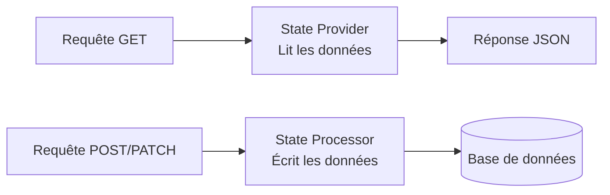

---
tags:
  - API
  - Avancé
  - Pratique
description: "Maîtriser API Platform avancé : groupes de sérialisation, sous-ressources, opérations custom, Data Processors et pagination."
estimated_time: "90 min"
fiche_number: 6
total_fiches: 10
cursus: "API Design et Documentation"
---

# 06 - API Platform - Avancé

> **En bref** : Cette fiche couvre les fonctionnalités avancées d'API Platform : groupes de sérialisation contextuels, sous-ressources, opérations personnalisées, Data Providers et Processors, événements et pagination avancée. Lecture estimée : 90 min.

## Prérequis

- Avoir lu la fiche **[05 - API Platform - Introduction](05-api-platform-introduction.md)**
- Connaître les groupes de sérialisation Symfony
- Connaître le système de services Symfony (fiche **[13 - Services et injection de dépendances](../03-symfony/13-services-injection-dependances.md)**)

## Objectif de cette fiche

À la fin de cette fiche, tu sauras utiliser des groupes de sérialisation différents par opération, créer des sous-ressources, définir des opérations personnalisées, écrire des State Processors pour la logique métier, et configurer la pagination avancée.

---

## Concepts

Cette section explique tous les concepts nécessaires. Lis-la entièrement avant de passer aux étapes pratiques.

### Qu'est-ce qu'un State Provider ?

**Définition** : Un State Provider est un service qui fournit les données pour une opération API Platform. Par défaut, API Platform utilise Doctrine pour récupérer les données. Tu peux créer tes propres State Providers pour récupérer des données depuis n'importe quelle source (cache, API externe, fichier).

**Le problème que les State Providers résolvent** :

Sans State Providers personnalisés :

1. **Limité à Doctrine** : toutes les données doivent venir de la base de données.
2. **Pas de logique métier en lecture** : impossible d'enrichir ou de transformer les données avant de les retourner.

**Comment les State Providers résolvent ces problèmes** :

| Problème | Solution |
| -------- | -------- |
| Limité à Doctrine | Le State Provider peut lire depuis n'importe quelle source |
| Pas de logique en lecture | Le State Provider peut transformer les données avant de les retourner |

**Ce qu'un State Provider n'est PAS** :

- Un State Provider n'est pas un contrôleur. Il ne retourne pas de réponse HTTP. Il retourne des données (un objet ou une collection) qu'API Platform sérialise ensuite.

---

### Qu'est-ce qu'un State Processor ?

**Définition** : Un State Processor est un service qui traite les données après la désérialisation et la validation. Par défaut, API Platform utilise Doctrine pour persister les données. Tu peux créer tes propres State Processors pour ajouter de la logique métier (envoyer un email, mettre à jour un cache, appeler un service externe).

**Le problème que les State Processors résolvent** :

Sans State Processors personnalisés :

1. **Logique métier dans l'entité** : l'entité contient du code métier qui n'y a pas sa place.
2. **Pas de post-traitement** : impossible d'effectuer des actions après la création ou la modification (envoi d'email, notification).

**Comment les State Processors résolvent ces problèmes** :

| Problème | Solution |
| -------- | -------- |
| Logique métier dans l'entité | Le State Processor contient la logique métier |
| Pas de post-traitement | Le State Processor peut exécuter du code avant ou après la persistence |

**Analogie concrète** : Si l'API est un restaurant, le State Provider est le serveur qui va chercher les plats en cuisine (lecture). Le State Processor est le cuisinier qui prépare le plat (écriture). L'entité est la recette (la structure des données). Le contrôleur (API Platform) est le maître d'hôtel qui coordonne le tout.

---

### Qu'est-ce qu'une opération personnalisée ?

**Définition** : Une opération personnalisée est un endpoint API Platform qui ne correspond pas aux opérations CRUD standard. Par exemple : publier un article (`POST /api/articles/{id}/publish`), réinitialiser un mot de passe, ou calculer des statistiques.

**Le problème que les opérations personnalisées résolvent** :

Les opérations CRUD standard (GET, POST, PATCH, DELETE) ne couvrent pas tous les cas d'usage. Certaines actions métier ne sont ni une création, ni une modification, ni une suppression.

---

Le diagramme suivant montre le rôle du State Provider (lecture) et du State Processor (écriture) dans le traitement d'une requête API Platform.



---

## Étapes Pratiques

### Étape 1 : Groupes de sérialisation par opération

Utilise des groupes de sérialisation différents pour la liste et le détail.

```php
<?php
// src/Entity/Book.php - groupes par opération

namespace App\Entity;

use ApiPlatform\Metadata\ApiResource;
use ApiPlatform\Metadata\Get;
use ApiPlatform\Metadata\GetCollection;
use ApiPlatform\Metadata\Patch;
use ApiPlatform\Metadata\Post;
use ApiPlatform\Metadata\Delete;
use Doctrine\Common\Collections\ArrayCollection;
use Doctrine\Common\Collections\Collection;
use Doctrine\ORM\Mapping as ORM;
use Symfony\Component\Serializer\Attribute\Groups;
use Symfony\Component\Validator\Constraints as Assert;

#[ApiResource(
    operations: [
        // La liste retourne un résumé (moins de champs)
        new GetCollection(
            normalizationContext: ['groups' => ['book:list']],
            description: 'Liste paginée des livres (résumé).'
        ),
        // Le détail retourne toutes les informations
        new Get(
            normalizationContext: ['groups' => ['book:read', 'book:detail']],
            description: 'Détails complets d\'un livre.'
        ),
        new Post(
            denormalizationContext: ['groups' => ['book:write']],
            description: 'Crée un livre.'
        ),
        new Patch(
            denormalizationContext: ['groups' => ['book:write']],
            description: 'Modifie un livre.'
        ),
        new Delete(),
    ],
)]
#[ORM\Entity]
class Book
{
    #[ORM\Id]
    #[ORM\GeneratedValue]
    #[ORM\Column]
    // Visible dans la liste ET le détail
    #[Groups(['book:list', 'book:read'])]
    private ?int $id = null;

    #[ORM\Column(length: 255)]
    #[Assert\NotBlank]
    // Visible partout, modifiable en écriture
    #[Groups(['book:list', 'book:read', 'book:write'])]
    private string $title = '';

    #[ORM\Column(length: 255)]
    #[Assert\NotBlank]
    #[Groups(['book:list', 'book:read', 'book:write'])]
    private string $author = '';

    #[ORM\Column(length: 13, nullable: true)]
    // L'ISBN n'est visible que dans le détail (pas dans la liste)
    #[Groups(['book:read', 'book:write'])]
    private ?string $isbn = null;

    #[ORM\Column(nullable: true)]
    #[Groups(['book:list', 'book:read', 'book:write'])]
    private ?int $publishedYear = null;

    #[ORM\Column(length: 100, nullable: true)]
    #[Groups(['book:list', 'book:read', 'book:write'])]
    private ?string $genre = null;

    #[ORM\Column(type: 'text', nullable: true)]
    // Le contenu complet n'est visible que dans le détail
    #[Groups(['book:detail', 'book:write'])]
    private ?string $description = null;

    #[ORM\Column]
    #[Groups(['book:list', 'book:read', 'book:write'])]
    private bool $published = false;

    #[ORM\Column]
    #[Groups(['book:list', 'book:read'])]
    private \DateTimeImmutable $createdAt;

    // Relation avec les avis
    #[ORM\OneToMany(targetEntity: Review::class, mappedBy: 'book')]
    // Les avis ne sont visibles que dans le détail d'un livre
    #[Groups(['book:detail'])]
    private Collection $reviews;

    public function __construct()
    {
        $this->createdAt = new \DateTimeImmutable();
        $this->reviews = new ArrayCollection();
    }

    // Getters et setters
    public function getId(): ?int { return $this->id; }
    public function getTitle(): string { return $this->title; }
    public function setTitle(string $title): self { $this->title = $title; return $this; }
    public function getAuthor(): string { return $this->author; }
    public function setAuthor(string $author): self { $this->author = $author; return $this; }
    public function getIsbn(): ?string { return $this->isbn; }
    public function setIsbn(?string $isbn): self { $this->isbn = $isbn; return $this; }
    public function getPublishedYear(): ?int { return $this->publishedYear; }
    public function setPublishedYear(?int $year): self { $this->publishedYear = $year; return $this; }
    public function getGenre(): ?string { return $this->genre; }
    public function setGenre(?string $genre): self { $this->genre = $genre; return $this; }
    public function getDescription(): ?string { return $this->description; }
    public function setDescription(?string $desc): self { $this->description = $desc; return $this; }
    public function isPublished(): bool { return $this->published; }
    public function setPublished(bool $published): self { $this->published = $published; return $this; }
    public function getCreatedAt(): \DateTimeImmutable { return $this->createdAt; }
    public function getReviews(): Collection { return $this->reviews; }
}
```

**Résultat attendu** :

- `GET /api/books` retourne : `id`, `title`, `author`, `publishedYear`, `genre`, `published`, `createdAt`
- `GET /api/books/1` retourne : tous les champs ci-dessus PLUS `isbn`, `description`, `reviews`

---

### Étape 2 : Créer une sous-ressource

Expose les avis (reviews) comme sous-ressource d'un livre.

```php
<?php
// src/Entity/Review.php

namespace App\Entity;

use ApiPlatform\Metadata\ApiResource;
use ApiPlatform\Metadata\Get;
use ApiPlatform\Metadata\GetCollection;
use ApiPlatform\Metadata\Link;
use ApiPlatform\Metadata\Post;
use Doctrine\ORM\Mapping as ORM;
use Symfony\Component\Serializer\Attribute\Groups;
use Symfony\Component\Validator\Constraints as Assert;

// Première déclaration : les avis en tant que sous-ressource d'un livre
// URL : /api/books/{bookId}/reviews
#[ApiResource(
    uriTemplate: '/books/{bookId}/reviews',
    operations: [
        new GetCollection(description: 'Liste les avis d\'un livre.'),
        new Post(description: 'Ajoute un avis à un livre.'),
    ],
    // Le lien indique que bookId correspond à la relation book.id
    uriVariables: [
        'bookId' => new Link(
            fromClass: Book::class,
            fromProperty: 'reviews'
        ),
    ],
    normalizationContext: ['groups' => ['review:read']],
    denormalizationContext: ['groups' => ['review:write']]
)]
// Deuxième déclaration : accès direct à un avis par son id
// URL : /api/reviews/{id}
#[ApiResource(
    operations: [
        new Get(description: 'Détails d\'un avis.'),
    ],
    normalizationContext: ['groups' => ['review:read']]
)]
#[ORM\Entity]
class Review
{
    #[ORM\Id]
    #[ORM\GeneratedValue]
    #[ORM\Column]
    #[Groups(['review:read', 'book:detail'])]
    private ?int $id = null;

    #[ORM\Column]
    #[Assert\Range(min: 1, max: 5)]
    #[Groups(['review:read', 'review:write', 'book:detail'])]
    private int $rating = 0;

    #[ORM\Column(type: 'text')]
    #[Assert\NotBlank]
    #[Groups(['review:read', 'review:write', 'book:detail'])]
    private string $comment = '';

    #[ORM\Column(length: 100)]
    #[Groups(['review:read', 'review:write', 'book:detail'])]
    private string $author = 'Anonyme';

    #[ORM\ManyToOne(targetEntity: Book::class, inversedBy: 'reviews')]
    #[ORM\JoinColumn(nullable: false)]
    // Le livre n'est pas modifiable dans le formulaire d'avis
    // Il est déterminé par l'URL (/books/{bookId}/reviews)
    private ?Book $book = null;

    #[ORM\Column]
    #[Groups(['review:read'])]
    private \DateTimeImmutable $createdAt;

    public function __construct()
    {
        $this->createdAt = new \DateTimeImmutable();
    }

    // Getters et setters
    public function getId(): ?int { return $this->id; }
    public function getRating(): int { return $this->rating; }
    public function setRating(int $rating): self { $this->rating = $rating; return $this; }
    public function getComment(): string { return $this->comment; }
    public function setComment(string $comment): self { $this->comment = $comment; return $this; }
    public function getAuthor(): string { return $this->author; }
    public function setAuthor(string $author): self { $this->author = $author; return $this; }
    public function getBook(): ?Book { return $this->book; }
    public function setBook(?Book $book): self { $this->book = $book; return $this; }
    public function getCreatedAt(): \DateTimeImmutable { return $this->createdAt; }
}
```

**Résultat attendu** :

```bash
# Lister les avis du livre 1
curl http://localhost:8000/api/books/1/reviews
```

```bash
# Ajouter un avis au livre 1
curl -X POST http://localhost:8000/api/books/1/reviews \
  -H "Content-Type: application/ld+json" \
  -d '{"rating": 5, "comment": "Excellent livre", "author": "Jean"}'
```

---

### Étape 3 : Créer une opération personnalisée

Crée une opération « publier un livre » qui change son statut.

```php
<?php
// src/Entity/Book.php - ajouter l'opération personnalisée

use ApiPlatform\Metadata\Post as ApiPost;

#[ApiResource(
    operations: [
        // ... opérations CRUD existantes

        // Opération personnalisée : publier un livre
        // POST /api/books/{id}/publish
        new ApiPost(
            uriTemplate: '/books/{id}/publish',
            // Le State Processor qui contient la logique métier
            processor: \App\State\PublishBookProcessor::class,
            // Cette opération ne prend pas de body
            input: false,
            // Elle retourne le livre mis à jour
            description: 'Publie un livre (change published à true).',
            // Nom de l'opération pour Swagger UI
            name: 'publish'
        ),
    ],
)]
```

Crée le State Processor :

```php
<?php
// src/State/PublishBookProcessor.php

namespace App\State;

use ApiPlatform\Metadata\Operation;
use ApiPlatform\State\ProcessorInterface;
use App\Entity\Book;
use Doctrine\ORM\EntityManagerInterface;

// Ce State Processor gère la logique de publication d'un livre
class PublishBookProcessor implements ProcessorInterface
{
    public function __construct(
        private EntityManagerInterface $em,
    ) {
    }

    // La méthode process() est appelée quand l'opération est exécutée
    // $data contient l'entité Book résolue depuis l'URL
    public function process(
        mixed $data,
        Operation $operation,
        array $uriVariables = [],
        array $context = []
    ): Book {
        // Vérification : $data doit être un Book
        if (!$data instanceof Book) {
            throw new \InvalidArgumentException('Entité Book attendue.');
        }

        // Si le livre est déjà publié, on ne fait rien
        if ($data->isPublished()) {
            return $data;
        }

        // On publie le livre
        $data->setPublished(true);

        // On persiste le changement
        $this->em->flush();

        // On retourne le livre mis à jour
        // API Platform le sérialisera en JSON
        return $data;
    }
}
```

**Résultat attendu** :

```bash
# Publier le livre 1
curl -X POST http://localhost:8000/api/books/1/publish
```

```json
{
    "@context": "/api/contexts/Book",
    "@id": "/api/books/1",
    "@type": "Book",
    "id": 1,
    "title": "Clean Code",
    "published": true
}
```

---

### Étape 4 : Créer un State Processor avec logique métier

Crée un State Processor pour la création de livres qui ajoute de la logique métier.

```php
<?php
// src/State/CreateBookProcessor.php

namespace App\State;

use ApiPlatform\Metadata\Operation;
use ApiPlatform\State\ProcessorInterface;
use App\Entity\Book;
use App\Repository\BookRepository;
use Doctrine\ORM\EntityManagerInterface;
use Symfony\Component\HttpKernel\Exception\ConflictHttpException;

// Ce State Processor ajoute de la logique métier à la création d'un livre
class CreateBookProcessor implements ProcessorInterface
{
    public function __construct(
        private EntityManagerInterface $em,
        private BookRepository $bookRepository,
    ) {
    }

    public function process(
        mixed $data,
        Operation $operation,
        array $uriVariables = [],
        array $context = []
    ): Book {
        if (!$data instanceof Book) {
            throw new \InvalidArgumentException('Entité Book attendue.');
        }

        // Vérification métier : unicité de l'ISBN
        if ($data->getIsbn() !== null) {
            $existing = $this->bookRepository->findOneBy([
                'isbn' => $data->getIsbn(),
            ]);

            if ($existing !== null) {
                // ConflictHttpException retourne 409 automatiquement
                throw new ConflictHttpException(
                    'Un livre avec l\'ISBN ' . $data->getIsbn() . ' existe déjà.'
                );
            }
        }

        // Logique métier : générer un slug si absent
        // (exemple simplifié)

        // Persister l'entité
        $this->em->persist($data);
        $this->em->flush();

        return $data;
    }
}
```

Associe le Processor à l'opération Post :

```php
<?php
// Dans la définition de l'entité Book

new Post(
    processor: CreateBookProcessor::class,
    description: 'Crée un nouveau livre.'
),
```

---

### Étape 5 : Créer un State Provider personnalisé

Crée un State Provider qui enrichit les données avant de les retourner.

```php
<?php
// src/State/BookWithStatsProvider.php

namespace App\State;

use ApiPlatform\Metadata\Operation;
use ApiPlatform\State\ProviderInterface;
use App\Entity\Book;
use App\Repository\BookRepository;
use App\Repository\ReviewRepository;

// Ce State Provider enrichit un livre avec ses statistiques d'avis
class BookWithStatsProvider implements ProviderInterface
{
    public function __construct(
        private BookRepository $bookRepository,
        private ReviewRepository $reviewRepository,
    ) {
    }

    // La méthode provide() est appelée pour récupérer les données
    public function provide(
        Operation $operation,
        array $uriVariables = [],
        array $context = []
    ): ?Book {
        // On récupère le livre depuis Doctrine
        $book = $this->bookRepository->find($uriVariables['id'] ?? 0);

        if ($book === null) {
            return null;
        }

        // On pourrait enrichir l'objet avec des données calculées
        // Par exemple, la note moyenne des avis
        // (nécessiterait un champ transient sur l'entité)

        return $book;
    }
}
```

---

### Étape 6 : Configurer la pagination avancée

Configure la pagination cursor et la pagination par collection.

```php
<?php
// src/Entity/Book.php - pagination avancée

#[ApiResource(
    operations: [
        new GetCollection(
            // Pagination offset classique
            paginationItemsPerPage: 20,
            paginationMaximumItemsPerPage: 100,
            // Permettre au client de modifier le nombre par page
            paginationClientItemsPerPage: true,
        ),
        // ... autres opérations
    ],
)]
```

Configuration globale de la pagination dans YAML :

```yaml
# config/packages/api_platform.yaml

api_platform:
    defaults:
        pagination_enabled: true
        pagination_items_per_page: 20
        pagination_maximum_items_per_page: 100
        pagination_client_items_per_page: true
        pagination_client_enabled: true
        # Activer la pagination partielle (ne pas compter le total)
        # Utile pour les très gros volumes
        pagination_partial: false

    collection:
        pagination:
            # Nom du paramètre pour la page
            page_parameter_name: "page"
            # Nom du paramètre pour le nombre par page
            items_per_page_parameter_name: "itemsPerPage"
            # Nom du paramètre pour activer/désactiver la pagination
            enabled_parameter_name: "pagination"
            # Nom du paramètre pour la pagination partielle
            partial_parameter_name: "partial"
```

**Résultat attendu** :

```bash
# Page 3, 10 éléments par page
curl "http://localhost:8000/api/books?page=3&itemsPerPage=10"
```

La réponse JSON-LD inclut les métadonnées de pagination :

```json
{
    "@context": "/api/contexts/Book",
    "@id": "/api/books",
    "@type": "hydra:Collection",
    "hydra:totalItems": 43,
    "hydra:member": [
        {"@id": "/api/books/21", "title": "..."}
    ],
    "hydra:view": {
        "@id": "/api/books?page=3&itemsPerPage=10",
        "@type": "hydra:PartialCollectionView",
        "hydra:first": "/api/books?page=1&itemsPerPage=10",
        "hydra:last": "/api/books?page=5&itemsPerPage=10",
        "hydra:previous": "/api/books?page=2&itemsPerPage=10",
        "hydra:next": "/api/books?page=4&itemsPerPage=10"
    }
}
```

---

## Commandes Utiles

| Commande | Action |
| -------- | ------ |
| `php bin/console debug:container --tag=api_platform.state_processor` | Lister les State Processors |
| `php bin/console debug:container --tag=api_platform.state_provider` | Lister les State Providers |
| `php bin/console api:openapi:export --format=yaml` | Exporter la spec OpenAPI |
| `php bin/console debug:router \| grep api` | Lister les routes API |

---

## Pièges Fréquents

### Piège 1 : Référence circulaire dans la sérialisation

⚠️ **Problème** : Un `Book` a des `Review`, et chaque `Review` a un `Book`. La sérialisation entre dans une boucle infinie.

✅ **Solution** : Utilise des groupes de sérialisation séparés. Le groupe `book:detail` inclut les reviews, mais le groupe `review:read` n'inclut PAS le livre complet (juste son id ou son titre).

```php
<?php
// Dans Review.php
#[ORM\ManyToOne(targetEntity: Book::class)]
// Pas de groupe review:read ici → le livre n'est pas inclus
// quand on sérialise les reviews
private ?Book $book = null;
```

### Piège 2 : Le State Processor n'est pas appelé

⚠️ **Problème** : Tu crées un State Processor mais il n'est pas exécuté.

✅ **Solution** : Vérifie que le Processor est associé à l'opération avec `processor: MonProcessor::class`. Vérifie aussi que le service est bien autoconfigured.

```php
<?php
// ✅ Le Processor est explicitement associé à l'opération
new Post(processor: CreateBookProcessor::class),
```

### Piège 3 : La sous-ressource ne filtre pas par parent

⚠️ **Problème** : `GET /api/books/1/reviews` retourne TOUS les avis au lieu de ceux du livre 1.

✅ **Solution** : Vérifie que le `uriVariables` est correctement configuré avec `Link`.

```php
<?php
// ✅ Le Link connecte bookId à la relation reviews
uriVariables: [
    'bookId' => new Link(
        fromClass: Book::class,
        fromProperty: 'reviews'
    ),
],
```

### Piège 4 : Modifier l'entité dans un State Provider

⚠️ **Problème** : Tu modifies les données dans un State Provider (lecture). Les modifications sont persistées involontairement par Doctrine.

✅ **Solution** : Les State Providers sont pour la lecture. Si tu as besoin de données calculées, utilise un DTO ou un champ non persisté (`#[Ignore]`).

---

## Checklist de Validation

- [ ] Je sais utiliser des groupes de sérialisation différents par opération (liste vs détail)
- [ ] Je sais créer une sous-ressource avec `uriTemplate` et `Link`
- [ ] Je sais créer une opération personnalisée (ex: publish)
- [ ] Je sais écrire un State Processor pour la logique métier
- [ ] Je sais écrire un State Provider pour personnaliser la lecture
- [ ] La pagination avancée est configurée (items par page, max, client)
- [ ] Je gère les références circulaires avec les groupes de sérialisation

---

## Exercice Pratique

**Énoncé** : Enrichis l'API de films (fiche 05) avec des fonctionnalités avancées.

**Spécifications** :

- Groupes de sérialisation par opération : la liste retourne `id`, `title`, `director`, `releaseYear`, `rating`. Le détail retourne tout, y compris `synopsis` et les avis.
- Sous-ressource `Review` : `GET /api/movies/{movieId}/reviews` et `POST /api/movies/{movieId}/reviews`
- Opération personnalisée : `POST /api/movies/{id}/rate` qui accepte un body `{"rating": 8}` et met à jour la note moyenne du film
- State Processor pour la création de film : vérifier qu'un film avec le même titre et le même réalisateur n'existe pas déjà (retourner 409 si doublon)
- Pagination : 15 par page pour la liste des films, 10 par page pour les avis

**Indications** :

- Utilise `normalizationContext` par opération dans le tableau `operations`
- Le State Processor pour l'opération `rate` doit récupérer tous les avis et calculer la moyenne
- Utilise `ConflictHttpException` pour le doublon

**Résultat attendu** : une API fonctionnelle avec sous-ressources, opérations custom et logique métier dans les State Processors.

---

## Solution de l'Exercice

> **Note** : Cette section contient la solution complète. Essaie d'abord de résoudre l'exercice par toi-même avant de consulter cette solution.

---

```php
<?php
// src/State/RateMovieProcessor.php

namespace App\State;

use ApiPlatform\Metadata\Operation;
use ApiPlatform\State\ProcessorInterface;
use App\Entity\Movie;
use App\Repository\ReviewRepository;
use Doctrine\ORM\EntityManagerInterface;

// Ce State Processor calcule la note moyenne d'un film à partir de ses avis
class RateMovieProcessor implements ProcessorInterface
{
    public function __construct(
        private EntityManagerInterface $em,
        private ReviewRepository $reviewRepository,
    ) {
    }

    public function process(
        mixed $data,
        Operation $operation,
        array $uriVariables = [],
        array $context = []
    ): Movie {
        if (!$data instanceof Movie) {
            throw new \InvalidArgumentException('Entité Movie attendue.');
        }

        // On récupère tous les avis de ce film
        $reviews = $this->reviewRepository->findBy([
            'movie' => $data->getId(),
        ]);

        if (count($reviews) === 0) {
            return $data;
        }

        // On calcule la note moyenne
        $total = 0;
        foreach ($reviews as $review) {
            $total += $review->getRating();
        }
        $average = round($total / count($reviews), 1);

        // On met à jour la note du film
        $data->setRating($average);
        $this->em->flush();

        return $data;
    }
}
```

```php
<?php
// src/State/CreateMovieProcessor.php

namespace App\State;

use ApiPlatform\Metadata\Operation;
use ApiPlatform\State\ProcessorInterface;
use App\Entity\Movie;
use App\Repository\MovieRepository;
use Doctrine\ORM\EntityManagerInterface;
use Symfony\Component\HttpKernel\Exception\ConflictHttpException;

// Ce State Processor vérifie l'unicité titre+réalisateur avant création
class CreateMovieProcessor implements ProcessorInterface
{
    public function __construct(
        private EntityManagerInterface $em,
        private MovieRepository $movieRepository,
    ) {
    }

    public function process(
        mixed $data,
        Operation $operation,
        array $uriVariables = [],
        array $context = []
    ): Movie {
        if (!$data instanceof Movie) {
            throw new \InvalidArgumentException('Entité Movie attendue.');
        }

        // Vérifier l'unicité titre + réalisateur
        $existing = $this->movieRepository->findOneBy([
            'title' => $data->getTitle(),
            'director' => $data->getDirector(),
        ]);

        if ($existing !== null) {
            throw new ConflictHttpException(sprintf(
                'Le film "%s" de %s existe déjà.',
                $data->getTitle(),
                $data->getDirector()
            ));
        }

        $this->em->persist($data);
        $this->em->flush();

        return $data;
    }
}
```

---

## Navigation

← Fiche précédente : **[05 - API Platform - Introduction](05-api-platform-introduction.md)**

→ Fiche suivante : **[07 - Versioning d'API](07-versioning-api.md)**
