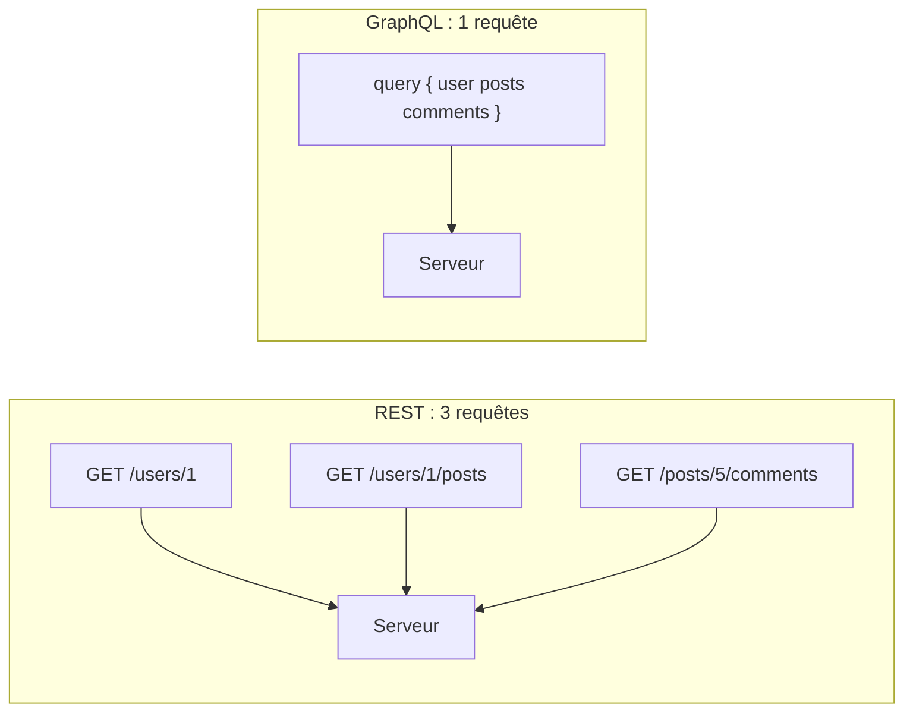

---
tags:
  - API
  - Avancé
  - Concept
description: "Comprendre GraphQL : concepts fondamentaux, comparaison avec REST, schéma, types, queries, mutations et intégration avec API Platform."
estimated_time: "75 min"
fiche_number: 9
total_fiches: 10
cursus: "API Design et Documentation"
---

# 09 - Introduction à GraphQL

> **En bref** : Cette fiche couvre les concepts fondamentaux de GraphQL : schéma, types, queries et mutations, comparaison avec REST, résolution des problèmes d'over-fetching et under-fetching, et intégration avec API Platform dans Symfony. Lecture estimée : 75 min.

## Prérequis

- Avoir lu la fiche **[08 - Authentification API](08-authentification-api.md)**
- Connaître les principes REST (fiche **[01 - Principes REST avancés](01-principes-rest-avances.md)**)
- Savoir utiliser API Platform (fiche **[05 - API Platform - Introduction](05-api-platform-introduction.md)**)
- Connaître les bases du JSON

## Objectif de cette fiche

À la fin de cette fiche, tu sauras expliquer ce qu'est GraphQL et quand l'utiliser à la place de REST, lire et comprendre un schéma GraphQL, écrire des queries pour récupérer des données et des mutations pour les modifier, et activer GraphQL dans API Platform.

---

## Concepts

Cette section explique tous les concepts nécessaires. Lis-la entièrement avant de passer aux étapes pratiques.

### Qu'est-ce que GraphQL ?

**Définition** : GraphQL est un langage de requête pour les API, créé par Facebook en 2012 et publié en open source en 2015. Le client décrit exactement les données dont il a besoin dans sa requête. Le serveur retourne uniquement ces données, ni plus ni moins.

**Le problème que GraphQL résout** :

Sans GraphQL, voici les problèmes rencontrés avec une API REST :

1. **Over-fetching (trop de données)** : tu demandes un livre avec `GET /api/books/1` et tu reçois tous les champs (titre, auteur, ISBN, synopsis, date de création, genre...) alors que tu n'as besoin que du titre et de l'auteur.
2. **Under-fetching (pas assez de données)** : tu veux afficher un livre avec ses avis. Tu dois faire deux requêtes : `GET /api/books/1` puis `GET /api/books/1/reviews`. Avec 10 livres, cela fait 11 requêtes.
3. **Endpoints multiples** : chaque ressource a son propre endpoint. L'application mobile qui a besoin de données de 5 ressources différentes doit faire 5 requêtes séparées.

**Comment GraphQL résout ces problèmes** :

| Problème | Solution apportée par GraphQL |
| -------- | ----------------------------- |
| Over-fetching | Le client liste exactement les champs qu'il veut recevoir |
| Under-fetching | Une seule requête peut traverser les relations (livre + avis en une requête) |
| Endpoints multiples | Un seul endpoint (`/graphql`) pour toutes les données |

Le schéma suivant illustre la différence principale entre REST et GraphQL : avec REST, le client doit envoyer plusieurs requêtes pour assembler les données. Avec GraphQL, une seule requête suffit :



**Analogie concrète** : GraphQL fonctionne comme un menu à la carte dans un restaurant. Au lieu de commander un « menu du jour » (REST) qui inclut une entrée, un plat et un dessert fixes, tu commandes exactement ce que tu veux : juste le plat principal et un dessert, sans entrée. Le serveur te sert exactement ce que tu as demandé.

**Ce que GraphQL n'est PAS** :

- GraphQL n'est pas une base de données. C'est un langage de requête pour les API, pas pour les bases de données. Le serveur traduit les requêtes GraphQL en requêtes SQL, en appels à d'autres services ou en toute autre source de données.
- GraphQL n'est pas un remplacement de REST. Les deux coexistent. REST reste plus simple pour les API CRUD classiques. GraphQL est plus adapté quand les clients ont des besoins de données très variés.
- GraphQL n'est pas automatiquement plus rapide que REST. Une requête GraphQL mal conçue peut générer des dizaines de requêtes SQL (problème N+1). La performance dépend de l'implémentation côté serveur.

**Comparaison REST vs GraphQL** :

| Critère | REST | GraphQL |
| ------- | ---- | ------- |
| Endpoints | Un endpoint par ressource | Un seul endpoint `/graphql` |
| Données retournées | Tous les champs de la ressource | Seulement les champs demandés |
| Relations | Requêtes multiples ou sous-ressources | Une seule requête traverse les relations |
| Cache HTTP | Facile (chaque URL est cacheable) | Plus complexe (une seule URL) |
| Versionning | Versions d'API (v1, v2) | Pas de versioning, évolution du schéma |
| Documentation | OpenAPI / Swagger | Schéma introspectable |
| Complexité serveur | Faible à moyenne | Moyenne à élevée |
| Courbe d'apprentissage | Faible | Moyenne |

---

### Le schéma GraphQL

**Définition** : Le schéma GraphQL (Schema Definition Language, SDL) décrit la structure de toutes les données disponibles dans l'API. Il définit les types (objets), leurs champs, les relations entre types, et les opérations possibles (queries, mutations).

**Le problème que le schéma résout** :

Sans schéma, voici les problèmes rencontrés :

1. **Pas de contrat** : le client ne sait pas quels champs sont disponibles ni quels types ils ont.
2. **Documentation manuelle** : la documentation doit être écrite et maintenue séparément du code.

**Comment le schéma résout ces problèmes** :

| Problème | Solution apportée par le schéma |
| -------- | ------------------------------- |
| Pas de contrat | Le schéma définit un contrat strict entre client et serveur |
| Documentation manuelle | Le schéma est auto-documenté et introspectable |

**Exemple de schéma** :

```text
# Définition du type Book
type Book {
    id: ID!              # ID unique, non nullable (le ! signifie obligatoire)
    title: String!       # Chaîne de caractères obligatoire
    author: String!      # Chaîne de caractères obligatoire
    isbn: String         # Chaîne optionnelle (pas de !)
    publishedYear: Int   # Entier optionnel
    genre: String        # Chaîne optionnelle
    published: Boolean!  # Booléen obligatoire
    reviews: [Review!]!  # Liste de Review, la liste et chaque élément sont non nullables
}

# Définition du type Review
type Review {
    id: ID!
    rating: Int!         # Note de 1 à 5
    comment: String
    author: String!
    book: Book!          # Relation vers le livre
}

# Les queries définissent les opérations de lecture
type Query {
    # Récupérer un livre par son identifiant
    book(id: ID!): Book
    # Récupérer la liste de tous les livres
    books: [Book!]!
}

# Les mutations définissent les opérations d'écriture
type Mutation {
    # Créer un livre
    createBook(title: String!, author: String!, isbn: String): Book!
    # Modifier un livre
    updateBook(id: ID!, title: String, author: String): Book!
    # Supprimer un livre
    deleteBook(id: ID!): Boolean!
}
```

**Les types scalaires de GraphQL** :

| Type | Description | Exemple |
| ---- | ----------- | ------- |
| `Int` | Entier signé 32 bits | `42` |
| `Float` | Nombre à virgule flottante | `3.14` |
| `String` | Chaîne de caractères UTF-8 | `"Clean Code"` |
| `Boolean` | Vrai ou faux | `true` |
| `ID` | Identifiant unique (sérialisé comme String) | `"1"` |

**Les modificateurs de type** :

| Syntaxe | Signification | Exemple |
| ------- | ------------- | ------- |
| `String` | Chaîne nullable (peut être `null`) | `"texte"` ou `null` |
| `String!` | Chaîne non nullable (obligatoire) | `"texte"` |
| `[String]` | Liste nullable de chaînes nullables | `["a", null]` ou `null` |
| `[String!]!` | Liste obligatoire de chaînes obligatoires | `["a", "b"]` |

---

### Queries (requêtes de lecture)

**Définition** : Une query GraphQL est une requête de lecture qui permet au client de demander exactement les données dont il a besoin. Le client spécifie les champs qu'il veut recevoir, et le serveur retourne uniquement ces champs.

**Exemple de query simple** :

```text
# Demander le titre et l'auteur du livre avec l'id 1
query {
    book(id: 1) {
        title
        author
    }
}
```

**Réponse** :

```json
{
    "data": {
        "book": {
            "title": "Clean Code",
            "author": "Robert C. Martin"
        }
    }
}
```

Le client n'a demandé que `title` et `author`. Le serveur ne retourne pas `isbn`, `publishedYear`, `genre`, `published` ni `reviews`.

**Exemple de query avec relations** :

```text
# Demander un livre avec ses avis en une seule requête
query {
    book(id: 1) {
        title
        author
        reviews {
            rating
            comment
            author
        }
    }
}
```

**Réponse** :

```json
{
    "data": {
        "book": {
            "title": "Clean Code",
            "author": "Robert C. Martin",
            "reviews": [
                {
                    "rating": 5,
                    "comment": "Indispensable pour tout développeur.",
                    "author": "Alice"
                },
                {
                    "rating": 4,
                    "comment": "Très bien mais parfois répétitif.",
                    "author": "Bob"
                }
            ]
        }
    }
}
```

En REST, cela aurait nécessité deux requêtes : `GET /api/books/1` et `GET /api/books/1/reviews`. En GraphQL, une seule requête suffit.

**Exemple de query sur une collection** :

```text
# Demander la liste des livres avec seulement le titre et l'année
query {
    books {
        title
        publishedYear
    }
}
```

**Réponse** :

```json
{
    "data": {
        "books": [
            {"title": "Clean Code", "publishedYear": 2008},
            {"title": "Design Patterns", "publishedYear": 1994},
            {"title": "The Pragmatic Programmer", "publishedYear": 1999}
        ]
    }
}
```

---

### Mutations (opérations d'écriture)

**Définition** : Une mutation GraphQL est une opération d'écriture qui modifie les données côté serveur (création, modification, suppression). Elle fonctionne comme une query mais commence par le mot-clé `mutation`.

**Exemple de mutation pour créer un livre** :

```text
mutation {
    createBook(
        title: "Refactoring"
        author: "Martin Fowler"
        isbn: "9780134757599"
    ) {
        id
        title
        author
    }
}
```

**Réponse** :

```json
{
    "data": {
        "createBook": {
            "id": "4",
            "title": "Refactoring",
            "author": "Martin Fowler"
        }
    }
}
```

La mutation crée le livre et retourne les champs demandés (`id`, `title`, `author`). Tu choisis les champs retournés, comme pour une query.

**Exemple de mutation pour modifier un livre** :

```text
mutation {
    updateBook(
        id: 4
        title: "Refactoring: Improving the Design of Existing Code"
    ) {
        id
        title
    }
}
```

**Réponse** :

```json
{
    "data": {
        "updateBook": {
            "id": "4",
            "title": "Refactoring: Improving the Design of Existing Code"
        }
    }
}
```

**Exemple de mutation pour supprimer un livre** :

```text
mutation {
    deleteBook(id: 4)
}
```

**Réponse** :

```json
{
    "data": {
        "deleteBook": true
    }
}
```

---

### Variables GraphQL

**Définition** : Les variables GraphQL permettent de paramétrer les queries et mutations sans concaténer des valeurs dans la requête. Elles sont envoyées dans un objet JSON séparé.

**Le problème que les variables résolvent** :

Sans variables :

1. **Injection** : concaténer des valeurs dans la requête est risqué (injection de requête).
2. **Pas de réutilisation** : la même query avec des valeurs différentes nécessite de réécrire la requête complète.

**Exemple avec variables** :

```text
# La query utilise des variables préfixées par $
query GetBook($bookId: ID!) {
    book(id: $bookId) {
        title
        author
        publishedYear
    }
}
```

Les variables sont envoyées dans un objet JSON séparé :

```json
{
    "bookId": 1
}
```

**Réponse** :

```json
{
    "data": {
        "book": {
            "title": "Clean Code",
            "author": "Robert C. Martin",
            "publishedYear": 2008
        }
    }
}
```

---

### Gestion des erreurs en GraphQL

**Définition** : En GraphQL, les erreurs sont retournées dans un champ `errors` de la réponse JSON, pas via les codes de statut HTTP. Le code HTTP est presque toujours 200, même en cas d'erreur.

**Différence avec REST** :

| Aspect | REST | GraphQL |
| ------ | ---- | ------- |
| Succès | Code 200 + données | Code 200 + champ `data` |
| Erreur client | Code 400/404/422 + message | Code 200 + champ `errors` |
| Erreur serveur | Code 500 + message | Code 200 + champ `errors` |

**Exemple de réponse avec erreur** :

```json
{
    "data": {
        "book": null
    },
    "errors": [
        {
            "message": "Le livre avec l'id 999 n'existe pas.",
            "locations": [{"line": 2, "column": 3}],
            "path": ["book"],
            "extensions": {
                "code": "NOT_FOUND",
                "statusCode": 404
            }
        }
    ]
}
```

**Réponse avec succès partiel** :

GraphQL peut retourner des données ET des erreurs dans la même réponse. Si la requête demande un livre et ses avis, et que les avis échouent, le livre est quand même retourné.

```json
{
    "data": {
        "book": {
            "title": "Clean Code",
            "reviews": null
        }
    },
    "errors": [
        {
            "message": "Erreur lors de la récupération des avis.",
            "path": ["book", "reviews"]
        }
    ]
}
```

---

## Étapes Pratiques

### Étape 1 : Activer GraphQL dans API Platform

Installe le support GraphQL dans API Platform.

```bash
# Installer la dépendance GraphQL pour API Platform
composer require api-platform/graphql
```

```bash
# Installer la bibliothèque GraphQL PHP
composer require webonyx/graphql-php
```

Vérifie que GraphQL est activé dans la configuration :

```yaml
# config/packages/api_platform.yaml

api_platform:
    # ... configuration existante

    # Activer GraphQL
    graphql:
        enabled: true
        # Interface graphique pour tester les queries
        graphiql:
            enabled: true
```

**Résultat attendu** :

```bash
# Vérifier que l'endpoint GraphQL est disponible
php bin/console debug:router | grep graphql
```

```text
api_graphql_entrypoint        ANY    /api/graphql
api_graphql_graphiql          ANY    /api/graphql/graphiql
```

L'interface GraphiQL est accessible à `http://localhost:8000/api/graphql/graphiql`. Elle permet de tester les queries et mutations dans le navigateur.

---

### Étape 2 : Configurer une entité pour GraphQL

API Platform expose automatiquement les entités comme ressources GraphQL. Personnalise les opérations.

```php
<?php
// src/Entity/Book.php - avec configuration GraphQL

namespace App\Entity;

use ApiPlatform\Metadata\ApiResource;
use ApiPlatform\Metadata\GraphQl\DeleteMutation;
use ApiPlatform\Metadata\GraphQl\Mutation;
use ApiPlatform\Metadata\GraphQl\Query;
use ApiPlatform\Metadata\GraphQl\QueryCollection;
use Doctrine\Common\Collections\ArrayCollection;
use Doctrine\Common\Collections\Collection;
use Doctrine\ORM\Mapping as ORM;
use Symfony\Component\Serializer\Attribute\Groups;
use Symfony\Component\Validator\Constraints as Assert;

#[ApiResource(
    // ... opérations REST existantes

    // Configuration des opérations GraphQL
    graphQlOperations: [
        // Query pour récupérer un livre par son identifiant
        new Query(
            description: 'Récupère un livre.'
        ),
        // Query pour récupérer la liste des livres
        new QueryCollection(
            description: 'Liste les livres.',
            paginationType: 'page'
        ),
        // Mutation pour créer un livre
        new Mutation(
            name: 'create',
            description: 'Crée un livre.',
            security: 'is_granted("ROLE_ADMIN")'
        ),
        // Mutation pour modifier un livre
        new Mutation(
            name: 'update',
            description: 'Modifie un livre.',
            security: 'is_granted("ROLE_ADMIN")'
        ),
        // Mutation pour supprimer un livre
        new DeleteMutation(
            name: 'delete',
            description: 'Supprime un livre.',
            security: 'is_granted("ROLE_ADMIN")'
        ),
    ],
    normalizationContext: ['groups' => ['book:read']],
    denormalizationContext: ['groups' => ['book:write']],
)]
#[ORM\Entity]
class Book
{
    #[ORM\Id]
    #[ORM\GeneratedValue]
    #[ORM\Column]
    #[Groups(['book:read'])]
    private ?int $id = null;

    #[ORM\Column(length: 255)]
    #[Assert\NotBlank]
    #[Groups(['book:read', 'book:write'])]
    private string $title = '';

    #[ORM\Column(length: 255)]
    #[Assert\NotBlank]
    #[Groups(['book:read', 'book:write'])]
    private string $author = '';

    #[ORM\Column(length: 13, nullable: true, unique: true)]
    #[Groups(['book:read', 'book:write'])]
    private ?string $isbn = null;

    #[ORM\Column(nullable: true)]
    #[Groups(['book:read', 'book:write'])]
    private ?int $publishedYear = null;

    #[ORM\Column(length: 100, nullable: true)]
    #[Groups(['book:read', 'book:write'])]
    private ?string $genre = null;

    #[ORM\Column]
    #[Groups(['book:read', 'book:write'])]
    private bool $published = false;

    // Relation OneToMany vers Review
    #[ORM\OneToMany(mappedBy: 'book', targetEntity: Review::class)]
    #[Groups(['book:read'])]
    private Collection $reviews;

    public function __construct()
    {
        $this->reviews = new ArrayCollection();
    }

    // Getters et setters
    public function getId(): ?int { return $this->id; }
    public function getTitle(): string { return $this->title; }
    public function setTitle(string $title): self { $this->title = $title; return $this; }
    public function getAuthor(): string { return $this->author; }
    public function setAuthor(string $author): self { $this->author = $author; return $this; }
    public function getIsbn(): ?string { return $this->isbn; }
    public function setIsbn(?string $isbn): self { $this->isbn = $isbn; return $this; }
    public function getPublishedYear(): ?int { return $this->publishedYear; }
    public function setPublishedYear(?int $year): self { $this->publishedYear = $year; return $this; }
    public function getGenre(): ?string { return $this->genre; }
    public function setGenre(?string $genre): self { $this->genre = $genre; return $this; }
    public function isPublished(): bool { return $this->published; }
    public function setPublished(bool $published): self { $this->published = $published; return $this; }
    public function getReviews(): Collection { return $this->reviews; }
}
```

---

### Étape 3 : Tester les queries avec curl

Envoie des queries GraphQL avec curl. Toutes les requêtes sont des POST sur `/api/graphql`.

```bash
# Query : récupérer un livre avec seulement titre et auteur
curl -X POST http://localhost:8000/api/graphql \
  -H "Content-Type: application/json" \
  -H "Authorization: Bearer <TOKEN>" \
  -d '{
    "query": "query { book(id: \"/api/books/1\") { title author } }"
  }'
```

**Résultat attendu** :

```json
{
    "data": {
        "book": {
            "title": "Clean Code",
            "author": "Robert C. Martin"
        }
    }
}
```

```bash
# Query : récupérer un livre avec ses avis (traversée de relation)
curl -X POST http://localhost:8000/api/graphql \
  -H "Content-Type: application/json" \
  -H "Authorization: Bearer <TOKEN>" \
  -d '{
    "query": "query { book(id: \"/api/books/1\") { title author reviews { edges { node { rating comment } } } } }"
  }'
```

**Résultat attendu** :

```json
{
    "data": {
        "book": {
            "title": "Clean Code",
            "author": "Robert C. Martin",
            "reviews": {
                "edges": [
                    {
                        "node": {
                            "rating": 5,
                            "comment": "Indispensable."
                        }
                    }
                ]
            }
        }
    }
}
```

```bash
# Query collection : lister les livres avec pagination
curl -X POST http://localhost:8000/api/graphql \
  -H "Content-Type: application/json" \
  -H "Authorization: Bearer <TOKEN>" \
  -d '{
    "query": "query { books(page: 1, itemsPerPage: 5) { collection { id title publishedYear } paginationInfo { totalCount lastPage } } }"
  }'
```

**Résultat attendu** :

```json
{
    "data": {
        "books": {
            "collection": [
                {"id": 1, "title": "Clean Code", "publishedYear": 2008},
                {"id": 2, "title": "Design Patterns", "publishedYear": 1994}
            ],
            "paginationInfo": {
                "totalCount": 2,
                "lastPage": 1
            }
        }
    }
}
```

---

### Étape 4 : Tester les mutations avec curl

Envoie des mutations pour créer et modifier des données.

```bash
# Mutation : créer un livre
curl -X POST http://localhost:8000/api/graphql \
  -H "Content-Type: application/json" \
  -H "Authorization: Bearer <TOKEN_ADMIN>" \
  -d '{
    "query": "mutation { createBook(input: { title: \"Refactoring\", author: \"Martin Fowler\", isbn: \"9780134757599\", publishedYear: 2018, published: true }) { book { id title author } } }"
  }'
```

**Résultat attendu** :

```json
{
    "data": {
        "createBook": {
            "book": {
                "id": 3,
                "title": "Refactoring",
                "author": "Martin Fowler"
            }
        }
    }
}
```

```bash
# Mutation : modifier un livre
curl -X POST http://localhost:8000/api/graphql \
  -H "Content-Type: application/json" \
  -H "Authorization: Bearer <TOKEN_ADMIN>" \
  -d '{
    "query": "mutation { updateBook(input: { id: \"/api/books/3\", title: \"Refactoring (2nd Edition)\" }) { book { id title } } }"
  }'
```

**Résultat attendu** :

```json
{
    "data": {
        "updateBook": {
            "book": {
                "id": 3,
                "title": "Refactoring (2nd Edition)"
            }
        }
    }
}
```

```bash
# Mutation : supprimer un livre
curl -X POST http://localhost:8000/api/graphql \
  -H "Content-Type: application/json" \
  -H "Authorization: Bearer <TOKEN_ADMIN>" \
  -d '{
    "query": "mutation { deleteBook(input: { id: \"/api/books/3\" }) { book { id } } }"
  }'
```

---

### Étape 5 : Utiliser GraphiQL

L'interface GraphiQL est un outil intégré pour tester les queries GraphQL directement dans le navigateur.

Ouvre `http://localhost:8000/api/graphql/graphiql` dans ton navigateur.

Dans le panneau de gauche, tape une query :

```text
query {
    books {
        collection {
            title
            author
            publishedYear
        }
    }
}
```

Clique sur le bouton **Play** (triangle). Le résultat apparaît dans le panneau de droite.

**Fonctionnalités de GraphiQL** :

| Fonctionnalité | Description |
| -------------- | ----------- |
| Autocomplétion | Tape `Ctrl+Espace` pour voir les champs disponibles |
| Documentation | Clique sur « Docs » à droite pour explorer le schéma |
| Variables | Utilise le panneau « Query Variables » en bas pour les variables |
| Historique | Les queries précédentes sont enregistrées |
| Formatage | Le code est automatiquement formaté |

---

## Commandes Utiles

| Commande | Action |
| -------- | ------ |
| `composer require api-platform/graphql` | Installer le support GraphQL |
| `php bin/console debug:router \| grep graphql` | Lister les routes GraphQL |
| `php bin/console api:graphql:export` | Exporter le schéma GraphQL en SDL |
| `curl -X POST -H "Content-Type: application/json" -d '{"query": "{ __schema { types { name } } }"}' URL/api/graphql` | Introspecter le schéma |

---

## Pièges Fréquents

### Piège 1 : Confondre REST et GraphQL pour le choix d'architecture

⚠️ **Problème** : Tu choisis GraphQL parce que c'est « plus moderne », alors que ton API est un CRUD simple consommé par un seul frontend.

✅ **Solution** : GraphQL est utile quand les clients ont des besoins de données très variés (application mobile qui veut peu de champs, application web qui veut tout, application tierce qui veut des combinaisons spécifiques). Pour un CRUD simple avec un seul consommateur, REST avec API Platform est plus adapté.

| Choisis REST quand... | Choisis GraphQL quand... |
| --------------------- | ------------------------ |
| Un seul client consomme l'API | Plusieurs clients avec des besoins différents |
| API CRUD simple | Données très liées avec des relations profondes |
| Cache HTTP important | Flexibilité des données prioritaire |
| Équipe débutante en API | Équipe à l'aise avec les concepts d'API |

### Piège 2 : Le problème N+1

⚠️ **Problème** : Une query qui demande des livres avec leurs avis génère une requête SQL pour les livres, puis une requête SQL par livre pour récupérer ses avis. Avec 100 livres, cela fait 101 requêtes SQL.

✅ **Solution** : Utilise un DataLoader (batching) pour regrouper les requêtes. API Platform gère ce problème automatiquement avec Doctrine. Vérifie les requêtes SQL avec le Profiler Symfony.

### Piège 3 : Oublier que GraphQL retourne toujours 200

⚠️ **Problème** : Tu écris du code client qui vérifie le code HTTP pour détecter les erreurs. Mais GraphQL retourne 200 même en cas d'erreur de validation ou de données introuvables.

✅ **Solution** : Vérifie toujours le champ `errors` dans la réponse JSON, pas le code HTTP.

```javascript
// ❌ Incorrect : vérifier le code HTTP
if (response.status !== 200) {
    // Cette condition est rarement vraie avec GraphQL
}

// ✅ Correct : vérifier le champ errors
const result = await response.json();
if (result.errors) {
    // Traiter les erreurs
}
```

### Piège 4 : Exposer des champs sensibles dans le schéma

⚠️ **Problème** : Le schéma GraphQL expose le champ `password` ou `internalNotes` parce que tu n'as pas configuré les groupes de sérialisation.

✅ **Solution** : Utilise les groupes de sérialisation (`normalizationContext`, `denormalizationContext`) pour contrôler les champs exposés. Les groupes fonctionnent de la même façon en REST et en GraphQL.

### Piège 5 : Utiliser les IRI API Platform dans les queries

⚠️ **Problème** : En GraphQL avec API Platform, les identifiants sont des IRI (`/api/books/1`) et non des entiers simples (`1`). Tu passes un entier et la requête échoue.

✅ **Solution** : Utilise l'IRI complet dans les queries et mutations.

```text
# ❌ Incorrect : identifiant entier
query { book(id: 1) { title } }

# ✅ Correct : identifiant IRI
query { book(id: "/api/books/1") { title } }
```

---

## Checklist de Validation

- [ ] Je sais expliquer la différence entre REST et GraphQL
- [ ] Je connais les cas d'usage adaptés à REST et à GraphQL
- [ ] Je comprends le schéma GraphQL (types, champs, !, [])
- [ ] Je sais écrire une query pour récupérer des données spécifiques
- [ ] Je sais écrire une query qui traverse des relations (livre + avis)
- [ ] Je sais écrire une mutation pour créer, modifier et supprimer des données
- [ ] GraphQL est activé dans API Platform et GraphiQL est accessible
- [ ] Je sais utiliser GraphiQL pour tester mes queries
- [ ] Je comprends la gestion des erreurs en GraphQL (champ `errors`)

---

## Exercice Pratique

**Énoncé** : Active GraphQL dans l'API de bibliothèque et écris des queries et mutations pour les livres et les avis.

**Spécifications** :

- Activer GraphQL dans API Platform
- L'entité `Book` doit supporter les opérations GraphQL : query, queryCollection, create, update, delete
- L'entité `Review` doit supporter les opérations GraphQL : query, queryCollection, create
- Les mutations de création et modification sont réservées à `ROLE_ADMIN`
- Écrire les queries suivantes et vérifier les résultats dans GraphiQL :
  - Récupérer un livre avec seulement le titre et l'auteur
  - Récupérer un livre avec ses avis (titre, auteur, liste des avis avec rating et commentaire)
  - Lister tous les livres avec pagination (5 par page)
  - Créer un livre via une mutation
  - Modifier le titre d'un livre via une mutation

**Indications** :

- Installe `api-platform/graphql` et `webonyx/graphql-php`
- Configure `graphQlOperations` sur l'entité `Book`
- Utilise GraphiQL (`/api/graphql/graphiql`) pour tester les queries
- Utilise les IRI (`/api/books/1`) comme identifiants dans les queries

**Résultat attendu** : les queries et mutations fonctionnent dans GraphiQL. Un livre peut être récupéré avec ses avis en une seule requête.

---

## Solution de l'Exercice

> **Note** : Cette section contient la solution complète. Essaie d'abord de résoudre l'exercice par toi-même avant de consulter cette solution.

---

La configuration de l'entité `Book` avec les opérations GraphQL est présentée dans l'étape 2 de cette fiche.

Voici les queries et mutations à tester dans GraphiQL :

```text
# 1. Récupérer un livre (titre et auteur)
query {
    book(id: "/api/books/1") {
        title
        author
    }
}
```

```text
# 2. Récupérer un livre avec ses avis
query {
    book(id: "/api/books/1") {
        title
        author
        reviews {
            edges {
                node {
                    rating
                    comment
                }
            }
        }
    }
}
```

```text
# 3. Lister les livres avec pagination
query {
    books(page: 1, itemsPerPage: 5) {
        collection {
            id
            title
            author
            publishedYear
        }
        paginationInfo {
            totalCount
            lastPage
        }
    }
}
```

```text
# 4. Créer un livre
mutation {
    createBook(input: {
        title: "The Pragmatic Programmer"
        author: "David Thomas, Andrew Hunt"
        isbn: "9780135957059"
        publishedYear: 2019
        published: true
    }) {
        book {
            id
            title
            author
        }
    }
}
```

```text
# 5. Modifier le titre d'un livre
mutation {
    updateBook(input: {
        id: "/api/books/1"
        title: "Clean Code: A Handbook of Agile Software Craftsmanship"
    }) {
        book {
            id
            title
        }
    }
}
```

---

## Navigation

← Fiche précédente : **[08 - Authentification API](08-authentification-api.md)**

→ Fiche suivante : **[10 - Projet intégrateur](10-projet-integrateur.md)**
