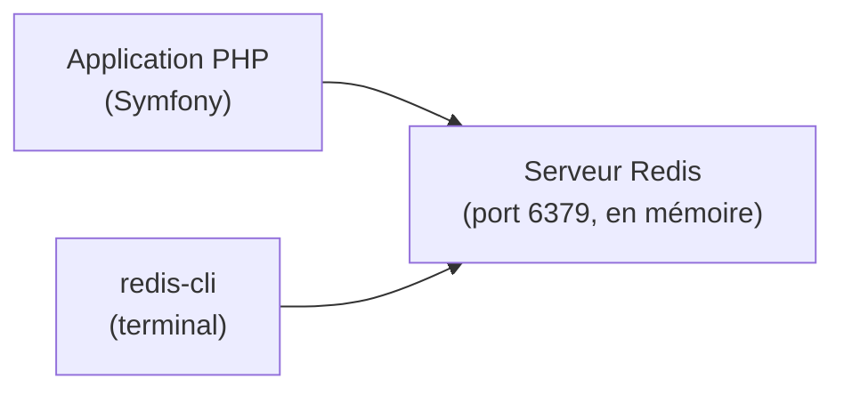

---
tags:
  - Redis
  - Débutant
  - Concept
description: "Comprendre ce qu'est Redis, ses cas d'utilisation et son modèle clé-valeur"
estimated_time: "60 min"
fiche_number: 1
total_fiches: 8
cursus: "Redis et Cache"
---

# 01 - Introduction à Redis

> **En bref** : À la fin de cette fiche, tu comprendras ce qu'est Redis, pourquoi on l'utilise et dans quels cas il complète une base de données relationnelle comme PostgreSQL. Lecture estimée : 60 min.

## Prérequis

- [Cursus Docker](../01-docker/index.md) terminé
- [Cursus PostgreSQL](../04-postgresql/index.md) terminé
- Savoir ce qu'est une base de données relationnelle et le langage SQL

## Contexte de licence Redis (2024) et Valkey

**Ce que tu dois savoir avant de choisir une image Docker.**

En **mars 2024**, Redis Ltd a changé la licence de Redis (auparavant BSD, libre) vers un modèle dual-licence SSPL/RSALv2, non reconnu comme open source par l'OSI. En **mai 2025**, Redis 8 a introduit une troisième option : AGPLv3 (reconnue open source par l'OSI, mais avec des obligations de partage du code source).

En réaction, la **Linux Foundation** a lancé en **avril 2024** le fork **Valkey**, sous licence BSD, avec le soutien d'AWS, Google Cloud, Oracle, Ericsson et d'autres. Valkey est **100 % compatible avec Redis 7.2** : toutes les commandes et tous les clients existants fonctionnent sans modification.

**Conséquences pratiques pour toi** :

- Les grands cloud providers (AWS ElastiCache, Google Memorystore, Azure Cache for Redis) ont basculé vers Valkey par défaut.
- Pour un nouveau projet en self-hosted, l'image recommandée est `valkey/valkey:8-alpine` (BSD, aucune contrainte de licence).
- Pour un projet existant sur Redis 7.x, la migration vers Valkey est transparente (même API).
- Les fiches de ce cursus utilisent l'image `redis:7-alpine` dans les exemples (compatible avec les deux). En production self-hosted, remplace-la par `valkey/valkey:8-alpine`.

**Résumé** :

| Solution | Licence | Compatibilité | Recommandé pour |
| -------- | ------- | ------------- | --------------- |
| `valkey/valkey:8-alpine` | BSD | 100 % Redis 7.2 | Nouveaux projets self-hosted |
| `redis:8-alpine` | AGPLv3 ou commercial | Dernières features | Si tu acceptes AGPLv3 |
| `redis:7-alpine` | RSALv2/SSPL | Référence du cursus | Exemples du cursus uniquement |

---

## Version utilisée dans cette fiche

| Technologie | Version |
| ----------- | ------- |
| Redis | 7.x |
| Docker | 24+ |

## Objectif de cette fiche

À la fin de cette fiche, tu sauras expliquer ce qu'est Redis, décrire ses cas d'utilisation principaux et comprendre la différence entre une base de données en mémoire et une base de données relationnelle.

---

## Concepts

Cette section explique tous les concepts nécessaires. Lis-la entièrement avant de passer aux étapes pratiques.

### Qu'est-ce qu'une base de données en mémoire ?

**Définition** : Une base de données en mémoire (in-memory database) stocke ses données dans la RAM (mémoire vive) de l'ordinateur, au lieu du disque dur. La RAM est beaucoup plus rapide que le disque dur pour lire et écrire des données.

**Le problème que les bases de données en mémoire résolvent** :

Sans base de données en mémoire, voici les problèmes rencontrés :

1. **Lenteur des accès disque** : Lire des données sur un disque dur (même un SSD) prend des millisecondes. Pour des données consultées très fréquemment, ces millisecondes s'accumulent.

2. **Latence des requêtes SQL complexes** : Une requête SQL avec des jointures sur plusieurs tables peut prendre du temps. Si cette même requête est exécutée des centaines de fois par seconde, le serveur de base de données est surchargé.

3. **Goulot d'étranglement** : Quand de nombreux utilisateurs accèdent au même site, la base de données relationnelle devient le point le plus lent de la chaîne.

**Comment les bases de données en mémoire résolvent ces problèmes** :

| Problème | Solution apportée |
| -------- | ----------------- |
| Lenteur des accès disque | Les données sont en RAM, accès en microsecondes |
| Latence des requêtes complexes | Le résultat est pré-calculé et stocké, pas besoin de refaire la requête |
| Goulot d'étranglement | La base de données relationnelle reçoit moins de requêtes |

**Analogie concrète** : Imagine que tu travailles à un bureau. Tes dossiers sont rangés dans une armoire au fond de la pièce (le disque dur). Chaque fois que tu as besoin d'une information, tu dois te lever, aller à l'armoire, chercher le dossier, le ramener à ton bureau, lire l'information, puis ranger le dossier.
Une base de données en mémoire, c'est comme garder les dossiers que tu utilises le plus souvent directement sur ton bureau (la RAM). Tu n'as plus besoin de te lever : l'information est immédiatement accessible.

**Ce qu'une base de données en mémoire n'est PAS** :

- Ce n'est pas un remplacement de la base de données relationnelle. PostgreSQL reste la source de vérité pour tes données. La base en mémoire est un complément.
- Ce n'est pas une solution magique. Si tes données changent constamment, les garder en mémoire ajoute de la complexité (synchronisation entre mémoire et disque).

---

### Qu'est-ce que Redis ?

**Définition** : Redis (Remote Dictionary Server) est une base de données en mémoire de type clé-valeur. Elle stocke des paires clé-valeur dans la RAM du serveur et permet d'y accéder en moins d'une milliseconde.

**Le problème que Redis résout** :

Sans Redis, voici les problèmes rencontrés :

1. **Requêtes répétitives** : Ton application Symfony exécute la même requête SQL des centaines de fois pour afficher une page qui change rarement.

2. **Sessions perdues** : Si ton serveur PHP redémarre, les sessions utilisateur stockées en fichiers locaux sont perdues.

3. **Communication entre processus** : Deux processus PHP différents n'ont pas de moyen simple de partager des données en temps réel.

4. **Files d'attente** : Tu veux envoyer un e-mail après une inscription, mais tu ne veux pas faire attendre l'utilisateur pendant l'envoi.

**Comment Redis résout ces problèmes** :

| Problème | Solution Redis |
| -------- | -------------- |
| Requêtes répétitives | Stocker le résultat en cache avec une clé unique |
| Sessions perdues | Stocker les sessions dans Redis (persistent entre les redémarrages PHP) |
| Communication entre processus | Redis est un serveur partagé accessible par tous les processus |
| Files d'attente | Redis peut servir de transport pour les messages asynchrones |

**Analogie concrète** : Redis est comme un tableau blanc partagé dans un bureau. N'importe quel collègue (processus) peut écrire une information sur le tableau (SET), la lire (GET) ou l'effacer (DEL). L'information est visible instantanément par tout le monde. Mais si tu éteins la lumière et que quelqu'un efface le tableau (coupure de courant), les informations disparaissent - sauf si tu as pris une photo du tableau régulièrement (persistance RDB/AOF).

**Ce que Redis n'est PAS** :

- Redis n'est pas une base de données relationnelle. Il n'y a pas de tables, pas de colonnes, pas de SQL, pas de jointures. Redis stocke des paires clé-valeur.
- Redis n'est pas conçu pour stocker de grandes quantités de données. Toutes les données sont en RAM. La RAM est limitée et coûteuse. Redis est fait pour des données fréquemment lues et de taille raisonnable.

---

### Le modèle clé-valeur

**Définition** : Le modèle clé-valeur est le modèle de données le plus simple possible. Chaque donnée est identifiée par une clé unique (une chaîne de caractères), et cette clé pointe vers une valeur.

**Exemples concrets** :

| Clé | Valeur |
| --- | ------ |
| `user:42:name` | `"Alice"` |
| `user:42:email` | `"alice@example.com"` |
| `page:home:html` | `"<html>...</html>"` |
| `session:abc123` | `{"user_id": 42, "role": "admin"}` |
| `api:weather:paris` | `{"temp": 18, "sky": "cloudy"}` |

**Comment nommer les clés** :

La convention la plus courante utilise le caractère `:` comme séparateur pour organiser les clés de manière hiérarchique :

```text
type:identifiant:champ

Exemples :
user:42:name        → le nom de l'utilisateur 42
product:100:price   → le prix du produit 100
cache:homepage      → le cache de la page d'accueil
session:abc123      → la session identifiée par abc123
```

**Comparaison avec une base relationnelle** :

| Base relationnelle (PostgreSQL) | Clé-valeur (Redis) |
| ------------------------------- | ------------------- |
| Données structurées en tables | Données en paires clé-valeur |
| Requêtes SQL complexes (jointures) | Accès direct par clé |
| Données sur disque | Données en RAM |
| Temps de réponse : millisecondes | Temps de réponse : microsecondes |
| Source de vérité (données durables) | Cache temporaire ou données éphémères |
| Schéma fixe (colonnes définies) | Pas de schéma, structure libre |

---

### Les cas d'utilisation de Redis

**Définition** : Redis est un outil polyvalent. Voici les quatre cas d'utilisation principaux que tu rencontreras dans ce cursus.

#### 1. Cache applicatif

**Le problème** : Ton application Symfony affiche une page qui liste les 50 produits les plus vendus. Cette requête SQL fait une jointure sur 3 tables et prend 200 ms. La page est consultée 1 000 fois par heure, mais les données ne changent que toutes les 10 minutes.

**La solution Redis** : Tu exécutes la requête SQL une seule fois, tu stockes le résultat dans Redis avec une clé comme `cache:top_products` et un TTL (Time To Live) de 10 minutes. Les 999 requêtes suivantes lisent directement depuis Redis en moins de 1 ms.

```text
Sans Redis :
  1 000 requêtes × 200 ms = 200 000 ms de travail pour PostgreSQL

Avec Redis :
  1 requête SQL (200 ms) + 999 lectures Redis (< 1 ms chacune) ≈ 1 200 ms
```

#### 2. Stockage de sessions

**Le problème** : Par défaut, PHP stocke les sessions dans des fichiers sur le disque. Si tu as plusieurs serveurs PHP (load balancing), un utilisateur connecté au serveur A n'a pas de session sur le serveur B.

**La solution Redis** : Toutes les sessions sont stockées dans Redis, accessible par tous les serveurs PHP. L'utilisateur reste connecté quel que soit le serveur qui traite sa requête.

#### 3. Files d'attente (queues)

**Le problème** : Quand un utilisateur s'inscrit, tu veux envoyer un e-mail de bienvenue. Mais l'envoi d'e-mail prend 2 secondes. L'utilisateur attend 2 secondes de plus avant de voir la page de confirmation.

**La solution Redis** : Tu déposes un message dans une file d'attente Redis : "envoyer un e-mail à <user@example.com>". Un worker (processus en arrière-plan) lit ce message et envoie l'e-mail. L'utilisateur voit la page de confirmation immédiatement.

#### 4. Pub/Sub (publication/souscription)

**Le problème** : Tu veux notifier en temps réel tous les utilisateurs connectés quand un nouvel article est publié.

**La solution Redis** : Le serveur publie un message sur un canal Redis. Tous les clients abonnés à ce canal reçoivent le message instantanément.

---

### La persistance des données

**Définition** : Par défaut, Redis stocke tout en RAM. Si Redis s'arrête (crash, redémarrage), toutes les données en RAM disparaissent. Redis propose deux mécanismes pour sauvegarder les données sur disque.

#### RDB (Redis Database Backup)

Redis crée un snapshot (photo instantanée) de toutes les données à intervalles réguliers et le sauvegarde dans un fichier `dump.rdb` sur disque.

**Avantages** :

- Fichier compact, facile à sauvegarder
- Bon pour les sauvegardes périodiques

**Inconvénients** :

- Les données entre deux snapshots sont perdues en cas de crash
- Par défaut, Redis sauvegarde toutes les 60 secondes si au moins 1 000 clés ont changé

#### AOF (Append Only File)

Redis écrit chaque commande d'écriture dans un fichier journal (`appendonly.aof`). En cas de crash, Redis rejoue toutes les commandes du fichier pour retrouver l'état exact.

**Avantages** :

- Perte de données minimale (configurable : chaque seconde ou chaque commande)
- Plus fiable que RDB

**Inconvénients** :

- Fichier plus volumineux que RDB
- Redémarrage plus lent (toutes les commandes sont rejouées)

#### En pratique

| Mode | Perte de données en cas de crash | Taille du fichier | Vitesse de redémarrage |
| ---- | -------------------------------- | ----------------- | ---------------------- |
| Aucune persistance | Toutes les données | Aucun fichier | Instantané (vide) |
| RDB seul | Dernières secondes/minutes | Compact | Rapide |
| AOF seul | Dernière seconde max | Volumineux | Lent |
| RDB + AOF | Dernière seconde max | Les deux fichiers | Rapide (utilise AOF) |

**Pour un cache** : la persistance n'est pas critique. Si Redis redémarre, le cache se reconstruit progressivement.

**Pour des sessions** : l'AOF est recommandé pour éviter de déconnecter tous les utilisateurs.

---

### L'architecture client-serveur de Redis

**Définition** : Redis fonctionne en architecture client-serveur. Le serveur Redis tourne en arrière-plan et écoute les connexions sur un port (par défaut : 6379). Les clients (ton application PHP, le CLI redis-cli) se connectent au serveur pour envoyer des commandes.

**Schéma de fonctionnement** :



**Protocole** : Redis utilise un protocole texte simple appelé RESP (Redis Serialization Protocol). Tu envoies une commande en texte, Redis répond en texte. C'est un protocole simple et efficace.

**Exemple d'échange** :

```text
Client envoie :  SET user:42:name "Alice"
Serveur répond : OK

Client envoie :  GET user:42:name
Serveur répond : "Alice"

Client envoie :  DEL user:42:name
Serveur répond : (integer) 1
```

**Port par défaut** : Redis écoute sur le port **6379**. Dans un environnement Docker, le conteneur Redis expose ce port. Ton application Symfony s'y connecte via une URL comme `redis://redis:6379`.

---

## Étapes Pratiques

### Étape 1 : Vérifier que Docker fonctionne

Avant de travailler avec Redis, vérifie que Docker est installé et fonctionne :

```bash
# Affiche la version de Docker installée
docker --version
```

**Résultat attendu** :

```text
Docker version 24.0.x, build xxxxxxx
```

Si tu obtiens une erreur, revois la fiche Docker d'installation.

---

### Étape 2 : Lancer un conteneur Redis

Lance un conteneur Redis pour tester :

```bash
# Télécharge l'image Redis 7 Alpine (légère) et lance le conteneur
# --name redis-test : donne un nom au conteneur
# -d : lance en arrière-plan (detached)
# -p 6379:6379 : expose le port 6379 du conteneur sur le port 6379 de la machine
docker run --name redis-test -d -p 6379:6379 redis:7-alpine
```

**Résultat attendu** :

```text
Unable to find image 'redis:7-alpine' locally
7-alpine: Pulling from library/redis
...
Status: Downloaded newer image for redis:7-alpine
<identifiant-du-conteneur>
```

---

### Étape 3 : Vérifier que Redis fonctionne

Vérifie que le conteneur est bien en cours d'exécution :

```bash
# Liste les conteneurs en cours d'exécution
docker ps
```

**Résultat attendu** :

```text
CONTAINER ID   IMAGE             COMMAND                  STATUS          PORTS
abc123def456   redis:7-alpine    "docker-entrypoint.s…"   Up 10 seconds   0.0.0.0:6379->6379/tcp
```

---

### Étape 4 : Se connecter à Redis avec redis-cli

Le CLI (Command Line Interface) de Redis est inclus dans l'image Docker. Tu peux l'utiliser directement dans le conteneur :

```bash
# Ouvre un terminal interactif dans le conteneur Redis
# exec : exécute une commande dans un conteneur en cours d'exécution
# -it : mode interactif avec un terminal
# redis-cli : lance le client Redis
docker exec -it redis-test redis-cli
```

**Résultat attendu** :

```text
127.0.0.1:6379>
```

Tu es maintenant connecté à Redis. Le prompt `127.0.0.1:6379>` signifie que tu es connecté au serveur Redis local sur le port 6379.

---

### Étape 5 : Tester les commandes de base

Dans le CLI Redis, teste les commandes suivantes :

```bash
# Vérifie que Redis répond
PING
```

**Résultat attendu** :

```text
PONG
```

```bash
# Stocke une valeur "Bonjour" associée à la clé "message"
SET message "Bonjour"
```

**Résultat attendu** :

```text
OK
```

```bash
# Récupère la valeur associée à la clé "message"
GET message
```

**Résultat attendu** :

```text
"Bonjour"
```

```bash
# Supprime la clé "message"
DEL message
```

**Résultat attendu** :

```text
(integer) 1
```

Le nombre `1` signifie qu'une clé a été supprimée. Si la clé n'existait pas, Redis aurait répondu `0`.

```bash
# Vérifie que la clé n'existe plus
GET message
```

**Résultat attendu** :

```text
(nil)
```

`(nil)` signifie que la clé n'existe pas.

---

### Étape 6 : Tester le TTL (Time To Live)

Le TTL permet de définir une durée de vie pour une clé. Après cette durée, Redis supprime automatiquement la clé.

```bash
# Stocke une valeur avec un TTL de 10 secondes
# EX 10 : la clé expire dans 10 secondes
SET temp "donnee-temporaire" EX 10
```

**Résultat attendu** :

```text
OK
```

```bash
# Vérifie le temps restant avant expiration
TTL temp
```

**Résultat attendu** :

```text
(integer) 8
```

Le nombre affiché est le nombre de secondes restantes avant l'expiration. Attends 10 secondes, puis :

```bash
# Après 10 secondes, la clé a expiré
GET temp
```

**Résultat attendu** :

```text
(nil)
```

La clé a été automatiquement supprimée par Redis après 10 secondes.

---

### Étape 7 : Quitter redis-cli et arrêter le conteneur

```bash
# Quitte redis-cli
QUIT
```

```bash
# Arrête et supprime le conteneur Redis
docker rm -f redis-test
```

**Résultat attendu** :

```text
redis-test
```

---

## Commandes Utiles

| Commande | Action |
| -------- | ------ |
| `PING` | Vérifie que le serveur Redis répond |
| `SET clé valeur` | Stocke une valeur associée à une clé |
| `GET clé` | Récupère la valeur d'une clé |
| `DEL clé` | Supprime une clé |
| `EXISTS clé` | Vérifie si une clé existe (retourne 1 ou 0) |
| `TTL clé` | Affiche le temps restant avant expiration (-1 = pas de TTL, -2 = clé inexistante) |
| `SET clé valeur EX secondes` | Stocke une valeur avec un TTL en secondes |
| `QUIT` | Quitte redis-cli |

---

## Pièges Fréquents

### Piège 1 : Confondre Redis et PostgreSQL

⚠️ **Problème** : Tu essaies de remplacer PostgreSQL par Redis pour stocker toutes tes données.

✅ **Solution** : Redis est un complément, pas un remplacement. PostgreSQL est la source de vérité pour les données durables (utilisateurs, commandes, produits). Redis est utilisé pour les données temporaires (cache, sessions) ou les données qui doivent être lues très rapidement.

```text
PostgreSQL = coffre-fort (données durables, structurées)
Redis      = tableau blanc (données temporaires, rapides)
```

---

### Piège 2 : Oublier que les données sont en RAM

⚠️ **Problème** : Tu stockes des gigaoctets de données dans Redis sans réfléchir. Le serveur manque de mémoire et Redis crash.

✅ **Solution** : Redis utilise la RAM, qui est limitée. Stocke uniquement les données nécessaires et utilise des TTL pour que les données expirent automatiquement. Surveille la mémoire avec la commande `INFO memory`.

---

### Piège 3 : Oublier le TTL sur les clés de cache

⚠️ **Problème** : Tu stockes des résultats de cache sans TTL. Les données ne sont jamais supprimées, même quand elles sont obsolètes. La mémoire se remplit progressivement.

✅ **Solution** : Définis toujours un TTL sur les clés de cache. Une bonne pratique est d'utiliser des TTL adaptés à la fréquence de mise à jour des données :

```text
Données qui changent rarement → TTL de 1 heure (3600 secondes)
Données qui changent souvent  → TTL de 5 minutes (300 secondes)
Sessions utilisateur           → TTL de 30 minutes (1800 secondes)
```

---

### Piège 4 : Ne pas nommer ses clés de manière cohérente

⚠️ **Problème** : Tu utilises des noms de clés incohérents comme `usr42`, `User_42_name`, `user-42`.

✅ **Solution** : Adopte une convention de nommage dès le départ et respecte-la dans tout le projet :

```text
# Convention recommandée : type:identifiant:champ
user:42:name
user:42:email
product:100:price
cache:homepage
session:abc123
```

---

## Checklist de Validation

- [ ] Je sais expliquer ce qu'est Redis en une phrase
- [ ] Je comprends la différence entre une base de données en mémoire et une base relationnelle
- [ ] Je connais les 4 cas d'utilisation principaux de Redis (cache, sessions, queues, pub/sub)
- [ ] Je sais expliquer ce qu'est le modèle clé-valeur
- [ ] Je comprends les deux modes de persistance (RDB et AOF)
- [ ] J'ai lancé un conteneur Redis avec Docker
- [ ] J'ai testé SET, GET, DEL et TTL dans redis-cli
- [ ] Je comprends l'architecture client-serveur de Redis

---

## Exercice Pratique

**Énoncé** : Lance un conteneur Redis et utilise redis-cli pour simuler un mini-cache d'application.

**Indications** :

- Lance un conteneur Redis nommé `redis-exercice`
- Connecte-toi avec redis-cli
- Crée les clés suivantes avec les valeurs indiquées :
  - `cache:page:accueil` → `"<h1>Bienvenue</h1>"` avec un TTL de 60 secondes
  - `cache:page:contact` → `"<h1>Contact</h1>"` avec un TTL de 120 secondes
  - `user:1:name` → `"Alice"` (sans TTL)
  - `user:1:email` → `"alice@example.com"` (sans TTL)
- Vérifie que toutes les clés existent avec `EXISTS`
- Vérifie le TTL des clés de cache
- Supprime les clés utilisateur avec `DEL`
- Quitte redis-cli et supprime le conteneur

**Résultat attendu** : Tu as manipulé des clés avec et sans TTL, vérifié leur existence et nettoyé le conteneur.

---

## Solution de l'Exercice

> **Note** : Cette section contient la solution complète. Essaie d'abord de résoudre l'exercice par toi-même avant de consulter cette solution.

---

```bash
# Lance le conteneur Redis
docker run --name redis-exercice -d -p 6379:6379 redis:7-alpine
```

```bash
# Connecte-toi à redis-cli
docker exec -it redis-exercice redis-cli
```

Dans redis-cli :

```bash
# Crée les clés de cache avec TTL
SET cache:page:accueil "<h1>Bienvenue</h1>" EX 60
SET cache:page:contact "<h1>Contact</h1>" EX 120

# Crée les clés utilisateur sans TTL
SET user:1:name "Alice"
SET user:1:email "alice@example.com"

# Vérifie que toutes les clés existent
EXISTS cache:page:accueil
# (integer) 1
EXISTS cache:page:contact
# (integer) 1
EXISTS user:1:name
# (integer) 1
EXISTS user:1:email
# (integer) 1

# Vérifie le TTL des clés de cache
TTL cache:page:accueil
# (integer) 55  (environ, selon le temps écoulé)
TTL cache:page:contact
# (integer) 115 (environ, selon le temps écoulé)

# Vérifie que les clés utilisateur n'ont pas de TTL
TTL user:1:name
# (integer) -1  (-1 signifie "pas de TTL")

# Supprime les clés utilisateur
DEL user:1:name user:1:email
# (integer) 2  (2 clés supprimées)

# Quitte redis-cli
QUIT
```

```bash
# Supprime le conteneur
docker rm -f redis-exercice
```

---

## Navigation

→ Fiche suivante : **[Installation et CLI redis](02-installation-cli-redis.md)**
