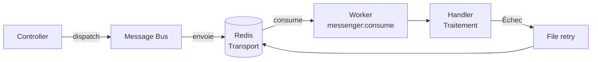

---
tags:
  - Redis
  - Avancé
  - Pratique
description: "Utiliser Redis comme transport pour Symfony Messenger : messages asynchrones, handlers, workers et retry"
estimated_time: "75 min"
fiche_number: 7
total_fiches: 8
cursus: "Redis et Cache"
---

# 07 - Redis comme transport Messenger

> **En bref** : À la fin de cette fiche, tu sauras configurer Symfony Messenger avec Redis comme transport, créer des messages et des handlers, lancer des workers et gérer les messages en erreur. Lecture estimée : 75 min.

## Prérequis

- Fiche [01 - Introduction à Redis](01-introduction-redis.md)
- Fiche [02 - Installation et CLI redis](02-installation-cli-redis.md)
- Cursus Symfony : fiche 13 (services et injection de dépendances)
- Comprendre le concept de file d'attente (fiche 01, section "cas d'utilisation")

## Version utilisée dans cette fiche

| Technologie | Version |
| ----------- | ------- |
| Redis | 7.x |
| Symfony | 7.4 LTS |
| PHP | 8.3 |
| Messenger | 7.4 |

## Objectif de cette fiche

À la fin de cette fiche, tu sauras créer des messages asynchrones avec Symfony Messenger, configurer Redis comme transport, lancer et superviser des workers, et gérer les messages en erreur avec la stratégie de retry.

---

## Concepts

Cette section explique tous les concepts nécessaires. Lis-la entièrement avant de passer aux étapes pratiques.

### Qu'est-ce que Symfony Messenger ?

**Définition** : Symfony Messenger est un composant qui permet d'envoyer des messages à un système de transport (Redis, RabbitMQ, Doctrine, etc.) pour qu'ils soient traités de manière asynchrone par un worker (processus en arrière-plan).

**Le problème que Messenger résout** :

Sans traitement asynchrone, voici les problèmes rencontrés :

1. **Temps de réponse long** : L'utilisateur attend que toutes les tâches soient terminées (envoi d'e-mail, génération de PDF, traitement d'image) avant de voir la page.

2. **Tâches couplées** : Si l'envoi d'un e-mail échoue, toute la requête échoue. L'utilisateur voit une erreur alors que son inscription a bien fonctionné.

3. **Pas de retry** : Si une tâche échoue temporairement (serveur SMTP indisponible), il n'y a pas de mécanisme automatique pour réessayer.

**Comment Messenger résout ces problèmes** :

| Problème | Solution Messenger |
| -------- | ------------------ |
| Temps de réponse long | La tâche est déposée dans une file d'attente, la réponse est immédiate |
| Tâches couplées | L'échec d'une tâche asynchrone ne bloque pas la requête HTTP |
| Pas de retry | Messenger retente automatiquement les messages en erreur |

**Analogie concrète** : Messenger est comme un bureau de poste. Quand tu veux envoyer une lettre, tu ne la portes pas toi-même au destinataire (synchrone). Tu la déposes à la poste (file d'attente), et un facteur (worker) la livre plus tard. Si le destinataire n'est pas chez lui, le facteur repasse le lendemain (retry).

**Ce que Messenger n'est PAS** :

- Ce n'est pas un système de cron. Messenger traite des messages envoyés par l'application, pas des tâches planifiées.
- Ce n'est pas un système temps réel. Le traitement se fait "dès que possible" mais pas instantanément.

---

### Les composants de Messenger

**Les quatre éléments** :

| Composant | Rôle | Exemple |
| --------- | ---- | ------- |
| **Message** | Objet PHP contenant les données | `SendEmailMessage(to: "alice@example.com")` |
| **Handler** | Classe qui traite un message | `SendEmailHandler` envoie l'e-mail |
| **Transport** | Système de file d'attente | Redis, RabbitMQ, Doctrine |
| **Worker** | Processus qui lit les messages et appelle les handlers | `messenger:consume` |

Le diagramme suivant montre le flux asynchrone complet de Symfony Messenger avec Redis.



**Schéma de fonctionnement** :

```text
┌──────────────┐   dispatch   ┌───────────┐   stocke   ┌───────┐
│ Contrôleur    │ ───────────→│ Messenger │ ─────────→│ Redis │
│ (requête HTTP)│              │ (bus)     │            │ (file)│
└──────────────┘              └───────────┘            └───────┘
                                                           │
                                                           │ lit
                                                           ↓
┌──────────────┐   appelle    ┌───────────┐   consume  ┌────────┐
│ Handler       │ ←───────────│ Messenger │ ←─────────│ Worker │
│ (traitement)  │              │ (bus)     │            │ (CLI)  │
└──────────────┘              └───────────┘            └────────┘
```

---

### Pourquoi Redis comme transport ?

**Définition** : Redis peut servir de transport pour Messenger grâce à sa structure List (RPUSH/LPOP) ou Streams. Symfony utilise les Redis Streams par défaut, qui offrent plus de fonctionnalités que les Lists simples.

**Comparaison des transports** :

| Transport | Performance | Fiabilité | Complexité | Usage |
| --------- | ----------- | --------- | ---------- | ----- |
| Redis | Très rapide | Bonne | Faible (déjà installé) | Projets moyens |
| RabbitMQ | Rapide | Excellente | Moyenne (service dédié) | Gros projets |
| Doctrine | Lent | Bonne | Très faible (base existante) | Petits projets |
| Amazon SQS | Variable | Excellente | Moyenne (cloud) | Cloud AWS |

**Quand utiliser Redis comme transport** :

- Tu as déjà Redis pour le cache ou les sessions
- Tu as un volume modéré de messages (moins de 10 000 par minute)
- Tu veux une solution simple sans ajouter un nouveau service (comme RabbitMQ)

---

### Les Redis Streams

**Définition** : Les Redis Streams sont une structure de données spécialement conçue pour les files de messages. Contrairement aux Lists, les Streams conservent l'historique des messages et supportent les groupes de consommateurs.

**Avantages par rapport aux Lists** :

| Critère | List (RPUSH/LPOP) | Stream (XADD/XREADGROUP) |
| ------- | ------------------ | ------------------------ |
| Historique | Le message disparaît après LPOP | Le message est conservé |
| Accusé de réception | Non | Oui (XACK) |
| Groupes de consommateurs | Non | Oui |
| Lecture par plusieurs workers | Chaque message va à un seul worker | Chaque message va à un seul worker du groupe |

Symfony Messenger utilise les Streams par défaut quand Redis est configuré comme transport.

---

### La stratégie de retry

**Définition** : Quand un handler échoue (exception), Messenger peut automatiquement remettre le message dans la file d'attente pour une nouvelle tentative. La stratégie de retry définit combien de fois et à quel intervalle.

**Paramètres de retry** :

| Paramètre | Description | Valeur par défaut |
| --------- | ----------- | ----------------- |
| `max_retries` | Nombre maximum de tentatives | 3 |
| `delay` | Délai avant la première retry (en ms) | 1000 (1 seconde) |
| `multiplier` | Multiplicateur du délai à chaque retry | 2 |
| `max_delay` | Délai maximum entre deux retries (en ms) | 0 (pas de max) |

**Exemple avec les valeurs par défaut** :

```text
Tentative 1 : échoue
  → Attente : 1000 ms (1 seconde)

Tentative 2 : échoue
  → Attente : 2000 ms (2 secondes, delay × multiplier)

Tentative 3 : échoue
  → Attente : 4000 ms (4 secondes, delay × multiplier²)

Tentative 4 (max_retries atteint) : le message est envoyé au transport "failed"
```

---

### Les failed messages

**Définition** : Quand un message dépasse le nombre maximum de retries, il est envoyé dans un transport spécial appelé "failed transport". Ce transport stocke les messages définitivement en échec pour que tu puisses les inspecter et les rejeter ou les retenter manuellement.

**Commandes de gestion** :

| Commande | Action |
| -------- | ------ |
| `messenger:failed:show` | Liste les messages en échec |
| `messenger:failed:retry {id}` | Retente un message spécifique |
| `messenger:failed:retry` | Retente les messages en échec (interactif, un par un) |
| `messenger:failed:remove {id}` | Supprime un message en échec |

---

## Étapes Pratiques

### Étape 1 : Installer Symfony Messenger et le pont Redis

```bash
# Installe le composant Messenger
composer require symfony/messenger

# Pont Redis pour Messenger (fabrique du transport redis://)
# Sans ce paquet, un DSN redis:// est refusé avec :
# "Could not find a transport factory able to handle the configured DSN"
composer require symfony/redis-messenger
```

Le transport Redis de Messenger pilote l'extension PHP native `redis` (phpredis) via les Redis Streams. Il n'accepte **pas** le package pur PHP `predis/predis`. Vérifie que l'extension est installée :

```bash
# Doit afficher "redis"
php -m | grep redis
```

Si la commande ne renvoie rien, installe l'extension (via `pecl install redis` ou le paquet système de ta distribution) avant de continuer.

---

### Étape 2 : Configurer Redis comme transport

```yaml
# config/packages/messenger.yaml
framework:
    messenger:
        # Transport de messages
        transports:
            # Transport principal : Redis
            async:
                dsn: '%env(MESSENGER_TRANSPORT_DSN)%'
                options:
                    # Nom du stream Redis
                    stream: 'symfony_messenger'
                    # Nom du groupe de consommateurs
                    group: 'app'
                    # Nom du consommateur (unique par worker)
                    consumer: 'consumer_1'
                retry_strategy:
                    max_retries: 3
                    delay: 1000       # 1 seconde
                    multiplier: 2     # Délai × 2 à chaque retry
                    max_delay: 60000  # Maximum 60 secondes entre deux retries

            # Transport pour les messages en échec
            failed:
                dsn: '%env(MESSENGER_TRANSPORT_DSN)%'
                options:
                    stream: 'symfony_messenger_failed'

        # Transport utilisé pour les messages en échec
        failure_transport: failed

        # Routage : quel transport pour quel message
        routing:
            # Tous les messages du namespace App\Message\ sont envoyés au transport async
            'App\Message\SendEmailMessage': async
            'App\Message\GeneratePdfMessage': async
            'App\Message\ResizeImageMessage': async
```

Ajoute la variable d'environnement :

```env
# .env
MESSENGER_TRANSPORT_DSN=redis://redis:6379/messages
```

---

### Étape 3 : Créer un message

Un message est un simple objet PHP (POPO - Plain Old PHP Object) qui contient les données nécessaires au traitement :

```php
<?php
// src/Message/SendEmailMessage.php

namespace App\Message;

// Un message est une classe PHP simple sans héritage ni interface
// Il contient uniquement les données nécessaires au handler
class SendEmailMessage
{
    public function __construct(
        // Adresse e-mail du destinataire
        private string $to,
        // Sujet de l'e-mail
        private string $subject,
        // Contenu de l'e-mail
        private string $body,
    ) {
    }

    public function getTo(): string
    {
        return $this->to;
    }

    public function getSubject(): string
    {
        return $this->subject;
    }

    public function getBody(): string
    {
        return $this->body;
    }
}
```

---

### Étape 4 : Créer un handler

Le handler est la classe qui traite le message. Symfony l'associe automatiquement au message grâce au type-hint :

```php
<?php
// src/MessageHandler/SendEmailHandler.php

namespace App\MessageHandler;

use App\Message\SendEmailMessage;
use Symfony\Component\Mailer\MailerInterface;
use Symfony\Component\Messenger\Attribute\AsMessageHandler;
use Symfony\Component\Mime\Email;

// L'attribut #[AsMessageHandler] indique à Symfony que cette classe
// traite les messages de type SendEmailMessage
#[AsMessageHandler]
class SendEmailHandler
{
    public function __construct(
        private MailerInterface $mailer,
    ) {
    }

    // La méthode __invoke est appelée automatiquement par Messenger
    // Le type-hint SendEmailMessage indique quel type de message traiter
    public function __invoke(SendEmailMessage $message): void
    {
        // Crée l'e-mail
        $email = (new Email())
            ->from('noreply@example.com')
            ->to($message->getTo())
            ->subject($message->getSubject())
            ->text($message->getBody());

        // Envoie l'e-mail
        // Si l'envoi échoue (exception), Messenger retente automatiquement
        $this->mailer->send($email);
    }
}
```

---

### Étape 5 : Dispatcher un message depuis un contrôleur

```php
<?php
// src/Controller/RegistrationController.php

namespace App\Controller;

use App\Entity\User;
use App\Form\RegistrationType;
use App\Message\SendEmailMessage;
use Doctrine\ORM\EntityManagerInterface;
use Symfony\Bundle\FrameworkBundle\Controller\AbstractController;
use Symfony\Component\HttpFoundation\Request;
use Symfony\Component\HttpFoundation\Response;
use Symfony\Component\Messenger\MessageBusInterface;
use Symfony\Component\Routing\Attribute\Route;

class RegistrationController extends AbstractController
{
    #[Route('/register', name: 'register')]
    public function register(
        Request $request,
        EntityManagerInterface $em,
        // Le bus de messages est injecté automatiquement
        MessageBusInterface $bus,
    ): Response {
        $user = new User();
        $form = $this->createForm(RegistrationType::class, $user);
        $form->handleRequest($request);

        if ($form->isSubmitted() && $form->isValid()) {
            // 1. Sauvegarde l'utilisateur en base
            $em->persist($user);
            $em->flush();

            // 2. Envoie un message asynchrone pour l'e-mail de bienvenue
            // Le message est déposé dans Redis et traité plus tard par un worker
            // L'utilisateur n'attend PAS l'envoi de l'e-mail
            $bus->dispatch(new SendEmailMessage(
                to: $user->getEmail(),
                subject: 'Bienvenue !',
                body: sprintf('Bonjour %s, bienvenue sur notre site.', $user->getName()),
            ));

            $this->addFlash('success', 'Inscription réussie ! Un e-mail de bienvenue va être envoyé.');

            return $this->redirectToRoute('homepage');
        }

        return $this->render('registration/register.html.twig', [
            'form' => $form,
        ]);
    }
}
```

**Ce qui se passe** :

```text
1. L'utilisateur soumet le formulaire d'inscription
2. Symfony sauvegarde l'utilisateur en base (rapide)
3. Symfony dépose le message SendEmailMessage dans Redis (< 1 ms)
4. L'utilisateur voit "Inscription réussie !" immédiatement
5. Plus tard, un worker lit le message depuis Redis et envoie l'e-mail
```

---

### Étape 6 : Lancer un worker

Le worker est un processus en arrière-plan qui lit les messages depuis Redis et les traite :

```bash
# Lance un worker qui consomme les messages du transport "async"
php bin/console messenger:consume async
```

**Résultat attendu** :

```text
 [OK] Consuming messages from transport "async".

 // The worker will automatically exit once it has been idle for too long.
 // Quit the worker with CONTROL-C.

10:30:15 INFO      [messenger] Received message App\Message\SendEmailMessage
10:30:16 INFO      [messenger] Message App\Message\SendEmailMessage handled by App\MessageHandler\SendEmailHandler
10:30:16 INFO      [messenger] App\Message\SendEmailMessage was handled successfully (acknowledging to transport).
```

**Options du worker** :

```bash
# Lance avec un nombre maximum de messages à traiter
php bin/console messenger:consume async --limit=100

# Lance avec une durée maximale (en secondes)
php bin/console messenger:consume async --time-limit=3600

# Lance avec une limite de mémoire (en Mo)
php bin/console messenger:consume async --memory-limit=128

# Lance en mode verbeux pour voir les détails
php bin/console messenger:consume async -vv
```

---

### Étape 7 : Vérifier les messages dans Redis

Tu peux voir les messages en attente dans Redis avec redis-cli :

```bash
# Connecte-toi à redis-cli
docker compose exec redis redis-cli
```

```bash
# Voir les informations sur le stream
XINFO STREAM symfony_messenger
# length: 0             (nombre de messages en attente)
# first-entry: ...
# last-entry: ...

# Voir les messages en attente dans le stream
XRANGE symfony_messenger - + COUNT 10
# Affiche les 10 premiers messages

# Voir les informations sur le groupe de consommateurs
XINFO GROUPS symfony_messenger
# 1) 1) "name"
#    2) "app"
#    3) "consumers"
#    4) 1
#    5) "pending"
#    6) 0

# Quitte
QUIT
```

---

### Étape 8 : Gérer les messages en échec

Si un handler lève une exception et que le nombre maximum de retries est atteint, le message est envoyé au transport "failed" :

```bash
# Liste les messages en échec
php bin/console messenger:failed:show
```

**Résultat attendu** :

```text
 ----------- -------------------------------- --------------------
  Id          Class                            Failed at
 ----------- -------------------------------- --------------------
  1           App\Message\SendEmailMessage     2025-01-15 10:30:00
 ----------- -------------------------------- --------------------
```

```bash
# Voir les détails d'un message en échec
php bin/console messenger:failed:show 1
```

**Résultat attendu** :

```text
 Class:    App\Message\SendEmailMessage
 Failed:   2025-01-15 10:30:00
 Error:    Connection refused (serveur SMTP indisponible)

 Message:
 App\Message\SendEmailMessage {
   to: "alice@example.com"
   subject: "Bienvenue !"
   body: "Bonjour Alice, bienvenue..."
 }

 Re-run the message? (yes/no) [no]:
```

```bash
# Retente un message spécifique
php bin/console messenger:failed:retry 1

# Retente tous les messages en échec
php bin/console messenger:failed:retry

# Supprime un message en échec (sans le retenter)
php bin/console messenger:failed:remove 1
```

---

### Étape 9 : Créer un deuxième message

Crée un message pour la génération de PDF :

```php
<?php
// src/Message/GeneratePdfMessage.php

namespace App\Message;

class GeneratePdfMessage
{
    public function __construct(
        private int $orderId,
        private string $type, // 'invoice' ou 'receipt'
    ) {
    }

    public function getOrderId(): int
    {
        return $this->orderId;
    }

    public function getType(): string
    {
        return $this->type;
    }
}
```

```php
<?php
// src/MessageHandler/GeneratePdfHandler.php

namespace App\MessageHandler;

use App\Message\GeneratePdfMessage;
use App\Repository\OrderRepository;
use Symfony\Component\Messenger\Attribute\AsMessageHandler;

#[AsMessageHandler]
class GeneratePdfHandler
{
    public function __construct(
        private OrderRepository $orderRepository,
    ) {
    }

    public function __invoke(GeneratePdfMessage $message): void
    {
        $order = $this->orderRepository->find($message->getOrderId());

        if (!$order) {
            // Le message n'a plus de raison d'être traité
            // On ne lève pas d'exception pour éviter les retries inutiles
            return;
        }

        // Génère le PDF (opération lente)
        // ... code de génération de PDF ...

        // Sauvegarde le PDF sur le disque
        // ... code de sauvegarde ...
    }
}
```

---

### Étape 10 : Superviser les workers avec Supervisor

En production, les workers doivent tourner en permanence. Supervisor est un outil qui les surveille et les redémarre en cas de crash :

```text
# /etc/supervisor/conf.d/messenger-worker.conf
# Configuration Supervisor pour les workers Messenger

[program:messenger-consume]
# Commande à exécuter
command=php /var/www/html/bin/console messenger:consume async --time-limit=3600 --memory-limit=128
# Nombre de workers simultanés
numprocs=2
# Chaque worker a un nom unique
process_name=%(program_name)s_%(process_num)02d
# Redémarre automatiquement si le worker s'arrête
autorestart=true
# Attend 10 secondes avant de considérer le worker comme démarré
startsecs=10
# Envoie SIGTERM pour arrêter proprement
stopsignal=SIGTERM
# Attend 20 secondes pour l'arrêt propre avant SIGKILL
stopwaitsecs=20
# Redirection des logs
stdout_logfile=/var/log/messenger-worker.log
stderr_logfile=/var/log/messenger-worker-error.log
# Utilisateur qui exécute le worker
user=www-data
```

**Explication des paramètres** :

| Paramètre | Rôle |
| --------- | ---- |
| `numprocs=2` | Lance 2 workers en parallèle pour traiter plus de messages |
| `autorestart=true` | Si un worker crash, Supervisor le relance automatiquement |
| `--time-limit=3600` | Le worker s'arrête après 1 heure pour libérer la mémoire |
| `--memory-limit=128` | Le worker s'arrête s'il utilise plus de 128 Mo de RAM |
| `stopsignal=SIGTERM` | Arrêt propre : le worker finit le message en cours avant de s'arrêter |

**Commandes Supervisor** :

```bash
# Relit la configuration
supervisorctl reread

# Met à jour les processus
supervisorctl update

# Affiche le statut des workers
supervisorctl status
# messenger-consume:messenger-consume_00   RUNNING   pid 1234, uptime 0:30:00
# messenger-consume:messenger-consume_01   RUNNING   pid 1235, uptime 0:30:00

# Redémarre les workers (après un déploiement)
supervisorctl restart messenger-consume:*

# Arrête les workers
supervisorctl stop messenger-consume:*
```

---

## Commandes Utiles

| Commande | Action |
| -------- | ------ |
| `composer require symfony/messenger symfony/redis-messenger` | Installe Messenger et le pont Redis |
| `php -m \| grep redis` | Vérifie l'extension PHP redis (obligatoire pour le transport) |
| `php bin/console messenger:consume async` | Lance un worker |
| `php bin/console messenger:consume async -vv` | Worker en mode verbeux |
| `php bin/console messenger:consume async --limit=100` | Traite 100 messages puis s'arrête |
| `php bin/console messenger:failed:show` | Liste les messages en échec |
| `php bin/console messenger:failed:retry {id}` | Retente un message |
| `php bin/console messenger:failed:retry 20 --force` | Retente le message d'identifiant 20 sans confirmation |
| `php bin/console messenger:failed:remove {id}` | Supprime un message en échec |
| `php bin/console messenger:stats` | Affiche le nombre de messages par transport |
| `php bin/console debug:messenger` | Affiche les messages et handlers configurés |

---

## Pièges Fréquents

### Piège 1 : Oublier de lancer le worker

⚠️ **Problème** : Tu dispatches des messages mais rien ne se passe. Les messages s'accumulent dans Redis sans être traités.

✅ **Solution** : Un worker doit tourner en permanence pour traiter les messages. En développement, lance-le dans un terminal. En production, utilise Supervisor.

```bash
# En développement : lance dans un terminal dédié
php bin/console messenger:consume async -vv
```

---

### Piège 2 : Passer des entités Doctrine dans le message

⚠️ **Problème** : Tu passes une entité Doctrine entière dans le message. Le message est sérialisé et stocké dans Redis. Au moment de la désérialisation, l'entité n'est plus gérée par Doctrine et des erreurs surviennent.

✅ **Solution** : Passe uniquement les identifiants (scalaires) dans le message. Le handler récupère l'entité depuis la base de données.

```php
// ❌ Passer l'entité entière
$bus->dispatch(new SendEmailMessage($user));

// ✅ Passer uniquement l'identifiant
$bus->dispatch(new SendEmailMessage(
    to: $user->getEmail(),
    subject: 'Bienvenue !',
    body: "Bonjour {$user->getName()}",
));
```

---

### Piège 3 : Ne pas gérer les cas où l'entité n'existe plus

⚠️ **Problème** : Le message contient l'ID d'un article (`articleId: 42`). Entre le moment où le message est créé et le moment où il est traité, l'article a été supprimé. Le handler lève une exception, le message est retenté 3 fois, puis envoyé au transport "failed".

✅ **Solution** : Dans le handler, vérifie toujours que l'entité existe. Si elle n'existe plus, retourne sans lever d'exception.

```php
public function __invoke(GeneratePdfMessage $message): void
{
    $order = $this->orderRepository->find($message->getOrderId());

    if (!$order) {
        // L'entité n'existe plus, on abandonne silencieusement
        // Pas d'exception = pas de retry inutile
        return;
    }

    // ... traitement normal
}
```

---

### Piège 4 : Worker qui consomme trop de mémoire

⚠️ **Problème** : Le worker tourne pendant des heures et consomme de plus en plus de mémoire (fuite mémoire). PHP n'est pas conçu pour des processus longue durée.

✅ **Solution** : Utilise les options `--time-limit` et `--memory-limit` pour que le worker se redémarre régulièrement. Supervisor le relance automatiquement.

```bash
# Le worker s'arrête après 1 heure OU s'il dépasse 128 Mo
php bin/console messenger:consume async --time-limit=3600 --memory-limit=128
```

---

### Piège 5 : Ne pas configurer le transport "failed"

⚠️ **Problème** : Sans transport "failed", les messages qui dépassent le nombre de retries sont perdus définitivement. Tu ne sais pas quels messages ont échoué.

✅ **Solution** : Configure toujours un transport "failed" :

```yaml
framework:
    messenger:
        transports:
            failed:
                dsn: '%env(MESSENGER_TRANSPORT_DSN)%'
                options:
                    stream: 'symfony_messenger_failed'
        failure_transport: failed
```

---

## Checklist de Validation

- [ ] J'ai installé Symfony Messenger et le pont `symfony/redis-messenger`
- [ ] L'extension PHP `redis` (phpredis) est bien chargée (`php -m | grep redis`)
- [ ] J'ai configuré Redis comme transport dans `messenger.yaml`

- [ ] Je sais créer un message (classe PHP simple)
- [ ] Je sais créer un handler (classe avec `__invoke` et `#[AsMessageHandler]`)
- [ ] Je sais dispatcher un message avec `MessageBusInterface`
- [ ] Je sais lancer un worker avec `messenger:consume`
- [ ] Je comprends la stratégie de retry (max_retries, delay, multiplier)
- [ ] Je sais gérer les messages en échec (show, retry, remove)
- [ ] Je sais vérifier les messages dans Redis avec redis-cli
- [ ] Je comprends le rôle de Supervisor en production

---

## Exercice Pratique

**Énoncé** : Crée un système de notification asynchrone complet avec Symfony Messenger et Redis.

**Indications** :

- Crée trois types de messages :
  - `SendEmailNotification` (to, subject, body)
  - `SendSmsNotification` (phone, message)
  - `LogActivityMessage` (userId, action, timestamp)
- Crée un handler pour chaque message
- Configure le routage pour envoyer tous les messages au transport `async`
- Crée un contrôleur qui dispatch les trois messages quand un utilisateur s'inscrit
- Lance un worker et vérifie que les messages sont traités
- Simule une erreur dans le handler SMS (lève une exception) et vérifie :
  - Que le message est retenté 3 fois
  - Qu'il apparaît dans le transport "failed"
  - Que tu peux le retenter manuellement

**Résultat attendu** : Les trois messages sont traités de manière asynchrone. Le message SMS en erreur est correctement géré par la stratégie de retry.

---

## Solution de l'Exercice

> **Note** : Cette section contient la solution complète. Essaie d'abord de résoudre l'exercice par toi-même avant de consulter cette solution.

---

Messages :

```php
<?php
// src/Message/SendEmailNotification.php

namespace App\Message;

class SendEmailNotification
{
    public function __construct(
        private string $to,
        private string $subject,
        private string $body,
    ) {
    }

    public function getTo(): string { return $this->to; }
    public function getSubject(): string { return $this->subject; }
    public function getBody(): string { return $this->body; }
}
```

```php
<?php
// src/Message/SendSmsNotification.php

namespace App\Message;

class SendSmsNotification
{
    public function __construct(
        private string $phone,
        private string $message,
    ) {
    }

    public function getPhone(): string { return $this->phone; }
    public function getMessage(): string { return $this->message; }
}
```

```php
<?php
// src/Message/LogActivityMessage.php

namespace App\Message;

class LogActivityMessage
{
    public function __construct(
        private int $userId,
        private string $action,
        private \DateTimeImmutable $timestamp,
    ) {
    }

    public function getUserId(): int { return $this->userId; }
    public function getAction(): string { return $this->action; }
    public function getTimestamp(): \DateTimeImmutable { return $this->timestamp; }
}
```

Handlers :

```php
<?php
// src/MessageHandler/SendEmailNotificationHandler.php

namespace App\MessageHandler;

use App\Message\SendEmailNotification;
use Psr\Log\LoggerInterface;
use Symfony\Component\Messenger\Attribute\AsMessageHandler;

#[AsMessageHandler]
class SendEmailNotificationHandler
{
    public function __construct(
        private LoggerInterface $logger,
    ) {
    }

    public function __invoke(SendEmailNotification $message): void
    {
        // Simule l'envoi d'un e-mail
        $this->logger->info('E-mail envoyé', [
            'to' => $message->getTo(),
            'subject' => $message->getSubject(),
        ]);
    }
}
```

```php
<?php
// src/MessageHandler/SendSmsNotificationHandler.php

namespace App\MessageHandler;

use App\Message\SendSmsNotification;
use Psr\Log\LoggerInterface;
use Symfony\Component\Messenger\Attribute\AsMessageHandler;

#[AsMessageHandler]
class SendSmsNotificationHandler
{
    public function __construct(
        private LoggerInterface $logger,
    ) {
    }

    public function __invoke(SendSmsNotification $message): void
    {
        // Simule une erreur pour tester le retry
        // En production, ce serait un appel à une API SMS
        throw new \RuntimeException('Service SMS indisponible');
    }
}
```

```php
<?php
// src/MessageHandler/LogActivityHandler.php

namespace App\MessageHandler;

use App\Message\LogActivityMessage;
use Psr\Log\LoggerInterface;
use Symfony\Component\Messenger\Attribute\AsMessageHandler;

#[AsMessageHandler]
class LogActivityHandler
{
    public function __construct(
        private LoggerInterface $logger,
    ) {
    }

    public function __invoke(LogActivityMessage $message): void
    {
        $this->logger->info('Activité enregistrée', [
            'user_id' => $message->getUserId(),
            'action' => $message->getAction(),
            'timestamp' => $message->getTimestamp()->format('Y-m-d H:i:s'),
        ]);
    }
}
```

Configuration :

```yaml
# config/packages/messenger.yaml
framework:
    messenger:
        transports:
            async:
                dsn: '%env(MESSENGER_TRANSPORT_DSN)%'
                retry_strategy:
                    max_retries: 3
                    delay: 1000
                    multiplier: 2
            failed:
                dsn: '%env(MESSENGER_TRANSPORT_DSN)%'
                options:
                    stream: 'symfony_messenger_failed'
        failure_transport: failed
        routing:
            'App\Message\SendEmailNotification': async
            'App\Message\SendSmsNotification': async
            'App\Message\LogActivityMessage': async
```

Contrôleur :

```php
<?php
// src/Controller/RegistrationController.php

namespace App\Controller;

use App\Message\LogActivityMessage;
use App\Message\SendEmailNotification;
use App\Message\SendSmsNotification;
use Symfony\Bundle\FrameworkBundle\Controller\AbstractController;
use Symfony\Component\HttpFoundation\Response;
use Symfony\Component\Messenger\MessageBusInterface;
use Symfony\Component\Routing\Attribute\Route;

class RegistrationController extends AbstractController
{
    #[Route('/test-messenger', name: 'test_messenger')]
    public function testMessenger(MessageBusInterface $bus): Response
    {
        // Dispatch les 3 messages
        $bus->dispatch(new SendEmailNotification(
            to: 'alice@example.com',
            subject: 'Bienvenue !',
            body: 'Bienvenue sur notre site.',
        ));

        $bus->dispatch(new SendSmsNotification(
            phone: '+33612345678',
            message: 'Bienvenue !',
        ));

        $bus->dispatch(new LogActivityMessage(
            userId: 1,
            action: 'registration',
            timestamp: new \DateTimeImmutable(),
        ));

        return new Response('3 messages dispatchés. Vérifie le worker.');
    }
}
```

Test :

```bash
# Visite /test-messenger dans le navigateur

# Lance le worker
php bin/console messenger:consume async -vv

# L'e-mail et le log sont traités avec succès
# Le SMS échoue 3 fois puis va dans le transport "failed"

# Vérifie les messages en échec
php bin/console messenger:failed:show

# Retente le message SMS
php bin/console messenger:failed:retry 1
```

---

## Navigation

← Fiche précédente : **[Stratégies de cache](06-strategies-cache.md)**

→ Fiche suivante : **[Projet intégrateur](08-projet-integrateur.md)**
