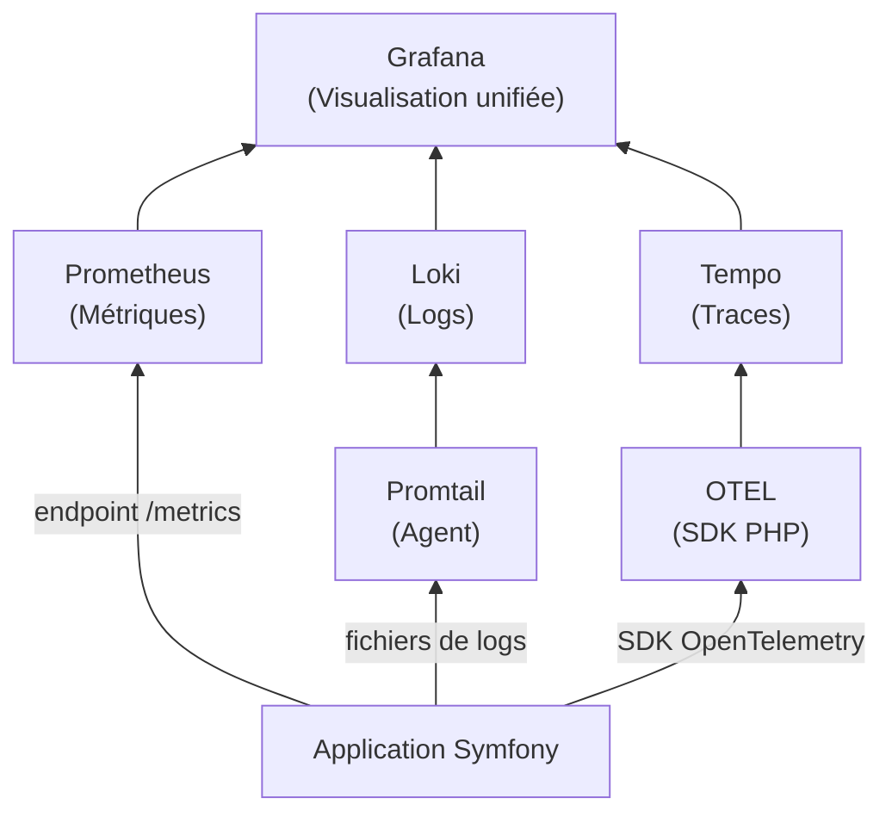

---
tags:
  - Monitoring
  - Débutant
  - Concept
description: "Introduction à l'observabilité : les trois piliers, la différence avec le monitoring classique et la stack Prometheus+Grafana+Loki."
estimated_time: "45 min"
fiche_number: 1
total_fiches: 10
cursus: "Monitoring et Observabilité"
---

# 01 - Introduction à l'observabilité

> **En bref** : À la fin de cette fiche, tu sauras ce qu'est l'observabilité, ses trois piliers (métriques, logs, traces) et pourquoi elle est indispensable en production. Lecture estimée : 45 min.

## Prérequis

- Avoir lu la fiche [01 - Créer un environnement Docker Compose pour Symfony](../01-docker/01-docker-compose-symfony.md) pour connaître les bases de Docker
- Savoir utiliser le terminal (ouvrir un terminal, taper une commande, lire le résultat)
- Aucune connaissance préalable du monitoring n'est requise (tout est expliqué ci-dessous)

## Objectif de cette fiche

À la fin de cette fiche, tu sauras distinguer le monitoring de l'observabilité, nommer les trois piliers de l'observabilité et identifier les outils de la stack que tu utiliseras dans ce cursus.

---

## Concepts

Cette section explique tous les concepts nécessaires. Lis-la entièrement avant de passer aux étapes pratiques.

### Qu'est-ce que le monitoring ?

**Définition** : Le monitoring (supervision) est la pratique de surveiller l'état d'un système informatique en collectant des données à intervalles réguliers. Ces données permettent de savoir si le système fonctionne correctement ou non.

**Le problème que le monitoring résout** :

Sans monitoring, voici les problèmes rencontrés :

1. **Pannes invisibles** : Ton application plante en production et personne ne s'en rend compte pendant des heures. Les utilisateurs voient des erreurs, mais l'équipe technique ne le sait pas.
2. **Diagnostic aveugle** : Quand un problème est signalé, tu n'as aucune donnée pour comprendre ce qui s'est passé. Tu ne sais pas si le serveur manquait de mémoire, si la base de données était lente ou si le réseau était saturé.
3. **Pas d'anticipation** : Tu ne vois pas les tendances. Le disque se remplit progressivement, la mémoire augmente jour après jour, mais tu ne le détectes qu'au moment du crash.

**Comment le monitoring résout ces problèmes** :

| Problème | Solution apportée par le monitoring |
| --- | --- |
| Pannes invisibles | Des alertes automatiques préviennent l'équipe dès qu'un problème survient |
| Diagnostic aveugle | Les métriques historiques montrent l'état du système avant, pendant et après le problème |
| Pas d'anticipation | Les graphiques de tendance permettent de prévoir les problèmes avant qu'ils ne surviennent |

**Analogie concrète** : Le monitoring, c'est comme le tableau de bord d'une voiture. Tu vois la vitesse, le niveau d'essence, la température du moteur et les voyants d'alerte. Sans tableau de bord, tu conduirais à l'aveugle. Tu ne saurais pas que tu es en panne sèche avant de tomber en panne sur le bord de la route.

**Ce que le monitoring n'est PAS** :

- Le monitoring n'est pas un outil unique. C'est une pratique qui utilise plusieurs outils ensemble (collecte, stockage, visualisation, alerting).
- Le monitoring n'est pas optionnel en production. Tout système en production doit être supervisé. Sans monitoring, tu découvres les problèmes après les utilisateurs.

---

### Qu'est-ce que l'observabilité ?

**Définition** : L'observabilité est la capacité à comprendre l'état interne d'un système en examinant ses sorties (métriques, logs, traces). L'observabilité va au-delà du monitoring : elle permet de répondre à des questions imprévues sur le comportement du système.

**Le problème que l'observabilité résout** :

Sans observabilité, voici les problèmes rencontrés :

1. **Questions imprévues** : Le monitoring classique répond à des questions connues ("Le serveur est-il en marche ?"). Mais en production, les problèmes sont souvent inattendus. "Pourquoi les requêtes sont-elles lentes uniquement pour les utilisateurs de Lyon entre 14h et 15h ?" Le monitoring classique ne peut pas répondre à cette question.
2. **Données en silos** : Les métriques sont dans un outil, les logs dans un autre, les traces dans un troisième. Corréler ces données manuellement prend du temps et des erreurs se glissent dans l'analyse.
3. **Systèmes distribués** : Avec les microservices, une requête traverse plusieurs services. Identifier lequel est responsable d'un ralentissement est très difficile sans traces distribuées.

**Comment l'observabilité résout ces problèmes** :

| Problème | Solution apportée par l'observabilité |
| --- | --- |
| Questions imprévues | Les trois piliers combinés permettent d'explorer les données librement pour répondre à n'importe quelle question |
| Données en silos | Les outils d'observabilité corrèlent métriques, logs et traces dans une interface unifiée |
| Systèmes distribués | Les traces distribuées suivent une requête à travers tous les services qu'elle traverse |

**Analogie concrète** : Le monitoring, c'est un thermomètre qui te dit si tu as de la fièvre. L'observabilité, c'est un bilan sanguin complet qui te permet de comprendre pourquoi tu as de la fièvre et d'identifier la cause exacte.

**Ce que l'observabilité n'est PAS** :

- L'observabilité n'est pas un produit à acheter. C'est une propriété de ton système. Un système est observable quand il émet suffisamment de données (métriques, logs, traces) pour permettre de comprendre son comportement interne.
- L'observabilité n'est pas un remplacement du monitoring. L'observabilité inclut le monitoring et l'étend avec des capacités d'exploration et de corrélation.

**Comparaison monitoring vs observabilité** :

| Monitoring | Observabilité |
| --- | --- |
| Répond à des questions connues | Répond à des questions imprévues |
| "Le serveur est-il en marche ?" | "Pourquoi ce type de requête est-il lent ?" |
| Collecte des métriques prédéfinies | Combine métriques, logs et traces |
| Détecte les pannes | Explique les causes des pannes |
| Réactif (alerte quand ça casse) | Proactif (explore pour comprendre) |

---

### Les trois piliers de l'observabilité

**Définition** : Les trois piliers de l'observabilité sont les métriques, les logs et les traces. Chaque pilier apporte un type d'information complémentaire.

**Pilier 1 : Les métriques**

Les métriques sont des valeurs numériques mesurées à intervalles réguliers. Elles répondent à la question "Combien ?" ou "À quel rythme ?".

Exemples de métriques :

- Nombre de requêtes HTTP par seconde
- Temps de réponse moyen (en millisecondes)
- Pourcentage d'utilisation du processeur (CPU)
- Quantité de mémoire utilisée (en Mo)
- Nombre d'erreurs 500 par minute

Les métriques sont stockées sous forme de séries temporelles (une valeur associée à un timestamp). Elles sont légères à stocker et rapides à interroger.

**Pilier 2 : Les logs**

Les logs sont des messages texte émis par une application pour enregistrer des événements. Ils répondent à la question "Que s'est-il passé ?".

Exemples de logs :

- `[2026-03-20 14:32:15] app.INFO: User 42 logged in`
- `[2026-03-20 14:32:16] app.ERROR: Database connection timeout after 30s`
- `[2026-03-20 14:32:17] app.DEBUG: Cache miss for key "product_list"`

Les logs contiennent des informations détaillées mais sont plus coûteux à stocker et à rechercher que les métriques.

**Pilier 3 : Les traces**

Les traces suivent le parcours d'une requête à travers les différents composants d'un système. Elles répondent à la question "Par où est passée cette requête et combien de temps a pris chaque étape ?".

Une trace est composée de spans (segments). Chaque span représente une opération dans un service :

```text
Trace ID: abc123
├── Span 1: API Gateway (2ms)
│   ├── Span 2: Auth Service (5ms)
│   └── Span 3: Product Service (150ms)
│       ├── Span 4: Database Query (120ms)
│       └── Span 5: Cache Lookup (3ms)
```

Dans cet exemple, on voit immédiatement que la requête vers la base de données (120ms) est responsable de la lenteur.

**Complémentarité des trois piliers** :

| Pilier | Question | Exemple | Outil du cursus |
| --- | --- | --- | --- |
| Métriques | "Combien ?" | 150 requêtes/seconde, 2% d'erreurs | Prometheus |
| Logs | "Que s'est-il passé ?" | "Connection refused to database" | Loki |
| Traces | "Par où et combien de temps ?" | La requête a passé 120ms dans la base | Tempo / Jaeger |

---

### Pourquoi observer ses applications ?

**Définition** : Observer ses applications signifie mettre en place les outils et les pratiques nécessaires pour collecter, stocker et analyser les métriques, logs et traces de ses applications en production.

**Les cinq raisons principales** :

1. **Détection rapide des pannes** : Une alerte te prévient en quelques secondes quand l'application ne répond plus ou quand le taux d'erreurs augmente. Sans observabilité, ce sont les utilisateurs qui te préviennent (souvent des heures plus tard).

2. **Diagnostic rapide** : Quand un problème survient, les données d'observabilité permettent de trouver la cause en quelques minutes. Sans ces données, le diagnostic peut prendre des heures ou des jours.

3. **Capacity planning** : Les métriques historiques montrent les tendances. Tu peux prévoir quand tu auras besoin de plus de ressources (CPU, mémoire, stockage) avant de manquer.

4. **Optimisation des performances** : Les traces montrent où le temps est passé dans chaque requête. Tu identifies les goulots d'étranglement (base de données lente, appels réseau inutiles) et tu les corriges.

5. **Conformité et audit** : Les logs structurés fournissent un historique complet des actions (qui a fait quoi, quand). Certaines réglementations (RGPD, PCI-DSS) exigent cette traçabilité.

---

### La stack du cursus : Prometheus + Grafana + Loki

**Définition** : Une stack d'observabilité est un ensemble d'outils complémentaires qui couvrent les trois piliers. Dans ce cursus, tu utiliseras la stack suivante :

| Outil | Rôle | Pilier |
| --- | --- | --- |
| Prometheus | Collecte et stocke les métriques | Métriques |
| Grafana | Visualise les données (dashboards, graphiques) | Visualisation |
| Loki | Collecte et stocke les logs | Logs |
| Promtail | Agent qui envoie les logs vers Loki | Logs (collecte) |
| Tempo / Jaeger | Collecte et stocke les traces | Traces |
| OpenTelemetry | Standard d'instrumentation (métriques, logs, traces) | Les trois piliers |

**Pourquoi cette stack ?** :

1. **Open source** : Tous ces outils sont gratuits et open source. Pas de licence à payer.
2. **Standard de l'industrie** : Cette stack est utilisée par des milliers d'entreprises en production.
3. **Docker-friendly** : Tous ces outils s'installent facilement avec Docker Compose.
4. **Intégrés entre eux** : Grafana sert d'interface unique pour visualiser les métriques (Prometheus), les logs (Loki) et les traces (Tempo).

**Comparaison avec les alternatives** :

| Stack open source (notre choix) | Stack propriétaire |
| --- | --- |
| Prometheus + Grafana + Loki | Datadog, New Relic, Dynatrace |
| Gratuit, auto-hébergé | Payant (souvent cher à grande échelle) |
| Configuration manuelle | Configuration simplifiée |
| Contrôle total des données | Données chez le fournisseur |
| Communauté active | Support commercial |

---

## Étapes Pratiques

### Étape 1 : Visualiser la stack d'observabilité

Avant d'installer quoi que ce soit, comprends l'architecture de la stack que tu vas mettre en place au fil du cursus.

Voici le schéma de la stack complète :



Ce schéma montre que :

- L'application Symfony émet des métriques (endpoint `/metrics`), des logs (fichiers) et des traces (SDK OpenTelemetry)
- Chaque type de données est collecté par un outil dédié
- Grafana centralise la visualisation de toutes les données

---

### Étape 2 : Créer un dossier de travail

Crée un dossier pour les exercices de ce cursus :

```bash
# Crée le dossier de travail pour le cursus monitoring
mkdir -p ~/monitoring-cursus
```

```bash
# Va dans le dossier
cd ~/monitoring-cursus
```

**Résultat attendu** :

```text
# Pas de sortie. Le dossier est créé silencieusement.
```

---

### Étape 3 : Vérifier que Docker est disponible

Tous les outils de ce cursus seront lancés avec Docker Compose. Vérifie que Docker fonctionne :

```bash
# Vérifie que Docker est installé et fonctionne
docker --version
```

**Résultat attendu** :

```text
Docker version 27.x.x, build xxxxxxx
```

```bash
# Vérifie que Docker Compose est disponible
docker compose version
```

**Résultat attendu** :

```text
Docker Compose version v2.x.x
```

Si ces commandes échouent, retourne au cursus Docker (`01-docker/`) pour installer Docker.

---

### Étape 4 : Lancer un premier Prometheus minimal

Pour avoir un aperçu concret, lance un Prometheus minimal avec Docker.

Crée le fichier de configuration Prometheus :

```bash
# Crée le fichier de configuration minimal de Prometheus
cat > ~/monitoring-cursus/prometheus.yml << 'EOF'
# Configuration minimale de Prometheus
# Prometheus se scrape lui-même pour vérifier qu'il fonctionne
global:
  # Intervalle entre chaque collecte de métriques
  scrape_interval: 15s

scrape_configs:
  # Prometheus collecte ses propres métriques
  - job_name: "prometheus"
    static_configs:
      # Adresse de Prometheus lui-même
      - targets: ["localhost:9090"]
EOF
```

Lance Prometheus avec Docker :

```bash
# Lance Prometheus en arrière-plan sur le port 9090
docker run -d \
  --name prometheus-test \
  -p 9090:9090 \
  -v ~/monitoring-cursus/prometheus.yml:/etc/prometheus/prometheus.yml:ro \
  prom/prometheus:v3.13.0
```

**Résultat attendu** :

```text
Unable to find image 'prom/prometheus:v3.13.0' locally
v3.13.0: Pulling from prom/prometheus
...
Status: Downloaded newer image for prom/prometheus:v3.13.0
a1b2c3d4e5f6...
```

Vérifie que Prometheus fonctionne :

```bash
# Interroge l'API de Prometheus pour vérifier qu'il répond
curl -s http://localhost:9090/api/v1/status/config | head -c 200
```

**Résultat attendu** :

```text
{"status":"success","data":{"yaml":"global:\n  scrape_interval: 15s...
```

Le statut `success` confirme que Prometheus fonctionne.

---

### Étape 5 : Explorer l'interface Prometheus

Ouvre ton navigateur et va à l'adresse suivante :

```text
http://localhost:9090
```

Tu verras l'interface web de Prometheus. Elle contient :

- **Expression browser** : un champ de recherche en haut pour taper des requêtes PromQL
- **Graph** : un onglet pour afficher les résultats sous forme de graphique
- **Status > Targets** : la liste des cibles que Prometheus scrape

Va dans **Status > Targets**. Tu verras :

```text
prometheus (1/1 up)
  Endpoint: http://localhost:9090/metrics
  State: UP
  Last Scrape: 5s ago
```

Cela confirme que Prometheus scrape ses propres métriques avec succès.

---

### Étape 6 : Exécuter ta première requête PromQL

Dans le champ **Expression** de l'interface Prometheus, tape :

```promql
up
```

Clique sur **Execute**. Tu verras :

```text
up{instance="localhost:9090", job="prometheus"} 1
```

La métrique `up` vaut `1` quand la cible est accessible, `0` quand elle ne l'est pas. Ici, Prometheus lui-même est accessible (`1`).

Essaie une autre requête :

```promql
prometheus_http_requests_total
```

Cette requête affiche le nombre total de requêtes HTTP reçues par Prometheus, ventilées par code de réponse et handler.

---

### Étape 7 : Nettoyer

Arrête et supprime le conteneur de test :

```bash
# Arrête le conteneur Prometheus
docker stop prometheus-test
```

```bash
# Supprime le conteneur
docker rm prometheus-test
```

**Résultat attendu** :

```text
prometheus-test
```

---

## Commandes Utiles

| Commande | Action |
| --- | --- |
| `docker run -d -p 9090:9090 prom/prometheus` | Lance Prometheus sur le port 9090 |
| `curl http://localhost:9090/api/v1/status/config` | Vérifie la configuration Prometheus |
| `curl http://localhost:9090/metrics` | Affiche les métriques brutes de Prometheus |
| `docker logs prometheus-test` | Affiche les logs du conteneur Prometheus |

---

## Pièges Fréquents

### Piège 1 : Confondre monitoring et observabilité

⚠️ **Problème** : Tu penses que "monitoring" et "observabilité" sont deux mots pour la même chose.

✅ **Solution** : Le monitoring détecte les problèmes connus ("Le serveur est-il en marche ?"). L'observabilité permet de comprendre les problèmes inconnus ("Pourquoi cette requête est-elle lente ?"). L'observabilité inclut le monitoring, mais va plus loin.

---

### Piège 2 : Vouloir tout mesurer dès le début

⚠️ **Problème** : Tu essaies de mettre en place les trois piliers (métriques, logs, traces) en même temps dès le premier jour. Tu te noies dans la complexité.

✅ **Solution** : Commence par les métriques (Prometheus). Ajoute les logs (Loki) ensuite. Les traces viennent en dernier, quand tu as des microservices. Ce cursus suit cette progression.

---

### Piège 3 : Oublier de monter le fichier de configuration Prometheus

⚠️ **Problème** : Tu lances Prometheus sans monter le fichier `prometheus.yml` et Prometheus utilise sa configuration par défaut qui ne scrape rien d'utile.

✅ **Solution** : Utilise toujours l'option `-v` pour monter ton fichier de configuration :

```bash
# Monte le fichier de configuration en lecture seule (:ro)
docker run -d -p 9090:9090 \
  -v ./prometheus.yml:/etc/prometheus/prometheus.yml:ro \
  prom/prometheus:v3.13.0
```

---

## Checklist de Validation

- [ ] Je sais expliquer la différence entre monitoring et observabilité
- [ ] Je connais les trois piliers de l'observabilité (métriques, logs, traces)
- [ ] Je sais quel outil correspond à chaque pilier dans notre stack (Prometheus, Loki, Tempo)
- [ ] J'ai lancé Prometheus avec Docker et vérifié qu'il fonctionne
- [ ] J'ai exécuté ma première requête PromQL (`up`)
- [ ] Je comprends pourquoi l'observabilité est indispensable en production

---

## Exercice Pratique

**Énoncé** : Lance Prometheus avec Docker, explore l'interface web et réponds aux questions suivantes en utilisant les requêtes PromQL.

**Questions** :

1. Combien de cibles Prometheus scrape-t-il ? (indice : requête `up`)
2. Quel est le nombre total de requêtes HTTP reçues par Prometheus ? (indice : `prometheus_http_requests_total`)
3. Depuis combien de temps Prometheus tourne-t-il ? (indice : `prometheus_build_info` ou `process_start_time_seconds`)

**Indications** :

- Lance Prometheus avec le fichier `prometheus.yml` créé à l'étape 4
- Ouvre l'interface web sur `http://localhost:9090`
- Tape chaque requête dans le champ Expression et clique sur Execute
- Utilise l'onglet Table pour voir les valeurs brutes

**Résultat attendu** :

- Tu as les réponses aux trois questions
- Tu sais naviguer dans l'interface Prometheus

---

## Solution de l'Exercice

> **Note** : Cette section contient la solution complète. Essaie d'abord de résoudre l'exercice par toi-même avant de consulter cette solution.

---

**Lance Prometheus** :

```bash
# Lance Prometheus avec le fichier de configuration
docker run -d \
  --name prometheus-exercice \
  -p 9090:9090 \
  -v ~/monitoring-cursus/prometheus.yml:/etc/prometheus/prometheus.yml:ro \
  prom/prometheus:v3.13.0
```

**Question 1 : Combien de cibles ?**

```promql
up
```

**Résultat** :

```text
up{instance="localhost:9090", job="prometheus"} 1
```

Il y a une seule cible (Prometheus lui-même) et elle est accessible (valeur `1`).

**Question 2 : Nombre total de requêtes HTTP ?**

```promql
prometheus_http_requests_total
```

**Résultat** (exemple) :

```text
prometheus_http_requests_total{code="200", handler="/api/v1/query"} 5
prometheus_http_requests_total{code="200", handler="/metrics"} 12
prometheus_http_requests_total{code="200", handler="/"} 2
```

Chaque ligne montre le nombre de requêtes pour un handler et un code de réponse donnés. Le total est la somme de toutes les valeurs.

**Question 3 : Depuis combien de temps Prometheus tourne-t-il ?**

```promql
process_start_time_seconds
```

**Résultat** (exemple) :

```text
process_start_time_seconds{instance="localhost:9090", job="prometheus"} 1.71100000e+09
```

Cette valeur est un timestamp Unix (nombre de secondes depuis le 1er janvier 1970). Pour calculer la durée de fonctionnement, soustrais cette valeur du timestamp actuel. Prometheus fait ce calcul pour toi avec cette requête :

```promql
time() - process_start_time_seconds
```

**Résultat** (exemple) :

```text
{instance="localhost:9090", job="prometheus"} 300
```

La valeur `300` signifie que Prometheus tourne depuis 300 secondes (5 minutes).

**Nettoyage** :

```bash
# Arrête et supprime le conteneur
docker stop prometheus-exercice && docker rm prometheus-exercice
```

---

## Navigation

→ Fiche suivante : **[Logs structurés](02-logs-structures.md)**
