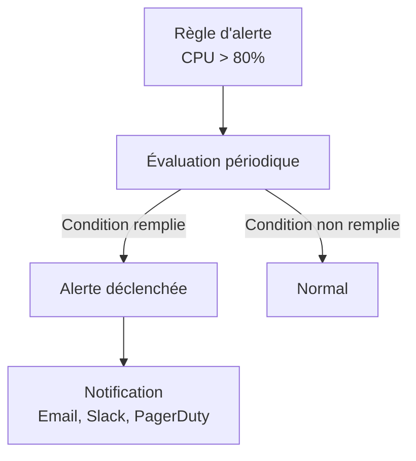

---
tags:
  - Monitoring
  - Avancé
  - Pratique
description: "Grafana - Alerting : configurer des alertes, contact points, notification policies et bonnes pratiques."
estimated_time: "75 min"
fiche_number: 6
total_fiches: 10
cursus: "Monitoring et Observabilité"
---

# 06 - Grafana - Alerting

> **En bref** : À la fin de cette fiche, tu sauras configurer des alertes dans Grafana, définir des contact points (email, webhook), créer des notification policies et appliquer les bonnes pratiques pour éviter la fatigue d'alerte. Lecture estimée : 75 min.

## Prérequis

- Avoir lu la fiche [05 - Grafana - Dashboards](05-grafana-dashboards.md)
- Avoir Grafana et Prometheus fonctionnels dans Docker
- Savoir écrire des requêtes PromQL

## Versions utilisées dans cette fiche

| Technologie | Version |
| --- | --- |
| Grafana | 11.x |
| Prometheus | 2.53.x |

## Objectif de cette fiche

À la fin de cette fiche, tu sauras créer des alertes basées sur des requêtes PromQL, configurer des contact points pour recevoir les notifications, organiser les alertes avec des notification policies et appliquer les bonnes pratiques d'alerting.

---

## Concepts

Cette section explique tous les concepts nécessaires. Lis-la entièrement avant de passer aux étapes pratiques.

### Qu'est-ce que l'alerting ?

**Définition** : L'alerting est le processus de détection automatique de conditions anormales dans un système et de notification des personnes responsables. Une alerte se déclenche quand une métrique dépasse un seuil défini pendant une durée spécifiée.

**Le problème que l'alerting résout** :

Sans alerting, voici les problèmes rencontrés :

1. **Surveillance humaine permanente** : Quelqu'un doit regarder les dashboards en permanence pour détecter les problèmes. En dehors des heures de bureau, personne ne surveille.
2. **Temps de réaction** : Sans notification, les problèmes sont découverts quand les utilisateurs se plaignent. Le temps entre le début du problème et sa détection peut être de plusieurs heures.
3. **Problèmes manqués** : Un pic d'erreurs à 3h du matin passe inaperçu si personne ne consulte le dashboard le lendemain.

**Comment l'alerting résout ces problèmes** :

| Problème | Solution apportée par l'alerting |
| --- | --- |
| Surveillance permanente | Les alertes surveillent 24h/24 automatiquement |
| Temps de réaction | La notification arrive en quelques secondes après le déclenchement |
| Problèmes manqués | Chaque condition anormale déclenche une notification, même la nuit |

**Analogie concrète** : L'alerting, c'est comme un détecteur de fumée dans une maison. Tu n'as pas besoin de surveiller chaque pièce en permanence. Si de la fumée apparaît (condition anormale), le détecteur sonne (alerte). Tu es prévenu immédiatement, même si tu dors.

**Ce que l'alerting n'est PAS** :

- L'alerting n'est pas un remplacement des dashboards. Les dashboards servent à explorer et comprendre. Les alertes servent à prévenir. Les deux sont complémentaires.
- L'alerting n'est pas une solution à tous les problèmes. Une alerte détecte un problème mais ne le résout pas. L'action humaine reste nécessaire.

---

### L'architecture d'alerting Grafana

**Définition** : Le système d'alerting de Grafana repose sur quatre composants qui travaillent ensemble.

Le diagramme suivant montre le pipeline d'alerte Grafana, de la condition au destinataire.



**Les quatre composants** :

```text
┌─────────────────┐     ┌──────────────────┐
│  Alert Rules     │────→│  Alert Instances  │
│  (Conditions)    │     │  (Évaluations)    │
└─────────────────┘     └────────┬───────────┘
                                 │
                                 ▼
                        ┌──────────────────┐
                        │  Notification     │
                        │  Policies         │
                        │  (Routage)        │
                        └────────┬───────────┘
                                 │
                                 ▼
                        ┌──────────────────┐
                        │  Contact Points   │
                        │  (Destinations)   │
                        └──────────────────┘
```

| Composant | Rôle |
| --- | --- |
| **Alert rules** | Conditions à surveiller (requête PromQL + seuil + durée) |
| **Alert instances** | État de chaque évaluation (Normal, Pending, Firing, Resolved) |
| **Notification policies** | Règles de routage : quelle alerte va vers quel contact point |
| **Contact points** | Destinations des notifications (email, Slack, webhook, PagerDuty) |

---

### Les états d'une alerte

**Définition** : Une alerte passe par plusieurs états au cours de son cycle de vie.

| État | Description |
| --- | --- |
| **Normal** | La condition n'est pas remplie. Tout va bien. |
| **Pending** | La condition est remplie mais la durée minimale (for) n'est pas encore atteinte. |
| **Firing** | La condition est remplie depuis suffisamment longtemps. La notification est envoyée. |
| **Resolved** | La condition n'est plus remplie après avoir été en Firing. Une notification de résolution est envoyée. |

**Exemple de cycle** :

```text
14:00 - Normal     (taux d'erreurs = 0.5%, seuil = 5%)
14:15 - Normal     (taux d'erreurs = 1.2%)
14:30 - Pending    (taux d'erreurs = 6.3%, dépasse le seuil, timer "for: 5m" démarre)
14:35 - Firing     (taux d'erreurs = 7.1%, seuil dépassé depuis 5 minutes → notification)
14:45 - Firing     (taux d'erreurs = 5.8%, toujours au-dessus du seuil)
15:00 - Resolved   (taux d'erreurs = 2.1%, redescendu sous le seuil → notification de résolution)
```

La durée `for` (ici 5 minutes) évite les faux positifs. Un pic de quelques secondes ne déclenche pas l'alerte.

---

### La fatigue d'alerte

**Définition** : La fatigue d'alerte (alert fatigue) survient quand une équipe reçoit trop d'alertes, dont beaucoup ne sont pas pertinentes. Les membres de l'équipe commencent à ignorer les alertes, y compris les alertes critiques.

**Le problème que la fatigue d'alerte cause** :

1. **Alertes ignorées** : Quand tu reçois 50 alertes par jour dont 45 sont des faux positifs, tu finis par ne plus regarder les alertes. L'alerte critique est noyée dans le bruit.
2. **Stress** : Recevoir des alertes en permanence, surtout la nuit, génère du stress et de l'épuisement.
3. **Perte de confiance** : L'équipe ne fait plus confiance au système d'alerting et revient à la surveillance manuelle.

**Comment éviter la fatigue d'alerte** :

| Règle | Explication |
| --- | --- |
| Chaque alerte doit être actionnable | Si tu ne peux rien faire quand l'alerte sonne, supprime-la |
| Utilise la durée `for` | 5 minutes minimum pour filtrer les pics transitoires |
| Seuils réalistes | Base tes seuils sur les données historiques, pas sur des valeurs théoriques |
| Peu d'alertes critiques | Réserve les alertes critiques (notification immédiate) aux pannes majeures |
| Regroupe les alertes | Une seule notification pour 10 instances en panne, pas 10 notifications |

---

## Étapes Pratiques

### Étape 1 : Déployer la stack

Réutilise le Docker Compose de la fiche précédente ou crée-en un nouveau :

```bash
# Crée le dossier
mkdir -p ~/monitoring-cursus/grafana-alerting
```

```yaml
# ~/monitoring-cursus/grafana-alerting/docker-compose.yml
services:
  prometheus:
    image: prom/prometheus:v2.53.0
    ports:
      - "9090:9090"
    volumes:
      - ./prometheus.yml:/etc/prometheus/prometheus.yml:ro
      - prometheus-data:/prometheus

  grafana:
    image: grafana/grafana:11.1.0
    ports:
      - "3000:3000"
    volumes:
      - grafana-data:/var/lib/grafana
    environment:
      - GF_SECURITY_ADMIN_USER=admin
      - GF_SECURITY_ADMIN_PASSWORD=admin
      # Active le serveur SMTP intégré pour les tests
      - GF_SMTP_ENABLED=false
      # Unified alerting activé par défaut dans Grafana 11

  node-exporter:
    image: prom/node-exporter:v1.8.1

volumes:
  prometheus-data:
  grafana-data:
```

```yaml
# ~/monitoring-cursus/grafana-alerting/prometheus.yml
global:
  scrape_interval: 15s

scrape_configs:
  - job_name: "prometheus"
    static_configs:
      - targets: ["localhost:9090"]

  - job_name: "node-exporter"
    static_configs:
      - targets: ["node-exporter:9100"]
```

```bash
# Lance la stack
cd ~/monitoring-cursus/grafana-alerting && docker compose up -d
```

---

### Étape 2 : Configurer un contact point webhook

Un contact point webhook est le plus simple à tester sans serveur email.

1. Connecte-toi à Grafana (`http://localhost:3000`, admin/admin)
2. Dans le menu latéral, va dans **Alerting** > **Contact points**
3. Clique sur **Add contact point**
4. Configure :
   - **Name** : `Webhook Test`
   - **Integration** : Webhook
   - **URL** : `https://webhook.site` (tu peux utiliser un service gratuit comme webhook.site pour voir les notifications reçues, ou un endpoint local)

Pour les tests en local, tu peux créer un simple récepteur :

```bash
# Lance un serveur HTTP minimal qui affiche les requêtes reçues
# Ce serveur tourne sur le port 5001
docker run -d --name webhook-receiver -p 5001:80 \
  --network grafana-alerting_default \
  hashicorp/http-echo -text="OK"
```

1. Clique sur **Test** pour envoyer une notification de test
2. Clique sur **Save contact point**

---

### Étape 3 : Créer une alerte - Instance DOWN

Crée une alerte qui se déclenche quand une target Prometheus est inaccessible.

1. Dans le menu **Alerting** > **Alert rules**
2. Clique sur **New alert rule**
3. Configure l'alerte :

**Section 1 - Enter alert rule name** :

- **Name** : `Target Down`

**Section 2 - Define query and alert condition** :

- **Data source** : Prometheus
- **Query A** : Tape la requête PromQL :

```promql
up == 0
```

- **Condition** : `IS ABOVE 0`

Cette requête retourne les targets dont la métrique `up` vaut 0 (inaccessible).

**Section 3 - Set evaluation behavior** :

- **Folder** : `Infrastructure` (crée-le si nécessaire)
- **Evaluation group** : `targets` (crée-le si nécessaire)
- **Evaluate every** : `1m` (évalue toutes les minutes)
- **For** : `2m` (déclenche l'alerte si la condition dure depuis 2 minutes)

**Section 4 - Configure labels and notifications** :

- Ajoute un label :
  - **Key** : `severity`
  - **Value** : `critical`

**Section 5 - Add annotations** :

- **Summary** : `La target {{ $labels.instance }} (job={{ $labels.job }}) est inaccessible`
- **Description** : `La target {{ $labels.instance }} ne répond plus depuis plus de 2 minutes.`

1. Clique sur **Save rule and exit**

---

### Étape 4 : Créer une alerte - Mémoire haute

1. Crée une nouvelle alert rule
2. Configure :

- **Name** : `High Memory Usage`
- **Query** :

```promql
(1 - (node_memory_MemAvailable_bytes / node_memory_MemTotal_bytes)) * 100
```

- **Condition** : `IS ABOVE 85`
- **Evaluate every** : `1m`
- **For** : `5m`
- **Label** : `severity` = `warning`
- **Summary** : `Utilisation mémoire élevée : {{ $value }}% sur {{ $labels.instance }}`

1. Sauvegarde la règle

---

### Étape 5 : Créer une alerte - Taux d'erreurs HTTP

1. Crée une nouvelle alert rule
2. Configure :

- **Name** : `High Error Rate`
- **Query A** (nombre total de requêtes) :

```promql
sum(rate(prometheus_http_requests_total[5m]))
```

- **Query B** (requêtes en erreur seulement) :

```promql
sum(rate(prometheus_http_requests_total{code=~"5.."}[5m]))
```

- **Query C** (expression mathématique) : utilise la fonctionnalité **Math** de Grafana :

```text
$B / $A * 100
```

- **Condition** : `C IS ABOVE 5` (plus de 5% d'erreurs)
- **Evaluate every** : `1m`
- **For** : `5m`
- **Label** : `severity` = `critical`
- **Summary** : `Taux d'erreurs HTTP élevé : {{ $value }}%`

1. Sauvegarde la règle

---

### Étape 6 : Configurer une notification policy

Les notification policies définissent comment les alertes sont routées vers les contact points.

1. Va dans **Alerting** > **Notification policies**
2. Tu verras la **Default policy** qui envoie toutes les alertes vers le contact point par défaut
3. Clique sur **New nested policy** pour créer une règle de routage :

**Policy pour les alertes critiques** :

- **Matching labels** : `severity` = `critical`
- **Contact point** : `Webhook Test`
- **Group by** : `alertname` (regroupe les alertes du même type)
- **Group wait** : `30s` (attend 30 secondes avant d'envoyer la première notification du groupe)
- **Group interval** : `5m` (attend 5 minutes entre deux notifications pour le même groupe)
- **Repeat interval** : `4h` (renvoie la notification toutes les 4 heures si l'alerte persiste)

1. Sauvegarde la policy

---

### Étape 7 : Configurer un silence

Les silences permettent de désactiver temporairement des alertes (pendant une maintenance planifiée par exemple).

1. Va dans **Alerting** > **Silences**
2. Clique sur **New silence**
3. Configure :
   - **Start** : maintenant
   - **End** : dans 2 heures
   - **Matchers** : `severity` = `warning` (silence toutes les alertes de sévérité warning)
   - **Comment** : `Maintenance planifiée - mise à jour Node Exporter`

4. Clique sur **Submit**

Pendant les 2 prochaines heures, les alertes avec le label `severity=warning` ne déclencheront pas de notification.

---

### Étape 8 : Tester une alerte

Pour tester l'alerte "Target Down", arrête Node Exporter :

```bash
# Arrête Node Exporter pour simuler une panne
cd ~/monitoring-cursus/grafana-alerting && docker compose stop node-exporter
```

Observe l'évolution de l'alerte dans **Alerting** > **Alert rules** :

1. Après ~1 minute : l'alerte passe en **Pending** (la condition est remplie mais le timer `for: 2m` n'est pas écoulé)
2. Après ~3 minutes : l'alerte passe en **Firing** (la condition dure depuis plus de 2 minutes)
3. La notification est envoyée au contact point

Redémarre Node Exporter :

```bash
# Redémarre Node Exporter
cd ~/monitoring-cursus/grafana-alerting && docker compose start node-exporter
```

Après ~1 minute, l'alerte passe en **Resolved** et une notification de résolution est envoyée.

---

### Étape 9 : Nettoyer

```bash
# Arrête les conteneurs (conserve les volumes)
cd ~/monitoring-cursus/grafana-alerting && docker compose down
docker rm -f webhook-receiver 2>/dev/null
```

> **Note** : `docker compose down` sans `-v` conserve les volumes Docker. Pour un environnement pédagogique temporaire dont tu veux tout supprimer, tu peux ajouter `-v` : `docker compose down -v`. Attention : cela supprime définitivement les alertes et configurations Grafana stockées dans les volumes.

---

## Commandes Utiles

| Commande | Action |
| --- | --- |
| `curl -u admin:admin http://localhost:3000/api/v1/provisioning/alert-rules` | Liste les alertes via l'API Grafana (auth requise) |
| `curl -u admin:admin http://localhost:3000/api/alertmanager/grafana/api/v2/alerts` | Liste les alertes actives (auth requise) |
| `docker compose stop <service>` | Arrête un service pour tester une alerte |
| `docker compose start <service>` | Redémarre un service |

---

## Pièges Fréquents

### Piège 1 : Alertes sans durée for

⚠️ **Problème** : Tu crées une alerte sans durée `for`. L'alerte se déclenche à chaque pic transitoire (durée de quelques secondes). Tu reçois des dizaines de notifications par jour.

✅ **Solution** : Configure toujours une durée `for` de 2 à 5 minutes minimum. Cela filtre les pics courts :

```text
# ❌ Mauvais : se déclenche au moindre pic
For: 0s

# ✅ Bon : attend 5 minutes de condition remplie
For: 5m
```

---

### Piège 2 : Trop d'alertes

⚠️ **Problème** : Tu crées une alerte pour chaque métrique. L'équipe reçoit 30 notifications par jour. Personne ne les lit.

✅ **Solution** : Limite-toi aux alertes essentielles. Une bonne règle : chaque alerte doit nécessiter une action humaine. Si l'alerte ne nécessite pas d'action, c'est une information de dashboard, pas une alerte.

Alertes essentielles :

- Service inaccessible (target down)
- Taux d'erreurs supérieur à 5%
- Disque plein à plus de 90%
- Mémoire saturée

Pas des alertes (mets-les en dashboard) :

- CPU à 60% (normal en charge)
- Temps de réponse à 200ms (normal)
- Nombre de requêtes par seconde (informatif)

---

### Piège 3 : Notification policy par défaut non configurée

⚠️ **Problème** : Tu crées des alert rules mais tu ne reçois aucune notification. La default notification policy pointe vers le contact point "grafana-default-email" qui n'est pas configuré.

✅ **Solution** : Configure un contact point fonctionnel et assigne-le à la default notification policy. Ou crée des nested policies avec des matchers explicites.

---

## Checklist de Validation

- [ ] J'ai configuré un contact point (webhook ou email)
- [ ] J'ai créé au moins 2 alert rules avec des requêtes PromQL
- [ ] J'ai configuré une notification policy avec routage par labels
- [ ] J'ai testé une alerte en arrêtant un service
- [ ] J'ai vu le cycle Normal → Pending → Firing → Resolved
- [ ] J'ai créé un silence pour une maintenance
- [ ] Je comprends le concept de fatigue d'alerte et comment l'éviter

---

## Exercice Pratique

**Énoncé** : Mets en place un système d'alerting complet pour une stack Prometheus + Node Exporter. Crée les alertes suivantes :

1. **Target Down** : une target est inaccessible depuis 2 minutes (severity: critical)
2. **High Memory** : mémoire utilisée > 85% depuis 5 minutes (severity: warning)
3. **High CPU** : CPU > 80% depuis 5 minutes (severity: warning)
4. **Disk Almost Full** : disque utilisé > 90% depuis 10 minutes (severity: critical)

Configure :

- Un contact point webhook
- Une notification policy qui route les alertes `critical` vers le webhook et attend 5 minutes entre les rappels
- Un silence de 1 heure pour les alertes `warning`

Teste en arrêtant Node Exporter.

**Indications** :

- Le CPU en pourcentage : `100 - (avg(rate(node_cpu_seconds_total{mode="idle"}[5m])) * 100)`
- Le disque en pourcentage : `100 - (node_filesystem_avail_bytes{mountpoint="/"} / node_filesystem_size_bytes{mountpoint="/"} * 100)`
- Utilise le label `severity` pour router les alertes

**Résultat attendu** :

- Les 4 alertes sont créées et en état Normal
- L'alerte Target Down passe en Firing quand tu arrêtes Node Exporter
- La notification est envoyée au webhook

---

## Solution de l'Exercice

> **Note** : Cette section contient la solution complète. Essaie d'abord de résoudre l'exercice par toi-même avant de consulter cette solution.

---

**Alert Rule 1 - Target Down** :

- Query : `up == 0`
- Condition : IS ABOVE 0
- Evaluate every : 1m
- For : 2m
- Label : severity = critical
- Summary : `Target {{ $labels.instance }} ({{ $labels.job }}) is DOWN`

**Alert Rule 2 - High Memory** :

- Query : `(1 - (node_memory_MemAvailable_bytes / node_memory_MemTotal_bytes)) * 100`
- Condition : IS ABOVE 85
- Evaluate every : 1m
- For : 5m
- Label : severity = warning
- Summary : `Memory usage is {{ $value }}% on {{ $labels.instance }}`

**Alert Rule 3 - High CPU** :

- Query : `100 - (avg by (instance) (rate(node_cpu_seconds_total{mode="idle"}[5m])) * 100)`
- Condition : IS ABOVE 80
- Evaluate every : 1m
- For : 5m
- Label : severity = warning
- Summary : `CPU usage is {{ $value }}% on {{ $labels.instance }}`

**Alert Rule 4 - Disk Almost Full** :

- Query : `100 - (node_filesystem_avail_bytes{mountpoint="/"} / node_filesystem_size_bytes{mountpoint="/"} * 100)`
- Condition : IS ABOVE 90
- Evaluate every : 1m
- For : 10m
- Label : severity = critical
- Summary : `Disk usage is {{ $value }}% on {{ $labels.instance }}`

**Contact point** :

- Name : Webhook Alerting
- Type : Webhook
- URL : <http://webhook-receiver:80> (ou toute URL de test)

**Notification policy** :

- Nested policy : severity = critical → contact point Webhook Alerting
- Group wait : 30s
- Group interval : 5m
- Repeat interval : 4h

**Silence** :

- Duration : 1h
- Matcher : severity = warning
- Comment : Test silence for warning alerts

**Test** :

```bash
# Arrête Node Exporter pour déclencher l'alerte
cd ~/monitoring-cursus/grafana-alerting && docker compose stop node-exporter
```

Après 3 minutes, l'alerte "Target Down" passe en Firing.

```bash
# Redémarre Node Exporter
cd ~/monitoring-cursus/grafana-alerting && docker compose start node-exporter
```

L'alerte passe en Resolved.

---

## Navigation

← Fiche précédente : **[Grafana - Dashboards](05-grafana-dashboards.md)**

→ Fiche suivante : **[Logs avec Loki](07-logs-loki.md)**
