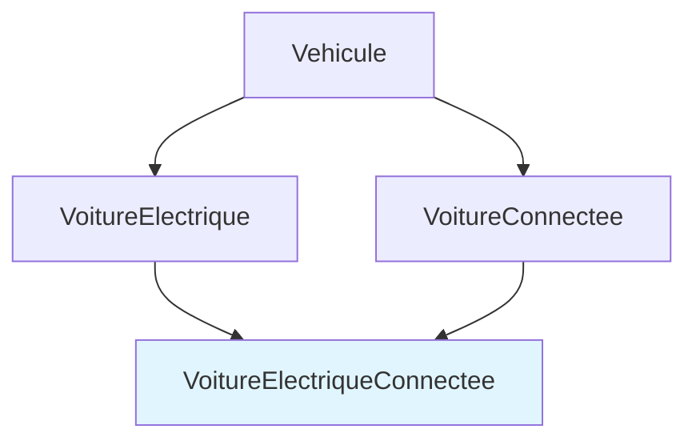

---
tags:
  - Python
  - Intermédiaire
  - Concept
description: "Maîtriser la POO avancée en Python : héritage multiple, propriétés, décorateurs de classe, classes abstraites et encapsulation."
estimated_time: "90 min"
fiche_number: 8
total_fiches: 12
cursus: "Python fondamentaux"
---

# 08 - POO avancée

> **En bref** : Approfondir la programmation orientée objet avec l'héritage multiple, les propriétés (`@property`), les méthodes de classe et statiques, les classes abstraites (ABC) et l'encapsulation en Python. Lecture estimée : 90 min.

## Prérequis

- Fiche 07 : [Programmation orientée objet](07-poo-python.md)

## Objectif de cette fiche

À la fin de cette fiche, tu sauras utiliser `@property` pour contrôler l'accès aux attributs, créer des classes abstraites avec ABC, implémenter l'héritage multiple, et utiliser `@classmethod` et `@staticmethod` pour organiser tes classes.

---

## Concepts

### L'héritage multiple

**Définition** : L'héritage multiple permet à une classe d'hériter de plusieurs classes parentes en même temps. Python utilise un algorithme appelé MRO (Method Resolution Order) pour déterminer dans quel ordre les classes parentes sont consultées quand une méthode est appelée.

**Le problème que l'héritage multiple résout** :

Sans héritage multiple, voici les problèmes rencontrés :

1. **Combinaison impossible** : une classe `VoitureElectriqueConnectee` doit hériter à la fois de `VoitureElectrique` et de `VoitureConnectee`. Avec un héritage simple, c'est impossible.
2. **Duplication de code** : sans héritage multiple, on duplique les méthodes communes dans chaque classe.

**Comment l'héritage multiple résout ces problèmes** :

| Problème | Solution apportée par l'héritage multiple |
| -------- | ----------------------------------------- |
| Combinaison impossible | Une classe enfant peut hériter de plusieurs parents |
| Duplication de code | Les mixins encapsulent des comportements réutilisables |

**Analogie concrète** : L'héritage multiple est comme un enfant qui hérite de traits de ses deux parents. Il peut avoir les yeux de sa mère et la taille de son père. De la même façon, une classe peut combiner les comportements de plusieurs parents.

**Ce que l'héritage multiple n'est PAS** :

- L'héritage multiple n'est pas toujours la bonne solution. Il peut rendre le code complexe et difficile à comprendre. On privilégie souvent la composition (avoir un objet comme attribut) ou les mixins (petites classes à responsabilité unique).

---



---

### Les propriétés (`@property`)

**Définition** : Le décorateur `@property` transforme une méthode en attribut accessible sans parenthèses. Il permet de contrôler la lecture, l'écriture et la suppression d'un attribut tout en gardant une syntaxe simple (`objet.attribut` au lieu de `objet.get_attribut()`).

**Le problème que les propriétés résolvent** :

Sans propriétés, voici les problèmes rencontrés :

1. **Pas de validation** : on peut assigner n'importe quelle valeur à un attribut, même une valeur invalide (un âge négatif, un email sans @).
2. **Syntaxe lourde** : les getters et setters explicites (`get_nom()`, `set_nom()`) alourdissent le code.
3. **Changement d'interface** : si on décide plus tard d'ajouter de la validation sur un attribut, il faut modifier tous les endroits qui y accèdent.

**Comment les propriétés résolvent ces problèmes** :

| Problème | Solution apportée par `@property` |
| -------- | --------------------------------- |
| Pas de validation | Le setter valide la valeur avant de l'assigner |
| Syntaxe lourde | Syntaxe identique à un accès direct : `objet.attribut` |
| Changement d'interface | On peut ajouter de la logique sans changer l'API |

**Analogie concrète** : Une propriété est comme un guichet de banque. De l'extérieur, tu déposes et retires de l'argent simplement (lecture et écriture de l'attribut). Mais derrière le guichet, un employé vérifie ton identité et le solde de ton compte (la logique de validation). Le client n'a pas besoin de connaître les vérifications internes.

---

### Les méthodes de classe et statiques

**Définition** : Python offre trois types de méthodes dans une classe :

- **Méthode d'instance** : accède à l'objet via `self`. C'est le type par défaut.
- **Méthode de classe** (`@classmethod`) : accède à la classe via `cls` au lieu de l'instance. Utile pour les "factory methods" (créer des objets de différentes façons).
- **Méthode statique** (`@staticmethod`) : n'accède ni à l'instance ni à la classe. C'est une fonction utilitaire logiquement liée à la classe.

**Comparaison des trois types** :

| Type | Décorateur | Premier paramètre | Accès à l'instance | Accès à la classe |
| ---- | ---------- | ------------------ | ------------------- | ------------------ |
| Instance | (aucun) | `self` | Oui | Via `self.__class__` |
| Classe | `@classmethod` | `cls` | Non | Oui |
| Statique | `@staticmethod` | (aucun) | Non | Non |

---

### Les classes abstraites (ABC)

**Définition** : Une classe abstraite est une classe qui ne peut pas être instanciée directement. Elle sert de modèle pour ses sous-classes en définissant des méthodes abstraites que chaque sous-classe doit obligatoirement implémenter. En Python, on utilise le module `abc` (Abstract Base Classes).

**Le problème que les classes abstraites résolvent** :

Sans classes abstraites, voici les problèmes rencontrés :

1. **Contrat non garanti** : rien n'oblige les sous-classes à implémenter certaines méthodes. On découvre l'oubli seulement à l'exécution.
2. **Instanciation accidentelle** : on peut créer une instance de la classe de base, alors qu'elle n'est pas censée être utilisée directement.

**Comment les classes abstraites résolvent ces problèmes** :

| Problème | Solution apportée par ABC |
| -------- | ------------------------- |
| Contrat non garanti | Python lève une `TypeError` si une méthode abstraite n'est pas implémentée |
| Instanciation accidentelle | Python interdit l'instanciation d'une classe abstraite |

**Analogie concrète** : Une classe abstraite est comme un formulaire vierge avec des champs obligatoires. Le formulaire (classe abstraite) définit quels champs doivent être remplis (méthodes abstraites). Chaque personne (sous-classe) remplit les champs avec ses propres informations. Mais le formulaire vierge lui-même ne peut pas être soumis.

**Ce qu'une classe abstraite n'est PAS** :

- Une classe abstraite n'est pas une interface (comme en Java). En Python, une classe abstraite peut contenir à la fois des méthodes abstraites et des méthodes concrètes (avec implémentation).

---

### L'encapsulation

**Définition** : L'encapsulation consiste à protéger les attributs internes d'un objet pour empêcher leur modification directe depuis l'extérieur. En Python, il n'y a pas de véritable attribut privé, mais des conventions :

- `_attribut` (un underscore) : attribut "protégé" - convention pour signaler qu'il ne devrait pas être accédé directement depuis l'extérieur.
- `__attribut` (deux underscores) : attribut "name-mangled" - Python renomme l'attribut en `_NomClasse__attribut` pour éviter les conflits dans l'héritage.

**Le problème que l'encapsulation résout** :

Sans encapsulation, n'importe quel code peut modifier les attributs internes d'un objet, ce qui peut le mettre dans un état incohérent (un solde bancaire négatif sans autorisation, une date de naissance dans le futur).

**Comparaison des niveaux d'accès** :

| Convention | Syntaxe | Accès externe | Utilité |
| ---------- | ------- | ------------- | ------- |
| Public | `self.attribut` | Libre | Données destinées à être lues et modifiées |
| Protégé | `self._attribut` | Déconseillé (convention) | Détail d'implémentation interne |
| Name-mangled | `self.__attribut` | `objet._Classe__attribut` | Éviter les conflits en héritage |

---

## Étapes Pratiques

### Étape 1 : Utiliser `@property` pour contrôler l'accès aux attributs

```python
class Personne:
    def __init__(self, nom, age):
        self.nom = nom  # Attribut public classique
        self.age = age  # Passe par le setter grâce à @property

    @property
    def age(self):
        """Getter : retourne l'âge."""
        return self._age

    @age.setter
    def age(self, valeur):
        """Setter : valide l'âge avant de l'assigner."""
        if not isinstance(valeur, int):
            raise TypeError("L'âge doit être un entier.")
        if valeur < 0 or valeur > 150:
            raise ValueError("L'âge doit être entre 0 et 150.")
        self._age = valeur  # Stocké dans _age (convention protégé)

    @property
    def est_majeur(self):
        """Propriété calculée (lecture seule, pas de setter)."""
        return self._age >= 18


# Utilisation : syntaxe identique à un attribut classique
alice = Personne("Alice", 25)
print(f"{alice.nom}, {alice.age} ans, majeur : {alice.est_majeur}")

# Le setter valide automatiquement
alice.age = 30
print(f"Nouvel âge : {alice.age}")

# Test de validation
try:
    alice.age = -5
except ValueError as e:
    print(f"Erreur attendue : {e}")

try:
    alice.age = "vingt"
except TypeError as e:
    print(f"Erreur attendue : {e}")
```

**Résultat attendu** :

```text
Alice, 25 ans, majeur : True
Nouvel âge : 30
Erreur attendue : L'âge doit être entre 0 et 150.
Erreur attendue : L'âge doit être un entier.
```

---

### Étape 2 : Créer une classe abstraite avec ABC

```python
from abc import ABC, abstractmethod


class Forme(ABC):
    """Classe abstraite définissant le contrat pour toutes les formes."""

    @abstractmethod
    def aire(self):
        """Retourne l'aire de la forme."""
        pass

    @abstractmethod
    def perimetre(self):
        """Retourne le périmètre de la forme."""
        pass

    def description(self):
        """Méthode concrète : disponible pour toutes les sous-classes."""
        return f"{self.__class__.__name__} - Aire : {self.aire():.2f}, Périmètre : {self.perimetre():.2f}"


# On ne peut PAS instancier une classe abstraite
try:
    f = Forme()
except TypeError as e:
    print(f"Erreur attendue : {e}")


class Carre(Forme):
    """Un carré implémente toutes les méthodes abstraites."""

    def __init__(self, cote):
        self.cote = cote

    def aire(self):
        return self.cote ** 2

    def perimetre(self):
        return 4 * self.cote


carre = Carre(5)
print(carre.description())
print(f"Aire : {carre.aire()}")
print(f"Périmètre : {carre.perimetre()}")
```

**Résultat attendu** :

```text
Erreur attendue : Can't instantiate abstract class Forme without an implementation for abstract methods 'aire', 'perimetre'
Carre - Aire : 25.00, Périmètre : 20.00
Aire : 25
Périmètre : 20
```

---

### Étape 3 : Implémenter l'héritage multiple avec des mixins

Un mixin est une petite classe qui ajoute un comportement spécifique sans être un parent "principal".

```python
class LogMixin:
    """Mixin qui ajoute des capacités de journalisation."""

    def log(self, message):
        print(f"[LOG {self.__class__.__name__}] {message}")


class SerializableMixin:
    """Mixin qui ajoute la sérialisation en dictionnaire."""

    def to_dict(self):
        return {
            cle: valeur
            for cle, valeur in self.__dict__.items()
            if not cle.startswith("_")
        }


class Utilisateur(LogMixin, SerializableMixin):
    """Utilisateur qui hérite de deux mixins."""

    def __init__(self, nom, email):
        self.nom = nom
        self.email = email

    def se_connecter(self):
        self.log(f"{self.nom} s'est connecté")


# Utilisation
user = Utilisateur("Alice", "alice@exemple.fr")
user.se_connecter()
print(user.to_dict())

# Vérifier le MRO (Method Resolution Order)
print(f"\nMRO : {[c.__name__ for c in Utilisateur.__mro__]}")
```

**Résultat attendu** :

```text
[LOG Utilisateur] Alice s'est connecté
{'nom': 'Alice', 'email': 'alice@exemple.fr'}

MRO : ['Utilisateur', 'LogMixin', 'SerializableMixin', 'object']
```

---

### Étape 4 : Utiliser `@classmethod` comme factory method

```python
class Date:
    """Représente une date avec des méthodes de création alternatives."""

    def __init__(self, jour, mois, annee):
        self.jour = jour
        self.mois = mois
        self.annee = annee

    @classmethod
    def depuis_chaine(cls, date_str):
        """Crée une Date depuis une chaîne 'JJ/MM/AAAA'.

        Args:
            date_str: La date au format 'JJ/MM/AAAA'.

        Returns:
            Une nouvelle instance de Date.
        """
        jour, mois, annee = date_str.split("/")
        return cls(int(jour), int(mois), int(annee))

    @classmethod
    def aujourdhui(cls):
        """Crée une Date avec la date du jour."""
        import datetime
        today = datetime.date.today()
        return cls(today.day, today.month, today.year)

    @staticmethod
    def est_annee_bissextile(annee):
        """Vérifie si une année est bissextile.

        Args:
            annee: L'année à vérifier.

        Returns:
            True si l'année est bissextile.
        """
        return (annee % 4 == 0 and annee % 100 != 0) or (annee % 400 == 0)

    def __str__(self):
        return f"{self.jour:02d}/{self.mois:02d}/{self.annee}"


# Création classique
d1 = Date(15, 3, 2025)
print(f"Classique : {d1}")

# Création via classmethod (factory)
d2 = Date.depuis_chaine("25/12/2025")
print(f"Depuis chaîne : {d2}")

# Création via classmethod
d3 = Date.aujourdhui()
print(f"Aujourd'hui : {d3}")

# Méthode statique : pas besoin d'instance
print(f"\n2024 bissextile ? {Date.est_annee_bissextile(2024)}")
print(f"2025 bissextile ? {Date.est_annee_bissextile(2025)}")
```

**Résultat attendu** :

```text
Classique : 15/03/2025
Depuis chaîne : 25/12/2025
Aujourd'hui : 07/04/2026
2024 bissextile ? True
2025 bissextile ? False
```

---

### Étape 5 : Encapsulation avec conventions Python

```python
class CompteBancaire:
    """Compte bancaire avec encapsulation des données sensibles."""

    def __init__(self, titulaire, solde_initial=0):
        self.titulaire = titulaire  # Public
        self._solde = solde_initial  # Protégé (convention)
        self.__code_secret = "1234"  # Name-mangled (renommé par Python)

    @property
    def solde(self):
        """Lecture du solde (pas de setter : pas de modification directe)."""
        return self._solde

    def deposer(self, montant):
        """Dépose de l'argent sur le compte."""
        if montant <= 0:
            raise ValueError("Le montant doit être positif.")
        self._solde += montant
        return self._solde

    def retirer(self, montant):
        """Retire de l'argent du compte."""
        if montant <= 0:
            raise ValueError("Le montant doit être positif.")
        if montant > self._solde:
            raise ValueError("Solde insuffisant.")
        self._solde -= montant
        return self._solde


compte = CompteBancaire("Alice", 1000)
print(f"Titulaire : {compte.titulaire}")
print(f"Solde : {compte.solde} €")

compte.deposer(500)
print(f"Après dépôt : {compte.solde} €")

compte.retirer(200)
print(f"Après retrait : {compte.solde} €")

# L'attribut protégé est accessible (mais déconseillé)
print(f"\n_solde (accès déconseillé) : {compte._solde}")

# L'attribut name-mangled est renommé par Python
# print(compte.__code_secret)  # AttributeError !
print(f"Attribut renommé : {compte._CompteBancaire__code_secret}")

# Pas de setter pour solde : modification interdite
try:
    compte.solde = 999999
except AttributeError as e:
    print(f"Erreur attendue : {e}")
```

**Résultat attendu** :

```text
Titulaire : Alice
Solde : 1000 €
Après dépôt : 1500 €
Après retrait : 1300 €

_solde (accès déconseillé) : 1300
Attribut renommé : 1234
Erreur attendue : property 'solde' of 'CompteBancaire' object has no setter
```

---

## Commandes Utiles

| Commande | Action |
| -------- | ------ |
| `ClassName.__mro__` | Affiche l'ordre de résolution des méthodes (MRO) |
| `ClassName.mro()` | Même chose que `__mro__` sous forme de liste |
| `isinstance(obj, ABC)` | Vérifie si un objet implémente une classe abstraite |
| `vars(obj)` | Affiche les attributs d'un objet (y compris les name-mangled) |
| `dir(obj)` | Liste tous les attributs et méthodes (y compris hérités) |
| `help(ClassName)` | Affiche la documentation complète de la classe |

---

## Pièges Fréquents

### Piège 1 : Le problème du diamant

**Problème** : Quand une classe hérite de deux parents qui ont eux-mêmes un parent commun, le constructeur du grand-parent peut être appelé deux fois.

**Solution** : Utiliser `super()` dans toutes les classes. Python gère correctement le MRO et n'appelle chaque constructeur qu'une seule fois.

```python
class A:
    def __init__(self):
        print("A.__init__")
        super().__init__()

class B(A):
    def __init__(self):
        print("B.__init__")
        super().__init__()

class C(A):
    def __init__(self):
        print("C.__init__")
        super().__init__()

class D(B, C):
    def __init__(self):
        print("D.__init__")
        super().__init__()

# A.__init__ n'est appelé qu'une seule fois grâce au MRO
d = D()
print(f"MRO : {[c.__name__ for c in D.__mro__]}")
```

**Résultat attendu** :

```text
D.__init__
B.__init__
C.__init__
A.__init__
MRO : ['D', 'B', 'C', 'A', 'object']
```

---

### Piège 2 : Confondre `@property` et attribut classique

**Problème** : Quand on définit un `@property` nommé `age`, le setter doit stocker la valeur dans un attribut différent (par convention `_age`). Si on utilise `self.age = valeur` dans le setter, cela crée une récursion infinie.

**Solution** : Toujours stocker la valeur dans `self._nom_attribut` (avec un underscore) dans le setter.

```python
class Mauvais:
    @property
    def valeur(self):
        return self.valeur  # Récursion infinie !

    @valeur.setter
    def valeur(self, v):
        self.valeur = v  # Récursion infinie !

class Correct:
    @property
    def valeur(self):
        return self._valeur  # Lit depuis _valeur

    @valeur.setter
    def valeur(self, v):
        self._valeur = v  # Stocke dans _valeur
```

---

### Piège 3 : Oublier d'implémenter une méthode abstraite

**Problème** : Si une sous-classe n'implémente pas toutes les méthodes abstraites, Python lève une `TypeError` à l'instanciation, pas à la définition de la classe.

**Solution** : Vérifier que toutes les méthodes marquées `@abstractmethod` sont implémentées dans chaque sous-classe.

```python
from abc import ABC, abstractmethod

class Base(ABC):
    @abstractmethod
    def methode_a(self):
        pass

    @abstractmethod
    def methode_b(self):
        pass

class Incomplete(Base):
    def methode_a(self):
        return "a"
    # methode_b manque !

# L'erreur survient à l'instanciation, pas à la définition
try:
    obj = Incomplete()
except TypeError as e:
    print(f"Erreur : {e}")
```

---

## Checklist de Validation

- [ ] Je sais utiliser `@property` avec getter et setter
- [ ] Je sais créer une propriété en lecture seule (sans setter)
- [ ] Je comprends la différence entre `@classmethod`, `@staticmethod` et méthode d'instance
- [ ] Je sais créer une classe abstraite avec `ABC` et `@abstractmethod`
- [ ] Je comprends l'héritage multiple et le MRO
- [ ] Je sais créer des mixins pour ajouter des comportements
- [ ] Je connais les conventions d'encapsulation (`_` et `__`)
- [ ] Je sais utiliser `@classmethod` comme factory method

---

## Exercice Pratique

**Énoncé** : Crée un système de formes géométriques avec une classe abstraite `Forme`, des sous-classes (`Rectangle`, `Cercle`, `Triangle`) utilisant `@property` pour les dimensions et des méthodes abstraites pour `aire()` et `perimetre()`.

**Indications** :

- Classe abstraite `Forme` : méthodes abstraites `aire()` et `perimetre()`, méthode concrète `description()`, et `__str__`
- Classe `Rectangle` : propriétés `largeur` et `hauteur` avec validation (valeurs positives)
- Classe `Cercle` : propriété `rayon` avec validation. Utilise `math.pi` pour les calculs
- Classe `Triangle` : propriétés `a`, `b`, `c` (les trois côtés) avec validation (inégalité triangulaire)
- Ajoute un `@classmethod` `carre(cls, cote)` sur `Rectangle` pour créer un carré facilement
- Crée une fonction `afficher_formes(liste_formes)` qui affiche la description de chaque forme

**Résultat attendu** :

```text
=== Formes géométriques ===
Rectangle - Aire : 20.00, Périmètre : 18.00
Cercle - Aire : 78.54, Périmètre : 31.42
Triangle - Aire : 6.00, Périmètre : 12.00
Rectangle - Aire : 25.00, Périmètre : 20.00

=== Tests de validation ===
Erreur Rectangle : La largeur doit être positive.
Erreur Cercle : Le rayon doit être positif.
Erreur Triangle : Les côtés ne respectent pas l'inégalité triangulaire.
```

---

## Solution de l'Exercice

> **Note** : Cette section contient la solution complète. Essaie d'abord de résoudre l'exercice par toi-même avant de consulter cette solution.

---

```python
import math
from abc import ABC, abstractmethod


class Forme(ABC):
    """Classe abstraite pour toutes les formes géométriques."""

    @abstractmethod
    def aire(self):
        """Retourne l'aire de la forme."""
        pass

    @abstractmethod
    def perimetre(self):
        """Retourne le périmètre de la forme."""
        pass

    def description(self):
        """Retourne une description formatée de la forme."""
        return f"{self.__class__.__name__} - Aire : {self.aire():.2f}, Périmètre : {self.perimetre():.2f}"

    def __str__(self):
        return self.description()


class Rectangle(Forme):
    """Rectangle avec validation des dimensions."""

    def __init__(self, largeur, hauteur):
        self.largeur = largeur  # Passe par le setter
        self.hauteur = hauteur

    @property
    def largeur(self):
        return self._largeur

    @largeur.setter
    def largeur(self, valeur):
        if valeur <= 0:
            raise ValueError("La largeur doit être positive.")
        self._largeur = valeur

    @property
    def hauteur(self):
        return self._hauteur

    @hauteur.setter
    def hauteur(self, valeur):
        if valeur <= 0:
            raise ValueError("La hauteur doit être positive.")
        self._hauteur = valeur

    def aire(self):
        return self._largeur * self._hauteur

    def perimetre(self):
        return 2 * (self._largeur + self._hauteur)

    @classmethod
    def carre(cls, cote):
        """Crée un carré (rectangle avec largeur = hauteur).

        Args:
            cote: La longueur du côté du carré.

        Returns:
            Un Rectangle dont largeur et hauteur valent cote.
        """
        return cls(cote, cote)


class Cercle(Forme):
    """Cercle avec validation du rayon."""

    def __init__(self, rayon):
        self.rayon = rayon

    @property
    def rayon(self):
        return self._rayon

    @rayon.setter
    def rayon(self, valeur):
        if valeur <= 0:
            raise ValueError("Le rayon doit être positif.")
        self._rayon = valeur

    def aire(self):
        return math.pi * self._rayon ** 2

    def perimetre(self):
        return 2 * math.pi * self._rayon


class Triangle(Forme):
    """Triangle avec validation de l'inégalité triangulaire."""

    def __init__(self, a, b, c):
        # Valider les côtés individuellement
        if a <= 0 or b <= 0 or c <= 0:
            raise ValueError("Tous les côtés doivent être positifs.")
        # Valider l'inégalité triangulaire
        if a + b <= c or a + c <= b or b + c <= a:
            raise ValueError("Les côtés ne respectent pas l'inégalité triangulaire.")
        self._a = a
        self._b = b
        self._c = c

    @property
    def a(self):
        return self._a

    @property
    def b(self):
        return self._b

    @property
    def c(self):
        return self._c

    def aire(self):
        # Formule de Héron
        s = self.perimetre() / 2
        return math.sqrt(s * (s - self._a) * (s - self._b) * (s - self._c))

    def perimetre(self):
        return self._a + self._b + self._c


def afficher_formes(formes):
    """Affiche la description de chaque forme.

    Args:
        formes: Une liste d'objets Forme.
    """
    for forme in formes:
        print(forme)


# Programme principal
print("=== Formes géométriques ===")

# Créer des formes
rect = Rectangle(4, 5)
cercle = Cercle(5)
triangle = Triangle(3, 4, 5)
carre = Rectangle.carre(5)  # Factory method

formes = [rect, cercle, triangle, carre]
afficher_formes(formes)

# Tests de validation
print("\n=== Tests de validation ===")

try:
    Rectangle(-3, 5)
except ValueError as e:
    print(f"Erreur Rectangle : {e}")

try:
    Cercle(-2)
except ValueError as e:
    print(f"Erreur Cercle : {e}")

try:
    Triangle(1, 2, 10)
except ValueError as e:
    print(f"Erreur Triangle : {e}")
```

---

## Navigation

← Fiche précédente : **[07 - Programmation orientée objet](07-poo-python.md)**

→ Fiche suivante : **[09 - Gestion des erreurs](09-gestion-erreurs.md)**
