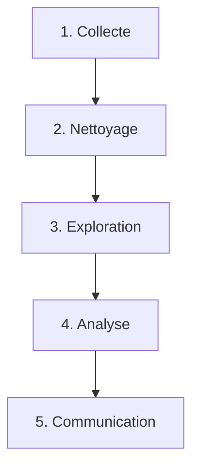

---
tags:
  - Python
  - Data
  - Débutant
  - Concept
description: "Comprendre pourquoi analyser des données, découvrir le cycle de vie des données et les outils Python dedies."
estimated_time: "60 min"
fiche_number: 1
total_fiches: 8
cursus: "Python Data"
---

# 01 - Introduction à l'analyse de données

> **En bref** : Comprendre pourquoi l'analyse de données est essentielle, découvrir le cycle de vie des données et identifier les outils Python dedies. Lecture estimée : 60 min.

## Prérequis

- Avoir termine le cursus [Python fondamentaux](../15-python/index.md) (variables, types, fonctions, fichiers, modules)
- Savoir ouvrir un terminal et exécuter un script Python

## Objectif de cette fiche

À la fin de cette fiche, tu sauras expliquer le cycle de vie des données, identifier les outils Python adaptes a chaque étape et installer un environnement d'analyse fonctionnel.

---

## Concepts

Cette section explique tous les concepts nécessaires. Lis-la entièrement avant de passer aux étapes pratiques.

### Qu'est-ce que l'analyse de données ?

**Définition** : L'analyse de données est le processus qui consiste a collecter, nettoyer, transformer et explorer des données brutes pour en extraire des informations utiles et prendre des décisions eclairees.

**Le problème que l'analyse de données résout** :

Sans analyse de données, voici les problèmes rencontrés :

1. **Décisions a l'aveugle** : on prend des décisions basées sur des intuitions ou des impressions, sans preuve concrete.
2. **Volume incomprehensible** : un fichier de 100 000 lignes est impossible a comprendre en le lisant ligne par ligne.
3. **Erreurs non détectées** : des anomalies dans les données (doublons, valeurs manquantes, erreurs de saisie) passent inapercues et faussent les conclusions.

**Comment l'analyse de données résout ces problèmes** :

| Problème | Solution apportée par l'analyse de données |
| --- | --- |
| Décisions a l'aveugle | Des statistiques et des graphiques fournissent des preuves objectives |
| Volume incomprehensible | Des outils calculent des resumes (moyenne, médiane, répartition) en une ligne de code |
| Erreurs non détectées | Des techniques de nettoyage identifient et corrigent les anomalies automatiquement |

**Analogie concrète** : Imagine que tu geres un magasin. Chaque jour, tu notes les ventes sur un cahier (les données brutes). À la fin du mois, tu as 30 pages de chiffres. Sans analyse, tu ne sais pas quel produit se vend le mieux, quel jour de la semaine est le plus rentable, ni si un produit est en perte. L'analyse de données, c'est le processus qui transforme ces 30 pages en un tableau de bord clair avec les réponses a ces questions.

**Ce que l'analyse de données n'est PAS** :

- L'analyse de données n'est pas de l'intelligence artificielle. L'IA utilise les données pour faire des prédictions automatiques. L'analyse de données se concentre sur la compréhension et la description des données existantes.
- L'analyse de données n'est pas reservee aux mathematiciens. Les outils Python modernes permettent de faire des analyses puissantes sans connaissance avancée en statistiques.

---

### Qu'est-ce que le cycle de vie des données ?

**Définition** : Le cycle de vie des données décrit les étapes successives par lesquelles passent les données, depuis leur collecte jusqu'a la communication des résultats.

**Le problème que le cycle de vie résout** :

Sans une méthode structuree, voici les problèmes rencontrés :

1. **Desorganisation** : on commence a analyser des données sans les avoir nettoyees, ce qui produit des résultats faux.
2. **Étapes oubliees** : on oublie de vérifier les valeurs manquantes ou de documenter les transformations appliquees.
3. **Non-reproductibilité** : impossible de refaire la même analyse six mois plus tard parce que les étapes n'ont pas été enregistrées.

**Comment le cycle de vie résout ces problèmes** :

| Problème | Solution apportée par le cycle de vie |
| --- | --- |
| Desorganisation | Un ordre précis d'étapes garantit que rien n'est fait dans le desordre |
| Étapes oubliees | Chaque étape a un objectif clair et des vérifications associees |
| Non-reproductibilité | Le pipeline (enchainement d'étapes) peut être rejoue a l'identique |

**Les 5 étapes du cycle de vie** :



1. **Collecte** : obtenir les données (fichier CSV, base de données, API, scraping web)
2. **Nettoyage** : corriger les erreurs, supprimer les doublons, gérer les valeurs manquantes
3. **Exploration** : calculer des statistiques descriptives, visualiser les distributions
4. **Analyse** : répondre aux questions précises, identifier des tendances et des correlations
5. **Communication** : presenter les résultats avec des graphiques et des rapports

**Analogie concrète** : Pense a la preparation d'un repas. Tu achetes les ingrédients (collecte), tu les laves et les epluches (nettoyage), tu goutes pour vérifier la qualité (exploration), tu cuisines le plat (analyse), puis tu le présentes dans une assiette soignee (communication). Sauter l'étape du nettoyage, c'est cuisiner avec des legumes terreux.

---

### Quels sont les outils Python pour l'analyse de données ?

**Définition** : L'écosystème Python Data repose sur quatre bibliothèques principales qui couvrent les différentes étapes du cycle de vie des données.

**Vue d'ensemble des outils** :

| Bibliothèque | Role | Étape du cycle |
| --- | --- | --- |
| **NumPy** | Calcul numérique rapide sur des tableaux | Analyse |
| **Pandas** | Manipulation de données tabulaires (lignes/colonnes) | Collecte, Nettoyage, Exploration, Analyse |
| **Matplotlib** | Création de graphiques de base | Communication |
| **Seaborn** | Graphiques statistiques avances (base sur Matplotlib) | Communication |

**Pourquoi ces quatre outils et pas d'autres ?** :

- **NumPy** est la fondation : Pandas, Matplotlib et Seaborn l'utilisent en interne. Comprendre NumPy aide a comprendre les trois autres.
- **Pandas** est l'outil central : 80 % du temps d'une analyse est consacre au nettoyage et a la manipulation. Pandas est conçu exactement pour cela.
- **Matplotlib** donne un controle total sur les graphiques : chaque pixel peut être personnalisé.
- **Seaborn** simplifie les graphiques statistiques : en une ligne de code, on obtient un graphique qui demanderait 20 lignes en Matplotlib pur.

**Ce que ces outils ne sont PAS** :

- NumPy n'est pas une base de données. Il stocke des données en mémoire vive, pas sur disque.
- Pandas n'est pas fait pour le Big Data. Pour des fichiers de plusieurs Go, des outils comme Dask ou Polars sont plus adaptes.
- Matplotlib n'est pas un outil interactif par défaut. Les graphiques sont statiques (images). Pour de l'interactivite, on utilise Plotly ou Bokeh.

---

### Qu'est-ce qu'un environnement virtuel Python ?

**Définition** : Un environnement virtuel est un dossier isole qui contient une version spécifique de Python et un ensemble de bibliothèques, indépendamment du reste du système.

**Le problème que les environnements virtuels résolvent** :

Sans environnement virtuel, voici les problèmes rencontrés :

1. **Conflits de versions** : le projet A a besoin de Pandas 1.5 et le projet B de Pandas 2.0. Les deux ne peuvent pas coexister dans le même Python.
2. **Pollution du système** : installer des bibliothèques globalement risque de casser d'autres programmes qui dépendent de versions spécifiques.

**Comment les environnements virtuels résolvent ces problèmes** :

| Problème | Solution apportée par les environnements virtuels |
| --- | --- |
| Conflits de versions | Chaque projet a son propre environnement avec ses propres versions |
| Pollution du système | Les bibliothèques sont installees dans un dossier isole, pas dans le Python système |

**Analogie concrète** : Imagine que tu as deux aquariums. Dans le premier, tu mets des poissons tropicaux (eau chaude). Dans le second, des poissons de riviere (eau froide). Chaque aquarium a ses propres conditions, sans interférences. Un environnement virtuel, c'est un aquarium dedie a ton projet.

---

## Étapes Pratiques

### Étape 1 : Créer un environnement virtuel

On commence par créer un espace isole pour installer les bibliothèques d'analyse sans affecter le reste du système.

```bash
# Creer un dossier pour le projet
mkdir ~/python-data-cursus
cd ~/python-data-cursus

# Creer l'environnement virtuel (dossier .venv)
python3 -m venv .venv

# Activer l'environnement virtuel
source .venv/bin/activate
```

**Résultat attendu** :

```text
(.venv) utilisateur@machine:~/python-data-cursus$
```

Le préfixe `(.venv)` confirme que l'environnement virtuel est actif. Toutes les installations de bibliothèques iront dans ce dossier.

---

### Étape 2 : Installer les bibliothèques

Installe les quatre bibliothèques principales du cursus.

```bash
# Installer NumPy, Pandas, Matplotlib et Seaborn
pip install numpy pandas matplotlib seaborn

# Verifier les versions installees
pip list | grep -E "numpy|pandas|matplotlib|seaborn"
```

**Résultat attendu** (exemples de versions ; les tiennes peuvent être plus récentes) :

```text
matplotlib        3.x
numpy             2.x
pandas            2.x ou 3.x
seaborn           0.13.x
```

Les numéros de version exacts évoluent. En 2026, `pip install pandas` peut installer Pandas 3.x (Copy-on-Write toujours actif). L'important est que les quatre bibliothèques s'importent sans erreur.

---

### Étape 3 : Verifier l'installation dans Python

Créé un script pour confirmer que tout fonctionne.

```bash
# Creer le fichier de test
touch test_install.py
```

Contenu du fichier `test_install.py` :

```python
# Importer chaque bibliotheque et afficher sa version
import numpy as np
import pandas as pd
import matplotlib
import seaborn as sns

# Afficher les versions pour confirmer l'installation
print(f"NumPy     : {np.__version__}")
print(f"Pandas    : {pd.__version__}")
print(f"Matplotlib: {matplotlib.__version__}")
print(f"Seaborn   : {sns.__version__}")

# Test rapide : creer un petit tableau de donnees
donnees = pd.DataFrame({
    "Produit": ["Pomme", "Banane", "Orange"],
    "Prix": [1.20, 0.80, 1.50],
    "Quantite": [50, 120, 30]
})

# Afficher le tableau
print("\nTableau de test :")
print(donnees)
```

```bash
# Executer le script
python3 test_install.py
```

**Résultat attendu** :

```text
NumPy     : 2.1.3
Pandas    : 2.2.3
Matplotlib: 3.9.2
Seaborn   : 0.13.2

Tableau de test :
  Produit  Prix  Quantite
0   Pomme  1.20        50
1  Banane  0.80       120
2  Orange  1.50        30
```

---

### Étape 4 : Comprendre la structure d'un projet d'analyse

Organise le projet avec une structure claire pour le reste du cursus.

```bash
# Creer la structure recommandee
mkdir -p data          # Fichiers de donnees (CSV, JSON)
mkdir -p notebooks     # Scripts d'analyse
mkdir -p output        # Graphiques et rapports generes
```

```text
python-data-cursus/
├── .venv/             # Environnement virtuel (ne pas modifier)
├── data/              # Donnees brutes et nettoyees
├── notebooks/         # Scripts d'analyse Python
├── output/            # Graphiques et resultats exportes
└── test_install.py    # Script de verification
```

---

### Étape 5 : Créer un premier fichier de données

Créé un fichier CSV de test pour les prochaines fiches.

Contenu du fichier `data/ventes.csv` :

```python
# Script pour generer un fichier CSV de test
import csv

# Donnees de ventes fictives
entetes = ["date", "produit", "categorie", "quantite", "prix_unitaire"]
ventes = [
    ["2024-01-15", "Pomme", "Fruit", "50", "1.20"],
    ["2024-01-15", "Pain", "Boulangerie", "30", "1.10"],
    ["2024-01-16", "Banane", "Fruit", "120", "0.80"],
    ["2024-01-16", "Lait", "Cremerie", "45", "1.30"],
    ["2024-01-17", "Pomme", "Fruit", "60", "1.20"],
    ["2024-01-17", "Beurre", "Cremerie", "25", "2.50"],
    ["2024-01-18", "Orange", "Fruit", "30", "1.50"],
    ["2024-01-18", "Pain", "Boulangerie", "40", "1.10"],
    ["2024-01-19", "Banane", "Fruit", "80", "0.80"],
    ["2024-01-19", "Lait", "Cremerie", "50", "1.30"],
]

# Ecrire le fichier CSV
with open("data/ventes.csv", "w", newline="") as f:
    writer = csv.writer(f)
    writer.writerow(entetes)
    writer.writerows(ventes)

print("Fichier data/ventes.csv cree avec succes")
print(f"Nombre de lignes : {len(ventes)}")
```

```bash
# Executer le script
python3 -c "
import csv
entetes = ['date', 'produit', 'categorie', 'quantite', 'prix_unitaire']
ventes = [
    ['2024-01-15', 'Pomme', 'Fruit', '50', '1.20'],
    ['2024-01-15', 'Pain', 'Boulangerie', '30', '1.10'],
    ['2024-01-16', 'Banane', 'Fruit', '120', '0.80'],
    ['2024-01-16', 'Lait', 'Cremerie', '45', '1.30'],
    ['2024-01-17', 'Pomme', 'Fruit', '60', '1.20'],
    ['2024-01-17', 'Beurre', 'Cremerie', '25', '2.50'],
    ['2024-01-18', 'Orange', 'Fruit', '30', '1.50'],
    ['2024-01-18', 'Pain', 'Boulangerie', '40', '1.10'],
    ['2024-01-19', 'Banane', 'Fruit', '80', '0.80'],
    ['2024-01-19', 'Lait', 'Cremerie', '50', '1.30'],
]
with open('data/ventes.csv', 'w', newline='') as f:
    writer = csv.writer(f)
    writer.writerow(entetes)
    writer.writerows(ventes)
print('Fichier data/ventes.csv cree avec succes')
print(f'Nombre de lignes : {len(ventes)}')
"
```

**Résultat attendu** :

```text
Fichier data/ventes.csv cree avec succes
Nombre de lignes : 10
```

---

## Commandes Utiles

| Commande | Action |
| --- | --- |
| `python3 -m venv .venv` | Créer un environnement virtuel |
| `source .venv/bin/activate` | Activer l'environnement virtuel |
| `deactivate` | Desactiver l'environnement virtuel |
| `pip install numpy pandas matplotlib seaborn` | Installer les bibliothèques d'analyse |
| `pip list` | Lister les bibliothèques installees |
| `pip freeze > requirements.txt` | Sauvegarder la liste des dépendances |
| `pip install -r requirements.txt` | Reinstaller les dépendances depuis le fichier |

---

## Pièges Fréquents

### Piège 1 : Oublier d'activer l'environnement virtuel

**Problème** : tu installes des bibliothèques sans activer l'environnement virtuel. Elles s'installent dans le Python système.

**Solution** : vérifie toujours que le préfixe `(.venv)` apparaît dans ton terminal avant d'exécuter `pip install`.

```bash
# Verifier si l'environnement est actif
which python3
# Si actif : /chemin/vers/python-data-cursus/.venv/bin/python3
# Si inactif : /usr/bin/python3 ou /usr/local/bin/python3
```

### Piège 2 : Confondre `python` et `python3`

**Problème** : sur certains systèmes, `python` pointe vers Python 2 (obsolète) et non Python 3.

**Solution** : utilise toujours `python3` explicitement, ou vérifie la version.

```bash
# Verifier la version
python3 --version
# Resultat attendu : Python 3.x.x (x >= 10)
```

### Piège 3 : Importer une bibliothèque non installee

**Problème** : tu obtiens `ModuleNotFoundError: No module named 'pandas'`.

**Solution** : vérifie que l'environnement virtuel est actif et que la bibliothèque est installee.

```bash
# Verifier si pandas est installe
pip show pandas

# Si pas installe, l'installer
pip install pandas
```

---

## Checklist de Validation

- [ ] Je sais expliquer ce qu'est l'analyse de données et pourquoi elle est utile
- [ ] Je connais les 5 étapes du cycle de vie des données
- [ ] Je sais nommer les 4 bibliothèques principales et leur rôle
- [ ] J'ai créé un environnement virtuel et installé les bibliothèques
- [ ] Mon script de test affiche les versions des 4 bibliothèques
- [ ] J'ai créé la structure de dossiers pour le projet

---

## Exercice Pratique

**Énoncé** : Créé un script `notebooks/exploration_rapide.py` qui charge le fichier `data/ventes.csv` avec le module `csv` de Python (sans Pandas), puis affiche le nombre total de produits vendus et le chiffre d'affaires total.

**Indications** :

- Utilise `csv.DictReader` pour lire le fichier avec les noms de colonnes
- Le chiffre d'affaires d'une ligne = `quantite * prix_unitaire`
- Convertis les valeurs en `int` et `float` avant les calculs

**Résultat attendu** :

```text
Nombre total de produits vendus : 530
Chiffre d'affaires total : 600.00 EUR
```

---

## Solution de l'Exercice

> **Note** : Cette section contient la solution complete. Essaie d'abord de résoudre l'exercice par toi-même avant de consulter cette solution.

---

```python
import csv

# Initialiser les compteurs
total_quantite = 0
total_ca = 0.0

# Ouvrir et lire le fichier CSV
with open("data/ventes.csv", "r") as f:
    # DictReader utilise la premiere ligne comme noms de colonnes
    lecteur = csv.DictReader(f)

    # Parcourir chaque ligne du fichier
    for ligne in lecteur:
        # Convertir la quantite en entier
        quantite = int(ligne["quantite"])
        # Convertir le prix unitaire en nombre decimal
        prix = float(ligne["prix_unitaire"])

        # Ajouter au total
        total_quantite += quantite
        # Calculer le chiffre d'affaires de cette ligne
        total_ca += quantite * prix

# Afficher les resultats
print(f"Nombre total de produits vendus : {total_quantite}")
print(f"Chiffre d'affaires total : {total_ca:.2f} EUR")
```

Ce script montre la méthode "manuelle" pour analyser un CSV. Dans la fiche suivante, tu découvriras NumPy qui permet de faire ces calculs en une seule ligne de code.

---

## Navigation

→ Fiche suivante : **[NumPy - Calcul numérique](02-numpy-fondamentaux.md)**
