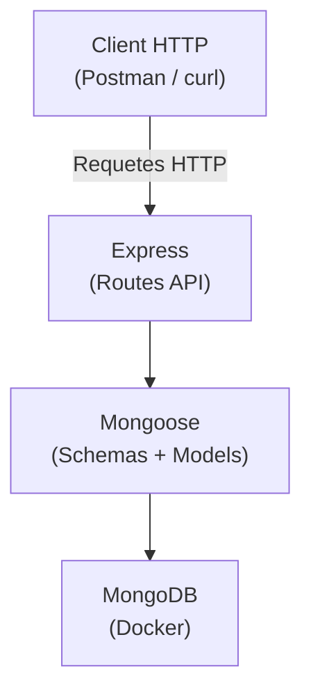

---
tags:
  - MongoDB
  - Intermédiaire
  - Projet
description: "Projet intégrateur : créer une API REST complete avec Express, MongoDB et Mongoose"
estimated_time: "120 min"
fiche_number: 8
total_fiches: 8
cursus: "MongoDB"
---

# 08 - Projet intégrateur

> **En bref** : Ce projet met en pratique tout ce que tu as appris dans ce cursus. Tu vas créer une API REST complete pour gérer une librairie en ligne avec Express, MongoDB et Mongoose. Lecture estimée : 120 min.

## Prérequis

- Toutes les fiches précédentes du cursus MongoDB (01 a 07)
- [Cursus Node.js](../epitech/07-nodejs/index.md) termine (npm, modules, Express, API REST)
- Savoir créer des routes Express et manipuler du JSON

## Version utilisée dans cette fiche

| Technologie | Version |
| ----------- | ------- |
| MongoDB | 8.x |
| Node.js | 20 LTS |
| Express | 4.x |
| Mongoose | 8.x |

## Objectif de cette fiche

À la fin de cette fiche, tu auras construit une API REST complete pour une librairie en ligne avec : des schémas Mongoose avec validation, des routes CRUD, des relations entre collections, de la pagination, du tri, de la recherche et des index de performance.

---

## Concepts

Cette section explique les concepts spécifiques au projet intégrateur. Les concepts fondamentaux ont été couverts dans les fiches précédentes.

### Qu'est-ce qu'un projet intégrateur ?

**Définition** : Un projet intégrateur combine toutes les compétences acquises dans un cursus pour résoudre un problème concret et réaliste. Il ne s'agit pas d'apprendre de nouveaux concepts, mais de mettre en pratique les concepts existants ensemble.

**Analogie concrète** : Imagine que tu as appris séparément a couper des legumes, cuire de la viande, préparer une sauce et dresser une assiette. Le projet intégrateur, c'est le moment où tu prepares un repas complet en combinant toutes ces techniques dans le bon ordre, du début a la fin.

**Ce que tu vas construire** :

Une API REST pour une librairie en ligne avec :

1. **Schémas Mongoose** avec validation stricte (fiches 03, 07)
2. **Routes CRUD** complètes pour livres et auteurs (fiche 03)
3. **Relations** entre livres et auteurs avec populate (fiche 07)
4. **Requêtes avancées** : filtres, tri, pagination (fiche 04)
5. **Pipeline d'agrégation** pour les statistiques (fiche 05)
6. **Index** pour les performances (fiche 06)

---

### Architecture de l'application



**Structure du projet** :

```text
librairie-api/
├── package.json
├── index.js              # Point d'entree, serveur Express
├── config/
│   └── database.js       # Connexion MongoDB
├── models/
│   ├── Auteur.js          # Schema et model Auteur
│   └── Livre.js           # Schema et model Livre
├── routes/
│   ├── auteurs.js         # Routes CRUD auteurs
│   ├── livres.js          # Routes CRUD livres
│   └── stats.js           # Routes de statistiques
└── docker-compose.yml     # MongoDB dans Docker
```

---

## Étapes Pratiques

### Étape 1 : Initialiser le projet

```bash
# Cree le dossier du projet
mkdir librairie-api && cd librairie-api

# Initialise le projet Node.js
npm init -y

# Installe les dependances
npm install express mongoose
```

Configure `package.json` :

```json
{
  "name": "librairie-api",
  "version": "1.0.0",
  "type": "module",
  "scripts": {
    "start": "node index.js",
    "dev": "node --watch index.js"
  },
  "dependencies": {
    "express": "^4.21.0",
    "mongoose": "^8.0.0"
  }
}
```

---

### Étape 2 : Configurer Docker Compose

Créé `docker-compose.yml` :

```yaml
services:
  mongodb:
    image: mongo:8
    container_name: librairie-mongo
    ports:
      - "27017:27017"
    volumes:
      - mongo-data:/data/db
    restart: unless-stopped

volumes:
  mongo-data:
```

```bash
# Lance MongoDB
docker compose up -d
```

---

### Étape 3 : Configurer la connexion a la base de données

Créé `config/database.js` :

```javascript
// config/database.js
import mongoose from "mongoose";

// URL de connexion a MongoDB (Docker local)
const MONGODB_URI = "mongodb://localhost:27017/librairie";

async function connectDB() {
  try {
    await mongoose.connect(MONGODB_URI);
    console.log("MongoDB connecte : librairie");
  } catch (error) {
    console.error("Erreur de connexion MongoDB :", error.message);
    process.exit(1);
  }
}

export default connectDB;
```

---

### Étape 4 : Créer le model Auteur

Créé `models/Auteur.js` :

```javascript
// models/Auteur.js
import mongoose from "mongoose";

const auteurSchema = new mongoose.Schema({
  // Prenom de l'auteur (obligatoire)
  prenom: {
    type: String,
    required: [true, "Le prenom est obligatoire"],
    trim: true,
    minlength: [2, "Le prenom doit faire au moins 2 caracteres"]
  },

  // Nom de l'auteur (obligatoire)
  nom: {
    type: String,
    required: [true, "Le nom est obligatoire"],
    trim: true,
    minlength: [2, "Le nom doit faire au moins 2 caracteres"]
  },

  // Nationalite
  nationalite: {
    type: String,
    trim: true
  },

  // Date de naissance
  date_naissance: {
    type: Date
  },

  // Biographie courte
  biographie: {
    type: String,
    maxlength: [1000, "La biographie ne peut pas depasser 1000 caracteres"]
  }
}, {
  // Ajoute automatiquement createdAt et updatedAt
  timestamps: true
});

// Propriete virtuelle : nom complet
auteurSchema.virtual("nom_complet").get(function () {
  return `${this.prenom} ${this.nom}`;
});

// Inclure les virtuels dans les conversions JSON
auteurSchema.set("toJSON", { virtuals: true });

// Index pour la recherche par nom
auteurSchema.index({ nom: 1, prenom: 1 });

const Auteur = mongoose.model("Auteur", auteurSchema);

export default Auteur;
```

---

### Étape 5 : Créer le model Livre

Créé `models/Livre.js` :

```javascript
// models/Livre.js
import mongoose from "mongoose";

const livreSchema = new mongoose.Schema({
  // Titre du livre (obligatoire, unique)
  titre: {
    type: String,
    required: [true, "Le titre est obligatoire"],
    trim: true,
    minlength: [1, "Le titre ne peut pas etre vide"],
    maxlength: [200, "Le titre ne peut pas depasser 200 caracteres"]
  },

  // Reference a l'auteur (relation)
  auteur: {
    type: mongoose.Schema.Types.ObjectId,
    ref: "Auteur",
    required: [true, "L'auteur est obligatoire"]
  },

  // ISBN (identifiant unique du livre)
  isbn: {
    type: String,
    unique: true,
    sparse: true    // Permet les valeurs null (pas tous les livres ont un ISBN)
  },

  // Resume
  resume: {
    type: String,
    maxlength: [2000, "Le resume ne peut pas depasser 2000 caracteres"]
  },

  // Genres (tableau)
  genres: {
    type: [String],
    validate: {
      validator: function (v) {
        return v.length > 0;
      },
      message: "Au moins un genre est requis"
    }
  },

  // Annee de publication
  annee_publication: {
    type: Number,
    min: [-3000, "L'annee ne peut pas etre anterieure a -3000"],
    max: [new Date().getFullYear() + 1, "L'annee ne peut pas etre dans le futur"]
  },

  // Nombre de pages
  pages: {
    type: Number,
    min: [1, "Un livre doit avoir au moins 1 page"]
  },

  // Langue
  langue: {
    type: String,
    default: "Francais"
  },

  // Prix
  prix: {
    type: Number,
    min: [0, "Le prix ne peut pas etre negatif"]
  },

  // Stock disponible
  stock: {
    type: Number,
    min: [0, "Le stock ne peut pas etre negatif"],
    default: 0
  },

  // Note moyenne (sur 5)
  note_moyenne: {
    type: Number,
    min: 0,
    max: 5,
    default: 0
  },

  // Disponible a la vente
  disponible: {
    type: Boolean,
    default: true
  }
}, {
  timestamps: true
});

// Index compose pour la recherche par genre et tri par note
livreSchema.index({ genres: 1, note_moyenne: -1 });

// Index texte pour la recherche plein texte
livreSchema.index({ titre: "text", resume: "text" }, { default_language: "french" });

// Index sur l'auteur pour les requetes de jointure
livreSchema.index({ auteur: 1 });

// Propriete virtuelle : en stock
livreSchema.virtual("en_stock").get(function () {
  return this.stock > 0;
});

livreSchema.set("toJSON", { virtuals: true });

const Livre = mongoose.model("Livre", livreSchema);

export default Livre;
```

---

### Étape 6 : Créer les routes des auteurs

Créé `routes/auteurs.js` :

```javascript
// routes/auteurs.js
import { Router } from "express";
import Auteur from "../models/Auteur.js";

const router = Router();

// GET /api/auteurs - Liste tous les auteurs (avec pagination)
router.get("/", async (req, res) => {
  try {
    // Parametres de pagination depuis la query string
    const page = parseInt(req.query.page) || 1;
    const limit = parseInt(req.query.limit) || 10;
    const skip = (page - 1) * limit;

    // Parametres de tri
    const sort = req.query.sort || "nom";
    const order = req.query.order === "desc" ? -1 : 1;

    // Compter le total et recuperer les resultats en parallele
    const [auteurs, total] = await Promise.all([
      Auteur.find()
        .sort({ [sort]: order })
        .skip(skip)
        .limit(limit),
      Auteur.countDocuments()
    ]);

    res.json({
      donnees: auteurs,
      pagination: {
        page,
        limit,
        total,
        pages: Math.ceil(total / limit)
      }
    });
  } catch (error) {
    res.status(500).json({ erreur: error.message });
  }
});

// GET /api/auteurs/:id - Un seul auteur
router.get("/:id", async (req, res) => {
  try {
    const auteur = await Auteur.findById(req.params.id);

    if (!auteur) {
      return res.status(404).json({ erreur: "Auteur non trouve" });
    }

    res.json(auteur);
  } catch (error) {
    res.status(500).json({ erreur: error.message });
  }
});

// POST /api/auteurs - Creer un auteur
router.post("/", async (req, res) => {
  try {
    const auteur = await Auteur.create(req.body);
    res.status(201).json(auteur);
  } catch (error) {
    // Erreur de validation Mongoose
    if (error.name === "ValidationError") {
      const erreurs = Object.values(error.errors).map(e => e.message);
      return res.status(400).json({ erreurs });
    }
    res.status(500).json({ erreur: error.message });
  }
});

// PUT /api/auteurs/:id - Modifier un auteur
router.put("/:id", async (req, res) => {
  try {
    const auteur = await Auteur.findByIdAndUpdate(
      req.params.id,
      req.body,
      { new: true, runValidators: true }  // Retourne le modifie, execute les validators
    );

    if (!auteur) {
      return res.status(404).json({ erreur: "Auteur non trouve" });
    }

    res.json(auteur);
  } catch (error) {
    if (error.name === "ValidationError") {
      const erreurs = Object.values(error.errors).map(e => e.message);
      return res.status(400).json({ erreurs });
    }
    res.status(500).json({ erreur: error.message });
  }
});

// DELETE /api/auteurs/:id - Supprimer un auteur
router.delete("/:id", async (req, res) => {
  try {
    const auteur = await Auteur.findByIdAndDelete(req.params.id);

    if (!auteur) {
      return res.status(404).json({ erreur: "Auteur non trouve" });
    }

    res.json({ message: `Auteur "${auteur.nom_complet}" supprime` });
  } catch (error) {
    res.status(500).json({ erreur: error.message });
  }
});

export default router;
```

---

### Étape 7 : Créer les routes des livres

Créé `routes/livres.js` :

```javascript
// routes/livres.js
import { Router } from "express";
import Livre from "../models/Livre.js";

const router = Router();

// GET /api/livres - Liste avec filtres, tri et pagination
router.get("/", async (req, res) => {
  try {
    const page = parseInt(req.query.page) || 1;
    const limit = parseInt(req.query.limit) || 10;
    const skip = (page - 1) * limit;

    // Construction du filtre dynamique
    const filtre = {};

    // Filtre par genre
    // String() force la conversion en chaine primitive et empeche
    // l'injection d'operateur via ?genre[$regex]=.* ou similaire
    if (req.query.genre) {
      filtre.genres = String(req.query.genre);
    }

    // Filtre par disponibilite
    if (req.query.disponible !== undefined) {
      filtre.disponible = req.query.disponible === "true";
    }

    // Filtre par prix (min et max)
    if (req.query.prix_min || req.query.prix_max) {
      filtre.prix = {};
      if (req.query.prix_min) filtre.prix.$gte = parseFloat(req.query.prix_min);
      if (req.query.prix_max) filtre.prix.$lte = parseFloat(req.query.prix_max);
    }

    // Filtre par annee
    if (req.query.annee) {
      filtre.annee_publication = parseInt(req.query.annee);
    }

    // Recherche plein texte
    if (req.query.q) {
      filtre.$text = { $search: req.query.q };
    }

    // Tri
    const sort = req.query.sort || "titre";
    const order = req.query.order === "desc" ? -1 : 1;

    const [livres, total] = await Promise.all([
      Livre.find(filtre)
        .populate("auteur", "prenom nom")    // Charge les infos de l'auteur
        .sort({ [sort]: order })
        .skip(skip)
        .limit(limit),
      Livre.countDocuments(filtre)
    ]);

    res.json({
      donnees: livres,
      pagination: {
        page,
        limit,
        total,
        pages: Math.ceil(total / limit)
      }
    });
  } catch (error) {
    res.status(500).json({ erreur: error.message });
  }
});

// GET /api/livres/:id - Un seul livre avec l'auteur
router.get("/:id", async (req, res) => {
  try {
    const livre = await Livre.findById(req.params.id)
      .populate("auteur");    // Charge toutes les infos de l'auteur

    if (!livre) {
      return res.status(404).json({ erreur: "Livre non trouve" });
    }

    res.json(livre);
  } catch (error) {
    res.status(500).json({ erreur: error.message });
  }
});

// POST /api/livres - Creer un livre
router.post("/", async (req, res) => {
  try {
    const livre = await Livre.create(req.body);

    // Charge l'auteur pour la reponse
    await livre.populate("auteur", "prenom nom");

    res.status(201).json(livre);
  } catch (error) {
    if (error.name === "ValidationError") {
      const erreurs = Object.values(error.errors).map(e => e.message);
      return res.status(400).json({ erreurs });
    }
    // Erreur de doublon (ISBN unique)
    if (error.code === 11000) {
      return res.status(409).json({ erreur: "Un livre avec cet ISBN existe deja" });
    }
    res.status(500).json({ erreur: error.message });
  }
});

// PUT /api/livres/:id - Modifier un livre
router.put("/:id", async (req, res) => {
  try {
    const livre = await Livre.findByIdAndUpdate(
      req.params.id,
      req.body,
      { new: true, runValidators: true }
    ).populate("auteur", "prenom nom");

    if (!livre) {
      return res.status(404).json({ erreur: "Livre non trouve" });
    }

    res.json(livre);
  } catch (error) {
    if (error.name === "ValidationError") {
      const erreurs = Object.values(error.errors).map(e => e.message);
      return res.status(400).json({ erreurs });
    }
    res.status(500).json({ erreur: error.message });
  }
});

// DELETE /api/livres/:id - Supprimer un livre
router.delete("/:id", async (req, res) => {
  try {
    const livre = await Livre.findByIdAndDelete(req.params.id);

    if (!livre) {
      return res.status(404).json({ erreur: "Livre non trouve" });
    }

    res.json({ message: `Livre "${livre.titre}" supprime` });
  } catch (error) {
    res.status(500).json({ erreur: error.message });
  }
});

export default router;
```

---

### Étape 8 : Créer les routes de statistiques

Créé `routes/stats.js` :

```javascript
// routes/stats.js
import { Router } from "express";
import Livre from "../models/Livre.js";
import Auteur from "../models/Auteur.js";

const router = Router();

// GET /api/stats/general - Statistiques generales
router.get("/general", async (req, res) => {
  try {
    const [nbLivres, nbAuteurs, statsLivres] = await Promise.all([
      Livre.countDocuments(),
      Auteur.countDocuments(),
      Livre.aggregate([
        {
          $group: {
            _id: null,
            prix_moyen: { $avg: "$prix" },
            prix_min: { $min: "$prix" },
            prix_max: { $max: "$prix" },
            pages_total: { $sum: "$pages" },
            note_moyenne: { $avg: "$note_moyenne" },
            stock_total: { $sum: "$stock" }
          }
        }
      ])
    ]);

    const stats = statsLivres[0] || {};
    res.json({
      livres: nbLivres,
      auteurs: nbAuteurs,
      prix_moyen: Math.round((stats.prix_moyen || 0) * 100) / 100,
      prix_min: stats.prix_min || 0,
      prix_max: stats.prix_max || 0,
      pages_total: stats.pages_total || 0,
      note_moyenne: Math.round((stats.note_moyenne || 0) * 100) / 100,
      stock_total: stats.stock_total || 0
    });
  } catch (error) {
    res.status(500).json({ erreur: error.message });
  }
});

// GET /api/stats/par-genre - Livres et prix moyen par genre
router.get("/par-genre", async (req, res) => {
  try {
    const stats = await Livre.aggregate([
      // Deconstruire le tableau de genres
      { $unwind: "$genres" },

      // Grouper par genre
      {
        $group: {
          _id: "$genres",
          nombre_livres: { $count: {} },
          prix_moyen: { $avg: "$prix" },
          note_moyenne: { $avg: "$note_moyenne" },
          livres: { $push: "$titre" }
        }
      },

      // Trier par nombre de livres decroissant
      { $sort: { nombre_livres: -1 } },

      // Reformater
      {
        $project: {
          _id: 0,
          genre: "$_id",
          nombre_livres: 1,
          prix_moyen: { $round: ["$prix_moyen", 2] },
          note_moyenne: { $round: ["$note_moyenne", 1] },
          livres: 1
        }
      }
    ]);

    res.json(stats);
  } catch (error) {
    res.status(500).json({ erreur: error.message });
  }
});

// GET /api/stats/par-auteur - Nombre de livres et note moyenne par auteur
router.get("/par-auteur", async (req, res) => {
  try {
    const stats = await Livre.aggregate([
      // Jointure avec la collection auteurs
      {
        $lookup: {
          from: "auteurs",
          localField: "auteur",
          foreignField: "_id",
          as: "info_auteur"
        }
      },
      { $unwind: "$info_auteur" },

      // Grouper par auteur
      {
        $group: {
          _id: "$auteur",
          nom: { $first: { $concat: ["$info_auteur.prenom", " ", "$info_auteur.nom"] } },
          nombre_livres: { $count: {} },
          note_moyenne: { $avg: "$note_moyenne" },
          prix_total: { $sum: "$prix" }
        }
      },

      // Trier par nombre de livres
      { $sort: { nombre_livres: -1 } },

      // Reformater
      {
        $project: {
          _id: 0,
          auteur: "$nom",
          nombre_livres: 1,
          note_moyenne: { $round: ["$note_moyenne", 1] },
          prix_total: { $round: ["$prix_total", 2] }
        }
      }
    ]);

    res.json(stats);
  } catch (error) {
    res.status(500).json({ erreur: error.message });
  }
});

// GET /api/stats/top-livres - Top 5 des livres les mieux notes
router.get("/top-livres", async (req, res) => {
  try {
    const top = await Livre.find({ note_moyenne: { $gt: 0 } })
      .populate("auteur", "prenom nom")
      .sort({ note_moyenne: -1 })
      .limit(5)
      .select("titre note_moyenne genres annee_publication");

    res.json(top);
  } catch (error) {
    res.status(500).json({ erreur: error.message });
  }
});

export default router;
```

---

### Étape 9 : Assembler le serveur Express

Créé `index.js` :

```javascript
// index.js
import express from "express";
import connectDB from "./config/database.js";
import auteursRoutes from "./routes/auteurs.js";
import livresRoutes from "./routes/livres.js";
import statsRoutes from "./routes/stats.js";

const app = express();
const PORT = 3000;

// Middleware pour parser le JSON
app.use(express.json());

// Connexion a la base de donnees
await connectDB();

// Routes
app.use("/api/auteurs", auteursRoutes);
app.use("/api/livres", livresRoutes);
app.use("/api/stats", statsRoutes);

// Route racine
app.get("/", (req, res) => {
  res.json({
    message: "API Librairie",
    endpoints: {
      auteurs: "/api/auteurs",
      livres: "/api/livres",
      statistiques: "/api/stats/general"
    }
  });
});

// Gestion des routes inexistantes
app.use((req, res) => {
  res.status(404).json({ erreur: "Route non trouvee" });
});

// Lancement du serveur
app.listen(PORT, () => {
  console.log(`Serveur demarre sur http://localhost:${PORT}`);
});
```

---

### Étape 10 : Tester l'API

Lance le serveur :

```bash
npm run dev
```

**Résultat attendu** :

```text
MongoDB connecte : librairie
Serveur demarre sur http://localhost:3000
```

Teste avec curl dans un autre terminal :

```bash
# Creer des auteurs
curl -X POST http://localhost:3000/api/auteurs \
  -H "Content-Type: application/json" \
  -d '{"prenom": "Victor", "nom": "Hugo", "nationalite": "Francais", "date_naissance": "1802-02-26"}'

curl -X POST http://localhost:3000/api/auteurs \
  -H "Content-Type: application/json" \
  -d '{"prenom": "Albert", "nom": "Camus", "nationalite": "Francais", "date_naissance": "1913-11-07"}'

curl -X POST http://localhost:3000/api/auteurs \
  -H "Content-Type: application/json" \
  -d '{"prenom": "Isaac", "nom": "Asimov", "nationalite": "Americain", "date_naissance": "1920-01-02"}'
```

Note les `_id` retournes pour les utiliser dans les livres :

```bash
# Lister les auteurs
curl http://localhost:3000/api/auteurs
```

Remplace `HUGO_ID`, `CAMUS_ID` et `ASIMOV_ID` par les vrais _id :

```bash
# Creer des livres
curl -X POST http://localhost:3000/api/livres \
  -H "Content-Type: application/json" \
  -d '{
    "titre": "Les Miserables",
    "auteur": "HUGO_ID",
    "isbn": "978-2-07-040850-1",
    "genres": ["Roman", "Historique"],
    "annee_publication": 1862,
    "pages": 1900,
    "prix": 12.99,
    "stock": 25,
    "note_moyenne": 4.5
  }'

curl -X POST http://localhost:3000/api/livres \
  -H "Content-Type: application/json" \
  -d '{
    "titre": "L Etranger",
    "auteur": "CAMUS_ID",
    "isbn": "978-2-07-036024-6",
    "genres": ["Roman", "Philosophique"],
    "annee_publication": 1942,
    "pages": 186,
    "prix": 7.50,
    "stock": 50,
    "note_moyenne": 4.2
  }'

curl -X POST http://localhost:3000/api/livres \
  -H "Content-Type: application/json" \
  -d '{
    "titre": "Fondation",
    "auteur": "ASIMOV_ID",
    "isbn": "978-2-07-041239-7",
    "genres": ["Science-fiction", "Roman"],
    "annee_publication": 1951,
    "pages": 416,
    "prix": 9.99,
    "stock": 35,
    "note_moyenne": 4.8
  }'

curl -X POST http://localhost:3000/api/livres \
  -H "Content-Type: application/json" \
  -d '{
    "titre": "Notre-Dame de Paris",
    "auteur": "HUGO_ID",
    "isbn": "978-2-07-040888-4",
    "genres": ["Roman", "Historique", "Gothique"],
    "annee_publication": 1831,
    "pages": 940,
    "prix": 10.50,
    "stock": 18,
    "note_moyenne": 4.3
  }'

curl -X POST http://localhost:3000/api/livres \
  -H "Content-Type: application/json" \
  -d '{
    "titre": "La Peste",
    "auteur": "CAMUS_ID",
    "isbn": "978-2-07-036042-0",
    "genres": ["Roman", "Philosophique"],
    "annee_publication": 1947,
    "pages": 279,
    "prix": 8.50,
    "stock": 40,
    "note_moyenne": 4.6
  }'
```

---

### Étape 11 : Tester les fonctionnalités avancées

```bash
# Lister les livres avec pagination (page 1, 2 par page)
curl "http://localhost:3000/api/livres?page=1&limit=2"

# Filtrer par genre
curl "http://localhost:3000/api/livres?genre=Philosophique"

# Filtrer par prix (entre 8 et 11 euros)
curl "http://localhost:3000/api/livres?prix_min=8&prix_max=11"

# Trier par note decroissante
curl "http://localhost:3000/api/livres?sort=note_moyenne&order=desc"

# Recherche plein texte
curl "http://localhost:3000/api/livres?q=roman"

# Statistiques generales
curl http://localhost:3000/api/stats/general

# Statistiques par genre
curl http://localhost:3000/api/stats/par-genre

# Statistiques par auteur
curl http://localhost:3000/api/stats/par-auteur

# Top 5 des livres
curl http://localhost:3000/api/stats/top-livres
```

---

### Étape 12 : Tester la validation

```bash
# Creer un livre sans titre (erreur de validation)
curl -X POST http://localhost:3000/api/livres \
  -H "Content-Type: application/json" \
  -d '{"prix": 10}'
```

**Résultat attendu** :

```json
{
  "erreurs": [
    "Le titre est obligatoire",
    "L'auteur est obligatoire",
    "Au moins un genre est requis"
  ]
}
```

```bash
# Creer un auteur avec un nom trop court (erreur)
curl -X POST http://localhost:3000/api/auteurs \
  -H "Content-Type: application/json" \
  -d '{"prenom": "A", "nom": "B"}'
```

**Résultat attendu** :

```json
{
  "erreurs": [
    "Le prenom doit faire au moins 2 caracteres",
    "Le nom doit faire au moins 2 caracteres"
  ]
}
```

---

### Étape 13 : Verifier les index

Connecte-toi a mongosh pour inspecter les index créés :

```bash
docker exec -it librairie-mongo mongosh
```

```text
use librairie

// Index de la collection livres
db.livres.getIndexes()
```

**Résultat attendu** :

```text
[
  { key: { _id: 1 }, name: '_id_' },
  { key: { genres: 1, note_moyenne: -1 }, name: 'genres_1_note_moyenne_-1' },
  { key: { titre: 'text', resume: 'text' }, name: 'titre_text_resume_text', default_language: 'french' },
  { key: { auteur: 1 }, name: 'auteur_1' },
  { key: { isbn: 1 }, name: 'isbn_1', unique: true, sparse: true }
]
```

```javascript
// Verifier qu'une requete utilise bien un index
db.livres.find({ genres: "Roman" }).sort({ note_moyenne: -1 }).explain("executionStats")
// Stage : IXSCAN sur genres_1_note_moyenne_-1

exit
```

---

### Étape 14 : Nettoyage

```bash
# Arrete le serveur (Ctrl+C)

# Supprime les conteneurs
docker compose down -v

# Supprime le projet (optionnel)
cd .. && rm -rf librairie-api
```

---

## Commandes Utiles

| Commande | Action |
| -------- | ------ |
| `npm run dev` | Lance le serveur en mode watch |
| `curl -X GET url` | Requête GET |
| `curl -X POST url -H "Content-Type: application/json" -d '{}'` | Requête POST avec JSON |
| `curl -X PUT url -H "Content-Type: application/json" -d '{}'` | Requête PUT avec JSON |
| `curl -X DELETE url` | Requête DELETE |
| `docker compose up -d` | Lance MongoDB |
| `docker compose down -v` | Arrete et supprime MongoDB + données |

---

## Pièges Fréquents

### Piège 1 : Oublier runValidators dans findByIdAndUpdate

⚠️ **Problème** : Tu utilises `findByIdAndUpdate` sans l'option `runValidators: true`. Mongoose ne valide pas les données lors d'un update (comportement par défaut).

✅ **Solution** : Ajoute toujours `{ runValidators: true }` dans les options de mise à jour :

```javascript
// Mauvais : pas de validation
Livre.findByIdAndUpdate(id, { prix: -10 });

// Bon : validation activee, -10 sera rejete (min: 0)
Livre.findByIdAndUpdate(id, { prix: -10 }, { runValidators: true });
```

---

### Piège 2 : Ne pas gérer les erreurs de doublon

⚠️ **Problème** : Tu inseres un livre avec un ISBN qui existe déjà. L'erreur MongoDB (code 11000) n'est pas geree et le serveur renvoie une erreur 500 générique.

✅ **Solution** : Detecte l'erreur de doublon et renvoie un message clair :

```javascript
if (error.code === 11000) {
  return res.status(409).json({ erreur: "Un livre avec cet ISBN existe deja" });
}
```

---

### Piège 3 : Oublier populate sur les routes de lecture

⚠️ **Problème** : Tu listes les livres sans populate. Le champ `auteur` contient un ObjectId brut au lieu des informations de l'auteur. Le client doit faire une requête supplémentaire.

✅ **Solution** : Ajoute toujours `.populate()` quand tu retournes des documents avec des références :

```javascript
// Mauvais : auteur est un ObjectId
const livres = await Livre.find();

// Bon : auteur est un objet avec nom et prenom
const livres = await Livre.find().populate("auteur", "prenom nom");
```

---

### Piège 4 : Construire des filtres avec des données non validees

⚠️ **Problème** : Tu passes directement `req.query` dans le filtre MongoDB. Un attaquant peut injecter des opérateurs MongoDB (`{ "$gt": "" }`) via la query string.

✅ **Solution** : Valide et construis explicitement tes filtres. Ne passe jamais `req.query` directement a MongoDB :

```javascript
// Mauvais : injection possible
const livres = await Livre.find(req.query);

// Bon : filtre construit explicitement avec conversion de type
const filtre = {};
if (req.query.genre) filtre.genres = String(req.query.genre);
if (req.query.disponible) filtre.disponible = req.query.disponible === "true";
const livres = await Livre.find(filtre);
```

---

## Checklist de Validation

- [ ] J'ai créé un projet Node.js avec Express et Mongoose
- [ ] J'ai configure MongoDB avec Docker Compose
- [ ] J'ai défini des schémas Mongoose avec validation complete
- [ ] J'ai créé des routes CRUD pour les auteurs et les livres
- [ ] J'ai implemente la pagination, le tri et les filtres
- [ ] J'ai utilise populate pour les relations entre collections
- [ ] J'ai créé des routes de statistiques avec le pipeline d'agrégation
- [ ] J'ai utilise `$lookup`, `$unwind`, `$group` et `$project` dans les agrégations
- [ ] J'ai créé des index pour optimiser les performances
- [ ] Je gère les erreurs de validation et de doublon correctement
- [ ] J'ai teste toutes les routes avec curl

---

## Exercice Pratique

**Énoncé** : Etends l'API librairie avec les fonctionnalités suivantes.

**Indications** :

- Ajoute une collection `avis` avec : livre (référence), auteur_nom (string), note (1-5), commentaire, date
- Créé les routes CRUD pour les avis
- Ajoute une route `GET /api/livres/:id/avis` qui retourne tous les avis d'un livre
- Modifie la route de statistiques pour calculer la note moyenne a partir des avis (agrégation) au lieu du champ `note_moyenne`
- Ajoute un middleware Mongoose `post("save")` sur les avis qui recalcule automatiquement le `note_moyenne` du livre concerne
- Ajoute un index sur `{ livre: 1, note: -1 }` dans la collection `avis`

**Résultat attendu** : L'API gère les avis, la note moyenne est calculee dynamiquement, et les performances sont optimisees avec un index.

---

## Solution de l'Exercice

> **Note** : Cette section contient la solution complete. Essaie d'abord de résoudre l'exercice par toi-même avant de consulter cette solution.

---

Créé `models/Avis.js` :

```javascript
// models/Avis.js
import mongoose from "mongoose";
import Livre from "./Livre.js";

const avisSchema = new mongoose.Schema({
  livre: {
    type: mongoose.Schema.Types.ObjectId,
    ref: "Livre",
    required: [true, "Le livre est obligatoire"]
  },
  auteur_nom: {
    type: String,
    required: [true, "Le nom de l'auteur est obligatoire"],
    trim: true
  },
  note: {
    type: Number,
    required: [true, "La note est obligatoire"],
    min: [1, "La note minimale est 1"],
    max: [5, "La note maximale est 5"]
  },
  commentaire: {
    type: String,
    maxlength: [500, "Le commentaire ne peut pas depasser 500 caracteres"]
  }
}, {
  timestamps: true
});

// Index compose pour les requetes par livre et tri par note
avisSchema.index({ livre: 1, note: -1 });

// Middleware post-save : recalcule la note moyenne du livre
avisSchema.post("save", async function (doc) {
  const resultat = await mongoose.model("Avis").aggregate([
    { $match: { livre: doc.livre } },
    { $group: {
      _id: null,
      note_moyenne: { $avg: "$note" }
    }}
  ]);

  if (resultat.length > 0) {
    await Livre.findByIdAndUpdate(doc.livre, {
      note_moyenne: Math.round(resultat[0].note_moyenne * 10) / 10
    });
  }
});

const Avis = mongoose.model("Avis", avisSchema);

export default Avis;
```

Créé `routes/avis.js` :

```javascript
// routes/avis.js
import { Router } from "express";
import Avis from "../models/Avis.js";

const router = Router();

// GET /api/livres/:livreId/avis - Avis d'un livre
router.get("/livres/:livreId/avis", async (req, res) => {
  try {
    const avis = await Avis.find({ livre: req.params.livreId })
      .sort({ createdAt: -1 });
    res.json(avis);
  } catch (error) {
    res.status(500).json({ erreur: error.message });
  }
});

// POST /api/avis - Creer un avis
router.post("/avis", async (req, res) => {
  try {
    const avis = await Avis.create(req.body);
    res.status(201).json(avis);
  } catch (error) {
    if (error.name === "ValidationError") {
      const erreurs = Object.values(error.errors).map(e => e.message);
      return res.status(400).json({ erreurs });
    }
    res.status(500).json({ erreur: error.message });
  }
});

// DELETE /api/avis/:id - Supprimer un avis
router.delete("/avis/:id", async (req, res) => {
  try {
    const avis = await Avis.findByIdAndDelete(req.params.id);
    if (!avis) {
      return res.status(404).json({ erreur: "Avis non trouve" });
    }
    res.json({ message: "Avis supprime" });
  } catch (error) {
    res.status(500).json({ erreur: error.message });
  }
});

export default router;
```

Ajoute les routes dans `index.js` :

```javascript
import avisRoutes from "./routes/avis.js";

// Apres les autres routes
app.use("/api", avisRoutes);
```

Teste :

```bash
# Creer un avis (remplace LIVRE_ID par un vrai _id)
curl -X POST http://localhost:3000/api/avis \
  -H "Content-Type: application/json" \
  -d '{"livre": "LIVRE_ID", "auteur_nom": "Marie", "note": 5, "commentaire": "Chef d oeuvre absolu"}'

# Lister les avis d'un livre
curl http://localhost:3000/api/livres/LIVRE_ID/avis

# Verifier que la note_moyenne du livre a ete recalculee
curl http://localhost:3000/api/livres/LIVRE_ID
```

---

## Navigation

← Fiche précédente : **[Mongoose avec Node.js](07-mongoose-nodejs.md)**
