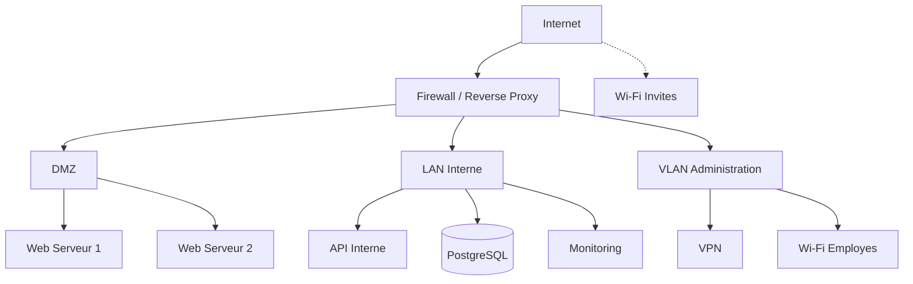

---
tags:
  - Réseaux
  - Avancé
  - Projet
description: "Projet intégrateur : concevoir et documenter une architecture réseau complete avec segmentation, sécurité et haute disponibilité."
estimated_time: "120 min"
fiche_number: 12
total_fiches: 14
cursus: "Réseaux"
---

# 12 - Projet intégrateur

> **En bref** : Dans ce projet, tu vas concevoir, documenter et déployer une architecture réseau complete pour une PME fictive. Tu vas mettre en pratique toutes les notions du cursus : adressage IP, sous-réseaux, routage, firewall, services réseau, reverse proxy, load balancer et haute disponibilité. Lecture estimée : 120 min.

## Prérequis

- Avoir lu toutes les fiches du cursus (01 a 11)
- Savoir utiliser Docker Compose
- Connaitre les commandes de diagnostic réseau (ping, traceroute, nmap, ss, tcpdump)

## Objectif de cette fiche

A la fin de cette fiche, tu auras conçu une architecture réseau complete avec un plan d'adressage, des règles de firewall, une DMZ, un reverse proxy avec load balancing et tu sauras documenter et tester chaque composant.

---

## Concepts

Cette section rappelle les concepts clés que tu vas mettre en pratique. Lis-la pour te rafraichir la mémoire avant de passer aux étapes pratiques.

### Cahier des charges

Tu travailles pour une PME fictive "TechNova" qui a besoin d'une architecture réseau pour :

- Un site web public (accessible depuis Internet)
- Une API interne (accessible uniquement depuis le réseau interne)
- Une base de données PostgreSQL (accessible uniquement depuis les serveurs applicatifs)
- Un service de monitoring (accessible depuis le réseau d'administration)
- Un accès Wi-Fi pour les employés
- Un accès Wi-Fi invite isole du réseau interne

**Contraintes** :

- Le site web doit supporter 1000 utilisateurs simultanes (haute disponibilité requise)
- Les données doivent rester en France (conformité RGPD)
- Le budget est limite : maximum 3 serveurs physiques
- L'administration se fait exclusivement via un VPN

### Architecture cible

L'architecture suit le modèle a 3 zones :



### Plan d'adressage IP

| Zone | Sous-réseau | Masque | Passerelle | VLAN | Utilisation |
| --- | --- | --- | --- | --- | --- |
| DMZ | 10.0.1.0/24 | 255.255.255.0 | 10.0.1.1 | 10 | Serveurs web publics |
| LAN Interne | 10.0.2.0/24 | 255.255.255.0 | 10.0.2.1 | 20 | Serveurs applicatifs, BDD |
| Administration | 10.0.3.0/24 | 255.255.255.0 | 10.0.3.1 | 30 | Administration, monitoring |
| Wi-Fi Employés | 10.0.4.0/24 | 255.255.255.0 | 10.0.4.1 | 40 | Postes de travail Wi-Fi |
| Wi-Fi Invites | 10.0.5.0/24 | 255.255.255.0 | 10.0.5.1 | 50 | Internet uniquement |

### Attribution des adresses

| Machine | Adresse IP | Zone | Role |
| --- | --- | --- | --- |
| Firewall (ext) | IP publique | Internet | Point d'entrée |
| Firewall (dmz) | 10.0.1.1 | DMZ | Passerelle DMZ |
| Firewall (lan) | 10.0.2.1 | LAN | Passerelle LAN |
| Firewall (admin) | 10.0.3.1 | Admin | Passerelle admin |
| Web Serveur 1 | 10.0.1.11 | DMZ | Nginx + application |
| Web Serveur 2 | 10.0.1.12 | DMZ | Nginx + application |
| API Interne | 10.0.2.11 | LAN | API REST |
| PostgreSQL | 10.0.2.21 | LAN | Base de données |
| Monitoring | 10.0.3.11 | Admin | Prometheus + Grafana |

---

## Étapes Pratiques

### Étape 1 : Creer la structure du projet

```bash
# Cree l'arborescence du projet
mkdir -p ~/reseau-cursus/projet-integrateur/{config,docs}
cd ~/reseau-cursus/projet-integrateur
```

---

### Étape 2 : Creer le Docker Compose de l'architecture

```bash
# Cree le fichier Docker Compose
tee docker-compose.yml << 'COMPOSE'
services:
  # === REVERSE PROXY / LOAD BALANCER ===
  reverse-proxy:
    image: nginx:1.26
    ports:
      - "80:80"
      - "443:443"
    volumes:
      - ./config/nginx.conf:/etc/nginx/nginx.conf:ro
    networks:
      dmz:
        ipv4_address: 10.0.1.2
      lan:
        ipv4_address: 10.0.2.2
    depends_on:
      - web1
      - web2
    restart: unless-stopped

  # === DMZ - Serveurs Web ===
  web1:
    image: nginx:1.26-alpine
    volumes:
      - ./config/web1.html:/usr/share/nginx/html/index.html:ro
    networks:
      dmz:
        ipv4_address: 10.0.1.11
    restart: unless-stopped

  web2:
    image: nginx:1.26-alpine
    volumes:
      - ./config/web2.html:/usr/share/nginx/html/index.html:ro
    networks:
      dmz:
        ipv4_address: 10.0.1.12
    restart: unless-stopped

  # === LAN - API Interne ===
  api:
    image: nginx:1.26-alpine
    volumes:
      - ./config/api-response.json:/usr/share/nginx/html/api/health/index.html:ro
      - ./config/api-nginx.conf:/etc/nginx/conf.d/default.conf:ro
    networks:
      lan:
        ipv4_address: 10.0.2.11
    restart: unless-stopped

  # === LAN - Base de donnees ===
  postgres:
    image: postgres:16-alpine
    environment:
      POSTGRES_DB: technova
      POSTGRES_USER: app
      POSTGRES_PASSWORD: motdepasse_securise
    volumes:
      - postgres_data:/var/lib/postgresql/data
    networks:
      lan:
        ipv4_address: 10.0.2.21
    restart: unless-stopped

  # === ADMIN - Monitoring ===
  prometheus:
    image: prom/prometheus:v2.53.3
    volumes:
      - ./config/prometheus.yml:/etc/prometheus/prometheus.yml:ro
    networks:
      admin:
        ipv4_address: 10.0.3.11
      dmz:
        ipv4_address: 10.0.1.20
      lan:
        ipv4_address: 10.0.2.20
    restart: unless-stopped

  grafana:
    image: grafana/grafana:11.4.0
    environment:
      GF_SECURITY_ADMIN_PASSWORD: admin
    ports:
      - "3000:3000"
    networks:
      admin:
        ipv4_address: 10.0.3.12
    restart: unless-stopped

volumes:
  postgres_data:

networks:
  dmz:
    driver: bridge
    ipam:
      config:
        - subnet: 10.0.1.0/24
          gateway: 10.0.1.1
  lan:
    driver: bridge
    ipam:
      config:
        - subnet: 10.0.2.0/24
          gateway: 10.0.2.1
  admin:
    driver: bridge
    ipam:
      config:
        - subnet: 10.0.3.0/24
          gateway: 10.0.3.1
COMPOSE
```

---

### Étape 3 : Creer la configuration du reverse proxy

```bash
# Configuration Nginx : reverse proxy + load balancer
tee config/nginx.conf << 'EOF'
events {
    worker_connections 1024;
}

http {
    # Pool de serveurs web en DMZ
    upstream web_backend {
        least_conn;
        server 10.0.1.11:80;  # Web Serveur 1
        server 10.0.1.12:80;  # Web Serveur 2
    }

    # Pool API interne
    upstream api_backend {
        server 10.0.2.11:80;  # API Interne
    }

    # Site web public - accessible depuis Internet
    server {
        listen 80;
        server_name technova.example.com;

        # Repartition de charge vers les serveurs web
        location / {
            proxy_pass http://web_backend;
            proxy_set_header Host $host;
            proxy_set_header X-Real-IP $remote_addr;
            proxy_set_header X-Forwarded-For $proxy_add_x_forwarded_for;
            proxy_set_header X-Forwarded-Proto $scheme;

            # Timeout de connexion au backend
            proxy_connect_timeout 5s;
            proxy_read_timeout 30s;
        }

        # Health check du reverse proxy
        location /health {
            access_log off;
            return 200 '{"status":"ok"}';
            add_header Content-Type application/json;
        }
    }

    # API interne - accessible uniquement depuis le LAN
    server {
        listen 80;
        server_name api.technova.local;

        location / {
            proxy_pass http://api_backend;
            proxy_set_header Host $host;
            proxy_set_header X-Real-IP $remote_addr;
        }
    }
}
EOF
```

---

### Étape 4 : Creer les fichiers de contenu

```bash
# Contenu du serveur web 1
tee config/web1.html << 'EOF'
<!DOCTYPE html>
<html>
<head><title>TechNova</title></head>
<body>
<h1>TechNova - Serveur 1</h1>
<p>Site web de la PME TechNova</p>
</body>
</html>
EOF

# Contenu du serveur web 2
tee config/web2.html << 'EOF'
<!DOCTYPE html>
<html>
<head><title>TechNova</title></head>
<body>
<h1>TechNova - Serveur 2</h1>
<p>Site web de la PME TechNova</p>
</body>
</html>
EOF

# Reponse de l'API interne
tee config/api-response.json << 'EOF'
{"service":"api-technova","version":"1.0.0","status":"healthy"}
EOF

# Configuration Nginx pour l'API
tee config/api-nginx.conf << 'EOF'
server {
    listen 80;
    root /usr/share/nginx/html;

    location /api/ {
        try_files $uri $uri/ =404;
        add_header Content-Type application/json;
    }
}
EOF
```

---

### Étape 5 : Creer la configuration Prometheus

```bash
# Configuration Prometheus pour monitorer l'infrastructure
tee config/prometheus.yml << 'EOF'
global:
  scrape_interval: 15s

scrape_configs:
  # Prometheus lui-meme
  - job_name: "prometheus"
    static_configs:
      - targets: ["localhost:9090"]

  # Reverse proxy (metriques Nginx stub_status si active)
  - job_name: "reverse-proxy"
    metrics_path: /health
    static_configs:
      - targets: ["10.0.1.2:80"]

  # Serveurs web
  - job_name: "web-servers"
    metrics_path: /
    static_configs:
      - targets: ["10.0.1.11:80", "10.0.1.12:80"]
        labels:
          zone: "dmz"

  # API interne
  - job_name: "api"
    metrics_path: /api/health/
    static_configs:
      - targets: ["10.0.2.11:80"]
        labels:
          zone: "lan"
EOF
```

---

### Étape 6 : Lancer l'architecture

```bash
# Lance tous les services
cd ~/reseau-cursus/projet-integrateur && docker compose up -d
```

**Résultat attendu** :

```text
[+] Running 8/8
 ✔ Network projet-integrateur_dmz      Created
 ✔ Network projet-integrateur_lan      Created
 ✔ Network projet-integrateur_admin    Created
 ✔ Container projet-integrateur-web1-1          Started
 ✔ Container projet-integrateur-web2-1          Started
 ✔ Container projet-integrateur-api-1           Started
 ✔ Container projet-integrateur-postgres-1      Started
 ✔ Container projet-integrateur-prometheus-1    Started
 ✔ Container projet-integrateur-grafana-1       Started
 ✔ Container projet-integrateur-reverse-proxy-1 Started
```

```bash
# Verifie que tous les services sont en cours d'execution
docker compose ps
```

---

### Étape 7 : Tester la répartition de charge

```bash
# Envoie 10 requetes pour verifier la repartition
for i in $(seq 1 10); do
  curl -s http://localhost | grep -o "Serveur [0-9]"
done
```

**Résultat attendu** :

```text
Serveur 1
Serveur 2
Serveur 1
Serveur 2
Serveur 1
Serveur 2
Serveur 1
Serveur 2
Serveur 1
Serveur 2
```

---

### Étape 8 : Tester le failover

```bash
# Arrete le serveur web 1
docker compose stop web1

# Verifie que tout le trafic va vers le serveur 2
for i in $(seq 1 5); do
  curl -s http://localhost | grep -o "Serveur [0-9]"
done
```

**Résultat attendu** :

```text
Serveur 2
Serveur 2
Serveur 2
Serveur 2
Serveur 2
```

```bash
# Redemarre le serveur 1
docker compose start web1

# Verifie le retour a la normale
for i in $(seq 1 4); do
  curl -s http://localhost | grep -o "Serveur [0-9]"
done
```

**Résultat attendu** :

```text
Serveur 1
Serveur 2
Serveur 1
Serveur 2
```

---

### Étape 9 : Tester l'isolation des réseaux

```bash
# Verifie que le serveur web 1 (DMZ) ne peut PAS acceder a la base de donnees (LAN)
docker compose exec web1 sh -c "ping -c 2 10.0.2.21 2>&1 || echo 'Acces refuse - isolation OK'"
```

**Résultat attendu** :

```text
PING 10.0.2.21 (10.0.2.21): 56 data bytes
--- 10.0.2.21 ping statistics ---
2 packets transmitted, 0 packets received, 100% packet loss
Acces refuse - isolation OK
```

```bash
# Verifie que l'API (LAN) PEUT acceder a la base de donnees (LAN)
docker compose exec api sh -c "ping -c 2 10.0.2.21"
```

**Résultat attendu** :

```text
PING 10.0.2.21 (10.0.2.21): 56 data bytes
64 bytes from 10.0.2.21: seq=0 ttl=64 time=0.123 ms
64 bytes from 10.0.2.21: seq=1 ttl=64 time=0.098 ms
```

---

### Étape 10 : Tester la connectivite de la base de données

```bash
# Verifie que PostgreSQL est accessible depuis le reseau LAN
docker compose exec api sh -c "nc -zv 10.0.2.21 5432"
```

**Résultat attendu** :

```text
10.0.2.21 (10.0.2.21:5432) open
```

```bash
# Teste la connexion PostgreSQL
docker compose exec postgres psql -U app -d technova -c "SELECT version();"
```

**Résultat attendu** :

```text
                                                   version
--------------------------------------------------------------------------------------------------------------
 PostgreSQL 16.x on x86_64-pc-linux-musl, compiled by gcc ...
```

---

### Étape 11 : Verifier le monitoring

```bash
# Verifie que Prometheus collecte les metriques
curl -s http://localhost:9090/api/v1/targets | python3 -m json.tool | head -20
```

```bash
# Accede a Grafana
echo "Grafana est accessible sur http://localhost:3000 (admin/admin)"
```

---

### Étape 12 : Ecrire les règles de firewall

Bien que Docker gère l'isolation réseau dans cette simulation, voici les règles de firewall qui seraient nécessaires en production :

```bash
# Regles de firewall pour l'architecture TechNova
# A appliquer sur le firewall principal

# === Politique par defaut : tout bloquer ===
# iptables -P INPUT DROP
# iptables -P FORWARD DROP
# iptables -P OUTPUT ACCEPT

# === Connexions etablies ===
# iptables -A FORWARD -m conntrack --ctstate ESTABLISHED,RELATED -j ACCEPT

# === Internet vers DMZ ===
# iptables -A FORWARD -i eth0 -o eth1 -p tcp --dport 80 -d 10.0.1.0/24 -j ACCEPT
# iptables -A FORWARD -i eth0 -o eth1 -p tcp --dport 443 -d 10.0.1.0/24 -j ACCEPT

# === DMZ vers LAN (limite) ===
# Le reverse proxy accede a l'API
# iptables -A FORWARD -s 10.0.1.2 -d 10.0.2.11 -p tcp --dport 80 -j ACCEPT
# Les serveurs web n'accedent PAS au LAN
# iptables -A FORWARD -s 10.0.1.0/24 -d 10.0.2.0/24 -j DROP

# === LAN interne ===
# L'API accede a PostgreSQL
# iptables -A FORWARD -s 10.0.2.11 -d 10.0.2.21 -p tcp --dport 5432 -j ACCEPT

# === Administration ===
# SSH uniquement depuis le VLAN admin
# iptables -A INPUT -s 10.0.3.0/24 -p tcp --dport 22 -j ACCEPT
# iptables -A INPUT -p tcp --dport 22 -j DROP

# === Wi-Fi Invites : Internet uniquement ===
# iptables -A FORWARD -s 10.0.5.0/24 -d 10.0.0.0/8 -j DROP
# iptables -A FORWARD -s 10.0.5.0/24 -o eth0 -j ACCEPT
```

---

### Étape 13 : Documenter l'architecture

```bash
# Cree le document d'architecture
tee docs/architecture.md << 'EOF'
# Architecture Reseau TechNova

## Vue d'ensemble

L'architecture est segmentee en 5 zones :

| Zone | Sous-reseau | VLAN | Role |
| --- | --- | --- | --- |
| DMZ | 10.0.1.0/24 | 10 | Serveurs web publics |
| LAN | 10.0.2.0/24 | 20 | API, base de donnees |
| Administration | 10.0.3.0/24 | 30 | Monitoring, administration |
| Wi-Fi Employes | 10.0.4.0/24 | 40 | Postes de travail |
| Wi-Fi Invites | 10.0.5.0/24 | 50 | Internet uniquement |

## Composants

### Reverse Proxy / Load Balancer
- Technologie : Nginx 1.26
- Algorithme : least_conn
- Backends : 2 serveurs web en DMZ

### Serveurs Web
- 2 instances Nginx en DMZ
- Contenu statique + application
- Failover automatique via le load balancer

### API Interne
- Accessible uniquement depuis le LAN
- Communique avec PostgreSQL

### Base de donnees
- PostgreSQL 16
- Accessible uniquement depuis le LAN (API)
- Donnees persistantes sur volume Docker

### Monitoring
- Prometheus + Grafana
- Reseau administration isole

## Securite

- Firewall avec politique DROP par defaut
- Segmentation en 5 zones/VLAN
- Acces SSH uniquement depuis le VLAN administration
- Wi-Fi invites isole (Internet uniquement)
- Pas d'acces direct Internet vers LAN
EOF
```

---

### Étape 14 : Tests de validation

```bash
# Script de validation automatique
tee docs/validation.sh << 'SCRIPT'
#!/bin/bash
echo "=== Tests de validation - Architecture TechNova ==="
echo ""

# Test 1 : Services actifs
echo "--- Test 1 : Services actifs ---"
docker compose ps --format "table {{.Name}}\t{{.Status}}" | grep -c "Up"
echo "services actifs (attendu : 7)"
echo ""

# Test 2 : Load balancer
echo "--- Test 2 : Load balancer ---"
for i in $(seq 1 4); do
  curl -s http://localhost | grep -o "Serveur [0-9]"
done
echo "(attendu : alternance Serveur 1 / Serveur 2)"
echo ""

# Test 3 : Health check
echo "--- Test 3 : Health check reverse proxy ---"
curl -s http://localhost/health
echo ""
echo ""

# Test 4 : API interne
echo "--- Test 4 : API interne ---"
docker compose exec api curl -s http://localhost/api/health/
echo ""
echo ""

# Test 5 : PostgreSQL
echo "--- Test 5 : PostgreSQL ---"
docker compose exec postgres psql -U app -d technova -c "SELECT 1 AS test;" -t
echo "(attendu : 1)"
echo ""

# Test 6 : Isolation DMZ/LAN
echo "--- Test 6 : Isolation DMZ / LAN ---"
docker compose exec web1 sh -c "ping -c 1 -W 2 10.0.2.21 2>/dev/null && echo 'ECHEC: DMZ peut joindre LAN' || echo 'OK: DMZ isolee du LAN'"
echo ""

echo "=== Fin des tests ==="
SCRIPT

chmod +x docs/validation.sh
```

```bash
# Execute les tests de validation
cd ~/reseau-cursus/projet-integrateur && bash docs/validation.sh
```

---

### Étape 15 : Nettoyer

```bash
# Arrete et supprime les conteneurs et réseaux
cd ~/reseau-cursus/projet-integrateur && docker compose down
```

> **Note - flag `-v`** : La commande `docker compose down -v` supprime aussi les volumes Docker (données persistantes). Ne l'utilise que si tu veux réinitialiser complètement les données stockées. Sans ce flag, les volumes sont conservés et tu peux redémarrer le projet avec `docker compose up` en retrouvant tes données.

---

## Commandes Utiles

| Commande | Action |
| --- | --- |
| `docker compose ps` | Verifie l'état de tous les services |
| `docker compose logs <service>` | Affiche les logs d'un service |
| `docker compose exec <service> sh` | Ouvre un shell dans un conteneur |
| `docker network ls` | Liste les réseaux Docker |
| `docker network inspect <reseau>` | Affiche les détails d'un réseau |
| `curl -s http://localhost/health` | Teste le health check du reverse proxy |

---

## Pièges Frequents

### Piège 1 : Les réseaux Docker ne sont pas de vrais VLAN

⚠️ **Problème** : Dans cette simulation, les réseaux Docker (bridge) isolent les conteneurs au niveau logiciel. En production, l'isolation se fait avec de vrais VLAN sur les switchs réseau. Les performances et le niveau d'isolation sont différents.

✅ **Solution** : Cette simulation est suffisante pour comprendre les concepts. En production, configure des VLAN sur les switchs et des sous-interfaces sur le firewall. Les principes (segmentation, règles de filtrage) restent identiques.

---

### Piège 2 : Oublier la persistance de la base de données

⚠️ **Problème** : Tu utilises `docker compose down -v` et tu perds toutes les données de PostgreSQL.

✅ **Solution** : En production, utilise des volumes nommes et des sauvegardes régulières. Ne lance jamais `docker compose down -v` sans avoir fait une sauvegarde :

```bash
# Sauvegarde avant nettoyage
docker compose exec postgres pg_dump -U app technova > backup.sql
```

---

### Piège 3 : Pas de monitoring du load balancer lui-même

⚠️ **Problème** : Tu monitores les serveurs web mais pas le load balancer. Si le load balancer tombe, tout le service est inaccessible.

✅ **Solution** : En production, utilise Keepalived pour avoir un load balancer redondant (actif/passif) avec une adresse IP virtuelle.

---

### Piège 4 : Règles de firewall trop permissives

⚠️ **Problème** : Tu autorises tout le trafic entre la DMZ et le LAN "pour que ca marche". Un serveur web compromis a alors accès a toute la base de données.

✅ **Solution** : Applique le principe du moindre privilege. Autorise uniquement les flux strictement nécessaires :

```text
DMZ (reverse proxy) -> LAN (API) : TCP port 80 uniquement
LAN (API) -> LAN (PostgreSQL) : TCP port 5432 uniquement
Tout le reste entre DMZ et LAN : BLOQUE
```

---

## Checklist de Validation

- [ ] Le Docker Compose définit au moins 3 réseaux isoles (DMZ, LAN, Admin)
- [ ] Le reverse proxy repartit le trafic entre les serveurs web (load balancing)
- [ ] Le failover fonctionne : arrêter un serveur web ne coupe pas le service
- [ ] Les serveurs web (DMZ) ne peuvent pas accéder a la base de données (LAN)
- [ ] L'API (LAN) peut accéder a la base de données (LAN)
- [ ] PostgreSQL est accessible et fonctionnel
- [ ] Prometheus collecte les métriques des services
- [ ] Les règles de firewall sont documentees
- [ ] L'architecture est documentee avec un plan d'adressage
- [ ] Les tests de validation passent tous

---

## Exercice Pratique

**Enonce** : Etends l'architecture TechNova avec les ameliorations suivantes :

1. Ajoute un troisième serveur web en DMZ pour augmenter la capacité
2. Ajoute un health check Nginx qui verifie que les backends sont disponibles
3. Configure Prometheus pour collecter les métriques de tous les services
4. Créé un dashboard Grafana avec : nombre de serveurs web actifs, latence du reverse proxy, état de PostgreSQL
5. Documente les modifications dans le fichier `docs/architecture.md`

**Indications** :

- Ajoute un service `web3` dans le Docker Compose avec une IP en DMZ (10.0.1.13)
- Ajoute `web3` dans le bloc `upstream` de la configuration Nginx
- Pour le health check Nginx, ajoute `max_fails=3 fail_timeout=30s` dans la configuration upstream
- Pour Grafana, configure Prometheus comme datasource et créé des panels simples

**Résultat attendu** :

- 3 serveurs web repartissent la charge
- Si un serveur tombe, Nginx le detecte et le retire automatiquement du pool
- Le dashboard Grafana montre l'état de l'infrastructure

---

## Solution de l'Exercice

> **Note** : Cette section contient la solution complete. Essaie d'abord de résoudre l'exercice par toi-meme avant de consulter cette solution.

---

**Ajout du serveur web 3 au Docker Compose** :

```yaml
  web3:
    image: nginx:1.26-alpine
    volumes:
      - ./config/web3.html:/usr/share/nginx/html/index.html:ro
    networks:
      dmz:
        ipv4_address: 10.0.1.13
    restart: unless-stopped
```

```bash
echo "<html><body><h1>TechNova - Serveur 3</h1></body></html>" > config/web3.html
```

**Modification du bloc upstream Nginx** :

```text
upstream web_backend {
    least_conn;
    server 10.0.1.11:80 max_fails=3 fail_timeout=30s;
    server 10.0.1.12:80 max_fails=3 fail_timeout=30s;
    server 10.0.1.13:80 max_fails=3 fail_timeout=30s;
}
```

Avec `max_fails=3 fail_timeout=30s`, Nginx retire automatiquement un serveur du pool après 3 échecs consecutifs et le reintegre après 30 secondes.

**Test de la répartition a 3 serveurs** :

```bash
docker compose up -d
for i in $(seq 1 9); do
  curl -s http://localhost | grep -o "Serveur [0-9]"
done
```

Résultat attendu : alternance entre Serveur 1, Serveur 2 et Serveur 3.

**Configuration Grafana** :

1. Accede a Grafana (`http://localhost:3000`, admin/admin)
2. Ajoute Prometheus comme datasource : `http://10.0.3.11:9090`
3. Créé un dashboard avec les panels suivants :

| Panel | Type | Requête |
| --- | --- | --- |
| Serveurs web actifs | Stat | `count(up{job="web-servers"} == 1)` |
| État des services | Table | `up` |

---

## Récapitulatif du cursus

Ce projet intégrateur conclut le cursus **Réseaux**. Voici ce que tu as appris au fil des 12 fiches :

| Fiche | Compétence acquise |
| --- | --- |
| 01 - Introduction aux réseaux | Modèles OSI et TCP/IP, types de réseaux |
| 02 - Adressage IP | Adresses IPv4/IPv6, sous-réseaux, CIDR |
| 03 - Protocoles TCP et UDP | Connexion TCP, datagramme UDP, ports |
| 04 - Ethernet et couche liaison | Trames, adresses MAC, switchs, VLAN |
| 05 - DNS et resolution de noms | Hiérarchie DNS, types d'enregistrements, resolution |
| 06 - Routage et NAT | Tables de routage, NAT, PAT, routage statique et dynamique |
| 07 - Firewalls et filtrage | iptables, nftables, ufw, zones de confiance |
| 08 - Services réseau | HTTP/HTTPS, SSH, FTP/SFTP, SMTP/IMAP, NTP, SNMP |
| 09 - Wi-Fi et sécurité sans fil | 802.11, WPA2/WPA3, canaux, sécurisation |
| 10 - Diagnostic et outils | ping, traceroute, ss, tcpdump, nmap, dig |
| 11 - Architecture d'entreprise | DMZ, proxy, reverse proxy, load balancer, HA |
| 12 - Projet intégrateur | Architecture réseau complete de bout en bout |

Tu es maintenant capable de concevoir, documenter et déployer une architecture réseau segmentee avec sécurité et haute disponibilité.

---

## Navigation

← Fiche précédente : **[11 - Architecture réseau d'entreprise](11-architecture-entreprise.md)**

→ Fiche suivante : **[13 - IPv6 et coexistence IPv4/IPv6](13-ipv6-coexistence.md)**
