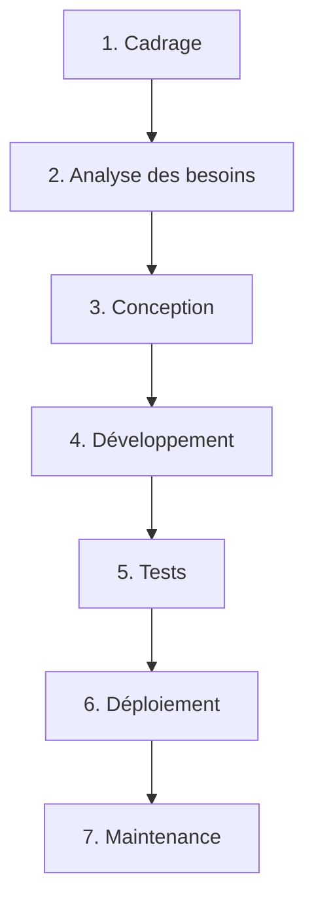
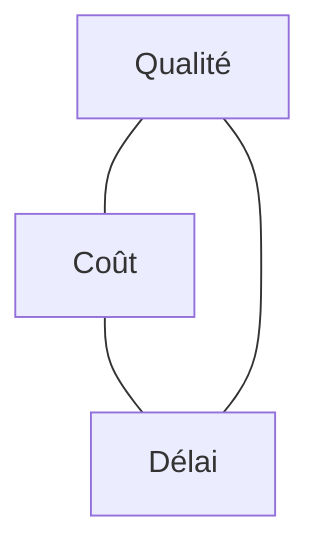

---
tags:
  - Projet
  - Débutant
  - Concept
description: "Introduction à la gestion de projet IT : cycle de vie, cascade vs agile, triangle qualité/coût/délai."
estimated_time: "60 min"
fiche_number: 1
total_fiches: 6
cursus: "Gestion de projet"
---

# 01 - Introduction à la gestion de projet IT

> **En bref** : Comprendre le cycle de vie d'un projet informatique, les différences entre les approches cascade et agile, et le triangle qualité/coût/délai. Lecture estimée : 60 min.

## Prérequis

- Aucune connaissance préalable de la gestion de projet n'est requise (tout est expliqué ci-dessous)

## Objectif de cette fiche

À la fin de cette fiche, tu sauras décrire les phases d'un projet informatique, distinguer l'approche cascade de l'approche agile, et utiliser le triangle qualité/coût/délai pour analyser les contraintes d'un projet.

---

## Concepts

Cette section explique tous les concepts nécessaires. Lis-la entièrement avant de passer aux étapes pratiques.

### Qu'est-ce qu'un projet informatique ?

**Définition** : Un projet informatique est un effort temporaire, avec un début et une fin, qui vise à créer un produit logiciel (application web, application mobile, site internet, outil interne, etc.) en respectant des contraintes de qualité, de coût et de délai.

**Le problème que la gestion de projet résout** :

Sans gestion de projet, voici les problèmes rencontrés :

1. **Pas de direction claire** : l'équipe code sans savoir ce qu'elle doit livrer ni quand.
2. **Dépassement de budget** : sans suivi, les coûts explosent parce que personne ne contrôle le temps passé.
3. **Livraison en retard** : sans planning, les délais glissent de semaine en semaine.
4. **Produit inadapté** : sans recueil des besoins, le logiciel livré ne correspond pas aux attentes des utilisateurs.

**Comment la gestion de projet résout ces problèmes** :

| Problème | Solution apportée par la gestion de projet |
| --- | --- |
| Pas de direction claire | Définition d'objectifs, de livrables et d'un périmètre |
| Dépassement de budget | Estimation, suivi des coûts et des ressources |
| Livraison en retard | Planning, jalons et suivi de l'avancement |
| Produit inadapté | Recueil des besoins, validation régulière avec les utilisateurs |

**Analogie concrète** : Construire un logiciel sans gestion de projet, c'est comme construire une maison sans plan d'architecte. Tu peux poser des briques, mais sans savoir combien de pièces tu veux, quelle sera la surface, ni le budget disponible, tu risques de te retrouver avec un bâtiment inutilisable qui a coûté deux fois le prix prévu.

**Ce que la gestion de projet n'est PAS** :

- La gestion de projet n'est pas de la bureaucratie. L'objectif n'est pas de produire des documents pour le plaisir, mais d'organiser le travail pour livrer un produit qui fonctionne.
- La gestion de projet n'est pas réservée aux grands projets. Même un projet solo de deux semaines bénéficie d'un minimum d'organisation (liste de tâches, priorités, délai).

---

### Qu'est-ce que le cycle de vie d'un projet ?

**Définition** : Le cycle de vie d'un projet est l'ensemble des phases qu'un projet traverse, de l'idée initiale jusqu'à la livraison et la maintenance.

**Le problème que le cycle de vie résout** :

Sans découpage en phases, voici les problèmes rencontrés :

1. **Confusion des activités** : on mélange analyse des besoins, développement et tests sans ordre logique.
2. **Oubli d'étapes critiques** : on oublie de tester, de documenter ou de former les utilisateurs.
3. **Difficulté à mesurer l'avancement** : impossible de dire "on en est à 50%" sans repères.

**Comment le cycle de vie résout ces problèmes** :

| Problème | Solution apportée |
| --- | --- |
| Confusion des activités | Chaque phase a des activités définies |
| Oubli d'étapes critiques | La liste des phases sert de checklist |
| Difficulté à mesurer l'avancement | Chaque phase terminée = un jalon mesurable |

**Les phases classiques d'un projet informatique** :



| Phase | Activité principale | Livrable |
| --- | --- | --- |
| Cadrage | Définir le périmètre, les objectifs et les contraintes | Note de cadrage |
| Analyse des besoins | Recueillir et formaliser les besoins des utilisateurs | Cahier des charges |
| Conception | Définir l'architecture technique et les maquettes | Dossier de conception |
| Développement | Écrire le code | Code source |
| Tests | Vérifier que le logiciel fonctionne correctement | Rapports de tests |
| Déploiement | Mettre le logiciel en production | Application accessible |
| Maintenance | Corriger les bugs, ajouter des fonctionnalités | Mises à jour |

**Analogie concrète** : Le cycle de vie d'un projet, c'est comme les étapes de la préparation d'un repas pour des invités. D'abord tu choisis le menu (cadrage), puis tu listes les ingrédients (analyse), tu prépares le plan de cuisson (conception), tu cuisines (développement), tu goûtes (tests), tu sers (déploiement), et tu ranges la cuisine (maintenance).

---

### Qu'est-ce que le modèle en cascade ?

**Définition** : Le modèle en cascade (waterfall) est une approche séquentielle de gestion de projet où chaque phase doit être terminée avant de passer à la suivante. On ne revient pas en arrière.

**Le problème que le modèle en cascade résout** :

Sans méthode structurée, voici les problèmes rencontrés :

1. **Travail désorganisé** : chacun fait ce qu'il veut, quand il veut.
2. **Pas de validation intermédiaire** : on découvre les problèmes trop tard.
3. **Documentation insuffisante** : rien n'est formalisé.

**Comment le modèle en cascade résout ces problèmes** :

| Problème | Solution apportée |
| --- | --- |
| Travail désorganisé | Séquence stricte de phases |
| Pas de validation intermédiaire | Validation à la fin de chaque phase |
| Documentation insuffisante | Chaque phase produit un livrable documenté |

**Analogie concrète** : Le modèle en cascade, c'est comme une chaîne de montage automobile. Chaque poste fait son travail dans l'ordre : d'abord le châssis, puis le moteur, puis la carrosserie, puis la peinture. On ne peint pas avant que la carrosserie soit posée.

**Les limites du modèle en cascade** :

- **Rigidité** : si le client change d'avis après la phase de conception, il faut tout reprendre depuis le début.
- **Effet tunnel** : le client ne voit le produit qu'à la fin. S'il ne correspond pas aux attentes, c'est trop tard.
- **Retours coûteux** : corriger une erreur de conception pendant le développement coûte beaucoup plus cher que la corriger pendant la conception.

---

### Qu'est-ce que l'approche agile ?

**Définition** : L'approche agile est une philosophie de gestion de projet qui privilégie la livraison incrémentale et itérative, la collaboration avec le client, et l'adaptation au changement plutôt que le suivi rigide d'un plan.

**Le problème que l'approche agile résout** :

Sans agilité, voici les problèmes rencontrés :

1. **Besoins qui changent** : dans un projet de 12 mois, les besoins du client évoluent, mais le plan initial ne permet pas de s'adapter.
2. **Effet tunnel** : le client attend des mois avant de voir un résultat concret.
3. **Risque élevé** : on investit beaucoup avant de valider que la direction est la bonne.

**Comment l'approche agile résout ces problèmes** :

| Problème | Solution apportée par l'agilité |
| --- | --- |
| Besoins qui changent | Cycles courts (1-4 semaines) permettant de réorienter le projet |
| Effet tunnel | Livraison d'un incrément fonctionnel à chaque itération |
| Risque élevé | Validation régulière avec le client, ajustements continus |

**Analogie concrète** : L'agilité, c'est comme cuisiner pour quelqu'un que tu ne connais pas bien. Plutôt que de préparer un repas complet de 5 plats en espérant que tout plaise, tu prépares une entrée, tu la fais goûter, tu ajustes l'assaisonnement pour le plat suivant, et ainsi de suite.

**Comparaison cascade vs agile** :

| Cascade | Agile |
| --- | --- |
| Phases séquentielles, on ne revient pas en arrière | Cycles itératifs, on ajuste en continu |
| Livraison unique à la fin du projet | Livraisons fréquentes (toutes les 1-4 semaines) |
| Plan détaillé en début de projet | Plan adaptatif, ajusté à chaque itération |
| Documentation exhaustive | Documentation suffisante, focus sur le logiciel fonctionnel |
| Résistant au changement | Accueille le changement |
| Adapté aux projets stables (BTP, industrie) | Adapté aux projets incertains (logiciel, innovation) |

**Ce que l'agilité n'est PAS** :

- L'agilité n'est pas l'absence de plan. Une équipe agile planifie, mais à court terme et de manière adaptative.
- L'agilité n'est pas l'absence de documentation. On documente ce qui est utile, pas ce qui est superflu.
- L'agilité n'est pas du chaos organisé. L'agilité repose sur des cadres précis (Scrum, Kanban) avec des règles strictes.

---

### Qu'est-ce que le triangle qualité/coût/délai ?

**Définition** : Le triangle qualité/coût/délai (aussi appelé "triangle de fer" ou "triple contrainte") représente les trois contraintes fondamentales de tout projet. Modifier l'une affecte les deux autres.

**Le problème que le triangle résout** :

Sans cette vision, voici les problèmes rencontrés :

1. **Promesses irréalistes** : on promet au client un produit parfait, pas cher et livré demain.
2. **Décisions sans analyse** : on ajoute des fonctionnalités sans mesurer l'impact sur le délai ou le budget.
3. **Conflits dans l'équipe** : chacun tire dans une direction différente sans cadre de décision.

**Comment le triangle résout ces problèmes** :

| Problème | Solution apportée |
| --- | --- |
| Promesses irréalistes | Le triangle montre qu'on ne peut pas tout avoir |
| Décisions sans analyse | Chaque décision est évaluée sur les trois axes |
| Conflits dans l'équipe | Cadre objectif pour arbitrer les priorités |



**Les trois contraintes** :

- **Qualité** (périmètre) : le nombre de fonctionnalités et leur niveau de finition.
- **Coût** : le budget disponible (salaires, outils, infrastructure).
- **Délai** : le temps disponible pour livrer.

**La règle fondamentale** : on ne peut optimiser que deux contraintes sur trois. Si tu veux un produit de haute qualité livré rapidement, il faudra plus de budget. Si tu veux un produit pas cher et rapide, il faudra réduire la qualité (moins de fonctionnalités). Il n'y a pas d'exception.

**Analogie concrète** : Imagine que tu commandes un meuble sur mesure chez un artisan. Tu peux demander un meuble de haute qualité, pas cher et livré demain. L'artisan te répondra : "choisis-en deux". Un beau meuble livré vite coûtera cher. Un beau meuble pas cher prendra du temps. Un meuble pas cher et rapide sera de qualité moyenne.

---

## Étapes Pratiques

### Étape 1 : Identifier les phases d'un projet réel

Prends un exemple de projet informatique simple : créer un site web pour un restaurant.

Liste les phases du cycle de vie de ce projet :

```text
1. Cadrage
   - Objectif : le restaurant veut un site vitrine avec menu et réservation en ligne
   - Budget : 3 000 euros
   - Délai : 2 mois

2. Analyse des besoins
   - Pages : accueil, menu, galerie photos, réservation, contact
   - Fonctionnalités : formulaire de réservation, affichage du menu
   - Contrainte : le restaurateur doit pouvoir modifier le menu lui-même

3. Conception
   - Maquettes des 5 pages
   - Choix technique : WordPress ou développement sur mesure
   - Architecture de la base de données (si réservation)

4. Développement
   - Intégration des maquettes
   - Développement du formulaire de réservation
   - Panneau d'administration pour le menu

5. Tests
   - Tests sur mobile et ordinateur
   - Tests du formulaire de réservation
   - Vérification de l'accessibilité

6. Déploiement
   - Mise en ligne sur l'hébergeur
   - Configuration du nom de domaine
   - Formation du restaurateur

7. Maintenance
   - Mises à jour de sécurité
   - Corrections de bugs remontés par le restaurateur
```

---

### Étape 2 : Appliquer le triangle qualité/coût/délai

Pour le même projet (site du restaurant), analyse trois scénarios :

```text
Scénario A : "On veut tout, vite et pas cher"
- Qualité : haute (5 pages + réservation + admin)
- Coût : faible (3 000 euros)
- Délai : court (2 semaines)
- Verdict : IMPOSSIBLE. Il faut choisir.

Scénario B : "On réduit le périmètre"
- Qualité : réduite (3 pages statiques, pas de réservation)
- Coût : faible (3 000 euros)
- Délai : court (2 semaines)
- Verdict : RÉALISTE.

Scénario C : "On garde tout mais on prend le temps"
- Qualité : haute (5 pages + réservation + admin)
- Coût : faible (3 000 euros)
- Délai : long (3 mois)
- Verdict : RÉALISTE.
```

---

### Étape 3 : Classer un projet cascade ou agile

Pour chaque situation, détermine si l'approche cascade ou agile est plus adaptée :

```text
Situation 1 : Logiciel de gestion pour un hôpital
- Besoins stables (réglementation stricte)
- Documentation exhaustive obligatoire
- Validation par un organisme certificateur
→ Cascade (besoins stables, documentation obligatoire, certification)

Situation 2 : Application mobile de livraison de repas
- Marché en évolution rapide
- Besoins utilisateurs incertains
- Besoin de livrer vite pour tester le marché
→ Agile (besoins incertains, besoin de feedback rapide)

Situation 3 : Refonte d'un site e-commerce existant
- Fonctionnalités existantes à reproduire (besoins connus)
- Nouvelles fonctionnalités à expérimenter
- Budget limité
→ Agile (mix de besoins connus et d'expérimentation)
```

---

## Pièges Fréquents

### Piège 1 : Croire que l'agile dispense de planifier

**Problème** : "On est agile, pas besoin de plan." Cette confusion conduit à un travail sans direction.

**Solution** : L'agilité planifie, mais autrement. Il y a un plan de release (vision à 3-6 mois), un plan de sprint (détaillé pour 1-4 semaines), et un backlog priorisé. La différence avec la cascade, c'est que le plan s'adapte.

---

### Piège 2 : Sous-estimer la maintenance

**Problème** : On considère le projet terminé au déploiement. En réalité, la maintenance représente 60 à 80% du coût total d'un logiciel sur sa durée de vie.

**Solution** : Intègre la maintenance dans le budget et le planning dès le cadrage. Prévois un contrat de maintenance avec le client.

---

### Piège 3 : Négliger le triangle de fer

**Problème** : Accepter toutes les demandes du client sans évaluer l'impact sur le coût et le délai. Résultat : surcharge de travail, retard, frustration.

**Solution** : À chaque nouvelle demande, pose trois questions : "Quel est l'impact sur la qualité ? Sur le coût ? Sur le délai ?" Si le client veut plus de fonctionnalités, il doit accepter un délai plus long ou un budget plus élevé.

---

## Checklist de Validation

- J'ai compris les 7 phases du cycle de vie d'un projet informatique
- Je sais expliquer la différence entre cascade et agile
- Je sais décrire le triangle qualité/coût/délai
- Je sais identifier quelle approche (cascade ou agile) convient à un projet donné
- Je comprends qu'on ne peut optimiser que deux contraintes sur trois

---

## Exercice Pratique

**Énoncé** : Tu es chef de projet pour une startup qui veut créer une application de covoiturage pour les trajets domicile-travail. Le budget est de 50 000 euros et le délai est de 6 mois. Rédige une note de cadrage qui contient :

1. L'objectif du projet en une phrase
2. Le périmètre (fonctionnalités incluses et exclues)
3. Les contraintes (budget, délai, techniques)
4. L'approche choisie (cascade ou agile) avec justification
5. Les risques identifiés (au moins 3)

**Indications** :

- Limite-toi aux fonctionnalités essentielles pour un MVP (Minimum Viable Product)
- Pense aux fonctionnalités que tu reportes à une version ultérieure
- Identifie les risques liés au marché, à la technique et à l'équipe

**Résultat attendu** : Une note de cadrage d'environ une page, structurée avec les 5 sections demandées.

---

## Solution de l'Exercice

> **Note** : Cette section contient la solution complète. Essaie d'abord de résoudre l'exercice par toi-même avant de consulter cette solution.

---

```text
NOTE DE CADRAGE - Application CovoitTravail

1. OBJECTIF
Créer une application mobile permettant aux salariés d'une même zone
géographique de partager leurs trajets domicile-travail quotidiens.

2. PÉRIMÈTRE
Fonctionnalités incluses (MVP) :
- Inscription / connexion par email
- Création d'un trajet récurrent (adresse départ, adresse arrivée,
  horaires, jours)
- Recherche de covoitureurs compatibles (même trajet, mêmes horaires)
- Messagerie entre conducteur et passager
- Système de notation après trajet

Fonctionnalités exclues (version ultérieure) :
- Paiement intégré
- Intégration GPS temps réel
- Application iOS (MVP Android uniquement)
- Gestion des entreprises et flottes

3. CONTRAINTES
- Budget : 50 000 euros (2 développeurs pendant 6 mois)
- Délai : 6 mois, livraison MVP en production
- Technique : React Native (mobile cross-platform pour préparer iOS),
  PostgreSQL, API REST
- Légale : conformité RGPD (données de géolocalisation)

4. APPROCHE : AGILE (Scrum)
Justification :
- Les besoins utilisateurs sont incertains (startup, pas de base
  d'utilisateurs existante)
- Besoin de feedback rapide pour valider le concept
- Le marché évolue (concurrents, réglementation)
- Sprints de 2 semaines, démo au Product Owner tous les 15 jours

5. RISQUES
- Risque marché : les utilisateurs préfèrent les solutions existantes
  (BlaBlaCar Daily). Mitigation : interviews utilisateurs avant le
  développement.
- Risque technique : la recherche de trajets compatibles est complexe
  (algorithme de matching géographique). Mitigation : prototype de
  l'algorithme en sprint 1.
- Risque équipe : budget serré pour 2 développeurs, pas de marge en
  cas de départ. Mitigation : documentation du code, pair programming.
- Risque légal : traitement de données de géolocalisation soumis au
  RGPD. Mitigation : consulter un DPO dès le cadrage.
```

---

## Navigation

→ Fiche suivante : **[02 - Méthodes agiles](02-methodes-agiles.md)**
