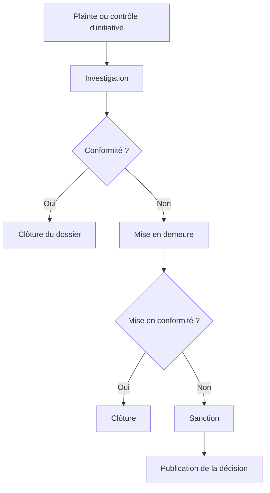

---
tags:
  - Droit
  - Intermédiaire
  - Concept
description: "Conformité RGPD en pratique : registre des traitements, analyse d'impact (DPIA), DPO, sous-traitants, transferts hors UE et sanctions"
estimated_time: "75 min"
fiche_number: 4
total_fiches: 4
cursus: "Droit et RGPD"
---

# 04 - Conformité en pratique

> **En bref** : Cette fiche couvre les aspects pratiques de la mise en conformité RGPD : registre des traitements, analyse d'impact (DPIA), rôle du DPO, gestion des sous-traitants, transferts hors UE, sanctions et rôle de la CNIL. Lecture estimée : 75 min.


!!! warning "Périmètre"
    Cette fiche est pédagogique. Elle **ne constitue pas** un conseil juridique. Pour une conformité réelle, consulte un juriste ou un DPO.

## Prérequis

- Avoir lu la fiche [01 - Introduction au RGPD](01-introduction-rgpd.md) (principes fondamentaux, droits, bases légales)
- Avoir lu la fiche [02 - RGPD pour développeurs](02-rgpd-pour-developpeurs.md) (privacy by design, consentement)
- Avoir lu la fiche [03 - Sécurité des données personnelles](03-securite-donnees.md) (chiffrement, hashing, notification de violation)

## Objectif de cette fiche

À la fin de cette fiche, tu sauras mettre en place un registre des traitements, déterminer quand une analyse d'impact est nécessaire, comprendre le rôle du DPO, encadrer les relations avec les sous-traitants et connaître les sanctions encourues en cas de non-conformité.

---

## Concepts

Cette section explique tous les concepts nécessaires. Lis-la entièrement avant de passer aux étapes pratiques.

### Qu'est-ce que le registre des traitements ?

**Définition** : Le registre des traitements (article 30 du RGPD) est un document obligatoire qui recense l'ensemble des traitements de données personnelles effectués par une organisation. C'est la pierre angulaire de la conformité RGPD.

**Le problème que le registre résout** :

Sans registre, voici les problèmes rencontrés :

1. **Opacité interne** : L'organisation elle-même ne sait pas quelles données elle collecte, pourquoi et où elles sont stockées.

2. **Impossibilité de répondre aux demandes** : En cas de demande d'accès ou de suppression, impossible de savoir où chercher les données.

3. **Non-conformité** : L'absence de registre est une infraction au RGPD en soi, indépendamment de toute autre violation.

**Comment le registre résout ces problèmes** :

| Problème | Solution |
| -------- | -------- |
| Opacité interne | Le registre cartographie tous les traitements |
| Impossibilité de répondre | Le registre indique où chaque type de donnée est stocké |
| Non-conformité | Le registre démontre la démarche de conformité (accountability) |

**Analogie concrète** : Le registre des traitements est comme l'inventaire d'un entrepôt. Sans inventaire, tu ne sais pas ce que tu stockes, où c'est rangé ni depuis quand. En cas de contrôle ou de réclamation, tu ne peux rien retrouver. L'inventaire te permet de localiser chaque article, connaître sa date d'entrée et savoir quand il doit être évacué.

**Ce que le registre n'est PAS** :

- Le registre n'est pas un document juridique complexe réservé aux avocats. C'est un tableau pratique que tout le monde peut remplir.
- Le registre n'est pas figé. Il doit être mis à jour à chaque nouveau traitement ou modification d'un traitement existant.

**Qui doit tenir un registre ?**

Toute organisation de plus de 250 salariés est obligée de tenir un registre. Les organisations de moins de 250 salariés doivent aussi en tenir un si leurs traitements :

- ne sont pas occasionnels
- portent sur des données sensibles
- sont susceptibles de comporter un risque pour les droits des personnes

En pratique, la CNIL recommande à **toutes les organisations** de tenir un registre, quelle que soit leur taille.

---

### Qu'est-ce qu'une analyse d'impact (DPIA) ?

**Définition** : L'analyse d'impact relative à la protection des données (DPIA - Data Protection Impact Assessment), prévue par l'article 35 du RGPD, est une étude approfondie des risques que présente un traitement pour les droits et libertés des personnes concernées.

**Le problème que la DPIA résout** :

Sans DPIA, voici les problèmes rencontrés :

1. **Risques non identifiés** : Les traitements à risque sont mis en production sans évaluation préalable.

2. **Mesures de protection inadaptées** : Sans analyse, les mesures de sécurité sont soit insuffisantes soit disproportionnées.

3. **Responsabilité non documentée** : En cas de contrôle, l'organisation ne peut pas prouver qu'elle a évalué les risques.

**Comment la DPIA résout ces problèmes** :

| Problème | Solution |
| -------- | -------- |
| Risques non identifiés | La DPIA identifie et évalue chaque risque |
| Mesures inadaptées | La DPIA propose des mesures proportionnées |
| Responsabilité non documentée | La DPIA constitue une preuve de diligence |

**Analogie concrète** : La DPIA est comme une étude d'impact environnemental avant de construire une usine. On évalue les risques pour l'environnement (ici, pour les personnes), on propose des mesures pour les réduire, et on documente le tout. Si les risques sont trop élevés même après les mesures, le projet doit être modifié.

**Quand la DPIA est-elle obligatoire ?**

La DPIA est obligatoire quand le traitement est susceptible d'engendrer un **risque élevé** pour les droits et libertés des personnes. Le RGPD et la CNIL fournissent des critères :

| Critère | Exemple |
| ------- | ------- |
| Évaluation systématique et approfondie | Profilage, scoring, décision automatisée |
| Traitement à grande échelle de données sensibles | Base de données médicale d'un hôpital |
| Surveillance systématique à grande échelle | Vidéosurveillance d'un centre commercial |
| Croisement de jeux de données | Fusion de bases clients de plusieurs services |
| Données de personnes vulnérables | Application pour mineurs, patients |
| Usage innovant de technologies | Reconnaissance faciale, IA prédictive |

**Règle pratique** : si le traitement coche au moins **2 critères** de cette liste, une DPIA est probablement obligatoire.

---

### Qu'est-ce que le DPO ?

**Définition** : Le DPO (Data Protection Officer - Délégué à la Protection des Données) est la personne désignée au sein d'une organisation pour veiller à la conformité au RGPD. Son rôle est défini par les articles 37 à 39 du RGPD.

**Le problème que le DPO résout** :

Sans DPO, voici les problèmes rencontrés :

1. **Absence de pilotage** : Personne n'est responsable de la conformité RGPD au quotidien.

2. **Manque de compétence** : Les questions RGPD sont traitées de manière informelle, sans expertise dédiée.

3. **Pas d'interlocuteur** : La CNIL et les personnes concernées n'ont pas de point de contact identifié.

**Comment le DPO résout ces problèmes** :

| Problème | Solution |
| -------- | -------- |
| Absence de pilotage | Le DPO coordonne la conformité |
| Manque de compétence | Le DPO apporte l'expertise juridique et technique |
| Pas d'interlocuteur | Le DPO est le point de contact CNIL et personnes concernées |

**Missions du DPO** :

| Mission | Description |
| ------- | ----------- |
| Informer et conseiller | Former les équipes, conseiller la direction |
| Contrôler la conformité | Vérifier le respect du RGPD au quotidien |
| Coopérer avec la CNIL | Être le point de contact en cas de contrôle |
| Réaliser les DPIA | Piloter les analyses d'impact |
| Gérer les demandes | Traiter les demandes d'exercice des droits |

**Quand le DPO est-il obligatoire ?**

| Situation | DPO obligatoire ? |
| --------- | ----------------- |
| Organisme public | Oui, toujours |
| Suivi régulier et systématique de personnes à grande échelle | Oui |
| Traitement à grande échelle de données sensibles | Oui |
| PME sans traitement à risque | Non, mais recommandé |

**Ce que le DPO n'est PAS** :

- Le DPO n'est pas personnellement responsable de la conformité. C'est le **responsable de traitement** (le dirigeant) qui porte la responsabilité légale.
- Le DPO n'est pas un simple exécutant. Il doit être indépendant et ne pas recevoir d'instructions sur l'exercice de ses missions.

---

### Les sous-traitants et l'article 28

**Définition** : Un sous-traitant (au sens du RGPD) est toute entité qui traite des données personnelles pour le compte du responsable de traitement. L'article 28 impose un encadrement contractuel strict de cette relation.

**Le problème que l'article 28 résout** :

Sans encadrement des sous-traitants, voici les problèmes rencontrés :

1. **Perte de contrôle** : Le responsable de traitement ne sait pas comment le sous-traitant protège les données.

2. **Sous-traitance en cascade** : Le sous-traitant délègue à un autre sous-traitant sans contrôle ni information.

3. **Responsabilité floue** : En cas de fuite, personne ne sait qui est responsable.

**Comment l'article 28 résout ces problèmes** :

| Problème | Solution |
| -------- | -------- |
| Perte de contrôle | Clauses contractuelles obligatoires (sécurité, audit, suppression) |
| Sous-traitance en cascade | Obligation d'informer et d'obtenir l'autorisation pour tout sous-traitant ultérieur |
| Responsabilité floue | Le contrat définit les responsabilités de chaque partie |

**Analogie concrète** : L'article 28 est comme un contrat de sous-traitance dans le bâtiment. L'architecte (responsable de traitement) engage un électricien (sous-traitant). Le contrat précise exactement ce que l'électricien doit faire, quelles normes respecter, et l'architecte garde le droit de contrôler le travail. L'électricien ne peut pas déléguer à un autre artisan sans l'accord de l'architecte.

**Clauses obligatoires du contrat de sous-traitance (article 28)** :

| Clause | Description |
| ------ | ----------- |
| Objet et durée | Finalité du traitement et durée du contrat |
| Nature du traitement | Types de données traitées et catégories de personnes |
| Instructions documentées | Le sous-traitant agit uniquement sur instruction du responsable |
| Confidentialité | Engagement de confidentialité des personnes ayant accès aux données |
| Sécurité | Mesures techniques et organisationnelles (article 32) |
| Sous-traitance ultérieure | Obligation d'information et d'autorisation préalable |
| Aide à la conformité | Aide pour répondre aux demandes des personnes (droits) |
| Restitution ou suppression | À la fin du contrat, les données sont restituées ou supprimées |
| Audits | Droit d'audit du responsable de traitement |

**Exemples de sous-traitants courants** :

| Service | Rôle | Données traitées |
| ------- | ---- | ---------------- |
| Hébergeur cloud (OVH, AWS) | Stockage des bases de données | Toutes les données de l'application |
| Service d'e-mail (SendGrid, Mailjet) | Envoi d'e-mails | Adresses e-mail, noms |
| Analytics (Google Analytics, Matomo) | Statistiques de navigation | IP, comportement de navigation |
| CDN (Cloudflare) | Distribution de contenu | Adresses IP des visiteurs |
| Service de paiement (Stripe) | Traitement des paiements | Données de carte bancaire |

---

### Les transferts de données hors UE

**Définition** : Un transfert de données hors de l'Union européenne est tout envoi de données personnelles vers un pays situé en dehors de l'Espace économique européen (EEE). Le RGPD encadre strictement ces transferts (chapitre V, articles 44 à 49).

**Le problème que cette réglementation résout** :

Sans réglementation des transferts, voici les problèmes rencontrés :

1. **Niveau de protection insuffisant** : Certains pays n'offrent aucune protection des données personnelles.

2. **Surveillance étatique** : Certains pays permettent l'accès massif de leurs services de renseignement aux données des entreprises.

**Mécanismes autorisés pour les transferts hors UE** :

| Mécanisme | Description | Exemple |
| --------- | ----------- | ------- |
| Décision d'adéquation | La Commission européenne reconnaît que le pays offre un niveau de protection suffisant | Suisse, Japon, Royaume-Uni, Canada (secteur commercial) |
| Data Privacy Framework (DPF) | Cadre spécifique UE-États-Unis adopté en 2023 | Entreprises américaines certifiées DPF |
| Clauses contractuelles types (CCT) | Clauses standardisées par la Commission européenne intégrées au contrat | Contrat avec un hébergeur hors UE |
| Règles d'entreprise contraignantes (BCR) | Règles internes d'un groupe multinational | Google, Microsoft (usage interne) |
| Consentement explicite | La personne consent au transfert en connaissance de cause | Dernier recours, à utiliser rarement |

**Point de vigilance** : L'utilisation de services américains (Google Cloud, AWS, Azure) implique un transfert hors UE. S'assurer que le prestataire est certifié DPF ou que des CCT sont en place.

---

### Les sanctions RGPD

**Définition** : Le RGPD prévoit deux niveaux de sanctions administratives, en plus des actions en justice que les personnes concernées peuvent engager.

**Les deux niveaux de sanctions** :

| Niveau | Montant maximal | Types d'infractions |
| ------ | --------------- | ------------------- |
| Niveau 1 | 10 millions EUR ou 2% du CA mondial | Obligations du responsable, du sous-traitant, du DPO, de l'organisme de certification |
| Niveau 2 | 20 millions EUR ou 4% du CA mondial | Principes fondamentaux, droits des personnes, transferts hors UE, non-respect d'une injonction |

**Le montant retenu est toujours le plus élevé** entre le montant fixe et le pourcentage du chiffre d'affaires.

**Exemples de sanctions notables** :

| Année | Entreprise | Montant | Motif |
| ----- | ---------- | ------- | ----- |
| 2022 | Meta (Ireland) | 405 M EUR | Traitement de données de mineurs (Instagram) |
| 2023 | Meta (Ireland) | 1,2 Md EUR | Transferts de données vers les États-Unis |
| 2022 | Google (France) | 150 M EUR | Bannière de cookies non conforme |
| 2021 | Amazon (Luxembourg) | 746 M EUR | Publicité ciblée sans consentement valide |
| 2020 | Google (France) | 100 M EUR | Cookies déposés sans consentement |
| 2019 | British Airways (UK) | 22 M GBP | Violation de données (500 000 clients) |

**Critères pris en compte pour le montant** :

| Critère | Effet sur la sanction |
| ------- | --------------------- |
| Nature et gravité de la violation | Plus la violation est grave, plus la sanction est élevée |
| Nombre de personnes concernées | Un impact massif augmente la sanction |
| Caractère intentionnel ou négligent | L'intention aggrave la sanction |
| Mesures prises pour atténuer le dommage | La coopération et la réactivité réduisent la sanction |
| Antécédents | Des violations antérieures aggravent la sanction |
| Coopération avec l'autorité | La transparence réduit la sanction |

---

### Le rôle de la CNIL

**Définition** : La CNIL (Commission Nationale de l'Informatique et des Libertés) est l'autorité de contrôle française chargée de veiller à la protection des données personnelles. Elle est l'équivalent français des autres autorités européennes (DPA en Irlande, BfDI en Allemagne, etc.).

**Missions de la CNIL** :

| Mission | Description |
| ------- | ----------- |
| Informer et protéger | Répondre aux plaintes des particuliers, publier des guides |
| Accompagner | Conseiller les organisations dans leur mise en conformité |
| Anticiper | Veille technologique, prise de position sur les nouvelles technologies |
| Contrôler | Audits sur place, en ligne ou sur pièces |
| Sanctionner | Amendes, injonctions, mises en demeure |

**Les pouvoirs de contrôle de la CNIL** :

| Type de contrôle | Description |
| ---------------- | ----------- |
| Contrôle sur place | Les agents de la CNIL se rendent dans les locaux |
| Contrôle en ligne | La CNIL vérifie le site web et les pratiques en ligne |
| Contrôle sur pièces | La CNIL demande des documents par courrier |
| Audition | La CNIL convoque le responsable de traitement |

**Procédure de contrôle** :



---

## Étapes Pratiques

### Étape 1 : Remplir un registre des traitements

Voici un modèle de registre des traitements pour une application web fictive. Complète-le en analysant chaque traitement.

**Modèle de registre (une ligne par traitement)** :

| # | Nom du traitement | Finalité | Base légale | Catégories de données | Personnes concernées | Destinataires | Durée de conservation | Mesures de sécurité |
| - | ----------------- | -------- | ----------- | --------------------- | -------------------- | ------------- | --------------------- | ------------------- |
| 1 | Gestion des comptes utilisateurs | Créer et gérer les comptes | Contrat | E-mail, mot de passe hashé, pseudo | Utilisateurs inscrits | Hébergeur (OVH) | Durée du compte + 1 an | HTTPS, bcrypt, contrôle d'accès |
| 2 | Newsletter | Envoi d'informations | Consentement | E-mail | Abonnés newsletter | Mailjet (sous-traitant) | Jusqu'au désabonnement | HTTPS, double opt-in |
| 3 | Analytics | Mesurer l'audience du site | Intérêts légitimes | IP anonymisée, pages visitées | Visiteurs du site | Matomo (auto-hébergé) | 13 mois (reco CNIL) | Anonymisation IP, pas de cookies |
| 4 | Facturation | Édition et conservation des factures | Obligation légale | Nom, adresse, montant | Clients payants | Comptable, administration fiscale | 10 ans | Chiffrement au repos, accès restreint |
| 5 | Support client | Répondre aux demandes | Contrat | E-mail, contenu du message | Utilisateurs demandeurs | Équipe support | 2 ans après clôture du ticket | Accès restreint, journalisation |

**Résultat attendu** : Un tableau complet couvrant tous les traitements de l'organisation, mis à jour régulièrement.

---

### Étape 2 : Réaliser une analyse d'impact simplifiée

L'application web fictive introduit une nouvelle fonctionnalité : un système de recommandation personnalisé basé sur le comportement de navigation et l'historique d'achats des utilisateurs.

**Étape 2a : Vérifier si la DPIA est nécessaire** :

```text
Critères de la CNIL pour la DPIA :

[X] Évaluation systématique et approfondie d'aspects personnels
    → Oui : profilage basé sur le comportement de navigation

[X] Traitement à grande échelle
    → Oui : tous les utilisateurs de la plateforme

[ ] Données sensibles
    → Non : pas de données de santé, opinions, etc.

[ ] Surveillance systématique
    → Non : pas de surveillance en temps réel

[ ] Croisement de jeux de données
    → Oui : navigation + achats

Résultat : 2 critères cochés minimum → DPIA obligatoire
```

**Étape 2b : Remplir la DPIA** :

```text
ANALYSE D'IMPACT (DPIA)

1. DESCRIPTION DU TRAITEMENT
   - Finalité : Recommander des produits personnalisés aux utilisateurs
   - Base légale : Intérêts légitimes (amélioration de l'expérience utilisateur)
   - Données traitées : Pages visitées, produits consultés, historique d'achats,
     temps passé sur chaque page
   - Personnes concernées : Tous les utilisateurs connectés
   - Durée de conservation : 6 mois glissants

2. ÉVALUATION DE LA NÉCESSITÉ ET DE LA PROPORTIONNALITÉ
   - Le traitement est-il nécessaire ? Oui, pour améliorer l'expérience utilisateur
   - Le traitement est-il proportionné ? Les données collectées sont limitées
     au comportement sur le site
   - Les personnes sont-elles informées ? Oui, via la politique de confidentialité
   - Peuvent-elles s'opposer ? Oui, bouton de désactivation dans les paramètres

3. RISQUES IDENTIFIÉS
   | Risque | Gravité | Probabilité | Niveau |
   | Profilage excessif | Modérée | Faible | Modéré |
   | Fuite des données de navigation | Élevée | Faible | Modéré |
   | Discrimination par les recommandations | Modérée | Faible | Faible |

4. MESURES POUR RÉDUIRE LES RISQUES
   | Risque | Mesure | Effet |
   | Profilage excessif | Limitation à 6 mois, pas de catégorisation sensible | Réduit |
   | Fuite des données | Pseudonymisation, chiffrement au repos | Réduit |
   | Discrimination | Audit régulier de l'algorithme, pas de critères sensibles | Réduit |

5. CONCLUSION
   Le traitement peut être mis en oeuvre sous réserve des mesures ci-dessus.
   Revue prévue dans 12 mois.
```

**Résultat attendu** : Un document structuré qui identifie les risques, évalue leur gravité et propose des mesures concrètes.

---

### Étape 3 : Rédiger les clauses d'un contrat de sous-traitance

Tu fais appel à un hébergeur cloud pour stocker la base de données de ton application. Voici les clauses essentielles à inclure dans le contrat :

```text
CONTRAT DE SOUS-TRAITANCE (Article 28 du RGPD)

Entre :
- [Nom de l'entreprise] (responsable de traitement)
- [Nom de l'hébergeur] (sous-traitant)

Article 1 - Objet
Le sous-traitant héberge et maintient la base de données de l'application
[nom] contenant des données personnelles des utilisateurs.

Article 2 - Données traitées
- Catégories de données : identifiants, e-mails, données de profil
- Catégories de personnes : utilisateurs inscrits
- Durée : pendant la durée du contrat d'hébergement

Article 3 - Obligations du sous-traitant
3.1 Le sous-traitant traite les données uniquement sur instruction
    documentée du responsable de traitement.
3.2 Le sous-traitant s'assure que les personnes autorisées à traiter
    les données sont soumises à une obligation de confidentialité.
3.3 Le sous-traitant met en oeuvre les mesures techniques et
    organisationnelles suivantes :
    - Chiffrement des données au repos (AES-256)
    - Chiffrement en transit (TLS 1.3)
    - Sauvegardes quotidiennes chiffrées
    - Contrôle d'accès par rôle
    - Journalisation des accès

Article 4 - Sous-traitance ultérieure
4.1 Le sous-traitant ne recrute pas un autre sous-traitant sans
    l'autorisation écrite préalable du responsable de traitement.
4.2 Le sous-traitant informe le responsable de tout changement
    de sous-traitant ultérieur.

Article 5 - Aide à la conformité
5.1 Le sous-traitant aide le responsable à répondre aux demandes
    d'exercice des droits des personnes.
5.2 Le sous-traitant notifie le responsable de toute violation
    de données dans un délai de 24 heures.

Article 6 - Audit
Le responsable de traitement a le droit de réaliser des audits,
y compris des inspections, pour vérifier le respect du contrat.

Article 7 - Fin du contrat
À l'issue du contrat, le sous-traitant restitue toutes les données
au responsable et supprime les copies existantes, sauf obligation
légale de conservation.
```

**Résultat attendu** : Un contrat couvrant toutes les clauses obligatoires de l'article 28.

---

### Étape 4 : Analyser les sanctions - études de cas

Analyse les cas suivants et détermine le niveau de sanction applicable :

```text
Cas 1 : Une entreprise de 50 salariés, CA de 2 millions EUR
- Violation : pas de registre des traitements
- Catégorie : obligation du responsable
- Niveau de sanction : Niveau 1
- Montant maximal : max(10 M EUR, 2% x 2 M EUR) = 10 M EUR
- Sanction probable : mise en demeure + délai pour se mettre en conformité
  (la CNIL sanctionne rarement les PME de bonne foi)

Cas 2 : Un réseau social, CA de 10 milliards EUR
- Violation : collecte de données de mineurs sans consentement parental
- Catégorie : droits des personnes + principes fondamentaux
- Niveau de sanction : Niveau 2
- Montant maximal : max(20 M EUR, 4% x 10 Md EUR) = 400 M EUR
- Sanction probable : amende significative + injonction de mise en conformité

Cas 3 : Un hôpital public
- Violation : dossiers médicaux accessibles sans authentification
- Catégorie : mesures de sécurité insuffisantes (article 32)
- Niveau de sanction : Niveau 1
- Montant maximal : 10 M EUR (pas de CA pour le public)
- Sanction probable : mise en demeure urgente + amende si récidive
```

**Résultat attendu** : Savoir identifier le niveau de sanction applicable et évaluer le risque financier.

---

## Commandes Utiles

| Ressource | Description |
| --------- | ----------- |
| Modèle de registre CNIL | Modèle officiel téléchargeable (tableur) |
| Guide PIA de la CNIL | Logiciel gratuit pour réaliser des analyses d'impact |
| Clauses contractuelles types | Modèles de clauses pour les transferts hors UE |
| Téléservice notification violation | Portail de notification de violation à la CNIL |
| Guide DPO de la CNIL | Guide pratique sur la désignation et le rôle du DPO |

---

## Pièges Fréquents

### Piège 1 : Croire que le registre est un document unique et figé

⚠️ **Problème** : Rédiger le registre une fois et ne plus le mettre à jour pendant des années.

✅ **Solution** : Le registre est un document vivant. Chaque nouveau traitement, chaque changement de sous-traitant ou de durée de conservation doit y être reporté. Planifier une revue trimestrielle.

---

### Piège 2 : Faire une DPIA pour tous les traitements

⚠️ **Problème** : Réaliser une analyse d'impact pour chaque traitement, même les plus simples, par excès de prudence.

✅ **Solution** : La DPIA n'est obligatoire que pour les traitements susceptibles d'engendrer un risque élevé. Utiliser la grille des 9 critères de la CNIL pour évaluer si une DPIA est nécessaire. Un simple formulaire de contact ne nécessite pas de DPIA.

---

### Piège 3 : Désigner un DPO sans lui donner les moyens

⚠️ **Problème** : Nommer un DPO "pour la forme" sans lui accorder de budget, de temps ni d'accès aux projets.

✅ **Solution** : Le DPO doit être impliqué dès la conception des nouveaux projets (Privacy by Design), disposer d'un budget pour la formation et les outils, et avoir un accès direct à la direction.

---

### Piège 4 : Ignorer les sous-traitants dans la conformité

⚠️ **Problème** : Se concentrer uniquement sur son propre code et oublier que les données transitent par des services tiers (hébergeur, e-mailing, analytics).

✅ **Solution** : Cartographier tous les sous-traitants, vérifier leur conformité RGPD (DPA signé, localisation des données, certifications), et les intégrer au registre des traitements.

---

### Piège 5 : Confondre localisation des serveurs et cadre juridique du prestataire

⚠️ **Problème** : Croire que si le serveur est en France (ou en UE), le sujet des transferts hors UE est automatiquement réglé, même si le prestataire est une filiale d'un groupe hors UE.

✅ **Solution** : La localisation des serveurs n'est qu'un élément. Il faut aussi regarder le cadre contractuel (DPA, clauses types), les éventuels accès depuis hors UE, et les mécanismes d'encadrement (décision d'adéquation, DPF pour les entreprises américaines certifiées, CCT, etc.). En cas de doute, documente l'analyse et fais-toi accompagner : ce point est sensible et évolutif.

---

## Checklist de Validation

- [ ] Je sais remplir un registre des traitements (article 30)
- [ ] Je sais quand une DPIA est obligatoire (au moins 2 critères de risque)
- [ ] Je connais les missions du DPO et quand sa désignation est obligatoire
- [ ] Je sais rédiger les clauses essentielles d'un contrat de sous-traitance (article 28)
- [ ] Je connais les mécanismes autorisés pour les transferts hors UE
- [ ] Je connais les deux niveaux de sanctions et les montants maximaux
- [ ] Je sais que la CNIL peut effectuer des contrôles sur place, en ligne ou sur pièces
- [ ] Je sais utiliser les outils de la CNIL (registre, PIA, téléservice violation)

---

## Exercice Pratique

**Énoncé** : Tu es le nouveau DPO d'une startup de 80 salariés qui développe une application mobile de livraison de repas. L'application est en production depuis 2 ans mais aucune démarche de conformité RGPD n'a été entreprise. Le directeur te demande de préparer un plan de mise en conformité.

**Indications** :

1. Liste les traitements de données personnelles probables pour une application de livraison de repas
2. Remplis les 3 premières lignes du registre des traitements
3. Identifie le traitement qui nécessite une DPIA et justifie pourquoi
4. Liste les sous-traitants probables et les clauses contractuelles à vérifier
5. Propose un calendrier de mise en conformité sur 6 mois

**Résultat attendu** : Un plan de mise en conformité structuré avec un calendrier réaliste.

---

## Solution de l'Exercice

> **Note** : Cette section contient la solution complète. Essaie d'abord de résoudre l'exercice par toi-même avant de consulter cette solution.

---

**1. Traitements probables** :

| Traitement | Données |
| ---------- | ------- |
| Gestion des comptes clients | Nom, e-mail, téléphone, adresse de livraison |
| Gestion des commandes | Historique de commandes, préférences alimentaires |
| Géolocalisation | Position du client et du livreur en temps réel |
| Paiement | Données de carte bancaire (via prestataire) |
| Gestion des livreurs | Nom, téléphone, géolocalisation, données bancaires (RIB) |
| Marketing | E-mails promotionnels, notifications push |
| Analytics | Comportement dans l'application, parcours d'achat |
| Support client | Messages, historique des réclamations |
| Avis et notations | Notes et commentaires des clients et livreurs |

**2. Trois premières lignes du registre** :

| # | Traitement | Finalité | Base légale | Données | Durée | Sous-traitant |
| - | ---------- | -------- | ----------- | ------- | ----- | ------------- |
| 1 | Comptes clients | Gestion des comptes et livraison | Contrat | Nom, e-mail, tel, adresse | Durée du compte + 3 ans | Hébergeur (OVH) |
| 2 | Géolocalisation | Suivi de livraison en temps réel | Consentement | Position GPS client et livreur | Durée de la livraison + 48h | Google Maps API |
| 3 | Paiement | Traitement des transactions | Contrat | Données carte bancaire | Pas stockées (tokenisation Stripe) | Stripe |

**3. DPIA nécessaire : la géolocalisation** :

| Critère | Présent ? | Justification |
| ------- | --------- | ------------- |
| Surveillance systématique | Oui | Suivi GPS en temps réel des livreurs |
| Données de personnes vulnérables | Non | Pas spécifiquement |
| Traitement à grande échelle | Oui | Tous les clients et livreurs actifs |
| Croisement de données | Oui | Position + identité + historique de commandes |

3 critères cochés sur 9 : DPIA obligatoire pour le traitement de géolocalisation.

**4. Sous-traitants et clauses** :

| Sous-traitant | Service | Clauses à vérifier |
| ------------- | ------- | ------------------- |
| OVH | Hébergement | DPA signé, localisation UE, chiffrement |
| Stripe | Paiement | DPA, certification PCI-DSS, pas de stockage de CB |
| Google Maps | Géolocalisation | DPA, transfert hors UE (DPF), durée de conservation |
| Firebase / OneSignal | Notifications push | DPA, transfert hors UE, consentement |
| Mailjet | E-mailing | DPA, localisation UE, gestion des désabonnements |

**5. Calendrier de mise en conformité (6 mois)** :

| Mois | Actions |
| ---- | ------- |
| Mois 1 | Cartographie des traitements, rédaction du registre, nomination officielle du DPO |
| Mois 2 | Audit des sous-traitants, signature des DPA manquants, mise à jour de la politique de confidentialité |
| Mois 3 | DPIA sur la géolocalisation, mise en conformité de la bannière de cookies, gestion du consentement |
| Mois 4 | Implémentation du droit d'accès (export des données), droit à l'effacement (suppression de compte), droit d'opposition |
| Mois 5 | Formation des équipes (développeurs, support, direction), mise en place de la journalisation des accès |
| Mois 6 | Procédure de notification de violation, test de la procédure, audit final, revue du registre |

---

## Navigation

← Fiche précédente : **[Sécurité des données personnelles](03-securite-donnees.md)**
