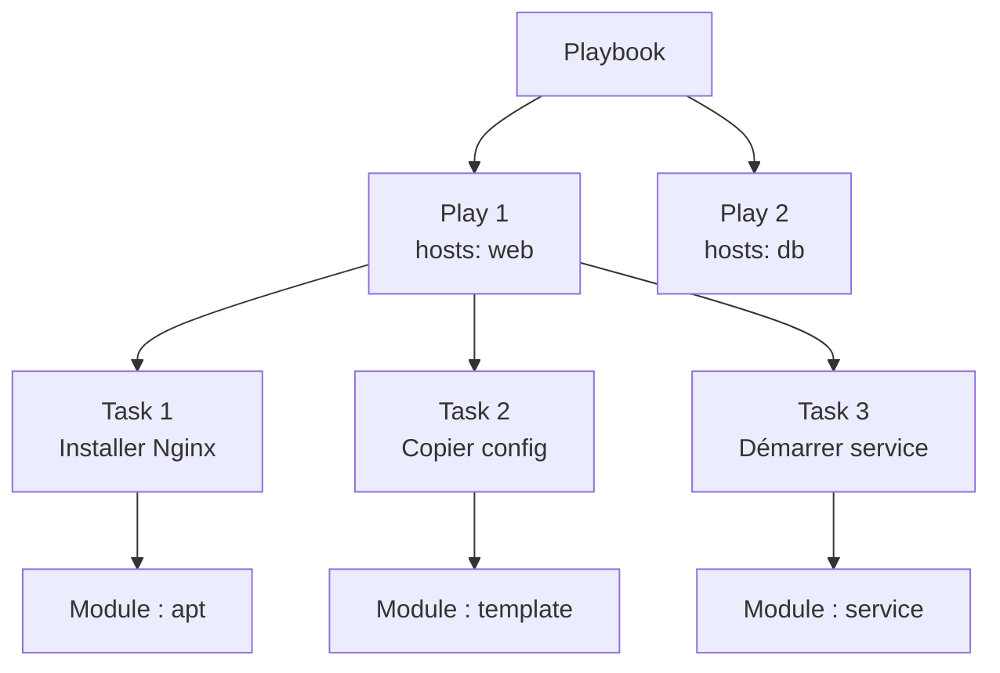

---
tags:
  - Ansible
  - Intermédiaire
  - Pratique
description: "Les Playbooks : Fondamentaux"
estimated_time: "90 min"
fiche_number: 5
total_fiches: 14
cursus: "Ansible"
---

# 05 - Les Playbooks : Fondamentaux

> **En bref** : À la fin de cette fiche, tu sauras écrire et exécuter un playbook Ansible pour automatiser une séquence de tâches sur tes machines. Lecture estimée : 90 min.


## Prérequis

- Fiche **[01 - Introduction à Ansible](01-introduction-ansible.md)** (lue et comprise)
- Fiche **[02 - Installation et Configuration](02-installation-configuration.md)** (Ansible installé et fonctionnel)
- Fiche **[03 - L'Inventaire](03-inventaire.md)** (inventaire configuré avec au moins deux machines)
- Fiche **[04 - Les Commandes Ad-Hoc](04-commandes-ad-hoc-modules.md)** (commandes ad-hoc testées avec succès)
- Savoir écrire du YAML (indentation à 2 espaces, structure clé/valeur)
- Avoir un accès SSH fonctionnel vers tes machines cibles

## Objectif de cette fiche

À la fin de cette fiche, tu sauras écrire et exécuter un playbook Ansible pour automatiser une séquence de tâches sur tes machines.

---

## Concepts

Cette section explique tous les concepts nécessaires. Lis-la entièrement avant de passer aux étapes pratiques.

### Qu'est-ce qu'un playbook ?

**Définition** : Un playbook est un fichier YAML qui décrit un ensemble de tâches à exécuter sur des machines cibles. C'est le format principal d'Ansible pour automatiser des opérations complexes.

**Le problème que les playbooks résolvent** :

Sans playbooks, voici les problèmes rencontrés :

1. **Non-réutilisable** : Les commandes ad-hoc sont des actions ponctuelles. Si tu dois refaire la même séquence demain, tu dois retaper toutes les commandes une par une.

2. **Non-documenté** : Une commande ad-hoc tapée dans le terminal ne laisse aucune trace. Impossible de savoir ce qui a été fait sur un serveur il y a trois mois.

3. **Non-versionnable** : Les commandes tapées dans le terminal ne sont pas stockées dans Git. Tu ne peux pas suivre l'historique des modifications de ton infrastructure.

4. **Séquençage manuel** : Avec les commandes ad-hoc, tu exécutes une commande, attends le résultat, puis lances la suivante. Si tu as 15 étapes, cela devient fastidieux et sujet aux erreurs.

**Comment les playbooks résolvent ces problèmes** :

| Problème             | Solution apportée par les playbooks                                          |
| -------------------- | ---------------------------------------------------------------------------- |
| Non-réutilisable     | Le playbook est un fichier que tu exécutes autant de fois que nécessaire     |
| Non-documenté        | Le fichier YAML documente chaque tâche avec un nom descriptif               |
| Non-versionnable     | Le fichier est stocké dans Git avec un historique complet des modifications  |
| Séquençage manuel    | Toutes les tâches s'exécutent automatiquement dans l'ordre défini            |

**Analogie concrète** : Les commandes ad-hoc sont comme cuisiner en improvisant : tu ajoutes les ingrédients de mémoire, sans mesurer. Un playbook est comme une recette de cuisine écrite : les ingrédients sont listés, les étapes sont numérotées, les quantités sont précises. Tu peux suivre cette recette autant de fois que tu veux et obtenir le même résultat à chaque fois.

**Ce qu'un playbook n'est PAS** :

- Un playbook n'est pas un script shell. Un script shell contient des commandes impératives ("fais ceci, puis fais cela"). Un playbook est déclaratif : il décrit l'état souhaité ("nginx doit être installé et démarré"). Ansible détermine lui-même les actions nécessaires pour atteindre cet état.
- Un playbook n'est pas un programme. Il ne contient pas de logique complexe (boucles, conditions imbriquées). Si ton playbook devient trop complexe, c'est un signe qu'il faut le découper en rôles (abordé dans une fiche ultérieure).

**Comparaison playbook vs commande ad-hoc** :

| Commande ad-hoc                       | Playbook                                       |
| ------------------------------------- | ---------------------------------------------- |
| Une seule tâche à la fois             | Plusieurs tâches en séquence                    |
| Tapée dans le terminal                | Écrite dans un fichier YAML                     |
| Non réutilisable                      | Réutilisable à volonté                          |
| Non versionnée                        | Versionnée dans Git                             |
| Pas de nom descriptif pour la tâche   | Chaque tâche a un nom clair                     |

---

### Qu'est-ce qu'un play ?

**Définition** : Un play est une unité d'exécution dans un playbook. Il associe un groupe de machines cibles à une liste de tâches à exécuter sur ces machines.

**Le problème que les plays résolvent** :

Sans plays, voici les problèmes rencontrés :

1. **Même configuration partout** : Toutes les machines recevraient les mêmes tâches. Or un serveur web et un serveur de base de données n'ont pas les mêmes besoins.

2. **Pas de ciblage** : Impossible de dire "installe nginx sur les serveurs web et postgresql sur les serveurs de base de données" dans un seul fichier.

**Comment les plays résolvent ces problèmes** :

| Problème                  | Solution apportée par les plays                                  |
| ------------------------- | ---------------------------------------------------------------- |
| Même configuration partout | Chaque play cible un groupe de machines différent                |
| Pas de ciblage            | Le champ `hosts` de chaque play définit les machines concernées  |

**Analogie concrète** : Un playbook avec plusieurs plays est comme un planning de rénovation d'appartement. Le premier play concerne la cuisine (poser le carrelage, installer l'évier). Le deuxième play concerne la salle de bain (poser la douche, installer le miroir). Chaque play s'adresse à une pièce différente avec des tâches différentes.

**Structure d'un play** :

Un play contient quatre éléments principaux :

| Élément   | Obligatoire | Rôle                                                              |
| --------- | ----------- | ----------------------------------------------------------------- |
| `name`    | Non         | Description lisible du play (fortement recommandé)                |
| `hosts`   | Oui         | Groupe de machines cibles (défini dans l'inventaire)              |
| `become`  | Non         | `true` pour exécuter les tâches avec les privilèges root (sudo)  |
| `tasks`   | Oui         | Liste ordonnée des tâches à exécuter                              |

**Un playbook peut contenir un ou plusieurs plays** :

- Un playbook avec un seul play : toutes les tâches ciblent le même groupe de machines
- Un playbook avec plusieurs plays : chaque play cible un groupe de machines différent

Le schéma suivant illustre la structure hiérarchique d'un playbook :



Un playbook contient un ou plusieurs plays. Chaque play cible un groupe de machines et contient des tasks. Chaque task utilise un module Ansible pour effectuer une action précise.

---

### Qu'est-ce qu'une tâche (task) ?

**Définition** : Une tâche est une action unitaire qui utilise un module Ansible pour effectuer une opération sur les machines cibles. C'est le plus petit élément exécutable d'un playbook.

**Le problème que les tâches résolvent** :

Sans tâches structurées, voici les problèmes rencontrés :

1. **Actions anonymes** : Impossible de savoir quelle action a réussi ou échoué sans description claire.

2. **Exécution désordonnée** : Sans séquençage explicite, l'ordre des actions n'est pas garanti.

**Comment les tâches résolvent ces problèmes** :

| Problème              | Solution apportée par les tâches                            |
| --------------------- | ----------------------------------------------------------- |
| Actions anonymes      | Chaque tâche a un champ `name` qui décrit ce qu'elle fait   |
| Exécution désordonnée | Les tâches s'exécutent dans l'ordre du fichier, de haut en bas |

**Structure d'une tâche** :

```yaml
- name: Description claire de ce que fait la tâche
  ansible.builtin.apt:
    name: nginx
    state: present
```

Chaque tâche contient :

| Élément               | Rôle                                                  |
| --------------------- | ----------------------------------------------------- |
| `name`                | Description humaine de l'action (affichée à l'écran)  |
| Module (ex: `apt`)    | Le module Ansible utilisé pour effectuer l'action     |
| Arguments du module   | Les paramètres passés au module (nom du paquet, état)  |

**Règles d'exécution des tâches** :

1. Les tâches s'exécutent **dans l'ordre** du fichier, de haut en bas
2. Si une tâche échoue sur un hôte, **les tâches suivantes ne s'exécutent pas** sur cet hôte
3. Si une tâche échoue sur un hôte, les **autres hôtes** continuent leur exécution sans être affectés
4. Chaque tâche est **idempotente** : l'exécuter plusieurs fois produit le même résultat (pas de doublon)

---

### Qu'est-ce que le mode check (dry run) ?

**Définition** : Le mode check est un mode de simulation dans lequel Ansible analyse les tâches et indique ce qui _changerait_ sur les machines cibles, sans effectuer aucune modification réelle.

**Le problème que le mode check résout** :

Sans mode check, voici les problèmes rencontrés :

1. **Modifications aveugles** : Tu lances un playbook sans savoir ce qu'il va modifier. Si une erreur est présente, les dégâts sont déjà faits.

2. **Pas de prévisualisation** : Impossible de vérifier l'impact d'un playbook avant de l'appliquer sur un serveur de production.

**Comment le mode check résout ces problèmes** :

| Problème                | Solution apportée par le mode check                           |
| ----------------------- | ------------------------------------------------------------- |
| Modifications aveugles  | Le mode check montre ce qui changerait sans rien modifier     |
| Pas de prévisualisation | Tu peux valider le comportement du playbook avant exécution   |

**Analogie concrète** : Le mode check est comme une répétition générale avant un spectacle. Les acteurs jouent toutes les scènes, mais il n'y a pas de public. Si un problème est détecté, il peut être corrigé avant le vrai spectacle.

**Limite importante du mode check** :

Le mode check n'est **pas fiable à 100 %**. Certains modules ne peuvent pas prédire leur résultat sans effectuer l'action. Par exemple, un module qui crée un fichier puis un autre module qui modifie ce fichier : en mode check, le fichier n'est pas créé, donc le second module échoue. Le mode check est un outil d'aide, pas une garantie.

---

## Étapes Pratiques

### Étape 1 : Écrire un premier playbook

Crée un fichier nommé `premier-playbook.yml` dans ton répertoire de travail Ansible :

```yaml
---
- name: Mon premier playbook
  hosts: all
  become: true
  tasks:
    - name: Mettre à jour le cache apt
      ansible.builtin.apt:
        update_cache: true

    - name: Installer nginx
      ansible.builtin.apt:
        name: nginx
        state: present

    - name: Démarrer nginx
      ansible.builtin.service:
        name: nginx
        state: started
        enabled: true
```

**Explication ligne par ligne** :

| Ligne                          | Signification                                                                                  |
| ------------------------------ | ---------------------------------------------------------------------------------------------- |
| `---`                          | Marqueur de début de document YAML (obligatoire)                                               |
| `- name: Mon premier playbook` | Nom du play. Le tiret `-` indique le début d'un élément de liste (ici, un play)                |
| `hosts: all`                   | Ce play s'exécute sur toutes les machines de l'inventaire                                      |
| `become: true`                 | Exécuter les tâches avec les privilèges root (équivalent de `sudo`)                            |
| `tasks:`                       | Début de la liste des tâches                                                                   |
| `- name: Mettre à jour...`     | Nom descriptif de la première tâche                                                            |
| `ansible.builtin.apt:`         | Module utilisé : `apt` (gestionnaire de paquets Debian/Ubuntu). Le préfixe `ansible.builtin.` est le nom complet du module (FQCN) |
| `update_cache: true`           | Argument du module : mettre à jour la liste des paquets disponibles (équivalent de `apt update`) |
| `- name: Installer nginx`      | Nom descriptif de la deuxième tâche                                                            |
| `name: nginx`                  | Argument du module `apt` : nom du paquet à installer                                           |
| `state: present`               | Argument du module `apt` : le paquet doit être installé (`present` = installé, `absent` = désinstallé) |
| `- name: Démarrer nginx`       | Nom descriptif de la troisième tâche                                                           |
| `ansible.builtin.service:`     | Module utilisé : `service` (gestion des services système)                                      |
| `name: nginx`                  | Argument du module `service` : nom du service                                                  |
| `state: started`               | Argument du module `service` : le service doit être démarré                                    |
| `enabled: true`                | Argument du module `service` : le service démarre automatiquement au boot de la machine        |

---

### Étape 2 : Vérifier la syntaxe du playbook

Avant d'exécuter un playbook, vérifie toujours sa syntaxe :

```bash
ansible-playbook premier-playbook.yml --syntax-check
```

**Résultat attendu si la syntaxe est correcte** :

```text
playbook: premier-playbook.yml
```

**Résultat attendu si la syntaxe est incorrecte** (exemple : indentation erronée) :

```text
ERROR! Syntax Error while loading YAML.
  mapping values are not allowed in this context

The error appears to be in '/home/loic/ansible/premier-playbook.yml': line 7, column 21
```

Dans ce cas, ouvre le fichier à la ligne indiquée et corrige l'indentation. Le YAML exige une indentation stricte à 2 espaces.

---

### Étape 3 : Exécuter le playbook

```bash
ansible-playbook premier-playbook.yml
```

**Résultat attendu** :

```text
PLAY [Mon premier playbook] ***************************************************

TASK [Gathering Facts] *********************************************************
ok: [web1]
ok: [web2]

TASK [Mettre à jour le cache apt] **********************************************
changed: [web1]
changed: [web2]

TASK [Installer nginx] *********************************************************
changed: [web1]
changed: [web2]

TASK [Démarrer nginx] **********************************************************
changed: [web1]
changed: [web2]

PLAY RECAP *********************************************************************
web1                       : ok=4    changed=3    unreachable=0    failed=0    skipped=0
web2                       : ok=4    changed=3    unreachable=0    failed=0    skipped=0
```

**Explication de la sortie** :

| Élément              | Signification                                                        |
| -------------------- | -------------------------------------------------------------------- |
| `PLAY [...]`         | Début d'un play, avec son nom                                        |
| `TASK [...]`         | Début d'une tâche, avec son nom                                      |
| `Gathering Facts`    | Tâche automatique : Ansible collecte des informations sur les machines (OS, IP, mémoire...) |
| `ok`                 | La tâche a réussi, mais rien n'a changé (l'état souhaité existait déjà) |
| `changed`            | La tâche a réussi et a effectué une modification                     |
| `unreachable`        | La machine n'est pas joignable (problème réseau ou SSH)              |
| `failed`             | La tâche a échoué                                                    |
| `skipped`            | La tâche a été ignorée (condition non remplie)                       |
| `PLAY RECAP`         | Résumé final : compteurs par machine                                 |

**Règle importante** : Le nombre total dans `ok` inclut `Gathering Facts`. Dans cet exemple, `ok=4` signifie : 1 (Gathering Facts) + 3 tâches réussies.

---

### Étape 4 : Utiliser le mode check

Le mode check simule l'exécution sans modifier les machines :

```bash
ansible-playbook premier-playbook.yml --check
```

**Résultat attendu** :

```text
PLAY [Mon premier playbook] ***************************************************

TASK [Gathering Facts] *********************************************************
ok: [web1]
ok: [web2]

TASK [Mettre à jour le cache apt] **********************************************
changed: [web1]
changed: [web2]

TASK [Installer nginx] *********************************************************
changed: [web1]
changed: [web2]

TASK [Démarrer nginx] **********************************************************
changed: [web1]
changed: [web2]

PLAY RECAP *********************************************************************
web1                       : ok=4    changed=3    unreachable=0    failed=0    skipped=0
web2                       : ok=4    changed=3    unreachable=0    failed=0    skipped=0
```

La sortie ressemble à une exécution normale, mais **aucune modification n'a été effectuée** sur les machines. Les statuts `changed` indiquent ce qui _aurait_ changé.

Tu peux combiner `--check` avec `--diff` pour voir le détail des modifications qui seraient apportées aux fichiers :

```bash
ansible-playbook premier-playbook.yml --check --diff
```

---

### Étape 5 : Utiliser le mode verbose

Le mode verbose affiche des informations supplémentaires, utiles pour comprendre ce qu'Ansible fait en détail ou pour diagnostiquer un problème :

```bash
# Niveau 1 : affiche le résultat de chaque tâche
ansible-playbook premier-playbook.yml -v

# Niveau 2 : affiche les arguments envoyés à chaque module
ansible-playbook premier-playbook.yml -vv

# Niveau 3 : affiche les connexions SSH et les transferts de fichiers
ansible-playbook premier-playbook.yml -vvv
```

**Quand utiliser chaque niveau** :

| Niveau   | Flag   | Informations affichées                                    | Quand l'utiliser                          |
| -------- | ------ | --------------------------------------------------------- | ----------------------------------------- |
| Normal   | (rien) | Statut de chaque tâche (ok/changed/failed)                | Exécution courante                        |
| Verbose  | `-v`   | Résultat détaillé de chaque module                        | Vérifier la valeur retournée par un module |
| Très verbose | `-vv`  | Arguments passés à chaque module                      | Comprendre pourquoi un module échoue      |
| Debug    | `-vvv` | Détails SSH, transfert de fichiers, chemins temporaires   | Diagnostiquer un problème de connexion    |

**Conseil** : Commence toujours par `-v`. Si ce n'est pas suffisant, augmente progressivement le niveau de verbosité.

---

### Étape 6 : Limiter l'exécution à certains hôtes

Par défaut, un playbook s'exécute sur tous les hôtes définis dans le champ `hosts`. Le flag `--limit` permet de restreindre l'exécution à un sous-ensemble :

```bash
# Exécuter uniquement sur la machine "web1"
ansible-playbook premier-playbook.yml --limit web1

# Exécuter uniquement sur le groupe "webservers"
ansible-playbook premier-playbook.yml --limit webservers

# Exécuter sur plusieurs machines (séparées par une virgule)
ansible-playbook premier-playbook.yml --limit web1,web2
```

**Résultat attendu** (avec `--limit web1`) :

```text
PLAY [Mon premier playbook] ***************************************************

TASK [Gathering Facts] *********************************************************
ok: [web1]

TASK [Mettre à jour le cache apt] **********************************************
ok: [web1]

TASK [Installer nginx] *********************************************************
ok: [web1]

TASK [Démarrer nginx] **********************************************************
ok: [web1]

PLAY RECAP *********************************************************************
web1                       : ok=4    changed=0    unreachable=0    failed=0    skipped=0
```

Seule la machine `web1` est concernée. Les autres machines de l'inventaire sont ignorées.

**Cas d'utilisation de `--limit`** :

- Tester un playbook sur une seule machine avant de le déployer sur toutes
- Corriger un problème sur un serveur spécifique
- Appliquer une mise à jour progressivement (d'abord `web1`, puis `web2`, etc.)

---

### Étape 7 : Écrire un playbook avec plusieurs plays

Crée un fichier nommé `multi-plays.yml` :

```yaml
---
- name: Configurer les serveurs web
  hosts: webservers
  become: true
  tasks:
    - name: Installer nginx
      ansible.builtin.apt:
        name: nginx
        state: present
        update_cache: true

    - name: Démarrer nginx
      ansible.builtin.service:
        name: nginx
        state: started
        enabled: true

- name: Configurer les serveurs de base de données
  hosts: dbservers
  become: true
  tasks:
    - name: Installer PostgreSQL
      ansible.builtin.apt:
        name: postgresql
        state: present
        update_cache: true

    - name: Démarrer PostgreSQL
      ansible.builtin.service:
        name: postgresql
        state: started
        enabled: true
```

**Explication de la structure** :

Ce playbook contient **deux plays** :

1. **Premier play** (lignes 2-14) : cible le groupe `webservers`, installe et démarre nginx
2. **Deuxième play** (lignes 16-28) : cible le groupe `dbservers`, installe et démarre PostgreSQL

Les deux plays sont des éléments de la même liste YAML (chacun commence par un tiret `-`).

```bash
ansible-playbook multi-plays.yml
```

**Résultat attendu** :

```text
PLAY [Configurer les serveurs web] ********************************************

TASK [Gathering Facts] *********************************************************
ok: [web1]
ok: [web2]

TASK [Installer nginx] *********************************************************
changed: [web1]
changed: [web2]

TASK [Démarrer nginx] **********************************************************
changed: [web1]
changed: [web2]

PLAY [Configurer les serveurs de base de données] *****************************

TASK [Gathering Facts] *********************************************************
ok: [db1]

TASK [Installer PostgreSQL] ****************************************************
changed: [db1]

TASK [Démarrer PostgreSQL] *****************************************************
changed: [db1]

PLAY RECAP *********************************************************************
db1                        : ok=3    changed=2    unreachable=0    failed=0    skipped=0
web1                       : ok=3    changed=2    unreachable=0    failed=0    skipped=0
web2                       : ok=3    changed=2    unreachable=0    failed=0    skipped=0
```

Chaque play s'exécute séparément, sur son propre groupe de machines.

---

### Étape 8 : Observer l'idempotence

Exécute le même playbook une deuxième fois :

```bash
ansible-playbook premier-playbook.yml
```

**Résultat attendu** :

```text
PLAY [Mon premier playbook] ***************************************************

TASK [Gathering Facts] *********************************************************
ok: [web1]
ok: [web2]

TASK [Mettre à jour le cache apt] **********************************************
ok: [web1]
ok: [web2]

TASK [Installer nginx] *********************************************************
ok: [web1]
ok: [web2]

TASK [Démarrer nginx] **********************************************************
ok: [web1]
ok: [web2]

PLAY RECAP *********************************************************************
web1                       : ok=4    changed=0    unreachable=0    failed=0    skipped=0
web2                       : ok=4    changed=0    unreachable=0    failed=0    skipped=0
```

**Observation importante** : Toutes les tâches affichent `ok` et le compteur `changed=0`.

**Explication** : Ansible vérifie l'état actuel de chaque machine avant d'agir :

- Le cache apt est déjà à jour : rien à faire
- nginx est déjà installé : rien à faire
- nginx est déjà démarré et activé au boot : rien à faire

C'est le principe d'**idempotence** : exécuter le même playbook plusieurs fois produit toujours le même état final, sans effets secondaires. Ansible ne réinstalle pas nginx s'il est déjà présent. Il ne redémarre pas un service déjà en cours d'exécution.

**Pourquoi l'idempotence est importante** :

| Sans idempotence                                   | Avec idempotence (Ansible)                           |
| -------------------------------------------------- | ---------------------------------------------------- |
| Exécuter deux fois = installer deux fois            | Exécuter deux fois = vérifier que c'est déjà fait    |
| Risque de conflits ou d'erreurs                    | Aucun risque, le résultat est toujours le même       |
| Tu dois vérifier manuellement l'état avant d'agir  | Ansible vérifie automatiquement                      |

---

## Commandes Utiles

| Commande                                           | Action                                                             |
| -------------------------------------------------- | ------------------------------------------------------------------ |
| `ansible-playbook playbook.yml`                    | Exécuter un playbook                                               |
| `ansible-playbook playbook.yml --syntax-check`     | Vérifier la syntaxe YAML sans exécuter                             |
| `ansible-playbook playbook.yml --check`            | Simuler l'exécution sans modifier les machines (dry run)           |
| `ansible-playbook playbook.yml --check --diff`     | Simuler et afficher les différences dans les fichiers              |
| `ansible-playbook playbook.yml --diff`             | Exécuter et afficher les différences dans les fichiers modifiés    |
| `ansible-playbook playbook.yml --limit web1`       | Exécuter uniquement sur la machine `web1`                          |
| `ansible-playbook playbook.yml --limit webservers` | Exécuter uniquement sur le groupe `webservers`                     |
| `ansible-playbook playbook.yml -v`                 | Exécuter avec verbosité niveau 1 (résultats détaillés)             |
| `ansible-playbook playbook.yml -vv`                | Exécuter avec verbosité niveau 2 (arguments des modules)           |
| `ansible-playbook playbook.yml -vvv`               | Exécuter avec verbosité niveau 3 (debug SSH)                       |
| `ansible-playbook playbook.yml --list-tasks`       | Lister toutes les tâches du playbook sans les exécuter             |
| `ansible-playbook playbook.yml --list-hosts`       | Lister les hôtes ciblés par le playbook sans exécuter              |

---

## Pièges Fréquents

### Piège 1 : Indentation YAML incorrecte

**Problème** : Le YAML exige une indentation stricte. Les tabulations ne sont pas autorisées. Seuls les espaces sont valides, et la convention est de 2 espaces par niveau.

**Exemple incorrect** :

```yaml
---
- name: Mon playbook
  hosts: all
  tasks:
  - name: Installer nginx
      ansible.builtin.apt:
        name: nginx
```

Le tiret de la tâche n'est pas indenté au bon niveau. Le module `ansible.builtin.apt` est trop indenté.

**Exemple correct** :

```yaml
---
- name: Mon playbook
  hosts: all
  tasks:
    - name: Installer nginx
      ansible.builtin.apt:
        name: nginx
```

**Règle** : Sous `tasks:`, chaque tâche commence par `- name:` indenté de 4 espaces. Le module et ses arguments sont indentés de 6 espaces.

**Solution** : Configure ton éditeur (VS Code) pour afficher les espaces et utiliser 2 espaces par tabulation. Utilise `ansible-playbook --syntax-check` avant chaque exécution.

---

### Piège 2 : Oublier le marqueur de début de document YAML

**Problème** : Le fichier YAML doit commencer par `---` sur la première ligne. Sans ce marqueur, certains parseurs YAML peuvent mal interpréter le fichier.

**Exemple incorrect** :

```yaml
- name: Mon playbook
  hosts: all
```

**Exemple correct** :

```yaml
---
- name: Mon playbook
  hosts: all
```

**Solution** : Commence toujours ton fichier par `---` sur la première ligne.

---

### Piège 3 : Oublier `become: true` pour les tâches privilégiées

**Problème** : Les opérations comme installer un paquet ou démarrer un service nécessitent les privilèges root. Sans `become: true`, la tâche échoue avec un message de permission refusée.

**Message d'erreur typique** :

```text
fatal: [web1]: FAILED! => {"changed": false, "msg": "Failed to lock apt for exclusive operation: Could not open lock file /var/lib/dpkg/lock-frontend - open (13: Permission denied)"}
```

**Solution** : Ajoute `become: true` au niveau du play (appliqué à toutes les tâches) ou au niveau d'une tâche spécifique :

```yaml
# Au niveau du play (toutes les tâches s'exécutent en root)
- name: Mon playbook
  hosts: all
  become: true
  tasks:
    - name: Installer nginx
      ansible.builtin.apt:
        name: nginx
        state: present

# Ou au niveau d'une tâche spécifique
- name: Mon playbook
  hosts: all
  tasks:
    - name: Installer nginx
      ansible.builtin.apt:
        name: nginx
        state: present
      become: true
```

---

### Piège 4 : Utiliser les noms courts de modules au lieu des FQCN

**Problème** : Ansible permet d'écrire `apt` au lieu de `ansible.builtin.apt`. Les noms courts fonctionnent, mais ils sont ambigus : si une collection tierce contient aussi un module `apt`, Ansible ne sait pas lequel utiliser.

**Exemple déconseillé** :

```yaml
- name: Installer nginx
  apt:
    name: nginx
    state: present
```

**Exemple recommandé** :

```yaml
- name: Installer nginx
  ansible.builtin.apt:
    name: nginx
    state: present
```

**Règle** : Utilise toujours le FQCN (Fully Qualified Collection Name). Le format est : `namespace.collection.module`. Pour les modules intégrés à Ansible, le préfixe est `ansible.builtin.`.

**Modules courants et leurs FQCN** :

| Nom court   | FQCN                          |
| ----------- | ----------------------------- |
| `apt`       | `ansible.builtin.apt`         |
| `yum`       | `ansible.builtin.yum`         |
| `service`   | `ansible.builtin.service`     |
| `copy`      | `ansible.builtin.copy`        |
| `file`      | `ansible.builtin.file`        |
| `template`  | `ansible.builtin.template`    |
| `command`   | `ansible.builtin.command`     |
| `shell`     | `ansible.builtin.shell`       |

---

### Piège 5 : Ordre des tâches incorrect

**Problème** : Les tâches s'exécutent dans l'ordre du fichier. Si tu démarres un service avant de l'installer, la tâche échoue.

**Exemple incorrect** :

```yaml
tasks:
    - name: Démarrer nginx
      ansible.builtin.service:
        name: nginx
        state: started

    - name: Installer nginx
      ansible.builtin.apt:
        name: nginx
        state: present
```

La première tâche échoue car nginx n'est pas encore installé.

**Exemple correct** :

```yaml
tasks:
    - name: Installer nginx
      ansible.builtin.apt:
        name: nginx
        state: present

    - name: Démarrer nginx
      ansible.builtin.service:
        name: nginx
        state: started
```

**Règle** : Les dépendances doivent toujours être traitées avant les tâches qui en dépendent. L'ordre recommandé est :

1. Mettre à jour le cache de paquets
2. Installer les paquets
3. Copier les fichiers de configuration
4. Démarrer et activer les services

---

## Checklist de Validation

- [ ] J'ai écrit un playbook avec au moins 3 tâches
- [ ] `ansible-playbook --syntax-check` ne retourne aucune erreur
- [ ] J'ai exécuté mon playbook avec succès (aucun `failed` dans le résumé)
- [ ] J'ai testé le mode `--check` et compris la différence avec l'exécution réelle
- [ ] J'ai exécuté le playbook une seconde fois et constaté `changed=0` (idempotence)
- [ ] J'ai testé `--limit` pour cibler une seule machine
- [ ] J'ai testé `--list-tasks` pour lister les tâches sans les exécuter

---

## Exercice Pratique

**Énoncé** : Écris un playbook nommé `exercice-nginx.yml` qui configure un serveur web nginx avec un site personnalisé.

Le playbook doit effectuer les actions suivantes, dans cet ordre :

1. Mettre à jour le cache apt
2. Installer les paquets `nginx`, `curl` et `htop`
3. Créer le répertoire `/var/www/monsite`
4. Copier un fichier `index.html` dans ce répertoire
5. Déployer une configuration nginx pour servir ce répertoire
6. Redémarrer nginx pour appliquer la nouvelle configuration

**Prérequis pour l'exercice** :

Avant d'écrire le playbook, crée les deux fichiers suivants sur ta machine de contrôle (la machine où tu exécutes Ansible) :

**Fichier `files/index.html`** :

```html
<!DOCTYPE html>
<html>
<head>
    <title>Mon Site</title>
</head>
<body>
    <h1>Bienvenue sur mon site</h1>
    <p>Ce site est déployé par Ansible.</p>
</body>
</html>
```

**Fichier `files/monsite.conf`** :

```nginx
server {
    listen 80;
    server_name _;

    root /var/www/monsite;
    index index.html;

    location / {
        try_files $uri $uri/ =404;
    }
}
```

Crée un dossier `files/` à côté de ton playbook et place ces deux fichiers dedans :

```text
ansible/
├── exercice-nginx.yml
└── files/
    ├── index.html
    └── monsite.conf
```

**Indications** :

- Utilise le module `ansible.builtin.apt` pour installer les paquets (tu peux installer plusieurs paquets avec une liste)
- Utilise le module `ansible.builtin.file` pour créer le répertoire (avec `state: directory`)
- Utilise le module `ansible.builtin.copy` pour copier les fichiers (avec `src` et `dest`)
- Utilise le module `ansible.builtin.service` pour redémarrer nginx (avec `state: restarted`)
- Pense à supprimer la configuration nginx par défaut avant de déployer la tienne
- N'oublie pas `become: true`

**Résultat attendu** :

Après exécution du playbook, les conditions suivantes doivent être remplies :

- nginx, curl et htop sont installés
- Le répertoire `/var/www/monsite` existe
- Le fichier `/var/www/monsite/index.html` contient le HTML ci-dessus
- nginx sert le site sur le port 80
- La commande `curl http://localhost` depuis la machine cible affiche le contenu de `index.html`

---

## Solution de l'Exercice

> **Note** : Cette section contient la solution complète. Essaie d'abord de résoudre l'exercice par toi-même avant de consulter cette solution.

---

**Fichier `exercice-nginx.yml`** :

```yaml
---
- name: Configurer un serveur web nginx avec un site personnalisé
  hosts: all
  become: true
  tasks:
    - name: Mettre à jour le cache apt
      ansible.builtin.apt:
        update_cache: true
        cache_valid_time: 3600

    - name: Installer nginx, curl et htop
      ansible.builtin.apt:
        name:
          - nginx
          - curl
          - htop
        state: present

    - name: Créer le répertoire /var/www/monsite
      ansible.builtin.file:
        path: /var/www/monsite
        state: directory
        owner: www-data
        group: www-data
        mode: "0755"

    - name: Copier le fichier index.html
      ansible.builtin.copy:
        src: files/index.html
        dest: /var/www/monsite/index.html
        owner: www-data
        group: www-data
        mode: "0644"

    - name: Supprimer la configuration nginx par défaut
      ansible.builtin.file:
        path: /etc/nginx/sites-enabled/default
        state: absent

    - name: Déployer la configuration nginx pour monsite
      ansible.builtin.copy:
        src: files/monsite.conf
        dest: /etc/nginx/sites-enabled/monsite.conf
        owner: root
        group: root
        mode: "0644"

    - name: Redémarrer nginx pour appliquer la configuration
      ansible.builtin.service:
        name: nginx
        state: restarted
```

**Explication de chaque tâche** :

1. **Mettre à jour le cache apt** : Le paramètre `cache_valid_time: 3600` évite de mettre à jour le cache si celui-ci a été mis à jour il y a moins de 3600 secondes (1 heure). Cela accélère les exécutions répétées.

2. **Installer nginx, curl et htop** : Le module `apt` accepte une liste de paquets dans le paramètre `name`. Les trois paquets sont installés en une seule opération.

3. **Créer le répertoire /var/www/monsite** : Le module `file` avec `state: directory` crée le répertoire s'il n'existe pas. Les paramètres `owner`, `group` et `mode` définissent les permissions. `www-data` est l'utilisateur sous lequel nginx s'exécute.

4. **Copier le fichier index.html** : Le module `copy` copie un fichier depuis la machine de contrôle (`src: files/index.html`) vers la machine cible (`dest: /var/www/monsite/index.html`). Le chemin `src` est relatif au répertoire du playbook.

5. **Supprimer la configuration nginx par défaut** : Le module `file` avec `state: absent` supprime le lien symbolique de la configuration par défaut de nginx. Si ce lien n'existe pas, la tâche affiche `ok` (idempotence).

6. **Déployer la configuration nginx pour monsite** : Le module `copy` copie le fichier de configuration nginx depuis la machine de contrôle vers le répertoire `sites-enabled` de la machine cible.

7. **Redémarrer nginx** : Le module `service` avec `state: restarted` redémarre nginx pour qu'il prenne en compte la nouvelle configuration. Cette tâche redémarre nginx à chaque exécution (elle n'est pas idempotente). Une fiche ultérieure expliquera les _handlers_, qui permettent de ne redémarrer que si la configuration a changé.

**Exécution** :

```bash
ansible-playbook exercice-nginx.yml
```

**Résultat attendu** :

```text
PLAY [Configurer un serveur web nginx avec un site personnalisé] **************

TASK [Gathering Facts] *********************************************************
ok: [web1]

TASK [Mettre à jour le cache apt] **********************************************
changed: [web1]

TASK [Installer nginx, curl et htop] *******************************************
changed: [web1]

TASK [Créer le répertoire /var/www/monsite] ************************************
changed: [web1]

TASK [Copier le fichier index.html] ********************************************
changed: [web1]

TASK [Supprimer la configuration nginx par défaut] *****************************
changed: [web1]

TASK [Déployer la configuration nginx pour monsite] ****************************
changed: [web1]

TASK [Redémarrer nginx pour appliquer la configuration] ************************
changed: [web1]

PLAY RECAP *********************************************************************
web1                       : ok=8    changed=7    unreachable=0    failed=0    skipped=0
```

**Vérification** :

Connecte-toi à la machine cible et exécute :

```bash
curl http://localhost
```

**Résultat attendu** :

```text
<!DOCTYPE html>
<html>
<head>
    <title>Mon Site</title>
</head>
<body>
    <h1>Bienvenue sur mon site</h1>
    <p>Ce site est déployé par Ansible.</p>
</body>
</html>
```

Si tu obtiens ce résultat, ton playbook fonctionne correctement.

---

## Navigation

← Fiche précédente : **[Commandes Ad-Hoc et Modules](04-commandes-ad-hoc-modules.md)**

→ Fiche suivante : **[Variables et Facts](06-variables-facts.md)**
