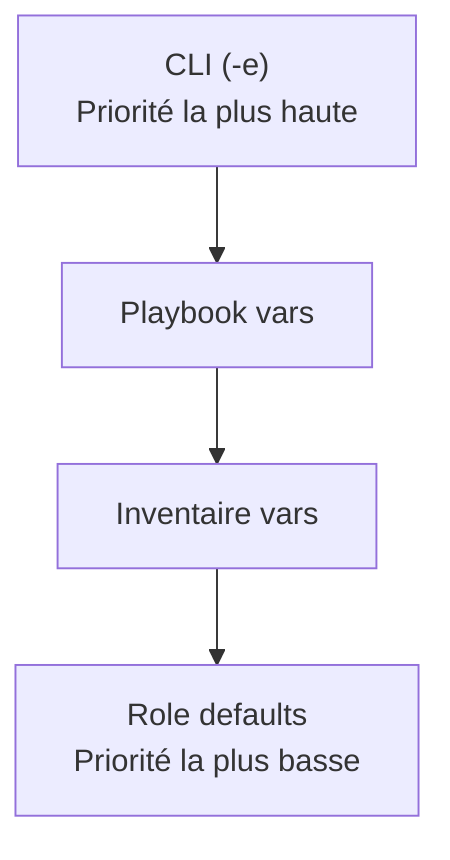

---
tags:
  - Ansible
  - Intermédiaire
  - Pratique
description: "Variables et Facts"
estimated_time: "165 min"
fiche_number: 6
total_fiches: 14
cursus: "Ansible"
---

# 06 - Variables et Facts

> **En bref** : À la fin de cette fiche, tu sauras utiliser les variables et les facts Ansible pour rendre tes playbooks dynamiques et adaptables à différents environnements. Lecture estimée : 165 min.


## Prérequis

- Avoir lu la fiche **[01 - Introduction à Ansible](01-introduction-ansible.md)**
- Avoir lu la fiche **[02 - Installation et configuration](02-installation-configuration.md)**
- Avoir lu la fiche **[03 - Inventaire](03-inventaire.md)**
- Avoir lu la fiche **[04 - Commandes Ad-Hoc](04-commandes-ad-hoc-modules.md)**
- Avoir lu la fiche **[05 - Playbooks](05-playbooks-fondamentaux.md)**
- Savoir se connecter en SSH à un serveur distant
- Savoir utiliser le terminal Linux (commandes de base)

## Objectif de cette fiche

À la fin de cette fiche, tu sauras utiliser les variables et les facts Ansible pour rendre tes playbooks dynamiques et adaptables à différents environnements.

---

## Concepts

Cette section explique tous les concepts nécessaires. Lis-la entièrement avant de passer aux étapes pratiques.

### Qu'est-ce qu'une variable Ansible ?

**Définition** : Une variable Ansible est une valeur nommée que tu peux utiliser dans tes playbooks, templates et tâches. Elle permet de remplacer des valeurs fixes par des références dynamiques.

**Le problème que les variables résolvent** :

Sans variables, voici les problèmes rencontrés :

1. **Valeurs en dur** : Tu dois écrire directement les chemins, ports, noms d'application dans chaque tâche. Si une valeur change, tu dois la modifier partout.
2. **Playbooks non réutilisables** : Un playbook écrit pour un serveur ne fonctionne pas pour un autre si les configurations diffèrent.
3. **Duplication** : La même valeur apparaît à 10 endroits différents dans ton playbook. Une faute de frappe dans un seul endroit crée un bug.
4. **Pas d'adaptation par environnement** : Impossible de distinguer dev, staging et production sans réécrire le playbook.

**Comment les variables résolvent ces problèmes** :

| Problème | Solution apportée par les variables |
| -------- | ----------------------------------- |
| Valeurs en dur | Une seule définition, utilisée partout avec `{{ nom_variable }}` |
| Playbooks non réutilisables | Les variables changent selon l'hôte ou le groupe |
| Duplication | Modifier la variable une fois met à jour toutes les références |
| Pas d'adaptation par environnement | Variables différentes par groupe (dev, staging, prod) |

**Analogie concrète** : Imagine un tableur avec des cellules nommées. Dans la cellule A1, tu écris le prix unitaire : 15. Dans toutes les autres cellules, tu utilises la référence `=A1` au lieu d'écrire 15 directement. Si le prix change, tu modifies uniquement la cellule A1, et tout le tableur se met à jour automatiquement. Les variables Ansible fonctionnent de la même manière : tu définis une valeur une fois, et tu la références partout.

**Ce qu'une variable Ansible n'est PAS** :

- Une variable Ansible n'est pas un secret. Les variables sont stockées en clair dans des fichiers YAML. Pour les mots de passe et clés, utilise Ansible Vault (une fiche dédiée existe).
- Une variable Ansible n'est pas permanente. Elle existe uniquement pendant l'exécution du playbook. Elle n'est pas stockée sur les machines cibles.

---

### Les types de variables

Ansible supporte cinq types de valeurs pour les variables.

**Les types disponibles** :

| Type | Exemple YAML | Description |
| ---- | ------------ | ----------- |
| String (chaîne) | `app_name: monsite` | Texte simple |
| Number (nombre) | `http_port: 80` | Nombre entier ou décimal |
| Boolean (booléen) | `debug_mode: true` | Vrai (`true`) ou faux (`false`) |
| List (liste) | voir ci-dessous | Séquence ordonnée de valeurs |
| Dictionary (dictionnaire) | voir ci-dessous | Ensemble de paires clé/valeur |

**Exemple de liste** :

```yaml
packages:
  - nginx
  - curl
  - htop
```

Cette liste contient trois éléments : `nginx`, `curl` et `htop`.

**Exemple de dictionnaire** :

```yaml
database:
  host: localhost
  port: 5432
  name: app_db
  user: app_user
```

Ce dictionnaire contient quatre paires clé/valeur. Pour accéder à une valeur dans un dictionnaire, tu utilises la notation par point (`database.host`) ou par crochet (`database['host']`).

**Exemple de liste de dictionnaires** :

```yaml
users:
  - name: alice
    role: admin
  - name: bob
    role: developer
```

Cette variable contient une liste de deux dictionnaires. Chaque dictionnaire a deux clés : `name` et `role`.

---

### Les différentes sources de variables

Ansible permet de définir des variables à sept endroits différents. Chaque source a un usage précis.

**Source 1 : `vars` dans le playbook (inline)**

Les variables sont définies directement dans le playbook, sous la clé `vars`.

```yaml
---
- name: Déployer l'application
  hosts: webservers
  vars:
    http_port: 80
    app_name: monsite
  tasks:
    - name: Afficher le nom de l'application
      ansible.builtin.debug:
        msg: "Application : {{ app_name }}"
```

**Quand l'utiliser** : Pour des variables spécifiques à un seul playbook, qui ne changent pas entre les environnements.

---

**Source 2 : `vars_files` (fichiers externes)**

Les variables sont définies dans des fichiers YAML séparés, référencés dans le playbook.

Fichier `vars/webserver.yml` :

```yaml
---
http_port: 80
https_port: 443
app_name: monsite
document_root: /var/www/monsite
max_connections: 1024
```

Référence dans le playbook :

```yaml
---
- name: Configurer le serveur web
  hosts: webservers
  vars_files:
    - vars/webserver.yml
  tasks:
    - name: Afficher la configuration
      ansible.builtin.debug:
        msg: "{{ app_name }} sur le port {{ http_port }}"
```

**Quand l'utiliser** : Pour organiser les variables par thème (base de données, serveur web, application) et les réutiliser dans plusieurs playbooks.

---

**Source 3 : `group_vars/` (variables par groupe)**

Les variables sont définies dans des fichiers YAML placés dans le dossier `group_vars/`. Le nom du fichier correspond au nom du groupe dans l'inventaire.

Structure :

```text
projet-ansible/
├── inventory.ini
├── group_vars/
│   ├── all.yml
│   ├── webservers.yml
│   └── dbservers.yml
└── playbook.yml
```

Fichier `group_vars/all.yml` (s'applique à tous les hôtes) :

```yaml
---
# Variables communes à tous les serveurs
ntp_server: pool.ntp.org
timezone: Europe/Paris
admin_email: admin@example.com
```

Fichier `group_vars/webservers.yml` (s'applique uniquement au groupe webservers) :

```yaml
---
http_port: 80
https_port: 443
document_root: /var/www/html
```

Fichier `group_vars/dbservers.yml` (s'applique uniquement au groupe dbservers) :

```yaml
---
db_port: 5432
db_name: app_production
db_max_connections: 200
```

**Quand l'utiliser** : Pour définir des variables qui s'appliquent à un groupe entier de serveurs. C'est la méthode la plus utilisée en production.

---

**Source 4 : `host_vars/` (variables par hôte)**

Les variables sont définies dans des fichiers YAML placés dans le dossier `host_vars/`. Le nom du fichier correspond au nom de l'hôte dans l'inventaire.

Structure :

```text
projet-ansible/
├── inventory.ini
├── host_vars/
│   ├── web01.example.com.yml
│   └── web02.example.com.yml
└── playbook.yml
```

Fichier `host_vars/web01.example.com.yml` :

```yaml
---
# Variables spécifiques à web01
http_port: 8080
server_id: 1
is_primary: true
```

Fichier `host_vars/web02.example.com.yml` :

```yaml
---
# Variables spécifiques à web02
http_port: 8081
server_id: 2
is_primary: false
```

**Quand l'utiliser** : Pour définir des variables spécifiques à un seul serveur (IP, identifiant unique, rôle primaire/secondaire).

---

**Source 5 : `--extra-vars` en ligne de commande**

Les variables sont passées directement lors de l'exécution du playbook.

```bash
# Avec des paires clé=valeur
ansible-playbook playbook.yml --extra-vars "app_name=autresite http_port=8080"

# Avec un fichier JSON
ansible-playbook playbook.yml --extra-vars "@vars/override.json"

# Avec du YAML inline
ansible-playbook playbook.yml --extra-vars '{"app_name": "autresite", "http_port": 8080}'
```

**Quand l'utiliser** : Pour surcharger temporairement une variable sans modifier les fichiers. C'est la source de variables avec la priorité la plus haute.

**Raccourci** : `-e` est l'abréviation de `--extra-vars`.

```bash
ansible-playbook playbook.yml -e "app_name=autresite"
```

---

**Source 6 : `register` (capturer la sortie d'une tâche)**

Le mot-clé `register` enregistre le résultat d'une tâche dans une variable.

```yaml
- name: Vérifier la version de nginx
  ansible.builtin.command: nginx -v
  register: nginx_result

- name: Afficher la version
  ansible.builtin.debug:
    var: nginx_result.stderr
```

**Quand l'utiliser** : Pour prendre des décisions basées sur le résultat d'une commande (installer un paquet seulement s'il manque, afficher un message selon l'état d'un service).

---

**Source 7 : `defaults` dans les rôles**

Les variables par défaut d'un rôle sont définies dans `roles/mon_role/defaults/main.yml`. Elles ont la priorité la plus basse et sont conçues pour être surchargées.

```yaml
---
# roles/webserver/defaults/main.yml
http_port: 80
document_root: /var/www/html
max_workers: 4
```

**Quand l'utiliser** : Pour fournir des valeurs par défaut raisonnables dans un rôle, que l'utilisateur du rôle peut surcharger.

---

### Qu'est-ce que la précédence des variables ?

**Définition** : La précédence des variables est l'ordre de priorité qu'Ansible utilise quand la même variable est définie à plusieurs endroits. La source avec la priorité la plus haute gagne.

**Le problème que la précédence résout** :

Sans système de précédence, voici les problèmes rencontrés :

1. **Conflit de valeurs** : La variable `http_port` est définie dans `group_vars` et dans le playbook. Laquelle utiliser ?
2. **Comportement imprévisible** : Sans ordre défini, le résultat change selon l'ordre de lecture des fichiers.

**Comment la précédence résout ces problèmes** :

| Problème | Solution apportée par la précédence |
| -------- | ----------------------------------- |
| Conflit de valeurs | Règle claire : la source la plus spécifique gagne |
| Comportement imprévisible | Ordre de priorité documenté et constant |

Ansible possède 22 niveaux de précédence. Voici les 8 niveaux les plus importants, du plus prioritaire au moins prioritaire :

| Priorité | Source | Exemple |
| -------- | ------ | ------- |
| 1 (la plus haute) | `--extra-vars` (ligne de commande) | `-e "http_port=9090"` |
| 2 | Variables de tâche (`vars` dans une tâche) | `vars:` dans un bloc `task` |
| 3 | Variables de bloc (`vars` dans un bloc) | `vars:` dans un `block` |
| 4 | `vars_files` du play | `vars_files: [vars/web.yml]` |
| 5 | `vars` du play | `vars:` au niveau du play |
| 6 | `host_vars/` | `host_vars/web01.yml` |
| 7 | `group_vars/` | `group_vars/webservers.yml` |
| 8 (la plus basse) | Defaults de rôle | `roles/x/defaults/main.yml` |

**Règle simple à retenir** : plus la définition est spécifique, plus sa priorité est haute. Une variable définie au niveau d'une tâche est plus spécifique qu'une variable définie pour un groupe entier.

Le diagramme suivant illustre l'ordre de priorité des variables, de la plus haute à la plus basse.



**Analogie concrète** : Imagine que tu t'habilles avec plusieurs couches de vêtements. Tu enfiles d'abord un t-shirt (defaults de rôle), puis un pull (group_vars), puis une veste (vars du play), et enfin un manteau (extra-vars). La couche la plus extérieure est celle qui est visible. Les `extra-vars` sont comme le manteau : elles recouvrent tout le reste.

**Ce que la précédence n'est PAS** :

- La précédence ne fusionne pas les dictionnaires par défaut. Si `group_vars` définit `database: {host: A, port: 5432}` et `host_vars` définit `database: {host: B}`, le résultat dans `host_vars` sera `database: {host: B}` sans le port. La variable est remplacée entièrement, pas fusionnée.

---

### Qu'est-ce qu'un fact Ansible ?

**Définition** : Un fact est une information automatiquement collectée par Ansible sur chaque machine gérée. Les facts contiennent des données sur le système d'exploitation, les adresses IP, le processeur, la mémoire, les disques, les interfaces réseau, et bien d'autres caractéristiques.

**Le problème que les facts résolvent** :

Sans facts, voici les problèmes rencontrés :

1. **Détection manuelle** : Tu dois te connecter à chaque serveur pour connaître son OS, son IP, sa RAM.
2. **Playbooks rigides** : Impossible d'adapter automatiquement le comportement selon les caractéristiques du serveur (installer `apt` sur Debian, `dnf` sur Fedora).
3. **Informations obsolètes** : Tu notes les caractéristiques dans un document qui devient rapidement obsolète.

**Comment les facts résolvent ces problèmes** :

| Problème | Solution apportée par les facts |
| -------- | ------------------------------- |
| Détection manuelle | Collecte automatique à chaque exécution |
| Playbooks rigides | Conditions basées sur les facts (`when: ansible_facts['os_family'] == 'Debian'`) |
| Informations obsolètes | Toujours à jour car collectés en temps réel |

**Comment les facts fonctionnent** :

1. Au début de chaque play, Ansible exécute automatiquement le module `setup` sur chaque hôte
2. Le module `setup` collecte des centaines d'informations sur le système
3. Ces informations sont stockées dans le dictionnaire `ansible_facts`
4. Tu peux les utiliser dans tes tâches, conditions et templates

**Analogie concrète** : Imagine un médecin qui fait un bilan de santé complet avant de prescrire un traitement. Il mesure la tension, le poids, la température, fait une prise de sang. Avec ces résultats (les facts), il adapte le traitement au patient. Ansible fait la même chose : il examine chaque serveur avant d'exécuter les tâches, et tu peux adapter le comportement selon les résultats.

**Ce qu'un fact n'est PAS** :

- Un fact n'est pas une variable que tu définis. Les facts sont collectés automatiquement. Tes propres variables et les facts sont deux choses distinctes.
- Un fact n'est pas permanent. Il est recollecté à chaque exécution de playbook. Si tu ajoutes de la RAM au serveur, le fact sera mis à jour à la prochaine exécution.

**Exemples de facts courants** :

| Fact | Contenu | Exemple de valeur |
| ---- | ------- | ----------------- |
| `ansible_facts['distribution']` | Nom de la distribution Linux | `Ubuntu` |
| `ansible_facts['distribution_version']` | Version de la distribution | `22.04` |
| `ansible_facts['os_family']` | Famille d'OS | `Debian` |
| `ansible_facts['hostname']` | Nom de la machine | `web01` |
| `ansible_facts['default_ipv4']['address']` | Adresse IPv4 principale | `192.168.1.10` |
| `ansible_facts['memtotal_mb']` | RAM totale en Mo | `4096` |
| `ansible_facts['processor_vcpus']` | Nombre de vCPUs | `2` |
| `ansible_facts['mounts']` | Points de montage des disques | Liste de dictionnaires |

---

### Qu'est-ce que le mot-clé register ?

**Définition** : Le mot-clé `register` capture le résultat complet d'une tâche Ansible dans une variable. Cette variable contient la sortie standard, la sortie d'erreur, le code retour, et d'autres métadonnées.

**Le problème que register résout** :

Sans register, voici les problèmes rencontrés :

1. **Pas de logique conditionnelle** : Impossible de savoir si une commande a réussi ou échoué pour agir en conséquence.
2. **Pas d'accès à la sortie** : Impossible de récupérer la sortie d'une commande pour l'utiliser dans une tâche suivante.

**Comment register résout ces problèmes** :

| Problème | Solution apportée par register |
| -------- | ------------------------------ |
| Pas de logique conditionnelle | La variable contient `failed`, `changed`, `rc` pour tester les résultats |
| Pas d'accès à la sortie | La variable contient `stdout` et `stderr` pour lire la sortie |

**Structure d'une variable register** :

Quand tu utilises `register`, la variable créée est un dictionnaire contenant ces clés :

| Clé | Type | Description |
| --- | ---- | ----------- |
| `stdout` | string | Sortie standard de la commande (une seule chaîne) |
| `stdout_lines` | list | Sortie standard découpée ligne par ligne |
| `stderr` | string | Sortie d'erreur de la commande |
| `stderr_lines` | list | Sortie d'erreur découpée ligne par ligne |
| `rc` | number | Code retour (0 = succès, autre = erreur) |
| `changed` | boolean | `true` si la tâche a modifié quelque chose |
| `failed` | boolean | `true` si la tâche a échoué |
| `skipped` | boolean | `true` si la tâche a été ignorée |

**Analogie concrète** : Imagine que tu envoies un collègue vérifier si une salle de réunion est libre. Il revient avec un rapport complet : "La salle est libre (résultat), il y avait un post-it sur la porte disant 'réservée à 15h' (sortie), et la porte grinçait (avertissement)". Le mot-clé `register` fait la même chose : il te ramène toutes les informations sur l'exécution d'une tâche.

---

## Étapes Pratiques

### Étape 1 : Définir des variables dans un playbook

Crée un fichier `variables-demo.yml` avec des variables inline.

```yaml
---
- name: Démonstration des variables inline
  hosts: all
  vars:
    # Variable de type string
    app_name: monsite

    # Variable de type nombre
    http_port: 80

    # Variable de type booléen
    debug_mode: false

    # Variable de type liste
    packages:
      - nginx
      - curl
      - htop

    # Variable de type dictionnaire
    database:
      host: localhost
      port: 5432
      name: app_db

  tasks:
    - name: Afficher une variable string
      ansible.builtin.debug:
        msg: "L'application {{ app_name }} écoute sur le port {{ http_port }}"

    - name: Afficher une valeur du dictionnaire
      ansible.builtin.debug:
        msg: "Base de données : {{ database.name }} sur {{ database.host }}:{{ database.port }}"

    - name: Afficher la liste des paquets
      ansible.builtin.debug:
        msg: "Paquet à installer : {{ item }}"
      loop: "{{ packages }}"
```

Exécute le playbook :

```bash
ansible-playbook -i inventory.ini variables-demo.yml
```

**Résultat attendu** :

```text
PLAY [Démonstration des variables inline] **************************************

TASK [Gathering Facts] *********************************************************
ok: [web01.example.com]

TASK [Afficher une variable string] ********************************************
ok: [web01.example.com] => {
    "msg": "L'application monsite écoute sur le port 80"
}

TASK [Afficher une valeur du dictionnaire] *************************************
ok: [web01.example.com] => {
    "msg": "Base de données : app_db sur localhost:5432"
}

TASK [Afficher la liste des paquets] *******************************************
ok: [web01.example.com] => (item=nginx) => {
    "msg": "Paquet à installer : nginx"
}
ok: [web01.example.com] => (item=curl) => {
    "msg": "Paquet à installer : curl"
}
ok: [web01.example.com] => (item=htop) => {
    "msg": "Paquet à installer : htop"
}

PLAY RECAP *********************************************************************
web01.example.com          : ok=4    changed=0    unreachable=0    failed=0
```

---

### Étape 2 : Utiliser des fichiers de variables (vars_files)

Crée un dossier `vars/` et un fichier de variables.

```bash
# Créer le dossier vars
mkdir -p vars
```

Crée le fichier `vars/webserver.yml` :

```yaml
---
# Configuration du serveur web
http_port: 80
https_port: 443
document_root: /var/www/monsite
server_name: monsite.example.com
max_connections: 1024

# Configuration de l'application
app_name: monsite
app_version: "1.2.0"
app_environment: production
```

Crée le fichier `vars/database.yml` :

```yaml
---
# Configuration de la base de données
db_host: localhost
db_port: 5432
db_name: app_production
db_user: app_user
db_max_connections: 200
```

Crée le playbook `vars-files-demo.yml` :

```yaml
---
- name: Démonstration de vars_files
  hosts: all
  vars_files:
    - vars/webserver.yml
    - vars/database.yml
  tasks:
    - name: Afficher la configuration web
      ansible.builtin.debug:
        msg: "{{ app_name }} v{{ app_version }} sur {{ server_name }}:{{ http_port }}"

    - name: Afficher la configuration base de données
      ansible.builtin.debug:
        msg: "Base : {{ db_name }} sur {{ db_host }}:{{ db_port }}"
```

Exécute le playbook :

```bash
ansible-playbook -i inventory.ini vars-files-demo.yml
```

**Résultat attendu** :

```text
TASK [Afficher la configuration web] ******************************************
ok: [web01.example.com] => {
    "msg": "monsite v1.2.0 sur monsite.example.com:80"
}

TASK [Afficher la configuration base de données] ******************************
ok: [web01.example.com] => {
    "msg": "Base : app_production sur localhost:5432"
}
```

---

### Étape 3 : Configurer group_vars et host_vars

Crée la structure de dossiers.

```bash
# Créer les dossiers
mkdir -p group_vars
mkdir -p host_vars
```

Supposons cet inventaire (`inventory.ini`) :

```ini
[webservers]
web01.example.com
web02.example.com

[dbservers]
db01.example.com
```

Crée le fichier `group_vars/all.yml` (s'applique à tous les hôtes) :

```yaml
---
# Variables communes à tous les serveurs
ntp_server: pool.ntp.org
timezone: Europe/Paris
admin_email: admin@example.com
ssh_port: 22
```

Crée le fichier `group_vars/webservers.yml` :

```yaml
---
# Variables pour les serveurs web
http_port: 80
https_port: 443
document_root: /var/www/html
app_name: monsite
```

Crée le fichier `group_vars/dbservers.yml` :

```yaml
---
# Variables pour les serveurs de base de données
db_port: 5432
db_name: app_production
db_max_connections: 200
```

Crée le fichier `host_vars/web01.example.com.yml` :

```yaml
---
# Variables spécifiques à web01
server_id: 1
is_primary: true
http_port: 8080
```

Crée le fichier `host_vars/web02.example.com.yml` :

```yaml
---
# Variables spécifiques à web02
server_id: 2
is_primary: false
http_port: 8081
```

Crée le playbook `group-host-vars-demo.yml` :

```yaml
---
- name: Démonstration group_vars et host_vars
  hosts: webservers
  tasks:
    - name: Afficher les variables communes (group_vars/all)
      ansible.builtin.debug:
        msg: "Timezone : {{ timezone }} - NTP : {{ ntp_server }}"

    - name: Afficher les variables du groupe (group_vars/webservers)
      ansible.builtin.debug:
        msg: "Application : {{ app_name }} - Document root : {{ document_root }}"

    - name: Afficher les variables de l'hôte (host_vars)
      ansible.builtin.debug:
        msg: "Server ID : {{ server_id }} - Primary : {{ is_primary }} - Port : {{ http_port }}"
```

Exécute le playbook :

```bash
ansible-playbook -i inventory.ini group-host-vars-demo.yml
```

**Résultat attendu** :

```text
TASK [Afficher les variables de l'hôte (host_vars)] ***************************
ok: [web01.example.com] => {
    "msg": "Server ID : 1 - Primary : True - Port : 8080"
}
ok: [web02.example.com] => {
    "msg": "Server ID : 2 - Primary : False - Port : 8081"
}
```

**Point important** : Le `http_port` est défini à 80 dans `group_vars/webservers.yml` et à 8080/8081 dans `host_vars/`. La valeur affichée est celle de `host_vars/` car elle a une priorité plus haute que `group_vars/`.

---

### Étape 4 : Utiliser --extra-vars

Les extra-vars permettent de surcharger n'importe quelle variable depuis la ligne de commande.

```bash
# Surcharger une seule variable
ansible-playbook -i inventory.ini variables-demo.yml -e "app_name=autresite"

# Surcharger plusieurs variables
ansible-playbook -i inventory.ini variables-demo.yml -e "app_name=autresite http_port=9090"

# Surcharger avec du JSON
ansible-playbook -i inventory.ini variables-demo.yml -e '{"app_name": "autresite", "http_port": 9090}'

# Surcharger depuis un fichier
ansible-playbook -i inventory.ini variables-demo.yml -e "@vars/override.yml"
```

**Résultat attendu** (avec `-e "app_name=autresite"`) :

```text
TASK [Afficher une variable string] ********************************************
ok: [web01.example.com] => {
    "msg": "L'application autresite écoute sur le port 80"
}
```

La valeur `autresite` provenant de `--extra-vars` remplace la valeur `monsite` définie dans le playbook, car `--extra-vars` a la priorité la plus haute.

---

### Étape 5 : Explorer les facts

Les facts sont collectés automatiquement. Tu peux les consulter avec le module `setup`.

**Collecter tous les facts d'un hôte** :

```bash
ansible all -i inventory.ini -m setup
```

Cette commande affiche des centaines de lignes. Pour filtrer, utilise le paramètre `filter`.

**Filtrer les facts par nom** :

```bash
# Facts sur la distribution Linux
ansible all -i inventory.ini -m setup -a "filter=ansible_distribution*"
```

**Résultat attendu** :

```text
web01.example.com | SUCCESS => {
    "ansible_facts": {
        "ansible_distribution": "Ubuntu",
        "ansible_distribution_file_parsed": true,
        "ansible_distribution_file_path": "/etc/os-release",
        "ansible_distribution_file_variety": "Debian",
        "ansible_distribution_major_version": "22",
        "ansible_distribution_release": "jammy",
        "ansible_distribution_version": "22.04"
    },
    "changed": false
}
```

**Autres filtres utiles** :

```bash
# Facts sur la mémoire
ansible all -i inventory.ini -m setup -a "filter=ansible_mem*"

# Facts sur les adresses IP
ansible all -i inventory.ini -m setup -a "filter=ansible_default_ipv4"

# Facts sur le processeur
ansible all -i inventory.ini -m setup -a "filter=ansible_processor*"

# Facts sur le nom de la machine
ansible all -i inventory.ini -m setup -a "filter=ansible_hostname"
```

**Utiliser les facts dans un playbook** :

Crée le fichier `facts-demo.yml` :

```yaml
---
- name: Démonstration des facts
  hosts: all
  # gather_facts est true par défaut, pas besoin de le préciser
  tasks:
    - name: Afficher le système d'exploitation
      ansible.builtin.debug:
        msg: "OS : {{ ansible_facts['distribution'] }} {{ ansible_facts['distribution_version'] }}"

    - name: Afficher l'adresse IP
      ansible.builtin.debug:
        msg: "IP : {{ ansible_facts['default_ipv4']['address'] }}"

    - name: Afficher la mémoire totale
      ansible.builtin.debug:
        msg: "RAM : {{ ansible_facts['memtotal_mb'] }} Mo"

    - name: Afficher le nombre de processeurs
      ansible.builtin.debug:
        msg: "vCPUs : {{ ansible_facts['processor_vcpus'] }}"

    - name: Afficher le nom de la machine
      ansible.builtin.debug:
        msg: "Hostname : {{ ansible_facts['hostname'] }}"

    - name: Afficher les points de montage
      ansible.builtin.debug:
        msg: "Montage : {{ item.mount }} - Taille : {{ item.size_total }} - Disponible : {{ item.size_available }}"
      loop: "{{ ansible_facts['mounts'] }}"
```

Exécute le playbook :

```bash
ansible-playbook -i inventory.ini facts-demo.yml
```

**Résultat attendu** :

```text
TASK [Afficher le système d'exploitation] *************************************
ok: [web01.example.com] => {
    "msg": "OS : Ubuntu 22.04"
}

TASK [Afficher l'adresse IP] **************************************************
ok: [web01.example.com] => {
    "msg": "IP : 192.168.1.10"
}

TASK [Afficher la mémoire totale] *********************************************
ok: [web01.example.com] => {
    "msg": "RAM : 4096 Mo"
}
```

**Désactiver la collecte de facts** :

Si tu n'as pas besoin des facts et que tu veux accélérer l'exécution, ajoute `gather_facts: false` :

```yaml
---
- name: Playbook rapide sans facts
  hosts: all
  gather_facts: false
  tasks:
    - name: Afficher un message
      ansible.builtin.debug:
        msg: "Ce playbook ne collecte pas les facts"
```

La tâche "Gathering Facts" disparaît et le playbook démarre plus vite.

---

### Étape 6 : Capturer un résultat avec register

Le mot-clé `register` permet de stocker le résultat d'une tâche pour l'utiliser dans les tâches suivantes.

Crée le fichier `register-demo.yml` :

```yaml
---
- name: Démonstration de register
  hosts: all
  tasks:
    - name: Vérifier si nginx est installé
      ansible.builtin.command: nginx -v
      register: nginx_result
      ignore_errors: true

    - name: Afficher tout le contenu de la variable register
      ansible.builtin.debug:
        var: nginx_result

    - name: Afficher uniquement la sortie d'erreur (nginx affiche sa version sur stderr)
      ansible.builtin.debug:
        msg: "Version de nginx : {{ nginx_result.stderr }}"
      when: nginx_result.rc == 0

    - name: Afficher un message si nginx n'est pas installé
      ansible.builtin.debug:
        msg: "nginx n'est pas installé sur cette machine"
      when: nginx_result.rc != 0

    - name: Vérifier l'espace disque
      ansible.builtin.command: df -h /
      register: disk_result

    - name: Afficher l'espace disque
      ansible.builtin.debug:
        msg: "{{ disk_result.stdout_lines }}"
```

Exécute le playbook :

```bash
ansible-playbook -i inventory.ini register-demo.yml
```

**Résultat attendu** (si nginx est installé) :

```text
TASK [Vérifier si nginx est installé] *****************************************
ok: [web01.example.com]

TASK [Afficher tout le contenu de la variable register] ***********************
ok: [web01.example.com] => {
    "nginx_result": {
        "changed": true,
        "cmd": ["nginx", "-v"],
        "delta": "0:00:00.005",
        "end": "2026-02-25 10:30:01.123456",
        "msg": "",
        "rc": 0,
        "start": "2026-02-25 10:30:01.118456",
        "stderr": "nginx version: nginx/1.24.0 (Ubuntu)",
        "stderr_lines": ["nginx version: nginx/1.24.0 (Ubuntu)"],
        "stdout": "",
        "stdout_lines": []
    }
}

TASK [Afficher uniquement la sortie d'erreur] *********************************
ok: [web01.example.com] => {
    "msg": "Version de nginx : nginx version: nginx/1.24.0 (Ubuntu)"
}

TASK [Afficher un message si nginx n'est pas installé] ************************
skipping: [web01.example.com]
```

**Résultat attendu** (si nginx n'est pas installé) :

```text
TASK [Vérifier si nginx est installé] *****************************************
fatal: [web01.example.com]: FAILED! => {"changed": false, "msg": "...", "rc": 2}
...ignoring

TASK [Afficher uniquement la sortie d'erreur] *********************************
skipping: [web01.example.com]

TASK [Afficher un message si nginx n'est pas installé] ************************
ok: [web01.example.com] => {
    "msg": "nginx n'est pas installé sur cette machine"
}
```

**Explication** :

- `ignore_errors: true` empêche le playbook de s'arrêter si la commande échoue
- `when: nginx_result.rc == 0` exécute la tâche seulement si le code retour est 0 (succès)
- `when: nginx_result.rc != 0` exécute la tâche seulement si le code retour n'est pas 0 (erreur)

---

### Étape 7 : Démontrer la précédence des variables

Cet exemple montre comment la même variable est surchargée selon sa source.

Crée le fichier `group_vars/all.yml` (si pas déjà créé) :

```yaml
---
demo_var: "valeur depuis group_vars/all"
timezone: Europe/Paris
```

Crée le playbook `precedence-demo.yml` :

```yaml
---
- name: Démonstration de la précédence des variables
  hosts: all
  vars:
    demo_var: "valeur depuis vars du play"
  tasks:
    - name: Afficher la valeur de demo_var
      ansible.builtin.debug:
        msg: "demo_var = {{ demo_var }}"
```

**Test 1 : Sans extra-vars**

```bash
ansible-playbook -i inventory.ini precedence-demo.yml
```

**Résultat attendu** :

```text
TASK [Afficher la valeur de demo_var] *****************************************
ok: [web01.example.com] => {
    "msg": "demo_var = valeur depuis vars du play"
}
```

La valeur du `vars` du play (priorité 5) surcharge celle de `group_vars/all` (priorité 7).

**Test 2 : Avec extra-vars**

```bash
ansible-playbook -i inventory.ini precedence-demo.yml -e "demo_var='valeur depuis extra-vars'"
```

**Résultat attendu** :

```text
TASK [Afficher la valeur de demo_var] *****************************************
ok: [web01.example.com] => {
    "msg": "demo_var = valeur depuis extra-vars"
}
```

La valeur de `--extra-vars` (priorité 1) surcharge toutes les autres.

**Résumé de ce test** :

| Source | Valeur définie | Priorité | Utilisée ? |
| ------ | -------------- | -------- | ---------- |
| `group_vars/all.yml` | `valeur depuis group_vars/all` | 7 | Non (surchargée) |
| `vars` du play | `valeur depuis vars du play` | 5 | Oui (test 1) / Non (test 2) |
| `--extra-vars` | `valeur depuis extra-vars` | 1 | Oui (test 2) |

---

## Commandes Utiles

| Commande | Action |
| -------- | ------ |
| `ansible all -m setup` | Collecter tous les facts de tous les hôtes |
| `ansible all -m setup -a "filter=ansible_distribution*"` | Filtrer les facts par nom |
| `ansible-playbook playbook.yml -e "var=val"` | Passer des extra-vars en ligne de commande |
| `ansible-playbook playbook.yml -e "@fichier.yml"` | Passer des extra-vars depuis un fichier |
| `ansible all -m debug -a "var=hostvars[inventory_hostname]"` | Afficher toutes les variables d'un hôte |
| `ansible all -m debug -a "var=groups"` | Afficher la structure des groupes |
| `ansible all -m debug -a "var=group_names"` | Afficher les groupes de chaque hôte |
| `ansible-inventory -i inventory.ini --list` | Afficher l'inventaire avec toutes les variables |

---

## Pièges Fréquents

### Piège 1 : Oublier les guillemets autour de {{ }}

**Problème** : Le playbook ne se charge pas et affiche une erreur YAML.

**Cause** : En YAML, une valeur qui commence par `{` est interprétée comme un dictionnaire. Ansible utilise `{{ }}` pour les variables, ce qui crée un conflit.

**Exemple incorrect** :

```yaml
# ERREUR : YAML interprète {{ comme le début d'un dictionnaire
- name: Installer le paquet
  ansible.builtin.apt:
    name: {{ package_name }}
```

**Exemple correct** :

```yaml
# CORRECT : les guillemets empêchent YAML d'interpréter {{ }}
- name: Installer le paquet
  ansible.builtin.apt:
    name: "{{ package_name }}"
```

**Règle** : Si une valeur YAML commence par `{{`, elle doit être entourée de guillemets doubles. Si `{{ }}` apparaît au milieu d'une chaîne, les guillemets sont optionnels mais recommandés.

```yaml
# Les deux sont corrects :
msg: "L'application {{ app_name }} est démarrée"
msg: L'application {{ app_name }} est démarrée

# Seule la version avec guillemets est correcte :
name: "{{ package_name }}"    # CORRECT
name: {{ package_name }}       # ERREUR
```

---

### Piège 2 : Conflit entre group_vars et host_vars

**Problème** : Une variable a une valeur inattendue. Tu ne comprends pas d'où elle vient.

**Cause** : La même variable est définie dans `group_vars/all.yml`, `group_vars/webservers.yml` et `host_vars/web01.yml`. La valeur utilisée est celle de `host_vars/` car elle a la priorité la plus haute.

**Solution** : Utilise la commande suivante pour voir toutes les variables d'un hôte et leur origine :

```bash
ansible-inventory -i inventory.ini --host web01.example.com
```

**Bonne pratique** : Nomme tes variables avec un préfixe lié à leur contexte pour éviter les collisions.

```yaml
# group_vars/webservers.yml - préfixe web_
web_http_port: 80
web_document_root: /var/www/html

# group_vars/dbservers.yml - préfixe db_
db_port: 5432
db_name: app_production
```

---

### Piège 3 : Oublier que extra-vars surcharge tout

**Problème** : Tu passes une variable avec `-e` pour tester, et elle surcharge une valeur critique définie dans `host_vars/`.

**Cause** : `--extra-vars` a la priorité la plus haute. Elle surcharge toutes les autres sources, y compris `host_vars/`.

**Solution** :

- Utilise `--extra-vars` uniquement pour le debug ou les surcharges temporaires
- Ne jamais utiliser `--extra-vars` dans les scripts de déploiement en production (préfère `group_vars/` ou `host_vars/`)
- Documente les variables critiques qui ne doivent pas être surchargées

---

### Piège 4 : Facts indisponibles avec gather_facts: false

**Problème** : Le playbook échoue avec l'erreur `"ansible_facts['distribution']" is undefined`.

**Cause** : Le playbook contient `gather_facts: false`, ce qui empêche la collecte automatique des facts.

**Solution 1** : Retirer `gather_facts: false` pour que les facts soient collectés.

**Solution 2** : Collecter les facts manuellement avec une tâche dédiée.

```yaml
---
- name: Playbook avec collecte manuelle des facts
  hosts: all
  gather_facts: false
  tasks:
    - name: Collecter les facts manuellement
      ansible.builtin.setup:

    - name: Maintenant les facts sont disponibles
      ansible.builtin.debug:
        msg: "OS : {{ ansible_facts['distribution'] }}"
```

---

### Piège 5 : Accéder à des valeurs imbriquées dans un dictionnaire

**Problème** : L'accès à une sous-clé échoue avec une erreur `dict object has no attribute`.

**Cause** : La clé contient un caractère spécial (tiret, point) ou le dictionnaire n'existe pas.

**Deux syntaxes pour accéder aux sous-clés** :

```yaml
# Notation par point (simple mais ne fonctionne pas avec les tirets)
msg: "{{ ansible_facts.default_ipv4.address }}"

# Notation par crochet (fonctionne toujours, recommandée)
msg: "{{ ansible_facts['default_ipv4']['address'] }}"
```

**Quand utiliser chaque syntaxe** :

| Syntaxe | Fonctionne avec les tirets | Fonctionne avec les points | Recommandation |
| ------- | -------------------------- | -------------------------- | -------------- |
| `dict.key` | Non | Non | Pour les clés simples |
| `dict['key']` | Oui | Oui | Pour toutes les clés |

**Bonne pratique** : Utilise systématiquement la notation par crochet (`dict['key']`) pour les facts Ansible. Cela évite les erreurs avec les clés contenant des tirets.

---

## Checklist de Validation

- [ ] J'ai défini des variables dans un playbook avec `vars`
- [ ] J'ai utilisé `vars_files` pour externaliser mes variables dans des fichiers séparés
- [ ] J'ai configuré `group_vars/` pour des variables partagées par groupe
- [ ] J'ai configuré `host_vars/` pour des variables spécifiques à un hôte
- [ ] J'ai utilisé `--extra-vars` pour surcharger une variable en ligne de commande
- [ ] J'ai exploré les facts avec le module `setup`
- [ ] J'ai filtré les facts avec le paramètre `filter`
- [ ] J'ai utilisé des facts dans un playbook
- [ ] J'ai capturé un résultat avec `register` et utilisé la variable dans une tâche suivante
- [ ] Je comprends l'ordre de précédence des variables (extra-vars > host_vars > group_vars > defaults)
- [ ] Je sais qu'il faut mettre des guillemets autour de `{{ }}` en début de valeur YAML

---

## Exercice Pratique

**Énoncé** : Crée un projet Ansible complet qui utilise les variables et les facts pour configurer un serveur web de manière dynamique.

**Étapes** :

1. Crée un fichier `vars/app.yml` contenant :
   - `app_name` : le nom de l'application (ex : `monprojet`)
   - `app_version` : la version (ex : `2.0.0`)
   - `app_packages` : une liste de paquets à installer (`nginx`, `curl`, `tree`)

2. Crée un fichier `group_vars/all.yml` contenant :
   - `admin_email` : une adresse email
   - `timezone` : le fuseau horaire

3. Crée un fichier `group_vars/webservers.yml` contenant :
   - `http_port` : le port HTTP (80)
   - `document_root` : le chemin racine du serveur web

4. Crée un fichier `host_vars/web01.example.com.yml` contenant :
   - `server_id` : un identifiant unique (1)
   - `http_port` : un port différent (8080) pour démontrer la précédence

5. Crée un playbook `exercice-vars.yml` qui :
   - Utilise `vars_files` pour charger `vars/app.yml`
   - Affiche le nom et la version de l'application
   - Affiche le port HTTP (pour vérifier la précédence)
   - Installe les paquets de la liste `app_packages`
   - Affiche les facts du système (OS, IP, RAM)
   - Exécute la commande `uptime` et enregistre le résultat avec `register`
   - Affiche le résultat de `uptime`

6. Exécute le playbook sans option supplémentaire (le port utilisé sera `8080`), puis avec `--extra-vars "http_port=9999"` pour vérifier la surcharge

**Résultat attendu** :

- Le playbook affiche les variables de chaque source
- Le port HTTP est 8080 (depuis `host_vars/`) en exécution normale
- Le port HTTP est 9999 (depuis `--extra-vars`) en exécution avec surcharge
- Les facts du système sont affichés correctement
- La sortie de `uptime` est capturée et affichée

---

## Solution de l'Exercice

> **Note** : Cette section contient la solution complète. Essaie d'abord de résoudre l'exercice par toi-même avant de consulter cette solution.

---

**Structure du projet** :

```text
exercice-vars/
├── inventory.ini
├── vars/
│   └── app.yml
├── group_vars/
│   ├── all.yml
│   └── webservers.yml
├── host_vars/
│   └── web01.example.com.yml
└── exercice-vars.yml
```

**Fichier `inventory.ini`** :

```ini
[webservers]
web01.example.com
```

**Fichier `vars/app.yml`** :

```yaml
---
app_name: monprojet
app_version: "2.0.0"
app_packages:
  - nginx
  - curl
  - tree
```

**Fichier `group_vars/all.yml`** :

```yaml
---
admin_email: admin@example.com
timezone: Europe/Paris
```

**Fichier `group_vars/webservers.yml`** :

```yaml
---
http_port: 80
document_root: /var/www/html
```

**Fichier `host_vars/web01.example.com.yml`** :

```yaml
---
server_id: 1
http_port: 8080
```

**Fichier `exercice-vars.yml`** :

```yaml
---
- name: Exercice complet - Variables et Facts
  hosts: webservers
  vars_files:
    - vars/app.yml
  tasks:
    # Étape 1 : Afficher les variables de l'application (depuis vars_files)
    - name: Afficher le nom et la version de l'application
      ansible.builtin.debug:
        msg: "Application : {{ app_name }} v{{ app_version }}"

    # Étape 2 : Afficher le port HTTP (démontre la précédence)
    - name: Afficher le port HTTP
      ansible.builtin.debug:
        msg: "Port HTTP : {{ http_port }}"
    # Sans extra-vars : affiche 8080 (host_vars surcharge group_vars)
    # Avec -e "http_port=9999" : affiche 9999 (extra-vars surcharge tout)

    # Étape 3 : Afficher les variables communes (depuis group_vars/all)
    - name: Afficher les variables communes
      ansible.builtin.debug:
        msg: "Admin : {{ admin_email }} - Timezone : {{ timezone }}"

    # Étape 4 : Installer les paquets de la liste
    - name: Installer les paquets de l'application
      ansible.builtin.apt:
        name: "{{ app_packages }}"
        state: present
      become: true

    # Étape 5 : Afficher les facts du système
    - name: Afficher le système d'exploitation
      ansible.builtin.debug:
        msg: "OS : {{ ansible_facts['distribution'] }} {{ ansible_facts['distribution_version'] }}"

    - name: Afficher l'adresse IP
      ansible.builtin.debug:
        msg: "IP : {{ ansible_facts['default_ipv4']['address'] }}"

    - name: Afficher la mémoire totale
      ansible.builtin.debug:
        msg: "RAM : {{ ansible_facts['memtotal_mb'] }} Mo"

    # Étape 6 : Capturer la sortie de uptime avec register
    - name: Exécuter uptime
      ansible.builtin.command: uptime
      register: uptime_result

    - name: Afficher la sortie de uptime
      ansible.builtin.debug:
        msg: "Uptime : {{ uptime_result.stdout }}"
```

**Exécution normale** :

```bash
ansible-playbook -i inventory.ini exercice-vars.yml
```

**Résultat attendu** :

```text
TASK [Afficher le nom et la version de l'application] *************************
ok: [web01.example.com] => {
    "msg": "Application : monprojet v2.0.0"
}

TASK [Afficher le port HTTP] **************************************************
ok: [web01.example.com] => {
    "msg": "Port HTTP : 8080"
}

TASK [Afficher les variables communes] ****************************************
ok: [web01.example.com] => {
    "msg": "Admin : admin@example.com - Timezone : Europe/Paris"
}

TASK [Afficher le système d'exploitation] *************************************
ok: [web01.example.com] => {
    "msg": "OS : Ubuntu 22.04"
}

TASK [Afficher l'adresse IP] **************************************************
ok: [web01.example.com] => {
    "msg": "IP : 192.168.1.10"
}

TASK [Afficher la mémoire totale] *********************************************
ok: [web01.example.com] => {
    "msg": "RAM : 4096 Mo"
}

TASK [Afficher la sortie de uptime] *******************************************
ok: [web01.example.com] => {
    "msg": "Uptime :  10:30:01 up 42 days,  3:15,  1 user,  load average: 0.08, 0.03, 0.01"
}
```

**Exécution avec extra-vars** :

```bash
ansible-playbook -i inventory.ini exercice-vars.yml -e "http_port=9999"
```

**Résultat attendu** (seule la tâche du port change) :

```text
TASK [Afficher le port HTTP] **************************************************
ok: [web01.example.com] => {
    "msg": "Port HTTP : 9999"
}
```

Le port est passé de 8080 à 9999 parce que `--extra-vars` (priorité 1) surcharge `host_vars/` (priorité 6).

---

## Navigation

← Fiche précédente : **[Les Playbooks : Fondamentaux](05-playbooks-fondamentaux.md)**

→ Fiche suivante : **[Conditions et Boucles](07-conditions-boucles.md)**
