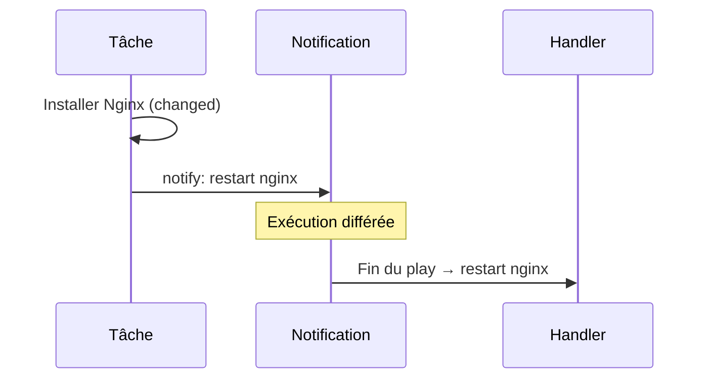

---
tags:
  - Ansible
  - Avancé
  - Pratique
description: "Handlers et Tags"
estimated_time: "90 min"
fiche_number: 9
total_fiches: 14
cursus: "Ansible"
---

# 09 - Handlers et Tags

> **En bref** : À la fin de cette fiche, tu sauras utiliser les handlers pour réagir aux changements et les tags pour exécuter sélectivement des tâches. Lecture estimée : 90 min.


## Prérequis

- Fiches [01 - Introduction à Ansible](01-introduction-ansible.md) à [08 - Templates Jinja2](08-templates-jinja2.md) de ce cursus (lues et comprises)
- Savoir écrire un playbook avec des tâches, des variables et des templates
- Savoir utiliser le terminal (ouvrir un terminal, taper une commande, lire le résultat)

## Versions utilisées dans cette fiche

| Technologie | Version |
| ----------- | ------- |
| Ansible     | 10.x (ansible-core 2.17) |

## Objectif de cette fiche

À la fin de cette fiche, tu sauras utiliser les handlers pour réagir aux changements et les tags pour exécuter sélectivement des tâches.

---

## Concepts

Cette section explique tous les concepts nécessaires. Lis-la entièrement avant de passer aux étapes pratiques.

### Qu'est-ce qu'un handler ?

**Définition** : Un handler est une tâche spéciale qui ne s'exécute que lorsqu'une autre tâche l'a notifié après avoir effectué un changement. Les handlers sont déclarés dans une section `handlers:` séparée du playbook.

**Le problème que les handlers résolvent** :

Sans handlers, voici les problèmes rencontrés :

1. **Redémarrages inutiles** : Si tu modifies trois fichiers de configuration Nginx dans un playbook, sans handler tu devrais écrire trois tâches de redémarrage (une après chaque modification). Le service redémarre trois fois, ce qui provoque trois coupures de service inutiles.

2. **Redémarrages inconditionnels** : Si tu écris une tâche de redémarrage classique, elle s'exécute à chaque lancement du playbook, même quand aucun fichier n'a changé. Le service redémarre sans raison.

3. **Duplication de code** : Sans handlers, la même tâche de redémarrage doit être écrite plusieurs fois dans le playbook (une fois après chaque tâche de configuration). Si tu changes la façon de redémarrer le service, tu dois modifier chaque occurrence.

**Comment les handlers résolvent ces problèmes** :

| Problème                     | Solution apportée par les handlers                                                                     |
| ---------------------------- | ------------------------------------------------------------------------------------------------------ |
| Redémarrages inutiles        | Le handler ne s'exécute qu'une seule fois à la fin du play, même s'il a été notifié plusieurs fois     |
| Redémarrages inconditionnels | Le handler ne s'exécute que si au moins une tâche notifiante a rapporté le statut "changed"            |
| Duplication de code          | Le handler est défini une seule fois dans la section `handlers:` et référencé par son nom via `notify` |

**Analogie concrète** : Un handler fonctionne comme une alarme incendie dans un immeuble. Chaque étage possède des détecteurs de fumée (les tâches). Si un détecteur au 2e étage détecte de la fumée, il déclenche l'alarme. Si un deuxième détecteur au 4e étage détecte aussi de la fumée, il déclenche la même alarme. Le camion de pompiers (le handler) ne vient qu'une seule fois, pas deux fois. Et si aucun détecteur ne détecte de fumée (aucune tâche n'a changé), le camion ne vient pas du tout.

**Ce qu'un handler n'est PAS** :

- Un handler n'est pas une tâche classique. Une tâche classique s'exécute à chaque fois que le playbook tourne, dans l'ordre où elle apparaît. Un handler ne s'exécute que s'il est notifié, et il s'exécute à la fin du play (pas à l'endroit où il est déclaré).
- Un handler n'est pas une tâche conditionnelle avec `when`. Une tâche avec `when` vérifie une condition définie par toi (par exemple : `when: ansible_os_family == "Debian"`). Un handler vérifie automatiquement si la tâche notifiante a effectué un changement. Ce sont deux mécanismes différents.

---

### Comment fonctionnent les handlers ?

**Définition** : Le mécanisme de notification des handlers suit un cycle précis en quatre étapes : la tâche s'exécute, elle rapporte un statut, elle notifie le handler si le statut est "changed", et le handler s'exécute à la fin du play.

Le diagramme suivant montre le flux de notification et d'exécution différée d'un handler.



**Le cycle complet d'un handler** :

1. **La tâche s'exécute** : Ansible exécute la tâche qui contient `notify: nom_du_handler`.
2. **Ansible évalue le résultat** : La tâche rapporte un statut : `changed` (quelque chose a été modifié) ou `ok` (rien n'a changé).
3. **Notification conditionnelle** : Si le statut est `changed`, le handler est marqué comme "à exécuter". Si le statut est `ok`, le handler n'est pas notifié.
4. **Exécution en fin de play** : Une fois que toutes les tâches du play sont terminées, Ansible exécute tous les handlers marqués, dans l'ordre où ils sont définis dans la section `handlers:`.

**Règles de fonctionnement des handlers** :

| Règle | Description |
| ----- | ----------- |
| Exécution unique | Un handler notifié plusieurs fois ne s'exécute qu'une seule fois |
| Exécution en fin de play | Les handlers s'exécutent après toutes les tâches du play, pas immédiatement après la notification |
| Ordre d'exécution | Les handlers s'exécutent dans l'ordre où ils sont définis dans la section `handlers:`, pas dans l'ordre des notifications |
| Pas de notification = pas d'exécution | Si aucune tâche notifiante ne rapporte "changed", le handler ne s'exécute pas |
| Correspondance par nom | Le nom dans `notify` doit correspondre exactement au nom du handler (majuscules, espaces, accents compris) |

**La syntaxe d'un handler** :

```yaml
# Section tasks : les tâches notifient le handler par son nom
tasks:
  - name: Copier la configuration
    ansible.builtin.template:
      src: templates/config.conf.j2
      dest: /etc/app/config.conf
    notify: Redémarrer le service app
    # notify contient le nom exact du handler à déclencher

# Section handlers : le handler est défini comme une tâche classique
handlers:
  - name: Redémarrer le service app
    # Ce nom doit correspondre exactement à la valeur de notify
    ansible.builtin.service:
      name: app
      state: restarted
```

---

### Qu'est-ce que flush_handlers ?

**Définition** : `flush_handlers` est une directive spéciale (`meta`) qui force l'exécution immédiate de tous les handlers en attente, au lieu d'attendre la fin du play.

**Le problème que flush_handlers résout** :

Sans `flush_handlers`, voici le problème rencontré :

1. **Ordre d'exécution incompatible** : Tu modifies la configuration de Nginx (tâche 1), puis tu testes que Nginx répond correctement (tâche 2). Le handler qui redémarre Nginx ne s'exécute qu'à la fin du play, donc après la tâche de test. Le test échoue parce que Nginx utilise encore l'ancienne configuration.

**Comment flush_handlers résout ce problème** :

| Problème                        | Solution apportée par flush_handlers                                                 |
| ------------------------------- | ------------------------------------------------------------------------------------ |
| Ordre d'exécution incompatible  | `flush_handlers` force le redémarrage de Nginx avant la tâche de test                |

**La syntaxe de flush_handlers** :

```yaml
tasks:
  - name: Copier la configuration nginx
    ansible.builtin.template:
      src: templates/nginx.conf.j2
      dest: /etc/nginx/nginx.conf
    notify: Redémarrer nginx

  # Force l'exécution immédiate du handler "Redémarrer nginx"
  - meta: flush_handlers

  - name: Vérifier que nginx répond
    ansible.builtin.uri:
      url: http://localhost
      status_code: 200
    # Cette tâche s'exécute APRÈS le redémarrage de nginx

handlers:
  - name: Redémarrer nginx
    ansible.builtin.service:
      name: nginx
      state: restarted
```

**Analogie concrète** : Par défaut, le facteur (Ansible) dépose tout le courrier dans ta boîte aux lettres à la fin de sa tournée (fin du play). `flush_handlers`, c'est comme sonner à ta porte pour te remettre un colis en main propre immédiatement, parce que tu en as besoin tout de suite pour avancer dans ton travail.

---

### Qu'est-ce qu'un tag ?

**Définition** : Un tag est une étiquette que tu attaches à une tâche, un bloc de tâches, un rôle ou un play entier. Les tags permettent d'exécuter sélectivement certaines parties d'un playbook.

**Le problème que les tags résolvent** :

Sans tags, voici les problèmes rencontrés :

1. **Exécution intégrale obligatoire** : Ton playbook contient 50 tâches (installation, configuration, déploiement). Tu as modifié un seul fichier de configuration. Sans tags, tu dois exécuter les 50 tâches, y compris les 20 tâches d'installation qui n'ont rien à faire.

2. **Temps d'exécution excessif** : Exécuter 50 tâches quand seules 5 sont nécessaires fait perdre du temps. Certaines tâches (téléchargement de paquets, compilation) prennent plusieurs minutes chacune.

3. **Pas de catégorisation** : Sans tags, toutes les tâches sont "à plat". Il n'y a aucun moyen de regrouper logiquement les tâches par fonction (installation, configuration, déploiement) pour les exécuter séparément.

**Comment les tags résolvent ces problèmes** :

| Problème                         | Solution apportée par les tags                                                         |
| -------------------------------- | -------------------------------------------------------------------------------------- |
| Exécution intégrale obligatoire  | Tu lances le playbook avec `--tags "config"` et seules les tâches étiquetées "config" s'exécutent |
| Temps d'exécution excessif       | Tu exécutes uniquement les tâches pertinentes, ce qui réduit le temps d'exécution      |
| Pas de catégorisation            | Chaque tâche porte un ou plusieurs tags qui indiquent sa catégorie fonctionnelle       |

**Analogie concrète** : Les tags fonctionnent comme des étiquettes de couleur sur des cartons de déménagement. Tu as 30 cartons : certains portent une étiquette bleue "cuisine", d'autres une étiquette rouge "chambre", d'autres une étiquette verte "salon". Si tu dis aux déménageurs "ne portez que les cartons bleus", ils ne déplacent que les cartons de la cuisine. Un carton peut avoir plusieurs étiquettes (par exemple bleu "cuisine" et jaune "fragile") et sera sélectionné si tu demandes l'une ou l'autre.

**Ce qu'un tag n'est PAS** :

- Un tag n'est pas une condition `when`. Une condition `when` évalue une expression à chaque exécution (par exemple : `when: ansible_os_family == "Debian"`). Un tag est une étiquette statique que tu filtres depuis la ligne de commande au moment de lancer le playbook. Les deux mécanismes sont indépendants.
- Un tag n'empêche pas une tâche d'exister. Si tu lances le playbook sans `--tags` ni `--skip-tags`, toutes les tâches s'exécutent, qu'elles aient des tags ou non.

---

### Quels sont les tags spéciaux ?

**Définition** : Ansible fournit deux tags spéciaux qui modifient le comportement par défaut de l'exécution sélective : `always` et `never`.

**Le tag always** :

Une tâche portant le tag `always` s'exécute toujours, quel que soit le filtre `--tags` utilisé. La seule façon de l'empêcher de s'exécuter est d'utiliser `--skip-tags "always"`.

**Le tag never** :

Une tâche portant le tag `never` ne s'exécute jamais par défaut. La seule façon de la faire s'exécuter est de la demander explicitement avec `--tags "never"` ou avec un autre tag que porte cette tâche.

**Tableau récapitulatif** :

| Tag      | Comportement par défaut (sans --tags) | Avec --tags "config" | Avec --skip-tags "always" |
| -------- | ------------------------------------- | -------------------- | ------------------------- |
| `always` | S'exécute                             | S'exécute            | Ne s'exécute pas          |
| `never`  | Ne s'exécute pas                      | Ne s'exécute pas     | Ne s'exécute pas          |
| `config` | S'exécute                             | S'exécute            | S'exécute                 |
| (aucun)  | S'exécute                             | Ne s'exécute pas     | S'exécute                 |

**Cas spécial : tag never + autre tag** :

```yaml
- name: Supprimer toutes les données
  ansible.builtin.file:
    path: /var/data
    state: absent
  tags:
    - never
    - cleanup
# Cette tâche ne s'exécute JAMAIS par défaut
# Elle s'exécute uniquement avec : --tags "cleanup"
```

---

## Étapes Pratiques

### Étape 1 : Créer un playbook avec un handler

Crée un fichier `handler-demo.yml` :

```yaml
---
# handler-demo.yml
# Ce playbook montre le fonctionnement d'un handler
- name: Configuration du serveur web
  hosts: webservers
  become: true

  tasks:
    # Tâche 1 : copier le fichier de configuration principal de nginx
    - name: Copier la configuration nginx
      ansible.builtin.template:
        src: templates/nginx.conf.j2
        dest: /etc/nginx/nginx.conf
        owner: root
        group: root
        mode: "0644"
      notify: Redémarrer nginx
      # Si le fichier est modifié (statut "changed"), le handler est notifié

    # Tâche 2 : copier le virtual host
    - name: Copier le virtual host
      ansible.builtin.template:
        src: templates/vhost.conf.j2
        dest: /etc/nginx/sites-available/default
        owner: root
        group: root
        mode: "0644"
      notify: Redémarrer nginx
      # Si ce fichier aussi est modifié, le même handler est notifié

    # Tâche 3 : s'assurer que nginx est démarré
    - name: S'assurer que nginx est démarré
      ansible.builtin.service:
        name: nginx
        state: started
        enabled: true

  handlers:
    # Ce handler ne s'exécute qu'une seule fois, même si les deux tâches
    # ci-dessus l'ont notifié. Il s'exécute après toutes les tâches.
    - name: Redémarrer nginx
      ansible.builtin.service:
        name: nginx
        state: restarted
```

Ce qu'il faut comprendre :

- Les tâches 1 et 2 notifient toutes les deux le handler `Redémarrer nginx`
- Si les deux fichiers sont modifiés, le handler est notifié deux fois
- Malgré les deux notifications, Nginx ne redémarre qu'**une seule fois**, à la fin du play
- Si aucun des deux fichiers n'a changé, Nginx ne redémarre pas du tout

---

### Étape 2 : Tester le handler (modification vs pas de modification)

Exécute le playbook une première fois :

```bash
ansible-playbook handler-demo.yml
```

**Résultat attendu (première exécution)** :

```text
PLAY [Configuration du serveur web] *******************************************

TASK [Gathering Facts] *********************************************************
ok: [web1]

TASK [Copier la configuration nginx] ******************************************
changed: [web1]

TASK [Copier le virtual host] *************************************************
changed: [web1]

TASK [S'assurer que nginx est démarré] ****************************************
ok: [web1]

RUNNING HANDLER [Redémarrer nginx] ********************************************
changed: [web1]

PLAY RECAP *********************************************************************
web1                       : ok=5    changed=3    unreachable=0    failed=0
```

Les deux tâches de copie affichent `changed`, donc le handler s'exécute à la fin.

Exécute le playbook une deuxième fois sans modifier les fichiers :

```bash
ansible-playbook handler-demo.yml
```

**Résultat attendu (deuxième exécution)** :

```text
PLAY [Configuration du serveur web] *******************************************

TASK [Gathering Facts] *********************************************************
ok: [web1]

TASK [Copier la configuration nginx] ******************************************
ok: [web1]

TASK [Copier le virtual host] *************************************************
ok: [web1]

TASK [S'assurer que nginx est démarré] ****************************************
ok: [web1]

PLAY RECAP *********************************************************************
web1                       : ok=4    changed=0    unreachable=0    failed=0
```

Les deux tâches de copie affichent `ok` (pas de changement), donc le handler ne s'exécute pas. Nginx n'est pas redémarré inutilement. C'est le comportement idempotent attendu.

---

### Étape 3 : Utiliser flush_handlers

Crée un fichier `flush-demo.yml` :

```yaml
---
# flush-demo.yml
# Ce playbook montre l'utilisation de flush_handlers
- name: Configuration et vérification nginx
  hosts: webservers
  become: true

  tasks:
    # Étape 1 : copier la nouvelle configuration
    - name: Copier la configuration nginx
      ansible.builtin.template:
        src: templates/nginx.conf.j2
        dest: /etc/nginx/nginx.conf
      notify: Redémarrer nginx

    # Étape 2 : forcer l'exécution immédiate du handler
    # Sans cette ligne, le handler s'exécuterait APRÈS la vérification
    # et la vérification échouerait car nginx utiliserait l'ancienne config
    - meta: flush_handlers

    # Étape 3 : vérifier que nginx répond avec la nouvelle configuration
    - name: Vérifier que nginx répond
      ansible.builtin.uri:
        url: http://localhost
        status_code: 200
      register: result
      retries: 3
      delay: 5
      until: result.status == 200

  handlers:
    - name: Redémarrer nginx
      ansible.builtin.service:
        name: nginx
        state: restarted
```

**Résultat attendu** :

```text
TASK [Copier la configuration nginx] ******************************************
changed: [web1]

RUNNING HANDLER [Redémarrer nginx] ********************************************
changed: [web1]

TASK [Vérifier que nginx répond] **********************************************
ok: [web1]
```

Le handler s'exécute immédiatement après `flush_handlers`, avant la tâche de vérification. Sans `flush_handlers`, l'ordre serait : copier la config, vérifier (échec car ancienne config), puis redémarrer nginx (trop tard).

---

### Étape 4 : Créer un handler qui notifie un autre handler

Un handler peut lui-même notifier un autre handler. Cela permet de créer une chaîne de réactions.

Crée un fichier `handler-chain-demo.yml` :

```yaml
---
# handler-chain-demo.yml
# Démonstration d'un handler qui notifie un autre handler
- name: Configuration avec handlers en chaîne
  hosts: webservers
  become: true

  tasks:
    - name: Copier la configuration nginx
      ansible.builtin.template:
        src: templates/nginx.conf.j2
        dest: /etc/nginx/nginx.conf
      notify: Valider la configuration nginx

  handlers:
    # Handler 1 : valide la configuration avant de redémarrer
    - name: Valider la configuration nginx
      ansible.builtin.command:
        cmd: nginx -t
      notify: Redémarrer nginx
      # Si la validation réussit (statut "changed"), le handler suivant est notifié

    # Handler 2 : redémarre nginx uniquement si la validation a réussi
    - name: Redémarrer nginx
      ansible.builtin.service:
        name: nginx
        state: restarted
```

L'ordre d'exécution est le suivant :

1. La tâche copie la configuration et notifie `Valider la configuration nginx`
2. Le handler `Valider la configuration nginx` exécute `nginx -t` et notifie `Redémarrer nginx`
3. Le handler `Redémarrer nginx` redémarre le service

---

### Étape 5 : Ajouter des tags aux tâches

Crée un fichier `tags-demo.yml` :

```yaml
---
# tags-demo.yml
# Ce playbook utilise des tags pour catégoriser les tâches
- name: Déploiement application web
  hosts: webservers
  become: true

  vars:
    packages:
      - nginx
      - php-fpm
      - php-mysql

  tasks:
    # --- Tâches d'installation ---

    - name: Installer les paquets
      ansible.builtin.apt:
        name: "{{ item }}"
        state: present
        update_cache: true
      loop: "{{ packages }}"
      tags:
        - install
        - packages
      # Cette tâche porte deux tags : "install" et "packages"
      # Elle s'exécute si tu utilises --tags "install" OU --tags "packages"

    # --- Tâches de configuration ---

    - name: Copier la configuration nginx
      ansible.builtin.template:
        src: templates/nginx.conf.j2
        dest: /etc/nginx/nginx.conf
      notify: Redémarrer nginx
      tags:
        - config
        - nginx
      # Cette tâche porte les tags "config" et "nginx"

    - name: Copier la configuration PHP-FPM
      ansible.builtin.template:
        src: templates/php-fpm.conf.j2
        dest: /etc/php/8.3/fpm/pool.d/www.conf
      notify: Redémarrer php-fpm
      tags:
        - config
        - php

    # --- Tâches de déploiement ---

    - name: Déployer le code de l'application
      ansible.builtin.git:
        repo: "https://example.com/app.git"
        dest: /var/www/app
        version: main
      tags:
        - deploy

  handlers:
    - name: Redémarrer nginx
      ansible.builtin.service:
        name: nginx
        state: restarted

    - name: Redémarrer php-fpm
      ansible.builtin.service:
        name: php8.3-fpm
        state: restarted
```

---

### Étape 6 : Exécuter avec des tags

Exécuter uniquement les tâches de configuration :

```bash
ansible-playbook tags-demo.yml --tags "config"
```

**Résultat attendu** :

```text
TASK [Gathering Facts] *********************************************************
ok: [web1]

TASK [Copier la configuration nginx] ******************************************
changed: [web1]

TASK [Copier la configuration PHP-FPM] ****************************************
changed: [web1]

RUNNING HANDLER [Redémarrer nginx] ********************************************
changed: [web1]

RUNNING HANDLER [Redémarrer php-fpm] ******************************************
changed: [web1]

PLAY RECAP *********************************************************************
web1                       : ok=5    changed=4    unreachable=0    failed=0
```

Seules les tâches portant le tag `config` s'exécutent. Les tâches d'installation et de déploiement sont ignorées. Les handlers s'exécutent quand même, car ils sont déclenchés par les tâches de configuration qui, elles, portent le tag `config`.

Exclure les tâches d'installation :

```bash
ansible-playbook tags-demo.yml --skip-tags "install"
```

**Résultat attendu** : Toutes les tâches s'exécutent sauf "Installer les paquets".

Combiner plusieurs tags (logique OU : les tâches portant l'un OU l'autre tag s'exécutent) :

```bash
ansible-playbook tags-demo.yml --tags "config,deploy"
```

**Résultat attendu** : Les tâches de configuration ET de déploiement s'exécutent. Les tâches d'installation sont ignorées.

---

### Étape 7 : Lister les tags disponibles

Avant d'exécuter un playbook avec des tags, tu peux lister tous les tags définis :

```bash
ansible-playbook tags-demo.yml --list-tags
```

**Résultat attendu** :

```text
playbook: tags-demo.yml

  play #1 (webservers): Déploiement application web    TAGS: []
      TASK TAGS: [config, deploy, install, nginx, packages, php]
```

Cette commande ne lance aucune tâche. Elle affiche uniquement la liste des tags disponibles dans le playbook.

---

### Étape 8 : Utiliser les tags spéciaux always et never

Crée un fichier `tags-special-demo.yml` :

```yaml
---
# tags-special-demo.yml
# Démonstration des tags spéciaux always et never
- name: Démonstration tags spéciaux
  hosts: webservers
  become: true

  tasks:
    # Tag "always" : cette tâche s'exécute TOUJOURS, même avec --tags "config"
    - name: Afficher les informations système
      ansible.builtin.debug:
        msg: "OS: {{ ansible_distribution }} {{ ansible_distribution_version }}"
      tags:
        - always
      # Cette tâche s'exécute quels que soient les tags demandés
      # Seul --skip-tags "always" peut l'empêcher de s'exécuter

    # Tag "never" seul : cette tâche ne s'exécute JAMAIS par défaut
    - name: Supprimer tous les logs
      ansible.builtin.file:
        path: /var/log/app
        state: absent
      tags:
        - never
      # Cette tâche ne s'exécute qu'avec : --tags "never"
      # Usage : tâches dangereuses qu'on ne veut pas lancer par accident

    # Tag "never" + tag "cleanup" : tâche désactivée par défaut mais activable
    - name: Purger le cache de l'application
      ansible.builtin.file:
        path: /var/cache/app
        state: absent
      tags:
        - never
        - cleanup
      # Cette tâche ne s'exécute PAS par défaut (à cause du tag "never")
      # Elle s'exécute avec : --tags "cleanup"
      # Le tag "cleanup" permet de l'activer sans utiliser --tags "never"

    # Tâche classique avec un tag normal
    - name: Installer les paquets
      ansible.builtin.apt:
        name: nginx
        state: present
      tags:
        - install
```

Exécuter avec différentes combinaisons :

```bash
# Exécution sans tags : always + install s'exécutent, never et cleanup ne s'exécutent pas
ansible-playbook tags-special-demo.yml

# Exécution avec --tags "install" : always + install s'exécutent
ansible-playbook tags-special-demo.yml --tags "install"

# Exécution avec --tags "cleanup" : always + cleanup s'exécutent
ansible-playbook tags-special-demo.yml --tags "cleanup"

# Exécution avec --skip-tags "always" : seul install s'exécute
ansible-playbook tags-special-demo.yml --skip-tags "always"
```

**Tableau récapitulatif des résultats** :

| Commande                        | "Afficher les infos" (always) | "Supprimer logs" (never) | "Purger cache" (never+cleanup) | "Installer" (install) |
| ------------------------------- | ----------------------------- | ------------------------ | ------------------------------ | --------------------- |
| Sans option                     | Oui                           | Non                      | Non                            | Oui                   |
| `--tags "install"`              | Oui                           | Non                      | Non                            | Oui                   |
| `--tags "cleanup"`              | Oui                           | Non                      | Oui                            | Non                   |
| `--tags "never"`                | Oui                           | Oui                      | Oui                            | Non                   |
| `--skip-tags "always"`          | Non                           | Non                      | Non                            | Oui                   |

---

### Étape 9 : Tags au niveau du play

Les tags peuvent être appliqués à un play entier. Toutes les tâches du play héritent alors du tag.

```yaml
---
# tags-play-demo.yml
# Tags appliqués au niveau du play
- name: Configuration des serveurs web
  hosts: webservers
  become: true
  tags:
    - web
  # Toutes les tâches de ce play héritent du tag "web"

  tasks:
    - name: Installer nginx
      ansible.builtin.apt:
        name: nginx
        state: present
      # Cette tâche hérite automatiquement du tag "web" du play

    - name: Configurer nginx
      ansible.builtin.template:
        src: templates/nginx.conf.j2
        dest: /etc/nginx/nginx.conf
      tags:
        - config
      # Cette tâche porte le tag "web" (hérité) ET le tag "config" (propre)

- name: Configuration des serveurs de base de données
  hosts: dbservers
  become: true
  tags:
    - db
  # Toutes les tâches de ce play héritent du tag "db"

  tasks:
    - name: Installer PostgreSQL
      ansible.builtin.apt:
        name: postgresql
        state: present

    - name: Configurer PostgreSQL
      ansible.builtin.template:
        src: templates/postgresql.conf.j2
        dest: /etc/postgresql/16/main/postgresql.conf
      tags:
        - config
```

Exemples d'exécution :

```bash
# Exécuter uniquement le play "web" (toutes ses tâches)
ansible-playbook tags-play-demo.yml --tags "web"

# Exécuter uniquement les tâches de configuration (des deux plays)
ansible-playbook tags-play-demo.yml --tags "config"

# Exécuter uniquement la configuration du play "web"
# (la tâche doit porter les deux tags : "web" hérité + "config")
ansible-playbook tags-play-demo.yml --tags "web,config"
```

---

## Commandes Utiles

| Commande / Directive                                       | Action                                                           |
| ---------------------------------------------------------- | ---------------------------------------------------------------- |
| `notify: Nom du handler`                                   | Notifie un handler quand la tâche rapporte "changed"             |
| `handlers:`                                                | Section du playbook qui contient les handlers                    |
| `- meta: flush_handlers`                                   | Force l'exécution immédiate de tous les handlers en attente      |
| `tags: [tag1, tag2]`                                       | Attache un ou plusieurs tags à une tâche                         |
| `ansible-playbook playbook.yml --tags "tag1,tag2"`         | Exécute uniquement les tâches portant les tags spécifiés         |
| `ansible-playbook playbook.yml --skip-tags "tag1"`         | Exécute toutes les tâches sauf celles portant les tags spécifiés |
| `ansible-playbook playbook.yml --list-tags`                | Affiche tous les tags définis dans le playbook sans rien exécuter |
| `ansible-playbook playbook.yml --list-tasks`               | Affiche toutes les tâches et leurs tags sans rien exécuter       |
| `ansible-playbook playbook.yml --list-tasks --tags "config"` | Affiche les tâches qui seraient exécutées avec le tag "config"   |

---

## Pièges Fréquents

### Piège 1 : Le nom du handler ne correspond pas au notify

**Problème** : Le handler ne s'exécute jamais alors qu'il devrait.

```yaml
# ❌ Incorrect : le nom ne correspond pas
tasks:
  - name: Copier la config
    ansible.builtin.template:
      src: templates/nginx.conf.j2
      dest: /etc/nginx/nginx.conf
    notify: Redemarrer nginx
    # Attention : "Redemarrer" sans accent

handlers:
  - name: Redémarrer nginx
    # "Redémarrer" avec accent é
    ansible.builtin.service:
      name: nginx
      state: restarted
```

**Solution** : Le nom dans `notify` doit correspondre **exactement** au nom du handler, caractère par caractère (majuscules, accents, espaces).

```yaml
# ✅ Correct : les noms sont identiques
tasks:
  - name: Copier la config
    ansible.builtin.template:
      src: templates/nginx.conf.j2
      dest: /etc/nginx/nginx.conf
    notify: Redémarrer nginx

handlers:
  - name: Redémarrer nginx
    ansible.builtin.service:
      name: nginx
      state: restarted
```

**Conseil** : Pour éviter ce piège, utilise des noms de handlers en anglais sans accent (par exemple : `Restart nginx`), ou copie-colle le nom du handler dans le champ `notify`.

---

### Piège 2 : Le handler ne s'exécute pas car la tâche n'a rien changé

**Problème** : Le handler ne s'exécute jamais alors que tu t'y attends.

**Explication** : Le handler n'est notifié que si la tâche rapporte le statut `changed`. Si le fichier copié est identique au fichier déjà en place, la tâche rapporte `ok` et le handler n'est pas notifié. C'est le comportement normal (idempotence).

**Solution** : Vérifie que la tâche rapporte bien `changed` dans la sortie du playbook. Si la tâche affiche `ok`, cela signifie que rien n'a changé et que le handler ne doit pas s'exécuter.

```bash
# Vérifie le statut de chaque tâche dans la sortie
ansible-playbook handler-demo.yml -v
# Le flag -v affiche des détails supplémentaires sur chaque tâche
```

---

### Piège 3 : Le handler s'exécute trop tard

**Problème** : Tu as besoin que le service redémarre avant la tâche suivante, mais le handler s'exécute à la fin du play.

**Solution** : Utilise `- meta: flush_handlers` entre la tâche qui notifie et la tâche qui dépend du redémarrage (voir l'étape 3).

```yaml
tasks:
  - name: Modifier la configuration
    ansible.builtin.template:
      src: templates/app.conf.j2
      dest: /etc/app/app.conf
    notify: Redémarrer le service

  # Force le redémarrage MAINTENANT
  - meta: flush_handlers

  - name: Tester le service
    ansible.builtin.uri:
      url: http://localhost:8080/health
      status_code: 200
```

---

### Piège 4 : Les tâches sans tags sont ignorées avec --tags

**Problème** : Tu exécutes `ansible-playbook playbook.yml --tags "config"` et certaines tâches importantes ne s'exécutent pas.

**Explication** : Quand tu utilises `--tags`, seules les tâches qui portent au moins un des tags demandés s'exécutent. Les tâches sans aucun tag sont ignorées.

**Solution** : Ajoute le tag `always` aux tâches qui doivent s'exécuter dans tous les cas (par exemple : la collecte de facts, la vérification des prérequis).

```yaml
tasks:
  # Cette tâche s'exécute toujours, même avec --tags "config"
  - name: Vérifier la connectivité
    ansible.builtin.ping:
    tags:
      - always

  - name: Configurer l'application
    ansible.builtin.template:
      src: templates/app.conf.j2
      dest: /etc/app/app.conf
    tags:
      - config
```

---

### Piège 5 : Confondre les tags du play et les tags des tâches

**Problème** : Tu mets un tag sur un play et tu penses que seules les tâches de ce play portent ce tag. En réalité, le tag est hérité par toutes les tâches du play, y compris les handlers.

**Solution** : Sois conscient de l'héritage. Si un play porte le tag `web`, alors :

- Toutes les tâches du play portent le tag `web`
- Tous les handlers du play portent le tag `web`
- Une tâche avec `tags: [config]` porte en réalité deux tags : `web` (hérité) et `config` (propre)

---

## Checklist de Validation

- [ ] J'ai créé un handler qui redémarre un service
- [ ] J'ai vérifié que le handler ne s'exécute que quand une tâche change (première exécution : `changed`, deuxième : `ok`)
- [ ] J'ai utilisé `flush_handlers` pour forcer l'exécution immédiate d'un handler
- [ ] J'ai créé un handler qui notifie un autre handler (chaîne de handlers)
- [ ] J'ai ajouté des tags à mes tâches
- [ ] J'ai exécuté un playbook avec `--tags` pour filtrer les tâches
- [ ] J'ai exécuté un playbook avec `--skip-tags` pour exclure des tâches
- [ ] J'ai utilisé `--list-tags` pour lister les tags disponibles
- [ ] J'ai testé les tags spéciaux `always` et `never`

---

## Exercice Pratique

**Énoncé** : Crée un playbook `deploy-webapp.yml` qui déploie une application web complète avec des handlers et des tags.

**Le playbook doit contenir** :

1. **Tâches d'installation** (tag `install`) :
   - Installer les paquets `nginx` et `php-fpm`
   - Installer les dépendances PHP (`php-mysql`, `php-curl`, `php-mbstring`)

2. **Tâches de configuration** (tag `config`) qui notifient des handlers :
   - Copier la configuration Nginx (notifie un handler de redémarrage)
   - Copier la configuration PHP-FPM (notifie un handler de redémarrage)
   - Copier le virtual host Nginx (notifie un handler de rechargement)

3. **Tâches de déploiement** (tag `deploy`) :
   - Créer le répertoire de l'application
   - Déployer le code de l'application

4. **Tâche de vérification** (tag `always`) :
   - Vérifier que Nginx répond sur le port 80 (utiliser `flush_handlers` avant cette tâche)

5. **Tâche de nettoyage** (tags `never` et `cleanup`) :
   - Supprimer les fichiers temporaires de l'application

6. **Handlers** :
   - `Redémarrer nginx` : redémarre le service Nginx
   - `Recharger nginx` : recharge la configuration sans redémarrer (state: reloaded)
   - `Redémarrer php-fpm` : redémarre le service PHP-FPM

**Commandes à tester** :

- Exécuter le playbook complet : `ansible-playbook deploy-webapp.yml`
- Exécuter uniquement la configuration : `ansible-playbook deploy-webapp.yml --tags "config"`
- Exécuter le nettoyage : `ansible-playbook deploy-webapp.yml --tags "cleanup"`
- Lister les tags : `ansible-playbook deploy-webapp.yml --list-tags`

**Résultat attendu** : Le playbook s'exécute correctement avec chaque combinaison de tags. Les handlers ne s'exécutent que quand les tâches de configuration modifient un fichier. La tâche de vérification s'exécute toujours. La tâche de nettoyage ne s'exécute que quand on la demande explicitement.

---

## Solution de l'Exercice

> **Note** : Cette section contient la solution complète. Essaie d'abord de résoudre l'exercice par toi-même avant de consulter cette solution.

---

```yaml
---
# deploy-webapp.yml
# Playbook de déploiement d'une application web avec handlers et tags
- name: Déploiement complet de l'application web
  hosts: webservers
  become: true

  vars:
    app_dir: /var/www/webapp
    app_packages:
      - nginx
      - php-fpm
    php_extensions:
      - php-mysql
      - php-curl
      - php-mbstring

  tasks:
    # =========================================================================
    # INSTALLATION (tag: install)
    # =========================================================================

    - name: Installer les paquets principaux
      ansible.builtin.apt:
        name: "{{ item }}"
        state: present
        update_cache: true
      loop: "{{ app_packages }}"
      tags:
        - install

    - name: Installer les extensions PHP
      ansible.builtin.apt:
        name: "{{ item }}"
        state: present
      loop: "{{ php_extensions }}"
      tags:
        - install

    # =========================================================================
    # CONFIGURATION (tag: config)
    # =========================================================================

    - name: Copier la configuration Nginx
      ansible.builtin.template:
        src: templates/nginx.conf.j2
        dest: /etc/nginx/nginx.conf
        owner: root
        group: root
        mode: "0644"
      notify: Redémarrer nginx
      tags:
        - config

    - name: Copier la configuration PHP-FPM
      ansible.builtin.template:
        src: templates/php-fpm.conf.j2
        dest: /etc/php/8.3/fpm/pool.d/www.conf
        owner: root
        group: root
        mode: "0644"
      notify: Redémarrer php-fpm
      tags:
        - config

    - name: Copier le virtual host Nginx
      ansible.builtin.template:
        src: templates/vhost.conf.j2
        dest: /etc/nginx/sites-available/webapp
        owner: root
        group: root
        mode: "0644"
      notify: Recharger nginx
      tags:
        - config

    - name: Activer le virtual host
      ansible.builtin.file:
        src: /etc/nginx/sites-available/webapp
        dest: /etc/nginx/sites-enabled/webapp
        state: link
      notify: Recharger nginx
      tags:
        - config

    # =========================================================================
    # DÉPLOIEMENT (tag: deploy)
    # =========================================================================

    - name: Créer le répertoire de l'application
      ansible.builtin.file:
        path: "{{ app_dir }}"
        state: directory
        owner: www-data
        group: www-data
        mode: "0755"
      tags:
        - deploy

    - name: Déployer le code de l'application
      ansible.builtin.git:
        repo: "https://example.com/webapp.git"
        dest: "{{ app_dir }}"
        version: main
        force: true
      tags:
        - deploy

    # =========================================================================
    # VÉRIFICATION (tag: always)
    # =========================================================================

    # Force l'exécution des handlers AVANT la vérification
    # Sans cela, nginx pourrait ne pas être redémarré au moment du test
    - meta: flush_handlers
      tags:
        - always

    - name: Vérifier que Nginx répond sur le port 80
      ansible.builtin.uri:
        url: http://localhost:80
        status_code: 200
      register: nginx_check
      retries: 3
      delay: 5
      until: nginx_check.status == 200
      tags:
        - always

    # =========================================================================
    # NETTOYAGE (tags: never + cleanup)
    # =========================================================================

    - name: Supprimer les fichiers temporaires de l'application
      ansible.builtin.file:
        path: "{{ app_dir }}/var/cache"
        state: absent
      tags:
        - never
        - cleanup

  # ===========================================================================
  # HANDLERS
  # ===========================================================================

  handlers:
    - name: Redémarrer nginx
      ansible.builtin.service:
        name: nginx
        state: restarted

    - name: Recharger nginx
      ansible.builtin.service:
        name: nginx
        state: reloaded

    - name: Redémarrer php-fpm
      ansible.builtin.service:
        name: php8.3-fpm
        state: restarted
```

**Test du playbook** :

```bash
# Exécution complète (install + config + deploy + vérification)
# Le nettoyage ne s'exécute pas (tag never)
ansible-playbook deploy-webapp.yml
```

```text
PLAY [Déploiement complet de l'application web] *******************************

TASK [Gathering Facts] *********************************************************
ok: [web1]

TASK [Installer les paquets principaux] ***************************************
changed: [web1] => (item=nginx)
changed: [web1] => (item=php-fpm)

TASK [Installer les extensions PHP] *******************************************
changed: [web1] => (item=php-mysql)
changed: [web1] => (item=php-curl)
changed: [web1] => (item=php-mbstring)

TASK [Copier la configuration Nginx] ******************************************
changed: [web1]

TASK [Copier la configuration PHP-FPM] ****************************************
changed: [web1]

TASK [Copier le virtual host Nginx] *******************************************
changed: [web1]

TASK [Activer le virtual host] ************************************************
changed: [web1]

TASK [Créer le répertoire de l'application] ***********************************
changed: [web1]

TASK [Déployer le code de l'application] **************************************
changed: [web1]

RUNNING HANDLER [Redémarrer nginx] ********************************************
changed: [web1]

RUNNING HANDLER [Recharger nginx] *********************************************
changed: [web1]

RUNNING HANDLER [Redémarrer php-fpm] ******************************************
changed: [web1]

TASK [Vérifier que Nginx répond sur le port 80] *******************************
ok: [web1]

PLAY RECAP *********************************************************************
web1                       : ok=13   changed=11   unreachable=0    failed=0
```

```bash
# Exécution de la configuration uniquement
ansible-playbook deploy-webapp.yml --tags "config"
```

```text
TASK [Gathering Facts] *********************************************************
ok: [web1]

TASK [Copier la configuration Nginx] ******************************************
ok: [web1]

TASK [Copier la configuration PHP-FPM] ****************************************
ok: [web1]

TASK [Copier le virtual host Nginx] *******************************************
ok: [web1]

TASK [Activer le virtual host] ************************************************
ok: [web1]

TASK [Vérifier que Nginx répond sur le port 80] *******************************
ok: [web1]

PLAY RECAP *********************************************************************
web1                       : ok=6    changed=0    unreachable=0    failed=0
```

La tâche de vérification s'exécute malgré `--tags "config"` car elle porte le tag `always`.

```bash
# Exécution du nettoyage
ansible-playbook deploy-webapp.yml --tags "cleanup"
```

```text
TASK [Gathering Facts] *********************************************************
ok: [web1]

TASK [Vérifier que Nginx répond sur le port 80] *******************************
ok: [web1]

TASK [Supprimer les fichiers temporaires de l'application] ********************
changed: [web1]

PLAY RECAP *********************************************************************
web1                       : ok=3    changed=1    unreachable=0    failed=0
```

La tâche de nettoyage s'exécute car le tag `cleanup` est explicitement demandé. Le tag `never` est contourné par la demande explicite d'un autre tag que porte la tâche.

```bash
# Lister tous les tags disponibles
ansible-playbook deploy-webapp.yml --list-tags
```

```text
playbook: deploy-webapp.yml

  play #1 (webservers): Déploiement complet de l'application web    TAGS: []
      TASK TAGS: [always, cleanup, config, deploy, install, never]
```

---

## Navigation

← Fiche précédente : **[Templates Jinja2](08-templates-jinja2.md)**

→ Fiche suivante : **[Les Rôles](10-roles.md)**
