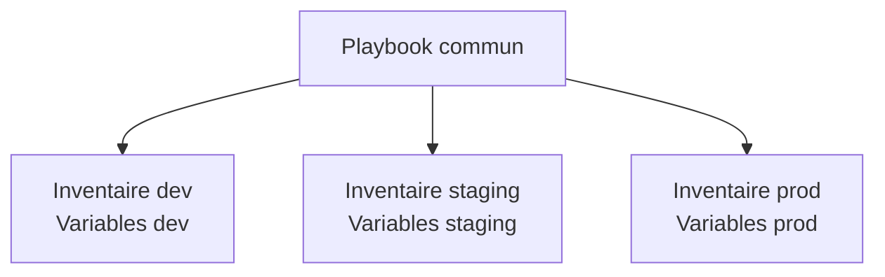

---
tags:
  - Ansible
  - Avancé
  - Pratique
description: "Gestion Multi-Environnement"
estimated_time: "175 min"
fiche_number: 13
total_fiches: 14
cursus: "Ansible"
---

# 13 - Gestion Multi-Environnement

> **En bref** : À la fin de cette fiche, tu sauras organiser un projet Ansible pour gérer plusieurs environnements (développement, staging, production) de manière propre et sécurisée. Lecture estimée : 175 min.


## Prérequis

- Fiches [01 - Introduction à Ansible](01-introduction-ansible.md) à [10 - Les Rôles](10-roles.md) de ce cursus (lues et comprises)
- Fiche **[12 - Ansible Vault](12-ansible-vault.md)** (chiffrement des secrets maîtrisé)
- Un projet Ansible fonctionnel avec au moins un rôle et un playbook
- Savoir utiliser `group_vars`, `host_vars` et les rôles

## Objectif de cette fiche

À la fin de cette fiche, tu sauras organiser un projet Ansible pour gérer plusieurs environnements (développement, staging, production) de manière propre et sécurisée.

---

## Concepts

Cette section explique tous les concepts nécessaires. Lis-la entièrement avant de passer aux étapes pratiques.

### Qu'est-ce que la gestion multi-environnement ?

**Définition** : La gestion multi-environnement est la capacité à gérer plusieurs cibles de déploiement (développement, staging, production) avec le même code Ansible, mais des configurations différentes pour chaque environnement.

**Le problème que la gestion multi-environnement résout** :

Sans gestion multi-environnement, voici les problèmes rencontrés :

1. **Duplication de code** : Tu dupliques tes playbooks pour chaque environnement (un `playbook-dev.yml`, un `playbook-staging.yml`, un `playbook-prod.yml`). Chaque modification doit être reportée dans tous les fichiers.

2. **Configurations mélangées** : Les variables de développement (mode debug activé, mot de passe simple) et de production (mode debug désactivé, mot de passe fort) sont dans le même fichier. Tu risques de déployer une configuration de développement en production.

3. **Pas de progression contrôlée** : Sans environnements séparés, tu ne peux pas tester un changement en staging avant de l'appliquer en production. Chaque modification est directement appliquée sur les serveurs de production.

4. **Secrets partagés** : Si un seul fichier contient les secrets de tous les environnements, une personne ayant accès aux secrets de développement a aussi accès à ceux de production.

**Comment la gestion multi-environnement résout ces problèmes** :

| Problème                      | Solution apportée par la gestion multi-environnement                                     |
| ----------------------------- | ---------------------------------------------------------------------------------------- |
| Duplication de code           | Un seul jeu de playbooks et de rôles, partagé par tous les environnements                |
| Configurations mélangées      | Chaque environnement a son propre dossier de variables, séparé des autres                |
| Pas de progression contrôlée  | Tu déploies d'abord en dev, puis en staging, puis en production avec le même code        |
| Secrets partagés              | Chaque environnement a son propre fichier vault avec son propre mot de passe de chiffrement |

**Analogie concrète** : La gestion multi-environnement fonctionne comme un restaurant avec plusieurs établissements dans différentes villes. Les recettes (playbooks) et techniques de cuisine (rôles) sont les mêmes partout. Mais chaque établissement a ses propres fournisseurs (variables) : Lyon utilise un boucher lyonnais, Paris un boucher parisien. Le chef (toi) envoie la même recette à tous les établissements, chacun l'exécute avec ses ingrédients locaux.

Le diagramme suivant montre comment un playbook commun est utilisé avec des inventaires et variables différents par environnement.



**Ce que la gestion multi-environnement n'est PAS** :

- La gestion multi-environnement n'est pas la gestion de plusieurs projets. Ici, il s'agit d'un seul projet déployé dans des contextes différents. Si tu gères deux applications complètement différentes (un site web et une API), ce sont deux projets distincts, pas deux environnements.
- La gestion multi-environnement ne signifie pas que les environnements sont identiques. Le nombre de serveurs, les ressources allouées et les fonctionnalités activées peuvent différer. Ce qui est identique, c'est le code Ansible qui les gère.

---

### Qu'est-ce qu'un inventaire par environnement ?

**Définition** : Un inventaire par environnement est un fichier d'inventaire dédié à un seul environnement. Chaque environnement (dev, staging, production) possède son propre fichier `hosts.yml` qui liste les machines de cet environnement.

**Le problème que les inventaires par environnement résolvent** :

Sans inventaires séparés, voici les problèmes rencontrés :

1. **Un seul inventaire pour tout** : Toutes les machines (dev, staging, production) sont dans le même fichier. Tu dois utiliser des groupes pour distinguer les environnements, ce qui alourdit le fichier et augmente le risque d'erreur.

2. **Risque de ciblage erroné** : Avec un inventaire unique, une erreur dans le pattern `hosts` du playbook peut cibler les machines de production alors que tu voulais cibler le développement.

**Comment les inventaires par environnement résolvent ces problèmes** :

| Problème                     | Solution apportée par les inventaires séparés                                          |
| ---------------------------- | -------------------------------------------------------------------------------------- |
| Un seul inventaire pour tout | Chaque environnement a son propre fichier, court et lisible                            |
| Risque de ciblage erroné     | Tu sélectionnes l'environnement avec le flag `-i`, ce qui élimine toute ambiguïté      |

**Analogie concrète** : Les inventaires par environnement fonctionnent comme des carnets d'adresses séparés. Tu as un carnet pour tes contacts professionnels et un autre pour tes contacts personnels. Quand tu envoies un message professionnel, tu ouvres le carnet professionnel. Impossible d'envoyer accidentellement un message professionnel à un contact personnel.

**Comment sélectionner un environnement à l'exécution** :

```bash
# Déployer en développement
ansible-playbook -i inventories/dev/hosts.yml playbooks/site.yml

# Déployer en staging
ansible-playbook -i inventories/staging/hosts.yml playbooks/site.yml

# Déployer en production
ansible-playbook -i inventories/production/hosts.yml playbooks/site.yml
```

Le flag `-i` (inventory) détermine sur quelles machines le playbook s'exécute. Le playbook `site.yml` est le même dans les trois cas. Seules les machines cibles et leurs variables changent.

---

### Qu'est-ce que la structure group_vars par environnement ?

**Définition** : La structure `group_vars` par environnement consiste à placer les fichiers de variables directement dans le dossier de chaque inventaire. Chaque inventaire possède son propre dossier `group_vars/` contenant les variables spécifiques à cet environnement.

**Le problème que cette structure résout** :

Sans `group_vars` par environnement, voici les problèmes rencontrés :

1. **Variables mélangées** : Si tu utilises un seul dossier `group_vars/` à la racine du projet, tu dois trouver un moyen de distinguer les variables de dev et de production, souvent avec des noms de variables alambiqués (`db_host_dev`, `db_host_prod`).

2. **Surcharge impossible** : Tu ne peux pas avoir une valeur par défaut et une valeur spécifique par environnement sans complexifier la logique.

**Comment cette structure résout ces problèmes** :

| Problème               | Solution                                                                              |
| ---------------------- | ------------------------------------------------------------------------------------- |
| Variables mélangées    | Chaque environnement a son propre dossier `group_vars/`, physiquement séparé          |
| Surcharge impossible   | Les variables du dossier d'inventaire surchargent celles de la racine du projet        |

**Comment la résolution des variables fonctionne** :

Quand tu exécutes `ansible-playbook -i inventories/production/hosts.yml`, Ansible charge les variables dans cet ordre (du moins prioritaire au plus prioritaire) :

1. `group_vars/all.yml` à la racine du projet (valeurs par défaut partagées)
2. `inventories/production/group_vars/all.yml` (valeurs spécifiques à la production)

Si une même variable est définie aux deux niveaux, la valeur de l'inventaire (niveau 2) gagne.

**Exemple concret** :

```text
# Racine du projet : valeurs par défaut
group_vars/all.yml         -->  app_debug: false

# Inventaire dev : surcharge pour le développement
inventories/dev/group_vars/all.yml        -->  app_debug: true

# Inventaire production : pas de surcharge, garde la valeur par défaut
inventories/production/group_vars/all.yml -->  (app_debug non défini, donc false)
```

Résultat :

- En dev, `app_debug` vaut `true` (surchargé par l'inventaire dev)
- En production, `app_debug` vaut `false` (valeur par défaut de la racine)

---

### Qu'est-ce que la structure de projet recommandée ?

**Définition** : La structure de projet recommandée est l'organisation standardisée des fichiers et dossiers d'un projet Ansible multi-environnement. Elle sépare le code (rôles, playbooks) des données (inventaires, variables) pour chaque environnement.

**Structure complète** :

```text
ansible-project/
├── ansible.cfg
├── group_vars/
│   └── all.yml
├── inventories/
│   ├── dev/
│   │   ├── hosts.yml
│   │   └── group_vars/
│   │       ├── all.yml
│   │       └── vault.yml
│   ├── staging/
│   │   ├── hosts.yml
│   │   └── group_vars/
│   │       ├── all.yml
│   │       └── vault.yml
│   └── production/
│       ├── hosts.yml
│       └── group_vars/
│           ├── all.yml
│           └── vault.yml
├── roles/
│   ├── common/
│   │   ├── tasks/
│   │   │   └── main.yml
│   │   ├── handlers/
│   │   │   └── main.yml
│   │   ├── templates/
│   │   └── defaults/
│   │       └── main.yml
│   ├── nginx/
│   │   ├── tasks/
│   │   │   └── main.yml
│   │   ├── handlers/
│   │   │   └── main.yml
│   │   ├── templates/
│   │   │   └── nginx.conf.j2
│   │   └── defaults/
│   │       └── main.yml
│   └── app/
│       ├── tasks/
│       │   └── main.yml
│       ├── templates/
│       └── defaults/
│           └── main.yml
├── playbooks/
│   ├── site.yml
│   ├── webservers.yml
│   └── databases.yml
├── files/
├── templates/
└── requirements.yml
```

**Explication de chaque élément** :

| Élément                           | Rôle                                                                           |
| --------------------------------- | ------------------------------------------------------------------------------ |
| `ansible.cfg`                     | Configuration globale du projet (inventaire par défaut, options SSH, etc.)      |
| `group_vars/all.yml`             | Variables par défaut partagées par tous les environnements                      |
| `inventories/<env>/hosts.yml`     | Liste des machines de cet environnement                                        |
| `inventories/<env>/group_vars/`   | Variables spécifiques à cet environnement (surchargent les valeurs par défaut) |
| `inventories/<env>/group_vars/vault.yml` | Secrets chiffrés de cet environnement (mots de passe, clés API)         |
| `roles/`                          | Code réutilisable, identique pour tous les environnements                      |
| `playbooks/`                      | Playbooks qui orchestrent les rôles                                            |
| `files/`                          | Fichiers statiques copiés tels quels sur les machines cibles                   |
| `templates/`                      | Templates Jinja2 partagés (les templates spécifiques vont dans les rôles)      |
| `requirements.yml`                | Liste des rôles et collections externes à installer via Ansible Galaxy         |

**Règle fondamentale** : Le code (rôles, playbooks, templates) est partagé. Les données (inventaires, variables, secrets) sont spécifiques à chaque environnement. Cette séparation garantit qu'une modification du code s'applique à tous les environnements, et qu'une modification de données n'affecte qu'un seul environnement.

---

### Qu'est-ce que le Vault par environnement ?

**Définition** : Le Vault par environnement consiste à créer un fichier `vault.yml` chiffré distinct dans chaque dossier d'inventaire, avec potentiellement un mot de passe de chiffrement différent par environnement.

**Le problème que le Vault par environnement résout** :

Sans Vault par environnement, voici les problèmes rencontrés :

1. **Secrets partagés** : Si tous les secrets sont dans un seul fichier vault, une personne ayant le mot de passe de déchiffrement peut accéder aux secrets de tous les environnements, y compris la production.

2. **Pas de cloisonnement** : En entreprise, les développeurs ont souvent accès à l'environnement de développement mais pas à la production. Avec un vault unique, ce cloisonnement est impossible.

**Comment le Vault par environnement résout ces problèmes** :

| Problème            | Solution                                                                                           |
| ------------------- | -------------------------------------------------------------------------------------------------- |
| Secrets partagés    | Chaque environnement a son propre fichier vault, déchiffrable uniquement avec son propre mot de passe |
| Pas de cloisonnement | On peut distribuer le mot de passe dev à toute l'équipe et restreindre le mot de passe prod aux admins |

**Vault IDs : gérer plusieurs mots de passe** :

Ansible permet d'attribuer un identifiant (_vault ID_) à chaque mot de passe de vault. Cela permet d'utiliser plusieurs mots de passe différents dans un même projet.

```bash
# Chiffrer le vault de dev avec l'identifiant "dev"
ansible-vault encrypt --vault-id dev@prompt inventories/dev/group_vars/vault.yml

# Chiffrer le vault de production avec l'identifiant "prod"
ansible-vault encrypt --vault-id prod@prompt inventories/production/group_vars/vault.yml

# Exécuter un playbook qui utilise les deux vaults
ansible-playbook -i inventories/production/hosts.yml playbooks/site.yml \
  --vault-id dev@.vault_pass_dev \
  --vault-id prod@.vault_pass_prod
```

**Explication de la syntaxe `--vault-id`** :

| Élément                          | Signification                                                          |
| -------------------------------- | ---------------------------------------------------------------------- |
| `dev@prompt`                     | Vault ID "dev", demande le mot de passe de manière interactive         |
| `prod@.vault_pass_prod`          | Vault ID "prod", lit le mot de passe depuis le fichier `.vault_pass_prod` |
| `dev@.vault_pass_dev`            | Vault ID "dev", lit le mot de passe depuis le fichier `.vault_pass_dev`  |

**Règle de sécurité** : Les fichiers de mot de passe (`.vault_pass_dev`, `.vault_pass_prod`) ne doivent jamais être committé dans Git. Ajoute-les dans `.gitignore`.

---

## Étapes Pratiques

### Étape 1 : Créer la structure de répertoires

Crée l'arborescence complète du projet multi-environnement.

```bash
# Crée le dossier du projet
mkdir -p ~/ansible-multi-env

# Crée les dossiers d'inventaire pour chaque environnement
mkdir -p ~/ansible-multi-env/inventories/dev/group_vars
mkdir -p ~/ansible-multi-env/inventories/staging/group_vars
mkdir -p ~/ansible-multi-env/inventories/production/group_vars

# Crée les dossiers pour les rôles
mkdir -p ~/ansible-multi-env/roles
mkdir -p ~/ansible-multi-env/playbooks
mkdir -p ~/ansible-multi-env/files
mkdir -p ~/ansible-multi-env/templates

# Crée le dossier group_vars à la racine pour les variables partagées
mkdir -p ~/ansible-multi-env/group_vars
```

**Résultat attendu** :

```text
# Aucune sortie. Les dossiers sont créés silencieusement.
```

Vérifie la structure créée :

```bash
# Affiche l'arborescence du projet
find ~/ansible-multi-env -type d | sort
```

**Résultat attendu** :

```text
/home/loic/ansible-multi-env
/home/loic/ansible-multi-env/files
/home/loic/ansible-multi-env/group_vars
/home/loic/ansible-multi-env/inventories
/home/loic/ansible-multi-env/inventories/dev
/home/loic/ansible-multi-env/inventories/dev/group_vars
/home/loic/ansible-multi-env/inventories/production
/home/loic/ansible-multi-env/inventories/production/group_vars
/home/loic/ansible-multi-env/inventories/staging
/home/loic/ansible-multi-env/inventories/staging/group_vars
/home/loic/ansible-multi-env/playbooks
/home/loic/ansible-multi-env/roles
/home/loic/ansible-multi-env/templates
```

---

### Étape 2 : Créer les inventaires par environnement

Chaque environnement a ses propres machines avec des adresses IP différentes.

**Inventaire de développement** (`inventories/dev/hosts.yml`) :

```yaml
---
all:
  children:
    webservers:
      hosts:
        dev-web1:
          ansible_host: 192.168.56.10
    dbservers:
      hosts:
        dev-db1:
          ansible_host: 192.168.56.20
```

**Inventaire de staging** (`inventories/staging/hosts.yml`) :

```yaml
---
all:
  children:
    webservers:
      hosts:
        staging-web1:
          ansible_host: 10.0.1.10
    dbservers:
      hosts:
        staging-db1:
          ansible_host: 10.0.1.20
```

**Inventaire de production** (`inventories/production/hosts.yml`) :

```yaml
---
all:
  children:
    webservers:
      hosts:
        prod-web1:
          ansible_host: 10.0.10.10
        prod-web2:
          ansible_host: 10.0.10.11
    dbservers:
      hosts:
        prod-db1:
          ansible_host: 10.0.10.20
        prod-db2:
          ansible_host: 10.0.10.21
```

**Points importants** :

| Caractéristique         | Dev              | Staging          | Production             |
| ----------------------- | ---------------- | ---------------- | ---------------------- |
| Nombre de serveurs web  | 1                | 1                | 2                      |
| Nombre de serveurs BDD  | 1                | 1                | 2                      |
| Réseau                  | 192.168.56.0/24  | 10.0.1.0/24      | 10.0.10.0/24           |
| Noms des machines       | Préfixe `dev-`   | Préfixe `staging-` | Préfixe `prod-`     |

Les noms de groupes (`webservers`, `dbservers`) sont identiques dans tous les inventaires. C'est essentiel : les playbooks utilisent ces noms de groupes, donc ils doivent être les mêmes partout.

---

### Étape 3 : Configurer les group_vars par environnement

**Étape 3a : Variables partagées par tous les environnements** (fichier `group_vars/all.yml` à la racine du projet) :

```yaml
---
# Variables communes à TOUS les environnements
# Ces valeurs sont les valeurs par défaut.
# Chaque environnement peut les surcharger dans son propre group_vars/all.yml.

# Utilisateur de connexion SSH
ansible_user: deploy

# Chemin vers Python sur les machines distantes
ansible_python_interpreter: /usr/bin/python3

# Fuseau horaire
timezone: Europe/Paris

# Configuration de l'application
app_name: mon-application
app_user: www-data
app_group: www-data

# Configuration Nginx (valeurs par défaut)
nginx_worker_processes: auto
nginx_worker_connections: 1024

# Mode debug désactivé par défaut (activé en dev uniquement)
app_debug: false

# Niveau de log par défaut
app_log_level: warning
```

**Étape 3b : Variables spécifiques au développement** (fichier `inventories/dev/group_vars/all.yml`) :

```yaml
---
# Variables spécifiques à l'environnement de DÉVELOPPEMENT
# Ces valeurs surchargent celles de group_vars/all.yml (racine du projet)

# Activer le mode debug en développement
app_debug: true

# Niveau de log détaillé en développement
app_log_level: debug

# Base de données de développement
db_host: 192.168.56.20
db_port: 5432
db_name: app_dev

# Nginx : configuration légère pour le développement
nginx_worker_processes: 1
nginx_worker_connections: 256

# Pas de SSL en développement
ssl_enabled: false

# Ressources réduites en développement
app_max_memory: 256M
app_workers: 1
```

**Étape 3c : Variables spécifiques au staging** (fichier `inventories/staging/group_vars/all.yml`) :

```yaml
---
# Variables spécifiques à l'environnement de STAGING
# Le staging reproduit la production avec des ressources réduites

# Mode debug désactivé en staging (comme en production)
app_debug: false

# Niveau de log intermédiaire en staging
app_log_level: info

# Base de données de staging
db_host: 10.0.1.20
db_port: 5432
db_name: app_staging

# Nginx : configuration intermédiaire
nginx_worker_processes: 2
nginx_worker_connections: 512

# SSL activé en staging (pour tester les certificats)
ssl_enabled: true

# Ressources intermédiaires
app_max_memory: 512M
app_workers: 2
```

**Étape 3d : Variables spécifiques à la production** (fichier `inventories/production/group_vars/all.yml`) :

```yaml
---
# Variables spécifiques à l'environnement de PRODUCTION

# Mode debug désactivé en production
app_debug: false

# Niveau de log minimal en production (performance)
app_log_level: warning

# Base de données de production
db_host: 10.0.10.20
db_port: 5432
db_name: app_production

# Nginx : configuration optimisée pour la production
nginx_worker_processes: auto
nginx_worker_connections: 4096

# SSL obligatoire en production
ssl_enabled: true

# Ressources maximales en production
app_max_memory: 2G
app_workers: 8
```

**Résumé des différences entre environnements** :

| Variable                    | Dev          | Staging      | Production   |
| --------------------------- | ------------ | ------------ | ------------ |
| `app_debug`                 | `true`       | `false`      | `false`      |
| `app_log_level`             | `debug`      | `info`       | `warning`    |
| `db_name`                   | `app_dev`    | `app_staging` | `app_production` |
| `nginx_worker_connections`  | `256`        | `512`        | `4096`       |
| `ssl_enabled`               | `false`      | `true`       | `true`       |
| `app_max_memory`            | `256M`       | `512M`       | `2G`         |
| `app_workers`               | `1`          | `2`          | `8`          |

---

### Étape 4 : Chiffrer les secrets par environnement

Chaque environnement a ses propres secrets (mots de passe de base de données, clés API) stockés dans un fichier `vault.yml` chiffré.

**Étape 4a : Créer les fichiers vault non chiffrés** :

Fichier `inventories/dev/group_vars/vault.yml` (avant chiffrement) :

```yaml
---
# Secrets de l'environnement de DÉVELOPPEMENT
vault_db_password: "dev_password_simple"
vault_api_key: "dev-api-key-12345"
vault_secret_key: "dev-secret-not-really-secret"
```

Fichier `inventories/staging/group_vars/vault.yml` (avant chiffrement) :

```yaml
---
# Secrets de l'environnement de STAGING
vault_db_password: "staging_Passw0rd_2025!"
vault_api_key: "staging-api-key-67890"
vault_secret_key: "staging-s3cr3t-k3y-f0r-t3st1ng"
```

Fichier `inventories/production/group_vars/vault.yml` (avant chiffrement) :

```yaml
---
# Secrets de l'environnement de PRODUCTION
vault_db_password: "Pr0d_V3ry_S3cur3_P@ssw0rd_2025!"
vault_api_key: "prod-api-key-abcdef-999888"
vault_secret_key: "prod-ultra-s3cr3t-k3y-d0-n0t-sh4r3"
```

**Étape 4b : Chiffrer chaque fichier vault avec un vault ID dédié** :

```bash
# Chiffrer le vault de développement (mot de passe demandé de manière interactive)
ansible-vault encrypt --vault-id dev@prompt inventories/dev/group_vars/vault.yml
```

**Résultat attendu** :

```text
New vault password (dev):
Confirm new vault password (dev):
Encryption successful
```

```bash
# Chiffrer le vault de staging
ansible-vault encrypt --vault-id staging@prompt inventories/staging/group_vars/vault.yml
```

```bash
# Chiffrer le vault de production
ansible-vault encrypt --vault-id prod@prompt inventories/production/group_vars/vault.yml
```

**Étape 4c : Créer des fichiers de mot de passe (optionnel, pour éviter la saisie interactive)** :

```bash
# Crée un fichier contenant le mot de passe du vault dev
echo "mot_de_passe_vault_dev" > ~/ansible-multi-env/.vault_pass_dev

# Crée un fichier contenant le mot de passe du vault staging
echo "mot_de_passe_vault_staging" > ~/ansible-multi-env/.vault_pass_staging

# Crée un fichier contenant le mot de passe du vault production
echo "mot_de_passe_vault_prod" > ~/ansible-multi-env/.vault_pass_prod

# Restreins les permissions des fichiers de mot de passe (lecture seule pour le propriétaire)
chmod 600 ~/ansible-multi-env/.vault_pass_dev
chmod 600 ~/ansible-multi-env/.vault_pass_staging
chmod 600 ~/ansible-multi-env/.vault_pass_prod
```

**Étape 4d : Ajouter les fichiers de mot de passe au .gitignore** :

```bash
# Crée le fichier .gitignore
cat > ~/ansible-multi-env/.gitignore << 'EOF'
# Fichiers de mot de passe Vault - ne JAMAIS committer
.vault_pass_*

# Fichiers temporaires
*.retry
EOF
```

**Étape 4e : Vérifier qu'un fichier vault est bien chiffré** :

```bash
# Affiche le contenu du fichier vault chiffré
cat ~/ansible-multi-env/inventories/dev/group_vars/vault.yml
```

**Résultat attendu** :

```text
$ANSIBLE_VAULT;1.2;AES256;dev
36323361653830343264383062633039353533343536306463343734393166313462356336386236
6431326134356332356361666231633762383062326531660a323737366635643033323237316163
...
```

Le fichier est illisible. Le texte `dev` après `AES256;` indique le vault ID utilisé pour le chiffrement.

---

### Étape 5 : Écrire un playbook commun

Le playbook `site.yml` est le point d'entrée principal. Il est identique pour tous les environnements. Ce sont les variables qui changent, pas le playbook.

Fichier `playbooks/site.yml` :

```yaml
---
- name: Configuration commune à tous les serveurs
  hosts: all
  become: true
  tasks:
    - name: Définir le fuseau horaire
      community.general.timezone:
        name: "{{ timezone }}"

    - name: Installer les paquets de base
      ansible.builtin.apt:
        name:
          - curl
          - htop
          - vim
          - unzip
        state: present
        update_cache: true
        cache_valid_time: 3600

    - name: Afficher l'environnement détecté
      ansible.builtin.debug:
        msg: >
          Serveur {{ inventory_hostname }} -
          Debug={{ app_debug }} -
          Log={{ app_log_level }} -
          DB={{ db_name }}

- name: Configuration des serveurs web
  hosts: webservers
  become: true
  tasks:
    - name: Installer Nginx
      ansible.builtin.apt:
        name: nginx
        state: present

    - name: Déployer la configuration Nginx
      ansible.builtin.template:
        src: ../templates/nginx.conf.j2
        dest: /etc/nginx/nginx.conf
        owner: root
        group: root
        mode: "0644"
      notify: Redémarrer Nginx

    - name: Activer Nginx au démarrage
      ansible.builtin.service:
        name: nginx
        state: started
        enabled: true

  handlers:
    - name: Redémarrer Nginx
      ansible.builtin.service:
        name: nginx
        state: restarted

- name: Configuration des serveurs de base de données
  hosts: dbservers
  become: true
  tasks:
    - name: Installer PostgreSQL
      ansible.builtin.apt:
        name:
          - postgresql
          - postgresql-contrib
        state: present

    - name: Activer PostgreSQL au démarrage
      ansible.builtin.service:
        name: postgresql
        state: started
        enabled: true
```

**Points importants sur ce playbook** :

| Élément                               | Explication                                                                     |
| ------------------------------------- | ------------------------------------------------------------------------------- |
| `{{ timezone }}`                      | Variable définie dans `group_vars/all.yml` (racine), identique partout          |
| `{{ app_debug }}`                     | Variable surchargée par chaque environnement dans son `group_vars/all.yml`      |
| `{{ db_name }}`                       | Variable différente par environnement (`app_dev`, `app_staging`, `app_production`) |
| `hosts: all`                          | Cible toutes les machines de l'inventaire sélectionné avec `-i`                 |
| `hosts: webservers`                   | Cible le groupe `webservers` (le même nom dans tous les inventaires)            |
| Le playbook ne mentionne aucun environnement | C'est le flag `-i` qui détermine l'environnement, pas le playbook       |

---

### Étape 6 : Exécuter sur un environnement spécifique

**Déployer en développement** :

```bash
# Exécuter le playbook sur l'environnement de développement
ansible-playbook -i inventories/dev/hosts.yml playbooks/site.yml \
  --vault-id dev@.vault_pass_dev
```

**Résultat attendu** :

```text
PLAY [Configuration commune à tous les serveurs] ******************************

TASK [Gathering Facts] *********************************************************
ok: [dev-web1]
ok: [dev-db1]

TASK [Définir le fuseau horaire] ***********************************************
ok: [dev-web1]
ok: [dev-db1]

TASK [Installer les paquets de base] *******************************************
changed: [dev-web1]
changed: [dev-db1]

TASK [Afficher l'environnement détecté] ****************************************
ok: [dev-web1] => {
    "msg": "Serveur dev-web1 - Debug=True - Log=debug - DB=app_dev"
}
ok: [dev-db1] => {
    "msg": "Serveur dev-db1 - Debug=True - Log=debug - DB=app_dev"
}

PLAY [Configuration des serveurs web] *****************************************

TASK [Gathering Facts] *********************************************************
ok: [dev-web1]

TASK [Installer Nginx] *********************************************************
changed: [dev-web1]

...

PLAY RECAP *********************************************************************
dev-db1                    : ok=4    changed=1    unreachable=0    failed=0    skipped=0
dev-web1                   : ok=7    changed=3    unreachable=0    failed=0    skipped=0
```

**Déployer en production** :

```bash
# Exécuter le même playbook sur l'environnement de production
ansible-playbook -i inventories/production/hosts.yml playbooks/site.yml \
  --vault-id prod@.vault_pass_prod
```

**Résultat attendu** :

```text
PLAY [Configuration commune à tous les serveurs] ******************************

TASK [Gathering Facts] *********************************************************
ok: [prod-web1]
ok: [prod-web2]
ok: [prod-db1]
ok: [prod-db2]

...

TASK [Afficher l'environnement détecté] ****************************************
ok: [prod-web1] => {
    "msg": "Serveur prod-web1 - Debug=False - Log=warning - DB=app_production"
}
ok: [prod-web2] => {
    "msg": "Serveur prod-web2 - Debug=False - Log=warning - DB=app_production"
}

...

PLAY RECAP *********************************************************************
prod-db1                   : ok=4    changed=1    unreachable=0    failed=0    skipped=0
prod-db2                   : ok=4    changed=1    unreachable=0    failed=0    skipped=0
prod-web1                  : ok=7    changed=3    unreachable=0    failed=0    skipped=0
prod-web2                  : ok=7    changed=3    unreachable=0    failed=0    skipped=0
```

**Comparaison des sorties** : Le même playbook produit des résultats différents selon l'environnement :

- En dev : `Debug=True`, `Log=debug`, `DB=app_dev`, 2 machines
- En production : `Debug=False`, `Log=warning`, `DB=app_production`, 4 machines

---

### Étape 7 : Configurer ansible.cfg pour simplifier les commandes

Le fichier `ansible.cfg` permet de définir des valeurs par défaut pour éviter de taper des options longues à chaque commande.

Fichier `ansible.cfg` (à la racine du projet) :

```ini
[defaults]
# Inventaire par défaut : le développement
# Cela évite de taper -i inventories/dev/hosts.yml à chaque commande
inventory = inventories/dev/hosts.yml

# Désactiver la vérification des clés SSH (utile en dev, à activer en prod)
host_key_checking = False

# Afficher les tâches modifiées en couleur
force_color = True

# Paralléliser l'exécution sur 10 machines simultanément
forks = 10

# Fichier de log
log_path = ansible.log

# Désactiver les warnings de dépréciation pendant l'apprentissage
deprecation_warnings = False

[privilege_escalation]
# Utiliser sudo par défaut pour l'élévation de privilèges
become_method = sudo
```

**Utilisation avec ansible.cfg** :

```bash
# En développement : pas besoin de -i, l'inventaire par défaut est dev
ansible-playbook playbooks/site.yml --vault-id dev@.vault_pass_dev

# En staging : on spécifie explicitement l'inventaire
ansible-playbook -i inventories/staging/hosts.yml playbooks/site.yml \
  --vault-id staging@.vault_pass_staging

# En production : on spécifie explicitement l'inventaire
ansible-playbook -i inventories/production/hosts.yml playbooks/site.yml \
  --vault-id prod@.vault_pass_prod
```

**Règle** : L'inventaire par défaut dans `ansible.cfg` doit toujours pointer vers l'environnement le moins risqué (développement). Cela garantit que si tu oublies le flag `-i`, le playbook s'exécute en développement, pas en production.

---

### Étape 8 : Vérifier les variables par environnement

Avant d'exécuter un playbook, tu peux vérifier quelles variables seront utilisées pour un environnement donné.

**Vérifier l'inventaire de développement** :

```bash
# Affiche toutes les machines et leurs variables pour l'environnement dev
ansible-inventory -i inventories/dev/hosts.yml --list
```

**Résultat attendu** (format JSON, extrait) :

```text
{
    "_meta": {
        "hostvars": {
            "dev-web1": {
                "ansible_host": "192.168.56.10",
                "ansible_user": "deploy",
                "app_debug": true,
                "app_log_level": "debug",
                "db_name": "app_dev",
                ...
            },
            "dev-db1": {
                "ansible_host": "192.168.56.20",
                "ansible_user": "deploy",
                "app_debug": true,
                "app_log_level": "debug",
                "db_name": "app_dev",
                ...
            }
        }
    },
    ...
}
```

**Vérifier l'inventaire de production** :

```bash
# Affiche toutes les machines et leurs variables pour l'environnement production
ansible-inventory -i inventories/production/hosts.yml --list
```

**Résultat attendu** (format JSON, extrait) :

```text
{
    "_meta": {
        "hostvars": {
            "prod-web1": {
                "ansible_host": "10.0.10.10",
                "ansible_user": "deploy",
                "app_debug": false,
                "app_log_level": "warning",
                "db_name": "app_production",
                ...
            },
            ...
        }
    },
    ...
}
```

**Comparer une variable spécifique entre environnements** :

```bash
# Affiche app_debug pour dev
ansible all -i inventories/dev/hosts.yml -m debug -a "var=app_debug" --connection=local
```

**Résultat attendu** :

```text
dev-web1 | SUCCESS => {
    "app_debug": true
}
dev-db1 | SUCCESS => {
    "app_debug": true
}
```

```bash
# Affiche app_debug pour production
ansible all -i inventories/production/hosts.yml -m debug -a "var=app_debug" --connection=local
```

**Résultat attendu** :

```text
prod-web1 | SUCCESS => {
    "app_debug": false
}
prod-web2 | SUCCESS => {
    "app_debug": false
}
prod-db1 | SUCCESS => {
    "app_debug": false
}
prod-db2 | SUCCESS => {
    "app_debug": false
}
```

**Afficher l'arbre des groupes d'un environnement** :

```bash
# Arbre de l'environnement de production
ansible-inventory -i inventories/production/hosts.yml --graph
```

**Résultat attendu** :

```text
@all:
  |--@dbservers:
  |  |--prod-db1
  |  |--prod-db2
  |--@ungrouped:
  |--@webservers:
  |  |--prod-web1
  |  |--prod-web2
```

---

## Commandes Utiles

| Commande                                                                      | Action                                                          |
| ----------------------------------------------------------------------------- | --------------------------------------------------------------- |
| `ansible-playbook -i inventories/dev/hosts.yml playbooks/site.yml`            | Exécuter un playbook sur l'environnement dev                    |
| `ansible-playbook -i inventories/production/hosts.yml playbooks/site.yml`     | Exécuter un playbook sur l'environnement production             |
| `ansible-inventory -i inventories/dev/hosts.yml --list`                       | Afficher toutes les machines et variables de l'environnement dev |
| `ansible-inventory -i inventories/production/hosts.yml --graph`               | Afficher l'arbre des groupes de la production                   |
| `ansible-inventory -i inventories/dev/hosts.yml --host dev-web1`              | Afficher les variables d'un hôte spécifique en dev              |
| `ansible-vault encrypt --vault-id dev@prompt <fichier>`                       | Chiffrer un fichier avec le vault ID "dev"                      |
| `ansible-vault decrypt --vault-id dev@.vault_pass_dev <fichier>`              | Déchiffrer un fichier avec le mot de passe du vault dev         |
| `ansible-vault view --vault-id prod@.vault_pass_prod <fichier>`               | Lire un fichier vault sans le déchiffrer sur disque             |
| `ansible-playbook site.yml --vault-id dev@.vault_pass_dev --vault-id prod@.vault_pass_prod` | Exécuter avec plusieurs mots de passe vault |
| `ansible-playbook -i inventories/production/hosts.yml playbooks/site.yml --check` | Simuler l'exécution en production sans appliquer de changements |

---

## Pièges Fréquents

### Piège 1 : Exécuter un playbook sur le mauvais environnement

**Problème** : Tu oublies le flag `-i` ou tu te trompes d'inventaire, et ton playbook s'exécute sur la production au lieu du développement.

**Exemple dangereux** :

```bash
# Tu crois être en dev, mais tu as oublié -i et ansible.cfg pointe vers la production
ansible-playbook playbooks/site.yml
```

**Solution** :

1. Configure `ansible.cfg` avec l'inventaire de développement comme valeur par défaut. Ainsi, l'oubli du flag `-i` cible le dev, pas la production.
2. Utilise toujours l'option `--check` (dry run) avant d'exécuter un playbook en production.
3. Ajoute une tâche de confirmation dans tes playbooks de production :

```yaml
- name: Confirmer le déploiement en production
  ansible.builtin.pause:
    prompt: "Tu es sur le point de déployer en PRODUCTION. Tape 'oui' pour continuer"
  when: "'production' in inventory_dir"
  register: confirmation
  failed_when: confirmation.user_input != "oui"
```

---

### Piège 2 : Oublier de mettre à jour tous les environnements lors de l'ajout d'une variable

**Problème** : Tu ajoutes une nouvelle variable dans `inventories/dev/group_vars/all.yml` mais tu oublies de l'ajouter dans `inventories/staging/group_vars/all.yml` et `inventories/production/group_vars/all.yml`. Le playbook fonctionne en dev mais échoue en staging ou production avec l'erreur `undefined variable`.

**Message d'erreur typique** :

```text
fatal: [staging-web1]: FAILED! => {"msg": "The task includes an option with an undefined variable.
The error was: 'app_max_upload_size' is undefined"}
```

**Solution** :

1. Définis les valeurs par défaut dans `group_vars/all.yml` (à la racine du projet). Cette valeur sera utilisée si l'environnement ne la surcharge pas. Ainsi, tu n'oublies jamais une variable.
2. Ne définis dans les `group_vars` d'un environnement que les variables qui _diffèrent_ de la valeur par défaut.
3. Après chaque ajout de variable, vérifie tous les environnements :

```bash
# Vérifie que la variable existe en dev
ansible all -i inventories/dev/hosts.yml -m debug -a "var=app_max_upload_size" --connection=local

# Vérifie que la variable existe en staging
ansible all -i inventories/staging/hosts.yml -m debug -a "var=app_max_upload_size" --connection=local

# Vérifie que la variable existe en production
ansible all -i inventories/production/hosts.yml -m debug -a "var=app_max_upload_size" --connection=local
```

---

### Piège 3 : Mélanger variables spécifiques et partagées au mauvais endroit

**Problème** : Tu places une variable spécifique à un environnement (comme `db_host`) dans `group_vars/all.yml` à la racine du projet au lieu de la mettre dans l'inventaire de l'environnement. Résultat : tous les environnements utilisent la même valeur de `db_host`.

**Exemple incorrect** :

```text
# ❌ group_vars/all.yml (racine) :
db_host: 192.168.56.20    # C'est l'IP de dev, mais prod utilise 10.0.10.20
```

**Exemple correct** :

```text
# ✅ group_vars/all.yml (racine) :
# Pas de db_host ici (la valeur diffère selon l'environnement)

# ✅ inventories/dev/group_vars/all.yml :
db_host: 192.168.56.20

# ✅ inventories/production/group_vars/all.yml :
db_host: 10.0.10.20
```

**Règle** : Si une variable a la même valeur dans tous les environnements, place-la dans `group_vars/all.yml` à la racine. Si elle diffère selon l'environnement, place-la dans `inventories/<env>/group_vars/all.yml`.

---

### Piège 4 : Utiliser un seul mot de passe Vault pour tous les environnements

**Problème** : Tu utilises le même mot de passe pour chiffrer les fichiers vault de tous les environnements. Résultat : toute personne ayant le mot de passe du vault de développement peut aussi déchiffrer les secrets de production.

**Solution** : Utilise un vault ID différent et un mot de passe différent par environnement :

| Environnement | Vault ID     | Fichier de mot de passe    | Qui a accès                |
| -------------- | ------------ | -------------------------- | -------------------------- |
| dev            | `dev`        | `.vault_pass_dev`          | Tous les développeurs      |
| staging        | `staging`    | `.vault_pass_staging`      | Développeurs seniors       |
| production     | `prod`       | `.vault_pass_prod`         | Administrateurs uniquement |

---

### Piège 5 : Ne pas tester en staging avant de déployer en production

**Problème** : Tu déploies directement en production après avoir testé uniquement en développement. L'environnement de développement ne reproduit pas toutes les conditions de production (nombre de serveurs, SSL, volumes de données). Un bug peut apparaître en production mais pas en développement.

**Solution** : Respecte toujours cet ordre de déploiement :

```text
1. Développement  --> Tester les nouvelles fonctionnalités
         |
         v
2. Staging        --> Valider dans un environnement proche de la production
         |
         v
3. Production     --> Déployer en confiance
```

Commandes dans l'ordre :

```bash
# 1. Déployer et tester en dev
ansible-playbook -i inventories/dev/hosts.yml playbooks/site.yml --vault-id dev@.vault_pass_dev

# 2. Déployer et valider en staging
ansible-playbook -i inventories/staging/hosts.yml playbooks/site.yml --vault-id staging@.vault_pass_staging

# 3. Simuler en production (dry run)
ansible-playbook -i inventories/production/hosts.yml playbooks/site.yml --vault-id prod@.vault_pass_prod --check

# 4. Déployer en production
ansible-playbook -i inventories/production/hosts.yml playbooks/site.yml --vault-id prod@.vault_pass_prod
```

---

## Checklist de Validation

- [ ] J'ai créé des inventaires séparés pour au moins 2 environnements (dev et production)
- [ ] Les noms de groupes (`webservers`, `dbservers`) sont identiques dans tous les inventaires
- [ ] J'ai des `group_vars` distincts par environnement avec des valeurs différentes
- [ ] J'ai des variables par défaut dans `group_vars/all.yml` à la racine du projet
- [ ] Mon playbook fonctionne sans modification sur tous les environnements (seul le flag `-i` change)
- [ ] Les secrets de chaque environnement sont chiffrés avec Vault et un vault ID dédié
- [ ] Mon fichier `ansible.cfg` pointe vers l'inventaire de développement par défaut
- [ ] Les fichiers de mot de passe vault sont dans `.gitignore`
- [ ] Je sais vérifier les variables d'un environnement avec `ansible-inventory --list`
- [ ] Je sais spécifier l'environnement cible à l'exécution avec le flag `-i`

---

## Exercice Pratique

**Énoncé** : Crée un projet Ansible multi-environnement complet pour déployer une application web composée d'un serveur Nginx et d'un serveur PostgreSQL.

**Spécifications** :

Le projet doit contenir 3 environnements (dev, staging, production) avec les caractéristiques suivantes :

**Inventaires** :

| Environnement | Serveurs web                           | Serveurs BDD                          |
| -------------- | -------------------------------------- | ------------------------------------- |
| dev            | `dev-web1` (192.168.56.10)             | `dev-db1` (192.168.56.20)            |
| staging        | `staging-web1` (10.0.1.10)             | `staging-db1` (10.0.1.20)            |
| production     | `prod-web1` (10.0.10.10), `prod-web2` (10.0.10.11) | `prod-db1` (10.0.10.20) |

**Variables par environnement** :

| Variable             | Dev              | Staging           | Production         |
| -------------------- | ---------------- | ----------------- | ------------------ |
| `app_debug`          | `true`           | `false`           | `false`            |
| `app_log_level`      | `debug`          | `info`            | `error`            |
| `db_name`            | `webapp_dev`     | `webapp_staging`  | `webapp_prod`      |
| `db_max_connections`  | `20`            | `50`              | `200`              |
| `nginx_worker_processes` | `1`          | `2`               | `auto`             |
| `ssl_enabled`        | `false`          | `true`            | `true`             |

**Secrets par environnement** (dans des fichiers vault chiffrés) :

| Secret               | Dev              | Staging                  | Production                       |
| -------------------- | ---------------- | ------------------------ | -------------------------------- |
| `vault_db_password`  | `devpass123`     | `StagingP@ss2025`       | `Pr0d_Sup3r_S3cur3_P@ss!`       |
| `vault_app_secret`   | `dev-secret`     | `staging-s3cr3t-k3y`    | `prod-ult1m4t3-s3cr3t-k3y`      |

**Playbook** :

Un seul fichier `playbooks/site.yml` qui :

1. Installe les paquets de base sur toutes les machines (`curl`, `htop`, `vim`)
2. Affiche un message de debug avec le nom de la base de données et le niveau de log
3. Installe et démarre Nginx sur le groupe `webservers`
4. Installe et démarre PostgreSQL sur le groupe `dbservers`

**Fichier ansible.cfg** :

- Inventaire par défaut : développement
- Forks : 10
- Host key checking : désactivé

**Indications** :

- Place les variables partagées (identiques dans tous les environnements) dans `group_vars/all.yml` à la racine
- Place les variables spécifiques dans `inventories/<env>/group_vars/all.yml`
- Chiffre chaque fichier vault avec un vault ID dédié (`dev`, `staging`, `prod`)
- Crée un `.gitignore` qui exclut les fichiers `.vault_pass_*`
- Utilise `ansible-inventory --list` pour vérifier les variables de chaque environnement

**Résultat attendu** :

- `ansible-inventory -i inventories/dev/hosts.yml --host dev-web1` affiche `app_debug: true` et `db_name: webapp_dev`
- `ansible-inventory -i inventories/production/hosts.yml --host prod-web1` affiche `app_debug: false` et `db_name: webapp_prod`
- Le playbook s'exécute sans erreur sur chaque environnement en changeant uniquement le flag `-i`
- Les fichiers vault sont chiffrés et illisibles sans le mot de passe

---

## Solution de l'Exercice

> **Note** : Cette section contient la solution complète. Essaie d'abord de résoudre l'exercice par toi-même avant de consulter cette solution.

---

### Structure complète du projet

```text
ansible-multi-env-exercice/
├── ansible.cfg
├── .gitignore
├── .vault_pass_dev
├── .vault_pass_staging
├── .vault_pass_prod
├── group_vars/
│   └── all.yml
├── inventories/
│   ├── dev/
│   │   ├── hosts.yml
│   │   └── group_vars/
│   │       ├── all.yml
│   │       └── vault.yml
│   ├── staging/
│   │   ├── hosts.yml
│   │   └── group_vars/
│   │       ├── all.yml
│   │       └── vault.yml
│   └── production/
│       ├── hosts.yml
│       └── group_vars/
│           ├── all.yml
│           └── vault.yml
└── playbooks/
    └── site.yml
```

### Étape 1 : Créer la structure

```bash
# Crée l'ensemble de la structure
mkdir -p ~/ansible-multi-env-exercice/{group_vars,playbooks}
mkdir -p ~/ansible-multi-env-exercice/inventories/{dev,staging,production}/group_vars
cd ~/ansible-multi-env-exercice
```

### Étape 2 : Fichier ansible.cfg

```ini
[defaults]
inventory = inventories/dev/hosts.yml
host_key_checking = False
forks = 10
force_color = True
deprecation_warnings = False

[privilege_escalation]
become_method = sudo
```

### Étape 3 : Fichier .gitignore

```text
# Fichiers de mot de passe Vault
.vault_pass_*

# Fichiers temporaires Ansible
*.retry

# Log Ansible
ansible.log
```

### Étape 4 : Variables partagées (group_vars/all.yml à la racine)

```yaml
---
# Variables communes à TOUS les environnements
ansible_user: deploy
ansible_python_interpreter: /usr/bin/python3
timezone: Europe/Paris
app_name: webapp
app_user: www-data
app_group: www-data
```

### Étape 5 : Inventaire de développement

Fichier `inventories/dev/hosts.yml` :

```yaml
---
all:
  children:
    webservers:
      hosts:
        dev-web1:
          ansible_host: 192.168.56.10
    dbservers:
      hosts:
        dev-db1:
          ansible_host: 192.168.56.20
```

Fichier `inventories/dev/group_vars/all.yml` :

```yaml
---
# Variables spécifiques à l'environnement de développement
app_debug: true
app_log_level: debug
db_name: webapp_dev
db_host: 192.168.56.20
db_max_connections: 20
nginx_worker_processes: 1
ssl_enabled: false
```

Fichier `inventories/dev/group_vars/vault.yml` (avant chiffrement) :

```yaml
---
vault_db_password: "devpass123"
vault_app_secret: "dev-secret"
```

### Étape 6 : Inventaire de staging

Fichier `inventories/staging/hosts.yml` :

```yaml
---
all:
  children:
    webservers:
      hosts:
        staging-web1:
          ansible_host: 10.0.1.10
    dbservers:
      hosts:
        staging-db1:
          ansible_host: 10.0.1.20
```

Fichier `inventories/staging/group_vars/all.yml` :

```yaml
---
# Variables spécifiques à l'environnement de staging
app_debug: false
app_log_level: info
db_name: webapp_staging
db_host: 10.0.1.20
db_max_connections: 50
nginx_worker_processes: 2
ssl_enabled: true
```

Fichier `inventories/staging/group_vars/vault.yml` (avant chiffrement) :

```yaml
---
vault_db_password: "StagingP@ss2025"
vault_app_secret: "staging-s3cr3t-k3y"
```

### Étape 7 : Inventaire de production

Fichier `inventories/production/hosts.yml` :

```yaml
---
all:
  children:
    webservers:
      hosts:
        prod-web1:
          ansible_host: 10.0.10.10
        prod-web2:
          ansible_host: 10.0.10.11
    dbservers:
      hosts:
        prod-db1:
          ansible_host: 10.0.10.20
```

Fichier `inventories/production/group_vars/all.yml` :

```yaml
---
# Variables spécifiques à l'environnement de production
app_debug: false
app_log_level: error
db_name: webapp_prod
db_host: 10.0.10.20
db_max_connections: 200
nginx_worker_processes: auto
ssl_enabled: true
```

Fichier `inventories/production/group_vars/vault.yml` (avant chiffrement) :

```yaml
---
vault_db_password: "Pr0d_Sup3r_S3cur3_P@ss!"
vault_app_secret: "prod-ult1m4t3-s3cr3t-k3y"
```

### Étape 8 : Chiffrer les fichiers vault

```bash
# Crée les fichiers de mot de passe
echo "vault_dev_password" > .vault_pass_dev
echo "vault_staging_password" > .vault_pass_staging
echo "vault_prod_password" > .vault_pass_prod

# Restreins les permissions
chmod 600 .vault_pass_dev .vault_pass_staging .vault_pass_prod

# Chiffre chaque fichier vault avec son vault ID
ansible-vault encrypt --vault-id dev@.vault_pass_dev inventories/dev/group_vars/vault.yml
ansible-vault encrypt --vault-id staging@.vault_pass_staging inventories/staging/group_vars/vault.yml
ansible-vault encrypt --vault-id prod@.vault_pass_prod inventories/production/group_vars/vault.yml
```

**Résultat attendu** (pour chaque commande) :

```text
Encryption successful
```

### Étape 9 : Playbook commun

Fichier `playbooks/site.yml` :

```yaml
---
- name: Configuration commune à tous les serveurs
  hosts: all
  become: true
  tasks:
    - name: Installer les paquets de base
      ansible.builtin.apt:
        name:
          - curl
          - htop
          - vim
        state: present
        update_cache: true
        cache_valid_time: 3600

    - name: Afficher la configuration de l'environnement
      ansible.builtin.debug:
        msg: >
          Serveur={{ inventory_hostname }}
          DB={{ db_name }}
          Log={{ app_log_level }}
          Debug={{ app_debug }}
          SSL={{ ssl_enabled }}

- name: Configuration des serveurs web
  hosts: webservers
  become: true
  tasks:
    - name: Installer Nginx
      ansible.builtin.apt:
        name: nginx
        state: present

    - name: Activer et démarrer Nginx
      ansible.builtin.service:
        name: nginx
        state: started
        enabled: true

- name: Configuration des serveurs de base de données
  hosts: dbservers
  become: true
  tasks:
    - name: Installer PostgreSQL
      ansible.builtin.apt:
        name:
          - postgresql
          - postgresql-contrib
        state: present

    - name: Activer et démarrer PostgreSQL
      ansible.builtin.service:
        name: postgresql
        state: started
        enabled: true
```

### Étape 10 : Vérification

**Vérifier les variables de dev-web1** :

```bash
# Le --vault-id est nécessaire pour déchiffrer le fichier vault.yml
ansible-inventory -i inventories/dev/hosts.yml --vault-id dev@.vault_pass_dev --host dev-web1
```

**Résultat attendu** :

```json
{
    "ansible_host": "192.168.56.10",
    "ansible_python_interpreter": "/usr/bin/python3",
    "ansible_user": "deploy",
    "app_debug": true,
    "app_log_level": "debug",
    "app_name": "webapp",
    "app_user": "www-data",
    "app_group": "www-data",
    "db_host": "192.168.56.20",
    "db_max_connections": 20,
    "db_name": "webapp_dev",
    "nginx_worker_processes": 1,
    "ssl_enabled": false,
    "timezone": "Europe/Paris",
    "vault_app_secret": "dev-secret",
    "vault_db_password": "devpass123"
}
```

**Vérifier les variables de prod-web1** :

```bash
ansible-inventory -i inventories/production/hosts.yml --host prod-web1 \
  --vault-id prod@.vault_pass_prod
```

**Résultat attendu** :

```json
{
    "ansible_host": "10.0.10.10",
    "ansible_python_interpreter": "/usr/bin/python3",
    "ansible_user": "deploy",
    "app_debug": false,
    "app_log_level": "error",
    "app_name": "webapp",
    "app_user": "www-data",
    "app_group": "www-data",
    "db_host": "10.0.10.20",
    "db_max_connections": 200,
    "db_name": "webapp_prod",
    "nginx_worker_processes": "auto",
    "ssl_enabled": true,
    "timezone": "Europe/Paris",
    "vault_app_secret": "prod-ult1m4t3-s3cr3t-k3y",
    "vault_db_password": "Pr0d_Sup3r_S3cur3_P@ss!"
}
```

**Vérifier l'arbre des groupes en production** :

```bash
ansible-inventory -i inventories/production/hosts.yml --graph
```

**Résultat attendu** :

```text
@all:
  |--@dbservers:
  |  |--prod-db1
  |--@ungrouped:
  |--@webservers:
  |  |--prod-web1
  |  |--prod-web2
```

**Exécuter le playbook en dev** :

```bash
ansible-playbook playbooks/site.yml --vault-id dev@.vault_pass_dev
```

**Résultat attendu** (extrait) :

```text
TASK [Afficher la configuration de l'environnement] ****************************
ok: [dev-web1] => {
    "msg": "Serveur=dev-web1 DB=webapp_dev Log=debug Debug=True SSL=False"
}
ok: [dev-db1] => {
    "msg": "Serveur=dev-db1 DB=webapp_dev Log=debug Debug=True SSL=False"
}
```

**Exécuter le playbook en production** :

```bash
ansible-playbook -i inventories/production/hosts.yml playbooks/site.yml \
  --vault-id prod@.vault_pass_prod
```

**Résultat attendu** (extrait) :

```text
TASK [Afficher la configuration de l'environnement] ****************************
ok: [prod-web1] => {
    "msg": "Serveur=prod-web1 DB=webapp_prod Log=error Debug=False SSL=True"
}
ok: [prod-web2] => {
    "msg": "Serveur=prod-web2 DB=webapp_prod Log=error Debug=False SSL=True"
}
ok: [prod-db1] => {
    "msg": "Serveur=prod-db1 DB=webapp_prod Log=error Debug=False SSL=True"
}
```

Les deux exécutions utilisent le même playbook. Seules les variables changent selon l'environnement sélectionné avec le flag `-i`.

---

## Navigation

← Fiche précédente : **[Ansible Vault](12-ansible-vault.md)**

→ Fiche suivante : **[Intégration CI/CD](14-integration-ci-cd.md)**
