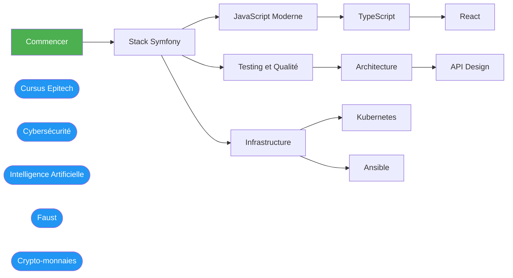

---
hide:
  - navigation
  - toc
description: "Vue d'ensemble des 604 fiches réparties sur 64 cursus."
---

# Carte des cursus

> **En bref** : Vue d'ensemble de tous les cursus disponibles, avec le nombre de fiches et le temps estimé.

**604 fiches** au total, réparties sur **64 cursus**.

## Dépendances entre cursus

Les cursus en bleu sont **indépendants** : ils ne nécessitent aucun prérequis et peuvent être suivis directement.

## Développement Web

| Cursus | Fiches | Temps estimé | Niveaux |
| ------ | -----: | -----------: | ------- |
| **[Commencer](commencer/index.md)** | 2 | 1h 45min | Débutant |
| **[Docker](01-docker/index.md)** | 2 | 3h 30min | Débutant |
| **[EasyAdmin](03-easyadmin/index.md)** | 7 | 8h | Débutant → Intermédiaire → Avancé |
| **[PHP](02-php/index.md)** | 14 | 15h | Débutant → Intermédiaire → Avancé |
| **[Symfony](03-symfony/index.md)** | 21 | 25h 10min | Débutant → Intermédiaire → Avancé |
| **[PostgreSQL](04-postgresql/index.md)** | 8 | 16h 40min | Débutant → Intermédiaire |
| **[JavaScript](05-javascript/index.md)** | 7 | 8h | Débutant → Intermédiaire → Avancé |
| **[JavaScript Moderne (ES6+)](06-javascript-moderne/index.md)** | 14 | 17h 30min | Débutant → Intermédiaire |
| **[TypeScript](07-typescript/index.md)** | 15 | 18h 15min | Débutant → Intermédiaire → Avancé |
| **[React](08-react/index.md)** | 19 | 26h 30min | Débutant → Intermédiaire → Avancé |
| **[Testing et Qualité](09-testing/index.md)** | 15 | 19h 15min | Débutant → Intermédiaire → Avancé |
| **[Architecture et Design Patterns](10-architecture/index.md)** | 17 | 21h 15min | Débutant → Intermédiaire → Avancé |
| **[API Design et Documentation](12-api-design/index.md)** | 10 | 13h 30min | Intermédiaire → Avancé |
| **[Python](15-python/index.md)** | 12 | 14h 45min | Débutant → Intermédiaire |
| **[Python Data](16-python-data/index.md)** | 8 | 10h 30min | Débutant → Intermédiaire |
| **[MongoDB](17-mongodb/index.md)** | 8 | 9h 45min | Débutant → Intermédiaire |
| **[C#](18-csharp/index.md)** | 10 | 12h | Débutant → Intermédiaire |
| **[Dev Mobile](23-dev-mobile/index.md)** | 13 | 16h 30min | Débutant → Intermédiaire → Avancé |
| **[Redis et Cache](13-redis/index.md)** | 8 | 9h 45min | Débutant → Intermédiaire → Avancé |

## Cursus Epitech

| Cursus | Fiches | Temps estimé | Niveaux |
| ------ | -----: | -----------: | ------- |
| **[Java](epitech/01-java/index.md)** | 12 | 13h 15min | Débutant → Intermédiaire → Avancé |
| **[Unix/Bash](epitech/02-unix-bash/index.md)** | 10 | 10h 35min | Débutant → Intermédiaire → Avancé |
| **[Git](epitech/03-git/index.md)** | 5 | 7h 15min | Débutant → Intermédiaire → Avancé |
| **[HTML/CSS](epitech/04-html-css/index.md)** | 7 | 3h 35min | Débutant → Intermédiaire |
| **[JavaScript](epitech/05-javascript/index.md)** | 4 | 2h 35min | Débutant → Intermédiaire |
| **[Node.js](epitech/07-nodejs/index.md)** | 10 | 10h 35min | Débutant → Intermédiaire → Avancé |
| **[Rust](epitech/08-rust/index.md)** | 16 | 19h 15min | Débutant → Intermédiaire → Avancé |
| **[Projets](epitech/06-projets/index.md)** | 2 | 1h | Débutant |
| **[Aide-mémoires Epitech](epitech/fiches-reference/index.md)** | 3 | 1h 20min | Débutant |

## Infrastructure

| Cursus | Fiches | Temps estimé | Niveaux |
| ------ | -----: | -----------: | ------- |
| **[CI/CD Pipelines](11-ci-cd/index.md)** | 10 | 13h 30min | Débutant → Intermédiaire → Avancé |
| **[Podman](devops/01-podman/index.md)** | 5 | 8h 45min | Débutant → Intermédiaire |
| **[OpenShift](devops/02-openshift/index.md)** | 6 | 12h 5min | Débutant → Intermédiaire |
| **[Kubernetes](devops/03-kubernetes/index.md)** | 12 | 16h 45min | Débutant → Intermédiaire → Avancé |
| **[Monitoring et Observabilité](14-monitoring/index.md)** | 10 | 13h 15min | Débutant → Intermédiaire → Avancé |
| **[Réseaux](20-reseaux/index.md)** | 14 | 16h 50min | Débutant → Intermédiaire → Avancé |
| **[Services Système](21-services-systeme/index.md)** | 9 | 12h 30min | Intermédiaire → Avancé |
| **[Cloud](22-cloud/index.md)** | 13 | 16h 45min | Débutant → Intermédiaire → Avancé |
| **[Virtualisation](24-virtualisation/index.md)** | 6 | 8h 30min | Débutant → Intermédiaire → Avancé |
| **[Langage C](19-langage-c/index.md)** | 10 | 12h 45min | Débutant → Intermédiaire |
| **[Ansible](ansible/index.md)** | 14 | 30h 10min | Débutant → Intermédiaire → Avancé |

## Cybersécurité

| Cursus | Fiches | Temps estimé | Niveaux |
| ------ | -----: | -----------: | ------- |
| **[Phase 1 - Fondamentaux informatiques](cybersecurite/01-fondamentaux-informatiques/index.md)** | 4 | 4h 15min | Débutant |
| **[Phase 2 - Fondamentaux sécurité](cybersecurite/02-fondamentaux-securite/index.md)** | 4 | 3h 15min | Intermédiaire |
| **[Phase 3 - Compétences intermédiaires](cybersecurite/03-competences-intermediaires/index.md)** | 4 | 5h 40min | Intermédiaire |
| **[Phase 4 - Spécialisation Offensive](cybersecurite/04-specialisation-offensive/index.md)** | 5 | 4h 20min | Avancé |
| **[Phase 5 - Spécialisation Défensive](cybersecurite/05-specialisation-defensive/index.md)** | 5 | 4h 20min | Avancé |
| **[Phase 6 - Domaines Avancés](cybersecurite/06-domaines-avances/index.md)** | 5 | 4h 40min | Avancé |
| **[Phase 7 - Red Team Avancé](cybersecurite/07-red-team-avance/index.md)** | 4 | 4h 20min | Avancé |
| **[Phase 8 - Expertise et Leadership](cybersecurite/08-expertise-leadership/index.md)** | 4 | 3h 5min | Expert |

## Intelligence Artificielle

| Cursus | Fiches | Temps estimé | Niveaux |
| ------ | -----: | -----------: | ------- |
| **[Phase 1 - Fondamentaux mathématiques](ia/01-fondamentaux-mathematiques/index.md)** | 4 | 3h 40min | Débutant → Intermédiaire |
| **[Phase 2 - Programmation et outils](ia/02-programmation-outils/index.md)** | 3 | 3h 10min | Débutant |
| **[Phase 3 - Machine learning classique](ia/03-machine-learning-classique/index.md)** | 4 | 3h 20min | Intermédiaire |
| **[Phase 4 - Deep learning fondamental](ia/04-deep-learning-fondamental/index.md)** | 4 | 3h 5min | Intermédiaire |
| **[Phase 5 - Architectures modernes et NLP](ia/05-architectures-modernes-nlp/index.md)** | 4 | 3h 35min | Avancé |
| **[Phase 6 - Large Language Models](ia/06-large-language-models/index.md)** | 5 | 3h 40min | Avancé |
| **[Phase 7 - Systèmes agentiques et MLOps](ia/07-systemes-agentiques-mlops/index.md)** | 4 | 2h 35min | Avancé |
| **[Phase 8 - Spécialisations avancées](ia/08-specialisations-avancees/index.md)** | 5 | 4h | Expert |
| **[Phase 9 - Expertise, recherche et leadership](ia/09-expertise-recherche-leadership/index.md)** | 4 | 2h 55min | Expert |

## Spécialisations

| Cursus | Fiches | Temps estimé | Niveaux |
| ------ | -----: | -----------: | ------- |
| **[Faust](faust/index.md)** | 32 | 42h 55min | Débutant → Intermédiaire → Avancé → Expert |
| **[Crypto-monnaies](crypto-monnaies/index.md)** | 54 | 37h | Débutant → Intermédiaire → Avancé |

## Compétences Transverses

| Cursus | Fiches | Temps estimé | Niveaux |
| ------ | -----: | -----------: | ------- |
| **[Gestion de Projet](25-gestion-projet/index.md)** | 6 | 7h 10min | Débutant → Intermédiaire → Avancé |
| **[Droit et RGPD](26-droit-rgpd/index.md)** | 4 | 4h 30min | Débutant → Intermédiaire |
| **[UX Design](27-ux-design/index.md)** | 4 | 4h 15min | Débutant → Intermédiaire |
| **[Audit et Qualité](28-audit-qualite/index.md)** | 6 | 6h | Tous niveaux |

## Références

| Cursus | Fiches | Temps estimé | Niveaux |
| ------ | -----: | -----------: | ------- |
| **[Certification](00-blocs-competences/index.md)** | 20 | 9h 50min | Débutant → Intermédiaire |
| **[Aide-mémoires](fiches-reference/index.md)** | 18 | 6h 55min | Débutant |

