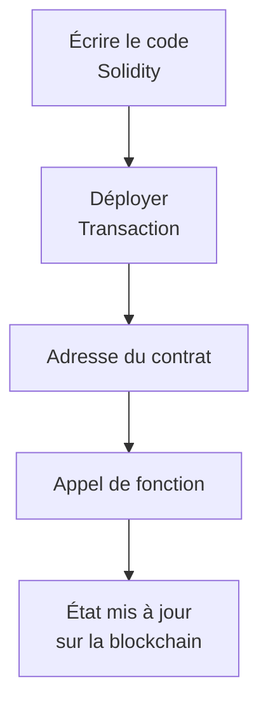

---
tags:
  - Crypto-monnaies
  - Intermédiaire
  - Concept
description: "Smart contracts : des programmes déterministes deployes sur la blockchain, pas des contrats intelligents"
estimated_time: "40 min"
fiche_number: 2
total_fiches: 4
cursus: "Phase 3 - Ethereum et les smart contracts"
---

# 02 - Smart contracts : du code, pas de la magie

> **En bref** : Comprendre ce qu'est réellement un smart contract, ce qu'il peut et ne peut pas faire, et pourquoi "code is law" inclut les bugs. Lecture estimée : 40 min.

## Prérequis

- [Fiche 01 - Ethereum : ce que Bitcoin ne fait pas](01-ethereum-au-dela-de-bitcoin.md)
- Comprendre la différence entre Bitcoin et Ethereum
- Savoir ce qu'est un compte de contrat dans Ethereum

## Objectif de cette fiche

À la fin de cette fiche, tu sauras définir un smart contract avec précision, expliquer ce qu'il peut et ne peut pas faire, comprendre le problème des oracles, et décrire pourquoi les bugs dans les smart contracts sont particulièrement dangereux.

---

## Concepts

### Qu'est-ce qu'un smart contract ?

**Définition** : Un smart contract est un programme informatique stocke sur la blockchain Ethereum qui s'exécute automatiquement quand certaines conditions sont remplies. Une fois déployé, personne ne peut le modifier ou l'arrêter.

**Le problème que les smart contracts résolvent** :

Sans smart contracts, voici les problèmes rencontrès :

1. **Dépendance à un intermédiaire** : pour exécuter un accord entre deux personnes (un paiement conditionnel, un échange, un vote), il faut un tiers de confiance - un notaire, une banque, une plateforme.
2. **Risque de non-exécution** : l'intermédiaire peut refuser d'exécuter l'accord, le modifier ou faire faillite.
3. **Opacite des règles** : les conditions d'un contrat traditionnel sont écrites en langage juridique, souvent ambigues. L'interpretation dépend du juge.

**Comment les smart contracts résolvent ces problèmes** :

| Problème | Solution apportée par le smart contract |
| --- | --- |
| Dépendance à un intermédiaire | Le code s'exécute automatiquement, sans intervention humaine |
| Risque de non-exécution | L'exécution est garantie par le réseau (des milliers de nœuds) |
| Opacite des règles | Le code est public, lisible par tous, et exécute exactement ce qui est écrit |

**Analogie concrète** : Un smart contract fonctionne comme un distributeur automatique. Tu inseres une pièce, tu appuies sur le bouton "A3", et le produit tombe. Il n'y a pas de negociation possible. Le distributeur ne va pas changer d'avis, te demander un pourboire ou decider de garder ta pièce. Les règles sont fixees à l'avance et s'exécutent mecaniquement.

La différence avec un distributeur physique : un smart contract est transparent (tout le monde peut lire ses règles), déterministe (le même input produit toujours le même output) et impossible à arrêter (personne ne peut le debrancher).

**Ce qu'un smart contract n'est PAS** :

- Un smart contract n'est pas "intelligent" (smart). Le mot "smart" signifie "automatise", pas "capable de reflexion". Un smart contract exécute bêtement ce qu'on lui a programmé. Il ne comprend rien.
- Un smart contract n'est pas un contrat juridique. Il n'a aucune valeur légale en soi. C'est du code informatique, pas un document juridique. Un juge n'est pas tenu de respecter le résultat d'un smart contract.
- Un smart contract n'est pas modifiable après déploiement. Une fois sur la blockchain, le code est fige. S'il y à un bug, il n'y a pas de "mise à jour". Il existe des patterns de contrats "upgradeables" (via des proxys), mais ils introduisent une centralisation qui contredit l'idée d'origine.

---

### Cycle de vie d'un smart contract

Le diagramme suivant montre les étapes principales de la vie d'un smart contract, de l'écriture du code à la mise à jour de l'état sur la blockchain.



---

### Ce qu'un smart contract peut faire

**Définition** : Les capacités d'un smart contract sont limitées à ce qui existe sur la blockchain. Il peut manipuler des données on-chain (sur la blockchain) mais ne peut pas accéder au monde extérieur par lui-même.

**Un smart contract peut** :

| Capacité | Exemple concret |
| --- | --- |
| Transferer des tokens | Envoyer 100 USDC d'une adresse à une autre |
| Enregistrer des données | Stocker le résultat d'un vote sur la blockchain |
| Interagir avec d'autres smart contracts | Appeler un contrat d'échange pour convertir des ETH en USDC |
| créer de nouveaux tokens | Deployer un token ERC-20 (comme USDC ou UNI) |
| Vérifier des conditions | "Si le solde est supérieur à 100 ETH, alors autoriser le retrait" |
| Gérer des fonds en sequestre | Bloquer des fonds jusqu'à ce qu'une condition on-chain soit remplie |

**Propriété fondamentale - le determinisme** : un smart contract est déterministe. Cela signifie que si tu lui donnes les mêmes entrées dans le même état, il produira toujours le même résultat. Il n'y a pas de hasard, pas d'ambiguite, pas d'interpretation. C'est cette propriété qui permet à des milliers de nœuds d'exécuter le même code et d'arriver au même résultat.

---

### Ce qu'un smart contract ne peut PAS faire

**Définition** : Un smart contract a des limitations fondamentales liees à la nature de la blockchain. Il vit dans un environnement isole et n'a pas de lien direct avec le monde extérieur.

**Un smart contract ne peut PAS** :

| Limitation | Explication |
| --- | --- |
| Accéder à des données hors blockchain | Il ne peut pas consulter un site web, une API ou une base de données |
| Connaître le prix du BTC ou de l'ETH | Les prix sont sur des plateformes d'échange, pas sur la blockchain |
| Connaître la meteo, un score sportif, etc. | Ces informations n'existent pas sur la blockchain |
| S'exécuter de lui-même | Un smart contract ne se "reveille" pas. Il faut qu'une transaction l'appelle |
| Être modifie après déploiement | Le code est immuable une fois déployé |
| Annuler une exécution passee | Une fois exécutée, une transaction est definitive |
| Envoyer un email ou une notification | Il n'a aucun accès au réseau internet |

**Analogie concrète** : Un smart contract est comme un arbitre dans une pièce fermee sans fenêtre. Il peut voir tout ce qui se passe dans la pièce (la blockchain) et appliquer les règles du jeu. Mais il ne peut pas regarder dehors. Si une règle du jeu dépend de la meteo, l'arbitre est incapable de la vérifier par lui-même. Quelqu'un doit ouvrir la porte et lui dire quel temps il fait.

---

### Le problème des oracles

**Définition** : Un oracle est un service externe qui fournit des données du monde réel à un smart contract. C'est le pont entre la blockchain (monde on-chain) et le monde extérieur (monde off-chain).

**Le problème que les oracles résolvent** :

Les smart contracts utiles ont souvent besoin de données externes :

1. **La DeFi a besoin des prix** : un protocole de prêt doit connaître le prix de l'ETH en dollars pour savoir si une position doit être liquidée.
2. **Les assurances parametriques ont besoin de données réelles** : un contrat d'assurance secheresse a besoin de données météorologiques.
3. **Les marches de prédiction ont besoin de résultats** : un pari sur une election a besoin de connaître le vainqueur.

**Le paradoxe fondamental** :

La blockchain est décentralisée et trustless (sans confiance). Mais un oracle est un fournisseur de données externe. Si tu fais confiance à un oracle pour dire "le prix de l'ETH est de 3 000 dollars", tu reintroduis un tiers de confiance dans un système qui prétend ne pas en avoir besoin.

| Composant | Décentralisé ? | Trustless ? |
| --- | --- | --- |
| La blockchain Ethereum | Oui (des milliers de nœuds) | Oui (vérification mathématique) |
| Un oracle centralisé | Non (un seul fournisseur) | Non (il faut lui faire confiance) |
| Un réseau d'oracles (ex: Chainlink) | Partiellement (plusieurs fournisseurs) | Partiellement (vote majoritaire) |

**Chainlink : la solution la plus utilisée** :

Chainlink est le réseau d'oracles le plus utilise sur Ethereum. Il fonctionne en agregant les données de plusieurs fournisseurs indépendants et en prenant la valeur médiane. Si 21 fournisseurs envoient le prix de l'ETH et que 20 disent "3 000 dollars" et 1 dit "5 000 dollars", la valeur retenue est celle de la majorité.

**Ce que les oracles n'eliminent PAS** :

- Le risque de manipulation : si suffisamment de fournisseurs d'un oracle sont compromis, les données sont fausses.
- Le délai : les données arrivent avec un retard (quelques secondes à minutes). Pour certaines applications (trading haute fréquence), c'est un problème.
- Le coût : utiliser un oracle coûte du gas supplémentaire.

**Conséquence** : chaque fois qu'un smart contract dépend d'un oracle, la sécurité du système est limitée par la fiabilité de l'oracle. Un smart contract parfaitement code peut produire des résultats catastrophiques si l'oracle lui fournit des données fausses.

---

### Les bugs dans les smart contracts

**Définition** : Un bug dans un smart contract est une erreur dans le code qui provoque un comportement différent de celui prévu par le développeur. Contrairement à un logiciel classique, un bug dans un smart contract déployé ne peut pas être corrigé par une mise à jour.

**Pourquoi les bugs sont particulièrement graves** :

| Logiciel classique | Smart contract |
| --- | --- |
| Bug détecte -> mise à jour déployée | Bug détecte -> le code reste tel quel sur la blockchain |
| Les fonds peuvent être geles ou remboursés par l'entreprise | Les fonds perdus sont perdus définitivement |
| L'entreprise peut arrêter le service | Personne ne peut arrêter le contrat |
| Quelques utilisateurs affectés | Des millions de dollars peuvent être volés en minutes |

---

### The DAO hack (2016) : le cas d'école

**Définition** : The DAO (Decentralized Autonomous Organization) était un fonds d'investissement décentralisé lance sur Ethereum en avril 2016. Il a levé 150 millions de dollars en ETH. Le 17 juin 2016, un attaquant a exploité un bug dans le code pour voler 3,6 millions d'ETH (environ 60 millions de dollars à l'époque).

**Ce qui s'est passe** :

1. The DAO permettait aux investisseurs de déposer des ETH et de voter pour financer des projets.
2. Le code contenait un bug de "reentrancy" : une fonction permettait à un utilisateur de retirer ses fonds. Mais avant de mettre à jour le solde, elle envoyait les fonds. L'attaquant a créé un contrat qui, au moment de recevoir les fonds, rappelait immédiatement la fonction de retrait - avant que le solde ne soit mis à jour.
3. Résultat : l'attaquant a retiré ses fonds des dizaines de fois en une seule transaction, car le contrat "croyait" à chaque fois que le solde n'avait pas changé.

**Le mécanisme du bug en termes simples** :

```text
Fonctionnement prévu :
1. Verifier que l'utilisateur a des fonds         -> Oui (100 ETH)
2. Envoyer les fonds à l'utilisateur               -> 100 ETH envoyés
3. Mettre a jour le solde de l'utilisateur          -> Solde = 0

Ce qui s'est passe (reentrancy) :
1. Verifier que l'utilisateur a des fonds         -> Oui (100 ETH)
2. Envoyer les fonds à l'utilisateur               -> 100 ETH envoyés
   -> L'attaquant reçoit les fonds et rappelle immédiatement "retirer"
      1. Verifier que l'utilisateur a des fonds   -> Oui (100 ETH - pas encore mis a jour !)
      2. Envoyer les fonds                         -> 100 ETH envoyés a nouveau
         -> L'attaquant rappelle encore "retirer"
            (... et ainsi de suite)
3. Mettre a jour le solde                          -> Arrive trop tard
```

**La conséquence historique** :

La communauté Ethereum a dû choisir entre deux options :

- **Accepter le vol** : "le code a fait ce qu'il a fait, tant pis". C'est le principe "code is law".
- **Annuler le vol** : modifier la blockchain pour rendre les fonds à leurs propriétaires. C'est un précédent qui contredit l'immutabilité.

La majorité de la communauté a choisi la deuxième option. Un "hard fork" a été effectué le 20 juillet 2016 pour annuler le vol. La blockchain s'est divisée en deux :

| Blockchain | Décision | Existe encore ? |
| --- | --- | --- |
| Ethereum (ETH) | Le vol a été annulé | Oui - c'est l'Ethereum actuel |
| Ethereum Classic (ETC) | Le vol est resté valide ("code is law") | Oui - mais beaucoup moins utilisé |

---

### "Code is law" : les limites d'un principe

**Définition** : "Code is law" (le code fait loi) est l'idée que le code d'un smart contract définit les règles, et que le résultat de son exécution est le résultat final, quelles que soient les intentions initiales.

**Le problème que "code is law" pose** :

1. **Les bugs sont des lois** : si le code contient un bug qui permet de voler des fonds, le vol est "légal" selon le code.
2. **L'intention n'a aucune importance** : ce qui compte n'est pas ce que le développeur voulait faire, mais ce que le code fait réellement.
3. **Pas de recours** : dans un système juridique, un juge peut interpréter l'esprit d'un contrat. Dans un smart contract, il n'y a pas d'esprit, seulement du code.

**Exemples de conséquences réelles** :

| Événement | Montant perdu | Cause |
| --- | --- | --- |
| The DAO hack (2016) | 60 millions de dollars | Bug de reentrancy |
| Parity Wallet freeze (2017) | 280 millions de dollars | Un utilisateur a accidentellement "tue" le contrat |
| Wormhole bridge hack (2022) | 320 millions de dollars | Bug dans le pont cross-chain |
| Ronin bridge hack (2022) | 625 millions de dollars | Clés privées compromises |

**Fait important** : dans la majorité de ces cas, le code a fait exactement ce qu'il était programmé pour faire. Le problème est que ce qu'il était programmé pour faire ne correspondait pas à ce que les développeurs voulaient qu'il fasse.

**Ce que "code is law" n'est PAS** :

- "Code is law" ne signifie pas que les crimes sont légaux. Voler des fonds via un bug reste illégal dans la plupart des juridictions. Les tribunaux poursuivent les auteurs de hacks crypto.
- "Code is law" n'est pas un consensus universel. Le fork d'Ethereum après The DAO prouve que la communauté peut decider de ne pas appliquer ce principe quand les conséquences sont jugees trop graves.

---

## Checklist de Validation

- [ ] Je sais définir un smart contract (programme sur la blockchain, exécution automatique, immuable)
- [ ] Je sais que "smart" signifie "automatise", pas "intelligent"
- [ ] Je connais au moins 3 choses qu'un smart contract peut faire
- [ ] Je connais au moins 3 choses qu'un smart contract ne peut PAS faire
- [ ] Je sais expliquer le problème des oracles (données off-chain, reintroduction de confiance)
- [ ] Je sais décrire le hack de The DAO (bug de reentrancy, 60 millions de dollars volés, hard fork)
- [ ] Je sais expliquer le mécanisme de reentrancy en termes simples
- [ ] Je comprends les limites du principe "code is law"
- [ ] Je sais que le fork après The DAO a créé Ethereum Classic

---

## Navigation

← Fiche précédente : **[Ethereum : ce que Bitcoin ne fait pas](01-ethereum-au-dela-de-bitcoin.md)**

→ Fiche suivante : **[Gas, EVM et les coûts réels d'utilisation](03-gas-evm-couts-reels.md)**
