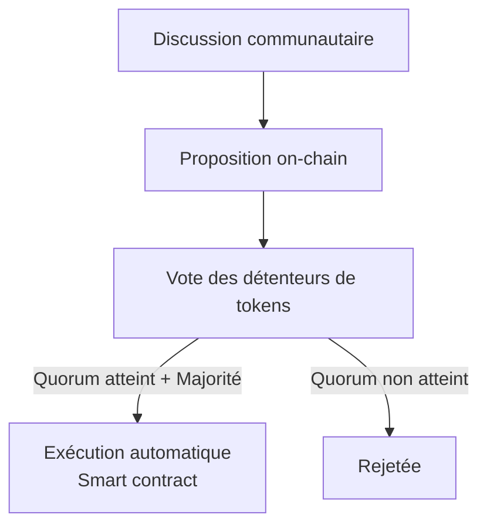

---
tags:
  - Crypto-monnaies
  - Intermédiaire
  - Concept
description: "DAOs : les organisations autonomes décentralisées, fonctionnement et limites"
estimated_time: "35 min"
fiche_number: 4
total_fiches: 9
cursus: "Phase 4 - L'écosystème crypto"
---

# 04 - DAOs : gouvernance décentralisée en pratique

> **En bref** : Comprendre le fonctionnement des DAOs (organisations autonomes décentralisées), analyser leurs mécanismes de vote, leurs limites réelles et l'histoire fondatrice de The DAO. Lecture estimée : 35 min.

## Prérequis

- [Fiche 01 - Taxonomie des tokens](01-taxonomie-tokens.md)
- [Fiche 02 - DeFi : finance décentralisée ou casino décentralisé](02-defi-finance-ou-casino.md)
- [Fiche 03 - NFTs : la technologie vs la spéculation](03-nfts-technologie-vs-speculation.md)
- Comprendre ce qu'est un smart contract et un governance token

## Objectif de cette fiche

À la fin de cette fiche, tu sauras expliquer le fonctionnement d'une DAO, décrire les mécanismes de vote on-chain, identifier les limites concrètes de la gouvernance décentralisée et raconter l'histoire de The DAO et ses conséquences sur Ethereum.

---

## Concepts

Cette section explique tous les concepts nécessaires. Lis-la entièrement avant de passer à la suite.

### Qu'est-ce qu'une DAO ?

**Définition** : Une DAO (Decentralized Autonomous Organization) est une organisation dont les règles de fonctionnement sont codees dans des smart contracts. Les décisions sont prises par vote des détenteurs de tokens de gouvernance, et les résultats sont exécutes automatiquement par le smart contract.

**Le problème que les DAOs résolvent** :

Sans DAO, les organisations décentralisées rencontrent ces problèmes :

1. **Qui décide ?** : dans un protocole DeFi, quelqu'un doit modifier les paramètres, allouer les fonds, approuver les mises à jour
2. **Comment faire confiance ?** : si une seule personne contrôle un protocole, elle peut agir contre l'intérêt des utilisateurs
3. **Comment exécuter ?** : même si une décision est prise collectivement, quelqu'un doit l'appliquer (et pourrait ne pas le faire)

**Comment les DAOs résolvent ces problèmes** :

| Problème | Solution apportée par les DAOs |
| --- | --- |
| Qui décide ? | Les détenteurs de tokens votent sur les propositions |
| Comment faire confiance ? | Les règles sont dans le smart contract, visibles par tous |
| Comment exécuter ? | Le smart contract exécute automatiquement le résultat du vote |

**Analogie concrète** : imagine une assemblee de coproprietaires d'immeuble ou chaque propriétaire à un nombre de voix proportionnel à la surface de son appartement. Les règles de vote sont gravees dans le marbre (le smart contract). Si la majorité vote pour reparer le toit, l'argent est automatiquement transféré au prestataire. Personne ne peut bloquer la décision une fois le vote termine.

**Ce qu'une DAO n'est PAS** :

- Une DAO n'est pas une démocratie au sens politique. Le droit de vote est proportionnel au nombre de tokens, pas au nombre de personnes. C'est une ploutocratie (le pouvoir est proportionnel à la richesse).
- Une DAO n'est pas autonome au sens ou elle fonctionne toute seule. Elle nécessite des humains pour proposer et debattre des décisions. Seule l'exécution du vote est automatique.

---

### Comment fonctionne le vote dans une DAO

**Définition** : Le processus de vote dans une DAO suit des étapes précises, codees dans le smart contract de gouvernance.

**Le processus standard** :

```text
1. DISCUSSION (hors blockchain)
   - Un membre publie une idée sur un forum (Discord, forum de gouvernance)
   - La communauté débat pendant plusieurs jours
   - Si l'idée reçoit un soutien suffisant, elle passe au vote

2. PROPOSITION (sur la blockchain)
   - Un membre soumet une proposition formelle au smart contract
   - Condition : detenir un minimum de tokens (seuil de proposition)
   - La proposition contient : description + code a exécuter si acceptee

3. VOTE (sur la blockchain)
   - Période de vote : généralement 3 a 7 jours
   - Chaque token = 1 voix
   - Options : Pour, Contre, Abstention
   - Quorum : un minimum de participation est requis (par exemple 4%)

4. EXECUTION (automatique)
   - Si la proposition atteint le quorum ET la majorité vote Pour :
     le smart contract exécute automatiquement le code
   - Période de délai (timelock) : souvent 2 jours entre le résultat
     et l'exécution, pour permettre aux opposants de reagir
```

Le diagramme suivant résume le processus de vote dans une DAO :



**Délégation du vote** :

La plupart des DAOs permettent de déléguer ses tokens à un autre membre. Cela signifie que quelqu'un d'autre vote à ta place. C'est utile car la majorité des détenteurs ne votent pas.

---

### Exemples de DAOs réelles

**Définition** : Plusieurs protocoles DeFi majeurs sont gouvernes par des DAOs. Voici les plus significatifs.

**MakerDAO** :

| Aspect | Détail |
| --- | --- |
| Token de gouvernance | MKR |
| Ce que la DAO gouverne | Le stablecoin DAI (taux de stabilité, types de collatéral acceptes) |
| Décisions prises | Ajout de nouveaux actifs comme collatéral, modification des paramètrès de risque |
| Particularite | Une des DAOs les plus actives, gère des milliards de dollars de collatéral |

**Uniswap DAO** :

| Aspect | Détail |
| --- | --- |
| Token de gouvernance | UNI |
| Ce que la DAO gouverne | Le protocole d'échange décentralisé Uniswap |
| Décisions prises | Déploiement sur de nouvelles blockchains, activation des frais du protocole |
| Particularite | 1 milliard de tokens UNI créés, 60% distribués à la communauté et aux investisseurs |

**ConstitutionDAO** :

| Aspect | Détail |
| --- | --- |
| Objectif | Acheter un exemplaire original de la Constitution américaine aux enchères chez Sotheby's |
| Montant leve | 47 millions de dollars en quelques jours |
| Résultat | Encheres perdues face à un milliardaire (Kenneth Griffin) |
| Après | La DAO s'est dissoute et a remboursé les participants (moins les frais de gas) |
| Leçon | Demonstration de la capacité de coordination rapide, mais aussi des limites (les frais de gas ont coûte des millions aux petits contributeurs) |

---

### Les problèmes réels des DAOs

**Définition** : Malgré l'idéal de gouvernance décentralisée, les DAOs rencontrent des problèmes structurels documentes.

**Problème 1 : la faible participation**

```text
Statistiques réelles de participation :
- La majorité des DAOs ont un taux de participation inférieur a 10%
- Sur Uniswap, la plupart des propositions reçoivent les votes de
  quelques centaines d'adresses sur des centaines de milliers de
  détenteurs de UNI
- Sur Compound, certaines propositions passent avec moins de 5%
  des tokens votants

Pourquoi ?
- Voter coûte du gas (quelques dollars par vote)
- Les propositions sont techniques et longues a lire
- La plupart des détenteurs ont achète le token pour speculer, pas
  pour participer à la gouvernance
- L'impact d'un petit détenteur est negligeable face aux whales
```

**Problème 2 : la concentration du pouvoir**

| Fait | Conséquence |
| --- | --- |
| Les fondateurs et investisseurs initiaux détiennent souvent 30-60% des tokens | Ils contrôlent de facto la majorité des votes |
| Les exchanges centralisées détiennent les tokens de leurs clients | Ils pourraient théoriquement voter avec ces tokens |
| Un petit nombre d'adresses concentre la majorité des tokens | La "décentralisation" est souvent une illusion |

**Problème 3 : les attaques de gouvernance**

```text
Mécanisme :
1. Un attaquant emprunte une grande quantité de tokens de gouvernance
   (via un flash loan - prêt instantané remboursé dans la même transaction)
2. Il vote pour une proposition malveillante (par exemple, transférer
   les fonds du trésor vers son adresse)
3. Si le vote passe, il récupère les fonds
4. Il remboursé le flash loan

Protection :
- Certaines DAOs imposent un délai entre l'acquisition des tokens
  et le droit de vote (snapshot à une date anterieure)
- D'autres exigent un timelock pour l'exécution des propositions
```

**Problème 4 : la lenteur decisionnelle**

| Étape | Durée typique |
| --- | --- |
| Discussion sur le forum | 1-4 semaines |
| Vote formel | 3-7 jours |
| Timelock avant exécution | 2-7 jours |
| Total pour une seule décision | 2-6 semaines |

En cas d'urgence (bug critique, attaque en cours), cette lenteur est un problème grave. C'est pourquoi la plupart des DAOs conservent des "multisigs d'urgence" - un petit groupe de personnes qui peut agir rapidement. Ce qui reintroduit la centralisation.

---

### Comparaison avec la gouvernance traditionnelle

| Critère | DAO | Entreprise (SA) | Democratie representative |
| --- | --- | --- | --- |
| Droit de vote | Proportionnel aux tokens | Proportionnel aux actions | 1 personne = 1 voix |
| Qui peut voter | Quiconque achète des tokens | Les actionnaires | Les citoyens |
| Exécution des décisions | Automatique (smart contract) | Manuelle (direction) | Manuelle (gouvernement) |
| Transparence des votes | Totale (blockchain publique) | Assemblee générale | Variable |
| Recours légal | Quasi inexistant | Droit des sociétés | Droit constitutionnel |
| Vitesse de décision | Lente (2-6 semaines) | Rapide (conseil d'administration) | Lente (processus legislatif) |
| Concentration du pouvoir | Whales (gros détenteurs) | Actionnaires majoritaires | Partis politiques |

**Observation** : les DAOs reproduisent certains problèmes qu'elles prétendent résoudre. La concentration du pouvoir existe dans les deux systèmes - elle passe juste des actionnaires aux détenteurs de tokens.

---

### The DAO : l'échec fondateur et ses leçons pour la gouvernance

The DAO (2016) est le cas le plus célèbre d'échec d'une DAO. Un bug dans le smart contract a permis le vol de 60 millions de dollars en ETH, provoquant le hard fork Ethereum/Ethereum Classic (voir [Phase 2, fiche 06](../02-bitcoin/06-forks-evolution-protocoles.md) et [Phase 3, fiche 02](../03-ethereum-smart-contracts/02-smart-contracts-du-code.md) pour les détails techniques). L'échec de The DAO a révèle que le code seul ne suffit pas a garantir une bonne gouvernance.

**Leçons spécifiques à la gouvernance des DAOs** :

| Leçon | Conséquence pour les DAOs actuelles |
| --- | --- |
| Le code n'est pas la loi | Les DAOs modernes prevoient des mécanismes d'urgence (multisigs, timelocks) |
| Les audits sont essentiels | Les DAOs sérieuses exigent des audits de sécurité avant déploiement |
| La gouvernance sous pression échoue | Les DAOs prevoir des procédures de crise définies à l'avance, pas improvisees |
| La concentration de fonds est un risque | Les tresoreries de DAOs sont desormais diversifiees et protégées par des limites de retrait |

---

## Checklist de Validation

- [ ] Je sais qu'une DAO est une organisation dont les règles sont codees dans des smart contracts
- [ ] Je comprends le processus de vote : discussion, proposition, vote, exécution automatique
- [ ] Je sais que le droit de vote est proportionnel aux tokens (ploutocratie, pas démocratie)
- [ ] Je connais les problèmes réels : faible participation, concentration du pouvoir, lenteur
- [ ] Je comprends ce qu'est une attaque de gouvernance et comment les DAOs s'en protègent
- [ ] Je peux citer au moins 2 DAOs réelles et expliquer ce qu'elles gouvernent
- [ ] Je connais l'histoire de The DAO (2016), le hack et le fork Ethereum/Ethereum Classic
- [ ] Je sais que la plupart des DAOs conservent des mécanismes centralisés pour les urgences
- [ ] Je comprends que les DAOs reproduisent certains problèmes des organisations traditionnelles

---

## Navigation

← Fiche précédente : **[NFTs : la technologie vs la spéculation](03-nfts-technologie-vs-speculation.md)**

→ Fiche suivante : **[Stablecoins : l'innovation la plus utile du secteur](05-stablecoins-innovation-utile.md)**
