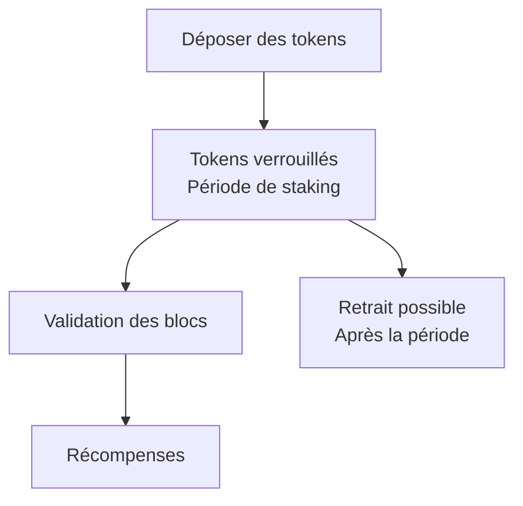

---
tags:
  - Crypto-monnaies
  - Intermédiaire
  - Concept
description: "Staking en pratique : comment staker, pools de staking, liquid staking, rendements réels et risques"
estimated_time: "40 min"
fiche_number: 6
total_fiches: 9
cursus: "Phase 4 - L'écosystème crypto"
---

# 06 - Staking en pratique : rendements, risques et réalités

> **En bref** : Comprendre les différentes méthodes de staking (natif, delegue, pools, liquid staking, restaking), évaluer les rendements réels versus nominaux et connaître les risques concrets associes. Lecture estimée : 40 min.

## Prérequis

- [Fiche 01 - Taxonomie des tokens](01-taxonomie-tokens.md)
- [Fiche 02 - DeFi : finance décentralisée ou casino décentralisé](02-defi-finance-ou-casino.md)
- [Fiche 03 - NFTs : la technologie vs la spéculation](03-nfts-technologie-vs-speculation.md)
- [Fiche 04 - DAOs : gouvernance décentralisée en pratique](04-daos-gouvernance-decentralisee.md)
- [Fiche 05 - Stablecoins : l'innovation la plus utile du secteur](05-stablecoins-innovation-utile.md)
- [Phase 3 - Ethereum et les smart contracts](../03-ethereum-smart-contracts/index.md) (fiche 01 minimum)
- Pour les détails techniques du Proof of Stake : [Phase 7 - Fiche 05 - Mécanismes de consensus](../07-concepts-techniques-avances/05-mecanismes-consensus-pos-bft.md)

## Objectif de cette fiche

À la fin de cette fiche, tu sauras expliquer les différentes méthodes de staking (natif, delegue, pools, liquid staking), calculer un rendement réel en tenant compte de l'inflation du token, identifier les risques concrets (slashing, lock-up, smart contract, centralisation) et évaluer si le staking est une stratégie adaptée à ta situation.

---

## Concepts

Cette section explique tous les concepts nécessaires. Lis-la entièrement avant de passer à la suite.

### Qu'est-ce que le staking ?

**Définition** : Le staking consiste à bloquer ses tokens dans un protocole Proof of Stake pour participer à la sécurisation du réseau. En échange, le staker reçoit des récompenses (de nouveaux tokens). C'est l'équivalent du minage dans le Proof of Work, mais sans matériel spécialisé ni consommation d'électricité.

**Le problème que le staking résout** :

Sans staking, les réseaux Proof of Stake rencontrent ces problèmes :

1. **Sécurité du réseau** : il faut un mécanisme pour inciter les participants à valider les transactions honnetement.
2. **Participation** : si personne ne bloque de tokens, personne ne valide et le réseau s'arrête.
3. **Alignement des intérêts** : les validateurs doivent avoir quelque chose à perdre s'ils trichent.

**Comment le staking résout ces problèmes** :

| Problème | Solution apportée par le staking |
| --- | --- |
| Sécurité du réseau | Les validateurs risquent de perdre leurs tokens (slashing) s'ils trichent |
| Participation | Les récompenses de staking incitent les détenteurs à participer |
| Alignement des intérêts | Plus tu stakes, plus tu gagnes, mais aussi plus tu risques de perdre |

**Analogie concrète** : le staking fonctionne comme une caution locative. Quand tu loues un appartement, tu déposes une caution qui prouve ton engagement à respecter les règles. Si tu respectes le bail, tu recuperes ta caution plus le bénéfice d'avoir habite l'appartement. Si tu degrades l'appartement, tu perds ta caution. Le staking fonctionne de la même manière : tu déposes tes tokens, tu respectes les règles du réseau, et tu reçois des récompenses.

**Ce que le staking n'est PAS** :

- Le staking n'est pas un revenu garanti. Les récompenses sont variables et le prix du token peut chuter pendant la période de staking.
- Le staking n'est pas un placement sans risque. Il existe des risques réels (slashing, smart contract, lock-up, régulation) detailles dans cette fiche.
- Le staking n'est pas un "compte épargne". Un compte épargne est garanti par l'État (jusqu'à 100 000 euros en Europe). Le staking n'a aucune garantie.

---

Le diagramme suivant résume le flux de staking, du dépôt des tokens jusqu'aux récompenses et au retrait.



---

### Staking natif : devenir validateur

**Définition** : Le staking natif consiste à exécuter soi-même un nœud validateur sur un réseau Proof of Stake. C'est la forme la plus directe de staking.

**Exemple : devenir validateur Ethereum** :

```text
Exigences pour valider sur Ethereum :

1. Capital : déposer exactement 32 ETH dans le contrat de staking
   (environ 50 000 - 100 000 euros selon le cours)

2. Matériel :
   - Un ordinateur dedie (ou un serveur) allume 24h/24, 7j/7
   - 16 Go de RAM minimum (32 Go recommandé)
   - SSD de 2 To minimum (la blockchain Ethereum grossit)
   - Connexion internet stable (pas de coupures)

3. Logiciel :
   - Un client d'exécution (Geth, Nethermind, Besu)
   - Un client de consensus (Prysm, Lighthouse, Teku, Nimbus)
   - Mise a jour régulière des logiciels

4. Compétences techniques :
   - Savoir administrer un serveur Linux
   - Savoir gérer les mises à jour et les incidents
   - Comprendre les risques de slashing

Rendement : environ 3-5% APR (taux annuel) en ETH
Risque : perte partielle ou totale des 32 ETH en cas de slashing
```

**A qui s'adresse le staking natif** : le staking natif est réserve aux personnes qui possedent un capital suffisant (32 ETH pour Ethereum), des compétences techniques et la capacité à maintenir un serveur en permanence. Ce n'est pas une option pour la majorité des détenteurs.

---

### Staking delegue

**Définition** : Le staking delegue consiste à confier ses tokens à un validateur existant, sans exécuter soi-même un nœud. Le validateur valide les transactions et partage les récompenses avec les delegateurs. Ce mécanisme existe sur les réseaux qui le supportent nativement (Cosmos, Cardano, Polkadot).

**Comment fonctionne la délégation** :

```text
Exemple sur Cosmos (ATOM) :

1. Alice possède 1 000 ATOM
2. Elle choisit un validateur dans la liste des validateurs actifs
3. Elle delegue ses 1 000 ATOM a ce validateur via son wallet
4. Le validateur valide les transactions avec son propre nœud
5. Les récompenses sont partagées :
   - Le validateur prend une commission (5-20% typiquement)
   - Alice reçoit le reste proportionnellement a sa délégation

Important :
- Les ATOM d'Alice ne sont PAS transferes au validateur
- Ils sont bloques dans un smart contract
- Alice peut changer de validateur (re-délégation)
- Pour retirer, il y à une période d'unstaking (21 jours pour Cosmos)
```

**Comparaison staking natif vs staking delegue** :

| Critère | Staking natif | Staking delegue |
| --- | --- | --- |
| Capital minimum | Élevé (32 ETH pour Ethereum) | Faible (quelques tokens suffisent) |
| Compétences techniques | Requises (administration serveur) | Non requises (utiliser un wallet suffit) |
| Contrôle | Total (tu exécutes le nœud) | Partiel (tu fais confiance au validateur) |
| Rendement | 100% des récompenses | Récompenses - commission du validateur (5-20%) |
| Réseaux supportes | Tous les réseaux PoS | Cosmos, Cardano, Polkadot, Tezos (pas Ethereum nativement) |

**Le risque de choisir un mauvais validateur** : si le validateur à qui tu delegues se comporte mal (double vote, inactivite prolongee), les tokens delegues peuvent être partiellement slashes. Il faut vérifier le taux de disponibilité du validateur (uptime), sa commission, et sa réputation avant de déléguer.

---

### Pools de staking

**Définition** : Une pool de staking permet a plusieurs personnes de mettre en commun leurs tokens pour atteindre le seuil de validation et partager les récompenses. C'est l'équivalent des pools de minage pour le Proof of Work.

**Les principales pools de staking Ethereum** :

| Pool | Token reçu | Part de l'ETH stake | Seuil minimum | Décentralisation |
| --- | --- | --- | --- | --- |
| Lido | stETH | ~30% | Aucun (quelques fractions d'ETH) | Faible (un petit nombre d'opérateurs de nœuds) |
| Rocket Pool | rETH | ~3% | 0,01 ETH pour les stakers, 8 ETH pour les opérateurs | Moderee (opérateurs permissionless) |
| Coinbase | cbETH | ~10% | Aucun | Faible (Coinbase est l'unique opérateur) |

**Le problème de centralisation de Lido** :

```text
Chiffres (2025-2026) :
- Lido contrôle environ 30% de tout l'ETH stake
- Cela signifie que les opérateurs de nœuds de Lido valident
  environ 30% de tous les blocs Ethereum

Pourquoi c'est un problème :
- Si Lido (ou ses opérateurs) subit un bug, un hack ou une
  pression réglementaire, 30% du réseau est affecte
- Le seuil critique est 33% : au-delà, un seul acteur peut
  bloquer la finalisation des blocs
- Lido est un protocole DeFi gouverne par une DAO, pas une
  infrastructure décentralisée au niveau des validateurs

Ce que dit la communauté Ethereum :
- Vitalik Buterin a publiquement exprime ses inquietudes
- Des initiatives (comme Rocket Pool) promeuvent un staking
  plus décentralisé avec des seuils plus bas pour les opérateurs
```

---

### Liquid staking

**Définition** : Le liquid staking permet de staker ses tokens et de recevoir en échange un token representatif (derivative) que l'on peut utiliser dans d'autres protocoles DeFi. Les tokens originaux restent stakes et génèrent des récompenses, tandis que le token representatif est librement echangeable.

**Comment fonctionne le liquid staking** :

```text
Exemple avec Lido (stETH) :

1. Alice depose 10 ETH dans le contrat Lido
2. Lido lui donne 10 stETH (Staked ETH)
3. Les 10 ETH d'Alice sont stakes par les opérateurs de Lido
4. Les récompenses de staking s'accumulent :
   le solde de stETH augmente automatiquement

Ce qu'Alice peut faire avec ses stETH :
- Les garder dans son wallet (les récompenses s'accumulent)
- Les utiliser comme colateral dans Aave ou Maker pour emprunter
- Les échanger dans des pools de liquidité (Curve, Uniswap)
- Les vendre à tout moment sur un DEX (pas de période d'unstaking)

Comparaison :
- Staking classique : 10 ETH bloques, pas utilisables pendant le staking
- Liquid staking : 10 stETH utilisables dans la DeFi + récompenses de staking
```

**Avantages et risques du liquid staking** :

| Avantage | Risque associe |
| --- | --- |
| Pas de période de lock-up (vendre stETH à tout moment) | Le prix de stETH peut devier du prix d'ETH (depeg) |
| Composabilite défi (utiliser stETH comme collatéral) | Smart contract risk : un bug dans Lido peut entrainer la perte des fonds |
| Accès au staking sans minimum élevé | Centralisation (Lido contrôle ~30% de l'ETH stake) |
| Récompenses de staking + rendements défi combines | Risque de liquidation en cascade si stETH depeg fortement |

**L'incident de depeg de stETH (juin 2022)** :

```text
Ce qui s'est passe :
- En juin 2022, stETH a brievement perdu son ancrage a ETH
- stETH se negociait a 0,93 ETH au lieu de 1 ETH (depeg de ~7%)

Pourquoi :
- La faillite de Three Arrows Capital (un hedge fund crypto) a
  provoque des ventes massives de stETH
- Beaucoup de fonds avaient utilise stETH comme colateral pour
  emprunter : le depeg a déclenche des liquidations
- Les liquidations ont amplifie la pression vendeuse

Conséquence :
- Le depeg s'est résolu en quelques semaines
- Mais les positions avec levier sur stETH ont été liquidees,
  entrainant des pertes pour les utilisateurs concernes

Leçon : stETH n'est pas ETH. C'est un token qui REPRESENTE de l'ETH
stake. Son prix peut devier, surtout en période de panique.
```

---

### Restaking (EigenLayer)

**Définition** : Le restaking consiste à re-utiliser des tokens déjà stakes (par exemple stETH) pour sécuriser des services supplémentaires au-delà d'Ethereum. EigenLayer est le protocole principal qui propose cette fonctionnalité.

**Comment fonctionne le restaking** :

```text
Staking classique :
Alice depose 32 ETH -> sécurisé Ethereum -> reçoit ~4% APR

Restaking :
Alice depose 32 ETH -> sécurisé Ethereum (~4% APR)
                     -> sécurisé aussi le Service A (+1% APR)
                     -> sécurisé aussi le Service B (+0,5% APR)
Total : ~5,5% APR

Les "services" (AVS - Actively Validated Services) peuvent être :
- Des oracles (flux de données)
- Des bridges (ponts entre blockchains)
- Des couches de disponibilité de données
- D'autres protocoles qui ont besoin de sécurité économique
```

**Pourquoi le restaking est controverse** :

| Argument en faveur | Argument critique |
| --- | --- |
| Rendement additionnel pour les stakers | Le risque de slashing est multiplie (slashing sur Ethereum + sur chaque AVS) |
| Les nouveaux services beneficient de la sécurité d'Ethereum | Un incident sur un AVS peut entrainer la perte de l'ETH stake sur Ethereum |
| Capital plus efficient (mêmes tokens, plusieurs usages) | Complexite accrue : comprendre les risques de chaque AVS est difficile |
| Innovation rapide dans l'écosystème | Risque systemique : si un gros restaker est slashe, effet domino possible |

**Fait** : le restaking est un concept expérimental. EigenLayer a accumule des milliards de dollars en TVL (Total Value Locked) en 2024, mais les conséquences d'un incident majeur ne sont pas encore connues. La prudence est recommandée face à cette technologie nouvelle.

---

### Rendements réels vs rendements nominaux

**Définition** : Le rendement nominal est le pourcentage affiche (par exemple 5% APR). Le rendement réel est le rendement après prise en compte de l'inflation du token. Si le token à une inflation de 7% et que le staking rapporte 5%, le rendement réel est négatif.

**Pourquoi cette distinction est fondamentale** :

```text
Exemple 1 : Ethereum (ETH)
- Rendement nominal du staking : ~4% APR
- Inflation annuelle de l'ETH : variable, souvent proche de 0%
  (grâce au mécanisme de burn EIP-1559, l'ETH peut être déflationniste)
- Rendement réel approximatif : ~4% (le rendement nominal est proche du réel)

Exemple 2 : Cosmos (ATOM)
- Rendement nominal du staking : ~15-20% APR
- Inflation annuelle de l'ATOM : ~10-15% (nouveaux tokens créés pour
  recompenser les stakers)
- Rendement réel approximatif : ~5% (15% rendement - 10% inflation)

Exemple 3 : Un token hypothetique avec 100% APR
- Rendement nominal : 100% APR (tu doubles tes tokens en 1 an)
- Inflation : 100% (la supply double aussi en 1 an)
- Rendement réel : 0% (tu as deux fois plus de tokens, mais chaque
  token vaut deux fois moins car l'offre a double)
```

**Tableau comparatif des rendements réels** :

| Réseau | Rendement nominal (APR) | Inflation annuelle estimée | Rendement réel approximatif |
| --- | --- | --- | --- |
| Ethereum (ETH) | 3-5% | ~0% (variable) | ~3-5% |
| Cosmos (ATOM) | 15-20% | 10-15% | ~5% |
| Polkadot (DOT) | 12-15% | ~7-8% | ~5-7% |
| Cardano (ADA) | 4-5% | ~3% | ~1-2% |
| Solana (SOL) | 6-8% | ~5-6% | ~1-2% |

**Règle** : ne jamais comparer les rendements nominaux entre eux. Toujours calculer le rendement réel en soustrayant l'inflation du token. Un rendement nominal de 20% avec une inflation de 18% est moins intéressant qu'un rendement nominal de 4% avec une inflation de 0%.

---

### Les risques du staking

**Risque 1 : le slashing**

Le slashing est la perte partielle ou totale des tokens stakes quand un validateur enfreint les règles du protocole.

| Cause de slashing | Conséquence | Réseau |
| --- | --- | --- |
| Double vote (voter pour deux blocs) | Perte d'une partie des ETH stakes + exclusion | Ethereum |
| Inactivite prolongee (nœud hors ligne) | Perte progressive d'ETH (fuite d'inactivite) | Ethereum |
| Double signature | Perte de 5% des tokens delegues | Cosmos |
| Temps d'arrêt | Blocage temporaire (jail), pas de perte | Cosmos |

**Risque 2 : les périodes de lock-up et d'unstaking**

| Réseau | Période d'unstaking | Conséquence |
| --- | --- | --- |
| Ethereum | Variable (jours a semaines selon la file d'attente) | Pendant l'unstaking, les tokens ne génèrent pas de récompenses et ne sont pas vendables |
| Cosmos | 21 jours | Si le prix chute de 50% pendant les 21 jours, tu ne peux pas vendre |
| Polkadot | 28 jours | Idem : impossibilite de reagir à un crash |
| Cardano | Aucune (pas de lock-up) | Exception : tu peux retirer à tout moment |

**Risque 3 : le smart contract risk**

Pour le liquid staking et les pools, les tokens sont déposés dans des smart contracts. Un bug dans le code peut entrainer la perte des fonds. Exemples :

- Un bug dans le contrat Lido pourrait affecter les milliards d'ETH déposés
- Même les contrats audites peuvent avoir des vulnérabilités non détectees

**Risque 4 : le risque réglementaire**

| Événement | Impact |
| --- | --- |
| La SEC (régulateur américain) a attaque Kraken en 2023 | Kraken a payé 30 millions de dollars d'amende et a ferme son service de staking aux États-Unis |
| La SEC a attaque Coinbase en 2023 | Le statut juridique du staking reste incertain aux États-Unis |
| En Europe (MiCA) | Le staking n'est pas explicitement interdit mais les réglementations evoluent |

**Risque 5 : la fiscalité**

Les récompenses de staking sont généralement imposables. En France, le traitement fiscal des récompenses de staking fait l'objet de débats. Pour les détails, consulte la [Phase 5 - Fiche 05 - Fiscalité](../05-securite-survie/05-fiscalite-imposition-crypto.md).

---

## Checklist de Validation

- [ ] Je sais que le staking consiste à bloquer des tokens pour sécuriser un réseau PoS
- [ ] Je connais la différence entre staking natif (exécuter un nœud) et staking delegue (confier à un validateur)
- [ ] Je sais que devenir validateur Ethereum exige 32 ETH et un serveur 24h/24
- [ ] Je comprends le fonctionnement des pools de staking (Lido, Rocket Pool)
- [ ] Je sais que Lido contrôle ~30% de l'ETH stake et pourquoi c'est un problème de centralisation
- [ ] Je comprends le liquid staking (stETH) et ses risques (depeg, smart contract)
- [ ] Je connais le concept de restaking (EigenLayer) et son caractère expérimental
- [ ] Je sais calculer un rendement réel (rendement nominal - inflation du token)
- [ ] Je connais les 5 types de risques : slashing, lock-up, smart contract, réglementaire, fiscal
- [ ] Je sais qu'un rendement nominal élevé (20%) peut cachér un rendement réel faible si l'inflation est élevée

---

## Navigation

← Fiche précédente : **[Stablecoins : l'innovation la plus utile du secteur](05-stablecoins-innovation-utile.md)**

→ Fiche suivante : **[Marches de prédiction : parier sur l'avenir](07-marches-prediction.md)**
