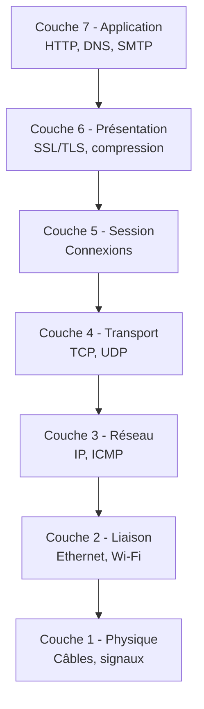

---
tags:
  - Cybersécurité
  - Débutant
  - Pratique
description: "Réseaux informatiques : modèles OSI et TCP/IP, protocoles, routage, switching et analyse avec Wireshark"
estimated_time: "65 min"
fiche_number: 3
total_fiches: 4
cursus: "Phase 1 - Fondamentaux informatiques"
---

# 03 - Réseaux - Modèles, Protocoles et Infrastructure

> **En bref** : À la fin de cette fiche, tu sauras décrire les modèles OSI et TCP/IP, expliquer le rôle des protocoles réseau courants (ARP, IP, TCP, UDP, DNS, HTTP), effectuer du subnetting IPv4, capturer et analyser du trafic réseau avec Wireshark et tcpdump, et comprendre les bases du routage, du switching et des firewalls. Lecture estimée : 65 min.


## Prérequis

- [01 - Architecture matérielle et fonctionnement des ordinateurs](01-architecture-materielle.md)
- [02 - Systèmes d'exploitation - Théorie et Pratique](02-systemes-exploitation.md)

## Objectif de cette fiche

À la fin de cette fiche, tu sauras décrire les modèles OSI et TCP/IP, expliquer le rôle des protocoles réseau courants (ARP, IP, TCP, UDP, DNS, HTTP), effectuer du subnetting IPv4, capturer et analyser du trafic réseau avec Wireshark et tcpdump, et comprendre les bases du routage, du switching et des firewalls.

---

## Concepts

Cette section explique tous les concepts nécessaires. Lis-la entièrement avant de passer aux étapes pratiques.

### Qu'est-ce qu'un réseau informatique ?

**Définition** : Un réseau informatique est un ensemble d'équipements (ordinateurs, serveurs, routeurs, switches) interconnectés qui peuvent échanger des données en suivant des règles communes appelées protocoles.

**Le problème que les réseaux résolvent** :

Sans réseau, voici les problèmes rencontrés :

1. **Pas de communication** : deux ordinateurs ne peuvent pas échanger de données
2. **Pas de partage de ressources** : chaque machine doit avoir sa propre imprimante, ses propres fichiers
3. **Pas de centralisation** : impossible de gérer les données depuis un point unique (serveur)

**Comment les réseaux résolvent ces problèmes** :

| Problème | Solution apportée par les réseaux |
| -------- | --------------------------------- |
| Pas de communication | Les protocoles définissent comment les données sont envoyées et reçues |
| Pas de partage | Les serveurs de fichiers et d'impression centralisent les ressources |
| Pas de centralisation | L'architecture client-serveur permet la gestion centralisée |

**Analogie concrète** : Un réseau informatique est comme le réseau routier d'une ville. Les ordinateurs sont les bâtiments, les câbles sont les routes, les routeurs sont les carrefours avec des panneaux de direction, et les protocoles sont le code de la route que tout le monde doit respecter.

---

### Qu'est-ce que le modèle OSI ?

**Définition** : Le modèle OSI (Open Systems Interconnection) est un modèle théorique en 7 couches qui décrit comment les données transitent dans un réseau. Chaque couche a un rôle précis et communique avec les couches adjacentes.

**Les 7 couches du modèle OSI** :

| # | Couche | Rôle | Protocoles / exemples | Unité de données |
| - | ------ | ---- | --------------------- | ---------------- |
| 7 | Application | Interface avec l'utilisateur | HTTP, FTP, SMTP, DNS, SSH | Données |
| 6 | Présentation | Formatage, chiffrement, compression | SSL/TLS, JPEG, ASCII | Données |
| 5 | Session | Gestion des sessions de communication | NetBIOS, RPC | Données |
| 4 | Transport | Livraison fiable ou rapide des données | TCP, UDP | Segment (TCP) / Datagramme (UDP) |
| 3 | Réseau | Adressage logique et routage | IP, ICMP, ARP | Paquet |
| 2 | Liaison de données | Adressage physique et détection d'erreurs | Ethernet, Wi-Fi (802.11) | Trame |
| 1 | Physique | Transmission des bits sur le support | Câbles, fibres optiques, ondes radio | Bit |

**Moyen mnémotechnique** (de la couche 7 à la couche 1) : **A**ll **P**eople **S**eem **T**o **N**eed **D**ata **P**rocessing.

Le diagramme suivant illustre l'empilement des 7 couches du modèle OSI, de l'application jusqu'au support physique :



**Ce que le modèle OSI n'est PAS** :

- Le modèle OSI n'est pas un protocole. C'est un modèle de référence théorique.
- Le modèle OSI n'est pas ce qui est réellement implémenté. Internet utilise le modèle TCP/IP (4 couches), pas OSI (7 couches).

---

### Qu'est-ce que le modèle TCP/IP ?

**Définition** : Le modèle TCP/IP est le modèle en 4 couches réellement utilisé sur Internet. Il est plus simple que le modèle OSI et regroupe certaines couches.

**Correspondance OSI vs TCP/IP** :

| Modèle OSI | Modèle TCP/IP | Protocoles |
| ---------- | ------------- | ---------- |
| 7 - Application | Application | HTTP, FTP, SMTP, DNS, SSH |
| 6 - Présentation | Application | (intégré dans la couche Application) |
| 5 - Session | Application | (intégré dans la couche Application) |
| 4 - Transport | Transport | TCP, UDP |
| 3 - Réseau | Internet | IP, ICMP, ARP |
| 2 - Liaison de données | Accès réseau | Ethernet, Wi-Fi |
| 1 - Physique | Accès réseau | (intégré dans la couche Accès réseau) |

---

### Les protocoles réseau courants

#### Couche 2 : Ethernet et ARP

**Ethernet** :

- Protocole de la couche liaison de données, utilisé dans les réseaux locaux (LAN)
- Chaque carte réseau a une adresse MAC unique (ex : `AA:BB:CC:DD:EE:FF`) sur 48 bits
- Format d'une trame Ethernet : adresse MAC destination + adresse MAC source + type + données + CRC

**ARP (Address Resolution Protocol)** :

- Traduit une adresse IP en adresse MAC
- Fonctionne par broadcast : "Qui a l'IP 192.168.1.1 ? Dites-le à AA:BB:CC:DD:EE:FF"
- La machine qui possède cette IP répond avec son adresse MAC
- Le résultat est mis en cache (`arp -a` pour voir le cache)

**Lien avec la cybersécurité** : L'ARP spoofing (ou ARP poisoning) consiste à envoyer de fausses réponses ARP pour associer son adresse MAC à l'adresse IP d'une autre machine (souvent la passerelle). L'attaquant peut alors intercepter tout le trafic (attaque Man-in-the-Middle).

#### Couche 3 : IP (IPv4 et IPv6), ICMP

**IPv4** :

- Adresse sur 32 bits, notée en décimal pointé : `192.168.1.100`
- Masque de sous-réseau : définit la partie réseau et la partie hôte (ex : `255.255.255.0` ou `/24`)
- Adresses privées (non routables sur Internet) :

| Plage | Classe | Masque par défaut | Nombre d'adresses |
| ----- | ------ | ----------------- | ------------------ |
| 10.0.0.0 - 10.255.255.255 | A | /8 | 16 777 216 |
| 172.16.0.0 - 172.31.255.255 | B | /12 | 1 048 576 |
| 192.168.0.0 - 192.168.255.255 | C | /16 | 65 536 |

**IPv6** :

- Adresse sur 128 bits, notée en hexadécimal : `2001:0db8:85a3:0000:0000:8a2e:0370:7334`
- Résout le problème de l'épuisement des adresses IPv4
- Notation simplifiée : `2001:db8:85a3::8a2e:370:7334` (les groupes de zéros peuvent être abrégés)

**ICMP (Internet Control Message Protocol)** :

- Protocole de diagnostic et de signalisation
- Utilisé par `ping` (echo request / echo reply) et `traceroute` (TTL exceeded)

**Lien avec la cybersécurité** : Le scan ICMP (ping sweep) permet de découvrir les machines actives sur un réseau. Les attaques par Ping of Death envoyaient des paquets ICMP malformés pour faire planter des systèmes (corrigé depuis longtemps).

#### Couche 4 : TCP et UDP

**TCP (Transmission Control Protocol)** :

- Protocole orienté connexion : établit une connexion avant d'envoyer des données
- Fiable : garantit la livraison des données dans l'ordre (acquittements, retransmissions)
- Handshake en 3 étapes (Three-Way Handshake) :

```text
Client ----[SYN]----> Serveur      # Le client demande une connexion
Client <---[SYN-ACK]- Serveur      # Le serveur accepte
Client ----[ACK]----> Serveur      # Le client confirme
```

- Utilisé par : HTTP, HTTPS, SSH, FTP, SMTP

**UDP (User Datagram Protocol)** :

- Protocole sans connexion : envoie les données sans établir de connexion
- Non fiable : pas de garantie de livraison ni d'ordre
- Plus rapide que TCP (pas d'overhead de connexion)
- Utilisé par : DNS, DHCP, vidéo en streaming, jeux en ligne

**Comparaison TCP vs UDP** :

| TCP | UDP |
| --- | --- |
| Connexion établie (handshake) | Pas de connexion |
| Livraison garantie et ordonnée | Pas de garantie |
| Plus lent (overhead) | Plus rapide |
| HTTP, SSH, FTP | DNS, DHCP, streaming |

**Lien avec la cybersécurité** : Le SYN flood est une attaque DoS qui envoie des milliers de paquets SYN sans jamais compléter le handshake, saturant la table de connexions du serveur. Le scan de ports TCP (nmap) utilise le handshake pour détecter les ports ouverts.

#### Couche 7 : DNS, DHCP, HTTP/S, FTP, SSH, SMTP/IMAP

**DNS (Domain Name System)** :

- Traduit les noms de domaine en adresses IP : `example.com` -> `93.184.216.34`
- Hiérarchie : racine (`.`) -> TLD (`.com`) -> domaine (`example`) -> sous-domaine (`www`)
- Types d'enregistrements : A (IPv4), AAAA (IPv6), CNAME (alias), MX (mail), NS (serveur de noms), TXT (texte)

**DHCP (Dynamic Host Configuration Protocol)** :

- Attribue automatiquement une adresse IP, un masque, une passerelle et un serveur DNS aux machines du réseau
- Processus DORA : Discover -> Offer -> Request -> Acknowledge

**HTTP/HTTPS** :

- HTTP : protocole de transfert de pages web (port 80)
- HTTPS : HTTP chiffré avec TLS (port 443)
- Méthodes : GET (lire), POST (créer), PUT (remplacer), DELETE (supprimer)

**FTP (File Transfer Protocol)** :

- Transfert de fichiers (ports 20 et 21)
- Transmet les identifiants en clair : à remplacer par SFTP ou SCP

**SSH (Secure Shell)** :

- Accès distant chiffré à un terminal (port 22)
- Supporte l'authentification par mot de passe ou par clé publique/privée

**SMTP/IMAP** :

- SMTP (Simple Mail Transfer Protocol) : envoi d'emails (port 25 ou 587)
- IMAP (Internet Message Access Protocol) : consultation d'emails (port 143 ou 993)

**Lien avec la cybersécurité** : Le DNS spoofing redirige un nom de domaine vers une adresse IP malveillante. Le phishing exploite souvent des noms de domaine similaires au domaine légitime. FTP transmet les mots de passe en clair et ne doit jamais être utilisé sans chiffrement.

---

### Qu'est-ce que le subnetting ?

**Définition** : Le subnetting (sous-réseau) est la technique qui consiste à diviser un réseau IP en sous-réseaux plus petits en modifiant le masque de sous-réseau.

**Le problème que le subnetting résout** :

Sans subnetting, voici les problèmes rencontrés :

1. **Gaspillage d'adresses** : un réseau /24 offre 254 adresses, même si tu n'en utilises que 10
2. **Domaine de broadcast trop large** : tous les appareils reçoivent les broadcasts de tous les autres
3. **Pas de segmentation** : impossible d'isoler les départements (compta, dev, serveurs)

**Calcul de subnetting** :

Pour un réseau `192.168.1.0/24` :

- Masque : `255.255.255.0`
- Adresse réseau : `192.168.1.0`
- Première adresse utilisable : `192.168.1.1`
- Dernière adresse utilisable : `192.168.1.254`
- Adresse de broadcast : `192.168.1.255`
- Nombre d'hôtes : 2^8 - 2 = 254

**Tableau des masques courants** :

| CIDR | Masque | Nombre d'hôtes | Utilisation typique |
| ---- | ------ | --------------- | ------------------- |
| /30 | 255.255.255.252 | 2 | Lien point-à-point entre routeurs |
| /28 | 255.255.255.240 | 14 | Petit sous-réseau (DMZ) |
| /27 | 255.255.255.224 | 30 | Petit département |
| /26 | 255.255.255.192 | 62 | Département moyen |
| /25 | 255.255.255.128 | 126 | Grand département |
| /24 | 255.255.255.0 | 254 | Réseau local standard |
| /16 | 255.255.0.0 | 65 534 | Grand réseau d'entreprise |

**Analogie concrète** : Le subnetting est comme diviser un grand immeuble en appartements. L'adresse de l'immeuble (adresse réseau) est commune, mais chaque appartement (sous-réseau) a son propre numéro et ses propres occupants isolés des autres.

---

### Qu'est-ce que le routage ?

**Définition** : Le routage est le processus par lequel un routeur détermine le chemin que doit prendre un paquet pour atteindre sa destination.

**Routage statique** :

- Les routes sont configurées manuellement par l'administrateur
- Simple mais ne s'adapte pas aux changements de topologie
- Utilisé dans les petits réseaux

**Routage dynamique** :

- Les routeurs échangent automatiquement des informations sur les routes disponibles
- S'adapte automatiquement aux pannes et aux changements de topologie

**Protocoles de routage dynamique** :

| Protocole | Type | Portée | Algorithme |
| --------- | ---- | ------ | ---------- |
| OSPF (Open Shortest Path First) | Link-State | Interne (IGP) | Dijkstra (plus court chemin) |
| BGP (Border Gateway Protocol) | Path-Vector | Externe (EGP) | Meilleur chemin entre systèmes autonomes |
| RIP (Routing Information Protocol) | Distance-Vector | Interne (IGP) | Nombre de sauts (max 15) |

**Lien avec la cybersécurité** : Le BGP hijacking consiste à annoncer de fausses routes BGP pour détourner le trafic Internet. En 2018, un BGP hijack a redirigé le trafic d'Amazon Route 53 vers des serveurs malveillants pour voler des cryptomonnaies.

---

### Qu'est-ce que le switching et les VLANs ?

**Définition** : Un switch (commutateur) est un équipement réseau de couche 2 qui transmet les trames Ethernet uniquement vers le port du destinataire, contrairement à un hub qui envoie à tout le monde.

**VLANs (Virtual Local Area Networks)** :

- Permettent de créer des réseaux logiques séparés sur un même switch physique
- Les machines de deux VLANs différents ne peuvent pas communiquer sans passer par un routeur
- Chaque VLAN a son propre domaine de broadcast
- Identifiés par un numéro (VLAN ID, de 1 à 4094)

**STP (Spanning Tree Protocol)** :

- Empêche les boucles dans les réseaux avec des chemins redondants entre switches
- Bloque certains ports pour créer une topologie en arbre sans boucle

**Lien avec la cybersécurité** : Le VLAN hopping permet à un attaquant de passer d'un VLAN à un autre. Deux techniques existent : le switch spoofing (se faire passer pour un switch) et le double tagging (ajouter deux tags VLAN à une trame).

---

### Qu'est-ce que le NAT/PAT ?

**Définition** : Le NAT (Network Address Translation) traduit les adresses IP privées en adresses IP publiques pour permettre aux machines d'un réseau local d'accéder à Internet.

**Types de NAT** :

| Type | Description |
| ---- | ----------- |
| NAT statique | Une adresse privée = une adresse publique (bijection) |
| NAT dynamique | Pool d'adresses publiques partagé entre les machines |
| PAT (Port Address Translation) | Toutes les machines partagent une seule adresse publique, distinguées par le numéro de port |

Le PAT est le plus courant (c'est ce que fait ta box Internet).

---

### Qu'est-ce qu'un firewall ?

**Définition** : Un firewall (pare-feu) est un dispositif (matériel ou logiciel) qui filtre le trafic réseau selon des règles définies. Il autorise ou bloque les paquets en fonction de critères comme l'adresse IP source/destination, le port, le protocole.

**Types de firewalls** :

| Type | Description | Couche OSI |
| ---- | ----------- | ---------- |
| Filtrage de paquets (stateless) | Examine chaque paquet individuellement | Couche 3-4 |
| Stateful | Suit l'état des connexions (handshake TCP) | Couche 3-4 |
| Proxy / Application | Inspecte le contenu applicatif (URL, en-têtes HTTP) | Couche 7 |
| NGFW (Next-Generation Firewall) | Combine stateful + inspection applicative + IDS/IPS | Couches 3-7 |

**Lien avec la cybersécurité** : Les firewalls sont la première ligne de défense du réseau. Sous Linux, `iptables` (ou `nftables`) permet de configurer des règles de filtrage. Sous Windows, le pare-feu Windows Defender est activé par défaut.

---

## Étapes Pratiques

### Étape 1 : Afficher ta configuration réseau

```bash
# Affiche toutes les interfaces réseau et leurs adresses IP
ip addr show
```

**Résultat attendu** :

```text
1: lo: <LOOPBACK,UP,LOWER_UP> mtu 65536
    inet 127.0.0.1/8 scope host lo
2: eth0: <BROADCAST,MULTICAST,UP,LOWER_UP> mtu 1500
    inet 192.168.1.100/24 brd 192.168.1.255 scope global eth0
```

**Explication** :

- `lo` : interface de loopback (127.0.0.1, la machine se parle à elle-même)
- `eth0` : interface Ethernet, adresse IP `192.168.1.100`, masque `/24`

---

### Étape 2 : Tester la connectivité avec ping et traceroute

```bash
# Envoie 4 paquets ICMP echo request vers l'adresse de Google
ping -c 4 8.8.8.8
```

**Résultat attendu** :

```text
PING 8.8.8.8 (8.8.8.8) 56(84) bytes of data.
64 bytes from 8.8.8.8: icmp_seq=1 ttl=117 time=12.3 ms
64 bytes from 8.8.8.8: icmp_seq=2 ttl=117 time=11.8 ms
64 bytes from 8.8.8.8: icmp_seq=3 ttl=117 time=12.1 ms
64 bytes from 8.8.8.8: icmp_seq=4 ttl=117 time=11.9 ms

--- 8.8.8.8 ping statistics ---
4 packets transmitted, 4 received, 0% packet loss, time 3004ms
```

```bash
# Affiche le chemin emprunté par les paquets jusqu'à la destination
traceroute 8.8.8.8
```

**Résultat attendu** :

```text
traceroute to 8.8.8.8 (8.8.8.8), 30 hops max, 60 byte packets
 1  192.168.1.1 (192.168.1.1)  1.234 ms  1.100 ms  1.050 ms
 2  10.0.0.1 (10.0.0.1)  5.678 ms  5.500 ms  5.400 ms
 3  72.14.194.1 (72.14.194.1)  10.123 ms  10.050 ms  9.990 ms
 4  8.8.8.8 (8.8.8.8)  12.345 ms  12.200 ms  12.100 ms
```

Chaque ligne représente un routeur traversé. Le TTL (Time To Live) est décrémenté à chaque saut.

---

### Étape 3 : Résolution DNS

```bash
# Résout un nom de domaine en adresse IP
nslookup example.com
```

**Résultat attendu** :

```text
Server:   127.0.0.53
Address:  127.0.0.53#53

Non-authoritative answer:
Name:  example.com
Address: 93.184.216.34
```

```bash
# Résolution DNS plus détaillée avec dig
dig example.com
```

**Résultat attendu** :

```text
;; ANSWER SECTION:
example.com.    86400   IN  A   93.184.216.34

;; Query time: 23 msec
;; SERVER: 127.0.0.53#53(127.0.0.53)
```

---

### Étape 4 : Visualiser la table ARP

```bash
# Affiche la table de correspondance IP <-> MAC
ip neigh show
```

**Résultat attendu** :

```text
192.168.1.1 dev eth0 lladdr aa:bb:cc:dd:ee:ff REACHABLE
192.168.1.50 dev eth0 lladdr 11:22:33:44:55:66 STALE
```

Cela montre les associations IP/MAC connues. `REACHABLE` signifie que l'entrée est récente et valide.

---

### Étape 5 : Scanner les ports ouverts

```bash
# Affiche les ports TCP en écoute sur la machine locale
ss -tlnp
```

**Résultat attendu** :

```text
State    Recv-Q   Send-Q   Local Address:Port   Peer Address:Port   Process
LISTEN   0        128      0.0.0.0:22            0.0.0.0:*           users:(("sshd",pid=800,fd=3))
LISTEN   0        511      0.0.0.0:80            0.0.0.0:*           users:(("nginx",pid=1200,fd=6))
LISTEN   0        128      0.0.0.0:443           0.0.0.0:*           users:(("nginx",pid=1200,fd=7))
```

Port 22 = SSH, port 80 = HTTP, port 443 = HTTPS.

---

### Étape 6 : Capturer du trafic réseau avec tcpdump

```bash
# Capture les 10 premiers paquets sur l'interface eth0
# -n : ne résout pas les noms DNS (plus rapide)
# -c 10 : arrête après 10 paquets
sudo tcpdump -i eth0 -n -c 10
```

**Résultat attendu** :

```text
14:30:01.123456 IP 192.168.1.100.54321 > 93.184.216.34.443: Flags [S], seq 12345
14:30:01.234567 IP 93.184.216.34.443 > 192.168.1.100.54321: Flags [S.], seq 67890
14:30:01.234600 IP 192.168.1.100.54321 > 93.184.216.34.443: Flags [.], ack 1
```

Les flags `[S]` = SYN, `[S.]` = SYN-ACK, `[.]` = ACK. Tu vois ici le Three-Way Handshake TCP.

```bash
# Capturer uniquement le trafic DNS (port 53)
sudo tcpdump -i eth0 -n port 53 -c 5
```

```bash
# Sauvegarder la capture dans un fichier .pcap pour l'ouvrir dans Wireshark
sudo tcpdump -i eth0 -n -c 100 -w capture.pcap
```

---

### Étape 7 : Analyser une capture avec Wireshark

Wireshark est un outil graphique d'analyse de paquets réseau.

```bash
# Installer Wireshark sous Debian/Ubuntu
sudo apt install wireshark

# Lancer Wireshark (interface graphique)
wireshark &
```

**Filtres Wireshark utiles** :

| Filtre | Description |
| ------ | ----------- |
| `tcp` | Affiche uniquement le trafic TCP |
| `udp` | Affiche uniquement le trafic UDP |
| `ip.addr == 192.168.1.1` | Trafic vers ou depuis cette IP |
| `tcp.port == 80` | Trafic sur le port 80 (HTTP) |
| `dns` | Requêtes et réponses DNS |
| `http` | Trafic HTTP non chiffré |
| `arp` | Requêtes et réponses ARP |
| `tcp.flags.syn == 1` | Paquets SYN (début de connexion TCP) |

Pour ouvrir un fichier `.pcap` capturé avec tcpdump :

```bash
# Ouvre le fichier de capture dans Wireshark
wireshark capture.pcap &
```

---

### Étape 8 : Exercice de subnetting

Divise le réseau `192.168.10.0/24` en 4 sous-réseaux égaux.

**Calcul** :

- Réseau d'origine : `192.168.10.0/24` (256 adresses, 254 hôtes)
- Pour 4 sous-réseaux : il faut 2 bits supplémentaires (2^2 = 4)
- Nouveau masque : `/26` (24 + 2 = 26), soit `255.255.255.192`
- Chaque sous-réseau a 2^6 - 2 = 62 hôtes

**Résultat** :

| Sous-réseau | Plage d'adresses | Broadcast | Hôtes utilisables |
| ----------- | ---------------- | --------- | ------------------ |
| 192.168.10.0/26 | 192.168.10.1 - 192.168.10.62 | 192.168.10.63 | 62 |
| 192.168.10.64/26 | 192.168.10.65 - 192.168.10.126 | 192.168.10.127 | 62 |
| 192.168.10.128/26 | 192.168.10.129 - 192.168.10.190 | 192.168.10.191 | 62 |
| 192.168.10.192/26 | 192.168.10.193 - 192.168.10.254 | 192.168.10.255 | 62 |

---

## Commandes Utiles

| Commande | Action |
| -------- | ------ |
| `ip addr show` | Affiche les interfaces réseau et leurs adresses |
| `ip route show` | Affiche la table de routage |
| `ip neigh show` | Affiche la table ARP |
| `ping -c 4 IP` | Teste la connectivité vers une adresse |
| `traceroute IP` | Affiche le chemin réseau vers une destination |
| `nslookup domaine` | Résout un nom de domaine en adresse IP |
| `dig domaine` | Résolution DNS détaillée |
| `ss -tlnp` | Affiche les ports TCP en écoute |
| `ss -ulnp` | Affiche les ports UDP en écoute |
| `sudo tcpdump -i eth0 -n` | Capture le trafic réseau en temps réel |
| `sudo tcpdump -w fichier.pcap` | Sauvegarde la capture dans un fichier |
| `nmap -sV IP` | Scan de ports et détection de services |
| `curl -v URL` | Affiche les en-têtes HTTP d'une requête |
| `whois domaine` | Informations sur le propriétaire d'un domaine |
| `sudo iptables -L -n` | Affiche les règles du firewall Linux |

---

## Pièges Fréquents

### Piège 1 : Confondre adresse réseau et adresse de broadcast

**Problème** : Dans un réseau `192.168.1.0/24`, utiliser `192.168.1.0` (adresse réseau) ou `192.168.1.255` (adresse de broadcast) comme adresse de machine.

**Solution** : La première adresse d'un sous-réseau est l'adresse réseau (non attribuable). La dernière est l'adresse de broadcast (non attribuable). Les adresses utilisables sont celles entre les deux : `192.168.1.1` à `192.168.1.254`.

---

### Piège 2 : Oublier le masque de sous-réseau

**Problème** : Configurer deux machines avec les IP `192.168.1.10/24` et `192.168.2.10/24` et s'attendre à ce qu'elles communiquent directement.

**Solution** : Ces deux machines sont sur des réseaux différents (192.168.1.x et 192.168.2.x). Elles ne peuvent communiquer qu'à travers un routeur. Vérifie toujours que les machines qui doivent communiquer directement sont sur le même sous-réseau.

---

### Piège 3 : Utiliser FTP au lieu de SFTP

**Problème** : FTP transmet les identifiants (nom d'utilisateur et mot de passe) en clair sur le réseau. N'importe qui capturant le trafic peut les lire.

**Solution** : Utilise toujours SFTP (SSH File Transfer Protocol) ou SCP (Secure Copy) qui chiffrent la connexion. Remplace `ftp serveur` par `sftp serveur`.

---

### Piège 4 : Ignorer le trafic DNS en clair

**Problème** : Les requêtes DNS traditionnelles sont envoyées en clair (UDP port 53). Un attaquant sur le réseau peut voir tous les sites que tu visites.

**Solution** : Configure un résolveur DNS chiffré : DNS over HTTPS (DoH) ou DNS over TLS (DoT). Sous Linux, `systemd-resolved` supporte DoT. Les navigateurs modernes supportent DoH.

---

## Checklist de Validation

- [ ] Je sais nommer les 7 couches du modèle OSI et les 4 couches du modèle TCP/IP
- [ ] Je connais le rôle des protocoles ARP, IP, TCP, UDP, DNS, DHCP, HTTP/S, SSH
- [ ] Je sais expliquer le Three-Way Handshake TCP (SYN, SYN-ACK, ACK)
- [ ] Je sais calculer les adresses réseau, broadcast et hôtes d'un sous-réseau
- [ ] Je sais diviser un réseau en sous-réseaux (subnetting)
- [ ] Je connais la différence entre routage statique et dynamique
- [ ] Je sais ce qu'est un VLAN et pourquoi il est utilisé
- [ ] Je sais utiliser `tcpdump` pour capturer du trafic réseau
- [ ] Je sais utiliser les filtres de base de Wireshark
- [ ] Je connais au moins 3 attaques réseau (ARP spoofing, SYN flood, DNS spoofing)

---

## Exercice Pratique

**Énoncé** : Capture et analyse le trafic réseau de ta machine pendant une requête web. Tu dois identifier le handshake TCP, la requête DNS et la requête HTTP.

**Indications** :

- Lance une capture tcpdump sur ton interface réseau
- Effectue une requête avec `curl http://example.com` (HTTP sans chiffrement pour pouvoir lire le contenu)
- Arrête la capture et ouvre-la dans Wireshark
- Identifie les paquets DNS (résolution de `example.com`)
- Identifie les 3 paquets du handshake TCP (SYN, SYN-ACK, ACK)
- Identifie la requête HTTP GET et la réponse

**Résultat attendu** : Un fichier de capture `.pcap` et un rapport texte décrivant les paquets identifiés avec leurs numéros.

---

## Solution de l'Exercice

> **Note** : Cette section contient la solution complète. Essaie d'abord de résoudre l'exercice par toi-même avant de consulter cette solution.

---

```bash
#!/bin/bash
# Script de capture et analyse de trafic réseau

INTERFACE="eth0"  # Remplace par ton interface (ip addr show pour vérifier)
OUTPUT="analyse-reseau.txt"
PCAP="capture-web.pcap"

echo "=== ANALYSE DE TRAFIC RÉSEAU ===" > "$OUTPUT"
echo "Date : $(date)" >> "$OUTPUT"
echo "" >> "$OUTPUT"

# Étape 1 : Lancer la capture en arrière-plan
echo "Lancement de la capture sur $INTERFACE..."
sudo tcpdump -i "$INTERFACE" -n -w "$PCAP" &
TCPDUMP_PID=$!

# Attendre que tcpdump soit prêt
sleep 2

# Étape 2 : Effectuer une requête HTTP
echo "Requête HTTP vers example.com..."
curl -s http://example.com > /dev/null

# Attendre que les paquets soient capturés
sleep 2

# Étape 3 : Arrêter la capture
sudo kill "$TCPDUMP_PID" 2>/dev/null
wait "$TCPDUMP_PID" 2>/dev/null

echo "Capture sauvegardée dans $PCAP"
echo "" >> "$OUTPUT"

# Étape 4 : Analyser les paquets DNS
echo "--- REQUÊTES DNS ---" >> "$OUTPUT"
# Filtre les paquets DNS dans la capture
sudo tcpdump -r "$PCAP" -n port 53 2>/dev/null >> "$OUTPUT"
echo "" >> "$OUTPUT"

# Étape 5 : Analyser le handshake TCP
echo "--- HANDSHAKE TCP ---" >> "$OUTPUT"
# Filtre les paquets SYN (début de connexion)
sudo tcpdump -r "$PCAP" -n 'tcp[tcpflags] & (tcp-syn) != 0' 2>/dev/null >> "$OUTPUT"
echo "" >> "$OUTPUT"

# Étape 6 : Analyser le trafic HTTP
echo "--- TRAFIC HTTP ---" >> "$OUTPUT"
# Filtre les paquets sur le port 80 (HTTP)
sudo tcpdump -r "$PCAP" -n port 80 2>/dev/null >> "$OUTPUT"
echo "" >> "$OUTPUT"

# Étape 7 : Résumé
echo "--- RÉSUMÉ ---" >> "$OUTPUT"
TOTAL=$(sudo tcpdump -r "$PCAP" -n 2>/dev/null | wc -l)
DNS=$(sudo tcpdump -r "$PCAP" -n port 53 2>/dev/null | wc -l)
HTTP=$(sudo tcpdump -r "$PCAP" -n port 80 2>/dev/null | wc -l)
echo "Paquets totaux capturés : $TOTAL" >> "$OUTPUT"
echo "Paquets DNS : $DNS" >> "$OUTPUT"
echo "Paquets HTTP : $HTTP" >> "$OUTPUT"

echo ""
echo "Analyse terminée. Résultat dans $OUTPUT"
echo "Pour une analyse graphique, ouvre $PCAP dans Wireshark :"
echo "  wireshark $PCAP"
```

Pour exécuter :

```bash
# Rendre le script exécutable
chmod +x analyse-reseau.sh

# Exécuter avec les droits root (nécessaire pour tcpdump)
sudo ./analyse-reseau.sh

# Lire le rapport texte
cat analyse-reseau.txt

# Ouvrir la capture dans Wireshark pour une analyse graphique
wireshark capture-web.pcap
```

Dans Wireshark, applique les filtres suivants pour identifier chaque étape :

1. `dns` : pour voir la résolution DNS de `example.com`
2. `tcp.flags.syn == 1` : pour voir les paquets SYN du handshake
3. `http` : pour voir la requête GET et la réponse 200 OK

---

## Navigation

← Fiche précédente : **[02 - Systèmes d'exploitation - Théorie et Pratique](02-systemes-exploitation.md)**

→ Fiche suivante : **[04 - Programmation et Scripting pour la Cybersécurité](04-programmation-scripting.md)**
